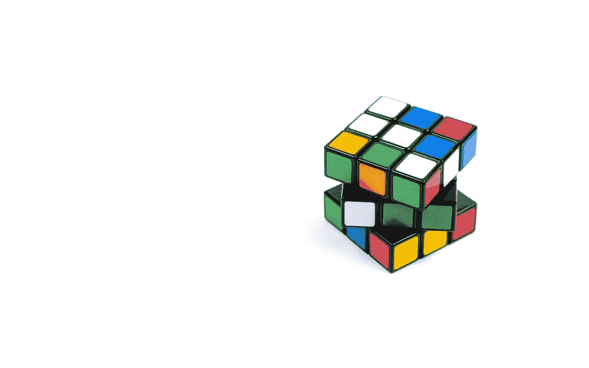

# 拥抱不确定性：模糊逻辑在决策中的力量

> 原文：[`towardsdatascience.com/embracing-uncertainty-the-power-of-fuzzy-logic-in-decision-making-73abb7c30ac4?source=collection_archive---------5-----------------------#2024-10-09`](https://towardsdatascience.com/embracing-uncertainty-the-power-of-fuzzy-logic-in-decision-making-73abb7c30ac4?source=collection_archive---------5-----------------------#2024-10-09)

## **探索模糊逻辑如何增强人工智能、系统思维及其在现实世界中的应用**

 [Niklas Lang](https://medium.com/@niklas_lang?source=post_page---byline--73abb7c30ac4--------------------------------)

·发表于[Towards Data Science](https://towardsdatascience.com/?source=post_page---byline--73abb7c30ac4--------------------------------) ·11 分钟阅读·2024 年 10 月 9 日

--

图片来自[Volodymyr Hryshchenko](https://unsplash.com/@lunarts?utm_source=medium&utm_medium=referral)于[Unsplash](https://unsplash.com/?utm_source=medium&utm_medium=referral)

模糊逻辑是经典逻辑的扩展，使得处理不精确和不确定的数据成为可能。与传统逻辑不同，传统逻辑基于事物要么为真，要么为假的原则，而模糊逻辑则允许介于两者之间的状态。这意味着，状态可以是“部分为真”或“某种程度上为假”。

在本文中，我们详细探讨了模糊逻辑及其概念和基本原理，并尽量使用尽可能简单的例子。我们还展示了使用这种方法的优缺点，并解释了它与传统逻辑的不同之处。

# 什么是模糊逻辑？

模糊逻辑是经典布尔逻辑的扩展，除了真/假或 0/1 这两种状态外，它还允许那些只有部分为真或假程度的陈述，因此这些陈述的值介于 0 和 1 之间。这个概念是由洛特菲·扎德（Lotfi Zadeh）在 1960 年代于加利福尼亚大学发明的。他试图解决教机器说人类自然语言的问题，并发现语言不能仅仅归类为 0 和 1。
