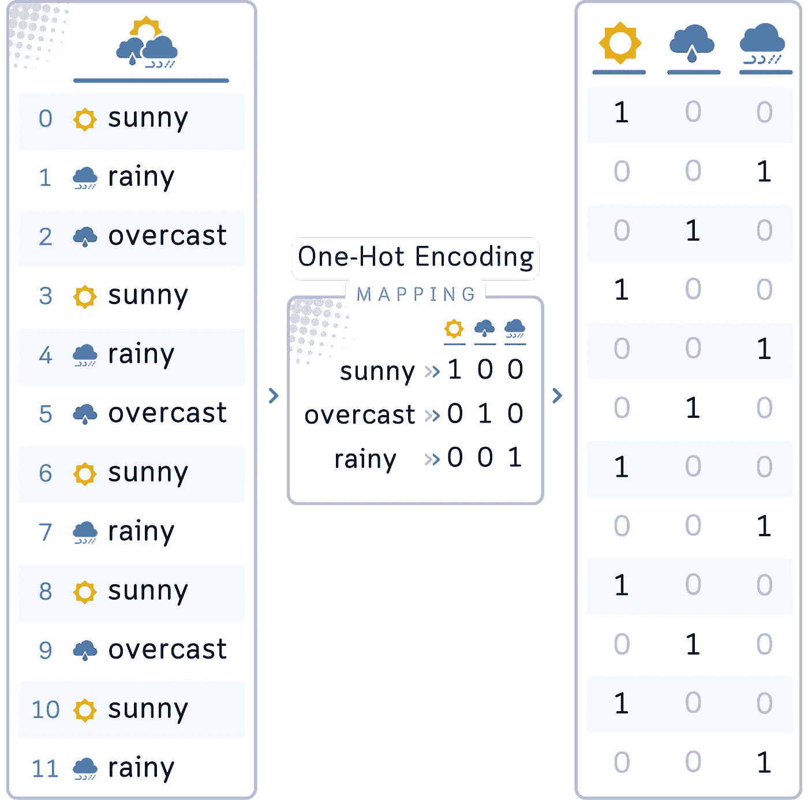
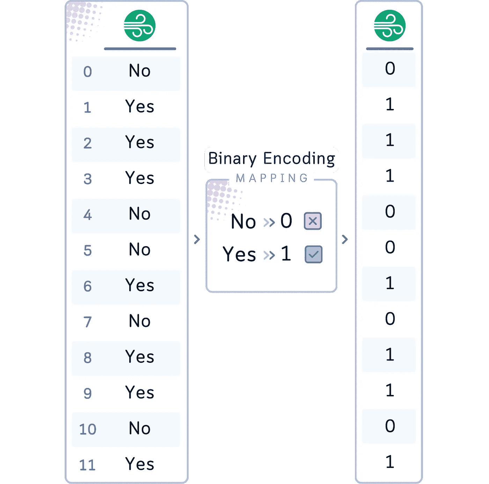

# 类别数据编码，详解：面向初学者的可视化指南与代码示例

> 原文：[`towardsdatascience.com/encoding-categorical-data-explained-a-visual-guide-with-code-example-for-beginners-b169ac4193ae?source=collection_archive---------0-----------------------#2024-09-02`](https://towardsdatascience.com/encoding-categorical-data-explained-a-visual-guide-with-code-example-for-beginners-b169ac4193ae?source=collection_archive---------0-----------------------#2024-09-02)

## 数据预处理

## 六种类别与数字的配对方式

[](https://medium.com/@samybaladram?source=post_page---byline--b169ac4193ae--------------------------------)[](https://towardsdatascience.com/?source=post_page---byline--b169ac4193ae--------------------------------) [Samy Baladram](https://medium.com/@samybaladram?source=post_page---byline--b169ac4193ae--------------------------------)

·发表于 [Towards Data Science](https://towardsdatascience.com/?source=post_page---byline--b169ac4193ae--------------------------------) ·阅读时长 10 分钟·2024 年 9 月 2 日

--


`⛳️ 更多 [数据预处理](https://medium.com/@samybaladram/list/data-preprocessing-17a2c49b44e4) 详解： · 缺失值填补 ▶ 类别编码 · 数据标准化 · 离散化 · 过采样与欠采样 · 数据泄漏预防`

啊，类别数据——我们数据集中那些色彩斑斓的角色，机器似乎总是难以理解它们。在这里，“红色”变成 1，“蓝色”变成 2，而数据科学家则变成了语言翻译者（或者更像是媒人？）。

现在，我知道你在想什么：“编码？不就是给类别分配数字吗？”哦，要是那么简单就好了！我们将探讨六种不同的编码方法，全部基于（再次）一个小小的数据集（当然有视觉示例！）从简单的标签到令人费解的循环转换，你将看到为什么选择正确的编码和选择完美的算法一样重要。


所有视觉内容：作者使用 Canva Pro 创建。为移动设备优化；在桌面端可能显得过大。

# 什么是分类数据，为什么它需要编码？

在我们进入数据集和编码方法之前，让我们先花一点时间理解什么是分类数据，以及为什么它在机器学习中需要特殊处理。

## 什么是分类数据？

分类数据就像我们日常生活中使用的描述性标签。它代表了可以分组为类别的特征或性质。

## 为什么分类数据需要编码？

关键是：大多数机器学习算法就像挑食的食客——它们只能处理数字。它们不能直接理解“晴天”和“雨天”有何不同。这就是编码的作用。编码就像是将这些类别翻译成机器可以理解并操作的语言。

## 分类数据的类型

不是所有的类别都是平等的。我们通常有两种类型：

1.  **名义型**：这些是*没有固有顺序*的类别。

    *示例：* “*Outlook*”（晴天、阴天、雨天）是名义型的。这些天气条件之间没有自然的排序。

1.  **有序型**：这些类别有*有意义的顺序*。

    *示例：* “温度”（非常低、低、高、非常高）是有序的。这些类别从最冷到最热有一个明显的顺序。


## 为什么要关心正确的编码？

1.  它保留了数据中重要的信息。

1.  它可能会显著影响模型的性能。

1.  错误的编码可能会引入不必要的偏差或关系。

想象一下，如果我们将“晴天”编码为 1，将“雨天”编码为 2，模型可能会认为雨天“比”晴天更“大”，这不是我们想要的！

现在我们理解了什么是分类数据以及为什么它需要编码，让我们来看看我们的数据集，并看看如何使用六种不同的编码方法处理其分类变量。

# 数据集

让我们用一个简单的高尔夫数据集来说明我们的编码方法（而且它主要包含分类列）。该数据集记录了不同的天气条件以及高尔夫球场的拥挤程度。


```py
import pandas as pd
import numpy as np

data = {
    'Date': ['03-25', '03-26', '03-27', '03-28', '03-29', '03-30', '03-31', '04-01', '04-02', '04-03', '04-04', '04-05'],
    'Weekday': ['Mon', 'Tue', 'Wed', 'Thu', 'Fri', 'Sat', 'Sun', 'Mon', 'Tue', 'Wed', 'Thu', 'Fri'],
    'Month': ['Mar', 'Mar', 'Mar', 'Mar', 'Mar', 'Mar', 'Mar', 'Apr', 'Apr', 'Apr', 'Apr', 'Apr'],
    'Temperature': ['High', 'Low', 'High', 'Extreme', 'Low', 'High', 'High', 'Low', 'High', 'Extreme', 'High', 'Low'],
    'Humidity': ['Dry', 'Humid', 'Dry', 'Dry', 'Humid', 'Humid', 'Dry', 'Humid', 'Dry', 'Dry', 'Humid', 'Dry'],
    'Wind': ['No', 'Yes', 'Yes', 'Yes', 'No', 'No', 'Yes', 'No', 'Yes', 'Yes', 'No', 'Yes'],
    'Outlook': ['sunny', 'rainy', 'overcast', 'sunny', 'rainy', 'overcast', 'sunny', 'rainy', 'sunny', 'overcast', 'sunny', 'rainy'],
    'Crowdedness': [85, 30, 65, 45, 25, 90, 95, 35, 70, 50, 80, 45]
}
# Create a DataFrame from the dictionary
df = pd.DataFrame(data)
```

如我们所见，我们有许多分类变量。我们的任务是对这些变量进行编码，以便机器学习模型可以使用它们来预测，比如高尔夫球场的拥挤程度。

让我们深入了解一下。

# 方法 1：标签编码

标签编码（Label Encoding）为类别变量中的每个类别分配一个唯一的整数。

**常见用法 👍**：它通常用于有序变量，其中类别之间有明确的顺序，例如教育水平（如小学、中学、高等教育）或产品评分（如 1 星、2 星、3 星）。

**在我们的案例中**：我们可以对高尔夫数据集中的“星期几”列使用标签编码（Label Encoding）。每个星期几都会分配一个唯一的数字（例如，星期一 = 0，星期二 = 1，等等）。然而，我们需要小心，因为这可能意味着星期天（6）比星期六（5）“更大”，这对我们的分析可能没有意义。


```py
# 1\. Label Encoding for Weekday
df['Weekday_label'] = pd.factorize(df['Weekday'])[0]
```

# 方法 2：独热编码

独热编码（One-Hot Encoding）为类别变量中的每个类别创建一个新的二进制列。

**常见用法 👍**：通常用于类别之间没有固有顺序的名义变量。当处理类别数相对较少的变量时，特别有用。

**在我们的案例中**：独热编码非常适合我们的“天气”列。我们将创建三个新列：“天气 _ 晴天”，“天气 _ 阴天”和“天气 _ 雨天”。每一行将会在其中一个列中标记为 1，其他列为 0，表示当天的天气情况。



```py
# 2\. One-Hot Encoding for Outlook
df = pd.get_dummies(df, columns=['Outlook'], prefix='Outlook', dtype=int)
```

# 方法 3：二进制编码

二进制编码（Binary Encoding）将每个类别表示为一个二进制数字（0 和 1）。

**常见用法 👍**：通常用于只有两个类别的情况，大多是是/否的情境。

**在我们的案例中**：尽管我们的“风向”列只有两个类别（是和否），我们可以使用二进制编码来演示这一技术。它将生成一个二进制列，其中一个类别（例如“否”）表示为 0，另一个类别（例如“是”）表示为 1。



```py
# 3\. Binary Encoding for Wind
df['Wind_binary'] = (df['Wind'] == 'Yes').astype(int)
```

# 方法 4：目标编码

目标编码（Target Encoding）将每个类别替换为该类别的目标变量的均值。

**常见用法 👍**：当类别变量和目标变量之间可能存在关系时使用。它特别适用于在数据集中具有合理行数的高基数特征。

**在我们的案例中**：我们可以对“湿度”列应用目标编码，以“拥挤度”作为目标变量。“风向”列中的每个“干燥”或“湿润”都会分别被替换为湿润和干燥天气的平均拥挤度。


```py
# 4\. Target Encoding for Humidity
df['Humidity_target'] = df.groupby('Humidity')['Crowdedness'].transform('mean')
```

# 方法 5：有序编码

有序编码将基于固有顺序的有序整数分配给有序类别。

**常见用法 👍**：它用于有序变量，其中类别的顺序有意义，并且你想保留这个顺序信息。

**在我们的案例中**：有序编码（Ordinal Encoding）非常适合我们的“温度”列。我们可以为顺序指定整数值：低温 = 1，高温 = 2，极端温度 = 3。这保持了温度类别的自然顺序。


```py
# 5\. Ordinal Encoding for Temperature
temp_order = {'Low': 1, 'High': 2, 'Extreme': 3}
df['Temperature_ordinal'] = df['Temperature'].map(temp_order)
```

# 方法 6：循环编码

循环编码/转换将一个循环的分类变量转换为两个数值特征，保留该变量的循环特性。它通常使用正弦和余弦转换来表示循环模式。例如，对于“月份”这一列，我们首先将其转化为数值（1-12），然后创建两个新的特征：

+   Month_cos = cos(2 *π* (*m* — 1) / 12)

+   Month_sin = sin(2 *π* (*m* — 1) / 12)

其中，*m* 是从 1 到 12 的数字，代表从 1 月到 12 月。


想象一下编码就像是在这个奇怪时钟上的(x, y)坐标，从 1 到 12。为了保持循环顺序，我们需要使用两列而不是一列来表示它们。

**常见用途**：它用于具有自然循环顺序的分类变量，如一周中的天、每年的月份或一天中的小时。循环编码尤其在类别之间的“距离”很重要并且会循环（例如，12 月和 1 月之间的距离应该很小，就像其他任何连续的月份之间的距离一样）时特别有用。

**在我们的案例中**：在我们的高尔夫数据集中，最适合进行循环编码的列是‘月份’列。月份有一个明显的循环模式，每年都会重复。这对于我们的高尔夫数据集特别有用，因为它能够捕捉到可能每年都会重复的高尔夫活动的季节性模式。以下是我们如何应用它：


```py
# 6\. Cyclic Encoding for Month
month_order = {'Jan': 1, 'Feb': 2, 'Mar': 3, 'Apr': 4, 'May': 5, 'Jun': 6,
               'Jul': 7, 'Aug': 8, 'Sep': 9, 'Oct': 10, 'Nov': 11, 'Dec': 12}
df['Month_num'] = df['Month'].map(month_order)
df['Month_sin'] = np.sin(2 * np.pi * (df['Month_num']-1) / 12)
df['Month_cos'] = np.cos(2 * np.pi * (df['Month_num']-1) / 12)
```

# 结论：转换的力量（以及理解）

所以，结果就是这样！六种不同的分类数据编码方式，全部应用到我们的高尔夫球场数据集。现在，所有类别都已经转化为数字！


让我们回顾一下每种方法如何处理我们的数据：

1.  **标签编码**：将我们的‘工作日’转化为数字，使得周一为 0，周日为 6——简单但可能具有误导性。

1.  **独热编码**：为‘Outlook’创建了独立的列，让‘sunny’、‘overcast’和‘rainy’独立存在。

1.  **二进制编码**：将我们的‘湿度’压缩为高效的二进制代码，节省空间而不丢失信息。

1.  **目标编码**：用‘拥挤度’的平均值替换了‘有风’的类别，捕捉到隐藏的关系。

1.  **顺序编码**：遵循了‘温度’的自然顺序，从‘非常低’到‘非常高’。

1.  **循环编码**：将‘月份’转换为正弦和余弦分量，保留其圆形特性。

在分类编码中没有一刀切的解决方案。最佳方法取决于你具体的数据、类别的性质和机器学习模型的需求。

对分类数据进行编码在机器学习项目的宏观框架中可能看起来只是一个小步骤，但正是这些看似微小的细节往往能决定模型性能的成败。

## **⚠️ 注意：类别编码中的关键考虑事项**

在我们结束编码讨论时，让我们强调一些需要牢记的关键点：

1.  **信息丢失**：某些编码方法可能导致信息丢失。例如，标签编码可能会强加一个不必要的顺序关系。

1.  **新类别问题**：大多数编码技术在面对测试数据中未出现在训练数据中的类别时会遇到困难。一定要有应对这些“意外来客”的策略。

1.  **维度灾难**：像独热编码这样的技术可能会显著增加特征的数量（想象一下如果你有数百种不同的类别，比如国家或城市！）。你可能需要选择真正重要的特征进行编码（比如将稀有类别归类为“其他”）。

1.  **记录、记录、再记录**：你未来的自己（以及你的同事）会感谢你清楚地记录下你的编码决策。这种透明度有助于结果的可重现性，并帮助理解结果中可能存在的偏差。

所以，编码就是将你的类别数据转换成机器可以理解的语言，同时尽可能保留其含义。这不是要找到完美的编码方法，而是选择最适合你特定需求和限制的方法。用心去处理，你将为你的机器学习工作奠定坚实的基础。

# 🌟 类别编码代码总结

```py
import pandas as pd
import numpy as np

# Create a DataFrame from the dictionary
data = {
    'Date': ['03-25', '03-26', '03-27', '03-28', '03-29', '03-30', '03-31', '04-01', '04-02', '04-03', '04-04', '04-05'],
    'Weekday': ['Mon', 'Tue', 'Wed', 'Thu', 'Fri', 'Sat', 'Sun', 'Mon', 'Tue', 'Wed', 'Thu', 'Fri'],
    'Month': ['Mar', 'Mar', 'Mar', 'Mar', 'Mar', 'Mar', 'Mar', 'Apr', 'Apr', 'Apr', 'Apr', 'Apr'],
    'Temperature': ['High', 'Low', 'High', 'Extreme', 'Low', 'High', 'High', 'Low', 'High', 'Extreme', 'High', 'Low'],
    'Humidity': ['Dry', 'Humid', 'Dry', 'Dry', 'Humid', 'Humid', 'Dry', 'Humid', 'Dry', 'Dry', 'Humid', 'Dry'],
    'Wind': ['No', 'Yes', 'Yes', 'Yes', 'No', 'No', 'Yes', 'No', 'Yes', 'Yes', 'No', 'Yes'],
    'Outlook': ['sunny', 'rainy', 'overcast', 'sunny', 'rainy', 'overcast', 'sunny', 'rainy', 'sunny', 'overcast', 'sunny', 'rainy'],
    'Crowdedness': [85, 30, 65, 45, 25, 90, 95, 35, 70, 50, 80, 45]
}

df = pd.DataFrame(data)

# 1\. Label Encoding for Weekday
df['Weekday_label'] = pd.factorize(df['Weekday'])[0]

# 2\. One-Hot Encoding for Outlook
df = pd.get_dummies(df, columns=['Outlook'], prefix='Outlook')

# 3\. Binary Encoding for Wind
df['Wind_binary'] = (df['Wind'] == 'Yes').astype(int)

# 4\. Target Encoding for Humidity
df['Humidity_target'] = df.groupby('Humidity')['Crowdedness'].transform('mean')

# 5\. Ordinal Encoding for Temperature
temp_order = {'Low': 1, 'High': 2, 'Extreme': 3}
df['Temperature_ordinal'] = df['Temperature'].map(temp_order)

# 6\. Cyclic Encoding for Month
month_order = {'Jan': 1, 'Feb': 2, 'Mar': 3, 'Apr': 4, 'May': 5, 'Jun': 6,
               'Jul': 7, 'Aug': 8, 'Sep': 9, 'Oct': 10, 'Nov': 11, 'Dec': 12}
df['Month_num'] = df['Month'].map(month_order)
df['Month_sin'] = np.sin(2 * np.pi * df['Month_num'] / 12)
df['Month_cos'] = np.cos(2 * np.pi * df['Month_num'] / 12)

# Select and rearrange numerical columns
numerical_columns = [
    'Date','Weekday_label',
    'Month_sin', 'Month_cos',
    'Temperature_ordinal',
    'Humidity_target',
    'Wind_binary',
    'Outlook_sunny', 'Outlook_overcast', 'Outlook_rainy', 
    'Crowdedness'
]

# Display the rearranged numerical columns
print(df[numerical_columns].round(3))
```

## 技术环境

本文使用 Python 3.7、pandas 2.1 和 numpy 1.26。虽然讨论的概念一般适用，但不同版本的代码实现可能会略有不同。

## 关于插图

除非另有说明，所有图像均由作者创建，且包含来自 Canva Pro 的授权设计元素。


要查看简洁的视觉总结，请访问[配套的 Instagram 帖子](https://www.instagram.com/p/C_a4DWEy5IA)。

𝙎𝙚𝙚 𝙢𝙤𝙧𝙚 𝘿𝙖𝙩𝙖 𝙋𝙧𝙚𝙥𝙧𝙤𝙘𝙚𝙨𝙨𝙞𝙣𝙜 𝙢𝙚𝙩𝙝𝙤𝙙𝙨 𝙝𝙚𝙧𝙚:


[Samy Baladram](https://medium.com/@samybaladram?source=post_page-----b169ac4193ae--------------------------------)

## 数据预处理

[查看列表](https://medium.com/@samybaladram/list/data-preprocessing-17a2c49b44e4?source=post_page-----b169ac4193ae--------------------------------)6 篇故事

𝙔𝙤𝙪 𝙢𝙞𝙜𝙝𝙩 𝙖𝙡𝙨𝙤 𝙡𝙞𝙠𝙚:


[Samy Baladram](https://medium.com/@samybaladram?source=post_page-----b169ac4193ae--------------------------------)

## 分类算法

[查看列表](https://medium.com/@samybaladram/list/classification-algorithms-b3586f0a772c?source=post_page-----b169ac4193ae--------------------------------)8 篇故事

[Samy Baladram](https://medium.com/@samybaladram?source=post_page-----b169ac4193ae--------------------------------)

## 回归算法

[查看列表](https://medium.com/@samybaladram/list/regression-algorithms-b0b6959f1b39?source=post_page-----b169ac4193ae--------------------------------)5 篇故事
