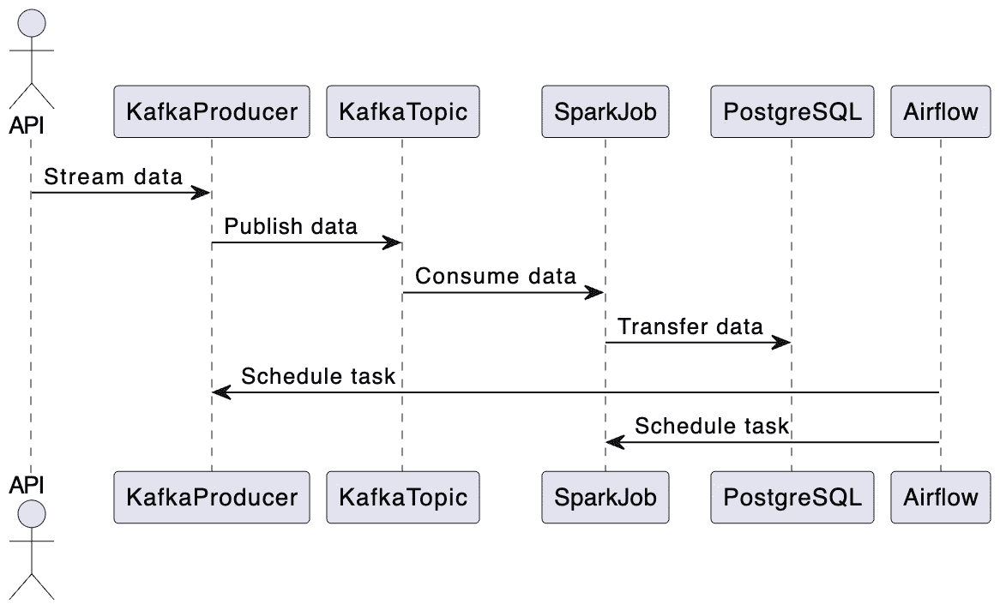
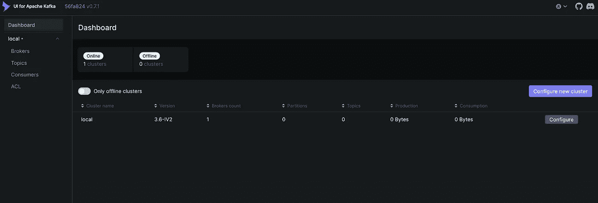
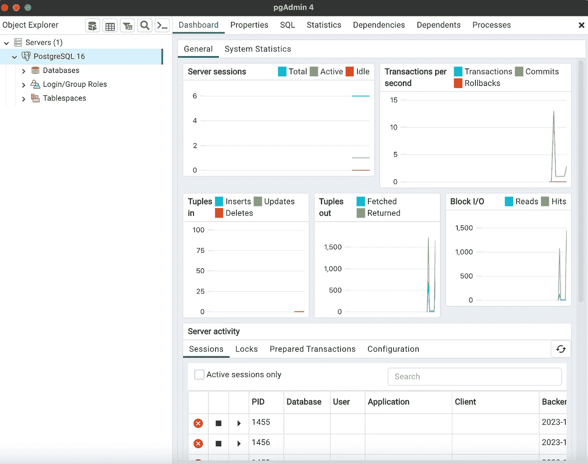
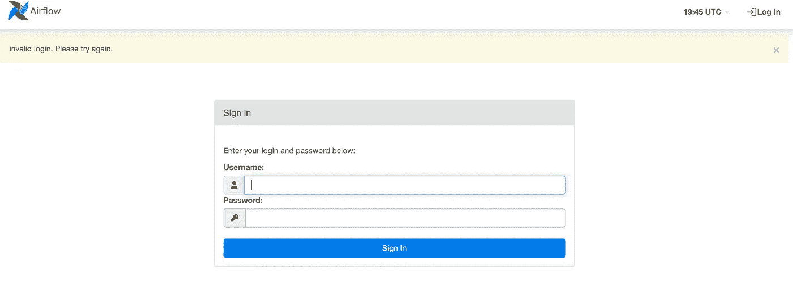
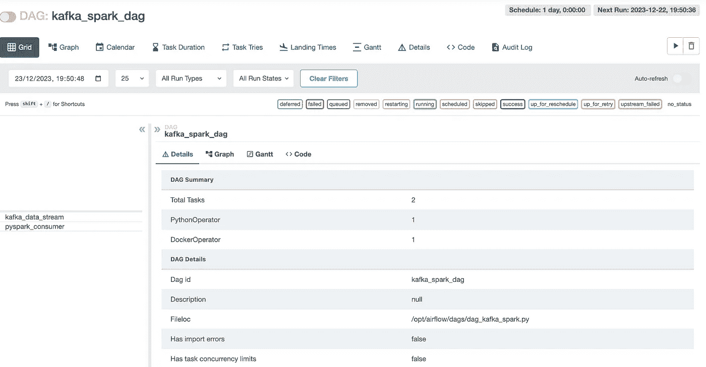
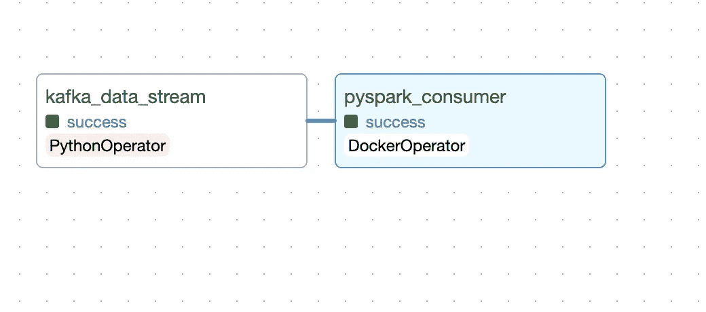

# 基于真实数据的端到端数据工程系统，使用 Kafka、Spark、Airflow、Postgres 和 Docker

> 原文：[`towardsdatascience.com/end-to-end-data-engineering-system-on-real-data-with-kafka-spark-airflow-postgres-and-docker-a70e18df4090?source=collection_archive---------0-----------------------#2024-01-19`](https://towardsdatascience.com/end-to-end-data-engineering-system-on-real-data-with-kafka-spark-airflow-postgres-and-docker-a70e18df4090?source=collection_archive---------0-----------------------#2024-01-19)

[](https://medium.com/@hamzagharbi_19502?source=post_page---byline--a70e18df4090--------------------------------)[](https://towardsdatascience.com/?source=post_page---byline--a70e18df4090--------------------------------) [Hamza Gharbi](https://medium.com/@hamzagharbi_19502?source=post_page---byline--a70e18df4090--------------------------------)

·发表于 [Towards Data Science](https://towardsdatascience.com/?source=post_page---byline--a70e18df4090--------------------------------) ·16 分钟阅读·2024 年 1 月 19 日

--

本文是一个分为两个主要阶段的项目的一部分。第一阶段专注于构建数据管道，包括从 API 获取数据并将其存储到 PostgreSQL 数据库中。在第二阶段，我们将开发一个应用程序，使用语言模型与该数据库进行交互。

该项目适合那些刚接触数据系统或语言模型应用的新人，项目分为两个部分：

+   本文指导您通过构建数据管道，利用 **Kafka** 进行数据流处理，使用 **Airflow** 进行编排，利用 **Spark** 进行数据转化，使用 **PostgreSQL** 进行数据存储。为了设置和运行这些工具，我们将使用 **Docker**。

+   第二篇文章将在稍后发布，将深入探讨如何使用如 LangChain 等工具创建代理与外部数据库进行通信。

该项目的第一部分非常适合数据工程初学者，同时也适合那些希望加深对整个数据处理过程理解的数据科学家和机器学习工程师。亲自使用这些数据工程工具非常有益，它有助于完善机器学习模型的创建和扩展，确保它们在实际环境中有效运行。

本文更多关注工具的实际应用，而不是理论层面的内容。有关这些工具内部如何运作的详细理解，网上有很多优秀的资源可供参考。

# 概述

让我们一步一步地拆解数据管道过程：

1.  数据流：最初，数据通过 API 流入 Kafka 主题。

1.  数据处理：Spark 作业接管处理，从 Kafka 主题消费数据，并将其转移到 PostgreSQL 数据库中。

1.  使用 Airflow 进行调度：流任务和 Spark 作业都通过 Airflow 进行编排。虽然在实际场景中，Kafka 生产者会持续监听 API，但为了演示的目的，我们将调度 Kafka 流任务每天运行一次。一旦流处理完成，Spark 作业就会处理数据，并为 LLM 应用程序做好准备。

所有这些工具将使用 Docker 构建和运行，更具体地说是使用 [docker-compose](https://docs.docker.com/compose/)。



数据管道概览。图片由作者提供。

现在我们有了管道的蓝图，让我们深入探讨技术细节！

# 本地设置

首先，您可以使用以下命令将 Github 仓库克隆到本地计算机：

```py
git clone https://github.com/HamzaG737/data-engineering-project.git
```

以下是项目的整体结构：

```py
├── LICENSE
├── README.md
├── airflow
│   ├── Dockerfile
│   ├── __init__.py
│   └── dags
│       ├── __init__.py
│       └── dag_kafka_spark.py
├── data
│   └── last_processed.json
├── docker-compose-airflow.yaml
├── docker-compose.yml
├── kafka
├── requirements.txt
├── spark
│   └── Dockerfile
└── src
    ├── __init__.py
    ├── constants.py
    ├── kafka_client
    │   ├── __init__.py
    │   └── kafka_stream_data.py
    └── spark_pgsql
        └── spark_streaming.py
```

+   `airflow` 目录包含用于设置 Airflow 的自定义 Dockerfile 以及一个 `[dags](https://airflow.apache.org/docs/apache-airflow/stable/core-concepts/dags.html)` 目录，用于创建和调度任务。

+   `data` 目录包含 *last_processed.json 文件*，这是 Kafka 流任务的重要文件。其具体作用将在 Kafka 部分详细说明。

+   `docker-compose-airflow.yaml` 文件定义了运行 Airflow 所需的所有服务。

+   `docker-compose.yaml` 文件指定了 Kafka 服务，并包含一个 docker-proxy。这个代理对于通过 Airflow 中的 docker-operator 执行 Spark 作业至关重要，这一概念将在后面详细介绍。

+   `spark` 目录包含用于 Spark 设置的自定义 Dockerfile。

+   `src` 目录包含运行应用程序所需的 Python 模块。

为了设置本地开发环境，首先安装所需的 Python 包。唯一必需的包是 psycopg2-binary。您可以选择只安装这个包，或者安装 `requirements.txt` 文件中列出的所有包。要安装所有包，请使用以下命令：

```py
pip install -r requirements.txt
```

接下来让我们一步一步地深入项目细节。

# 关于 API

该 API 是来自法国公共服务的 [RappelConso](https://api.gouv.fr/les-api/api-rappel-conso)。它提供了与法国专业人员声明的产品召回相关的数据。数据为法语，并最初包含 **31** 列（或字段）。其中一些最重要的字段包括：

+   *reference_fiche (参考表格)*：召回产品的唯一标识符。它将在后续作为我们的 Postgres 数据库的主键。

+   *categorie_de_produit (产品类别)*：例如食品、电器、工具、交通工具等……

+   *sous_categorie_de_produit (产品子类别)*：例如，我们可以将肉类、乳制品、谷物等作为食品类别的子类别。

+   *motif_de_rappel (召回原因)*：显而易见，也是最重要的字段之一。

+   *date_de_publication* 表示发布日期。

+   *risques_encourus_par_le_consommateur* 包含消费者在使用产品时可能遇到的风险。

+   还有一些字段对应不同的链接，例如产品图片链接、分销商列表链接等。

您可以通过以下[链接](https://data.economie.gouv.fr/explore/dataset/rappelconso0/api/?disjunctive.categorie_de_produit=&sort=date_de_publication)查看一些示例并手动查询数据集记录。

我们在几个关键方面优化了数据列：

1.  类似 `ndeg_de_version` 和 `rappelguid` 这样的列属于版本控制系统的一部分，已经被删除，因为它们在我们的项目中不再需要。

1.  我们将涉及消费者风险的列——`risques_encourus_par_le_consommateur` 和 `description_complementaire_du_risque`——合并，以便更清晰地了解产品风险。

1.  `date_debut_fin_de_commercialisation` 列表示营销期，已被拆分为两个独立的列。此拆分便于查询产品营销的开始或结束日期。

1.  我们已从除链接、参考编号和日期之外的所有列中移除重音符号。这一点很重要，因为一些文本处理工具对带重音的字符处理不佳。

要详细查看这些更改，请查看我们的转换脚本 `src/kafka_client/transformations.py`。更新后的列列表可以在 `src/constants.py` 中的 `DB_FIELDS` 找到。

# Kafka 流处理

为了避免每次运行流式任务时都发送所有的 API 数据，我们定义了一个本地 JSON 文件，里面包含最新流式处理的最后发布日期。然后我们将使用此日期作为新流式任务的起始日期。

举个例子，假设最新召回的产品发布日期为**2023 年 11 月 22 日**。如果我们假设在此日期之前的所有召回产品信息已经保存在我们的 Postgres 数据库中，我们现在可以从 11 月 22 日开始流式传输数据。请注意，这里有重叠，因为我们可能会遇到没有处理完 11 月 22 日所有数据的情况。

该文件保存在 `./data/last_processed.json` 中，格式如下：

```py
{last_processed:"2023-11-22"}
```

默认情况下，该文件是一个空 JSON 文件，这意味着我们的第一个流式任务将处理大约 10,000 条 API 记录。

请注意，在生产环境中，将最后处理日期存储在本地文件中的方法不可行，涉及外部数据库或对象存储服务的其他方法可能更为合适。

Kafka 流处理的代码可以在 `./src/kafka_client/kafka_stream_data.py` 中找到，主要涉及从 API 查询数据、进行转换、删除潜在重复项、更新最后的发布日期并使用 Kafka 生产者提供数据。

下一步是运行下面定义的 Docker Compose 中的 Kafka 服务：

```py
version: '3'

services:
  kafka:
    image: 'bitnami/kafka:latest'
    ports:
      - '9094:9094'
    networks:
      - airflow-kafka
    environment:
      - KAFKA_CFG_NODE_ID=0
      - KAFKA_CFG_PROCESS_ROLES=controller,broker
      - KAFKA_CFG_LISTENERS=PLAINTEXT://:9092,CONTROLLER://:9093,EXTERNAL://:9094
      - KAFKA_CFG_ADVERTISED_LISTENERS=PLAINTEXT://kafka:9092,EXTERNAL://localhost:9094
      - KAFKA_CFG_LISTENER_SECURITY_PROTOCOL_MAP=CONTROLLER:PLAINTEXT,EXTERNAL:PLAINTEXT,PLAINTEXT:PLAINTEXT
      - KAFKA_CFG_CONTROLLER_QUORUM_VOTERS=0@kafka:9093
      - KAFKA_CFG_CONTROLLER_LISTENER_NAMES=CONTROLLER
    volumes:
      - ./kafka:/bitnami/kafka

  kafka-ui:
    container_name: kafka-ui-1
    image: provectuslabs/kafka-ui:latest
    ports:
      - 8800:8080  
    depends_on:
      - kafka
    environment:
      KAFKA_CLUSTERS_0_NAME: local
      KAFKA_CLUSTERS_0_BOOTSTRAPSERVERS: PLAINTEXT://kafka:9092
      DYNAMIC_CONFIG_ENABLED: 'true'
    networks:
      - airflow-kafka

networks:
  airflow-kafka:
    external: true
```

此文件的关键亮点如下：

+   **kafka** 服务使用了基础镜像 `bitnami/kafka`。

+   我们仅配置了一个 **broker** 服务，这对于我们的小项目来说足够了。Kafka broker 负责接收来自生产者（数据源）的消息，存储这些消息，并将它们传递给消费者（数据的接收端或最终用户）。broker 会监听端口 9092 用于集群内的通信，并监听端口 9094 用于外部通信，允许集群外的客户端连接到 Kafka broker。

+   在 **volumes** 部分，我们将本地目录 `kafka` 映射到 docker 容器目录 `/*bitnami/kafka*`，以确保数据的持久性，并且可以从主机系统检查 Kafka 的数据。

+   我们设置了服务 **kafka-ui**，它使用了 docker 镜像 `provectuslabs/kafka-ui:latest`。该工具提供了一个用户界面，用于与 Kafka 集群进行交互。这对于监控和管理 Kafka 主题和消息尤其有用。

+   为了确保 **kafka** 和作为外部服务运行的 **airflow** 之间的通信，我们将使用一个外部网络 **airflow-kafka**。

在运行 Kafka 服务之前，让我们使用以下命令创建 airflow-kafka 网络：

```py
docker network create airflow-kafka
```

现在，一切准备就绪，可以最终启动我们的 kafka 服务了。

```py
docker-compose up 
```

服务启动后，访问 kafka-ui，网址为 [`localhost:8800/`](http://localhost:8000/)。通常，您应该看到类似以下内容：



Kafka UI 概览。图片来源：作者。

接下来，我们将创建一个主题，用来存储 API 消息。在左侧点击 Topics，然后在左上角点击 Add a topic。我们的主题将命名为 **rappel_conso**，由于我们只有一个 broker，因此将 **replication factor** 设置为 **1**。我们还将 **partitions** 数量设置为 **1**，因为我们每次只有一个消费者线程，所以不需要并行处理。最后，我们可以将数据保留时间设置为一个较小的值，比如一小时，因为我们会在 kafka 流处理任务之后立即运行 spark 任务，因此不需要在 Kafka 主题中长期保留数据。

# Postgres 设置

在设置 spark 和 airflow 配置之前，让我们创建 Postgres 数据库，以便持久化我们的 API 数据。我使用了 **pgadmin 4** 工具来完成此任务，不过任何其他 Postgres 开发平台也能完成这项工作。

要安装 postgres 和 pgadmin，请访问此链接 [`www.postgresql.org/download/`](https://www.postgresql.org/download/)，根据您的操作系统下载相应的安装包。然后，在安装 postgres 时，您需要设置一个密码，稍后我们将使用该密码从 spark 环境连接到数据库。您也可以将端口保留为 5432。

如果您的安装成功，您可以启动 pgadmin，并且应该看到类似下面的窗口：



pgAdmin 界面的概述。图片由作者提供。

因为我们要创建的表格有很多列，所以我们选择使用**psycopg2**（一个适用于 Python 的 PostgreSQL 数据库适配器）编写脚本来创建表格并添加其列。

你可以通过以下命令运行脚本：

```py
python scripts/create_table.py
```

请注意，在脚本中，我将 PostgreSQL 密码保存为环境变量并命名为 *POSTGRES_PASSWORD*。因此，如果你使用其他方法访问密码，你需要相应地修改脚本。

# Spark 配置

在设置好我们的 PostgreSQL 数据库后，让我们深入了解 Spark 作业的细节。目标是将来自 Kafka 主题 *rappel_conso* 的数据流式传输到 PostgreSQL 表 *rappel_conso_table*。

```py
from pyspark.sql import SparkSession
from pyspark.sql.types import (
    StructType,
    StructField,
    StringType,
)
from pyspark.sql.functions import from_json, col
from src.constants import POSTGRES_URL, POSTGRES_PROPERTIES, DB_FIELDS
import logging

logging.basicConfig(
    level=logging.INFO, format="%(asctime)s:%(funcName)s:%(levelname)s:%(message)s"
)

def create_spark_session() -> SparkSession:
    spark = (
        SparkSession.builder.appName("PostgreSQL Connection with PySpark")
        .config(
            "spark.jars.packages",
            "org.postgresql:postgresql:42.5.4,org.apache.spark:spark-sql-kafka-0-10_2.12:3.5.0",

        )
        .getOrCreate()
    )

    logging.info("Spark session created successfully")
    return spark

def create_initial_dataframe(spark_session):
    """
    Reads the streaming data and creates the initial dataframe accordingly.
    """
    try:
        # Gets the streaming data from topic random_names
        df = (
            spark_session.readStream.format("kafka")
            .option("kafka.bootstrap.servers", "kafka:9092")
            .option("subscribe", "rappel_conso")
            .option("startingOffsets", "earliest")
            .load()
        )
        logging.info("Initial dataframe created successfully")
    except Exception as e:
        logging.warning(f"Initial dataframe couldn't be created due to exception: {e}")
        raise

    return df

def create_final_dataframe(df):
    """
    Modifies the initial dataframe, and creates the final dataframe.
    """
    schema = StructType(
        [StructField(field_name, StringType(), True) for field_name in DB_FIELDS]
    )
    df_out = (
        df.selectExpr("CAST(value AS STRING)")
        .select(from_json(col("value"), schema).alias("data"))
        .select("data.*")
    )
    return df_out

def start_streaming(df_parsed, spark):
    """
    Starts the streaming to table spark_streaming.rappel_conso in postgres
    """
    # Read existing data from PostgreSQL
    existing_data_df = spark.read.jdbc(
        POSTGRES_URL, "rappel_conso", properties=POSTGRES_PROPERTIES
    )

    unique_column = "reference_fiche"

    logging.info("Start streaming ...")
    query = df_parsed.writeStream.foreachBatch(
        lambda batch_df, _: (
            batch_df.join(
                existing_data_df, batch_df[unique_column] == existing_data_df[unique_column], "leftanti"
            )
            .write.jdbc(
                POSTGRES_URL, "rappel_conso", "append", properties=POSTGRES_PROPERTIES
            )
        )
    ).trigger(once=True) \
        .start()

    return query.awaitTermination()

def write_to_postgres():
    spark = create_spark_session()
    df = create_initial_dataframe(spark)
    df_final = create_final_dataframe(df)
    start_streaming(df_final, spark=spark)

if __name__ == "__main__":
    write_to_postgres()
```

让我们分解一下 Spark 作业的主要亮点和功能：

1.  首先，我们创建 Spark 会话

```py
def create_spark_session() -> SparkSession:
    spark = (
        SparkSession.builder.appName("PostgreSQL Connection with PySpark")
        .config(
            "spark.jars.packages",
            "org.postgresql:postgresql:42.5.4,org.apache.spark:spark-sql-kafka-0-10_2.12:3.5.0",

        )
        .getOrCreate()
    )

    logging.info("Spark session created successfully")
    return spark
```

2\. `create_initial_dataframe` 函数使用 Spark 的结构化流式处理从 Kafka 主题中摄取流式数据。

```py
def create_initial_dataframe(spark_session):
    """
    Reads the streaming data and creates the initial dataframe accordingly.
    """
    try:
        # Gets the streaming data from topic random_names
        df = (
            spark_session.readStream.format("kafka")
            .option("kafka.bootstrap.servers", "kafka:9092")
            .option("subscribe", "rappel_conso")
            .option("startingOffsets", "earliest")
            .load()
        )
        logging.info("Initial dataframe created successfully")
    except Exception as e:
        logging.warning(f"Initial dataframe couldn't be created due to exception: {e}")
        raise

    return df
```

3\. 一旦数据被摄取，`create_final_dataframe` 将其转换。它应用一个架构（由列 **DB_FIELDS** 定义）到传入的 JSON 数据，确保数据结构化并准备好进行进一步处理。

```py
def create_final_dataframe(df):
    """
    Modifies the initial dataframe, and creates the final dataframe.
    """
    schema = StructType(
        [StructField(field_name, StringType(), True) for field_name in DB_FIELDS]
    )
    df_out = (
        df.selectExpr("CAST(value AS STRING)")
        .select(from_json(col("value"), schema).alias("data"))
        .select("data.*")
    )
    return df_out
```

4\. `start_streaming` 函数读取数据库中的现有数据，将其与传入的数据流进行比较，并追加新记录。

```py
def start_streaming(df_parsed, spark):
    """
    Starts the streaming to table spark_streaming.rappel_conso in postgres
    """
    # Read existing data from PostgreSQL
    existing_data_df = spark.read.jdbc(
        POSTGRES_URL, "rappel_conso", properties=POSTGRES_PROPERTIES
    )

    unique_column = "reference_fiche"

    logging.info("Start streaming ...")
    query = df_parsed.writeStream.foreachBatch(
        lambda batch_df, _: (
            batch_df.join(
                existing_data_df, batch_df[unique_column] == existing_data_df[unique_column], "leftanti"
            )
            .write.jdbc(
                POSTGRES_URL, "rappel_conso", "append", properties=POSTGRES_PROPERTIES
            )
        )
    ).trigger(once=True) \
        .start()

    return query.awaitTermination()
```

Spark 作业的完整代码位于文件 `src/spark_pgsql/spark_streaming.py` 中。我们将使用 Airflow 的 DockerOperator 来运行这个作业，具体操作将在接下来的部分中解释。

让我们来详细了解一下创建我们需要的 Docker 镜像的过程，以便运行我们的 Spark 作业。以下是参考的 Dockerfile：

```py
FROM bitnami/spark:latest

WORKDIR /opt/bitnami/spark

RUN pip install py4j

COPY ./src/spark_pgsql/spark_streaming.py ./spark_streaming.py
COPY ./src/constants.py ./src/constants.py

ENV POSTGRES_DOCKER_USER=host.docker.internal
ARG POSTGRES_PASSWORD
ENV POSTGRES_PASSWORD=$POSTGRES_PASSWORD
```

在这个 Dockerfile 中，我们以 `bitnami/spark` 镜像作为基础镜像。它是一个现成的 Spark 镜像。然后我们安装 `py4j`，这是 Spark 与 Python 配合使用所需的工具。

环境变量 `POSTGRES_DOCKER_USER` 和 `POSTGRES_PASSWORD` 用于连接 PostgreSQL 数据库。由于我们的数据库在主机上，我们使用 `host.docker.internal` 作为用户。这样可以让我们的 Docker 容器访问主机上的服务，这里是 PostgreSQL 数据库。PostgreSQL 密码作为构建参数传递，因此它不会被硬编码到镜像中。

需要注意的是，这种方法，特别是在构建时传递数据库密码，可能不适用于生产环境，因为它可能暴露敏感信息。在这种情况下，应考虑使用更安全的方法，例如 Docker BuildKit。

现在，让我们构建 Spark 的 Docker 镜像：

```py
docker build -f spark/Dockerfile -t rappel-conso/spark:latest --build-arg POSTGRES_PASSWORD=$POSTGRES_PASSWORD  .
```

这个命令将构建镜像`rappel-conso/spark:latest`。该镜像包含运行我们的 Spark 作业所需的一切，并将由 Airflow 的 DockerOperator 用来执行作业。记得在运行此命令时将 `$POSTGRES_PASSWORD` 替换为你实际的 PostgreSQL 密码。

# Airflow

如前所述，Apache Airflow 作为数据管道中的协调工具，负责调度和管理任务的工作流，确保它们按照指定的顺序和定义的条件执行。在我们的系统中，Airflow 用于自动化从 Kafka 流处理到 Spark 处理的数据流动。

## Airflow DAG

让我们来看一下有向无环图（DAG），它将概述任务的顺序和依赖关系，使得 Airflow 可以管理这些任务的执行。

```py
start_date = datetime.today() - timedelta(days=1)

default_args = {
    "owner": "airflow",
    "start_date": start_date,
    "retries": 1,  # number of retries before failing the task
    "retry_delay": timedelta(seconds=5),
}

with DAG(
    dag_id="kafka_spark_dag",
    default_args=default_args,
    schedule_interval=timedelta(days=1),
    catchup=False,
) as dag:

    kafka_stream_task = PythonOperator(
        task_id="kafka_data_stream",
        python_callable=stream,
        dag=dag,
    )

    spark_stream_task = DockerOperator(
        task_id="pyspark_consumer",
        image="rappel-conso/spark:latest",
        api_version="auto",
        auto_remove=True,
        command="./bin/spark-submit --master local[*] --packages org.postgresql:postgresql:42.5.4,org.apache.spark:spark-sql-kafka-0-10_2.12:3.5.0 ./spark_streaming.py",
        docker_url='tcp://docker-proxy:2375',
        environment={'SPARK_LOCAL_HOSTNAME': 'localhost'},
        network_mode="airflow-kafka",
        dag=dag,
    )

    kafka_stream_task >> spark_stream_task
```

下面是该配置中的关键元素：

+   任务设置为每天执行。

+   第一个任务是 **Kafka 流处理任务**。它通过 **PythonOperator** 实现，用于运行 Kafka 流处理函数。该任务将数据从 *RappelConso* API 流式传输到 Kafka 主题，启动数据处理工作流。

+   下游任务是 **Spark 流处理任务**。它使用 **DockerOperator** 执行。该任务运行一个包含我们自定义 Spark 镜像的 Docker 容器，负责处理从 Kafka 接收到的数据。

+   任务按顺序排列，其中 Kafka 流任务在 Spark 处理任务之前执行。这个顺序至关重要，确保数据在 Spark 处理之前，首先被流式传输并加载到 Kafka 中。

## 关于 DockerOperator

使用 DockerOperator 使我们能够运行与任务对应的 Docker 容器。这种方法的主要优势是更易于管理包、更好的隔离性和更强的可测试性。我们将通过 Spark 流处理任务演示如何使用这个操作符。

下面是一些关于用于 Spark 流处理任务的 Docker Operator 的关键细节：

+   我们将使用在*Spark 设置*部分指定的镜像`rappel-conso/spark:latest`。

+   该命令将在容器内运行 Spark 提交命令，指定 master 为本地模式，包含用于 PostgreSQL 和 Kafka 集成的必要包，并指向包含 Spark 作业逻辑的 `spark_streaming.py` 脚本。

+   **docker_url** 表示运行 Docker 守护进程的主机的 URL。理想的解决方案是将其设置为 `unix://var/run/docker.sock` 并将 `var/run/docker.sock` 挂载到 Airflow Docker 容器中。我们在这种方法中遇到的一个问题是，在 Airflow 容器内部使用该套接字文件时出现权限错误。常见的解决方法是通过 `chmod 777 var/run/docker.sock` 更改权限，但这会带来显著的安全风险。为了解决这个问题，我们实现了一种更安全的解决方案，使用 `bobrik/socat` 作为 Docker 代理。这个代理在 Docker Compose 服务中定义，监听 TCP 端口 2375，并将请求转发到 Docker 套接字：

```py
 docker-proxy:
    image: bobrik/socat
    command: "TCP4-LISTEN:2375,fork,reuseaddr UNIX-CONNECT:/var/run/docker.sock"
    ports:
      - "2376:2375"
    volumes:
      - /var/run/docker.sock:/var/run/docker.sock
    networks:
      - airflow-kafka
```

在 DockerOperator 中，我们可以通过 `tcp://docker-proxy:2375` URL 访问主机 Docker 的 `/var/run/docker.sock`，如 [这里](https://medium.com/@benjcabalonajr_56579/using-docker-operator-on-airflow-running-inside-a-docker-container-7df5286daaa5) 和 [这里](https://stackoverflow.com/a/70100729) 所述。

+   最后，我们将网络模式设置为 **airflow-kafka**。这样可以让我们使用与代理和运行 Kafka 的 Docker 相同的网络。这一点至关重要，因为 Spark 任务将消费来自 Kafka 主题的数据，所以我们必须确保这两个容器能够互相通信。

在定义了 DAG 的逻辑之后，现在让我们来理解一下 `docker-compose-airflow.yaml` 文件中的 airflow 服务配置。

## Airflow 配置

airflow 的 compose 文件是从官方的 apache airflow docker-compose 文件修改而来的。你可以通过访问这个 [链接](https://airflow.apache.org/docs/apache-airflow/2.7.3/docker-compose.yaml) 来查看原始文件。

正如这篇 [文章](https://datatalks.club/blog/how-to-setup-lightweight-local-version-for-airflow.html) 所指出的，提议的这个版本的 airflow 资源消耗较大，主要是因为核心执行器被设置为 **CeleryExecutor**，它更适合分布式和大规模数据处理任务。由于我们的工作负载较小，使用单节点的 **LocalExecutor** 就足够了。

这里是我们在 airflow 的 docker-compose 配置中所做更改的概览：

+   我们将环境变量 AIRFLOW__CORE__EXECUTOR 设置为 **LocalExecutor**。

+   我们移除了 **airflow-worker** 和 **flower** 服务，因为它们仅适用于 Celery 执行器。我们还移除了 **redis** 缓存服务，因为它作为 Celery 的后端服务运行。由于我们不打算使用 **airflow-triggerer**，所以也将其移除。

+   我们将其余服务（主要是 **scheduler** 和 **webserver**）的基础镜像 `${AIRFLOW_IMAGE_NAME:-apache/airflow:2.7.3}` 替换为一个自定义镜像，该镜像将在运行 docker-compose 时构建。

```py
version: '3.8'
x-airflow-common:
  &airflow-common
  build:
    context: .
    dockerfile: ./airflow_resources/Dockerfile
  image: de-project/airflow:latest
```

+   我们挂载了 airflow 所需的必要卷。AIRFLOW_PROJ_DIR 指定了稍后定义的 airflow 项目目录。我们还将网络设置为 **airflow-kafka**，以便能够与 Kafka 启动服务器通信。

```py
volumes:
  - ${AIRFLOW_PROJ_DIR:-.}/dags:/opt/airflow/dags
  - ${AIRFLOW_PROJ_DIR:-.}/logs:/opt/airflow/logs
  - ${AIRFLOW_PROJ_DIR:-.}/config:/opt/airflow/config
  - ./src:/opt/airflow/dags/src
  - ./data/last_processed.json:/opt/airflow/data/last_processed.json
user: "${AIRFLOW_UID:-50000}:0"
networks:
  - airflow-kafka
```

接下来，我们需要创建一些环境变量，供 docker-compose 使用：

```py
echo -e "AIRFLOW_UID=$(id -u)\nAIRFLOW_PROJ_DIR=\"./airflow_resources\"" > .env
```

`AIRFLOW_UID` 代表 Airflow 容器中的用户 ID，`AIRFLOW_PROJ_DIR` 代表 airflow 项目目录。

现在一切已经设置好，可以运行你的 airflow 服务了。你可以使用以下命令启动它：

```py
 docker compose -f docker-compose-airflow.yaml up
```

然后，若要访问 airflow 用户界面，你可以访问这个网址 `http://localhost:8080`。



Airflow 登录窗口。图片来自作者。

默认情况下，用户名和密码都是 **airflow**。登录后，你将看到 airflow 自带的 Dags 列表。找到我们项目的 dag **kafka_spark_dag** 并点击它。



airflow 中任务窗口的概览。图片来自作者。

你可以通过点击 **DAG: kafka_spark_dag** 旁边的按钮来启动任务。

接下来，你可以在图表标签中查看任务的状态。当任务变为绿色时，表示完成。因此，当一切完成时，应该像这样：



作者提供的图片。

要验证`rappel_conso_table`是否已填充数据，请在 pgAdmin 查询工具中使用以下 SQL 查询：

```py
SELECT count(*) FROM rappel_conso_table
```

当我在 2024 年 1 月运行时，查询返回了总共 10022 行。你的结果应该也在这个范围内。

# 结论

本文成功展示了如何使用 Kafka、Airflow、Spark、PostgreSQL 和 Docker 构建一个基本而功能齐全的数据工程管道。本文主要面向初学者和数据工程领域的新手，提供了一种动手实践的方式来理解和实现数据流、处理和存储中的关键概念。

在本指南中，我们详细介绍了管道的每个组件，从设置 Kafka 进行数据流处理，到使用 Airflow 进行任务编排，再到使用 Spark 处理数据并将其存储在 PostgreSQL 中。整个项目中使用 Docker 简化了设置，并确保不同环境之间的一致性。

需要注意的是，虽然这个设置非常适合学习和小规模项目，但要将其扩展到生产环境，仍然需要考虑其他因素，尤其是在安全性和性能优化方面。未来的改进可能包括整合更先进的数据处理技术、探索实时分析，甚至扩展管道以涵盖更多复杂的数据源。

本质上，这个项目作为一个实践起点，旨在帮助那些想要深入数据工程的人。它为理解基础知识打下了基础，为进一步探索该领域提供了坚实的基础。

在第二部分，我们将探讨如何有效地使用存储在 PostgreSQL 数据库中的数据。我们将介绍由大型语言模型（LLMs）驱动的代理以及各种工具，帮助我们使用自然语言查询与数据库进行交互。所以，敬请期待！

# 目标是

+   LinkedIn: [`www.linkedin.com/in/hamza-gharbi-043045151/`](https://www.linkedin.com/in/hamza-gharbi-043045151/)

+   Twitter: [`twitter.com/HamzaGh25079790`](https://twitter.com/HamzaGh25079790)
