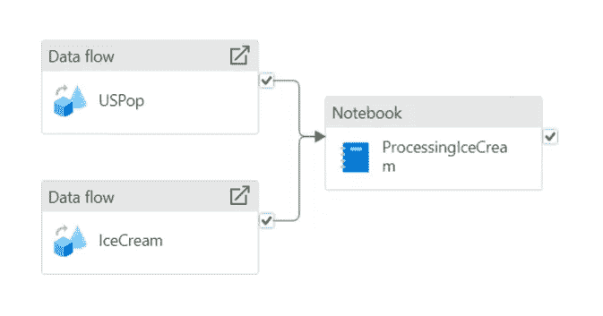

# 在 Azure 中的端到端机器学习

> 原文：[`towardsdatascience.com/end-to-end-machine-learning-in-azure-1429528ecbe5?source=collection_archive---------3-----------------------#2024-02-20`](https://towardsdatascience.com/end-to-end-machine-learning-in-azure-1429528ecbe5?source=collection_archive---------3-----------------------#2024-02-20)

## 如何在 Azure 中训练和部署机器学习模型

 [Jonathan Bogerd](https://medium.com/@jonathanbogerd?source=post_page---byline--1429528ecbe5--------------------------------)

·发表于 [Towards Data Science](https://towardsdatascience.com/?source=post_page---byline--1429528ecbe5--------------------------------) ·10 分钟阅读·2024 年 2 月 20 日

--

## **介绍**

在本文中，我们将通过一个端到端的示例来讲解如何在 Azure 中使用机器学习。我们将讨论如何转换数据，以便可以利用 Azure Synapse Analytics 来训练模型。接着，我们将在 Azure Machine Learning 中训练一个模型，并用它对一些测试数据进行评分。本文的目的是给你一个关于在 Azure 中实现这一过程所需的技术和工具的概览，并详细展示如何操作。在研究这篇文章时，我发现了许多冲突的代码片段，其中大多数是过时的并且包含错误。因此，我希望本文能为你提供一个良好的技术和工具概览，并附上一些帮助你快速开始 Azure 机器学习之旅的代码片段。

图片由 [Igor Omilaev](https://unsplash.com/@omilaev?utm_source=medium&utm_medium=referral) 提供，来源于 [Unsplash](https://unsplash.com/?utm_source=medium&utm_medium=referral)

## **数据和目标**

为了在本文中构建一个机器学习示例，我们需要数据。我们将使用我创建的一个关于 2017 年至 2022 年间美国各州冰淇淋销售的数据集。该数据集可以在[此处](https://github.com/jonathanbogerd/icecreamdata)找到。你可以自由地使用它进行自己的机器学习测试项目。我们的目标是训练一个模型，预测某一天某个州的冰淇淋销量。为了实现这一目标，我们将把这个数据集与每个州的人口数据结合起来，后者来自[USAFacts](https://usafacts.org/data/topics/people-society/population-and-demographics/population-data/population/)。它是以 Creative Commons 许可证共享的，详细信息可以在[此处](https://usafacts.org/faq/)找到。

构建一个机器学习模型需要几个数据转换步骤。首先，数据格式需要对齐，且两个数据集必须合并。我们将在下一节中使用 Azure Synapse Analytics 执行这些步骤。然后，我们将数据拆分为训练数据和测试数据，以训练和评估机器学习模型。

## **Azure**

微软 Azure 是微软提供的一套云计算服务，用于构建和管理云中的应用程序。它包括许多不同的服务，包括存储、计算和分析服务。专门针对机器学习，Azure 提供了一个机器学习服务，我们将在本文中使用它。此外，Azure 还包含 Azure Synapse Analytics，这是一个用于数据编排、存储和转换的工具。因此，Azure 中典型的机器学习工作流使用 Synapse 来检索、存储和转换数据，并调用模型进行推理，同时使用 Azure 机器学习来训练、保存和部署机器学习模型。本文将演示这一工作流。

## **Synapse**

如前所述，Azure Synapse Analytics 是用于数据管道和存储的工具。我假设你已经创建了一个 Synapse 工作区和一个 Spark 集群。有关如何操作的详细信息，请参考[此处](https://learn.microsoft.com/en-us/azure/synapse-analytics/get-started-create-workspace)。

在对数据进行任何转换之前，我们首先必须将数据上传到 Azure Synapse 的存储账户中。然后，我们为两个源数据集创建集成数据集。集成数据集是对你的数据集的引用，可以在其他活动中使用。我们还将为数据转换完成后创建两个集成数据集，以便在转换数据后将其用作存储位置。

现在我们可以开始转换数据了。我们将使用两个步骤：第一步是清理两个数据集并保存清理后的版本，第二步是将两个数据集合并成一个。这一过程遵循标准的青铜、白银和黄金流程。

## **数据流**

在第一步中，我们将使用 Azure Data Flow。Data Flow 是 Synapse 中用于数据转换的无代码选项。你可以在“开发”标签下找到它。在这里，创建一个名为 Icecream 的数据流，使用冰淇淋数据作为源集成数据集，使用汇总集成数据集作为汇集。我们在这里做的唯一转换是使用标准的 toDate 函数创建日期列。这样会将日期转换为正确的格式。在汇总数据集中，你还可以在映射标签下重命名列。

对于人口数据集，我们将重命名一些列并进行列的反透视操作。请注意，你可以在不编写代码的情况下完成所有这些操作，从而使其成为快速数据转换和清洗的简单解决方案。

## **Spark**

现在，我们将使用 Spark Notebook 来联接这两个数据集，并将结果保存供 Azure 机器学习使用。Notebook 可以使用多种编程语言，所有语言都使用 Spark API。在本示例中，我们将使用 PySpark，这是 Spark 的 Python API，因为它功能完整。读取文件后，我们将按年份将人口数据与冰淇淋数据合并，拆分为训练集和测试集，并将结果写入我们的存储帐户。详细信息可以在以下脚本中找到：

请注意，使用 AutoML 进行机器学习时，数据集需要保存为 mltable 格式，而不是 parquet 文件。为此，你可以使用提供的代码片段将 parquet 文件转换为 mltable 格式。你可能需要使用你的 Microsoft 帐户进行身份验证，以便运行此操作。

## **管道**

现在我们已经创建了所有活动，我们需要创建一个管道来运行这些活动。Synapse 中的管道用于按指定顺序和触发器执行活动。这样，你可以例如每天定时获取数据，或每月自动重新训练模型。让我们创建一个包含三项活动的管道，其中有两项数据流活动和一项 Notebook 活动。结果应该类似于下面所示：

作者提供的图片

## **机器学习**

Azure 机器学习（AML）是一个工具，能够进行机器学习模型的训练、测试和部署。该工具提供了一个界面，你可以在其中运行机器学习任务，而无需编程。然而，通常使用 Python SDK（v2）来构建和训练模型更为方便。它提供了更多控制，并允许你在喜欢的编程环境中工作。因此，我们首先需要安装所有必需的包。你可以简单地通过 pip 安装这个 requirements.txt 文件，以便跟随本示例进行操作。请注意，我们将使用 lightgbm 创建一个模型。如果你打算使用不同的模型，则不需要这个包。

现在，让我们开始使用 Python SDK 来训练模型。首先，我们需要通过默认或交互式凭证类进行身份验证，以获取 MLClient。每当你需要访问时，它会延迟进行 AML 身份验证。

## **计算**

下一步是创建一个计算资源，用于实际运行工作负载。AML 提供了几种类型的计算资源可以使用。计算实例非常适合作为开发环境或用于训练任务。计算集群则适用于更大的训练任务或推理任务。在本文中，我们将创建一个计算实例和一个计算集群：第一个用于训练，第二个用于推理。创建计算实例的代码可以在下面找到，计算集群将在我们将模型部署到端点时创建。

也可以使用外部集群，例如 Databricks 或 Synapse。但是，目前来自 Synapse 的 Spark 集群不支持运行适用于 Azure 机器学习的版本。有关集群的更多信息，请访问[这里](https://learn.microsoft.com/en-us/azure/machine-learning/concept-compute-target?view=azureml-api-2)。

## **环境**

在不同机器上训练机器学习模型可能会很具挑战性，特别是当您没有正确的环境设置来运行它们时。很容易漏掉一些依赖项或使用略有不同的版本。为了解决这个问题，AML 使用了环境的概念，即一个基于 Docker 的 Python 环境来运行您的工作负载。您可以使用现有的环境，或通过选择一个 Docker 基础镜像（或者自己创建一个）并添加一个包含所有依赖项的 `conda.yaml` 文件来创建自己的环境。对于本文，我们将从微软基础镜像创建环境。`conda.yaml` 文件和创建环境的代码已经提供。

不要忘记包含 `azureml-inference-server-http` 包。虽然在训练模型时不需要它，但进行推理时是必需的。如果现在忘记它，您将在评分时遇到错误，必须从这里重新开始。在 AML 用户界面中，您可以检查进度和底层的 Docker 镜像。环境也有版本控制，因此如果需要，您始终可以恢复到之前的版本。

## **数据**

现在我们有了一个可以运行机器学习工作负载的环境，接下来我们需要访问我们的数据集。在 AML 中，有多种方法可以将数据添加到训练任务中。我们将使用在训练模型之前注册训练数据集的方法。通过这种方式，我们的数据也可以进行版本控制。使用以下脚本可以非常简单地实现这一点：

## **训练**

最后，我们可以开始构建我们 lightgbm 模型的训练脚本。在 AML 中，训练脚本在命令中运行，包含所有必需的参数。因此，让我们首先设置这个训练脚本的结构。我们将使用 MLFlow 来记录、保存和打包模型。使用 MLFlow 的主要优点是，所有的依赖项都会打包在模型文件中。因此，在部署时，我们不需要指定任何依赖项，因为它们已经是模型的一部分。以下是根据微软提供的 MLFlow 模型示例脚本，训练脚本的基本结构：

填写这个模板时，我们首先添加 lightgbm 模型的参数。这包括叶子数和迭代次数，我们在 `parse_args` 方法中解析这些参数。然后，我们会读取之前注册的数据集中的提供的 parquet 文件。在这个示例中，我们会去掉日期和状态列，尽管你可以利用这些列来改进模型。接着，我们将使用部分数据作为验证集来创建并训练模型。最后，我们保存模型，以便后续在 AML 中进行部署。完整的脚本如下：

现在，我们必须将这个脚本与数据集引用、环境以及计算资源一起上传到 AML。在 AML 中，这是通过创建一个包含所有这些组件的命令并将其发送到 AML 来完成的。

这将生成一个指向训练作业的 URL。你可以在 AML 用户界面中跟踪训练状态和日志。请注意，集群并不会总是自动启动。至少有时我遇到过这种情况。在这种情况下，你可以通过用户界面手动启动计算实例。训练这个模型大约需要一分钟。

## **端点**

要使用模型，我们首先需要为它创建一个端点。AML 有两种不同类型的端点。一种是在线端点，用于实时推理。另一种是批处理端点，用于批量评分数据。在本文中，我们将同一个模型部署到在线端点和批处理端点。为此，我们首先需要创建端点。创建在线端点的代码非常简单。它会生成以下用于创建端点的代码：

我们只需要做一个小的改动，就可以创建批处理端点：

## **部署**

现在我们有了端点，需要将模型部署到这个端点。因为我们创建了一个 MLFlow 模型，所以部署比较简单，因为所有的要求都已经打包在模型内部。模型需要在计算集群上运行，我们可以在将模型部署到端点时创建一个。将模型部署到在线端点大约需要十分钟。部署完成后，所有的流量需要指向这个部署。这可以通过代码中的最后几行来完成：

为了将相同的模型部署到批处理端点，我们首先需要创建一个计算目标。这个目标将用于运行模型。接下来，我们创建一个包含部署设置的部署。在这些设置中，你可以指定批处理大小、并发设置以及输出的存储位置。指定好这些后，步骤与部署到在线端点类似。

## **使用在线端点进行评分**

现在一切都准备好通过端点使用我们的模型了。首先，让我们通过在线端点调用模型。AML 提供了一个示例评分脚本，你可以在端点部分找到它。然而，为示例数据创建正确的格式可能会有些让人沮丧。数据需要以嵌套 JSON 的形式发送，其中包括列索引、样本索引和实际数据。你可以在下面的示例中找到一种快速但粗略的方法。在编码数据之后，你需要将其发送到端点的 URL，并附上 API 密钥。你可以在端点菜单中找到这两个信息。请注意，**绝不要**将你的端点 API 密钥保存在代码中。Azure 提供了一个密钥保管库来保存机密信息。你可以在代码中引用该密钥，而不是直接保存它。欲了解更多信息，请参阅 [Microsoft 文档](https://learn.microsoft.com/en-us/azure/key-vault/general/overview)。结果变量将包含模型的预测结果。

## **通过批量端点评分**

通过批量端点进行评分的方式稍有不同。通常，这涉及到更多数据，因此在 AML 中注册一个数据集可能会很有用。我们之前在本文中做过一次，针对训练数据。接下来，我们将创建一个评分任务，包含所有信息，并将其发送到我们的端点。在评分过程中，我们可以查看任务的进度，并轮询例如其状态。任务完成后，我们可以从创建批量端点时指定的输出位置下载结果。在此案例中，我们将结果保存在 CSV 文件中。

尽管我们已经在本地对数据进行了评分并得到了输出，但我们也可以在 Azure Synapse Analytics 中运行相同的代码，直接从那里进行评分。然而，在大多数情况下，我发现先在本地测试一切再在 Synapse 中运行会更容易。

## **结论**

本文已接近尾声。总结一下，我们在 Azure 中使用 Azure Synapse Analytics 导入数据，利用 Synapse 对其进行转换，然后在 Azure Machine Learning 中使用这些数据训练并部署机器学习模型。最后，我们用两个端点对数据集进行了评分。希望本文有助于你理解如何在 Azure 中使用机器学习。如果你跟着本文操作，请不要忘记删除你创建的端点、容器注册表和其他资源，以避免产生额外费用。

## **来源**

 [## 美国人口变化

### 探索美国人口的政府数据，了解其年度变化。下载数据或使用我们的…

[usafacts.org](https://usafacts.org/data/topics/people-society/population-and-demographics/population-data/population/?source=post_page-----1429528ecbe5--------------------------------)  [## azureml-examples/sdk/python/endpoints/batch/deploy-models/heart-classifier-mlflow/mlflow-for-batch-t…

### 官方社区驱动的 Azure 机器学习示例，已通过 GitHub Actions 测试。

[github.com](https://github.com/Azure/azureml-examples/blob/main/sdk/python/endpoints/batch/deploy-models/heart-classifier-mlflow/mlflow-for-batch-tabular.ipynb?source=post_page-----1429528ecbe5--------------------------------)  [## azureml-examples/tutorials/get-started-notebooks/quickstart.ipynb at main · Azure/azureml-examples

### 官方社区驱动的 Azure 机器学习示例，已通过 GitHub Actions 测试。

[github.com](https://github.com/Azure/azureml-examples/blob/main/tutorials/get-started-notebooks/quickstart.ipynb?source=post_page-----1429528ecbe5--------------------------------)

[`learn.microsoft.com/zh-cn/azure/machine-learning`](https://learn.microsoft.com/en-us/azure/machine-learning)/
