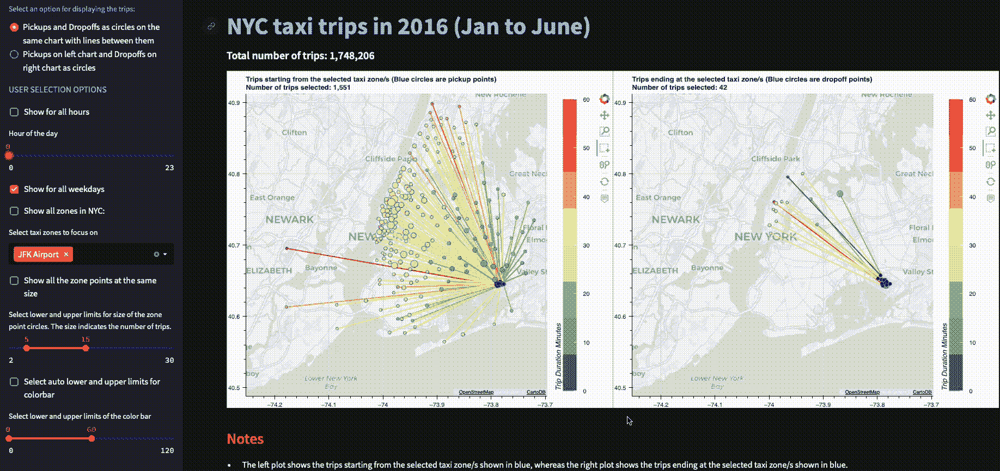

# 启动你的机器学习之旅：范围确定、结构设计和数据探索（第一部分）

> 原文：[`towardsdatascience.com/end-to-end-machine-learning-project-part-1-project-scoping-structure-data-gathering-eda-7e69b71eeb44?source=collection_archive---------18-----------------------#2024-06-18`](https://towardsdatascience.com/end-to-end-machine-learning-project-part-1-project-scoping-structure-data-gathering-eda-7e69b71eeb44?source=collection_archive---------18-----------------------#2024-06-18)

## 一份关于规划和组织机器学习项目的实用指南，从数据收集到探索性分析。

 [Pratha Pawar](https://medium.com/@Pratha_P?source=post_page---byline--7e69b71eeb44--------------------------------)

·发布于 [Towards Data Science](https://towardsdatascience.com/?source=post_page---byline--7e69b71eeb44--------------------------------) ·10 分钟阅读·2024 年 6 月 18 日

--

在 Streamlit 中进行交互式可视化，使用 Bokeh（图像由作者提供）

## **本文将涵盖以下主题**

+   理解业务问题

+   设置工作环境和目录结构

+   收集数据（使用多线程提高 2 到 4 倍的速度）

+   预处理数据（使用向量化提高 10 倍速度）

+   通过探索性数据分析（EDA）获得有价值的见解

+   构建交互式可视化（本系列的第二部分）

+   最后使用机器学习回答问题（本系列的第三部分）

+   附加内容：你还将学习如何将代码模块化为独立且可重用的组件，以及如何使用抽象。

**注意**：本文面向初学者到中级水平的数据科学家。

几乎所有的数据科学和机器学习项目都从业务问题开始。那么，让我们先定义一下我们在这里试图解决的问题。

假设你为纽约市的出租车服务公司工作，你的团队正在尝试……
