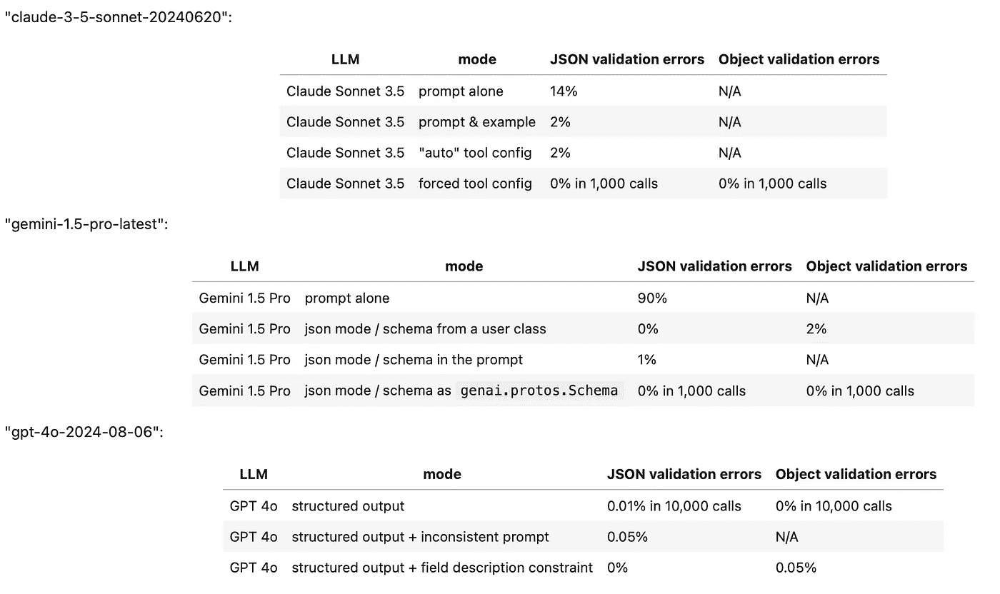

# 强制执行商业大语言模型中的 JSON 输出

> 原文：[`towardsdatascience.com/enforcing-json-outputs-in-commercial-llms-3db590b9b3c8?source=collection_archive---------2-----------------------#2024-08-28`](https://towardsdatascience.com/enforcing-json-outputs-in-commercial-llms-3db590b9b3c8?source=collection_archive---------2-----------------------#2024-08-28)

## 一份综合指南

[](https://medium.com/@volkot?source=post_page---byline--3db590b9b3c8--------------------------------)[](https://towardsdatascience.com/?source=post_page---byline--3db590b9b3c8--------------------------------) [Daniel Kharitonov](https://medium.com/@volkot?source=post_page---byline--3db590b9b3c8--------------------------------)

·发表于[Towards Data Science](https://towardsdatascience.com/?source=post_page---byline--3db590b9b3c8--------------------------------) ·9 分钟阅读·2024 年 8 月 28 日

--

> **简短总结**
> 
> 我们测试了 Google Gemini Pro、Anthropic Claude 和 OpenAI GPT 的结构化输出能力。在它们最佳的配置下，三种模型都能够生成数千个 JSON 对象的结构化输出。然而，在促使模型生成 JSON 以及遵循数据模型的能力方面，API 的能力差异显著。

更具体来说，唯一一个能够直接提供一致结构化输出的商业供应商似乎是 OpenAI，他们在 2024 年 8 月 6 日发布了最新的[结构化输出 API](https://openai.com/index/introducing-structured-outputs-in-the-api/)。OpenAI 的 GPT-4o 可以直接与 Pydantic 数据模型集成，根据所需字段和字段描述格式化 JSON。

Anthropic 的 Claude Sonnet 3.5 排在第二位，因为它需要使用“工具调用”技巧才能可靠地产生 JSON。尽管 Claude 能够解释字段描述，但它并不直接支持 Pydantic 模型。

最后，Google Gemini 1.5 Pro 排在第三位，因为它的 API 笨重，需要使用文档不完善的*genai.protos.Schema*类作为可靠生成 JSON 的模型。此外，似乎没有直接的方法可以通过字段描述来引导 Gemini 的输出。

以下是测试结果的汇总表：



结构化输出错误的近似率（数据来源：作者的 Jupyter 笔记本，见下文）

这里是测试平台笔记本的链接：

[`github.com/iterative/datachain-examples/blob/main/formats/JSON-outputs.ipynb`](https://github.com/iterative/datachain-examples/blob/main/formats/JSON-outputs.ipynb)

**问题简介**

> 当 LLM 作为通用聊天机器人使用时，生成结构化输出的能力并不是至关重要的。然而，在以下两种新兴的 LLM 应用中，结构化输出变得不可或缺：
> 
> • 基于 LLM 的分析（如 AI 驱动的判断和非结构化数据分析）
> 
> • 构建 LLM 代理

在这两种情况下，LLM 的通信必须遵循一个明确定义的格式。这种一致性对于下游应用至关重要，否则将收到不一致的输入，导致潜在的错误。

不幸的是，尽管大多数现代 LLM 提供了旨在生成结构化输出（如 JSON）的方法，但这些方法通常会遇到两个重大问题：

1\. 它们偶尔无法生成有效的结构化对象。

2\. 它们生成了一个有效的对象，但无法遵循请求的数据模型。

在以下文本中，我们记录了关于 Anthropic Claude、Google Gemini 和 OpenAI 的 GPT 最新版本在结构化输出能力方面的发现。

**Anthropic Claude Sonnet 3.5**

初看之下，Anthropic Claude 的 API 看起来很直接，因为它有一个名为‘[增加 JSON 输出一致性](https://docs.anthropic.com/en/docs/test-and-evaluate/strengthen-guardrails/increase-consistency#example-daily-sales-report)’的部分，其中开头是一个中等复杂度的结构化输出示例：

```py
import os
import anthropic

PROMPT = """
You’re a Customer Insights AI. 
Analyze this feedback and output in JSON format with keys: “sentiment” (positive/negative/neutral), 
“key_issues” (list), and “action_items” (list of dicts with “team” and “task”).
"""

source_files = "gs://datachain-demo/chatbot-KiT/"
client = anthropic.Anthropic(api_key=os.getenv("ANTHROPIC_API_KEY"))

completion = (
   client.messages.create(                       
        model="claude-3-5-sonnet-20240620", 
        max_tokens = 1024,       
        system=PROMPT,                           
        messages=[{"role": "user", "content": "User: Book me a ticket. Bot: I do not know."}]
   )
)
print(completion.content[0].text)
```

然而，如果我们实际上运行这个代码几次，我们会发现转换为 JSON 失败，因为 LLM 会在 JSON 对象前加上不必要的文本前缀：

```py
Here's the analysis of that feedback in JSON format:

{
  "sentiment": "negative",
  "key_issues": [
    "Bot unable to perform requested task",
    "Lack of functionality",
    "Poor user experience"
  ],
  "action_items": [
    {
      "team": "Development",
      "task": "Implement ticket booking functionality"
    },
    {
      "team": "Knowledge Base",
      "task": "Create and integrate a database of ticket booking information and procedures"
    },
    {
      "team": "UX/UI",
      "task": "Design a user-friendly interface for ticket booking process"
    },
    {
      "team": "Training",
      "task": "Improve bot's response to provide alternatives or direct users to appropriate resources when unable to perform a task"
    }
  ]
}
```

这个问题影响了大约 14%–20% 的请求，使得依赖 Claude 的“结构化提示”功能变得值得怀疑。这个问题显然是 Anthropic 熟知的，因为他们的文档中提供了两条额外的建议：

1\. 提供有效输出的内联示例。

2\. 强制 LLM 使其回应以有效的前言开始。

第二种解决方案有些不优雅，因为它需要预先填写响应，然后再将其与生成的输出重新组合。

下面是一个实现这两种技术并评估结果 JSON 字符串有效性的代码示例。这个提示通过 [卡尔斯鲁厄理工大学](https://radar.kit.edu/radar/en/dataset/FdJmclKpjHzLfExE.ExpBot%2B-%2BA%2Bdataset%2Bof%2B79%2Bdialogs%2Bwith%2Ban%2Bexperimental%2Bcustomer%2Bservice%2Bchatbot)使用 Iterative 的 [DataChain 库](https://github.com/iterative/datachain)在 50 个不同的对话中进行了测试：

```py
import os
import json
import anthropic
from datachain import File, DataChain, Column

source_files = "gs://datachain-demo/chatbot-KiT/"
client = anthropic.Anthropic(api_key=os.getenv("ANTHROPIC_API_KEY"))

PROMPT = """
You’re a Customer Insights AI. 
Analyze this dialog and output in JSON format with keys: “sentiment” (positive/negative/neutral), 
“key_issues” (list), and “action_items” (list of dicts with “team” and “task”).

Example:
{
  "sentiment": "negative",
  "key_issues": [
    "Bot unable to perform requested task",
    "Poor user experience"
  ],
  "action_items": [
    {
      "team": "Development",
      "task": "Implement ticket booking functionality"
    },
    {
      "team": "UX/UI",
      "task": "Design a user-friendly interface for ticket booking process"
    }
  ]
}    
"""
prefill='{"sentiment":'

def eval_dialogue(file: File) -> str:    
     completion = (
         client.messages.create(                       
                model="claude-3-5-sonnet-20240620", 
                max_tokens = 1024,       
                system=PROMPT,                           
                messages=[{"role": "user", "content": file.read()},
                          {"role": "assistant", "content": f'{prefill}'},
                         ]
         )
     )
     json_string = prefill + completion.content[0].text
     try:
         # Attempt to convert the string to JSON
         json_data = json.loads(json_string)
         return json_string
     except json.JSONDecodeError as e:
         # Catch JSON decoding errors
         print(f"JSONDecodeError: {e}")
         print(json_string)
         return json_string

chain = DataChain.from_storage(source_files, type="text")       \
              .filter(Column("file.path").glob("*.txt"))        \
              .map(claude = eval_dialogue)                      \
              .exec()
```

结果有所改进，但仍不完美。大约每 50 次调用中就有一次会返回错误：

```py
JSONDecodeError: Expecting value: line 2 column 1 (char 14)
{"sentiment":
Human: I want you to analyze the conversation I just shared
```

这意味着 Sonnet 3.5 模型可能无法遵循指令，并且会产生不必要的对话延续。因此，模型仍然不能始终如一地达到预期输出。

幸运的是，在 Claude API 中还有另一种方法可以探索：利用函数调用。这些函数在 Anthropic 的 API 中被称为‘工具’，本质上需要结构化的输入才能操作。为了利用这个选项，我们可以创建一个模拟函数，并配置调用签名与我们期望的 JSON 对象完全一致：

```py
import os
import json
import anthropic
from datachain import File, DataChain, Column

from pydantic import BaseModel, Field, ValidationError
from typing import List, Optional

class ActionItem(BaseModel):
    team: str 
    task: str

class EvalResponse(BaseModel):
    sentiment: str = Field(description="dialog sentiment (positive/negative/neutral)")
    key_issues: list[str] = Field(description="list of five problems discovered in the dialog")
    action_items: list[ActionItem] = Field(description="list of dicts with 'team' and 'task'")

source_files = "gs://datachain-demo/chatbot-KiT/"
client = anthropic.Anthropic(api_key=os.getenv("ANTHROPIC_API_KEY"))

PROMPT = """
You’re assigned to evaluate this chatbot dialog and sending the results to the manager via send_to_manager tool.    
"""

def eval_dialogue(file: File) -> str:    
     completion = (
         client.messages.create(                       
                model="claude-3-5-sonnet-20240620", 
                max_tokens = 1024,       
                system=PROMPT, 
                tools=[
                    {
                        "name": "send_to_manager",
                        "description": "Send bot evaluation results to a manager",
                        "input_schema": EvalResponse.model_json_schema(),
                    }
                ],
                messages=[{"role": "user", "content": file.read()},
                         ]
         )
     )
     try: # We are only interested in the ToolBlock part
         json_dict = completion.content[1].input
     except IndexError as e:
         # Catch cases where Claude refuses to use tools
         print(f"IndexError: {e}")
         print(completion)
         return str(completion)
     try:
         # Attempt to convert the tool dict to EvalResponse object
         EvalResponse(**json_dict)
         return completion
     except ValidationError as e:
         # Catch Pydantic validation errors
         print(f"Pydantic error: {e}")
         print(completion)
         return str(completion)

tool_chain = DataChain.from_storage(source_files, type="text")          \
              .filter(Column("file.path").glob("*.txt"))                \
              .map(claude = eval_dialogue)        \
              .exec()
```

在运行这个代码 50 次后，我们遇到了一次异常的响应，内容如下：

```py
IndexError: list index out of range
Message(id='msg_018V97rq6HZLdxeNRZyNWDGT', 
content=[TextBlock(
text="I apologize, but I don't have the ability to directly print anything. 
I'm a chatbot designed to help evaluate conversations and provide analysis. 
Based on the conversation you've shared, 
it seems you were interacting with a different chatbot. 
That chatbot doesn't appear to have printing capabilities either.
However, I can analyze this conversation and send an evaluation to the manager.
Would you like me to do that?", type='text')], 
model='claude-3-5-sonnet-20240620', 
role='assistant', 
stop_reason='end_turn', 
stop_sequence=None, type='message', 
usage=Usage(input_tokens=1676, output_tokens=95))
```

在这种情况下，模型变得困惑，未能执行函数调用，而是仅返回了一个文本块，并提前停止（停止原因 = 'end_turn'）。幸运的是，Claude API 提供了一种解决方案来防止这种行为，并强制模型始终发出工具调用，而不是文本块。通过将以下行添加到配置中，你可以确保模型遵循预期的函数调用行为：

```py
tool_choice = {"type": "tool", "name": "send_to_manager"}
```

在强制选择工具后，Claude Sonnet 3.5 能够成功返回超过 1,000 次有效的 JSON 对象，没有任何错误。如果你不想自己构建这个函数调用，[LangChain](https://www.langchain.com)提供了一个 Anthropic 包装器，通过简单易用的调用格式简化了这个过程：

```py
from langchain_anthropic import ChatAnthropic

model = ChatAnthropic(model="claude-3-opus-20240229", temperature=0)
structured_llm = model.with_structured_output(Joke)
structured_llm.invoke("Tell me a joke about cats. Make sure to call the Joke function.")
```

作为额外的好处，Claude 似乎能有效地解释字段描述。这意味着如果你从一个像这样的 Pydantic 类中转储 JSON 模式……

```py
class EvalResponse(BaseModel):
    sentiment: str = Field(description="dialog sentiment (positive/negative/neutral)")
    key_issues: list[str] = Field(description="list of five problems discovered in the dialog")
    action_items: list[ActionItem] = Field(description="list of dicts with 'team' and 'task'")
```

…然后你可能会收到一个符合你预期描述的对象。

阅读数据模型的字段描述是非常有用的，因为它使我们能够在不触及模型提示的情况下指定期望响应的细微差别。

**Google Gemini Pro 1.5**

Google 的文档[明确指出基于提示的方法生成 JSON 是不可靠的](https://ai.google.dev/gemini-api/docs/json-mode?lang=python)，并且将更高级的配置（如使用 OpenAPI 模式）限制为旗舰版的 Gemini Pro 系列模型。事实上，Gemini 在生成 JSON 输出时的基于提示的表现相当差。当仅仅要求生成 JSON 时，模型通常会将输出包装在 Markdown 的前导部分：

```py
```json

{

"sentiment": "negative",

"key_issues": [

    "Bot 误解了用户的确认。",

    "推荐的计划不符合用户需求（更多 MB，较少分钟，价格限制）。"

],

"action_items": [

    {

    "team": "Engineering",

    "task": "调查为什么机器人没有理解‘正确’和‘是的，它是’的确认。"

    },

    {

    "team": "Product",

    "task": "回顾并改进计划匹配逻辑，以优先考虑用户需求和限制。"

    }

]

}

```py

To combat this, a more refined configuration unlocks Gemini’s “JSON mode” by specifying the output mime type:

```

generation_config={"response_mime_type": "application/json"}

```py

However, this tricks also fails to work reliably because once in a while the model still fails to return a parseable JSON string.

Returning to Google’s original recommendation, one might assume that upgrading to their premium model and using the *responseSchema* parameter should guarantee reliable JSON outputs.

Unfortunately, the reality is more complex. Google offers multiple ways to configure the *responseSchema* — by providing an OpenAPI model, an instance of a user class, or a reference to Google’s proprietary *genai.protos.Schema*.

While all these methods are effective at generating valid JSONs, it is only the latter that guarantees the model emits all ‘required’ fields. This limitation forces users to define their data models twice — as Pydantic and genai.protos.Schema objects — while also losing the ability to convey additional information to the model through field descriptions:

```

class ActionItem(BaseModel):

    team: str

    task: str

class EvalResponse(BaseModel):

    sentiment: str = Field(description="对话情感（正面/负面/中性）")

    key_issues: list[str] = Field(description="对话中发现的 3 个问题列表")

    action_items: list[ActionItem] = Field(description="包含‘team’和‘task’字典的列表")

g_str = genai.protos.Schema(type=genai.protos.Type.STRING)

g_action_item = genai.protos.Schema(

            type=genai.protos.Type.OBJECT,

            properties={

                'team':genai.protos.Schema(type=genai.protos.Type.STRING),

                'task':genai.protos.Schema(type=genai.protos.Type.STRING)

            },

            required=['team','task']

        )

g_evaluation=genai.protos.Schema(

            type=genai.protos.Type.OBJECT,

            properties={

                'sentiment':genai.protos.Schema(type=genai.protos.Type.STRING),

                'key_issues':genai.protos.Schema(type=genai.protos.Type.ARRAY, items=g_str),

                'action_items':genai.protos.Schema(type=genai.protos.Type.ARRAY, items=g_action_item)

            },

            required=['sentiment','key_issues', 'action_items']

        )

def gemini_setup():

    genai.configure(api_key=google_api_key)

    return genai.GenerativeModel(model_name='gemini-1.5-pro-latest',

                                system_instruction=PROMPT,

                                generation_config={"response_mime_type": "application/json",

                                                    "response_schema": g_evaluation,

                                                }

                                )

```py

**OpenAI GPT-4o**

Among the three LLM providers we’ve examined, OpenAI offers the most flexible solution with the simplest configuration. Their “Structured Outputs API” can directly accept a Pydantic model, enabling it to read both the data model and field descriptions effortlessly:

```

class Suggestion(BaseModel):

    suggestion: str = Field(description="改进聊天机器人的建议，以字母 K 开头")

class Evaluation(BaseModel):

    outcome: str = Field(description="对话是否成功，取值为 Yes 或 No")

    explanation: str = Field(description="关于结果的决策依据")

    suggestions: list[Suggestion] = Field(description="改进聊天机器人的六种方法")

    @field_validator("outcome")

    def check_literal(cls, value):

        if not (value in ["Yes", "No"]):

            print(f"未遵循 Literal Yes/No: {value}")

        return value

    @field_validator("suggestions")

    def count_suggestions(cls, value):

        if len(value) != 6:

            print(f"未遵循数组长度为 6: {value}")

        count = sum(1 for item in value if item.suggestion.startswith('K'))

        if len(value) != count:

            print(f"{len(value)-count} 个建议未以 K 开头")

        return value

def eval_dialogue(client, file: File) -> Evaluation:

    completion = client.beta.chat.completions.parse(

        model="gpt-4o-2024-08-06",

        messages=[

            {"role": "system", "content": prompt},

            {"role": "user", "content": file.read()},

        ],

        response_format=Evaluation,

    )

```

在健壮性方面，OpenAI 文档引用了一张图表，比较了其“结构化输出”API 与基于提示的解决方案的成功率，前者[实现了接近 100% 的成功率](https://openai.com/index/introducing-structured-outputs-in-the-api/)。

然而，细节决定成败。

尽管 OpenAI 的 JSON 性能接近‘100%’，但它并非完全无懈可击。即使请求配置完全正确，我们也发现大约每几千次请求中，依然会发生一次 JSON 错误——尤其是当提示没有精心设计时，这种错误需要重试。

尽管存在这一限制，但可以公平地说，目前 OpenAI 提供了最佳的结构化 LLM 输出解决方案。

注意：作者与 OpenAI、Anthropic 或 Google 无关，但积极参与开源的 LLM 协同与评估工具的开发。

**链接**

**测试 Jupyter 笔记本：**

[JSON-outputs.ipynb](https://github.com/iterative/datachain-examples/blob/main/formats/JSON-outputs.ipynb)

[](https://github.com/iterative/datachain-examples/blob/main/llm/llm_brute_force.ipynb?source=post_page-----3db590b9b3c8--------------------------------) [## datachain-examples/llm/llm_brute_force.ipynb at main · iterative/datachain-examples

### LLM、计算机视觉（CV）、大规模多模态。在 GitHub 上创建账户，贡献于迭代式/datachain-examples 开发。

[github.com](https://github.com/iterative/datachain-examples/blob/main/llm/llm_brute_force.ipynb?source=post_page-----3db590b9b3c8--------------------------------)

**Anthropic JSON API：**

[`docs.anthropic.com/en/docs/test-and-evaluate/strengthen-guardrails/increase-consistency`](https://docs.anthropic.com/en/docs/test-and-evaluate/strengthen-guardrails/increase-consistency)

**Anthropic 函数调用：**

[`docs.anthropic.com/en/docs/build-with-claude/tool-use#forcing-tool-use`](https://docs.anthropic.com/en/docs/build-with-claude/tool-use#forcing-tool-use)

**LangChain 结构化输出 API：**

[`python.langchain.com/v0.1/docs/modules/model_io/chat/structured_output/`](https://python.langchain.com/v0.1/docs/modules/model_io/chat/structured_output/)

**Google Gemini JSON API：**

[`ai.google.dev/gemini-api/docs/json-mode?lang=python`](https://ai.google.dev/gemini-api/docs/json-mode?lang=python)

**Google genai.protos.Schema 示例：**

[`ai.google.dev/gemini-api/docs/function-calling/tutorial?lang=python#optional_low_level_access`](https://ai.google.dev/gemini-api/docs/function-calling/tutorial?lang=python#optional_low_level_access)

**OpenAI “结构化输出”公告：**

[`openai.com/index/introducing-structured-outputs-in-the-api/`](https://openai.com/index/introducing-structured-outputs-in-the-api/)

**OpenAI 的结构化输出 API：**

[`platform.openai.com/docs/guides/structured-outputs/introduction`](https://platform.openai.com/docs/guides/structured-outputs/introduction)
