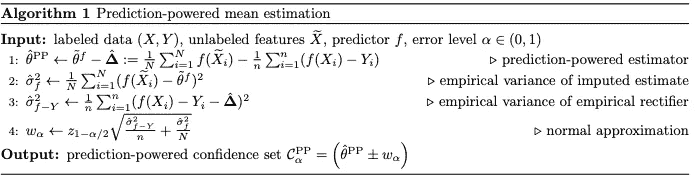
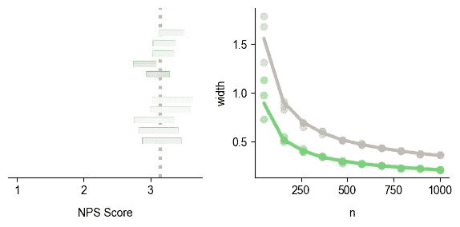
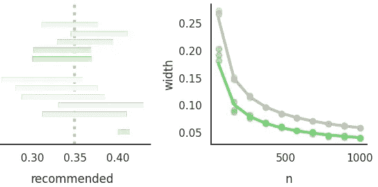

# 使用 LLM 和统计推理增强 NPS 测量

> 原文：[`towardsdatascience.com/enhancing-nps-measurement-with-llms-and-statistical-inference-a0ed0ce9c6cf?source=collection_archive---------6-----------------------#2024-03-06`](https://towardsdatascience.com/enhancing-nps-measurement-with-llms-and-statistical-inference-a0ed0ce9c6cf?source=collection_archive---------6-----------------------#2024-03-06)

## 通过预测驱动推理（PPI）将 LLM 与人工判断结合

[](https://medium.com/@smsmith714?source=post_page---byline--a0ed0ce9c6cf--------------------------------)[](https://towardsdatascience.com/?source=post_page---byline--a0ed0ce9c6cf--------------------------------) [Sean Smith](https://medium.com/@smsmith714?source=post_page---byline--a0ed0ce9c6cf--------------------------------)

·发表于 [Towards Data Science](https://towardsdatascience.com/?source=post_page---byline--a0ed0ce9c6cf--------------------------------) ·阅读时间 8 分钟·2024 年 3 月 6 日

--


机器人解决复杂数学问题，数字艺术。由 Dall-E 2 生成。

# 介绍

在商业分析中，计算净推荐值（NPS）通常需要员工手动标注数据。有些人可能会考虑使用机器学习模型来标注数据，但这并没有提供我们从人工标注数据中得到的理论保障。这里引入了预测驱动推理（PPI），一种新型的统计技术，它结合了人工和机器标注的数据，创建了数据高效且理论上有保障的置信区间。

本文探讨了 PPI 背后的直觉，并强调了为什么你应该使用它。接着我们将进入如何使用它来处理两个指标的代码演示：NPS 和客户推荐。

# 预测驱动推理（PPI）

PPI 是 Angelopoulos 等人提出的一种统计技术[1]。其目标是通过结合人工和机器标注的数据来增强置信区间。让我们通过一些步骤来了解它的实用性。

在我们的应用场景中，我们希望在给定一组客户评价的情况下，估计真实的 NPS 分数。通常，员工会手动阅读每条评价，并为其分配一个 1 到 10 的分数，这是一种可靠但效率较低的方法。当需要处理大量评价时，使用更自动化的方法会更加便捷。

为了解决这个问题，我们可以利用机器学习模型。大型语言模型（LLM）是一个很好的候选者，因为它们在处理新任务时具有很好的泛化能力。该模型会被提示读取评论并输出一个分数。这很方便，但模型也有错误和缺陷。在做决策时，我们需要确保我们的数据与人类判断一致。

考虑到两种方法的局限性，如果我们能够将它们结合起来呢？通过预测驱动推断（PPI），我们可以做到这一点！PPI 是一个框架，它结合了人工标注数据在置信区间方面的理论保证与机器标注数据的高效性。通过 PPI，我们旨在发挥两种技术的优势。

## 工作原理

PPI 的核心是一个叫做“整流器”的工具。我们使用整流器来弥补机器学习模型的预测误差。借助整流器，我们可以结合人工和机器标注数据，构建置信区间。

这是构造置信区间的算法：



来自[1]的算法 1。

这种方法的优点是代码实现简单。这里是一个简短的代码片段，展示如何实现：

```py
def pp_mean_iid_asymptotic(Y_labeled, Yhat_labeled, Yhat_unlabeled, alpha):
    n = Y_labeled.shape[0]
    N = Yhat_unlabeled.shape[0]
    tildethetaf = Yhat_unlabeled.mean()
    rechat = (Yhat_labeled - Y_labeled).mean() # rectifier (delta hat)
    thetahatPP = tildethetaf - rechat # Prediction-Powered Estimator
    sigmaftilde = np.std(Yhat_unlabeled)  # imputed std dev
    sigmarec = np.std(Yhat_labeled -  Y_labeled) # rectifier std dev
    hw = norm.ppf(1-alpha/2)*np.sqrt((sigmaftilde**2/N) + (sigmarec**2/n)) # normal approximation

    return [thetahatPP - hw, thetahatPP + hw] # confidence interval
```

如果你想更深入了解，我推荐观看这段[YouTube](https://www.youtube.com/watch?v=FW5l5xEYETY&t=515s)视频，视频中的 Clara Wong-Fannjiang（其中一位作者）进行了解释，或者查看[论文](https://arxiv.org/pdf/2301.09633.pdf)。这些资源能比我在这里所做的更好地解释相关概念。

需要理解的重要一点是，PPI 的置信区间比仅使用人工构建的置信区间更为紧凑，并且具有预测置信区间所没有的理论保证。理解这一点就足以完成代码练习。

# 方法

完整的笔记本链接可以在[这里](https://colab.research.google.com/drive/1anlksDq2LI6Mshk7tO_yxFnSsOp-D366?usp=sharing)找到。我将逐步介绍关键步骤，并提供一些评论。大部分代码归功于 PPI 库的作者。

在我们的例子中，我们将使用 PPI 来估计均值。也可以估计其他参数，比如分位数、逻辑回归/线性回归系数等。通过这个例子后，你可以在[这里](https://github.com/aangelopoulos/ppi_py/tree/main/examples)找到更多内容。

## 设置步骤

首先，让我们安装 PPI 库。要查看更多关于该库的信息，请查看这个仓库[这里](https://github.com/aangelopoulos/ppi_py)。

```py
pip install ppi-python
```

对于这个例子，我们将模拟数据。很难找到公开可用的 NPS 得分数据，因此我创建了以下代码。不管数据来源于何处，方法都是相同的。我们将创建一个包含`Overall_Rating`（NPS 得分）和`Recommended`（布尔值）列的 DataFrame。

```py
def simulate_nps_scores(n, mu=3, mu2=9, std_dev=1):

    # simulate each aspect of bimodal distribution
    X1 = np.random.normal(mu, std_dev, n // 3)
    X2 = np.random.normal(mu2, std_dev, n // 3)

    X = np.concatenate([X1, X2])
    X3 = np.ones(n - X.shape[0])  # make 1-inflated
    X = np.concatenate([X, X3])

    X = np.clip(X, a_min=1, a_max=10)  # fix to 1-10 range for NPS

    return X

def simulate_recommended(mean, n):
    return np.array([1 if random.uniform(0,1) <= mean else 0 for _ in range(n)])
```

使用这些函数，我们可以构建 DataFrame：

```py
N = 20000
data = pd.DataFrame({
    'Overall_Rating': simulate_nps_scores(N), 
    'Recommended': simulate_recommended(0.34, N)
})
```

## 模拟 LLM 预测

为了制作一个更灵活的演示，我提供了两种创建预测的选项。第一种是为预测创建模拟误差。这使你能够实验 PPI，并观察它如何作用于不同的理论模型。以下是这种情况的示例：

```py
if target_response == 'NPS':
    Y_total = data.Overall_Rating.to_numpy()
    Yhat_total = np.array([random.normalvariate(x, error_std_dev) for x in Y_total])
    Yhat_total = np.array([max(min(x, 10), 1) for x in Yhat_total])

elif target_response == 'reccomended':
    Y_total = data.Recommended.to_numpy()

    Yhat_total = np.array([
        x if random.uniform(0, 1) >= error_prob else int(not x)
        for x in Y_total
    ])

else:
    raise Exception('Invalid target_response')
```

## LLM 预测

如果你有带有客户评论的数据，那么使用 LLM 对其打分就很容易了。以下是你可以用来执行此操作的一些提示：

```py
NPS_prompt_template = lambda review: f"""Given the following review please return the Net Promoter Score (NPS).
Return only the integer value from 1-10 and nothing else.

Review: 
{review}

NPS:"""

recommended_prompt_template = lambda review: f"""Given the following review please determine if the customer would recommend the business.
Return only 'True' or 'False'.

Review: {review}
Recommended:"""
```

你可能希望使用推荐而不是 NPS，因为布尔分类问题要简单得多。一些企业偏好使用 NPS，因为它是行业标准。根据你的问题，你可以选择哪个更有意义。

使用 LLM，你还可以检查不同类别的得分。这些类别可以是你想要衡量的不同产品或服务。这是使用 LLM 的一个巨大优势，因为它对许多问题都具有灵活性，但我们在报告中也通过使用 PPI 来考虑误差。

## 运行 PPI

现在是时候构建置信区间了。以下是执行重负荷任务的代码片段：

```py
for i in tqdm(range(ns.shape[0])):
    for j in range(num_trials):
        # Prediction-Powered Inference
        n = ns[i]
        rand_idx = np.random.permutation(n_total)
        _Yhat = Yhat_total[rand_idx[:n]]
        _Y = Y_total[rand_idx[:n]]
        _Yhat_unlabeled = Yhat_total[n:]

        ppi_ci = ppi_mean_ci(_Y, _Yhat, _Yhat_unlabeled, alpha=alpha)

        classical_ci = classical_mean_ci(_Y, alpha=alpha)
```

我们在这里所做的，是模拟 PPI 与经典置信区间的不同，针对不同数量的人工响应（n）。我们可以绘制出以下信息。



NPS 得分的 PPI 与经典方法对比。绿色表示 PPI，灰色表示经典方法，黄色表示机器标注数据，虚线表示真实的总体参数。图像由作者提供。

在这张比较不同 n 值（使用的人工标注数量）的图表中，你可以看到，PPI 的置信区间始终比仅使用人工标注数据的置信区间更紧密。这展示了 PPI 的关键价值：**即使我们有一个有缺陷的机器学习模型，我们通过将其与人工数据结合使用，仍然能生成比仅使用它更好的置信区间。**

我们可以看到下方推荐的类似结果。



推荐的 PPI 与经典方法对比。绿色表示 PPI，灰色表示经典方法，黄色表示机器标注数据，虚线表示真实的总体参数。图像由作者提供。

在这种情况下，我们查看的是所有客户中推荐使用该企业的客户的真实百分比。再次，我们看到，使用 PPI，我们能够构建比仅使用人工标注数据更紧密的置信区间。

你还会注意到黄色的机器预测的置信区间。这些预测并不完全准确，所以置信区间非常宽泛。这就是为什么我们需要一些人工标注数据，而不能仅仅使用机器标注数据的原因。

## 决策制定

现在让我们考虑一下，为了做出决策，对于 PPI 和经典方法分别需要多少个人工标注。

从 NPS 开始。假设我们想要模拟需要多少个人工标注的样本，才能拒绝 NPS 小于或等于 4 的零假设。我们可以运行以下代码来找到最小值：

```py
def _to_invert_ppi(n):
    n = int(n)
    nulls_rejected = 0
    # Data setup
    for i in range(num_experiments):
        rand_idx = list_rand_idx[i]
        _Yhat = Yhat_total[rand_idx[:n]]
        _Y = Y_total[rand_idx[:n]]
        _Yhat_unlabeled = Yhat_total[rand_idx[n:]]

        ppi_ci = ppi_mean_ci(_Y, _Yhat, _Yhat_unlabeled, alpha=alpha)
        if target_response == 'NPS' and  ppi_ci[0] > null_hypothesis:
            nulls_rejected += 1
        elif target_response == 'recommended' and  ppi_ci[0] > null_hypothesis:
            nulls_rejected += 1

    return nulls_rejected / num_experiments - statistical_power

n_ppi = int(brentq(_to_invert_ppi, 100, 1000, xtol=1))
```

这模拟了 PPI 拒绝零假设所需的最小示例数量。传统示例的代码也类似。请参见[notebook](https://colab.research.google.com/drive/1anlksDq2LI6Mshk7tO_yxFnSsOp-D366?usp=sharing)了解完整细节。

让我们来看一下这里的输出：

```py
The PPI test requires n=334 labeled data points to reject the null.
The classical test requires n=987 labeled data points to reject the null.
```

解释是，PPI 相比仅使用人工标注的例子，需要少 653 个人工标注的观察值就能拒绝零假设。

我们可以对推荐进行重复此过程。我们唯一的变化是零假设的值。我们测试零假设，假设真正推荐该业务的客户百分比小于或等于 0.3。

```py
The PPI test requires n=461 labeled data points to reject the null.
The classical test requires n=1000 labeled data points to reject the null.
```

在这里我们可以看到，使用传统方法比使用人工方法需要更多的观察值来得出结论，总共多出 539 个。

## 这些结果有意义吗？

653 个或 539 个观察值可能看起来不多，但在内部数据标注的领域中，它是一个相当大的数量。假设是周五下午，你的老板要求你从刚收到的一组调查问卷中确定 NPS 评分。为了做出这个判断，你需要手动标注一些观察值。

假设你每分钟可以标注 4 条评论。这意味着你每小时可以标注 240 条评论。如果你使用 PPI，你将比使用传统置信区间早 2-3 小时离开。减少琐碎的任务对员工幸福感有很大好处，因此这种方法值得投资，因为它的额外开销很小。

# 结论

这只是使用 PPI 解决基本统计推理问题的简要概述。我们看到如何从样本数据集中计算总体均值，适用于两种不同类型的变量。这种方法在付出极少额外工作后，可以带来显著的时间节省。

想要查看更多如何使用 PPI 的示例，请查看来自仓库的[examples](https://github.com/aangelopoulos/ppi_py/tree/main/examples)文件夹。它们涵盖了许多更有趣的用例。祝编程愉快！

*感谢阅读这篇文章！如果你有任何额外问题或有些地方不清楚，请留言，我会回复你。如果你想看到更多类似的文章，请在* [*Medium*](https://medium.com/@smsmith714) *和* [*LinkedIn*](https://www.linkedin.com/in/sms714/) *上关注我。*

*如果你在这篇文章中发现技术错误，请尽快告诉我！我力求确保我发布的信息尽可能准确，但没有人是完美的。*

参考文献：

[1] Anastasios N. Angelopoulos, Stephen Bates, Clara Fannjiang, Michael I. Jordan, & Tijana Zrnic. (2023). 基于预测的推理。
