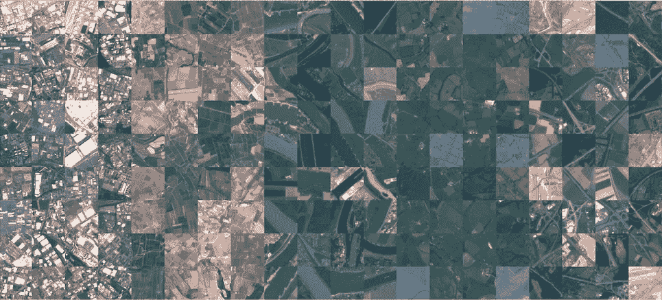
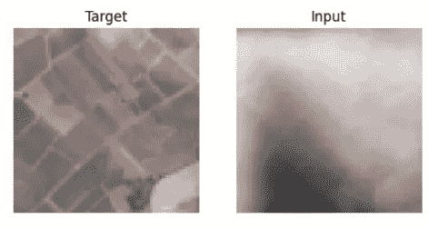
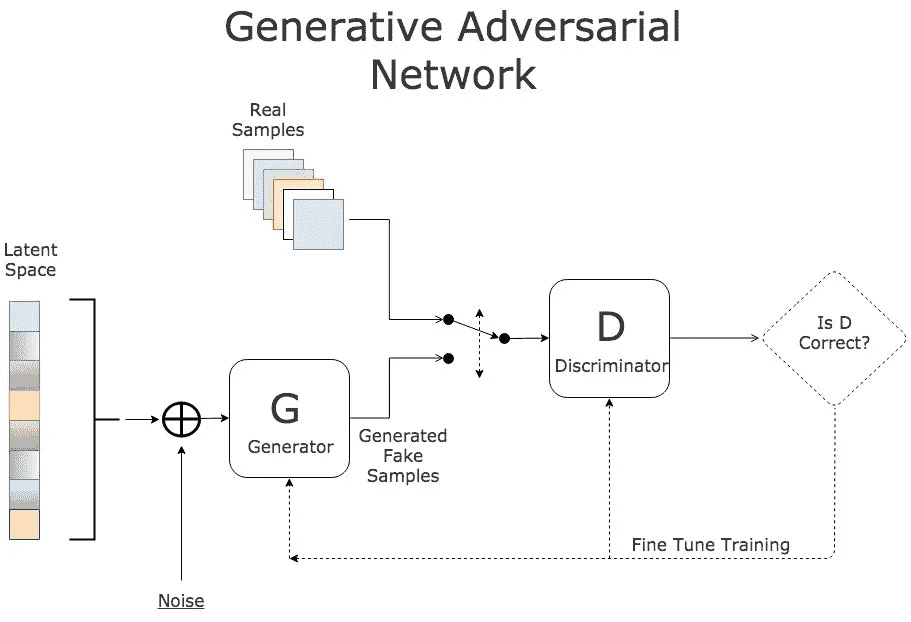
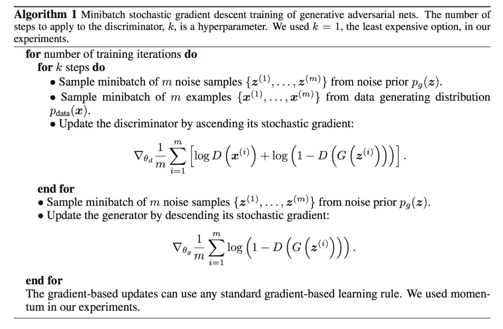
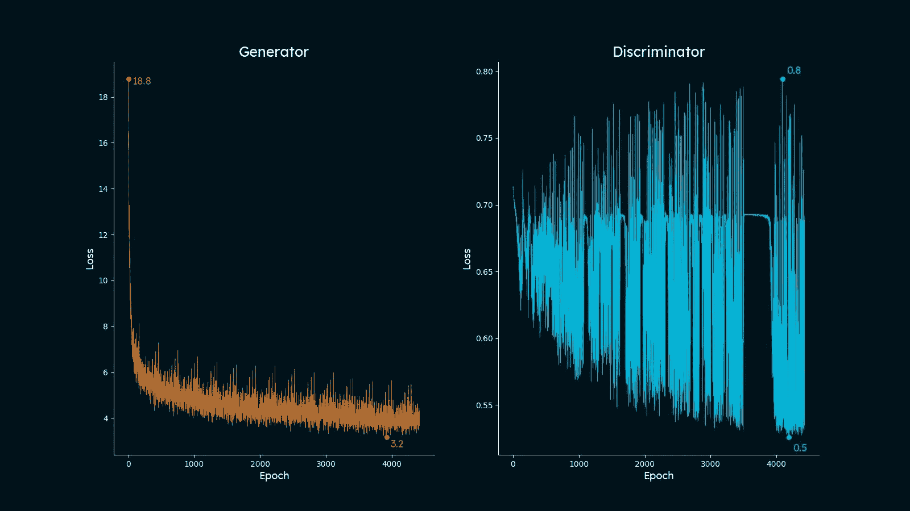
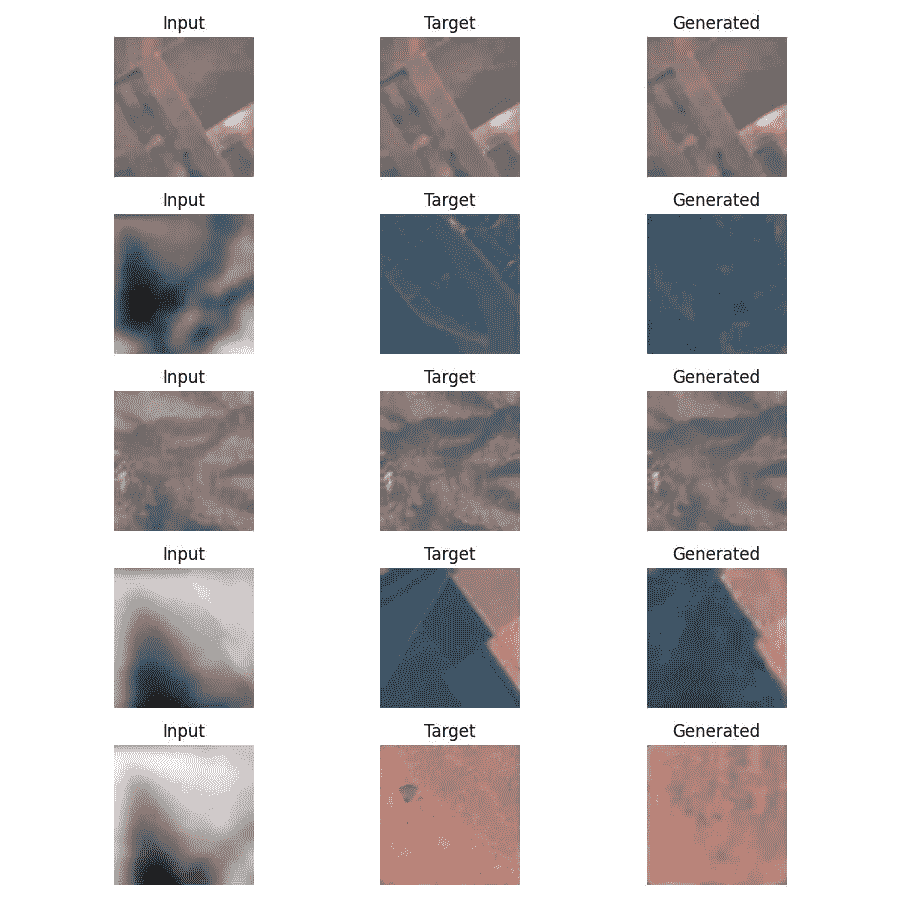

# 使用 GAN（生成对抗网络）去除卫星图像中的云

> 原文：[`towardsdatascience.com/erasing-clouds-from-satellite-imagery-using-gans-generative-adversarial-networks-2d7f8467ef2e?source=collection_archive---------2-----------------------#2024-06-15`](https://towardsdatascience.com/erasing-clouds-from-satellite-imagery-using-gans-generative-adversarial-networks-2d7f8467ef2e?source=collection_archive---------2-----------------------#2024-06-15)

## **从零开始在 Python 中构建 GAN**

[](https://medium.com/@alexroz?source=post_page---byline--2d7f8467ef2e--------------------------------)[](https://towardsdatascience.com/?source=post_page---byline--2d7f8467ef2e--------------------------------) [Aleksei Rozanov](https://medium.com/@alexroz?source=post_page---byline--2d7f8467ef2e--------------------------------)

·发布于 [Towards Data Science](https://towardsdatascience.com/?source=post_page---byline--2d7f8467ef2e--------------------------------) ·12 分钟阅读·2024 年 6 月 15 日

--


图片由 [Michael & Diane Weidner](https://unsplash.com/@michaelbweidner?utm_source=medium&utm_medium=referral) 提供，来源于 [Unsplash](https://unsplash.com/?utm_source=medium&utm_medium=referral)

生成对抗网络（GAN）的概念由 Goodfellow 和他的同事们在 2014 年提出 [1]，并且很快在计算机视觉和图像生成领域获得了极大关注。尽管在过去的 10 年里，人工智能领域经历了快速发展并出现了许多新算法，但这个概念的简单性和 brilliance（巧妙之处）依然令人印象深刻。所以今天我想通过尝试从卫星 RGB（红、绿、蓝）图像中去除云层，来展示这些网络的强大能力。

准备一个适当平衡、足够大且经过正确预处理的计算机视觉数据集需要大量时间，因此我决定探索 Kaggle 提供的资源。我发现最适合这个任务的数据集是 EuroSat [2]，它具有开放许可。该数据集包含 **27000** 张标注的 RGB 图像，尺寸为 64x64 像素，来自 [Sentinel-2](https://www.esa.int/Applications/Observing_the_Earth/Copernicus/Sentinel-2)，并用于解决多类分类问题。

[](https://www.kaggle.com/datasets/apollo2506/eurosat-dataset/data?source=post_page-----2d7f8467ef2e--------------------------------) [## EuroSat 数据集

### 数据集包含来自 Sentinel-2 的所有 RGB 和波段图像

[www.kaggle.com](https://www.kaggle.com/datasets/apollo2506/eurosat-dataset/data?source=post_page-----2d7f8467ef2e--------------------------------) 

EuroSat 数据集的图像示例。[许可](https://github.com/phelber/eurosat)。

我们对分类本身并不感兴趣，但 EuroSat 数据集的一个主要特点是，所有图像都有清晰的天空。这正是我们需要的。借用[3]中的方法，我们将这些 Sentinel-2 影像作为目标，通过向它们添加噪声（云朵）来创建输入。

那么在真正讨论 GANs 之前，我们先准备一下数据。首先，我们需要下载数据，并将所有类别合并到一个目录中。

**🐍完整的 Python 代码：** [**GitHub**](https://github.com/alexxxroz/Medium/blob/main/GANs%26Clouds.ipynb)**.**

```py
import numpy as np
import pandas as pd
import random

from os import listdir, mkdir, rename
from os.path import join, exists
import shutil
import datetime

import matplotlib.pyplot as plt
from highlight_text import ax_text, fig_text
from PIL import Image

import warnings

warnings.filterwarnings('ignore')
```

```py
classes = listdir('./EuroSat')
path_target = './EuroSat/all_targets'
path_input = './EuroSat/all_inputs'

"""RUN IT ONLY ONCE TO RENAME THE FILES IN THE UNPACKED ARCHIVE"""
mkdir(path_input)
mkdir(path_target)
k = 1
for kind in classes:
  path = join('./EuroSat', str(kind))
  for i, f in enumerate(listdir(path)):
    shutil.copyfile(join(path, f),
                  join(path_target, f))
    rename(join(path_target, f), join(path_target, f'{k}.jpg'))
    k += 1
```

第二个重要步骤是生成噪声。虽然你可以使用不同的方法，例如随机遮罩一些像素、添加一些高斯噪声，但在这篇文章中，我想尝试一个对我来说新颖的东西——Perlin 噪声。它是由 Ken Perlin 在 80 年代发明的[4]，用于开发电影中的烟雾效果。这种噪声与普通的随机噪声相比，具有更自然的外观。让我来证明一下。

```py
def generate_perlin_noise(width, height, scale, octaves, persistence, lacunarity):
    noise = np.zeros((height, width))
    for i in range(height):
        for j in range(width):
            noise[i][j] = pnoise2(i / scale,
                                  j / scale,
                                  octaves=octaves,
                                  persistence=persistence,
                                  lacunarity=lacunarity,
                                  repeatx=width,
                                  repeaty=height,
                                  base=0)
    return noise

def normalize_noise(noise):
    min_val = noise.min()
    max_val = noise.max()
    return (noise - min_val) / (max_val - min_val)

def generate_clouds(width, height, base_scale, octaves, persistence, lacunarity):
    clouds = np.zeros((height, width))
    for octave in range(1, octaves + 1):
        scale = base_scale / octave
        layer = generate_perlin_noise(width, height, scale, 1, persistence, lacunarity)
        clouds += layer * (persistence ** octave)

    clouds = normalize_noise(clouds)
    return clouds

def overlay_clouds(image, clouds, alpha=0.5):

    clouds_rgb = np.stack([clouds] * 3, axis=-1)

    image = image.astype(float) / 255.0
    clouds_rgb = clouds_rgb.astype(float)

    blended = image * (1 - alpha) + clouds_rgb * alpha

    blended = (blended * 255).astype(np.uint8)
    return blended
```

```py
width, height = 64, 64
octaves = 12 #number of noise layers combined
persistence = 0.5 #lower persistence reduces the amplitude of higher-frequency octaves
lacunarity = 2 #higher lacunarity increases the frequency of higher-frequency octaves
for i in range(len(listdir(path_target))):
  base_scale = random.uniform(5,120) #noise frequency
  alpha = random.uniform(0,1) #transparency

  clouds = generate_clouds(width, height, base_scale, octaves, persistence, lacunarity)

  img = np.asarray(Image.open(join(path_target, f'{i+1}.jpg')))
  image = Image.fromarray(overlay_clouds(img,clouds, alpha))
  image.save(join(path_input,f'{i+1}.jpg'))
  print(f'Processed {i+1}/{len(listdir(path_target))}')
```

```py
idx = np.random.randint(27000)
fig,ax = plt.subplots(1,2)
ax[0].imshow(np.asarray(Image.open(join(path_target, f'{idx}.jpg'))))
ax[1].imshow(np.asarray(Image.open(join(path_input, f'{idx}.jpg'))))
ax[0].set_title("Target")
ax[0].axis('off')
ax[1].set_title("Input")
ax[1].axis('off')
plt.show()
```



图片来源：[作者](https://medium.com/@alexroz)。

如上所示，图像中的云朵非常逼真，它们具有不同的“密度”和类似真实云朵的纹理。

如果你像我一样对 Perlin 噪声感兴趣，这里有一个非常酷的视频，展示了这种噪声如何应用于游戏开发行业：

既然我们现在有了一个现成可用的数据集，那么让我们来谈谈生成对抗网络（GANs）。

# 生成对抗网络（GAN）

为了更好地说明这个概念，假设你正在东南亚旅行，突然需要一件连帽衫，因为外面太冷了。你来到最近的街头市场，发现一家小店有一些品牌服装。卖家拿来一件不错的连帽衫让你试穿，并说它是著名品牌 ExpensiveButNotWorthIt。你仔细一看，得出结论，这显然是假的。卖家说：“等一下，我有真的。”然后他带着另一件连帽衫回来，看起来更像是品牌的，但依旧是假货。经过几轮这样的尝试后，卖家带来了一件无法分辨的传奇品牌 ExpensiveButNotWorthIt 的复制品，你便高兴地买下了它。这基本上就是生成对抗网络（GANs）的工作原理！

在 GANs 的情况下，你被称为判别器（D）。判别器的目标是区分真实物体和虚假物体，或者解决二分类任务。卖家被称为生成器（G），因为他在尝试生成高质量的假货。判别器和生成器是独立训练的，目的是互相超越。因此，最终我们得到一个高质量的假货。



GANs 架构。[许可](https://paperswithcode.com/method/gan)。

训练过程最初看起来是这样的：

1.  采样输入噪声（在我们的案例中是有云的图像）。

1.  将噪声输入 G 并收集预测结果。

1.  通过获取两个预测值来计算 D 的损失，一个是 G 的输出，另一个是真实数据的预测值。

1.  更新 D 的权重。

1.  再次采样输入噪声。

1.  将噪声输入 G 并收集预测结果。

1.  通过将 G 的预测输入到 D 中来计算 G 的损失。

1.  更新 G 的权重。



GANs 训练循环。来源：[1]。

换句话说，我们可以定义一个值函数 V(G,D)：


来源：[1]。

在这里，我们希望最小化项 **log(1-D(G(z)))** 来训练 G，并最大化 **log D(x)** 来训练 D（在此符号中，x 表示真实数据样本，z 表示噪声）。

现在让我们尝试在 pytorch 中实现它！

在原始论文中，作者提到使用多层感知器（MLP）；它通常也简称为 ANN，但我想尝试一个更复杂的方法——我想使用 UNet [5] 架构作为生成器，ResNet [6] 作为判别器。这两者都是著名的 CNN 架构，所以我不会在这里解释它们（如果需要我写一篇单独的文章，请在评论中告诉我）。

让我们来构建它们。判别器：

```py
import torch
import torch.nn as nn
import torch.optim as optim
import torch.nn.functional as F
from torch.utils.data import Dataset, DataLoader
from torchvision import transforms
from torch.utils.data import Subset
```

```py
class ResidualBlock(nn.Module):
    def __init__(self, in_channels, out_channels, stride = 1, downsample = None):
        super(ResidualBlock, self).__init__()
        self.conv1 = nn.Sequential(
                        nn.Conv2d(in_channels, out_channels, kernel_size = 3, stride = stride, padding = 1),
                        nn.BatchNorm2d(out_channels),
                        nn.ReLU())
        self.conv2 = nn.Sequential(
                        nn.Conv2d(out_channels, out_channels, kernel_size = 3, stride = 1, padding = 1),
                        nn.BatchNorm2d(out_channels))
        self.downsample = downsample
        self.relu = nn.ReLU()
        self.out_channels = out_channels

    def forward(self, x):
        residual = x
        out = self.conv1(x)
        out = self.conv2(out)
        if self.downsample:
            residual = self.downsample(x)
        out += residual
        out = self.relu(out)
        return out

class ResNet(nn.Module):
    def __init__(self, block=ResidualBlock, all_connections=[3,4,6,3]):
        super(ResNet, self).__init__()
        self.inputs = 16
        self.conv1 = nn.Sequential(
                        nn.Conv2d(3, 16, kernel_size = 3, stride = 1, padding = 1),
                        nn.BatchNorm2d(16),
                        nn.ReLU()) #16x64x64
        self.maxpool = nn.MaxPool2d(kernel_size = 2, stride = 2) #16x32x32

        self.layer0 = self.makeLayer(block, 16, all_connections[0], stride = 1) #connections = 3, shape: 16x32x32
        self.layer1 = self.makeLayer(block, 32, all_connections[1], stride = 2)#connections = 4, shape: 32x16x16
        self.layer2 = self.makeLayer(block, 128, all_connections[2], stride = 2)#connections = 6, shape: 1281x8x8
        self.layer3 = self.makeLayer(block, 256, all_connections[3], stride = 2)#connections = 3, shape: 256x4x4
        self.avgpool = nn.AvgPool2d(4, stride=1)
        self.fc = nn.Linear(256, 1)

    def makeLayer(self, block, outputs, connections, stride=1):
        downsample = None
        if stride != 1 or self.inputs != outputs:
            downsample = nn.Sequential(
                nn.Conv2d(self.inputs, outputs, kernel_size=1, stride=stride),
                nn.BatchNorm2d(outputs),
            )
        layers = []
        layers.append(block(self.inputs, outputs, stride, downsample))
        self.inputs = outputs
        for i in range(1, connections):
            layers.append(block(self.inputs, outputs))

        return nn.Sequential(*layers)

    def forward(self, x):
        x = self.conv1(x)
        x = self.maxpool(x)
        x = self.layer0(x)
        x = self.layer1(x)
        x = self.layer2(x)
        x = self.layer3(x)
        x = self.avgpool(x)
        x = x.view(-1, 256)
        x = self.fc(x).flatten()
        return F.sigmoid(x)
```

生成器：

```py
 class DoubleConv(nn.Module):
    def __init__(self, in_channels, out_channels):
        super(DoubleConv, self).__init__()
        self.double_conv = nn.Sequential(
            nn.Conv2d(in_channels, out_channels, kernel_size=3, padding=1),
            nn.BatchNorm2d(out_channels),
            nn.ReLU(inplace=True),
            nn.Conv2d(out_channels, out_channels, kernel_size=3, padding=1),
            nn.BatchNorm2d(out_channels),
            nn.ReLU(inplace=True)
        )

    def forward(self, x):
        return self.double_conv(x)

class UNet(nn.Module):
    def __init__(self):
      super().__init__()
      self.conv_1 = DoubleConv(3, 32) # 32x64x64
      self.pool_1 = nn.MaxPool2d(kernel_size=2, stride=2) # 32x32x32

      self.conv_2 = DoubleConv(32, 64)  #64x32x32
      self.pool_2 = nn.MaxPool2d(kernel_size=2, stride=2) #64x16x16

      self.conv_3 = DoubleConv(64, 128)  #128x16x16
      self.pool_3 = nn.MaxPool2d(kernel_size=2, stride=2) #128x8x8

      self.conv_4 = DoubleConv(128, 256)  #256x8x8
      self.pool_4 = nn.MaxPool2d(kernel_size=2, stride=2) #256x4x4

      self.conv_5 = DoubleConv(256, 512)  #512x2x2

      #DECODER
      self.upconv_1 = nn.ConvTranspose2d(512, 256, kernel_size=2, stride=2) #256x4x4
      self.conv_6 = DoubleConv(512, 256) #256x4x4

      self.upconv_2 = nn.ConvTranspose2d(256, 128, kernel_size=2, stride=2) #128x8x8
      self.conv_7 = DoubleConv(256, 128)  #128x8x8

      self.upconv_3 = nn.ConvTranspose2d(128, 64, kernel_size=2, stride=2) #64x16x16
      self.conv_8 = DoubleConv(128, 64)  #64x16x16

      self.upconv_4 = nn.ConvTranspose2d(64, 32, kernel_size=2, stride=2) #32x32x32
      self.conv_9 = DoubleConv(64, 32)  #32x32x32

      self.output = nn.Conv2d(32, 3, kernel_size = 3, stride = 1, padding = 1) #3x64x64

    def forward(self, batch):

      conv_1_out = self.conv_1(batch)
      conv_2_out = self.conv_2(self.pool_1(conv_1_out))
      conv_3_out = self.conv_3(self.pool_2(conv_2_out))
      conv_4_out = self.conv_4(self.pool_3(conv_3_out))
      conv_5_out = self.conv_5(self.pool_4(conv_4_out))

      conv_6_out = self.conv_6(torch.cat([self.upconv_1(conv_5_out), conv_4_out], dim=1))
      conv_7_out = self.conv_7(torch.cat([self.upconv_2(conv_6_out), conv_3_out], dim=1))
      conv_8_out = self.conv_8(torch.cat([self.upconv_3(conv_7_out), conv_2_out], dim=1))
      conv_9_out = self.conv_9(torch.cat([self.upconv_4(conv_8_out), conv_1_out], dim=1))

      output = self.output(conv_9_out)

      return F.sigmoid(output)
```

现在我们需要将数据划分为训练集和测试集，并将它们封装为 torch 数据集：

```py
class dataset(Dataset):
  def __init__(self, batch_size, images_paths, targets, img_size = 64):
    self.batch_size = batch_size
    self.img_size = img_size
    self.images_paths = images_paths
    self.targets = targets
    self.len = len(self.images_paths) // batch_size

    self.transform = transforms.Compose([
                transforms.ToTensor(),
                ])

    self.batch_im = [self.images_paths[idx * self.batch_size:(idx + 1) * self.batch_size] for idx in range(self.len)]
    self.batch_t = [self.targets[idx * self.batch_size:(idx + 1) * self.batch_size] for idx in range(self.len)]

  def __getitem__(self, idx):
      pred = torch.stack([
              self.transform(Image.open(join(path_input,file_name)))
              for file_name in self.batch_im[idx]
          ])
      target = torch.stack([
              self.transform(Image.open(join(path_target,file_name)))
              for file_name in self.batch_im[idx]
          ])
      return pred, target

  def __len__(self):
      return self.len
```

完美。是时候编写训练循环了。在此之前，让我们定义我们的损失函数和优化器：

```py
device = torch.device("cuda" if torch.cuda.is_available() else "cpu")

batch_size = 64
num_epochs = 15
learning_rate_D = 1e-5
learning_rate_G = 1e-4

discriminator = ResNet()
generator = UNet()

bce = nn.BCEWithLogitsLoss()
l1loss = nn.L1Loss()

optimizer_D = optim.Adam(discriminator.parameters(), lr=learning_rate_D)
optimizer_G = optim.Adam(generator.parameters(), lr=learning_rate_G)

scheduler_D = optim.lr_scheduler.StepLR(optimizer_D, step_size=10, gamma=0.1)
scheduler_G = optim.lr_scheduler.StepLR(optimizer_G, step_size=10, gamma=0.1)
```

如你所见，这些损失与 GAN 算法中的图片有所不同。特别是，我加入了 L1Loss。其想法是，我们不仅仅是从噪声中生成一张随机图片，我们还希望保留输入中的大部分信息，只去除噪声。所以 G 的损失将是：

**G_loss = log(1 − D(G(z))) + 𝝀 |G(z)-y|**

而不是仅仅

**G_loss = log(1 − D(G(z)))**

𝝀 是一个任意系数，用于平衡损失函数的两个部分。

最后，让我们划分数据并开始训练过程：

```py
test_ratio, train_ratio = 0.3, 0.7
num_test = int(len(listdir(path_target))*test_ratio)
num_train = int((int(len(listdir(path_target)))-num_test))

img_size = (64, 64)

print("Number of train samples:", num_train)
print("Number of test samples:", num_test)

random.seed(231)
train_idxs = np.array(random.sample(range(num_test+num_train), num_train))
mask = np.ones(num_train+num_test, dtype=bool)
mask[train_idxs] = False

images = {}
features = random.sample(listdir(path_input),num_test+num_train)
targets = random.sample(listdir(path_target),num_test+num_train)

random.Random(231).shuffle(features)
random.Random(231).shuffle(targets)

train_input_img_paths = np.array(features)[train_idxs]
train_target_img_path = np.array(targets)[train_idxs]
test_input_img_paths = np.array(features)[mask]
test_target_img_path = np.array(targets)[mask]

train_loader = dataset(batch_size=batch_size, img_size=img_size, images_paths=train_input_img_paths, targets=train_target_img_path)
test_loader = dataset(batch_size=batch_size, img_size=img_size, images_paths=test_input_img_paths, targets=test_target_img_path)
```

现在我们可以运行我们的训练循环：

```py
train_loss_G, train_loss_D, val_loss_G, val_loss_D = [], [], [], []
all_loss_G, all_loss_D = [], []
best_generator_epoch_val_loss, best_discriminator_epoch_val_loss = -np.inf, -np.inf
for epoch in range(num_epochs):

    discriminator.train()
    generator.train()

    discriminator_epoch_loss, generator_epoch_loss = 0, 0

    for inputs, targets in train_loader:
        inputs, true = inputs, targets

        '''1\. Training the Discriminator (ResNet)'''
        optimizer_D.zero_grad()

        fake = generator(inputs).detach()

        pred_fake = discriminator(fake).to(device)
        loss_fake = bce(pred_fake, torch.zeros(batch_size, device=device))

        pred_real = discriminator(true).to(device)
        loss_real = bce(pred_real, torch.ones(batch_size, device=device))

        loss_D = (loss_fake+loss_real)/2

        loss_D.backward()
        optimizer_D.step()

        discriminator_epoch_loss += loss_D.item()
        all_loss_D.append(loss_D.item())

        '''2\. Training the Generator (UNet)'''
        optimizer_G.zero_grad()

        fake = generator(inputs)
        pred_fake = discriminator(fake).to(device)

        loss_G_bce = bce(pred_fake, torch.ones_like(pred_fake, device=device))
        loss_G_l1 = l1loss(fake, targets)*100
        loss_G = loss_G_bce + loss_G_l1
        loss_G.backward()
        optimizer_G.step()

        generator_epoch_loss += loss_G.item()
        all_loss_G.append(loss_G.item())

    discriminator_epoch_loss /= len(train_loader)
    generator_epoch_loss /= len(train_loader)
    train_loss_D.append(discriminator_epoch_loss)
    train_loss_G.append(generator_epoch_loss)

    discriminator.eval()
    generator.eval()

    discriminator_epoch_val_loss, generator_epoch_val_loss = 0, 0

    with torch.no_grad():
        for inputs, targets in test_loader:
            inputs, targets = inputs, targets

            fake = generator(inputs)
            pred = discriminator(fake).to(device)

            loss_G_bce = bce(fake, torch.ones_like(fake, device=device))
            loss_G_l1 = l1loss(fake, targets)*100
            loss_G = loss_G_bce + loss_G_l1
            loss_D = bce(pred.to(device), torch.zeros(batch_size, device=device))

            discriminator_epoch_val_loss += loss_D.item()
            generator_epoch_val_loss += loss_G.item()

    discriminator_epoch_val_loss /= len(test_loader)
    generator_epoch_val_loss /= len(test_loader)

    val_loss_D.append(discriminator_epoch_val_loss)
    val_loss_G.append(generator_epoch_val_loss)

    print(f"------Epoch [{epoch+1}/{num_epochs}]------\nTrain Loss D: {discriminator_epoch_loss:.4f}, Val Loss D: {discriminator_epoch_val_loss:.4f}")
    print(f'Train Loss G: {generator_epoch_loss:.4f}, Val Loss G: {generator_epoch_val_loss:.4f}')

    if discriminator_epoch_val_loss > best_discriminator_epoch_val_loss:
        discriminator_epoch_val_loss = best_discriminator_epoch_val_loss
        torch.save(discriminator.state_dict(), "discriminator.pth")
    if generator_epoch_val_loss > best_generator_epoch_val_loss:
        generator_epoch_val_loss = best_generator_epoch_val_loss
        torch.save(generator.state_dict(), "generator.pth")
    #scheduler_D.step()
    #scheduler_G.step()

    fig, ax = plt.subplots(1,3)
    ax[0].imshow(np.transpose(inputs.numpy()[7], (1,2,0)))
    ax[1].imshow(np.transpose(targets.numpy()[7], (1,2,0)))
    ax[2].imshow(np.transpose(fake.detach().numpy()[7], (1,2,0)))
    plt.show()
```

代码完成后，我们可以绘制损失图。此代码部分来源于[这个酷网站](https://python-graph-gallery.com/web-small-multiple-with-highlights/)：

```py
from matplotlib.font_manager import FontProperties

background_color = '#001219'
font = FontProperties(fname='LexendDeca-VariableFont_wght.ttf')
fig, ax = plt.subplots(1, 2, figsize=(16, 9))
fig.set_facecolor(background_color)
ax[0].set_facecolor(background_color)
ax[1].set_facecolor(background_color)

ax[0].plot(range(len(all_loss_G)), all_loss_G, color='#bc6c25', lw=0.5) 
ax[1].plot(range(len(all_loss_D)), all_loss_D, color='#00b4d8', lw=0.5)

ax[0].scatter(
      [np.array(all_loss_G).argmax(), np.array(all_loss_G).argmin()],
      [np.array(all_loss_G).max(), np.array(all_loss_G).min()],
      s=30, color='#bc6c25',
   )
ax[1].scatter(
      [np.array(all_loss_D).argmax(), np.array(all_loss_D).argmin()],
      [np.array(all_loss_D).max(), np.array(all_loss_D).min()],
      s=30, color='#00b4d8',
   )

ax_text(
      np.array(all_loss_G).argmax()+60, np.array(all_loss_G).max()+0.1,
      f'{round(np.array(all_loss_G).max(),1)}',
      fontsize=13, color='#bc6c25',
      font=font,
      ax=ax[0]
   )
ax_text(
      np.array(all_loss_G).argmin()+60, np.array(all_loss_G).min()-0.1,
      f'{round(np.array(all_loss_G).min(),1)}',
      fontsize=13, color='#bc6c25',
      font=font,
      ax=ax[0]
   )

ax_text(
      np.array(all_loss_D).argmax()+60, np.array(all_loss_D).max()+0.01,
      f'{round(np.array(all_loss_D).max(),1)}',
      fontsize=13, color='#00b4d8',
      font=font,
      ax=ax[1]
   )
ax_text(
      np.array(all_loss_D).argmin()+60, np.array(all_loss_D).min()-0.005,
      f'{round(np.array(all_loss_D).min(),1)}',
      fontsize=13, color='#00b4d8',
      font=font,
      ax=ax[1]
   )
for i in range(2):
    ax[i].tick_params(axis='x', colors='white')
    ax[i].tick_params(axis='y', colors='white')
    ax[i].spines['left'].set_color('white') 
    ax[i].spines['bottom'].set_color('white') 
    ax[i].set_xlabel('Epoch', color='white', fontproperties=font, fontsize=13)
    ax[i].set_ylabel('Loss', color='white', fontproperties=font, fontsize=13)

ax[0].set_title('Generator', color='white', fontproperties=font, fontsize=18)
ax[1].set_title('Discriminator', color='white', fontproperties=font, fontsize=18)
plt.savefig('Loss.jpg')
plt.show()
# ax[0].set_axis_off()
# ax[1].set_axis_off()
```



图片来源：[作者](https://medium.com/@alexroz)。

同时也可以可视化来自测试数据集的随机样本：

```py
random.Random(2).shuffle(test_target_img_path)
random.Random(2).shuffle(test_input_img_paths)
subset_loader = dataset(batch_size=5, img_size=img_size, images_paths=test_input_img_paths,
                        targets=test_target_img_path)
generator = UNet()
generator.load_state_dict(torch.load('generator.pth'))

generator.eval()
for X, y in subset_loader:
    fig, axes = plt.subplots(5, 3, figsize=(9, 9))

    for i in range(5):
        axes[i, 0].imshow(np.transpose(X.numpy()[i], (1, 2, 0)))
        axes[i, 0].set_title("Input")
        axes[i, 0].axis('off')

        axes[i, 1].imshow(np.transpose(y.numpy()[i], (1, 2, 0)))
        axes[i, 1].set_title("Target")
        axes[i, 1].axis('off')

        generated_image = generator(X[i].unsqueeze(0)).detach().numpy()[0]
        axes[i, 2].imshow(np.transpose(generated_image, (1, 2, 0)))
        axes[i, 2].set_title("Generated")
        axes[i, 2].axis('off')

    # Adjust layout
    plt.tight_layout()
    plt.savefig('Test.jpg')
    plt.show()
    break 
```



图片来源：[作者](https://medium.com/@alexroz)。

如你所见，结果并不完美，并且很大程度上依赖于地貌类型。然而，构建的模型肯定能够去除图像中的云层，并且通过增加 G 和 D 的深度可以提高其性能。另一个有前景的策略是为不同的地貌类型训练独立的模型。例如，农田和水域的空间特征差异较大，这可能会影响模型的泛化能力。

我希望这篇文章能为你提供一种在地理空间领域应用深度学习算法的新视角。在我看来，生成对抗网络（GANs）是数据科学家可以利用的最强大工具之一，我希望它们也能成为你工具箱中的重要组成部分！

===========================================

***参考文献：***

1\. Goodfellow, Ian, Jean Pouget-Abadie, Mehdi Mirza, Bing Xu, David Warde-Farley, Sherjil Ozair, Aaron Courville 和 Yoshua Bengio。“生成对抗网络。” *神经信息处理系统进展* 27（2014 年）。[`proceedings.neurips.cc/paper_files/paper/2014/file/5ca3e9b122f61f8f06494c97b1afccf3-Paper.pdf`](https://proceedings.neurips.cc/paper_files/paper/2014/file/5ca3e9b122f61f8f06494c97b1afccf3-Paper.pdf)

2\. Helber, Patrick, Benjamin Bischke, Andreas Dengel 和 Damian Borth。“Eurosat：一个用于土地利用和土地覆盖分类的全新数据集和深度学习基准。” *IEEE 应用地球观测与遥感精选主题期刊* 12 卷，第 7 期（2019 年）：2217–2226。[`arxiv.org/pdf/1709.00029`](https://arxiv.org/pdf/1709.00029)

3\. Wen, Xue, Zongxu Pan, Yuxin Hu 和 Jiayin Liu。“基于 YUV 颜色空间的生成对抗学习用于卫星图像中的薄云去除。” *遥感* 13 卷，第 6 期（2021 年）：1079。[`www.mdpi.com/2072-4292/13/6/1079`](https://www.mdpi.com/2072-4292/13/6/1079)

4\. Perlin, Ken。“图像合成器。” *ACM Siggraph 计算机图形学* 19 卷，第 3 期（1985 年）：287–296。[`dl.acm.org/doi/pdf/10.1145/325165.325247`](https://dl.acm.org/doi/pdf/10.1145/325165.325247)

5\. Ronneberger, Olaf, Philipp Fischer 和 Thomas Brox。“U-net：用于生物医学图像分割的卷积网络。” 见 *医学图像计算与计算机辅助干预–MICCAI 2015：第 18 届国际会议，德国慕尼黑，2015 年 10 月 5 日至 9 日，会议录，第三部分 18*，第 234–241 页。施普林格国际出版公司，2015 年。[`arxiv.org/pdf/1505.04597`](https://arxiv.org/pdf/1505.04597)

6\. He, Kaiming 等人。“深度残差学习用于图像识别。” *IEEE 计算机视觉与模式识别会议论文集*。2016。[`openaccess.thecvf.com/content_cvpr_2016/papers/He_Deep_Residual_Learning_CVPR_2016_paper.pdf`](https://openaccess.thecvf.com/content_cvpr_2016/papers/He_Deep_Residual_Learning_CVPR_2016_paper.pdf)

===========================================

***我在 Medium 上的所有出版物都是免费的并且开放访问的，因此如果你在这里关注我，我将非常感激！***

P.s. 我对（地理）数据科学、机器学习/人工智能和气候变化充满热情。如果你想合作进行某些项目，请在[LinkedIn](https://www.linkedin.com/in/alexxxroz/)上联系我。

🛰️关注以获取更多信息🛰️
