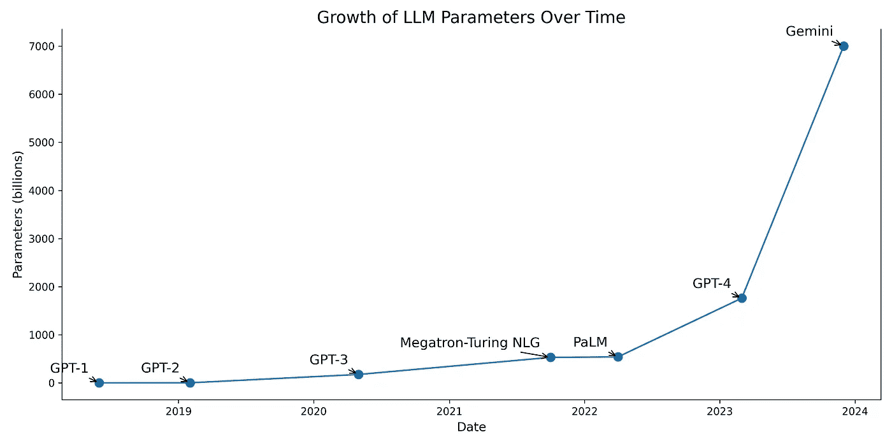

# 实施机器学习的关键考虑事项

> 原文：[`towardsdatascience.com/essential-considerations-for-implementing-machine-learning-36096d6db0b7?source=collection_archive---------5-----------------------#2024-07-13`](https://towardsdatascience.com/essential-considerations-for-implementing-machine-learning-36096d6db0b7?source=collection_archive---------5-----------------------#2024-07-13)

## ***从传统机器学习和生产化的角度来看，你的使用案例是否是一个可行的机器学习产品？***

 [Conal Henderson](https://medium.com/@conalhenderson?source=post_page---byline--36096d6db0b7--------------------------------)

·发布于 [Towards Data Science](https://towardsdatascience.com/?source=post_page---byline--36096d6db0b7--------------------------------) ·7 分钟阅读·2024 年 7 月 13 日

--

图片来源：[Tara Winstead](https://www.pexels.com/@tara-winstead/) 于 [Pixels](https://www.pexels.com/photo/robot-pointing-on-a-wall-8386440/)

你是否曾经考虑过构建一个数据应用程序，但不知道构建机器学习系统的需求？或者，也许你是公司的一位高级经理，计划使用机器学习，但不确定你的使用案例是否适合机器学习。

很多企业正在努力跟上 AI/ML 技术的指数级增长，许多人意识到，如果他们不在发展路线图中考虑 AI/ML，可能会面临生死存亡的局面。

企业们看到了大型语言模型（LLM）的潜力，认为 AI/ML 是解决问题的*“万能钥匙”*。大多数企业正在投入资金建立新的数据团队、购买计算资源和最新的数据库技术，但他们是否知道他们的问题能通过机器学习解决呢？

我已经提炼出一个检查清单，来验证你的机器学习想法是否在**传统机器学习视角**下是可行的，包括：

***1\. 你是否拥有适合预测的特征？

2\. 你的数据中是否有可以学习的模式？

3\. 你是否拥有足够的数据使机器学习有效，或者你能从其他来源收集数据吗？

4\. 你的使用案例是否可以框定为一个预测问题？

5\. 你希望预测的数据是否与训练数据有相关模式？***

从**生产化机器学习解决方案**的角度来看：

***1\. 你的使用案例是否具有重复性？

2\. 错误的预测会对最终用户产生严重后果吗？

3\. 你的使用案例是否具备可扩展性？

4\. 你的使用案例是一个模式不断演变的问题吗？***

# 传统考虑

亚瑟·塞缪尔（Arthur Samuel）在 1959 年首次推广了“机器学习”这一术语，并表示它是*“赋予计算机在不被明确编程的情况下学习的能力的研究领域”*。

Chip Huyen（人工智能/机器学习领域的领军人物和企业家）在她的书《*设计机器学习系统*》中提供了机器学习的一个更系统的定义——这本书是任何有意从事生产性机器学习的人必读的：

> “机器学习是一种方法，(1) 从(2) 现有数据中学习(3) 复杂模式，并使用这些模式来对(4) 未见过的数据进行(5) 预测。”

Chip 将机器学习的组成部分分为五个部分，并通过包含机器学习采用的四个现代原因来进一步扩展它们，我们将在下面深入分析这些原因。

## 学习机会

*你是否具备适当的特征来进行预测？*

数据是机器学习的基础。它提供了输入和输出，产生反映数据模式的预测。

例如，你可能是一个狂热的足球迷，你想要根据过去的表现[预测英超球员的市场价值](https://github.com/chonalchendo/fpl_analysis?tab=readme-ov-file)

输入数据将包括球员的统计数据，如进球和助攻，以及相关的球员价值。一个机器学习模型可以从这些输入数据中学习模式，以预测未见过的球员数据。

## 复杂模式

*你的数据中是否有可供学习的模式？*

当数据复杂且人类无法轻松识别出预测输出所需的模式时，机器学习的效果最好。

在足球球员市场价值的例子中，考虑到球员的价值取决于许多变量，准确地评估一名球员的价值可能会很困难。机器学习模型可以将价值（输出）和表现统计数据（输入）结合起来，自动计算出评估结果。

## 数据可用性

*你是否拥有足够的数据使机器学习有效，或者你能从其他来源收集数据吗？*

关于数据还是更好的算法能带来更强的预测能力，存在着持续的争论。尽管，随着大型语言模型（LLMs）在数据集规模扩展到数百亿甚至万亿参数后取得的巨大性能飞跃，这场辩论最近已经有所平息。

数据来源：[维基百科](https://timelines.issarice.com/wiki/Timeline_of_large_language_models)

数据需要为你的机器学习应用程序提供充足的学习资源。如果数据稀缺，那么机器学习可能不是最佳的解决方案。

在足球领域，数据供应商如[Opta](https://theanalyst.com/eu/2023/07/opta-football-match-centre/)、[Fbref](https://fbref.com/en/) 和[Transfermarkt](https://www.transfermarkt.co.uk/)持续生成球员表现数据，因为各个俱乐部在各个方面（从球员表现到招聘）都希望通过数据驱动的决策来提高效率。

然而，从像 Opta 这样的第三方获取数据非常昂贵，因为数据收集过程非常密集，而且对详细统计数据的需求很高，以便为团队提供竞争优势。

## 通过预测解决的问题

*你的使用案例能否被框定为预测问题？*

我们可以从多种方式将足球运动员市场价值的例子框定为预测问题。

机器学习预测的两种常见类型是**回归**和**分类**。回归返回一个**连续的**预测（即数字），其规模与输入变量相同（即价值）。而分类可以返回**二元**（1 或 0）、**多分类**（1, 2, 3…n）或**多标签**（1, 0, 1, 0, 1）预测。

玩家价值预测问题可以被框定为回归和多分类问题。回归只是返回一个数字，例如根据赛季表现预测裘德·贝林厄姆的价值为 1 亿英镑。

相反，如果我们将其视为分类问题，我们可以将估值分入不同的类别，并预测一个玩家属于哪个估值类别。例如，预测类别可以是£1m-£10m，£10m-£30m，以及£30m+。

## 相似的未见数据

*你希望预测的数据与训练数据之间是否存在相关模式？*

你希望预测的未见数据必须与用于训练机器学习模型的数据具有相似的模式。

例如，如果我使用 2004 年的球员数据来训练一个机器学习模型以预测球员的估值。如果未见数据来自 2020 年，那么预测将无法反映训练到预测过程中 16 年间市场估值的变化。

# 生产考虑因素

机器学习模型开发只是一个更大系统中的一小部分，这个系统是为了让机器学习发挥作用所必需的。

如果你在没有理解模型如何在大规模上表现的情况下单独构建模型，那么在生产环境中，你可能会发现模型不可行。

你的机器学习使用案例必须能够满足生产级别的标准。

## 重复任务

*你的使用案例是否具有重复性？*

机器学习需要通过重复模式来进行学习。模型需要大量的样本来充分学习这些模式，这意味着如果你的预测目标发生得比较频繁，那么你很可能会有足够的数据供机器学习去学习这些模式。

例如，如果你的使用案例涉及预测一些罕见的事件，比如一种不常见的医疗状况，那么你的数据中可能没有足够的信号供机器学习模型捕捉，从而导致预测不准确。

这个问题被称为**类别不平衡**，为了克服这个问题，已经开发出了过采样和欠采样等策略。

Travis Tang 的文章很好地解释了类别不平衡以及解决方法的更多细节，可以参考这里。

## 错误预测的后果较小

*错误预测是否会对最终用户产生严重后果？*

机器学习模型每次都无法做到 100%的预测准确率，这意味着当模型做出错误预测时，它会产生负面影响吗？

这是医疗领域中常见的问题，虚假阳性和虚假阴性率是其中的关注点。

虚假阳性预测表示存在某种状况，但该状况*并不存在*。这可能导致资源的低效分配，并给患者带来不必要的压力。

甚至更糟的是，虚假阴性未能发现存在的状况，导致*实际存在*的状况未被察觉。这可能导致患者误诊和治疗延误，进而引发医疗并发症，并增加治疗更严重病情的长期成本。

## 规模

*你的应用案例是否具有可扩展性？*

生产成本可能非常昂贵，我自己就遇到过这种情况，当时我在谷歌的[Vertex AI](https://cloud.google.com/vertex-ai?hl=en)上托管了一个[XGBRegressor](https://xgboost.readthedocs.io/en/stable/python/python_api.html#module-xgboost.sklearn)模型，2 天花费了我 11 英镑！诚然，我不应该让它一直运行，但想象一下大规模应用的成本。

一个广为人知的可扩展机器学习解决方案例子是亚马逊的产品推荐系统，它[创造了公司 35%的收入](https://www.mckinsey.com/industries/retail/our-insights/how-retailers-can-keep-up-with-consumers)。

尽管这是一个极端的例子，但这个系统利用并证明了计算能力、数据、基础设施和人才的成本，展示了构建可扩展的机器学习解决方案的基本原理，能够创造价值。

## 发展中的模式

*你的应用案例是否是一个模式不断变化的问题？*

机器学习足够灵活，可以轻松适应新模式，避免每次数据变化时都需要不断地硬编码新解决方案。

足球运动员的价值会随着战术的演变而不断变化，导致球队对球员的需求发生变化，意味着在预测价值时特征的权重也会发生变化。

为了监控变化，像[ Mlflow](https://mlflow.org/)和[Weights & Biases](https://wandb.ai/site)这样的工具有助于跟踪和记录模型的表现，并根据不断变化的数据模式更新它们。

# 结论

决定是否使用机器学习应考虑的不仅仅是使用你现有的历史数据，套用一个花哨的算法并期待结果。

这需要思考复杂的模式，特别是当你有现有数据和未来数据时，以及生产问题，比如错误预测的成本是否便宜？我的应用案例是否具有可扩展性？模式是否在不断演变？

你不应该使用机器学习的原因有很多，包括伦理问题、成本效益以及是否有更简单的解决方案，但这些可以留到下次再讨论。

**目前就这些！**

感谢阅读！如果我遗漏了什么，请告诉我，我也很愿意听听大家关于机器学习应用的案例！

在[LinkedIn](https://www.linkedin.com/in/conal-henderson-4128631b6/)上与我联系

## 参考文献

Huyen, C. (2022). 《设计机器学习系统》。Sebastopol, CA: O’Reilly

Geron, A. (2019). 《动手实践机器学习：使用 Scikit-Learn、Keras 和 TensorFlow 构建智能系统的概念、工具和技术（第 2 版）》。O’Reilly.
