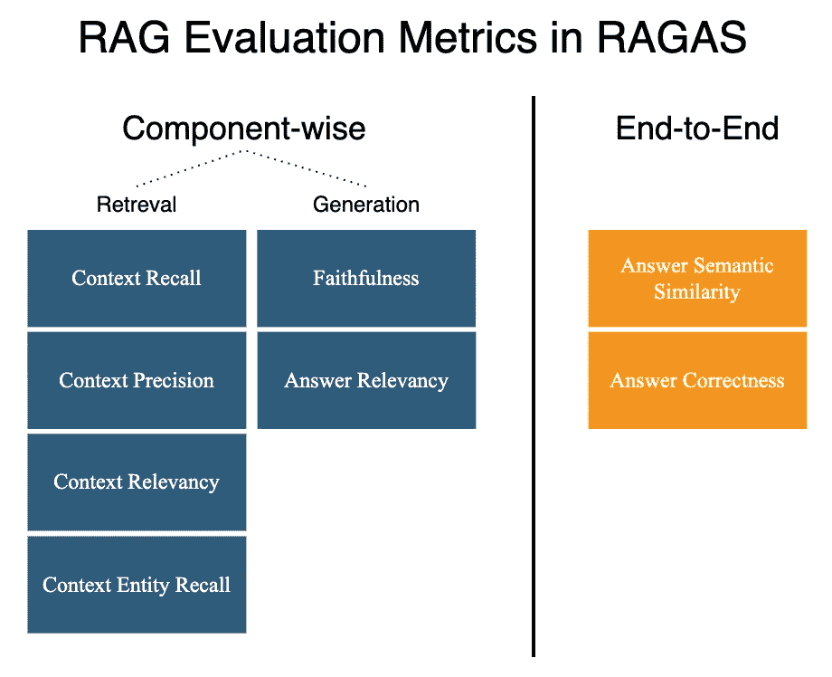

# 严格评估 RAG，或者失败

> 原文：[`towardsdatascience.com/evaluate-rags-rigorously-or-perish-54f790557357?source=collection_archive---------6-----------------------#2024-04-26`](https://towardsdatascience.com/evaluate-rags-rigorously-or-perish-54f790557357?source=collection_archive---------6-----------------------#2024-04-26)

## 使用 RAGAs 框架和超参数优化提升你 RAG 系统的质量。

[](https://medium.com/@jgrygolec?source=post_page---byline--54f790557357--------------------------------)[](https://towardsdatascience.com/?source=post_page---byline--54f790557357--------------------------------) [Jarek Grygolec, Ph.D.](https://medium.com/@jgrygolec?source=post_page---byline--54f790557357--------------------------------)

·发布于 [Towards Data Science](https://towardsdatascience.com/?source=post_page---byline--54f790557357--------------------------------) ·11 分钟阅读·2024 年 4 月 26 日

--


这是一幅展示“LLMs 评估 RAG”的图示。作者使用 Canva 中的 AI 生成了该图。

**简而言之**

如果你开发一个 RAG 系统，你必须在不同的设计选项之间做出选择。ragas 库可以通过生成基于你文档的答案的合成评估数据来帮助你。这使得可能对 RAG 系统进行严格评估，采用经典的训练/验证/测试数据集划分，从而提升 RAG 系统的质量。

**引言**

在实际操作中，开发一个检索增强生成（RAG）系统需要做出许多决定，这些决定会直接影响其最终质量，例如关于文本分割器、块大小、重叠大小、嵌入模型、存储的元数据、语义搜索的距离度量、用于重排的 top-k、重排模型、上下文的 top-k、提示工程等。

**现实情况：** 在大多数情况下，这类决策并没有基于方法论上严谨的评估实践，而是由开发人员和产品负责人做出的临时判断，这些人往往面临截止日期的压力。

**黄金标准：** 相比之下，RAG 系统的严格评估应包括：

+   一个大型评估集，以便能够以较低的置信区间估算性能指标

+   评估集中的多样化问题

+   针对内部文档的特定答案

+   检索和生成的独立评估

+   对整个 RAG 系统的评估

+   训练/验证/测试数据集划分，以确保良好的泛化能力

+   超参数优化

> 由于缺乏基于私有文档的答案评估集，大多数 RAG 系统未能达到黄金标准进行严格评估！

通用的大型语言模型（LLM）基准（如 GLUE、SuperGlue、MMLU、BIG-Bench、HELM 等）对于评估 RAG 系统的相关性不大，因为 RAG 的本质在于从 LLM 无法知晓的内部文档中提取信息。如果你坚持使用 LLM 基准来评估 RAG 系统，一种方法是选择与你领域特定的任务，并量化在这个选定任务上，RAG 系统相较于基础 LLM 所增加的价值。

通用 LLM 基准的替代方案是基于内部文档创建人工标注的测试集，使得问题的解答需要访问这些内部文档才能正确回答。这种解决方案通常成本高昂。此外，外包标注可能对内部文档造成问题，因为这些文档可能包含敏感或私人信息，不能与外部方共享。

这里是[RAGAs 框架](https://arxiv.org/abs/2309.15217)（检索增强生成评估）[1]，用于无参考的 RAG 评估，并提供了**ragas**包的 Python 实现：

```py
pip install ragas
```

它提供了**严格 RAG 评估所需的工具**：

+   合成评估集的生成

+   专门用于 RAG 评估的度量标准

+   针对非英语语言的提示调整

+   与 LangChain 和 Llama-Index 的集成

**合成评估集**

LLM 爱好者，包括我自己，建议使用 LLM 作为解决许多问题的方案。这里的意思是：

> LLM 并非自主的，但可能是有用的。RAGAs 利用 LLM 生成合成评估集来评估 RAG 系统。

RAGAs 框架继承了 Evol-Instruct 框架，该框架使用 LLM 在演化过程中生成多样化的指令数据集（即问题—答案对，QA）。


图 1：描绘了 RAGAs 中问题演化的过程。作者在 Canva 和 draw.io 中创建了这张图。

在 Evol-Instruct 框架中，LLM 从一组简单的初始指令开始，逐渐将其改写为更复杂的指令，创造多样化的指令数据。Can Xu 等人[2]认为，指令数据的逐步、增量演化会产生高质量的结果。在 RAGAs 框架中，由 LLM 生成并演化的指令数据是基于现有文档的。ragas 库目前实现了三种不同类型的指令数据演化方式，按深度演化，起始于简单问题：

+   **推理：** 重写问题以增加推理的需求。

+   **条件化：** 重写问题以引入一个条件元素。

+   **多上下文：** 重写问题，要求多份文档或多个部分来回答。

此外，ragas 库还提供了生成对话的选项。现在，让我们来看一下 ragas 在实践中的应用。

**问题演化的示例**

我们将使用关于大语言模型 [3] 的 Wikipedia 页面作为 ragas 库生成问题 — 真实答案对的源文档，每种演化类型都有一个问题 — 真实答案对。

> 要***运行代码***：你可以按照文章中的代码片段，或者访问包含所有相关代码的 Github 笔记本，在 Colab 或本地运行：

[](https://github.com/gox6/colab-demos/blob/main/rags/evaluate-rags-rigorously-or-perish.ipynb?source=post_page-----54f790557357--------------------------------) [## colab-demos/rags/evaluate-rags-rigorously-or-perish.ipynb at main · gox6/colab-demos

### 在博客中讨论的数据科学和人工智能主题的 Colab 笔记本：[`medium.com/@jgrygolec`](https://medium.com/@jgrygolec) …

[github.com](https://github.com/gox6/colab-demos/blob/main/rags/evaluate-rags-rigorously-or-perish.ipynb?source=post_page-----54f790557357--------------------------------)

```py
# Installing Python packages & hiding
!pip install --quiet \
  chromadb \
  datasets \
  langchain \
  langchain_chroma \
  optuna \
  plotly \
  polars \
  ragas \
  1> /dev/null
```

```py
# Importing the packages
from functools import reduce
import json
import os
import requests
import warnings

import chromadb
from chromadb.api.models.Collection import Collection as ChromaCollection
from datasets import load_dataset, Dataset
from getpass import getpass
from langchain_chroma import Chroma
from langchain_core.prompts import ChatPromptTemplate
from langchain_core.output_parsers import StrOutputParser
from langchain_core.runnables import RunnableParallel, RunnablePassthrough
from langchain_core.runnables.base import RunnableSequence
from langchain_community.document_loaders import WebBaseLoader, PolarsDataFrameLoader
from langchain_openai import ChatOpenAI, OpenAIEmbeddings
from langchain_text_splitters import CharacterTextSplitter
from operator import itemgetter
import optuna
import pandas as pd
import plotly.express as px
import polars as pl
from ragas import evaluate
from ragas.metrics import (
    answer_relevancy,
    faithfulness,
    context_recall,
    context_precision,
    answer_correctness
)
from ragas.testset.generator import TestsetGenerator
from ragas.testset.evolutions import simple, reasoning, multi_context, conditional
```

```py
# Providing api key for OPENAI
OPENAI_API_KEY = getpass("OPENAI_API_KEY")
os.environ["OPENAI_API_KEY"] = OPENAI_API_KEY
```

```py
# Examining question evolution types evailable in ragas library
urls = ["https://en.wikipedia.org/wiki/Large_language_model"]
wikis_loader = WebBaseLoader(urls)
wikis = wikis_loader.load()

llm = ChatOpenAI(model="gpt-3.5-turbo")
generator_llm = llm
critic_llm = llm
embeddings = OpenAIEmbeddings()py

generator = TestsetGenerator.from_langchain(
    generator_llm,
    critic_llm,
    embeddings
)

# Change resulting question type distribution
list_of_distributions = [{simple: 1},
                         {reasoning: 1},
                         {multi_context: 1},
                         {conditional: 1}]

# This step COSTS $$$ ...
question_evolution_types = list(
    map(lambda x: generator.generate_with_langchain_docs(wikis, 1, x), 
        list_of_distributions)
)

# Displaying examples
examples = reduce(lambda x, y: pd.concat([x, y], axis=0),
                                     [x.to_pandas() for x in question_evolution_types])
examples = examples.loc[:, ["evolution_type", "question", "ground_truth"]]
examples
```

运行上述代码后，我基于前述的 Wikipedia 页面 [3] 收到了以下合成问答对。


表 1：使用 ragas 库和 GPT-3.5-turbo 从 Wikipedia 页面生成的合成问答对 [3]。

表 1 中展示的结果非常吸引人。*简单*的演化表现得非常好。在推理演化的情况下，问题的第一部分回答得非常完美，但第二部分没有回答。检查 Wikipedia 页面 [3]，在文档中并没有找到第二部分问题的答案，因此这也可以解读为对幻觉的抑制，这是一个好现象。*多上下文*的问答对似乎也很好。如果我们看问答对，条件演化类型是可以接受的。解读这些结果的一种方式是，演化背后总是有更好的提示工程空间。另一种方式是使用更好的 LLM，特别是在批评角色方面，正如 ragas 库中默认的那样。

**指标**

ragas 库不仅能够生成合成评估集，还为我们提供了内置的指标，用于按组件评估以及对 RAG 的端到端评估。



图片 2: [RAGAS 中的 RAG 评估指标](https://docs.ragas.io/en/latest/concepts/metrics/index.html)。图像由作者在 draw.io 中创建。

截至本文撰写时，RAGAS 提供了八种开箱即用的 RAG 评估指标，见图片 2，并且可能会添加新的指标。你将选择最适合你使用场景的指标。不过，我建议选择最重要的一个指标，即：

> ***答案正确性***— 端到端指标，得分介于 0 到 1 之间，分数越高越好，衡量生成答案与真实答案的准确度。

专注于一个端到端的指标有助于尽快开始优化你的 RAG 系统。一旦你在质量上取得了一些进展，就可以查看各个组件的指标，专注于每个 RAG 组件最重要的指标：

> ***准确性*** — 生成指标，得分范围为 0 到 1，分数越高越好，衡量生成答案相对于提供的上下文的事实一致性。它旨在尽可能多地将生成的答案与提供的上下文相结合，从而防止幻觉生成。
> 
> ***上下文相关性*** — 检索指标，得分范围为 0 到 1，得分越高越好，衡量检索到的上下文相对于问题的相关性。

**RAG 工厂**

好的，RAG 已经准备好进行优化了……但不要太快，这还不够。为了优化 RAG，我们需要一个工厂函数来生成具有给定 RAG 超参数的 RAG 链。在这里，我们将这个工厂函数分为 2 个步骤来定义：

**步骤 1**：一个用于将文档存储到向量数据库中的函数。

```py
# Defining a function to get document collection from vector db with given hyperparemeters
# The function embeds the documents only if collection is missing
# This development version as for production one would rather implement document level check
def get_vectordb_collection(chroma_client,
                            documents,
                            embedding_model="text-embedding-ada-002",
                            chunk_size=None, overlap_size=0) -> ChromaCollection:

    if chunk_size is None:
      collection_name = "full_text"
      docs_pp = documents
    else:
      collection_name = f"{embedding_model}_chunk{chunk_size}_overlap{overlap_size}"

      text_splitter = CharacterTextSplitter(
        separator=".",
        chunk_size=chunk_size,
        chunk_overlap=overlap_size,
        length_function=len,
        is_separator_regex=False,
      )

      docs_pp = text_splitter.transform_documents(documents)

    embedding = OpenAIEmbeddings(model=embedding_model)

    langchain_chroma = Chroma(client=chroma_client,
                              collection_name=collection_name,
                              embedding_function=embedding,
                              )

    existing_collections = [collection.name for collection in chroma_client.list_collections()]

    if chroma_client.get_collection(collection_name).count() == 0:
      langchain_chroma.from_documents(collection_name=collection_name,
                                        documents=docs_pp,
                                        embedding=embedding)
    return langchain_chroma
```

**步骤 2**：一个用于在 LangChain 中生成 RAG 的函数，使用文档集合或合适的 RAG 工厂函数。

```py
# Defininig a function to get a simple RAG as Langchain chain with given hyperparemeters
# RAG returns also the context documents retrieved for evaluation purposes in RAGAs

def get_chain(chroma_client,
              documents,
              embedding_model="text-embedding-ada-002",
              llm_model="gpt-3.5-turbo",
              chunk_size=None,
              overlap_size=0,
              top_k=4,
              lambda_mult=0.25) -> RunnableSequence:

    vectordb_collection = get_vectordb_collection(chroma_client=chroma_client,
                                                  documents=documents,
                                                  embedding_model=embedding_model,
                                                  chunk_size=chunk_size,
                                                  overlap_size=overlap_size)

    retriever = vectordb_collection.as_retriever(top_k=top_k, lambda_mult=lambda_mult)

    template = """Answer the question based only on the following context.
    If the context doesn't contain entities present in the question say you don't know.

    {context}

    Question: {question}
    """
    prompt = ChatPromptTemplate.from_template(template)
    llm = ChatOpenAI(model=llm_model)

    def format_docs(docs):
        return "\n\n".join([doc.page_content for doc in docs])

    chain_from_docs = (
      RunnablePassthrough.assign(context=(lambda x: format_docs(x["context"])))
      | prompt
      | llm
      | StrOutputParser()
    )

    chain_with_context_and_ground_truth = RunnableParallel(
      context=itemgetter("question") | retriever,
      question=itemgetter("question"),
      ground_truth=itemgetter("ground_truth"),
    ).assign(answer=chain_from_docs)

    return chain_with_context_and_ground_truth
```

之前的函数*get_vectordb_collection*已合并到后者函数*get_chain*中，该函数为给定参数集（即：embedding_model、llm_model、chunk_size、overlap_size、top_k、lambda_mult）生成我们的 RAG 链。通过我们的工厂函数，我们仅仅触及到优化我们 RAG 系统超参数的可能性。另请注意，RAG 链将需要 2 个参数：*question*和*ground_truth*，其中后者将作为评估时所需的输入通过 RAG 链传递。

```py
# Setting up a ChromaDB client
chroma_client = chromadb.EphemeralClient()

# Testing full text rag

with warnings.catch_warnings():
  rag_prototype = get_chain(chroma_client=chroma_client, 
                            documents=news, 
                            chunk_size=1000, 
                            overlap_size=200)

rag_prototype.invoke({"question": 'What happened in Minneapolis to the bridge?',
                      "ground_truth": "x"})["answer"]
```

**RAG 评估**

为了评估我们的 RAG，我们将使用来自 CNN 和 Daily Mail 的多样化新闻文章数据集，该数据集可在 Hugging Face [4] 上获得。该数据集中的大多数文章少于 1000 字。此外，我们将使用该数据集中的一个小片段，仅包含 100 篇新闻文章。所有这些都是为了限制运行演示所需的成本和时间。

```py
# Getting the tiny extract of CCN Daily Mail dataset
synthetic_evaluation_set_url = "https://gist.github.com/gox6/0858a1ae2d6e3642aa132674650f9c76/raw/synthetic-evaluation-set-cnn-daily-mail.csv"
synthetic_evaluation_set_pl = pl.read_csv(synthetic_evaluation_set_url, separator=",").drop("index")
```

```py
# Train/test split
# We need at least 2 sets: train and test for RAG optimization.

shuffled = synthetic_evaluation_set_pl.sample(fraction=1, 
                                              shuffle=True, 
                                              seed=6)
test_fraction = 0.5

test_n = round(len(synthetic_evaluation_set_pl) * test_fraction)
train, test = (shuffled.head(-test_n), 
               shuffled.head( test_n))
```

由于我们将考虑多个不同的 RAG 原型，而不仅仅是上面定义的那个，我们需要一个函数来收集 RAG 在我们的合成评估集上生成的答案：

```py
# We create the helper function to generate the RAG ansers together with Ground Truth based on synthetic evaluation set
# The dataset for RAGAS evaluation should contain the columns: question, answer, ground_truth, contexts
# RAGAs expects the data in Huggingface Dataset format

def generate_rag_answers_for_synthetic_questions(chain,
                                                 synthetic_evaluation_set) -> pl.DataFrame:

  df = pl.DataFrame()

  for row in synthetic_evaluation_set.iter_rows(named=True):
    rag_output = chain.invoke({"question": row["question"], 
                               "ground_truth": row["ground_truth"]})
    rag_output["contexts"] = [doc.page_content for doc 
                              in rag_output["context"]]
    del rag_output["context"]
    rag_output_pp = {k: [v] for k, v in rag_output.items()}
    df = pl.concat([df, pl.DataFrame(rag_output_pp)], how="vertical")

  return df
```

**RAG 优化与 RAGAs 和 Optuna**

首先，值得强调的是，RAG 系统的适当优化应该涉及全局优化，其中所有参数同时优化。这与顺序或贪婪方法相对立，后者是逐个优化参数。顺序方法忽略了参数之间可能存在的相互作用，而这些相互作用可能导致次优解。

现在，我们已经准备好优化我们的 RAG 系统。我们将使用超参数优化框架[Optuna](https://optuna.org/)。为此，我们定义 Optuna 研究的目标函数，指定允许的超参数空间并计算评估指标。请参见下面的代码：

```py
def objective(trial):

  embedding_model = trial.suggest_categorical(name="embedding_model",
                                              choices=["text-embedding-ada-002", 'text-embedding-3-small'])

  chunk_size = trial.suggest_int(name="chunk_size",
                                 low=500,
                                 high=1000,
                                 step=100)

  overlap_size = trial.suggest_int(name="overlap_size",
                                   low=100,
                                   high=400,
                                   step=50)

  top_k = trial.suggest_int(name="top_k",
                            low=1,
                            high=10,
                            step=1)

  challenger_chain = get_chain(chroma_client,
                            news,
                            embedding_model=embedding_model,
                            llm_model="gpt-3.5-turbo",
                            chunk_size=chunk_size,
                            overlap_size= overlap_size ,
                            top_k=top_k,
                            lambda_mult=0.25)

  challenger_answers_pl = generate_rag_answers_for_synthetic_questions(challenger_chain , train)
  challenger_answers_hf = Dataset.from_pandas(challenger_answers_pl.to_pandas())

  challenger_result = evaluate(challenger_answers_hf,
                               metrics=[answer_correctness],
                              )

  return challenger_result['answer_correctness']
```

最后，利用目标函数，我们定义并运行了一个研究，旨在优化我们的 RAG 系统在 Optuna 中的表现。我们可以通过方法 enqueue_trial 将超参数的预设猜测添加到研究中，并通过时间或试验次数来限制研究的范围。更多技巧请参阅 [Optuna 的文档](https://optuna.readthedocs.io/en/stable/index.html)。

```py
sampler = optuna.samplers.TPESampler(seed=6)
study = optuna.create_study(study_name="RAG Optimisation",
                            direction="maximize",
                            sampler=sampler)
study.set_metric_names(['answer_correctness'])

educated_guess = {"embedding_model": "text-embedding-3-small", 
                  "chunk_size": 1000,
                  "overlap_size": 200,
                  "top_k": 3}

study.enqueue_trial(educated_guess)

print(f"Sampler is {study.sampler.__class__.__name__}")
study.optimize(objective, timeout=180)
```

在我们的研究中，预设猜测没有得到确认，但我相信通过像上述所提到的严谨方法，它会变得更好。

```py
Best trial with answer_correctness: 0.700130617593832
Hyper-parameters for the best trial: {'embedding_model': 'text-embedding-ada-002', 'chunk_size': 700, 'overlap_size': 400, 'top_k': 9}
```

**RAGAs 的局限性**

在尝试使用 ragas 库来合成评估集并评估 RAG 时，我有一些警告：

+   问题中可能包含答案。

+   基准答案仅仅是文档中的字面摘录。

+   在 Colab 上出现 RateLimitError 问题以及网络溢出问题。

+   内置的进化功能较少，且没有简单的方法来添加新的进化功能。

+   文档还有提升的空间。

前两个警告是与质量相关的。根本原因可能在于使用的 LLM，显然，GPT-4 的结果优于 GPT-3.5-Turbo。同时，似乎通过对生成合成评估集所用进化的提示工程，能够改善这一点。

对于速率限制和网络溢出问题，建议使用 1) 在生成合成评估集时进行检查点保存，以防丢失已创建的数据，和 2) 指数退避，以确保你能够完成整个任务。

最后，也是最重要的，更多的内置进化功能将是 ragas 包的一个受欢迎的补充，更不用说能够更容易地创建自定义进化功能的可能性。

**RAGAs 的其他有用功能**

+   **自定义提示。** Ragas 包允许你修改提供的抽象中的提示。文档中描述了评估任务中度量的自定义提示示例。

+   **自动语言适应。** RAGAs 支持非英语语言的 RAG 评估，具有一个非常棒的功能——自动语言适应。更多信息请查看文档。

**结论**

尽管 RAGAs 存在局限性，但不要忽视最重要的事情：

> 尽管 RAGAs 是一个年轻的工具，但它已经非常有用了。它能够生成合成评估集，用于严格的 RAG 评估，这是成功开发 RAG 系统的关键方面。
> 
> **如果你喜欢这篇文章，请鼓掌**。我邀请你查看[**我的其他文章**](https://medium.com/@jgrygolec)并[**关注**](https://medium.com/@jgrygolec/about)**我，以便获取我的新内容**。

**致谢**

如果我没有站在巨人的肩膀上，这个项目和文章是无法完成的。尽管不可能列举所有的影响，但以下几位与本研究直接相关：

[1] S. Es, J. James, L. Espinosa-Anke, S. Schockaert, RAGAS: 自动化评估检索增强生成 (2023), [arXiv:2309.15217](https://arxiv.org/abs/2309.15217)

[2] C. Xu, Q. Sun, K. Zheng, X. Geng, P. Zhao, J. Feng, C. Tao, D. Jiang, WizardLM：赋能大型语言模型以执行复杂指令（2023），[arXiv:2304.12244](https://arxiv.org/abs/2304.12244)

[3] Community, Large Language Models, 维基百科（2024），[`en.wikipedia.org/wiki/Large_language_model`](https://en.wikipedia.org/wiki/Large_language_model)

[4] CNN 和 Daily Mail 数据集可在 Hugging Face 上获取，更多信息请见：[`huggingface.co/datasets/cnn_dailymail`](https://huggingface.co/datasets/cnn_dailymail)
