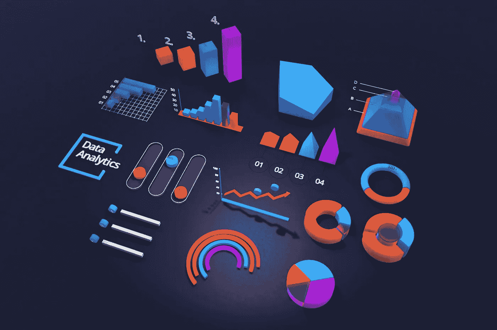
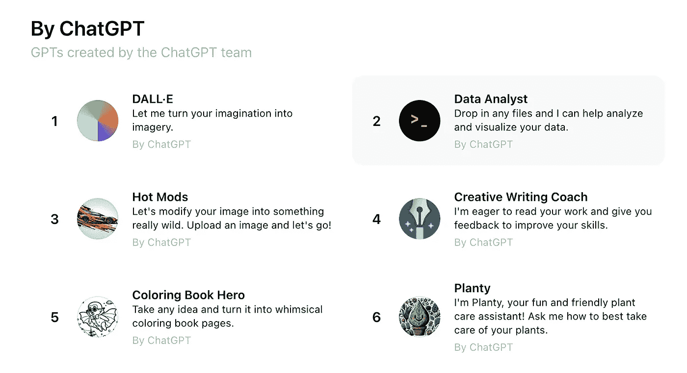

# 评估 ChatGPT 的数据分析改进：交互式表格和图表

> 原文：[`towardsdatascience.com/evaluating-chatgpts-data-analysis-improvements-interactive-tables-and-charts-622d3e5a3816?source=collection_archive---------0-----------------------#2024-07-19`](https://towardsdatascience.com/evaluating-chatgpts-data-analysis-improvements-interactive-tables-and-charts-622d3e5a3816?source=collection_archive---------0-----------------------#2024-07-19)

## ChatGPT 是否正在成为商业智能工具？

 [余东](https://ydong029.medium.com/?source=post_page---byline--622d3e5a3816--------------------------------)

·发布于[Towards Data Science](https://towardsdatascience.com/?source=post_page---byline--622d3e5a3816--------------------------------) ·9 分钟阅读·2024 年 7 月 19 日

--

2024 年 5 月，在激动人心的 GPT-4o 发布之际，OpenAI 宣布了其[在 ChatGPT 中对数据分析的改进](https://openai.com/index/improvements-to-data-analysis-in-chatgpt/)，该改进包括交互式表格和图表，以及与 Google Drive 和 Microsoft OneDrive 的集成。

在本文中，我将评估这些新功能，并展望 ChatGPT 在数据分析方面的未来。

照片由[钟邓翔](https://unsplash.com/@dengxiangs?utm_source=medium&utm_medium=referral)提供，来源于[Unsplash](https://unsplash.com/?utm_source=medium&utm_medium=referral)

## ChatGPT 数据分析简史

ChatGPT 在数据分析方面的旅程始于 2023 年 3 月推出的代码解释器，2023 年 7 月开始向 Plus 用户推出。

后来，OpenAI 将其重新命名为高级数据分析（Advanced Data Analysis），然后是数据分析（Data Analysis），如今作为官方 GPT 之一，更名为[数据分析师](https://chatgpt.com/g/g-HMNcP6w7d-data-analyst)。如今，你可以使用这个独立的“数据分析师”GPT，或者直接提示 ChatGPT 执行数据分析功能。

由 ChatGPT 团队创建的 GPT（截图由作者提供）

OpenAI 一直在不断改进这些功能。值得注意的是，它在 2024 年 5 月宣布了对 ChatGPT 数据分析的[改进](https://openai.com/index/improvements-to-data-analysis-in-chatgpt/)，增强了与表格的交互能力……
