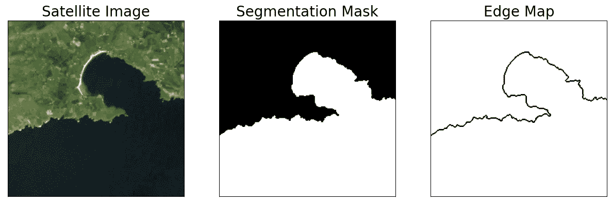

# 评估边缘检测？不要使用 RMSE、PSNR 或 SSIM

> 原文：[`towardsdatascience.com/evaluating-edge-detection-dont-use-rmse-psnr-or-ssim-841a0f2a12cb?source=collection_archive---------4-----------------------#2024-10-08`](https://towardsdatascience.com/evaluating-edge-detection-dont-use-rmse-psnr-or-ssim-841a0f2a12cb?source=collection_archive---------4-----------------------#2024-10-08)

## 为什么“绩效指标”（Figure of Merit，FOM）是最佳的边缘检测评估指标的经验和理论依据

 [Conor O'Sullivan](https://conorosullyds.medium.com/?source=post_page---byline--841a0f2a12cb--------------------------------)

·发表于 [Towards Data Science](https://towardsdatascience.com/?source=post_page---byline--841a0f2a12cb--------------------------------) ·阅读时长：12 分钟·2024 年 10 月 8 日

--

图像分割和边缘检测是密切相关的任务。以一个海岸线分割模型的输出为例：

图 1：从分割掩模到边缘图（来源：作者）（数据集：[LICS](https://zenodo.org/records/13742222)）（CC BY 4.0）

模型会将每个像素分类为陆地或海洋（分割掩模）。然后，海岸线就是分类变化的像素（边缘图）。通常，边缘检测可以通过图像分割模型输出的边界来实现。

我希望在我的研究中利用这种关系来帮助评估海岸线图像分割模型。类似的研究都使用基于混淆矩阵的指标，如准确率、精确率和召回率。这些指标将预测的分割掩模中的所有像素与地面真实掩模进行比较。

问题在于，这些方法可能高估了在最重要区域——海岸线——的性能。

大多数像素位于海洋的中央或完全被陆地包围。这些像素比靠近海岸线的像素更容易分类。你可以在图 2 中看到这一点。不幸的是，这些错误可能会被大量正确分类的像素所掩盖。
