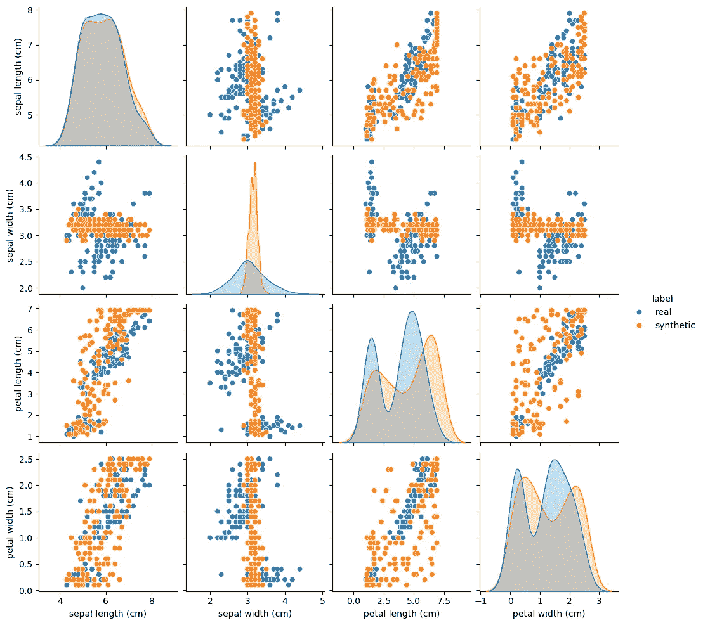
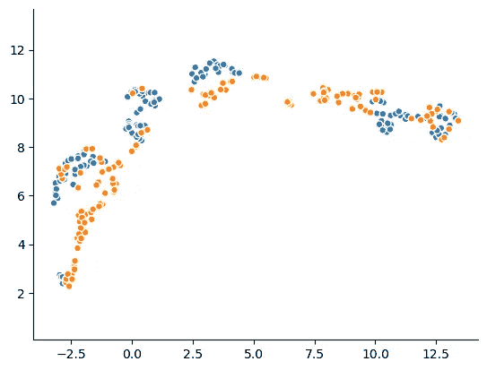

# 评估合成数据

> 原文：[`towardsdatascience.com/evaluating-synthetic-data-c5833f6b2f15?source=collection_archive---------7-----------------------#2024-10-14`](https://towardsdatascience.com/evaluating-synthetic-data-c5833f6b2f15?source=collection_archive---------7-----------------------#2024-10-14)

## 评估我们从真实数据中生成的数据的可行性和有用性

[](https://medium.com/@aymeric.floyrac.x?source=post_page---byline--c5833f6b2f15--------------------------------)[](https://towardsdatascience.com/?source=post_page---byline--c5833f6b2f15--------------------------------) [Aymeric Floyrac](https://medium.com/@aymeric.floyrac.x?source=post_page---byline--c5833f6b2f15--------------------------------)

· 发布于 [Towards Data Science](https://towardsdatascience.com/?source=post_page---byline--c5833f6b2f15--------------------------------) · 8 分钟阅读 · 2024 年 10 月 14 日

--

合成数据服务于多种用途，且因大语言模型（LLM）的令人信服的能力而逐渐受到关注。但什么是“良好”的合成数据，我们又如何知道自己是否成功生成了它？


图片由 [Nigel Hoare](https://unsplash.com/@dementedpixel?utm_source=medium&utm_medium=referral) 提供，来源于 [Unsplash](https://unsplash.com/?utm_source=medium&utm_medium=referral)

# 什么是合成数据？

合成数据是指那些经过生成的，目的是看起来像真实数据，至少在某些方面（至少是数据结构、统计分布等）是这样的。它通常是通过随机生成的，使用各种各样的模型：随机采样、噪声添加、生成对抗网络（GAN）、扩散模型、变分自编码器（VAE）、大语言模型（LLM）等。

它有许多用途，例如：

+   培训和教育（例如，发现一个新数据库或教授一门课程），

+   数据增强（即创建新的样本以训练模型），

+   在保护隐私的同时共享数据（从开放科学的角度来看尤其有用），

+   在保护隐私的同时进行研究。

它尤其在软件测试和像医疗技术这样的敏感领域中得到了广泛应用：能够访问表现得像真实数据一样的数据，同时又不危及患者隐私，这无疑是一个梦想成真。

# 合成数据质量原则

## 个体可行性

为了使一个样本有用，它必须以某种方式看起来像真实数据。最终的目标是生成的样本必须无法与真实样本区分：生成超逼真的面孔、句子、病历等。显然，源数据越复杂，生成“良好”合成数据的难度就越大。

## 有用性

在许多情况下，尤其是数据增强时，我们需要的不仅仅是一个真实样本，而是一个完整的数据集。而生成单个样本和生成完整数据集是不同的：这个问题有一个非常著名的名字——*模式崩塌*，尤其在训练生成对抗网络（GAN）时频繁出现。实质上，生成器（更广泛地说，生成合成数据的模型）可能会学习生成单一类型的样本，完全忽视其余的样本空间，导致生成的合成数据集不如原始数据集有用。

例如，如果我们训练一个模型来生成动物图片，而它找到了一种非常高效的方式来生成猫的图片，那么它可能就会停止生成其他类型的图片（特别是不会生成狗的图片）。此时，猫的图片将成为生成分布的“模式”。

如果我们的初衷是增加数据或创建用于训练的数据集，那么这种行为就是有害的。我们需要的是一个本身具有现实性的的数据集，绝对意义上来说，这意味着从该数据集派生的任何统计数据应该与真实数据的统计数据足够接近。从统计学角度看，这意味着单变量和多变量分布应该是相同的（或至少是“足够接近”）。

## 隐私

我们不会深入讨论这个话题，因为它本身就值得写一篇文章。简而言之：根据我们的初衷，可能需要共享数据（或多或少是公开的），这意味着如果是个人数据，就应该得到保护。例如，我们需要确保不能通过合成数据集检索到原始数据集中的任何个体信息。特别是，这意味着要小心异常值，或检查生成器是否生成了任何原始样本。

考虑隐私问题的一种方法是使用差分隐私框架。

# 实际评估


图片由[美国国会图书馆](https://unsplash.com/@libraryofcongress?utm_source=medium&utm_medium=referral)提供，来源于[Unsplash](https://unsplash.com/?utm_source=medium&utm_medium=referral)

我们从加载数据并生成一个合成数据集开始。我们将从著名的`iris`数据集开始。为了生成它的合成对应数据集，我们将使用[合成数据库](https://sdv.dev/)包。

```py
pip install sdv
```

```py
from sklearn.datasets import load_iris
from sdv.single_table import GaussianCopulaSynthesizer
from sdv.metadata.metadata import Metadata

data = load_iris(return_X_y=False, as_frame=True)
real_data = data["data"]

# metadata of the `iris` dataset
metadata = Metadata().load_from_dict({
    "tables": {
        "iris": {
            "columns": {
                "sepal length (cm)": {
                    "sdtype": "numerical",
                    "computer_representation": "Float"
                },
                "sepal width (cm)": {
                    "sdtype": "numerical",
                    "computer_representation": "Float"
                },
                "petal length (cm)": {
                    "sdtype": "numerical",
                    "computer_representation": "Float"
                },
                "petal width (cm)": {
                    "sdtype": "numerical",
                    "computer_representation": "Float"
                }
            },
            "primary_key": None
        }
    },
    "relationships": [],
    "METADATA_SPEC_VERSION": "V1"
})

# train the synthesizer
synthesizer = GaussianCopulaSynthesizer(metadata)
synthesizer.fit(data=real_data)
# generate samples - in this case, 
# synthetic_data has the same shape as real_data
synthetic_data = synthesizer.sample(num_rows=150)
```

## 示例级别

现在，我们想测试是否可以判断一个样本是否是合成的。

从这个公式出发，我们很容易看出它本质上是一个二元分类问题（合成 vs 原始）。因此，我们可以训练任何模型来区分原始数据和合成数据：如果这个模型达到一个好的准确率（这里的准确率意味着远高于 0.5），那么合成样本就不够真实。我们的目标是 0.5 的准确率（如果测试集包含一半的原始样本和一半的合成样本），这意味着分类器在做随机猜测。

和任何分类问题一样，我们不应该局限于使用弱模型，而应在超参数选择和模型训练上投入足够的精力。

现在来看代码：

```py
import pandas as pd 
import numpy as np
from sklearn.model_selection import train_test_split
from sklearn.metrics import accuracy_score
from sklearn.ensemble import RandomForestClassifier

def classification_evaluation(
  real_data: pd.DataFrame, 
  synthetic_data: pd.DataFrame
) -> float:

    X = pd.concat((real_data, synthetic_data))
    y = np.concatenate(
        (
            np.zeros(real_data.shape[0]),
            np.ones(synthetic_data.shape[0])
        )
    )

    Xtrain, Xtest, ytrain, ytest = train_test_split(
        X,
        y,
        test_size=0.2,
        stratify=y
    )

    clf = RandomForestClassifier()
    clf.fit(Xtrain, ytrain)
    score = accuracy_score(clf.predict(Xtest), ytest)

    return score

classification_evaluation(real_data, synthetic_data)
>>> 0.9
```

在这种情况下，合成器似乎无法欺骗我们的分类器：合成数据不够真实。

## 数据集层面

如果我们的样本足够真实，能够欺骗一个 reasonably 强大的分类器，那么我们需要从整体上评估我们的数据集。这次，不能简单地将其转化为分类问题，我们需要使用多个指标。

**统计分布**

最明显的测试是统计测试：原始数据集中的单变量分布是否与合成数据集中的相同？它们的相关性是否相同？

理想情况下，我们希望能够测试任何*N*-变量的分布，这对于变量数量较多时可能会特别昂贵。然而，即使是单变量分布，也能帮助我们看出数据集是否出现了模式崩溃。

现在来看代码：

```py
import pandas as pd
from scipy.stats import ks_2samp

def univariate_distributions_tests(
  real_data: pd.DataFrame, 
  synthetic_data: pd.DataFrame
) -> None:
    for col in real_data.columns:
        if real_data[col].dtype.kind in "biufc": 
            stat, p_value = ks_2samp(real_data[col], synthetic_data[col])
            print(f"Column: {col}")
            print(f"P-value: {p_value:.4f}")
            print("Significantly different" if p_value < 0.05 else "Not significantly different")
            print("---")
```

```py
univariate_distributions_tests(real_data, synthetic_data)

>>> Column: sepal length (cm)
P-value: 0.9511
Not significantly different
---
Column: sepal width (cm)
P-value: 0.0000
Significantly different
---
Column: petal length (cm)
P-value: 0.0000
Significantly different
---
Column: petal width (cm)
P-value: 0.1804
Not significantly different
---
```

在我们的案例中，四个变量中只有两个在真实数据集和合成数据集中具有相似的分布。这表明我们的合成器未能再现这个数据集的基本特性。

**视觉检查**

尽管没有数学证明，数据集的可视化比较是有用的。

第一个方法是绘制二元分布（或相关图）。

我们还可以一次性表示所有数据集维度：例如，给定一个表格数据集及其合成版本，我们可以使用降维技术（如 t-SNE、PCA 或 UMAP）绘制两个数据集的图。如果合成器完美无缺，散点图应该看起来相同。

现在来看代码：

```py
pip install umap-learn
```

```py
import pandas as pd
import seaborn as sns
import umap
import matplotlib.pyplot as plt

def plot(
  real_data: pd.DataFrame, 
  synthetic_data: pd.DataFrame, 
  kind: str = "pairplot"
):

    assert kind in ["umap", "pairplot"]
    real_data["label"] = "real"
    synthetic_data["label"] = "synthetic"
    X = pd.concat((real_data, synthetic_data))

    if kind == "pairplot":
        sns.pairplot(X, hue="label")

    elif kind == "umap": 
        reducer = umap.UMAP()
        embedding = reducer.fit_transform(X.drop("label", axis=1))
        plt.scatter(
            embedding[:, 0],
            embedding[:, 1],
            c=[sns.color_palette()[x] for x in X["label"].map({"real":0, "synthetic":1})],
            s=30,
            edgecolors="white"
        )
        plt.gca().set_aspect('equal', 'datalim')
        sns.despine(top=True, right=True, left=False, bottom=False)
```

```py
plot(real_data, synthetic_data, kind="pairplot")
```



我们已经在这些图中看到，真实数据和合成数据的二元分布并不相同，这又一次暗示了合成过程未能成功再现数据维度之间的高阶关系。

现在让我们来看看一次性表示四个维度的图：

```py
plot(real_data, synthetic_data, kind="umap")
```



在这张图中也可以清楚地看到，两个数据集是彼此不同的。

**信息**

合成数据集应该与原始数据集一样有用。特别是，它应该在预测任务中同样有效，这意味着它应该捕捉到特征之间的复杂关系。因此，我们进行一次比较：TSTR 与 TRTR，分别代表“在合成数据上训练，在真实数据上测试”与“在真实数据上训练，在真实数据上测试”。实际操作中这意味着什么？

对于给定的数据集，我们选择一个特定的任务，比如预测下一个标记或下一个事件，或根据其他列预测某一列。在这个任务下，我们先在合成数据集上训练第一个模型，再在原始数据集上训练第二个模型。然后，我们在一个共同的测试集上评估这两个模型，该测试集是从原始数据集中提取的。如果第一个模型的表现接近第二个模型的表现，*无论表现如何*，我们就认为我们的合成数据集是有用的。这意味着我们能够在合成数据集上学习到与原始数据集相同的模式，而这正是我们所希望的（尤其是在数据增强的情况下）。

现在是代码部分：

```py
import pandas as pd 
from typing import Tuple
from sklearn.model_selection import train_test_split
from sklearn.ensemble import RandomForestRegressor

def tstr(
  real_data: pd.DataFrame, 
  synthetic_data: pd.DataFrame, 
  target: str = None
) -> Tuple[float]:

    # if no target is specified, use the last column of the dataset
    if target is None: 
        target = real_data.columns[-1]

    X_real_train, X_real_test, y_real_train, y_real_test = train_test_split(
        real_data.drop(target, axis=1), 
        real_data[target],
        test_size=0.2
    )

    X_synthetic, y_synthetic = synthetic_data.drop(target, axis=1), synthetic_data[target]
    # create regressors (could have been classifiers)
    reg_real = RandomForestRegressor()
    reg_synthetic = RandomForestRegressor()
    # train the models
    reg_real.fit(X_real_train, y_real_train)
    reg_synthetic.fit(X_synthetic, y_synthetic)
    # evaluate 
    trtr_score = reg_real.score(X_real_test, y_real_test)
    tstr_score = reg_synthetic.score(X_real_test, y_real_test)

    return trtr_score, tstr_score
```

```py
tstr(real_data, synthetic_data)
>>> (0.918261846477529, 0.5644428690930647)
```

很明显，"真实"回归器学到了某种关系，而"合成"回归器未能学到这一关系。这暗示着该关系没有在合成数据集中被忠实地重现。

# 结论

合成数据质量评估并不依赖于单一指标，应该结合多个度量标准来全面了解情况。本文展示了一些可以轻松构建的指标。希望这篇文章为你提供了一些有用的提示，帮助你在具体的应用场景中做到最好！

随时欢迎分享和评论✨
