# 评估合成数据 — 百万美元的问题

> 原文：[`towardsdatascience.com/evaluating-synthetic-data-the-million-dollar-question-a54701d1b621?source=collection_archive---------0-----------------------#2024-02-14`](https://towardsdatascience.com/evaluating-synthetic-data-the-million-dollar-question-a54701d1b621?source=collection_archive---------0-----------------------#2024-02-14)

## **我的真实数据集和合成数据集是否是来自同一父分布的随机样本？**

 [Andrew Skabar, PhD](https://medium.com/@a.skabar_60534?source=post_page---byline--a54701d1b621--------------------------------)

·发表于[Towards Data Science](https://towardsdatascience.com/?source=post_page---byline--a54701d1b621--------------------------------) ·阅读时长 11 分钟·2024 年 2 月 14 日

--

图片由[Edge2Edge Media](https://unsplash.com/@edge2edgemedia?utm_source=medium&utm_medium=referral)提供，来源于[Unsplash](https://unsplash.com/?utm_source=medium&utm_medium=referral)

当我们进行合成数据生成时，我们通常会为我们的真实（或‘观察’）数据创建一个模型，然后使用这个模型来生成合成数据。这些观察数据通常是从现实世界经验中收集的，比如虹膜的物理特征的测量，或是有关违约的个人或患有某种疾病的个体的详细信息。我们可以将观察数据视为来自某个‘父分布’——即观察数据的随机样本所对应的真实潜在分布。当然，我们永远无法知道这个父分布——它必须通过估计来获得，这正是我们模型的目的。

但如果我们的模型能够生成可以被认为是来自同一父分布的随机样本的合成数据，那么我们就赚到了：合成数据将具备与观察数据相同的统计属性和模式（*保真性*）；它在进行回归或分类等任务时将同样有用（*实用性*）；而且，由于它是随机样本，因此不会暴露观察数据（*隐私性*）。但是我们如何知道是否达成了这个难以捉摸的目标呢？

在故事的第一部分，我们将进行一些简单的实验，以更好地理解这个问题并激发解决方案。在第二部分，我们将评估各种合成数据生成器在一组著名数据集上的表现。

# 第一部分 — 一些简单的实验

考虑以下两个数据集，并尝试回答这个问题：

> 这两个数据集是来自同一父分布的随机样本，还是其中一个是通过对另一个应用小的随机扰动得来的？

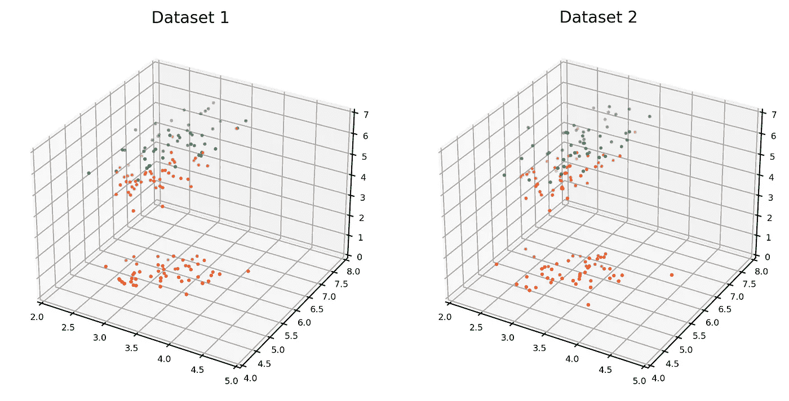

两个数据集。两个数据集是否都是来自同一父分布的随机样本，还是其中一个是通过小的随机扰动从另一个派生出来的？[图片来自作者]

这些数据集显然展示了类似的统计特性，如边际分布和协方差。在一个分类任务中，它们也会表现得相似，其中一个数据集上训练的分类器会在另一个数据集上进行测试。因此，单凭忠实度和效用是无法得出结论的。

假设我们将每个数据集的数据点绘制在同一张图表上。如果这些数据集是来自同一父分布的随机样本，我们直观上会期望一个数据集中的点与另一个数据集中的点交替分布，且平均来看，一个数据集中的点与其在该集中的最近邻的距离，应该与它们与另一个数据集中的最近邻的距离相当。然而，如果其中一个数据集是对另一个数据集的轻微随机扰动，那么一个数据集中的点将更倾向于与另一个数据集中的最近邻相似，而不是与同一数据集中的最近邻相似。这就引出了以下的测试。

**最大相似性测试**

> 对于每个数据集，计算每个实例与其在**同一**数据集中的最近邻的相似性。将这些称为“最大组内相似性”。如果数据集具有相同的分布特征，则每个数据集的组内相似性分布应该相似。现在，计算一个数据集中的每个实例与其在**另一个**数据集中的最近邻的相似性，并称这些为*‘最大跨集相似性’*。如果最大跨集相似性的分布与最大组内相似性的分布相同，则可以认为这些数据集是来自同一父分布的随机样本。为了保证测试的有效性，每个数据集应包含相同数量的样本。

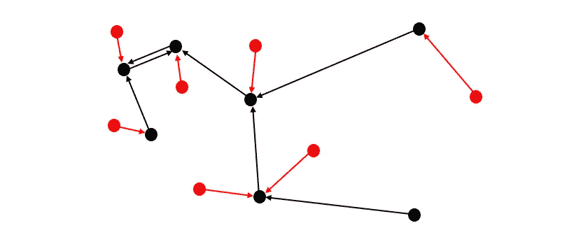

两个数据集：一个红色，一个黑色。黑色箭头表示每个黑色点（尾部）最接近（或“最相似”）的黑色邻居（头部）——这些配对之间的相似性是黑色数据集的“最大组内相似性”。红色箭头表示每个红色点（尾部）最接近的黑色邻居（头部）——这些配对之间的相似性是“最大跨集相似性”。[图片来自作者]

由于我们在这个故事中处理的数据集都包含了数值型和类别型变量的混合，因此我们需要一个能够适应这种情况的相似性度量。我们使用 Gower 相似性¹。

以下表格和直方图展示了数据集 1 和数据集 2 的最大同集和跨集相似度的均值和分布。

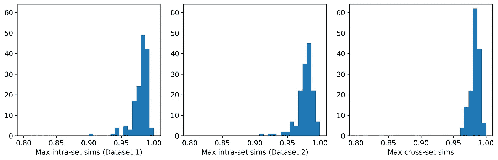

数据集 1 和数据集 2 的最大同集和跨集相似度分布。[图片由作者提供]

平均而言，一个数据集中的实例与另一个数据集中最相邻的邻居相比，比与同一数据集中最相邻的邻居更为相似。这表明这些数据集更可能是彼此的扰动，而非来自同一母体分布的随机样本。**事实上，它们确实是扰动！**数据集 1 是通过高斯混合模型生成的；数据集 2 是通过从数据集 1 中选择（不重复选择）一个实例并应用小的随机扰动生成的。

最终，我们将使用最大相似性测试来比较合成数据集和观测数据集。合成数据点与观测点过于接近的最大风险是隐私问题；即能够从合成数据集中识别出观测数据集中的点。事实上，如果仔细检查数据集 1 和数据集 2，你可能实际上能够识别出一些这样的对。并且这是在平均最大跨集相似度仅比平均最大同集相似度大 0.3% 的情况下！

## 建模与合成

为了结束这个故事的第一部分，让我们为一个数据集创建一个模型，并用该模型生成合成数据。然后，我们可以使用最大相似性测试来比较合成集和观测集。

下图左侧的数据集就是上面的数据集 1。右侧的数据集（数据集 3）是合成数据集。（我们估算了其分布为高斯混合模型，但这不重要）。

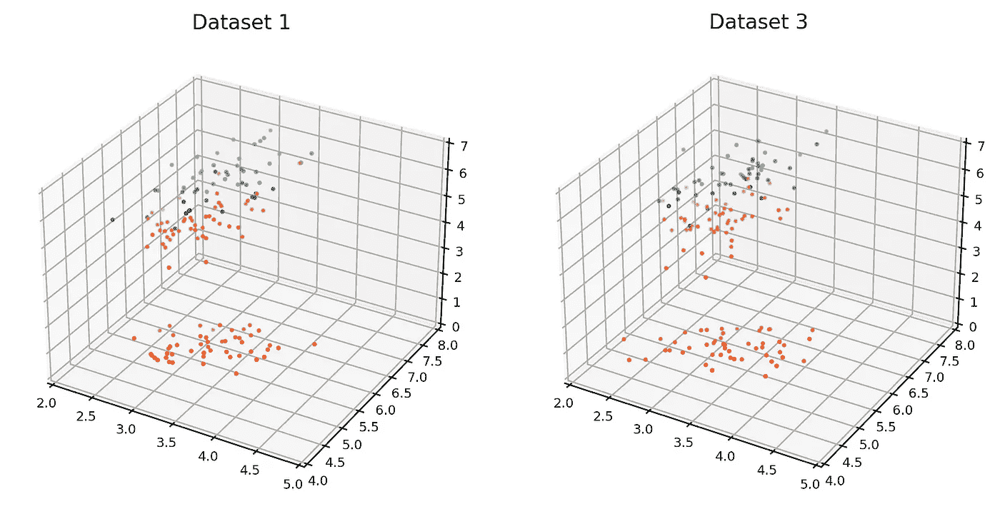

观测数据集（左）和合成数据集（右）。[图片由作者提供]

这里是平均相似度和直方图：

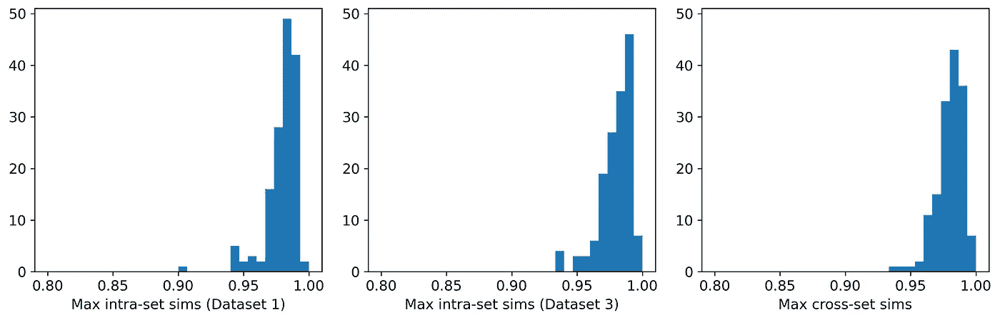

数据集 1 和数据集 3 的最大同集和跨集相似度分布。[图片由作者提供]

这三项平均值在三位有效数字上完全相同，且这三个直方图非常相似。因此，根据最大相似性测试，两个数据集都可以合理地视为来自同一母体分布的随机样本。我们的合成数据生成实验已取得成功，我们实现了三重奏——真实性、实用性和隐私性。

[*第一部分中用于生成数据集、绘图和直方图的 Python 代码可以从* [*https://github.com/a-skabar/TDS-EvalSynthData*](https://github.com/a-skabar/TDS-EvalSynthData) 获取]

# 第二部分—**真实数据集，真实生成器**

第一部分使用的数据集较为简单，可以通过高斯混合模型轻松建模。然而，大多数现实世界的数据集要复杂得多。在这一部分中，我们将对一些流行的现实世界数据集应用几个合成数据生成器。我们的主要目标是比较观察到的和合成的数据集内外的最大相似性分布，以理解它们在多大程度上可以被视为来自同一母体分布的随机样本。

这六个数据集来源于 UCI 库²，都是在机器学习文献中广泛使用了几十年的流行数据集。它们都是混合类型数据集，选择这些数据集是因为它们在类别特征和数值特征的平衡上有所不同。

这六个生成器代表了合成数据生成的主要方法：基于 copula 的、基于 GAN 的、基于 VAE 的以及使用序列插补的方法。CopulaGAN³、GaussianCopula、CTGAN³和 TVAE³都可以从*Synthetic Data Vault*库⁴中获得，synthpop⁵可以作为开源 R 包使用，‘UNCRi’指的是在专有*统一数值/类别表示与推理*（UNCRi）框架⁶下开发的合成数据生成工具。所有生成器均使用其默认设置。

下表展示了每个生成器应用于每个数据集的平均最大内部相似性和跨集相似性。红色高亮的条目表示隐私已被泄露（即，观察数据的平均最大跨集相似性超过了平均最大内部相似性）。绿色高亮的条目表示具有最高平均最大跨集相似性的条目（不包括红色条目）。最后一列显示了执行*在合成数据上训练，在真实数据上测试*（TSTR）测试的结果，即在合成样本上训练分类器或回归器，并在真实（观察到的）样本上测试。波士顿房价数据集是一个回归任务，报告的是平均绝对误差（MAE）；所有其他任务为分类任务，报告的值是 ROC 曲线下面积（AUC）。

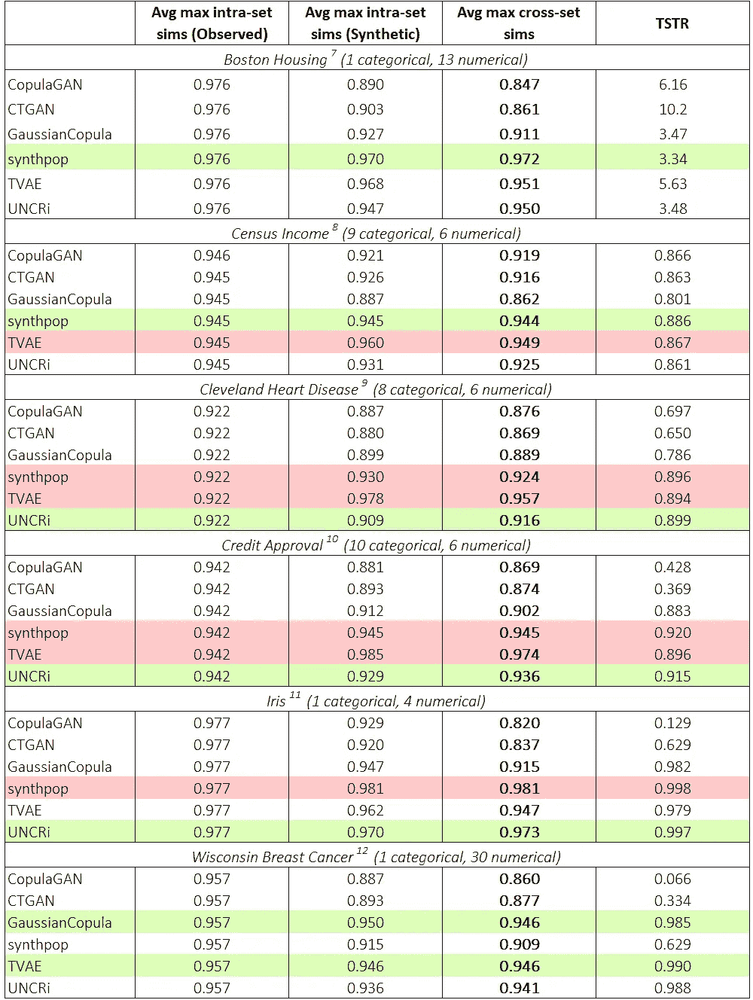

六个生成器在六个数据集上的平均最大相似性和 TSTR 结果。TSTR 的值对于波士顿房价数据集是 MAE，对于所有其他数据集是 AUC。[图像由作者提供]

下图展示了每个数据集的最大内部相似性和跨集相似性的分布，这些相似性对应于获得最高平均最大跨集相似性的生成器（不包括上述红色高亮部分）。

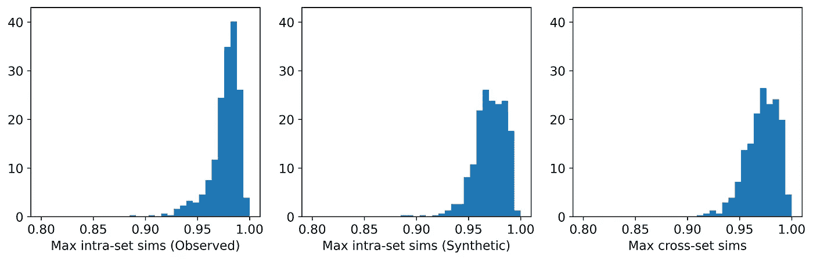

**Boston Housing**数据集上 synthpop 的最大相似度分布。[图片来自作者]

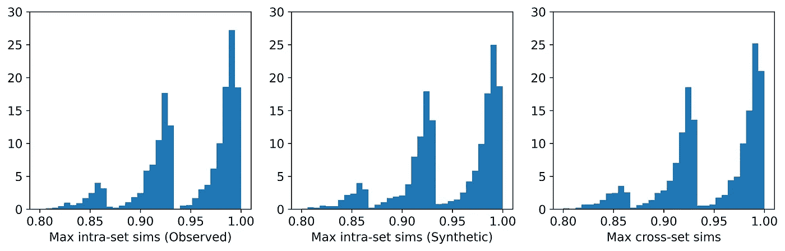

**Census Income**数据集的最大相似度分布。[图片来自作者]

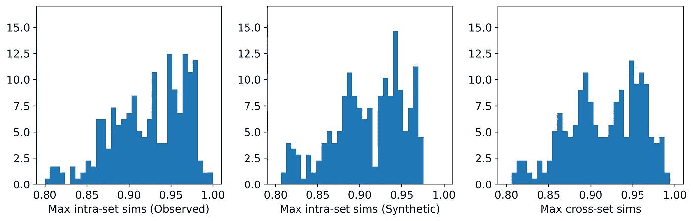

**Cleveland Heart Disease**数据集上 UNCRi 的最大相似度分布。[图片来自作者]

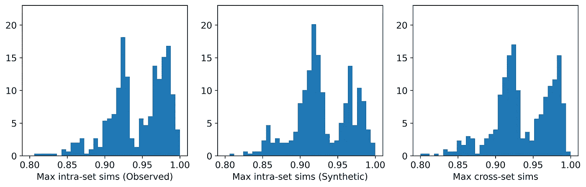

**Credit Approval**数据集上 UNCRi 的最大相似度分布。[图片来自作者]

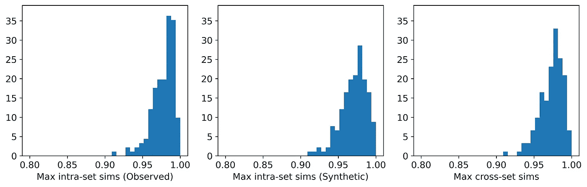

**Iris**数据集上 UNCRi 的最大相似度分布。[图片来自作者]

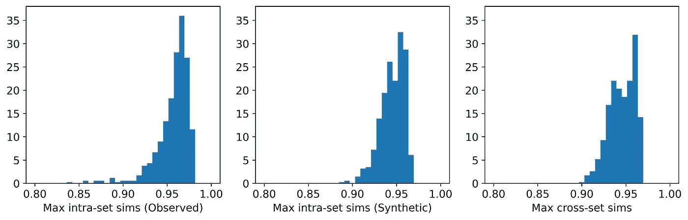

TVAE 在**Wisconsin Breast Cancer**数据集上的平均相似度分布。[图片来自作者]

从表格中可以看出，对于那些没有侵犯隐私的生成器，平均最大跨集相似度与观察数据的平均最大同集相似度非常接近。直方图展示了这些最大相似度的分布，我们可以看到在大多数情况下，这些分布非常相似——尤其是对于像 Census Income 数据集这样的数据集。这张表还显示，针对每个数据集（不包括那些用红色标出的生成器），实现了最高平均最大跨集相似度的生成器，在 TSTR 测试中也表现最佳（同样排除红色标记的生成器）。因此，虽然我们永远无法宣称发现了“真实”的底层分布，这些结果表明，对于每个数据集，最有效的生成器已经捕捉到了底层分布的关键特征。

**隐私**

七个生成器中只有两个出现了隐私问题：synthpop 和 TVAE。它们在六个数据集中的三个上都侵犯了隐私。在两个实例中，特别是 TVAE 在 Cleveland Heart Disease 数据集和 Credit Approval 数据集上的表现，隐私侵犯特别严重。下面显示的是 TVAE 在 Credit Approval 数据集上的直方图，表明合成样本彼此之间过于相似，并且与观察数据中的最近邻也非常相似。该模型是对底层父分布的非常糟糕的表示。原因可能是 Credit Approval 数据集包含了几个极度偏斜的数值特征。

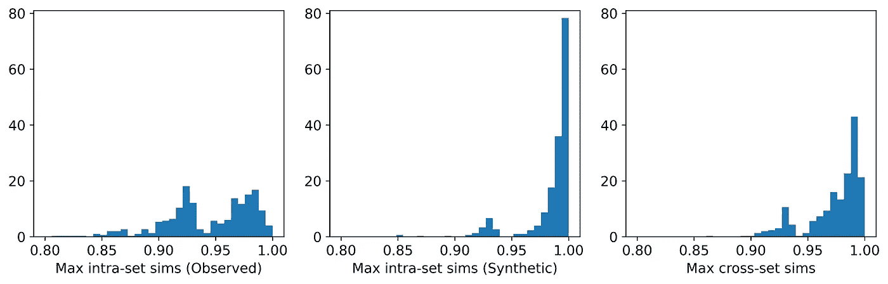

TVAE 在 Credit Approval 数据集上的平均最大相似度分布。[图片来自作者]

**其他观察和评论**

基于 GAN 的两个生成器——CopulaGAN 和 CTGAN——始终表现最差。这一点有些令人惊讶，因为 GAN 非常流行。

除了威斯康星乳腺癌数据集（该数据集表现为与其他数据集相同的最高平均最大交叉集相似度）之外，GaussianCopula 在所有数据集上的表现都较为平庸。它在 Iris 数据集上的不尽如人意的表现尤其令人惊讶，因为这是一个非常简单的数据集，使用高斯混合模型就能轻松建模，我们原本预期该数据集与基于 Copula 的方法会很好匹配。

在所有数据集上表现最为稳定的生成器是 synthpop 和 UNCRi，它们都通过序列插补来操作。这意味着它们只需要估计并从单变量条件分布中采样（例如，*P*(*x*₇|*x*₁, *x*₂, …)），而这通常比从多变量分布中建模和采样要容易得多（例如，*P*(*x*₁, *x*₂, *x*₃, …)），而这（隐式地）是 GAN 和 VAE 的工作方式。而 synthpop 使用决策树来估计分布（这是 synthpop 易过拟合的根源），UNCRi 生成器则使用基于最近邻的方法来估计分布，且通过交叉验证程序优化超参数，从而避免了过拟合。

# 结论

合成数据生成是一个新兴的领域，尽管目前还没有标准的评估技术，但业界普遍认为测试应涵盖保真性、效用性和隐私性。然而，尽管这三者都很重要，但它们的地位并不相同。例如，一个合成数据集可能在保真性和效用性上表现良好，但在隐私性上失败。这并不意味着它是“得分三分之二”：如果合成样本与观测样本过于接近（从而未通过隐私性测试），模型就已经过拟合，导致保真性和效用性测试失去意义。部分合成数据生成软件的供应商倾向于提出将多项测试结果结合的单一得分性能指标，这实际上是基于相同的“得分三分之二”逻辑。

如果一个合成数据集可以被视为来自与观测数据相同父分布的随机样本，那么我们就无法做到更好——我们已经实现了最大程度的保真性、效用性和隐私性。最大相似性测试提供了一种衡量两个数据集是否可以视为来自同一父分布的随机样本的程度。它基于一个简单且直观的概念，即如果一个观测数据集和一个合成数据集是来自同一父分布的随机样本，那么这些实例应该按这样的方式分布：即合成实例与其最接近的观测实例的相似度，应该与观测实例与其最接近的观测实例的相似度相当。

我们提出以下的合成数据集质量的单一得分衡量标准：

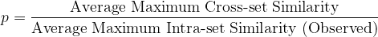

这个比例越接近 1——但不能超过 1——合成数据的质量越好。当然，这应该伴随直方图的合理性检查。

# 参考文献

[1] Gower, J. C. (1971)。一种通用的相似性系数及其一些性质。生物统计学, 27(4), 857–871。

[2] Dua, D. 和 Graff, C., (2017)。*UCI 机器学习库*，可访问：[`archive.ics.uci.edu/ml.`](http://archive.ics.uci.edu/ml.)

[3] Xu, L., Skoularidou, M., Cuesta-Infante, A. 和 Veeramachaneni, K. (2019)。使用条件生成对抗网络（GAN）建模表格数据。NeurIPS, 2019。

[4] Patki, N., Wedge, R., 和 Veeramachaneni, K. (2016)。合成数据库。发表于*2016 IEEE 国际数据科学与高级分析会议（DSAA）*（第 399–410 页）。IEEE。

[5] Nowok, B., Raab, G.M., Dibben, C. (2016)。 “synthpop: 在 R 中定制创建合成数据。” *统计软件杂志*, **74**(11), 1–26\. [doi:10.18637/jss.v074.i11](https://doi.org/10.18637/jss.v074.i11).

[6] [`skanalytix.com/uncri-framework`](https://skanalytix.com/uncri-framework/)

[7] Harrison, D., 和 Rubinfeld, D.L. (1978)。波士顿住房数据集。Kaggle。[`www.kaggle.com/c/boston-housing`](https://www.kaggle.com/c/boston-housing)。根据 CC: 公共领域许可证授权用于商业用途。

[8] Kohavi, R. (1996)。人口普查收入数据集。UCI 机器学习库。[`doi.org/10.24432/C5GP7S.`](https://doi.org/10.24432/C5GP7S.) 根据[创作共用署名 4.0 国际](https://creativecommons.org/licenses/by/4.0/legalcode)（CC BY 4.0）许可证授权用于商业用途。

[9] Janosi, A., Steinbrunn, W., Pfisterer, M. 和 Detrano, R. (1988)。心脏病数据集。UCI 机器学习库。[`doi.org/10.24432/C52P4X.`](https://doi.org/10.24432/C52P4X.) 根据[创作共用署名 4.0 国际](https://creativecommons.org/licenses/by/4.0/legalcode)（CC BY 4.0）许可证授权用于商业用途。

[10] Quinlan, J.R. (1987)。信用审批。UCI 机器学习库。[`doi.org/10.24432/C5FS30.`](https://doi.org/10.24432/C5FS30.) 根据[创作共用署名 4.0 国际](https://creativecommons.org/licenses/by/4.0/legalcode)（CC BY 4.0）许可证授权用于商业用途。

[11] Fisher, R.A. (1988)。鸢尾花数据集。UCI 机器学习库。[`doi.org/10.24432/C56C76.`](https://doi.org/10.24432/C56C76.) 根据[创作共用署名 4.0 国际](https://creativecommons.org/licenses/by/4.0/legalcode)（CC BY 4.0）许可证授权用于商业用途。

[12] Wolberg, W., Mangasarian, O., Street, N. 和 Street, W. (1995)。乳腺癌威斯康星州数据集（诊断）。UCI 机器学习库。[`doi.org/10.24432/C5DW2B.`](https://doi.org/10.24432/C5DW2B.) 根据[创作共用署名 4.0 国际](https://creativecommons.org/licenses/by/4.0/legalcode)（CC BY 4.0）许可证授权用于商业用途。
