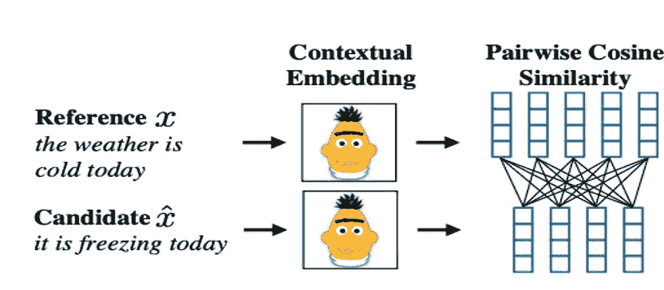

# 评估大型语言模型的文本生成

> 原文：[`towardsdatascience.com/evaluating-text-generation-in-large-language-models-d4a4baee49a8?source=collection_archive---------8-----------------------#2024-01-20`](https://towardsdatascience.com/evaluating-text-generation-in-large-language-models-d4a4baee49a8?source=collection_archive---------8-----------------------#2024-01-20)

## 用于衡量神经文本与人类文本之间差距的度量标准

 [Mina Ghashami](https://medium.com/@mina.ghashami?source=post_page---byline--d4a4baee49a8--------------------------------)

·发表于 [Towards Data Science](https://towardsdatascience.com/?source=post_page---byline--d4a4baee49a8--------------------------------) ·6 分钟阅读·2024 年 1 月 20 日

--

图片来源：[unsplash.com](https://unsplash.com/photos/white-printer-paper-on-white-table-gETBUi_oRgQ)

最近，大型语言模型在生成类人文本方面展示了惊人的能力。现在有许多度量标准可以衡量由大型语言模型生成的文本与参考人类文本的接近度/相似度。实际上，缩小这种差距是一个活跃的研究领域。

在这篇文章中，我们将探讨两种广为人知的自动评估机器生成文本的度量标准。

# BERTScore

假设你有一段由人类生成的参考文本和一段由大型语言模型（LLM）生成的机器文本。为了计算这两段文本之间的语义相似度，**BERTScore 计算了标记嵌入的成对余弦相似度**。请看下面的图像：

图片来源 [[1](https://arxiv.org/abs/1904.09675)]

这里参考文本是 *“今天天气很冷”*，而机器生成的候选文本是 *“今天很冷”*。如果我们计算 n-gram 相似度，这两段文本的分数会很低。然而，我们知道它们在语义上是非常相似的。所以 **BERTScore 计算了每个标记在这两段文本中的上下文嵌入**…  
