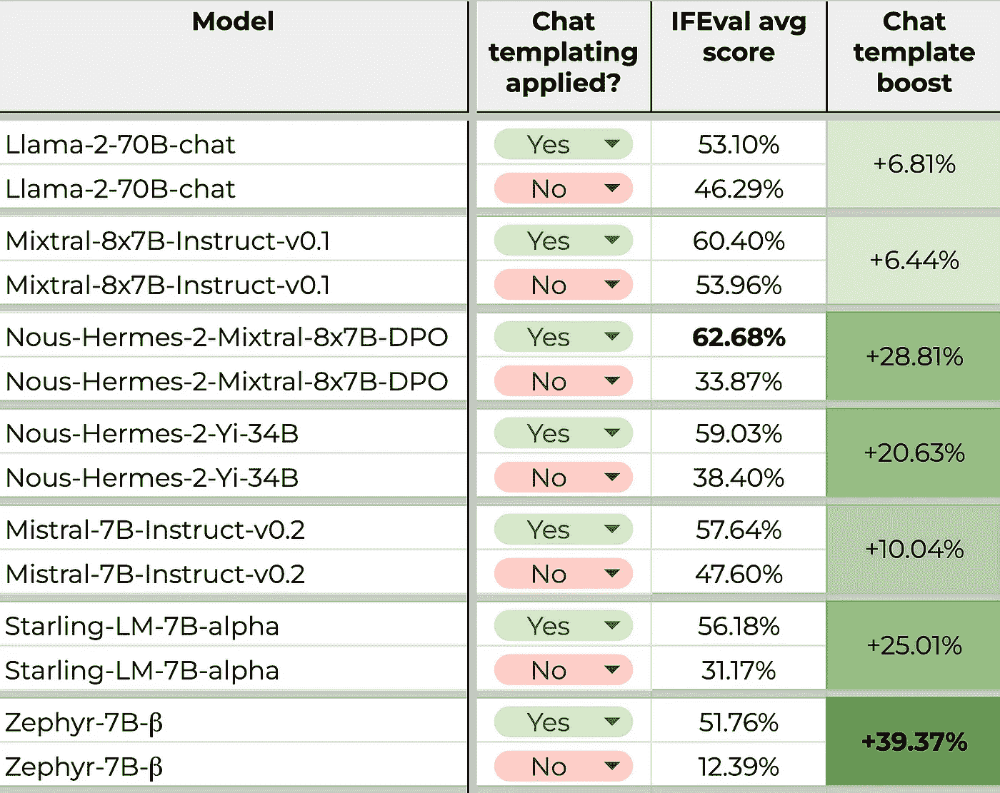

# 使用聊天格式的评估

> 原文：[`towardsdatascience.com/evaluations-with-chat-formats-7604067023c9?source=collection_archive---------6-----------------------#2024-02-21`](https://towardsdatascience.com/evaluations-with-chat-formats-7604067023c9?source=collection_archive---------6-----------------------#2024-02-21)

## 将聊天模板应用于生成式语言模型的评估测试

[](https://medium.com/@daniel_furman?source=post_page---byline--7604067023c9--------------------------------)[](https://towardsdatascience.com/?source=post_page---byline--7604067023c9--------------------------------) [Daniel Furman](https://medium.com/@daniel_furman?source=post_page---byline--7604067023c9--------------------------------)

·发布于 [Towards Data Science](https://towardsdatascience.com/?source=post_page---byline--7604067023c9--------------------------------) ·7 分钟阅读·2024 年 2 月 21 日

--


图片由 [Google DeepMind](https://unsplash.com/@googledeepmind) 提供，来源于 [Unsplash](https://unsplash.com/photos/a-close-up-of-a-metal-structure-made-of-wood-and-metal-pyET8SQTc0A)

> “**构建扎实的评估应该是任何基于 LLM 的系统或产品的起点**（以及传统的机器学习系统）。” — Eugene Yan, [链接](https://eugeneyan.com/writing/llm-patterns/#how-to-apply-evals)

# **简要总结**

聊天模型通常在使用提示模板格式的数据集上进行微调。这些聊天模板是编程好的“食谱”，能够将一次聊天对话转化为一个字符串。在预测时，通常需要匹配大语言模型（LLM）期望的聊天格式——如果不这么做，通常会被指出会导致性能下降 [1]。但是，实际上我们是否在评估基准上看到了这些性能下降？

**注意**：本博客适合具有 Python 编程和神经语言建模基础知识的读者。

# 介绍

如果你已经在 OpenAI 的聊天 API 上构建过应用，下面的代码将是你熟悉的。底层，这些输入会通过 [ChatML](https://github.com/MicrosoftDocs/azure-docs/blob/main/articles/ai-services/openai/includes/chat-markup-language.md#working-with-chat-markup-language-chatml) 格式转换成一个可分词的字符串：

```py
from openai import OpenAI
client = OpenAI()

response = client.chat.completions.create(
  model="gpt-3.5-turbo",
  messages=[
    {"role": "system", "content": "You are a helpful assistant."},
    {"role": "user", "content": "Who won the world series in 2020?"},
    {"role": "assistant", "content": "The Los Angeles Dodgers won the World Series in 2020."},
    {"role": "user", "content": "Where was it played?"}
  ]
)
```

```py
"<|im_start|>system
You are a helpful assistant.
<|im_start|>user
Who won the world series in 2020?<|im_end|>
<|im_start|>assistant
The Los Angeles Dodgers won the World Series in 2020.<|im_end|>
<|im_start|>user
Where was it played?<|im_end|>
<|im_start|>assistant"
```

事实证明，LLM 研究社区中有各种各样的聊天模板。以开源模型 `Mixtral-8x7B-Instruct-v0.1`*.* 为例，它的格式与上面提到的 `gpt-3.5-turbo` 看起来截然不同：

```py
from transformers import AutoTokenizer
tokenizer = AutoTokenizer.from_pretrained("mistralai/Mixtral-8x7B-Instruct-v0.1")
chat = [
  {"role": "user", "content": "Hello, how are you?"},
  {"role": "assistant", "content": "I'm doing great. How can I help you today?"},
  {"role": "user", "content": "Write me a haiku about coding."},
]
tokenizer.apply_chat_template(chat, tokenize=False)
```

```py
"<s>[INST] Hello, how are you? [/INST]I'm doing great. How can I help you today?</s> [INST] Write me a haiku about coding. [/INST]"
```

为什么要使用聊天模板呢？其实，强烈建议在预测时匹配期望的聊天模板（例如，参见[仓库](https://huggingface.co/mistralai/Mixtral-8x7B-Instruct-v0.1)中的“指令格式”信息，针对`Mixtral-8x7B-Instruct-v0.1`）。而且，对于像`gpt-3.5-turbo`这样的专有聊天模型，聊天模板通常在端点背后自动应用，无论你是否喜欢！

但是我们怎么知道聊天格式是否真的在提高我们的性能呢？这就是语言模型评估的作用。

# 语言模型评估

评估用于衡量 AI/ML 模型的性能，它们可以有许多不同的形式和大小。评估包括两个核心组件：针对特定任务策划的数据集和与之相关的衡量模型性能的指标。

生成性语言模型评估包含一些额外的细节。例如，不同的框架以不同方式衡量文本生成性能——即使是相同的评估也会有所不同（[参考](https://huggingface.co/blog/evaluating-mmlu-leaderboard)）。因此，在跨研究比较分数时，非常重要的一点是要确认结果是使用相同的代码和配置计算的，以避免错误分析。

超级的指令遵循评估（[IFEval](https://arxiv.org/abs/2311.07911)）[2]在这里用于我们的测试。该评估包括 541 个提示，用来衡量语言模型遵循可验证自然语言指令的能力。这些可验证指令的示例包括：

> “写 450 到 500 字”，“你的所有输出应该是 JSON 格式”，“包括一个标题，并将其放入两个方括号中，例如[[ title ]]”

对于给定的响应和可验证指令，我们使用以下四个指标来检查该指令是否已被遵循：

> 1\. **提示级严格准确度**：每个提示中所有可验证指令都被遵循的百分比。
> 
> 2\. **指令级严格准确度**：可验证的指令中被遵循的百分比。
> 
> 3\. **提示级宽松准确度**：使用宽松标准计算的提示级准确度。
> 
> 4\. **指令级宽松准确度**：使用宽松标准计算的指令级准确度。

这四个指标的平均值在此计算（表格 1），主要目的是使用一个捕捉最广泛信号的单一指标。

IFEval 是探索聊天模板影响的理想测试，因为该测试专门设计用来衡量在聊天数据上的指令遵循能力。另一个有趣的问题是，聊天模板是否对那些不太适合聊天数据的评估产生积极影响——这是一个留待未来研究的话题。

# IFEval 的聊天模板

Eleuther.AI 的[lm-eval](https://github.com/EleutherAI/lm-evaluation-harness)是事实上的开源语言模型评估工具包。由于更多模型的聊天模板功能是用户常请求的新增功能，因此我们很容易与其他开发者协作，专注于在🤗模型类中实现这一功能。目前，开发工作正在`add-chat-templating`分支中进行（[链接](https://github.com/EleutherAI/lm-evaluation-harness/tree/add-chat-templating)），由问题#1098（[链接](https://github.com/EleutherAI/lm-evaluation-harness/issues/1098#issuecomment-1947116099)）和#1209（[链接](https://github.com/EleutherAI/lm-evaluation-harness/issues/1209#issuecomment-1879966071)）推动。当使用此分支时，我们可以按如下方式将聊天格式应用于评估：

```py
!lm_eval --model hf \
    --model_args=pretrained=meta-llama/Llama-2-70b-chat-hf,dtype="bfloat16",parallelize=True,device_map="auto",use_chat_template=True,system_prompt="You are a helpful assistant." \
    --tasks ifeval \
    --batch_size 16 \
    --output_path output/Llama-2-70b-chat-hf \
    --log_samples \
    --num_fewshot 0
```

新引入的触发器`use_chat_template`和`system_prompt`出现在`model_args`的右侧，用于控制聊天模板的应用方式。在当前分支的实验性版本中，代码在应用聊天模板前后打印第一个提示。这是上述代码块的效果：

```py
# First element before prompt formatting...
('Write a 300+ word summary of the wikipedia page "https://en.wikipedia.org/wiki/Raymond_III,_Count_of_Tripoli". Do not use any commas and highlight at least 3 sections that has titles in markdown format, for example *highlighted section part 1*, *highlighted section part 2*, *highlighted section part 3*.', {'until': [], 'do_sample': False, 'temperature': 0.0, 'max_gen_toks': 1280})

# First element after prompt formatting...
('<s>[INST] <<SYS>>\nYou are a helpful assistant.\n<</SYS>>\n\nWrite a 300+ word summary of the wikipedia page "https://en.wikipedia.org/wiki/Raymond_III,_Count_of_Tripoli". Do not use any commas and highlight at least 3 sections that has titles in markdown format, for example *highlighted section part 1*, *highlighted section part 2*, *highlighted section part 3*. [/INST]', {'until': [], 'do_sample': False, 'temperature': 0.0, 'max_gen_toks': 1280})
```

输出已采用所需的聊天模板！

我们现在准备进行 A/B 测试，评估聊天模板对 IFEval 的影响。我们为实验选择了一些流行的 LLM，每个模型都有自己独特的聊天模板。在较大的模型方面，我们选择了 70B 参数的`Llama-2–70b-chat`，两种 47B 参数模型的变体，`Mixtral-8x7B-Instruct-v0.1`和`Nous-Hermes-2-Mixtral-8x7B-DPO`，以及 34B 参数的`Nous-Hermes-2-Yi-34B`。在较小的模型方面，我们有三个 7B 参数的模型：`Mistral-Instruct-7B-v0.2`、`Zephyr-7b-beta`和`Starling-LM-7B-alpha`。至于系统提示，兼容模型使用了简单的提示“你是一个有帮助的助手。”更多关于这七个模型的详细信息请参见下文[3]。

现在，毫不拖延，我们的结果：



**表 1**：来自 IFEval 的 A/B 测试结果，按模型大小降序排列（[链接](https://docs.google.com/spreadsheets/d/1Tawz9IHH2B-_XWj-JjeVGmu-og60lgSSpMywrGxcj6Q/edit?usp=sharing)）。有关更多详细信息，请参见下面的“附加说明”部分，例如运行日志的链接。为了保证可重复性，实验在半精度 bfloat16 模型上执行，工作站配置了 2 个 H100 80GB SXM5 芯片，并使用了`lm-eval`包的分支，哈希值为[0c0c314c0df4c10f35bf7c17dc80f745f8027e9b](https://github.com/EleutherAI/lm-evaluation-harness/tree/0c0c314c0df4c10f35bf7c17dc80f745f8027e9b)。

🔥 聊天模板对 IFEval 评分产生了重大影响！`Nous-Hermes-2-Mixtral-8x7B-DPO` 作为测试中表现最好的模型，平均得分约为 63%。相比之下，`Zephyr-7b-beta` 是表现最差的模型，但却从聊天模板中获得了最大的提升——惊人的 +39%！作为参考，IFEval 论文中报告的 `gpt-4`（2023 年 11 月）平均得分约为 81%，`PaLM 2S`（2023 年 8 月）为约 51% [2]。

总结来说，这些结果揭示了几个关键的洞察：

1.  聊天模板对开源 LLM 的指令跟随有积极影响，其影响程度因模型而异。

1.  开源 LLM 在遵循自然语言指令方面不如 SOA 专有模型，如 `gpt-4`。

# 结论

聊天模板在我们的实验中显著提升了 IFEval 的评分，这在各种格式和模型中都得到了证明。然而，我并不一定期待这些效果能普遍适用于所有 LM 评估。为了进一步探讨聊天模板对基准的影响，下一步包括进行以下实验：

+   更多类似 IFEval 的指令跟随评估

+   一般用途评估，例如 🤗 的[开放 LLM 排行榜](https://huggingface.co/spaces/HuggingFaceH4/open_llm_leaderboard)

+   上下文检索评估，例如“[Needle in a Haystack](https://github.com/Arize-ai/LLMTest_NeedleInAHaystack2)”

+   还有更多，更多内容！

从三万英尺的高度来看，现在是进行 LM 评估研究的好时机——首先，因为更强大的 LLM 需要新一代测试来有效评估它们。无论是创建自己的评估方法，还是在现有方法的基础上进行改进，研究评估是为开放科学社区做出贡献的一种重要方式。

# 引用

[1] Matthew Carrigan（2023），[聊天模板：终结沉默的性能杀手](https://huggingface.co/blog/chat-templates)，Hugging Face。

[2] Zhou 等人（2023），[大规模语言模型的指令跟随评估](https://arxiv.org/pdf/2311.07911.pdf)，arXiv。

+   **数据集许可**：此处使用的 IFEval 数据集对所有人公开，无限制使用（[Apache-2.0 许可证](https://github.com/google-research/google-research/tree/master#Apache-2.0-1-ov-file)）。

[3] 此处使用的模型，按大小排列（所有模型均已获得研究使用的宽松许可）。

+   `Llama-2–70b-chat`（[链接](http://meta-llama/Llama-2-70b-chat-hf)）— Meta

+   `Mixtral-8x7B-Instruct-v0.1`（[链接](https://huggingface.co/mistralai/Mixtral-8x7B-Instruct-v0.1)）— Mistral.AI

+   `Nous-Hermes-2-Mixtral-8x7B-DPO`（[链接](https://huggingface.co/NousResearch/Nous-Hermes-2-Mixtral-8x7B-DPO)）— Nous-Research

+   `Nous-Hermes-2-Yi-34B`（[链接](http://NousResearch/Nous-Hermes-2-Yi-34B)）— Nous-Research

+   `Starling-LM-7B-alpha`（[链接](https://huggingface.co/berkeley-nest/Starling-LM-7B-alpha)）— Berkeley NEST

+   `Zephyr-7B-beta`（[链接](https://huggingface.co/HuggingFaceH4/zephyr-7b-beta)）— Hugging Face

+   `Mistral-7B-Instruct-v0.2` ([链接](https://huggingface.co/mistralai/Mistral-7B-Instruct-v0.2)) — Mistral.AI

# 其他注意事项

+   查看用于运行实验的代码，可以在[这里](https://github.com/daniel-furman/evals-with-chat-formats)找到。

+   要审计结果，请查看每次运行的输出，[这里](https://github.com/daniel-furman/evals-with-chat-formats/tree/main/assets/IFEval_results)，以及 Zeno 日志，[这里](https://hub.zenoml.com/project/79b4684d-0f4e-48f4-b739-ba4e0bd63ee8/IFEval-chat-templating-experiments-run-1)和[这里](https://hub.zenoml.com/project/548fcb7a-52cf-4c60-aaf7-13d6b03343fd/IFEval-chat-templating-experiments-run-2)（模型在 2 个批次中运行）。请注意，Zeno 日志尚未捕捉到聊天模板应用于提示的过程——这是开发待办事项中的一项内容。

+   在计算方面，使用了 RunPod ([链接](https://www.runpod.io/)) 访问带有 Nvidia GPU 芯片的工作站——特别是一个拥有 2 个 H100 80 GB SXM5 芯片的集群。总的来说，实验包括了 14 次 IFEval 的运行，总共积累了约 6 小时的集群运行时间。

+   通过置信区间估计我们的结果中的统计不确定性（使用了自助法重抽样方法）。这些 95%的置信区间大约在+/- 2.75%到 4.25%之间——相对于聊天模板应用的测量效果来说，这个范围较小。
