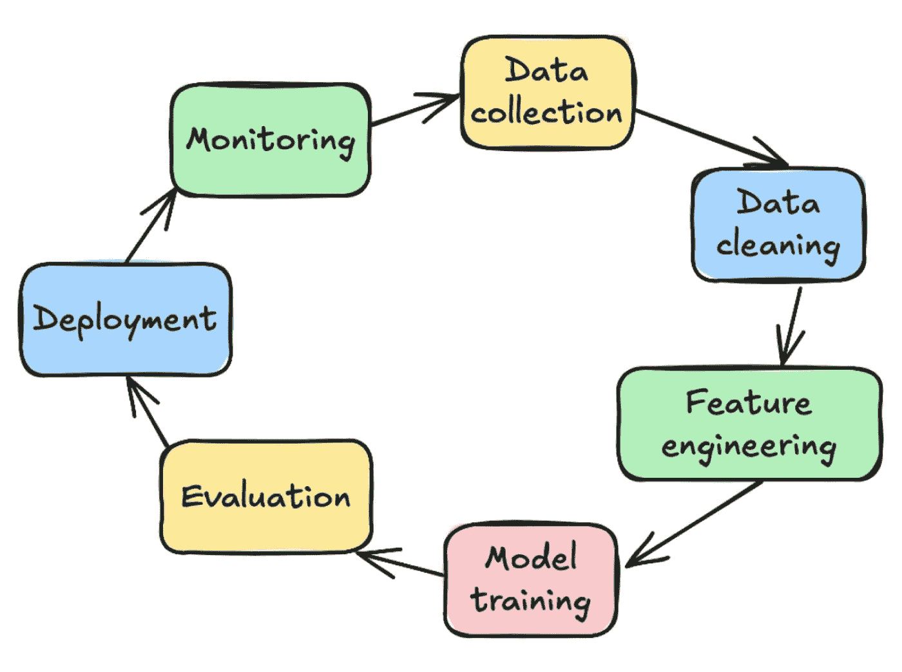

# 机器学习生命周期的每个步骤简单解释

> 原文：[`towardsdatascience.com/every-step-of-the-machine-learning-life-cycle-simply-explained-d1bca7c1772f?source=collection_archive---------2-----------------------#2024-11-26`](https://towardsdatascience.com/every-step-of-the-machine-learning-life-cycle-simply-explained-d1bca7c1772f?source=collection_archive---------2-----------------------#2024-11-26)

## 一份全面的机器学习生命周期指南，逐步讲解并提供 Python 示例

 [Haden Pelletier](https://medium.com/@pelletierhaden?source=post_page---byline--d1bca7c1772f--------------------------------)

·发表于 [Towards Data Science](https://towardsdatascience.com/?source=post_page---byline--d1bca7c1772f--------------------------------) ·15 分钟阅读·2024 年 11 月 26 日

--

机器学习生命周期。图片来自作者

# **机器学习生命周期**

如果你在数据科学领域待了一段时间，你很可能听过这个流行的术语。

**机器学习生命周期。**

听起来很复杂，但实际上它归结为：

+   机器学习是一个动态和活跃的过程——它没有严格的开始或结束。

+   一旦模型被训练并部署，它很可能需要随着时间的推移重新训练，从而重新启动整个生命周期。

+   然而，生命周期中的一些步骤需要按照正确的顺序执行，并且需要谨慎操作。

当你在谷歌搜索机器学习生命周期时，每个来源可能会给出略有不同的步骤数量和名称。

然而，你会注意到，大部分情况下，生命周期包含以下步骤：问题定义、数据收集与预处理、特征工程、模型选择与训练、模型评估、部署和监控。

# 1\. 定义问题
