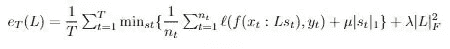
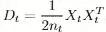
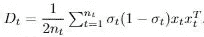
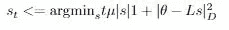
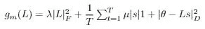
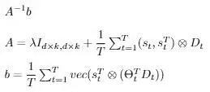

# 通过 ELLA 和 VOYAGER 研究长期机器学习：为何 LLML 是 AI 领域下一次革命性突破的第二部分

> 原文：[`towardsdatascience.com/examining-lifelong-machine-learning-through-ella-and-voyager-part-2-of-why-llml-is-next-in-ai-bea36a01f529?source=collection_archive---------14-----------------------#2024-01-17`](https://towardsdatascience.com/examining-lifelong-machine-learning-through-ella-and-voyager-part-2-of-why-llml-is-next-in-ai-bea36a01f529?source=collection_archive---------14-----------------------#2024-01-17)

## 通过高效终身学习算法（ELLA）和 VOYAGER 理解终身学习的力量

 [Anand Majmudar](https://medium.com/@almond.maj?source=post_page---byline--bea36a01f529--------------------------------)

·发表于[Towards Data Science](https://towardsdatascience.com/?source=post_page---byline--bea36a01f529--------------------------------) ·阅读时间：9 分钟·2024 年 1 月 17 日

--

AI 机器人驾驶太空飞船，由 GPT-4 生成

如果你还没有阅读，[第一部分：LLML 的起源](https://medium.com/@almond.maj/the-origins-of-lifelong-ml-part-1-of-why-llml-is-the-next-game-changer-of-ai-8dacf9897143)我鼓励你先读一读，在那里我们探讨了 LLML 在强化学习中的应用。现在，既然我们已经了解了 LLML 的起源，我们可以将其应用于其他领域，特别是监督学习中的多任务学习，来展示 LLML 的一些真正的力量。

**监督型 LLML：高效终身学习算法**

高效终身学习算法旨在训练一个能够同时在多个任务上表现出色的模型。ELLA 操作于多任务监督学习环境中，具有多个任务 T_1..T_n，每个任务有对应的特征 X_1..X_n 和 y_1…y_n（这些任务的维度可能不同）。我们的目标是学习函数 f_1,.., f_n，其中 f_1: X_1 -> y_1。基本上，每个任务都有一个函数，该函数将任务对应的特征作为输入，并输出其 y 值。

从高层次来看，ELLA 为所有任务保持一个共享的“知识”向量基础，当遇到新任务时，ELLA 利用来自新任务数据的知识来优化基础。此外，在学习这个新任务时，更多的信息被加入到这个基础中，从而提高所有未来任务的学习效果！

Ruvolo 和 Eaton 在三个场景中使用了 ELLA：地雷探测、面部表情识别和考试成绩预测！作为一个小小的预告，让你对 ELLA 的强大功能产生兴趣，它在这些数据集上实现了高达 1,000 倍的时间效率提升，几乎没有牺牲性能能力！

现在，让我们深入探讨 ELLA 的技术细节！当尝试推导这样一个算法时，第一个可能出现的问题是

*我们到底如何找到在知识库中与每个任务相关的信息？*

ELLA 通过修改每个 t 的 f 函数来实现这一点。它不再是一个函数 f(x) = y，而是 f(x, θ_t) = y，其中θ_t 是特定于任务 t 的，可以通过知识库向量的线性组合表示。通过这种系统，我们现在将所有任务映射到*相同*的基准维度，并可以使用简单的线性距离来衡量相似性！

*现在，我们如何为每个任务推导θ_t？*

这个问题是 ELLA 算法的核心洞察力，所以让我们详细看看它。我们将知识基向量表示为矩阵 L。给定权重向量 s_t，我们将每个θ_t 表示为 Ls_t，即基向量的线性组合。

我们的目标是最小化每个任务的损失，同时最大化任务之间共享的信息。我们通过最小化目标函数 e_T 来实现这一点：

其中ℓ是我们选择的损失函数。

本质上，第一个子句考虑了我们特定任务的损失，第二个子句试图最小化我们的权重向量并使其稀疏，最后一个子句试图最小化我们的基向量。

**这个方程有两个低效之处（看看你是否能找出是什么）！第一个低效之处是我们的方程依赖于所有之前的训练数据（具体来说是内层求和），我们可以想象这非常繁琐。我们通过使用泰勒级数近似来缓解这个低效问题。第二个低效之处是我们需要重新计算每一个 s_t 来评估 L 的一个实例。我们通过移除 z 上的最小化，并改为在 t 最后一次交互时计算 s，从而消除了这个低效问题。我鼓励你阅读原始论文以获得更详细的解释！**

现在我们有了目标函数，我们希望创建一种方法来优化它！

在训练过程中，我们将每次迭代视为一个单元，其中我们从单个任务接收一批训练数据，然后计算 s_t，最后更新 L。在算法的开始，我们将 T（任务计数器）、A、b 和 L 初始化为零。现在，对于每批数据，我们根据数据是来自已知任务还是未知任务来进行分类处理。

如果我们遇到来自新任务的数据，我们将 T 加 1，并为这个新任务初始化 X_t 和 y_t，将它们设置为我们当前的 X 和 y 批次。

如果我们遇到已经见过的数据，我们的过程变得更加复杂。我们再次将新的 X 和 y 添加到我们当前的 X_t 和 y_t 的记忆中（通过遍历所有数据，我们将为每个任务拥有一完整的 X 和 y 集合！）。我们还会递增地更新 A 和 b 的值（我稍后会解释这一点，现在先记住这一点！）。

现在我们检查是否想要结束训练循环。我们将(θ_t, D_t)设置为我们常规学习器对批量数据的输出。

然后我们检查是否结束循环（如果我们已经看过所有训练数据）。如果没有结束，我们继续计算 s 并更新 L。

为了计算 s，我们首先仅使用批量数据来计算最优模型θ_t，这将依赖于我们的具体任务和损失函数。

然后我们计算 D_t，并且随机或选择一个θ_t 来初始化 L 的所有零列（如果某个基础向量未被使用，则会发生这种情况）。在线性回归中，

而在逻辑回归中

然后，我们通过求解 L1 正则化回归问题来使用 L 计算 s_t：

在我们更新 L 的最后一步时，我们取

，找到梯度为 0 的地方，然后解 L。通过这样做，我们增加了 L 的稀疏性！然后我们输出 L 的更新列向量化形式为

为了避免对所有任务求和以计算 A 和 b，我们在每个任务到来时逐步构建它们。

一旦我们遍历完所有批次数据，就意味着我们已经正确学习了所有任务并完成了！

ELLA 的强大之处在于它的许多效率优化，其中最主要的是它使用θ函数来准确理解哪些基础知识是有用的！如果你对 ELLA 有更深入的了解兴趣，我强烈建议你查看[原始论文](https://proceedings.mlr.press/v28/ruvolo13.pdf)中的伪代码和解释。

使用 ELLA 作为基础，我们可以设想创建一个具有普遍性的人工智能，它可以学习任何呈现给它的任务。我们再次具有这样一个特性：随着我们的知识基础的增长，它所包含的‘相关信息’也越来越多，这将进一步加速学习新任务的速度！看起来，ELLA 有可能成为未来超级智能人工学习者的核心！

**旅行者**

当我们将人工智能的新突破 LLM 与终身学习结合时，会发生什么呢？我们得到的是一个能够战胜 Minecraft 的系统（这是实际论文的设置）！

王冠志、谢宇琪等人看到了 GPT-4 的强大能力所带来的新机遇，并决定将其与迄今为止学到的终身学习理念结合，创造出 Voyager。

在学习游戏中，典型的算法会被赋予预定义的最终目标和检查点，存在的唯一目的就是追求这些目标。然而，在像 Minecraft 这样的开放世界游戏中，有许多可能的目标可以追求，并且有无限的空间可以探索。如果我们的目标是近似于人类般的自我激励，并结合传统 Minecraft 基准测试中的时间效率提升，比如获取钻石？具体来说，假设我们希望我们的代理能够决定可行的、有趣的任务，学习并记住技能，并以“自我激励”的方式继续探索和寻求新目标。

为了实现这些目标，王、谢等人创建了 [Voyager](https://arxiv.org/pdf/2305.16291.pdf)，他们称之为首个基于 LLM 的具身终身学习代理！

*Voyager 是如何工作的？*

在大规模应用中，Voyager 使用 GPT-4 作为其主要的“智能功能”，该模型本身可以分为三个部分：

1.  **自动化课程：** 这决定了要追求的目标，可以看作是模型的“动机”。通过 GPT-4 实现，他们指示模型优化难度较大但可行的目标，并“尽可能多地发现不同的事物”（可以阅读原文了解他们的具体提示）。如果我们在四轮迭代提示机制循环中，代理的环境没有发生变化，我们就选择一个新的任务！

1.  **技能库：** 一个包含可执行动作的集合，如 craftStoneSword() 或 getWool()，随着学习者的探索而逐渐增加难度。这个技能库以向量数据库的形式表示，其中键是 GPT-3.5 生成的技能描述的嵌入向量，以及以代码形式表示的可执行技能。GPT-4 生成了技能的代码，优化了其通用性，并通过在代理环境中使用技能的反馈进行了优化！

1.  **迭代提示机制：** 这是与 Minecraft 环境交互的元素。它首先执行 Minecraft 的接口，获取当前环境的信息，例如它的背包中的物品和它能观察到的周围生物。然后它提示 GPT-4 并执行输出中指定的动作，同时提供有关指定动作是否不可能的反馈。这个过程会重复，直到当前任务（由自动化课程决定）完成。完成后，我们将学到的技能添加到技能库中。例如，如果我们的任务是制作一把石剑，我们现在就将技能 craftStoneSword() 加入到技能库中。最后，我们向自动化课程请求一个新的目标。

*那么，终身学习在这一切中扮演什么角色？*

当我们遇到新任务时，我们查询我们的技能数据库，以找到与当前任务最相关的前 5 个技能（例如，任务 getDiamonds() 的相关技能可能是 craftIronPickaxe() 和 findCave()）。

因此，我们已经利用先前的任务来更高效地学习新的任务：这就是终身学习的本质！通过这种方法，Voyager 不断探索和成长，学习新的技能，拓展它的可能性边界，增加目标的雄心壮志，从而持续提高新学习技能的能力！

与 AutoGPT、ReAct 和 Reflexion 等其他模型相比，Voyager 发现的新项目是这些模型的 3.3 倍，导航距离是它们的 2.3 倍，每次提示迭代解锁木质级别的速度是它们的 15.3 倍，而且是唯一一个解锁了技术树钻石级别的模型！此外，在训练之后，当被放入一个完全陌生、没有任何物品的环境时，Voyager 始终能够解决以前未见过的任务，而其他模型在 50 次提示内都无法解决任何任务。

为了展示终身学习的重要性，没有技能库的情况下，模型在学习新任务时的进展在 125 次迭代后停滞不前，而有了技能库，它的进展以相同的高速度持续上升！

现在想象这个代理应用于现实世界！想象一个拥有无限时间和无限动力的学习者，随着拥有的先验知识越来越多，它能够不断拓展自己的可能性边界，学习得越来越快！我希望到现在为止，我已经充分展示了终身机器学习的力量以及它推动 AI 下一次变革的能力！

如果你对 LLML 更感兴趣，我鼓励你阅读 Zhiyuan Chen 和 Bing Liu 的[书籍](https://www.cs.uic.edu/~liub/lifelong-machine-learning-draft.pdf)，它阐述了 LLML 可能走向的未来路径！

感谢你一直看到这里！如果你感兴趣，可以访问我的网站 anandmaj.com，那里有我的其他写作、项目和艺术作品，也可以在 Twitter 上关注我@almondgodd。

**原始论文及其他资料：**

Eaton 和 Ruvolo：[高效的终身学习算法](https://www.seas.upenn.edu/~eeaton/papers/Ruvolo2013ELLA.pdf)

Wang、Xie 等：[Voyager](https://arxiv.org/pdf/2305.16291.pdf)

Chen 和 Liu，《终身机器学习》（启发我写这篇文章！）：[`www.cs.uic.edu/~liub/lifelong-machine-learning-draft.pdf`](https://www.cs.uic.edu/~liub/lifelong-machine-learning-draft.pdf)

使用课程的无监督终身学习：[`par.nsf.gov/servlets/purl/10310051`](https://par.nsf.gov/servlets/purl/10310051)

深度终身学习：`towardsdatascience.com/deep-lifelong-learning-drawing-inspiration-from-the-human-brain-c4518a2f4fb9`

神经启发的 AI：[`www.cell.com/neuron/pdf/S0896-6273(17)30509-3.pdf`](https://www.cell.com/neuron/pdf/S0896-6273(17)30509-3.pdf)

体现终身学习的应用：[`lis.csail.mit.edu/embodied-lifelong-learning-for-decision-making/`](https://lis.csail.mit.edu/embodied-lifelong-learning-for-decision-making/)

用于情感分类的终身学习：[`arxiv.org/abs/1801.02808`](https://arxiv.org/abs/1801.02808)

终身机器人学习： [`www.sciencedirect.com/science/article/abs/pii/092188909500004Y`](https://www.sciencedirect.com/science/article/abs/pii/092188909500004Y)

知识基础理念： [`arxiv.org/ftp/arxiv/papers/1206/1206.6417.pdf`](https://arxiv.org/ftp/arxiv/papers/1206/1206.6417.pdf)

Q 学习： [`link.springer.com/article/10.1007/BF00992698`](https://link.springer.com/article/10.1007/BF00992698)

AGI LLLM 大型语言模型： `towardsdatascience.com/towards-agi-llms-and-foundational-models-roles-in-the-lifelong-learning-revolution-f8e56c17fa66`

DEPS： [`arxiv.org/pdf/2302.01560.pdf`](https://arxiv.org/pdf/2302.01560.pdf)

Voyager： [`arxiv.org/pdf/2305.16291.pdf`](https://arxiv.org/pdf/2305.16291.pdf)

元学习： [`machine-learning-made-simple.medium.com/meta-learning-why-its-a-big-deal-it-s-future-for-foundation-models-and-how-to-improve-it-c70b8be2931b`](https://machine-learning-made-simple.medium.com/meta-learning-why-its-a-big-deal-it-s-future-for-foundation-models-and-how-to-improve-it-c70b8be2931b)

元强化学习调查： [`arxiv.org/abs/2301.08028`](https://arxiv.org/abs/2301.08028)
