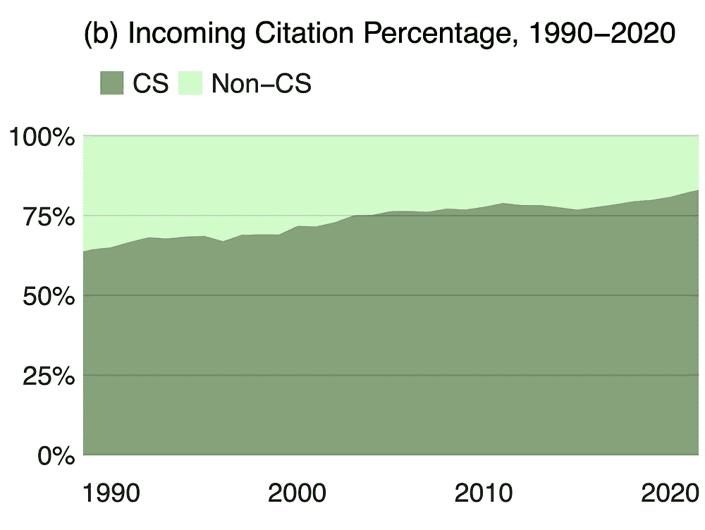
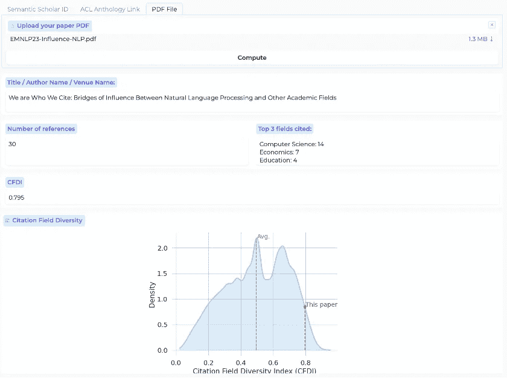

# **自然语言处理（NLP）与其他学科领域的影响关系研究**

> 原文：[`towardsdatascience.com/examining-the-influence-between-nlp-and-other-fields-of-study-26e66f79dabb?source=collection_archive---------7-----------------------#2024-01-09`](https://towardsdatascience.com/examining-the-influence-between-nlp-and-other-fields-of-study-26e66f79dabb?source=collection_archive---------7-----------------------#2024-01-09)

## 关于 NLP 论文随时间推移在引用其他学科的比例逐渐下降的警示性说明

 [Jan Philip Wahle](https://medium.com/@jpwahle?source=post_page---byline--26e66f79dabb--------------------------------)

·发表于[Towards Data Science](https://towardsdatascience.com/?source=post_page---byline--26e66f79dabb--------------------------------) ·13 分钟阅读·2024 年 1 月 9 日

--

“[**尘世乐园**](https://upload.wikimedia.org/wikipedia/commons/thumb/6/6d/The_Garden_of_Earthly_Delights_by_Bosch_High_Resolution.jpg/2560px-The_Garden_of_Earthly_Delights_by_Bosch_High_Resolution.jpg)”是荷兰画家海罗尼穆斯·博斯（Hieronymus Bosch）创作的三联画（约 1490–1510）。这幅画以其复杂而富有想象力的图像而闻名，具有多种解释方式，包括作为不同思想和实体交织的表现。

自然语言处理（NLP）有望在全球范围内产生深远的影响。然而，显著的进展也伴随着巨大的风险。要应对这些风险，需要广泛地与多个学科领域进行互动。请与我们一起踏上这一经验性和视觉化的探索之旅（包括数据和可视化内容），在此过程中我们将探讨以下问题：

+   哪些学科领域在影响自然语言处理？影响的程度如何？

+   自然语言处理正在影响哪些学科领域？影响的程度如何？

+   这些变化随时间如何演变？

本文展示了我们在 EMNLP 2023 会议论文中的一些关键结果：

> *Jan Philip Wahle, Terry Ruas, Mohamed Abdalla, Bela Gipp, Saif M. Mohammad.* [*我们引用的正是我们所影响的领域：自然语言处理与其他学科之间的影响桥梁*](https://arxiv.org/abs/2310.14870) *(2023)* 《2023 年自然语言处理经验方法会议（EMNLP）》论文集，新加坡.* [*BibTeX*](https://jpwahle.com/cite/emnlp2023wahle2.bib)

本文由 Jan Philip Wahle 和 Saif M. Mohammad 撰写

原始创意：Saif M. Mohammad

**动机**

科学的一个迷人之处在于不同学科如何相互作用并相互影响。许多重大突破都是来自多个学科的协同作用。例如，量子力学的概念是一种融合了普朗克关于量子化能级的想法、爱因斯坦的光电效应和玻尔的原子模型的理论。

> 一个学科领域的思想和成果对世界的帮助程度是其影响力的衡量标准。

发展对一个领域影响力的更好理解具有多重好处，比如理解促进创新的因素和抑制创新的因素，理解一个领域在哪些方面取得了成功，哪些方面仍然难以捉摸，或者是谁是受益的主要利益相关者，谁又被抛在了后头。

**领域间影响**的机制复杂，但科学影响力的一个显著标志是引用。一个源领域引用目标领域的程度是目标领域对源领域影响力的粗略指标。然而，我们需要注意，并非所有引用都是平等的，且可能受到各种偏见的影响。尽管如此，从总体上仍然可以得出有意义的推论；例如，如果领域 *x* 对目标领域 *y* 的引用比例明显增加，相较于其他领域对目标领域的引用比例，那么很可能 *x* 对 *y* 的影响力增加了。

**为什么是 NLP？**

虽然研究影响力对于任何学科都是有用的，但我们专注于自然语言处理（NLP）研究，原因非常关键。

> NLP 正处于一个转折点。近期大规模语言模型的发展吸引了科学界、工业界和公众的广泛关注。

因此，尽管存在重大风险，NLP 准备发挥巨大的影响力。此外，语言是社会性的，其应用具有复杂的社会影响。因此，负责任的研究与开发需要广泛阅读相关文献（可以说，这对于 NLP 比其他领域更为重要）。

通过追踪数十万次引用，我们系统性且定量地分析了各学科领域对 NLP 的影响以及 NLP 对它们的影响的广泛趋势。

我们使用 [Semantic Scholar’s](https://api.semanticscholar.org/api-docs/graph#tag/Paper-Data/operation/get_graph_get_paper_autocomplete) 的 *学科属性* 来将论文分类为 23 个领域，例如数学、医学或计算机科学。一篇论文可以属于一个或多个领域。例如，一篇以计算机算法为基础的医学应用论文可能同时属于医学和计算机科学领域。NLP 本身是计算机科学、机器学习和语言学的跨学科子领域。我们将一篇论文归类为 NLP，若它出现在 [ACL Anthology](https://aclanthology.org) 中，这是公认的最大 NLP 文献库（尽管它并不是所有 NLP 论文的完整集合）。

# 数据概览

+   来自各领域的 2.09 亿篇论文和 25 亿次引用（Semantic Scholar）：对于每个引用，都会记录引用论文和被引用论文的[学科领域](https://blog.allenai.org/announcing-s2fos-an-open-source-academic-field-of-study-classifier-9d2f641949e5)。

+   [Semantic Scholar](https://api.semanticscholar.org/api-docs/graph#tag/Paper-Data/operation/get_graph_get_paper_autocomplete)的*学科领域属性*将论文分类为 23 个领域，例如数学、医学或计算机科学。

+   1965 到 2022 年间的 77K 篇 NLP 论文（ACL 文集）

# 问题 1：谁影响 NLP？谁受 NLP 的影响？

为了理解这一点，我们特别关注两种类型的引用：

1.  **外部引用**：哪些领域被 NLP 论文引用？

1.  **内部引用**：哪些领域引用 NLP 论文？

图 1 展示了 NLP 与 CS/非 CS 论文之间引用流的可视化。

*图 1：NLP 引用计算机科学（CS）领域的论文与其他领域的论文相比，比例是多少？这里，我们展示了来自 CS 和非 CS 领域对 NLP 的引用（右侧），以及来自 NLP 对 CS 和非 CS 领域的引用（左侧）。*

在所有引用中，79.4%来自计算机科学（CS）论文。类似地，超过五分之四的引用（81.8%）来自 NLP 论文，指向 CS 论文。但这一情况随时间变化吗？NLP 是否一直在引用这么多 CS？

图 2（a）展示了 NLP 对 CS 和非 CS 论文的引用百分比随时间的变化；图 2（b）展示了 CS 和非 CS 论文对 NLP 的引用百分比随时间的变化。

图 2：CS 论文的引用百分比如何随时间变化？这里，我们展示了来自 NLP 对 CS 和非 CS 的引用百分比（a），以及来自 CS 和非 CS 对 NLP 的引用百分比（b），这些数据基于 NLP 的所有引用，并采用三年的移动平均。

观察到，1990 年时，只有大约 54%的外部引用是来自 CS，但这个比例稳步上升，到 2020 年已达 83%。这是一个显著的变化，显示了 NLP 在这些年里是如何变得以 CS 为中心的。关于内部引用的图表（图 2（b））显示，NLP 从 CS 领域接收到的大多数引用，也从大约 64%稳步增加到 2020 年的 81%。

图 3 展示了当我们只考虑非 CS 领域时的 Sankey 图：

*图 3：NLP 引用最多且被引用最多的非 CS 领域是什么？这里，我们展示了来自非 CS 领域对 NLP 的引用（右侧），以及来自 NLP 对非 CS 领域的引用（左侧）。*

我们看到，语言学、数学、心理学和社会学是 NLP 引用最多的非 CS 领域。它们也是引用 NLP 最多的非 CS 领域，尽管数学和心理学的顺序有所交换。

语言学在 NLP 对非 CS 论文的所有引用中占 42.4%，而在非 CS 论文对 NLP 的所有引用中，45.1%来自语言学。NLP 引用数学的频率高于心理学，但 NLP 的引用来源中，心理学的比例大于数学。

**接着我们想知道这些引用百分比是如何随着时间变化的。我们猜测 NLP 对语言学的引用增加了，但到底增加了多少呢？过去其他学科的引用分布情况又如何？**

图 4 展示了 NLP 到非 CS 论文的引用份额（图 4(a)）和非 CS 论文到 NLP 的引用份额（图 4(b)）**随着时间的推移**的变化。

图 4：从所有非 CS 领域，NLP 引用最多或最常被引用的领域是哪些？这种情况随着时间的推移如何变化？在这里，我们展示了（a）NLP 引用到非 CS 领域的引用百分比，以及（b）非 CS 领域引用到 NLP 的引用百分比，分别占所有来自 NLP 的非 CS 引用和所有指向 NLP 的非 CS 引用的比例。

注意到，语言学在 2000 年至 2020 年间对于 NLP 的相关性经历了明显的（相对）下降（图 4）。NLP 对语言学的外部引用从 60.3%降至 26.9%（a），对 NLP 的引文从 62.7%降至 39.6%（b）。这种相对下降似乎主要是由于 NLP 对数学的引用比例增加，以及心理学和数学对 NLP 的引用比例上升。

**总结：** 随着时间的推移，计算机科学（CS）领域的内外引用数量都在增加。这些结果还显示出语言学影响力的逐渐减弱，以及数学（可能是由于以数学为主的深度学习和大型语言模型的日益主导地位）和心理学（可能是由于 NLP 应用中越来越多使用心理学的行为、情感和幸福感模型）的显著上升。数学的影响力大幅增加，似乎主要取代了原本由语言学占据的影响力。

# Q2. 哪些领域的 NLP 引用频率高于平均水平？

正如我们在本博客之前所知，15.3%的 NLP 非计算机科学（非 CS）领域引用指向了数学，但这与其他领域引用数学的情况相比如何呢？我们引用数学的频率是否高于其他领域的平均水平？

为了回答这个问题，我们计算了 NLP 领域对某一学科*f*的外部引用百分比与各个学科对*f*的外部引用百分比的宏观平均值之间的差异。我们将这个指标称为*外部相对引文显著性*（ORCP）。如果 NLP 对*f*的 ORCP 大于 0，则表示 NLP 对*f*的引用百分比高于该学科的平均值。ORCP 的计算方式如下：

其中，*F*是所有学科的集合，*N*是学科的总数，*C*是某一学科对另一个学科的引用次数。

图 5 展示了 NLP 在各个学科的 ORCP 值的图示。

*图 5：NLP 相比其他学科平均引用某一领域的比例有多突出？NLP 的外向相对引用显著度（ORCP）体现了这一点。这里，我们展示了 23 个学科领域的 ORCP 分数。高分（>0%）表示 NLP 比平均水平更多地引用该领域，而低分（<0%）则表示 NLP 比平均水平少引用该领域。*

NLP 引用计算机科学的频率明显高于平均水平（ORCP = 73.9%）。这一分数意味着 NLP 对数学的引用频率比其他学科对数学的引用频率高出 73.9 个百分点。

量化自然语言处理（NLP）比其他领域引用计算机科学（CS）的频率，帮助我们了解 NLP 在多大程度上借鉴了计算机科学的思想。尽管语言学是语言理论的主要来源，NLP 论文引用语言学的频率仅比平均水平高出 6.3 个百分点（显著低于计算机科学）。有趣的是，尽管心理学是 NLP 引用的第三大非计算机科学领域（见图 3），它的 ORCP 为-5.0，表明 NLP 引用心理学的频率明显低于其他领域对心理学的引用频率。

# Q3．NLP 的内向性有多强？

在此背景下，我们所说的“内向性”是指一个学科在多大程度上依赖于自身文献，而非借鉴其他学科的思想。估算内向性的一种方式是计算论文引用同一学科的比例与引用其他学科论文的比例。对于 NLP 及 23 个学科领域，我们测量了这一内部引用比例，即一个学科引用自身的论文占所有引用的比例。

图 6 展示了跨时间的内部引用比例。

*图 6：一篇论文引用自己领域的论文与引用其他领域的论文的比例是多少？尽管各个领域引用自己领域的论文与引用其他领域的论文的比例基本保持稳定，但 NLP 在引用自己领域的论文方面有所增长。*

1980 年，只有 5%的 NLP 论文（即每 20 篇引用中有一篇）引用了其他 NLP 论文（见图 6）。从那时起，这一比例显著增加，2000 年达到了 20%，2020 年达到了 40%，每十年增长 10 个百分点。到 2022 年，NLP 的内部引用比例达到了所有领域的平均水平。

与语言学等其他领域相比，NLP 在跨领域引用的增长尤为强劲，尤其是在起步阶段较低的情况下。这可能是因为 NLP 作为一个学科，成立较晚，且在 1980 年代和 1990 年代时规模较小。语言学的内部引用比例从 1980 年的 21%缓慢增长至 2010 年的 33%，但此后开始下降。有趣的是，数学和心理学的内部引用比例在一段时间内保持稳定，但最近经历了快速增长。

**鉴于一篇论文也可以属于一个或多个学科，我们还可以通过测量一篇论文所属的学科数量，并与其他学科进行比较，来估算论文的跨学科程度。**

图 7 显示了每篇论文平均涉及的学科数量随时间的变化。

图 7：NLP 论文的跨学科程度如何？一篇论文可以属于一个或多个学科。例如，关于语言模型在医学领域应用的论文同时属于医学和 NLP 学科。尽管过去四十年中，涉及多个学科的论文数量有所增加，但 NLP 论文却越来越趋向于只涉及单一学科。

1980 年，NLP 论文的平均学科数与其他学科相当。然而，从 1980 年到 2020 年，NLP 和其他学科的趋势发生了明显分化。尽管其他学科的论文逐渐趋向于更多学科交叉，但 NLP 论文则越来越少关注多个学科。

# Q4：是否存在一个底线指标，能够捕捉外部引用多样性的程度？NLP 论文的外部引用多样性（通过此指标衡量）随时间如何变化？同样的问题也适用于流入引用？

为了用一个单一指标捕捉 NLP 引用不同学科的多样性，我们引入了*引用学科多样性指数（CFDI）*。

CFDI 衡量一篇论文在引用不同学科时的多样性。简单来说，较高的*CFDI*表示一篇论文引用了来自多个学科的论文。这个指标提供了学术跨学科影响力扩展的洞察。*CFDI*的定义基于[基尼-辛普森指数](https://en.wikipedia.org/wiki/Diversity_index)，公式如下：

这里，*xf*表示学科*f*中的论文数量，*N*表示总引用量。接近 1 的得分表明，来自目标学科（在本例中为 NLP）对 23 个学科的引用数量大致均匀。得分为 0 则表示所有引用都集中在一个学科。流入的 CFDI 以类似的方式计算，只不过考虑的是其他学科对目标学科（NLP）的引用。

图 8 展示了外部 CFDI（a）和流入 CFDI（b）随时间的变化。

*图 8：我们在引用不同学科时的多样性如何？引用学科多样性指数（CFDI）反映了这一点。接近 1 的得分表示我们均等地引用了多个学科，而接近 0 的低得分则表明我们集中引用了特定学科。这里，我们展示了 NLP 的 CFDI 以及 NLP 引用的三大学科的 CFDI，分别针对（a）外部引用和（b）流入引用。“Avg.”表示 23 个学科的宏观平均 CFDI。*

尽管平均的外部 CFDI 随着时间的推移缓慢增加，但在过去四十年中，NLP 的 CFDI 却经历了快速下降。从 1980 年到 2020 年，平均外部 CFDI 增长了 0.08，而 NLP 的外部 CFDI 下降了大约 30%（0.18）。语言学和心理学的 CFDI 变化趋势与平均值类似，而数学在四十年间外部 CFDI 增加了 0.16。

与外部 CFDI 类似，NLP 论文的内部 CFDI 也随着时间的推移显著下降，表明其引用的来源主要来自一个（或少数几个）领域，而非多个领域。图 5（b）展示了这一趋势。虽然其他领域和平均值的内部 CFDI 在 1980 到 2010 年间保持稳定，NLP 的内部 CFDI 则从 0.59 降至 0.42。在 2010 年代，所有领域的 CFDI 都出现下降，但 NLP 的下降尤其明显（从 0.42 降至 0.31）。

# 主要结论

+   NLP 主要吸取来自计算机科学（CS）的思想（>80%）。在计算机科学之后，NLP 最受语言学、数学、心理学和社会学的影响。

+   随着时间的推移，NLP 对非计算机科学领域的引用以及引用不同领域的多样性有所下降，而其他领域则保持稳定。

+   NLP 领域的论文正变得越来越不具跨学科性，越来越多地局限于单一领域，并引用自己领域的文献。

**讨论**。关于科学影响的一个关键点是，作为研究人员，我们不仅仅是影响的被动对象。尽管某些影响力很难忽视（比如来自同行的广泛支持和同行评审过程），但其他影响则是研究人员主动与相关文献互动的直接结果（可能来自不同领域）。

> 我们（可以）选择与哪些文献互动，从而受益。
> 
> 同样，尽管我们偶尔可能会影响到其他领域，但我们（可以）选择与其他领域互动，让他们更加关注我们的工作。

这种互动可以通过在会议上的跨领域交流、为其他领域目标受众撰写的博客文章等方式进行。

在过去五年里，NLP 技术被广泛部署，直接和间接地影响了数十亿人。也有大量实例表明，显然在开发这些系统时并未充分考虑，导致了各种不良后果。已有充分证明，开发更好系统的一个关键因素是广泛地涉猎各类文献和思想，尤其是吸收计算机科学之外的思想（如心理学、社会科学、语言学等）。

> 在这种背景下，NLP 对更广泛研究文献的缺乏互动，尤其是在边缘化群体仍面临技术带来重大风险的情况下，揭示了 NLP 领域的严重问题。

我们不仅没有像其他领域那样更多地与外部文献互动，甚至与其他领域的互动还明显较少。这一趋势只会变得更糟。

**好消息**是，这种情况可以改变。认为引用模式是“注定发生”的，或者认为个别研究者和团队在引用哪些文献时没有选择权，这种看法是一个神话。我们可以主动选择我们参与的文献。我们可以更加努力地将我们的工作与语言学、心理学、社会科学等领域的思想联系起来。通过语言和计算，我们可以更加关注对其他领域重要的问题。通过关注其他领域的工作，我们可以将他们的思想带到自然语言处理（NLP）中的新形式。

作为研究人员、导师、评审和委员会成员，我们应该问问自己，我们是如何：

> 影响跨领域思想交流的广泛性

并有意识地反对：

> 过度关注计算机科学的作品，而忽视来自其他领域的相关工作，如心理学、社会学和语言学。

# 结语

## 计算跨领域影响力的在线工具

为了促进我们对来自各个领域文献引用的反思，我们创建了[一个在线公共工具](https://huggingface.co/spaces/jpwahle/field-diversity)，它可以计算个别论文甚至一组论文（例如，作者简介、会议论文集）的跨领域引用量。只需插入 Semantic Scholar 或 ACL Anthology 的 URL，该工具就会计算出诸如最受引用领域、引用领域多样性等各种指标。或者上传一个 PDF 草稿，工具会解析参考文献并将其链接到相应的领域。

你将能够回答以下问题：

+   哪些领域对我（作为作者）的影响最大？

+   我的提交草稿的领域多样性如何？

+   与本次会议相关的最重要的领域是什么？

通过回答这些问题，你可能会进一步反思：

+   “是否有其他领域的思想可以创新性地应用于我的研究？”

+   “我是否可以扩大我的文献搜索，涵盖来自其他领域的作品？”

若想快速了解该工具，请观看这段[简短视频](http://youtube.com)。

## 致谢

本项工作部分得到了德国学术交流服务（DAAD）9187215 号资助、下萨克森州科学与文化部资助，以及大众汽车基金会的支持。感谢 Roland Kuhn、Andreas Stephan、Annika Schulte-Hürrmann 和 Tara Small 的深思熟虑的讨论。

除非另有说明，所有图片均由作者提供。

## 相关的有趣作品

+   [自然语言处理中的地理引用空白（EMNLP, 2022）](https://aclanthology.org/2022.emnlp-main.89/)

+   [D3：计算机科学研究现状分析的大规模学术元数据数据集（LREC, 2022）](https://aclanthology.org/2022.lrec-1.283/)

+   [被遗忘的知识：检视自然语言处理中的引用遗忘症（ACL, 2023）](https://arxiv.org/abs/2305.18554)

+   [房间里的大象：分析大科技公司在自然语言处理研究中的存在（ACL, 2023）](https://arxiv.org/abs/2305.02797)

+   [我们是我们所引用的：自然语言处理领域中影响力的桥梁](https://aclanthology.org/2022.lrec-1.283/)

    处理和其他学术领域（EMNLP, 2023）](https://arxiv.org/abs/2310.14870)

**简·菲利普·瓦尔赫**

德国哥廷根大学研究员

加拿大国家研究委员会访问研究员

*推特:* @jpwahle

*网页*: [`jpwahle.com/`](http://jpwahle.com)

**赛义夫·M·穆罕默德**

加拿大国家研究委员会高级研究科学家

*推特:* @saifmmohammad

*网页*: [`saifmohammad.com/`](http://saifmohammad.com/)
