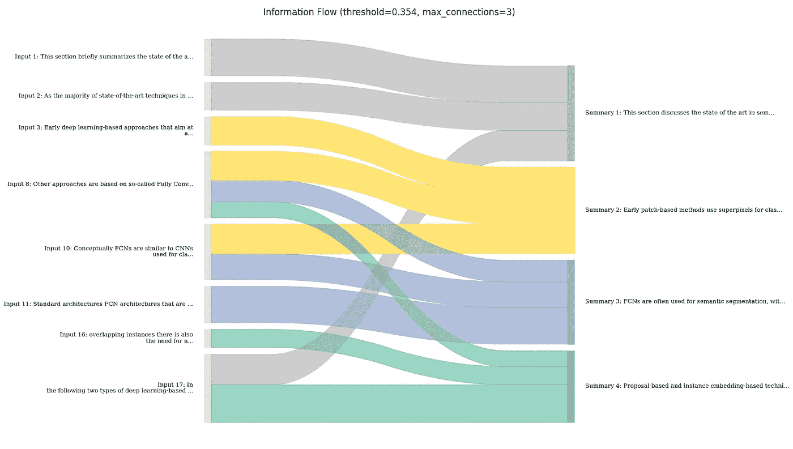
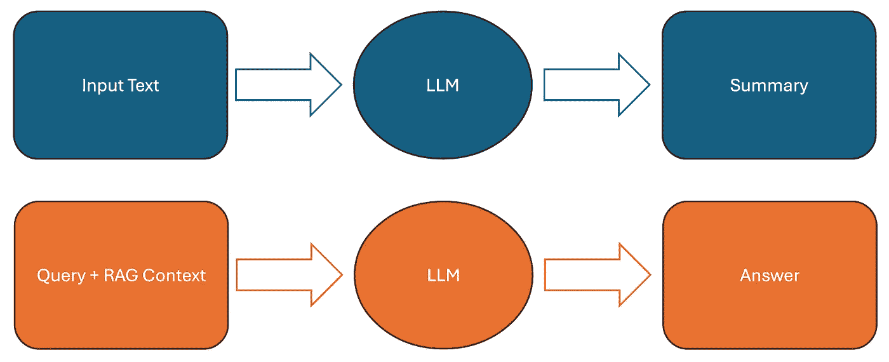
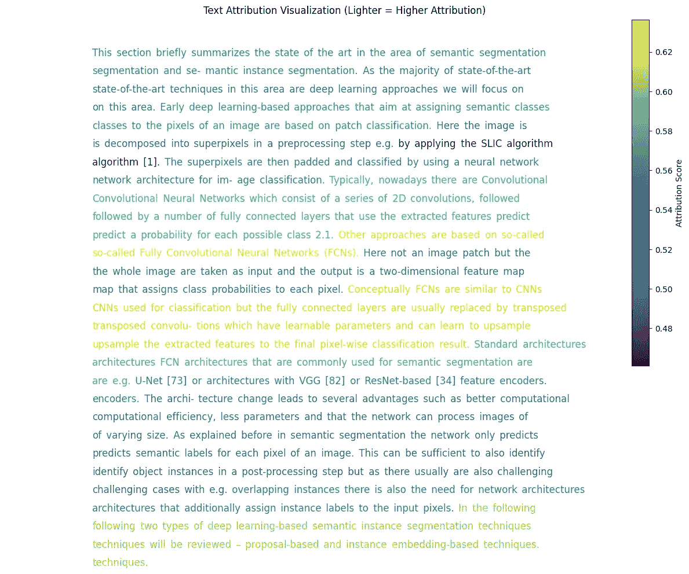
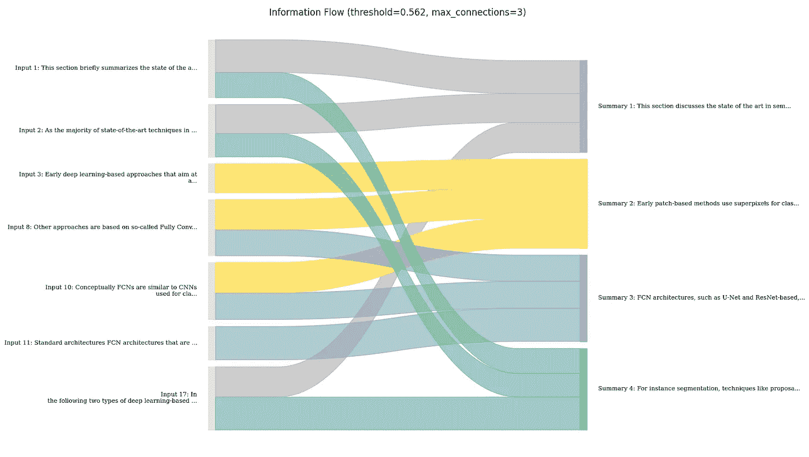

# 解释用于 RAG 和摘要的 LLMs

> 原文：[`towardsdatascience.com/explaining-llms-for-rag-and-summarization-067e486020b4?source=collection_archive---------9-----------------------#2024-11-21`](https://towardsdatascience.com/explaining-llms-for-rag-and-summarization-067e486020b4?source=collection_archive---------9-----------------------#2024-11-21)

## 一种快速且低资源的基于相似度归因的方法

[](https://medium.com/@daniel-klitzke?source=post_page---byline--067e486020b4--------------------------------)[](https://towardsdatascience.com/?source=post_page---byline--067e486020b4--------------------------------) [Daniel Klitzke](https://medium.com/@daniel-klitzke?source=post_page---byline--067e486020b4--------------------------------)

·发表于[Towards Data Science](https://towardsdatascience.com/?source=post_page---byline--067e486020b4--------------------------------) ·8 分钟阅读·2024 年 11 月 21 日

--



输入文档与其摘要之间的信息流，计算方式由提出的可解释性方法得出。（图像由作者创建）

# TL;DR

+   解释 LLMs 是非常**缓慢**且**资源密集型**的。

+   本文提出了一种任务特定的解释技术，即**RAG 问答**和**摘要**。

+   该方法是**模型无关**的，并且是**基于相似度的**。

+   该方法是**低资源**和**低延迟**的，因此几乎可以在任何地方运行。

+   我在[Github](https://github.com/Renumics/rag-explanation-blogpost)上提供了**代码**，使用了[Huggingface Transformers](https://github.com/huggingface/transformers)生态系统。

# 动机

有许多充分的理由需要为你的模型输出提供解释。例如，它们可以帮助你**发现问题**，或者它们可能仅仅是为用户提供更多**透明度**的一种方式，从而促进用户信任。这就是为什么对于像 XGBoost 这样的模型，我经常应用像[SHAP](https://github.com/shap/shap)这样的方法，以便更好地了解我的模型行为。

现在，随着我越来越多地处理基于 LLM 的机器学习系统，我想以与传统机器学习方法相同的方式**探索解释 LLM 模型**的方法。然而，我很快发现自己被卡住了，因为：

1.  **SHAP**确实为基于文本的模型提供了[示例](https://shap.readthedocs.io/en/latest/text_examples.html)，但对我来说，它们在新模型上失败了，因为 SHAP 不支持嵌入层。

1.  **Captum**还提供了一个[LLM 归因](https://captum.ai/tutorials/Llama2_LLM_Attribution)的教程；然而，所展示的两种方法也各自有非常具体的缺点。具体而言，基于扰动的方法速度太慢，而基于梯度的方法则导致我的 GPU 内存爆炸，最终失败。

在尝试了量化甚至启动 GPU 云实例并取得有限成功之后，我决定退后一步。

# 一种基于相似度的方法

为了理解这种方法，让我们首先简要定义我们想要达成的目标。具体而言，我们想要**识别并突出显示输入文本中与模型输出高度相关的部分**（例如，长文本文件或 RAG 上下文），这些输出可能是摘要或 RAG 回答。



我们的可解释性方法适用的典型任务流程。（图像由作者创建）

在**摘要**的情况下，我们的方法需要突出显示原始输入文本中在摘要中高度反映的部分。在**RAG 系统**的情况下，我们的方法需要突出显示 RAG 上下文中在答案中出现的文档块。

由于直接解释 LLM 本身对我来说已经证明是棘手的，因此我提议通过一个单独的文本相似度模型来**建模模型输入与输出之间的关系**。具体来说，我实现了以下简单但有效的方法：

1.  我**将模型输入和输出拆分成句子**。

1.  我**计算了所有句子之间的成对相似度**。

1.  然后，我使用 Softmax**归一化相似度得分**。

1.  之后，我**将输入和输出句子之间的相似度**可视化为一个漂亮的图表。

在代码中，这如下面所示。要运行代码，您需要[Huggingface Transformers](https://github.com/huggingface/transformers)、[Sentence Transformers](https://github.com/UKPLab/sentence-transformers)和[NLTK](https://github.com/nltk/nltk)库。

> 请查看这个[Github 仓库](https://github.com/Renumics/rag-explanation-blogpost)，获取与此博客文章相关的完整代码。

```py
from sentence_transformers import SentenceTransformer
from nltk.tokenize import sent_tokenize
import numpy as np

# Original text truncated for brevity ...
text = """This section briefly summarizes the state of the art in the area of semantic segmentation and semantic instance segmentation. As the majority of state-of-the-art techniques in this area are deep learning approaches we will focus on this area. Early deep learning-based approaches that aim at assigning semantic classes to the pixels of an image are based on patch classification. Here the image is decomposed into superpixels in a preprocessing step e.g. by applying the SLIC algorithm [1].

Other approaches are based on so-called Fully Convolutional Neural Networks (FCNs). Here not an image patch but the whole image are taken as input and the output is a two-dimensional feature map that assigns class probabilities to each pixel. Conceptually FCNs are similar to CNNs used for classification but the fully connected layers are usually replaced by transposed convolutions which have learnable parameters and can learn to upsample the extracted features to the final pixel-wise classification result. ..."""

# Define a concise summary that captures the key points
summary = "Semantic segmentation has evolved from early patch-based classification approaches using superpixels to more advanced Fully Convolutional Networks (FCNs) that process entire images and output pixel-wise classifications."

# Load the embedding model
model = SentenceTransformer('BAAI/bge-small-en')

# Split texts into sentences
input_sentences = sent_tokenize(text)
summary_sentences = sent_tokenize(summary)

# Calculate embeddings for all sentences
input_embeddings = model.encode(input_sentences)
summary_embeddings = model.encode(summary_sentences)

# Calculate similarity matrix using cosine similarity
similarity_matrix = np.zeros((len(summary_sentences), len(input_sentences)))
for i, sum_emb in enumerate(summary_embeddings):
    for j, inp_emb in enumerate(input_embeddings):
        similarity = np.dot(sum_emb, inp_emb) / (np.linalg.norm(sum_emb) * np.linalg.norm(inp_emb))
        similarity_matrix[i, j] = similarity

# Calculate final attribution scores (mean aggregation)
final_scores = np.mean(similarity_matrix, axis=0)

# Create and print attribution dictionary
attributions = {
    sentence: float(score)
    for sentence, score in zip(input_sentences, final_scores)
}

print("\nInput sentences and their attribution scores:")
for sentence, score in attributions.items():
    print(f"\nScore {score:.3f}: {sentence}")
```

如您所见，到目前为止，这非常简单。显然，我们并没有解释模型本身。然而，我们或许可以对这种特定类型的任务（如摘要/ RAG 问答）**输入与输出句子之间的关系**有一个较好的理解。那么，这实际上如何表现，以及如何可视化归因结果以理解输出呢？

# RAG 和摘要的评估

为了可视化这种方法的输出，我创建了**两种可视化**，分别适用于**展示 LLM 输入与输出之间的特征归因或连接**。

这些可视化是为 LLM 输入的**摘要**生成的，其内容如下：

> 本节讨论了语义分割和实例分割的最新技术进展，重点介绍了深度学习方法。早期的补丁分类方法使用超像素，而最近的全卷积网络（FCN）则为每个像素预测类别概率。FCN 类似于 CNN，但使用转置卷积进行上采样。标准架构包括 U-Net 和基于 VGG 的 FCN，它们针对计算效率和特征大小进行了优化。在实例分割方面，回顾了基于提议和实例嵌入的方法，包括使用提议进行实例分割和实例嵌入的概念。

## 特征归因的可视化

对于特征归因的可视化，我的选择是尽可能保持输入数据的原始表示。



基于颜色映射的逐句特征归因分数的可视化。（图像由作者创建）

具体来说，我只是绘制了句子图，包括它们计算出的归因分数。因此，我**将归因分数映射到相应句子的颜色**。

在这种情况下，这向我们展示了一些总结和源句子中的主导模式，信息可能来自这些句子。具体来说，文中提到的**FCN（全卷积网络）架构变种的主导性提及**，以及**基于提议和实例嵌入的实例分割方法的提及**，都得到了清晰的突出显示。

一般来说，这种方法非常适合轻松捕捉总结任务输入中的归因，因为它非常**接近原始表示**，并且对数据的**干扰非常小**。我可以想象，也可以根据需要为 RAG 系统的用户提供这样的可视化。潜在地，输出还可以进一步处理，阈值化为某些特别相关的片段；然后，这也可以作为默认设置展示给用户，以**突出相关的来源**。

> 再次查看[Github 仓库](https://github.com/Renumics/rag-explanation-blogpost)以获取可视化代码

## 信息流的可视化

另一种可视化技术侧重的不是特征归因，而主要是**信息流动**，即输入文本和摘要之间的信息流动。



输入文本和摘要中句子之间信息流的可视化，以 Sankey 图表示。（图像由作者创建）

具体来说，我在这里做的是首先根据归因分数确定**输入句子和输出句子之间的主要连接**。然后，我使用 Sankey 图可视化这些连接。这里，流动连接的宽度表示**连接的强度**，颜色则是基于摘要中的句子进行着色，以便更好的**可追溯性**。

在这里，可以看到摘要大部分遵循文本的顺序。然而，也有一些部分，LLM 可能**结合了**文本开头和结尾的信息，例如，摘要在第一句话中提到重点是深度学习方法。这是从输入文本的最后一句话提取的，并且在流程图中清楚地展示出来。

一般来说，我发现这种方法很有用，尤其是可以帮助我们了解 LLM 在多大程度上将信息**从输入的不同部分**进行聚合，而不仅仅是复制或改写某些部分。在我看来，这也有助于估算如果输出过度依赖 LLM 在不同信息片段之间建立联系时，可能存在的**错误潜力**。

# 可能的扩展与适配

在[GitHub 上提供的代码](https://github.com/Renumics/rag-explanation-blogpost)中，我实现了前面章节中展示的基本方法的某些扩展。具体而言，我探索了以下内容：

1.  使用**不同的聚合方式**，例如最大值，用于相似度评分。

    这样做是有道理的，因为输出句子的平均相似度并不是最相关的。即使只有一个好的匹配，也可能对我们的解释很有帮助。

1.  使用**不同的窗口大小**，例如，使用三句话的片段来计算相似度。

    如果怀疑单一的句子不足以真正捕捉两个句子之间的相关性，进而创造更大的上下文，这也是有道理的。

1.  使用**基于交叉编码的模型**，如重排序器。

    这可能很有用，因为重排序器更明确地在一个模型中建模两个输入文档的相关性，对这两个文档中的细微语言更加敏感。也请参阅我在[Towards Data Science](https://medium.com/towards-data-science/reranking-using-huggingface-transformers-for-optimizing-retrieval-in-rag-pipelines-fbfc6288c91f)上的最新文章。

如前所述，所有这些内容在提供的代码中都有演示，因此务必查看代码。

# 结论

一般来说，我发现很难找到能够真正展示 RAG 和总结中可解释性技术的教程，尤其是在“实时”场景中有用的技术，能够提供**低延迟**的技术似乎稀缺。然而，正如这篇文章所展示的，简单的解决方案已经能够在 RAG 用例中提供相当不错的结果，尤其是在**展示文档与答案之间的关系**时。我肯定会进一步探索这个问题，看看如何将其应用于 RAG 生产场景，因为**提供可追溯的输出**对我来说已经证明是极为宝贵的。如果你对这个话题感兴趣，并希望获得更多此类内容，请在[Medium](https://medium.com/@daniel-klitzke)和[LinkedIn](https://www.linkedin.com/in/daniel-klitzke/)上关注我。
