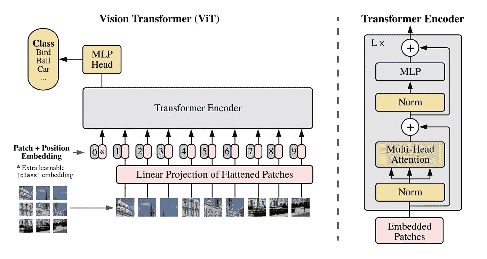
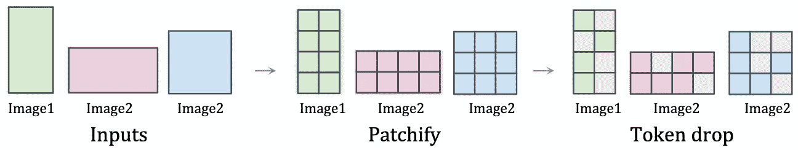
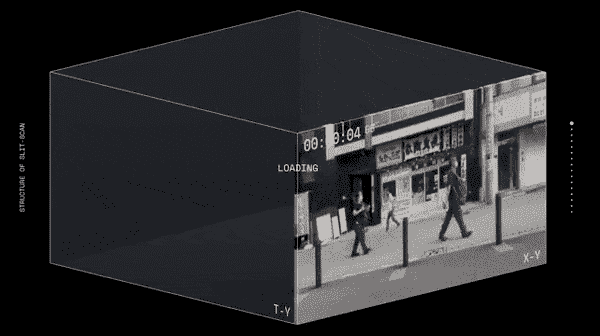
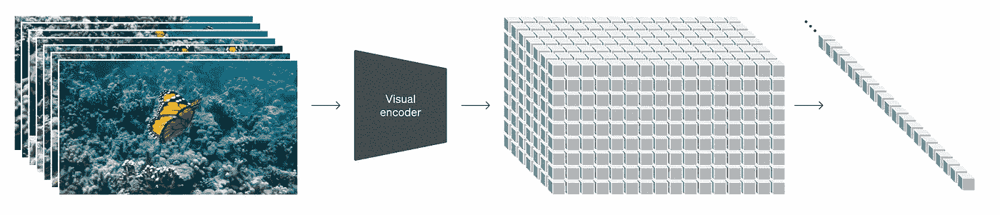
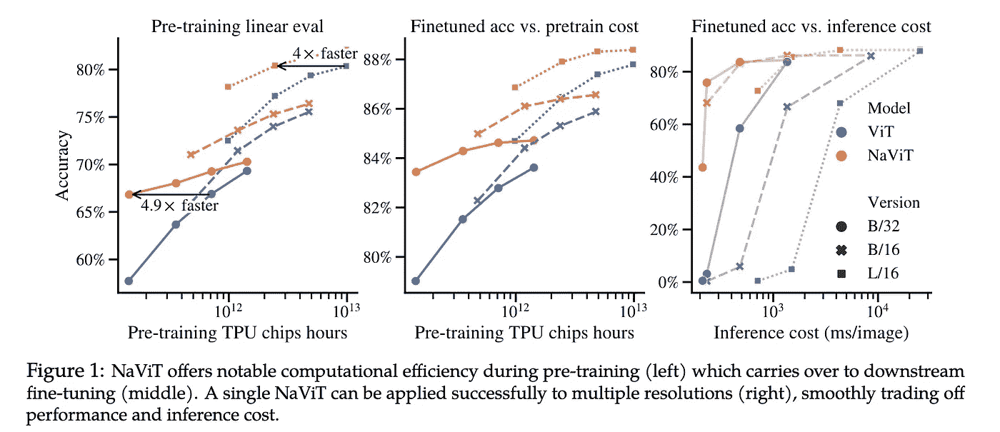

# 解读 OpenAI Sora 的时空补丁：关键成分

> 原文：[`towardsdatascience.com/explaining-openai-soras-spacetime-patches-the-key-ingredient-e14e0703ec5b?source=collection_archive---------0-----------------------#2024-02-16`](https://towardsdatascience.com/explaining-openai-soras-spacetime-patches-the-key-ingredient-e14e0703ec5b?source=collection_archive---------0-----------------------#2024-02-16)

## 解读 OpenAI 生成视频 AI 的核心技术

 [Vincent Koc](https://medium.com/@vincentkoc?source=post_page---byline--e14e0703ec5b--------------------------------)

·发表于[Towards Data Science](https://towardsdatascience.com/?source=post_page---byline--e14e0703ec5b--------------------------------) ·6 分钟阅读·2024 年 2 月 16 日

--

AI 如何将一张静态图片转变为动态、真实的视频？OpenAI 的 Sora 通过创新地使用时空补丁给出了答案。

在快速发展的生成模型领域，[OpenAI 的 Sora](https://openai.com/sora)作为一个重要的里程碑脱颖而出，承诺重塑我们对视频生成的理解和能力。我们解读了[关于 Sora 的技术](https://openai.com/research/video-generation-models-as-world-simulators)以及它在图像、视频和 3D 内容创作中启发新一代模型的潜力。

OpenAI Sosa 演示 — 床上的猫。版权归 OpenAI 所有。

上面的演示是 OpenAI 使用以下提示生成的：*一只猫把睡着的主人弄醒，要求早餐。主人试图忽视这只猫，但猫采取了新策略，最终主人从枕头下拿出一个秘密的零食藏匿处，稍微拖延了些时间。*——借助 Sora，我们几乎能够生成与现实难以区分的视频内容。完整的模型尚未完全公开，因为它还在测试阶段。

# Sora 独特方法如何变革视频生成

在生成模型的世界中，我们已经看到了一些方法，从 GAN 到自回归模型，再到扩散模型，它们各自有自己的优点和局限性。Sora 现在通过一种新的建模技术和灵活性，带来了范式的转变，能够处理各种持续时间、纵横比和分辨率。

Sora 将扩散模型和变换器架构结合在一起，创造了一个扩散变换器模型，能够提供如下特性：

+   **文本转视频：** *正如我们所见*

+   **图像转视频：** 让静态图像充满生气

+   **视频转视频：** 改变视频的风格为其他样式

+   **视频时间扩展：** 向前和向后

+   **创建无缝循环：** 瓦片视频，看起来似乎永无止境

+   **图像生成：** 静态图像是单帧的电影（*最大 2048 x 2048*）

+   **以任何格式生成视频：** 从 1920 x 1080 到 1080 x 1920 及其间的所有格式

+   **模拟虚拟世界：** 如 Minecraft 和其他视频游戏

+   **创建视频：** 最长 1 分钟，包含多个短视频

想象一下，你现在在厨房里。像[皮卡](https://pika.art/home)和[RunwayML](https://runwayml.com/ai-tools/gen-2/)等传统的视频生成模型就像是严格按照食谱做菜的厨师。他们可以做出精美的菜肴（*视频*），但受到他们知道的食谱（*算法*）的限制。这些厨师可能专注于做蛋糕（*短视频*）或者做意大利面（*特定类型的视频*），使用特定的食材（*数据格式*）和技巧（*模型架构*）。

而 Sora 则是一种新型厨师，理解味道的基础。这个厨师不仅仅遵循食谱，而是发明新的食谱。Sora 的食材（*数据*）和技巧（*模型架构*）的灵活性使得 Sora 能够制作出各种高质量的视频，就像大厨能创造出多样的美味佳肴。

# Sora 秘密配方的核心：探索时空补丁

时空补丁是 Sora 创新的核心，基于[Google DeepMind 在 NaViT 上的研究](https://arxiv.org/abs/2307.06304)以及基于 2021 年论文[《一幅图像值 16x16 个单词》](https://arxiv.org/abs/2010.11929)的 ViT（*视觉变换器*）。

*“原生”* 视觉变换器架构 — 版权归[Dosovitskiy 等人，2021](https://arxiv.org/abs/2010.11929)

传统上，使用视觉变换器时，我们使用一系列图像“补丁”来训练变换器模型进行图像识别，而不是像语言变换器那样使用单词。这些补丁使我们能够摆脱卷积神经网络来进行图像处理。

帧/图像是如何被“补丁化”的 — 版权归[Dehghani 等人，2023](https://arxiv.org/abs/2307.06304)

然而，使用视觉变换器时，图像训练数据的大小和长宽比是固定的，这限制了质量，并且需要大量的图像预处理。

视频时间数据切片的可视化 — 来源：[kitasenjudesign](https://twitter.com/kitasenjudesign/status/1489260985135157258)

通过将视频视为拼接片段的序列，Sora 保持了原始的纵横比和分辨率，类似于 NaViT 处理图像的方式。**这种保持原始特征的做法对捕捉视觉数据的真实本质至关重要，使得模型能够从更为准确的世界表示中学习，从而赋予 Sora 近乎魔法般的准确性。**

时空拼接（处理）的可视化 — 图片来源：OpenAI（Sora）

这种方法使 Sora 能够高效地处理各种各样的视觉数据，无需进行像调整大小或填充这样的预处理步骤。这种灵活性确保了每一条数据都能为模型的理解做出贡献，类似于大厨如何利用多种食材来提升一道菜肴的风味。

通过时空拼接对视频数据的细致和灵活处理，为复杂功能奠定了基础，例如精确的物理模拟和 3D 一致性。这些能力对于创造不仅看起来逼真，而且符合物理规则的视频至关重要，为 AI 创造复杂且动态的视觉内容提供了一个展望。

# 供养 Sora：多样化数据在训练中的作用

训练数据的质量和多样性对生成模型的表现至关重要。现有的视频模型通常在一个更为有限的数据集上进行训练，这些数据集的长度较短且目标较窄。

Sora 利用了庞大而多样化的数据集，包括不同时长、分辨率和纵横比的视频和图像。[它重现数字世界的能力，如 Minecraft](https://techcrunch.com/2024/02/15/openais-sora-video-generating-model-can-render-video-games-too/)，其训练集可能还包括来自 Unreal 或 Unity 等系统的游戏玩法和模拟世界的镜头，以捕捉视频内容的各个角度和不同风格。这使得 Sora 成为一个“通用型”模型，类似于 GPT-4 在文本领域的作用。

这种广泛的训练使得 Sora 能够理解复杂的动态，并生成既多样又高质量的内容。这种方法模仿了大规模语言模型在多样化文本数据上的训练理念，将类似的哲学应用于视觉内容，从而实现了通用能力。

可变“拼接”NaViT 与传统视觉变换器的对比 — 图片来源：[Dehghani et al., 2023](https://arxiv.org/abs/2307.06304)

正如 NaViT 模型通过将来自不同图像的多个拼接片段打包成单一序列，从而展示出显著的训练效率和性能提升，Sora 则利用时空拼接实现视频生成中的类似效率。这种方法使得模型能够更有效地从庞大的数据集中进行学习，提升生成高保真视频的能力，同时相比现有的建模架构，减少了所需的计算量。

# 让物理世界栩栩如生：Sora 对 3D 和连贯性的掌控

三维空间和物体持久性是 Sora 演示中的关键亮点之一。通过在不对视频进行适配或预处理的情况下，使用广泛的视频数据进行训练，Sora 能够以惊人的准确性建模物理世界，因为它能够以原始形式消耗这些训练数据。

它可以生成数字世界和视频，其中物体和角色在三维空间中移动并互动，看起来十分逼真，即使它们被遮挡或离开画面，依然能保持连贯性。

# **展望未来：Sora 的未来影响**

Sora 为生成模型设定了一个新的标准。这种方法可能会激励开源社区进行实验，并推动视觉模态的能力发展，推动新一代生成模型的诞生，突破创造力和现实主义的边界。

> Sora 的旅程才刚刚开始，正如 OpenAI 所说：“扩大视频生成模型是构建物理世界通用模拟器的有希望的路径。”

Sora 的方法，结合了最新的 AI 研究与实际应用，预示着生成模型的光明未来。随着这些技术的不断发展，它们有望重新定义我们与数字内容的互动，使创建高保真、动态视频变得更加容易和多样化。

## 喜欢这个故事吗？

Vincent Koc 是一位非常成功、注重商业的技术专家和未来学家，拥有丰富的经验，专注于数据驱动和数字化领域。

[免费订阅](https://medium.com/subscribe/@vkoc)，以便在 Vincent 发布新故事时收到通知。或者在 [LinkedIn](https://www.linkedin.com/in/koconder/) 和 [X](https://twitter.com/koconder/) 上关注他。

 [## 每当 Vincent Koc 发布新内容时，您将收到电子邮件通知。

### 每当 Vincent Koc 发布新内容时，您将收到电子邮件通知。通过注册，您将创建一个 Medium 账户（如果您还没有的话）…

medium.com](https://medium.com/subscribe/@vkoc?source=post_page-----e14e0703ec5b--------------------------------)

*除非另有说明，所有图片均为作者提供*
