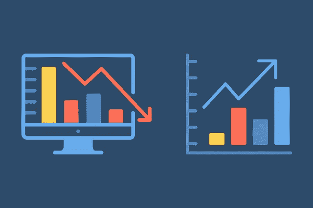

# 探索性数据分析的 11 个步骤

> 原文：[`towardsdatascience.com/exploratory-data-analysis-in-11-steps-31a36ae0b407?source=collection_archive---------4-----------------------#2024-06-19`](https://towardsdatascience.com/exploratory-data-analysis-in-11-steps-31a36ae0b407?source=collection_archive---------4-----------------------#2024-06-19)

## 如何建立具有强大沟通和设定期望实践的流程

 [Loren Hinkson](https://medium.com/@lorenh516?source=post_page---byline--31a36ae0b407--------------------------------)

·发表在[Towards Data Science](https://towardsdatascience.com/?source=post_page---byline--31a36ae0b407--------------------------------) ·5 分钟阅读·2024 年 6 月 19 日

--

*开始探索性数据分析可能令人望而生畏。你如何知道要查看什么？如何知道何时结束？如果漏掉了重要内容怎么办？根据我的经验，通过沟通和设定期望，可以减轻一些担忧。我在这里分享探索性数据分析的过程，供刚刚开始数据工作的人参考，也供更有经验的分析师和数据科学家用来完善他们自己的流程。*

*图片由* [*Elf-Moondance*](https://pixabay.com/users/elf-moondance-19728901/) *通过* [*Pixabay*](https://pixabay.com/illustrations/graphs-report-statistics-analyses-6778372/) *提供*

# 1\. 与利益相关者讨论他们的目标

在开始探索性分析时，首先要与负责使用分析结果做决策的产品经理/领导/利益相关者进行沟通。深入了解他们需要做出的决策，或者需要做出决策的变化/干预类型。

如果您支持产品迭代，与 UX 研究人员、设计师或与客户互动或接收最终用户反馈的客户服务代表交谈可能也会有所帮助。通过了解客户请求是否可行，或者识别用户行为中的模式，表明需要特定功能，您可以增加很多价值。

# 2\. 总结分析目标并取得一致性

这些对话将帮助你确定分析目标，即你是否应该专注于识别模式和关系、理解分布情况等。总结你对目标的理解，明确分析时间段和人群，并确保所有相关利益相关者达成一致。在这一阶段，我还喜欢沟通分析的非目标——那些利益相关者*不*应期望在我的交付物中看到的内容。

> *确保你理解基于分析结果需要做出哪些决策。在开始之前，与所有利益相关者达成一致分析目标。*

# 3\. 制定研究问题清单

创建一系列与你的分析目标相关的问题，并记录你希望探索的维度，例如特定时间段、新用户、某个年龄段或地理区域的用户等。

*例如：对于用户参与度分析，产品经理可能想知道新用户在第一和第二个月访问你网站的次数。*

# 4\. 确定已知和未知的因素

收集与分析主题相关的任何先前研究、组织经验和广泛接受的假设。回顾之前的研究或分析，了解在这一领域已经知道的内容。

注意是否有历史答案可以解答你的一些分析问题。*注意*：当你确定这些答案的相关性时，考虑自上次分析以来的时间长度，以及分析人群或产品/服务是否发生了重大变化。

*例如：保持新的用户活动想法，可能两年前有人做过分析，发现用户活动在账户创建后 5 周开始下降并趋于平稳。如果公司在一年前为新用户推出了一个 6 周的滴灌活动，那么这个洞察可能不再相关。*

# 5\. 理解你所拥有的数据能做什么

一旦你合成了你的目标和关键问题，你可以确定哪些相关数据容易获得，以及哪些补充数据可能是可以访问的。验证你对每个数据源的权限，并向数据/过程所有者请求任何补充数据集的访问权限。花些时间熟悉这些数据集，并排除掉任何你无法用现有数据回答的问题。

# 6\. 设定分析的期望标准

与主要利益相关者（例如产品经理）进行优先排序练习，以了解他们认为哪些问题最重要。在此对话之前，最好对列表上的问题进行 T 恤尺寸（S、M、L）排序，以说明回答这些问题所需的工作量水平。如果列表上的问题超出单次分析的可行范围，使用这些优先排序来确定如何将它们分阶段进行多次分析。

> T 恤尺寸代表回答列表上分析问题所需的工作量水平。如果总工作量超出单次分析的可行范围，与利益相关者合作，将其优先考虑为多次分析。

# 7\. 根据需要转换和清理数据

如果数据管道已经建立并且数据已经是您想要的格式，请评估数据清理的必要性（查找异常值、缺失/稀疏数据、重复项等），并执行任何必要的清理步骤。如果没有，请在数据清理之前创建数据管道以处理任何必要的重定位或转换。

# 8\. 使用摘要统计信息了解数据的“形状”

从高级统计探索开始分析，以了解特征的分布和它们之间的相关性。您可能会注意到数据稀疏性或质量问题，这些问题会影响您从分析计划练习中回答问题的能力。及早向利益相关者沟通您无法解决的问题，或者将对决策不太有价值的“嘈杂”答案。

# 9\. 回答您的分析问题

在这个阶段，您将开始回答为分析制定的具体问题。我喜欢边进行可视化，因为这样可以更容易地发现模式、趋势和异常，并且可以直接将有趣的可视化内容插入我的撰写草稿中。

根据分析类型的不同，您可能希望生成一些额外的特征（例如：数值特征的桶范围，指示是否在给定期间内采取了特定行动或超过了给定阈值的次数）以进一步探索相关性，并使用机器学习寻找特征之间不太直观的关系。

> 在进行分析时，随着工作的进行，可视化和记录您的发现以最小化重复工作，并为分析开发“故事情节”或主题提供一个概念。

# 10\. 记录您的发现

我喜欢分析的问题框架，因为这样可以让我在进行分析时轻松记录我的发现。在进行分析时，请记下您在每个问题下找到的答案。突出显示您认为有趣的发现，并对发现引发的任何思路做笔记。

这样可以减少你在分析结束时需要做的工作，你可以专注于用“为什么在乎？”来充实你的发现，告诉观众他们为什么应该关注一个发现，以及“接下来怎么办？”的建议，使你的洞察力可操作化。当这些都就绪后，根据需要重新组织问题，为分析和主要发现创建一个一致的“故事情节”。最后，根据你的发现，你可以包括任何下一步或额外的调查线索，建议团队查看。

如果你在团队环境中工作，你可能希望让一个或多个队友审查你的代码和/或写作。根据他们的反馈对草稿进行迭代。

# 11\. 分享你的发现

当你的分析准备好与原始利益相关者分享时，请考虑选择的格式。根据受众的不同，他们可能最喜欢 Slack 帖子、演示文稿、分析文档的演示，或以上几种方式的组合。最后，在内部渠道推广你的分析，以防你的发现对你未曾合作的团队有用。

*恭喜，你完成了你的分析！*
