# 使用 Python 探索可解与不可解的方程

> 原文：[`towardsdatascience.com/explore-solvable-and-unsolvable-equations-with-python-661ac11f4f20?source=collection_archive---------2-----------------------#2024-10-29`](https://towardsdatascience.com/explore-solvable-and-unsolvable-equations-with-python-661ac11f4f20?source=collection_archive---------2-----------------------#2024-10-29)

## 在可能时寻找封闭解 —— 必要时使用数值方法

[](https://medium.com/@carlmkadie?source=post_page---byline--661ac11f4f20--------------------------------)[](https://towardsdatascience.com/?source=post_page---byline--661ac11f4f20--------------------------------) [Carl M. Kadie](https://medium.com/@carlmkadie?source=post_page---byline--661ac11f4f20--------------------------------)

·发布于 [Towards Data Science](https://towardsdatascience.com/?source=post_page---byline--661ac11f4f20--------------------------------) ·15 分钟阅读·2024 年 10 月 29 日

--


一位 Python 指导意大利文艺复兴时期的数学决斗 — 来源：[`openai.com/dall-e-2/`](https://openai.com/dall-e-2/)。所有其他图片来自作者。

**为什么有些方程可以轻松解出，而另一些看起来则不可能解出？还有一件事：为什么这些知识对我们是隐藏的？**

作为数据科学家、应用科学家和工程师，我们经常创建数学模型。例如，考虑模型：*y = x²*。给定一个 *x* 的值，我们可以将其代入计算 *y*。例如，如果 *x = 3*，那么 *y = 9*。

我们也可以将这个模型反向应用。从 *y = x²* 开始，我们重新排列以解出 *x*：*x = ±√y*。如果 *y = 9*，那么 *x = ±3*。表达式 *x = ±√y* 就是一个 **封闭解** 的例子 —— 一个使用有限组合的标准运算和函数的表达式。

然而，并非所有的模型都那么简单。有时候，我们会遇到一些方程，无法简单地“解出 *x*”并得到封闭解。在这种情况下，我们可能会听到：“这个无法解 —— 你需要数值方法。”数值方法非常强大，它们能提供精确的近似解。尽管如此，我（或许你也一样）感到困惑的是，似乎从来没有人解释过，什么时候封闭解是可能的，什么时候又不行。

伟大的约翰内斯·开普勒也曾分享过我们的困惑。在研究行星运动时，他提出了这个模型：

+   *y* = *x* −c sin(*x*)

这个方程将物体沿轨道的位置 (*x*) 转换为它沿轨道的时间 (*y*)。开普勒曾尝试寻找 *x* 的闭式解，以将时间转化为位置。然而，即便是 400 年后的今天，我们得到的最佳方法仍然是数值方法。

在这篇文章中，我们将建立关于何时期望闭式解的直觉。要严格确定这一点的唯一方法是使用高等数学——如伽罗瓦理论、超越数理论和代数几何学。这些主题远远超出了我们作为应用科学家和工程师通常在训练中学到的内容。

我们不会深入这些高级领域，而是采取一些捷径。使用 **SymPy**，一个基于 Python 的计算机代数系统，我们将探索不同类型的方程式，看看它能够用闭式表达式解决哪些问题。为了完整性，我们还将应用数值方法。

我们将探索结合多项式、指数、对数和三角函数的方程式。在此过程中，我们将发现一些特定的组合通常无法得到闭式解。我们将看到，如果你希望创建一个**有**（或**没有**）闭式解的方程，你应该**避免**（或**尝试**）以下内容：

+   五次及以上的多项式

+   混合 *x* 与 exp(*x*) 或 log(*x*) — 如果拉姆贝尔的 *W* 函数不可用

+   在同一方程中混合 exp(*x*) 和 log(*x*)

+   一些具有相同频率的三角函数对

+   许多具有不相同频率的三角函数对

+   混合三角函数与 *x*、exp(x) 或 log(x)

> 旁注 1：我不是数学家，我的 SymPy 脚本也不是高等数学。如果你发现其中的任何错误或遗漏的资源，请原谅我的疏忽。请与我分享，我将非常乐意加上注释。
> 
> 旁注 2：Welch 实验室最近的一个视频，[开普勒的不可解方程](https://www.youtube.com/watch?v=hBkmyJ3TE0g)让我想起了我对何时能解出闭式方程的困惑。这个视频激发了我接下来的调查，并提供了我们的第一个例子。

# 开普勒方程

想象你是约翰内斯·开普勒的研究程序员。他已经创建了以下轨道运动模型：

*y* = *x* −*c* sin(*x*)

其中：

+   *x* 是物体在轨道上的位置。我们将此位置测量为一个角度（以弧度为单位）。当物体离太阳最近时，角度从 0 弧度开始。当物体完成轨道距离的 ¼ 时，角度为 π/2 弧度（90°）。当物体完成轨道距离的一半时，角度为 π（180°），以此类推。请记住，弧度是从 0 到 2π 测量角度，而不是从 0 到 360°。

+   *c* 是轨道的偏心率，范围从 0（完美圆形）到接近 1（高度拉长的椭圆）。假设开普勒观察到一颗彗星的偏心率为 c = 0.967。

+   *y*是天体沿其轨道的时间。我们将这个时间作为角度（弧度）来度量。例如，如果彗星的轨道周期为 76 个地球年，那么π/2（90°）对应 76 年中的四分之一，也就是 19 年。时间为π（180°）时对应 76 年的一半，即 38 年。时间为 2π（360°）时即是完整的 76 年轨道周期。

这个图表展示了彗星在π/2 弧度（90°）时的位置，也就是它轨道上的四分之一：

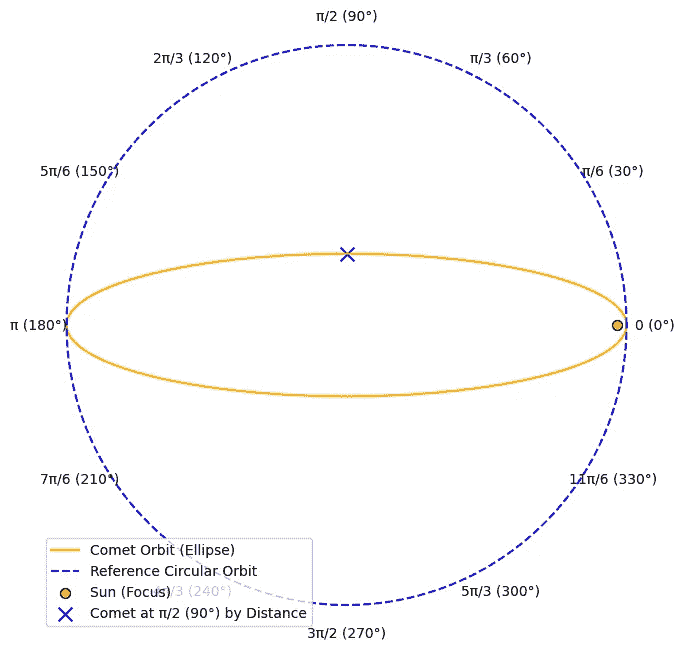

开普勒询问彗星达到π/2 弧度（90°）时的时间。你创建并运行了以下 Python 代码：

```py
import numpy as np

def kepler_equation(x):
    return x - c * np.sin(x)

c = 0.967
position_radians = np.pi / 2 # aka 90 degrees
time_radians = kepler_equation(position_radians)
orbital_period_earth_years = 76

t_earth_years = (time_radians / (2 * np.pi)) * orbital_period_earth_years
print(f"It takes approximately {t_earth_years:.2f} Earth years for the comet to move from 0 to π/2 radians.")
```

你向开普勒报告：

```py
It takes approximately 7.30 Earth years for the comet to move from 0 to π/2 radians.
```

> 顺便提一下，彗星在不到其轨道周期的 10%时间内完成了 25%的轨道距离，因为它在离太阳较近时加速。

善有善报，但好事多磨。开普勒对结果感到着迷，给你分配了一个新任务：“你能告诉我彗星在 20 个地球年后，它在轨道上的位置吗？我想知道它的弧度位置。”

“没问题，”你想，“我只需用一点高中代数。”

首先，你将 20 个地球年转换为弧度：

+   time_radians = (20 / 76) × 2π = (10 / 19)π

接下来，你重新排列开普勒方程，将其设为 0。

+   *x* − 0.967 sin(*x*) − (10 / 19)π = 0

现在你想找到使这个方程成立的*x*值。你决定通过画图来查看它在哪一点与零相交：

```py
import numpy as np
import matplotlib.pyplot as plt

c = 0.967
time_earth_years = 20
orbital_period_earth_years = 76
time_radians = (time_earth_years / orbital_period_earth_years) * 2 * np.pi

def function_to_plot(x):
    return x - c * np.sin(x) - time_radians

x_vals = np.linspace(0, 2 * np.pi, 1000)
function_values = function_to_plot(x_vals)
plt.figure(figsize=(10, 6))
plt.axhline(0, color='black', linestyle='--') # dashed horizontal line at y=0
plt.xlabel("Position (radians)")
plt.ylabel("Function Value")
plt.title("Graph of x - c sin(x) - y to Find the Root")
plt.grid(True)

plt.plot(x_vals, function_values)
plt.show()
```

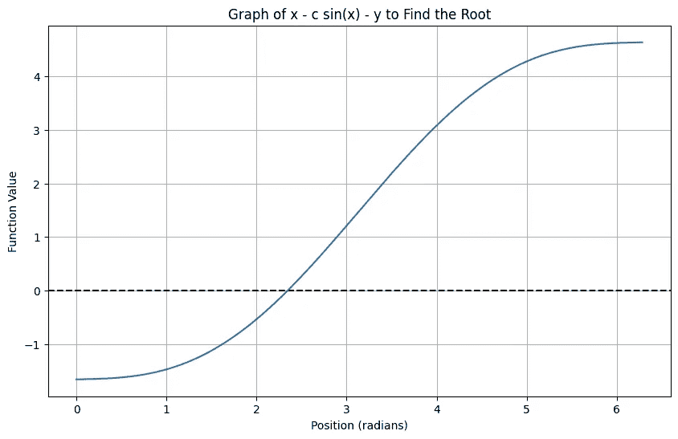

目前为止，一切顺利。图表显示了*x*的解是存在的。但当你尝试通过代数重新排列方程并解出*x*时，你却遇到了困难。如何在方程中有*x*和 sin(*x*)的组合时孤立出*x*呢？

“没关系，”你想，“我们有 Python，而 Python 有[SymPy 包](https://www.sympy.org/)，”它是一个强大且免费的计算机代数系统。

你向 SymPy 提出了问题：

```py
# Warning: This code will fail.
import sympy as sym
from sympy import pi, sin
from sympy.abc import x

c = 0.967
time_earth_years = 20
orbital_period_earth_years = 76

time_radians = (time_earth_years / orbital_period_earth_years) * 2 * pi
equation = x - c * sin(x) - time_radians

solution = sym.solve(equation, x)
#^^^^^^^^^^^^^error^^^^^^^^^^^^^^
print(solution)
```

不幸的是，它返回了一个错误：

```py
NotImplementedError: multiple generators [x, sin(x)]
No algorithms are implemented to solve equation x - 967*sin(x)/1000 - 10*pi/19
```

SymPy 在解方程方面非常强大，但并非所有方程都能用所谓的**封闭形式**解决——即通过有限的**初等函数**（如加法、乘法、根号、指数、对数和三角函数）来表示的解。当我们将*x*与像 sin(*x*)这样的三角函数项组合时，孤立出*x*就可能变得根本不可能。换句话说，这些类型的混合方程通常没有封闭形式的解。

没问题。从图表中我们知道解是存在的。SymPy 可以通过数值方法帮助我们接近这个解。我们使用 SymPy 的`nsolve()`：

```py
import sympy as sym
from sympy import pi, sin
from sympy.abc import x

c = 0.967
time_earth_years = 20
orbital_period_earth_years = 76
time_radians = (time_earth_years / orbital_period_earth_years) * 2 * pi
equation = x - c * sin(x) - time_radians

initial_guess = 1.0   # Initial guess for the numerical solver
position_radians = sym.nsolve(equation, x, initial_guess)
print(f"After {time_earth_years} Earth years, the comet will travel {position_radians:.4f} radians ({position_radians * 180 / pi:.2f}°) along its orbit.")
```

结果报告：

```py
After 20 Earth years, the comet will travel 2.3449 radians (134.35°) along its orbit.
```

我们可以将结果总结在一个表格中：

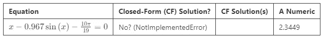

我们确定没有封闭式解吗？我们在“没有”的回答后加上一个问号。这提醒我们，SymPy 的失败并不意味着没有封闭式解。我们将最后一列标记为“**A** 数值解”，以提醒自己这只是一个数值解，可能还有更多解。

在本节中，我们探讨了开普勒方程，并发现了解其闭式解的挑战。Python 的 SymPy 包证实了我们的困难，最终，我们不得不依赖数值解法。

这给了我们一个没有明显闭式解的方程的例子。但这是典型的吗？是否有某些类型的方程，我们总是能找到——或者永远找不到——闭式解呢？让我们通过探讨另一种类型的方程：多项式，来深入挖掘。

# 多项式

[多项式](https://en.wikipedia.org/wiki/Polynomial)方程，如 *x*² − *x* − 1 = 0，是数学建模中可靠的工具——直观而强大。我们都在学校学过如何解二次多项式（含 *x*²，“二次方”）。

500 年前，在意大利的文艺复兴时期，解高次多项式成为一种公众娱乐形式。像塔塔利亚和卡尔达诺这样的数学家在[公开数学决斗](https://old.maa.org/press/maa-reviews/the-secret-formula-how-a-mathematical-duel-inflamed-renaissance-italy-and-uncovered-the-cubic)中争夺荣耀和声望。这些比赛导致了三次（立方）和四次（四次）多项式的解法的出现。但五次多项式呢？

让我们用 SymPy 来研究一些多项式的样例：

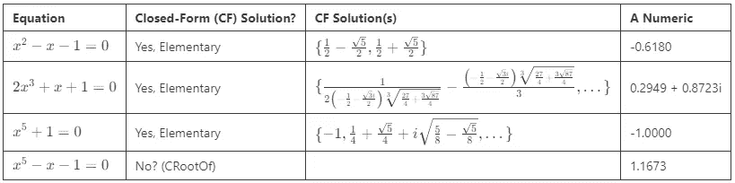

对于四次及以下的多项式，我们总是能找到闭式的初等解。具体来说，这些解只需要有限的基本算术运算和根式（如平方根或立方根）的表达式。

解的个数永远不会超过多项式的次数。然而，某些解可能涉及 *i*，即 −1 的平方根，代表复数。稍后会详细介绍这一点。

那么，对于五次及更高次的多项式呢？我们能否总是找到闭式解？答案是复杂的。有时我们可以。当存在闭式解时——例如上面 *x*⁵+1=0 —— SymPy 通常能够找到它。

然而，在其他情况下，例如 *x*⁵-*x*-1=0，SymPy 无法找到闭式的初等解。Évariste Galois 以证明高次多项式一般无法找到闭式解而闻名。然而，SymPy 在某个特定方程上的失败并不等于不存在闭式解。所以，对于这个例子，我们加上一个问号，并回答“不？”

为了进一步探讨，我们来看看 SymPy 在给定 *x*⁵-*x*-1=0 时到底做了什么：

```py
import sympy as sym
from sympy.abc import x

equation = x**5 - x - 1
solution = sym.solve(equation, x)
print(solution)
```

输出结果是：

```py
[CRootOf(x**5 - x - 1, 0), CRootOf(x**5 - x - 1, 1), CRootOf(x**5 - x - 1, 2), CRootOf(x**5 - x - 1, 3), CRootOf(x**5 - x - 1, 4)]
```

哎呀！SymPy 显然在作弊。它在说：“哦，你想要闭式解？没问题！我只需定义一个新的临时函数 `CRootOf(x**5 - x - 1, 0)`，然后就把它当作答案了。”

这算是作弊，因为它并没有回答我们真正关心的问题。SymPy 本质上是给一个未解决的问题起了个新名字，并声称已经解决。

当然，SymPy 以这种方式给出答案是有充分理由的。首先，我们现在可以轻松找到一个数值解：

```py
from sympy import N, CRootOf

print(N(CRootOf(x**5 - x - 1, 0)))
```

输出 `1.16730397826142`。

**即使没有实数解，仍然有解**：关于多项式方程的一件令人惊讶的事是，即使没有实数解，你仍然可以找到解——至少在数值上！

考虑这个简单的二次方程：

+   *x*² + 1 = 0

如果我们绘制这个方程，它永远不会与 *x* 轴相交，表明没有实数解。

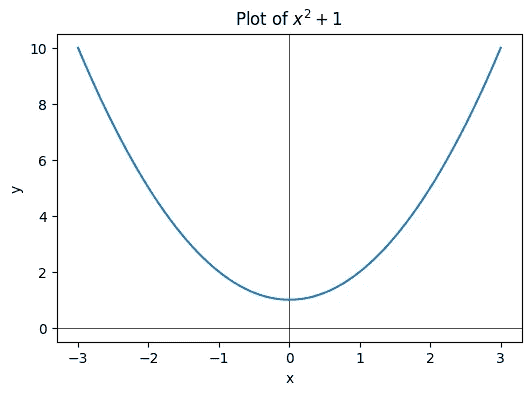

然而，使用 SymPy，我们可以为任何多项式找到数值解。例如：

```py
from sympy import solve, Eq, CRootOf, N, degree
from sympy.abc import x

equation = Eq(x**2 + 1, 0)
numerical_solution = [N(CRootOf(equation, d)) for d in range(degree(equation))]
print(numerical_solution)
```

这会打印出：`[-1.0*I, 1.0*I]`。

请注意，解中使用了 *i*（虚数单位），这意味着它们是复数。这是[代数基本定理](https://en.wikipedia.org/wiki/Fundamental_theorem_of_algebra)的一个例子，该定理表明每个（非常数）多项式方程都有至少一个复数解，即使没有实数解。

重点：除非复数在你的领域中有意义，否则你应该忽略复数解。

总结多项式：

+   **四次及以下的次数**：总是存在一个封闭形式的解，涉及基本的算术运算和根。

+   **五次及以上的次数**：通常，使用基本运算无法找到封闭形式的解，尽管 SymPy 偶尔能找到一个。

+   **解**：多项式总是有解——至少在数值上——但这些解可能不是实数（无论是数学上还是实际中）。除非复数在你的领域中有意义，否则通常应忽略这些解。

接下来，我们将在方程中加入指数和对数。在解中，我们发现了 Lambert *W* 函数。这是类似 CRootOf 的技巧吗？

# Exp, Log 和 x

当我们用数学模型来表示数据时，我们通常使用指数和对数。下面是我们尝试通过 SymPy 解方程来逆向这些模型时发生的情况：

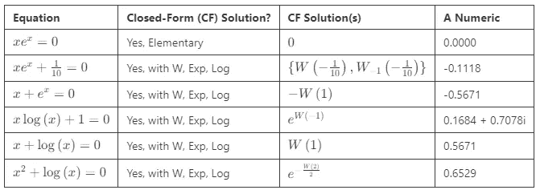

观察：

+   **有时你会运气好**：第一个方程 *x*e*ˣ*=0 有一个初等解 *x*=0。虽然并非总是如此，但即使是涉及指数或对数的方程，有时也能找到简单的封闭形式解。

+   **这个“家族”中的每个方程似乎都能求解，但有两个警告**：首先，我不能精确定义这个家族，也不确定是否可能有明确的定义。其次，求解这些方程需要 Lambert *W* 函数，例如 *W(1)* 和 *W₋₁(1/10)*。当 *x* 同时出现在指数（或对数）表达式的内外时，这个函数就会出现。

+   **如果你不接受 *W*，你无法以封闭形式解这些函数**：这个“家族”中的方程通常没有封闭的初等解，除非使用 Lambert *W* 函数。

+   **我们应该接受 *W***：Lambert *W* 函数是一个定义明确、易于计算的函数，在数学和科学中有广泛应用。相对于 *exp*、*log*、*sin* 和 *cos* 函数，它的晚期采用只是历史原因。

+   **单一的*W*可以产生多个解：** 类似于平方根函数可以产生两个解，*W*表达式也可以产生零个、一个或两个实数解。当存在两个实数解时，SymPy 会将它们分别列出，表示一个为*W*（主分支），另一个为*W₋₁*（次分支）。除了实数解之外，任何*W*表达式还会生成无限多个复数解。

+   **复数解将出现：** 一些方程，如*x* log(*x*)+1=0，只会得到复数解。与多项式一样，除非复数在您的领域中有意义，否则应忽略复数。

+   **五次及更高次的多项式与指数（或对数）的混合仍然无法求解：** 即使使用像 Lambert *W*函数这样的特殊函数，五次及更高次的多项式也不能通过初等函数求解封闭形式。

如果在同一个方程中同时使用指数和对数会怎样？通常，我们不会找到封闭形式的解——即使使用 Lambert *W*函数：

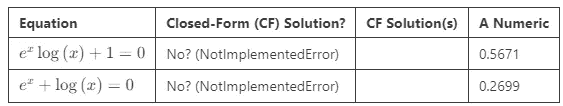

总结来说，将指数或对数与多项式结合通常会使方程无法通过传统的封闭形式方法求解。然而，如果我们允许使用 Lambert *W*函数，含有指数或对数（但不能同时含有两者）的方程是可以求解的。我们应当将*W*视为处理此类问题的有效工具。

接下来，让我们对开普勒问题进行推广，看看当我们将三角函数引入方程时会发生什么。

# 三角方程

**简单三角方程：** 这是我们第一批三角函数样本：

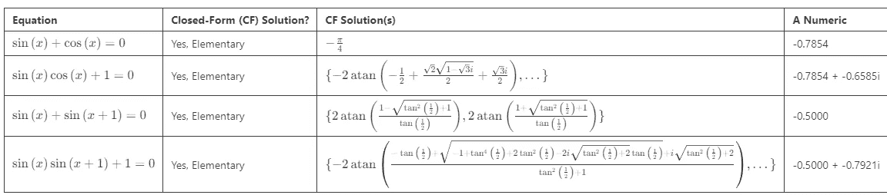

SymPy 成功地为每个方程找到了封闭形式的初等解。解中涉及三角函数，在某些情况下，复数也会出现。（同样，除非它们对于当前问题有意义，否则我们通常忽略复数解。）

请记住，正弦和余弦是周期性的，这导致了无限多个解。SymPy 提供的封闭形式解通常表示一个单一周期。

**同频率方程：** 在之前的方程中，我们将三角函数的输入限制为*x*+*b*，其中*b*是常数。如果我们允许类似*a*₁*x*+*b*₁和*a*₂*x*+*b*₂这样的输入，其中*a*₁是有理数，*a*₂也是有理数，会发生什么？这意味着两个周期函数可能具有不同的频率，但这些频率可以同步。（*a*代表频率。）我们称这些三角函数具有“同频率”。

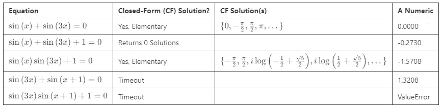

观察：

+   我们偶尔会得到一个封闭形式的初等解。

+   对于 sin(*x*) + sin(3*x*)+1=0，SymPy 返回零解。然而，图表和数值方法表明存在解。此外，当我将[sin(x) + sin(3x)+1=0 输入到 WolframAlpha](https://www.wolframalpha.com/input?i=sin%28x%29+%2B+sin%283x%29+%2B+1+%3D+0%2C+solve+for+x)，一个在线计算代数系统时，它产生混合解。（WolframAlpha 的解将基本函数与六次**CRootOf**表达式结合起来。正如我们在多项式部分讨论的那样，这种表达式通常缺乏封闭形式解。）

+   SymPy 有时会超时寻找封闭形式解，但数值方法仍然可以提供解决方案。

+   在其他情况下，它会超时，数值方法和图表都确认没有解决方案。之前，我们得到的是复数解，而不是没有数值解。[WolframAlpha 确实给出了[一个复数数值解](https://www.wolframalpha.com/input?i=sin%283x%29+*+sin%28x+%2B+1%29+%2B1+%3D+0%2C+solve+for+x)。]

让我们绘制返回零封闭形式解的方程。让我们也绘制返回数值错误的方程。

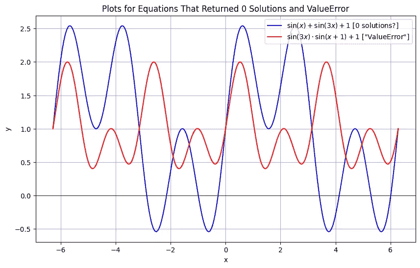

其他观察：

+   从蓝色绘图中，SymPy 的“无解”响应似乎是一个错误。图中显然有解，SymPy 应该要么找到它们，要么抛出异常。

+   另一方面，在红色绘图中，`ValueError`的数值结果是准确的。没有解决方案。

到目前为止，对于我们遇到的所有三角方程，当存在时，SymPy 似乎会找到实值封闭形式解。当不存在时，它会超时或产生不可预测的错误。

**非共振频率方程：** 在前述方程中，我们允许带有形式为*ax*+*b*的三角函数，其中*a*是有理常数。如果我们允许像*a*₁*x*+*b*₁和*a*₂*x*+*b*₂这样的输入，其中*a*₁是有理数而*a*₂是无理数会发生什么呢？这意味着两个周期函数永远不会同步。我们称它们具有“非共振频率”。

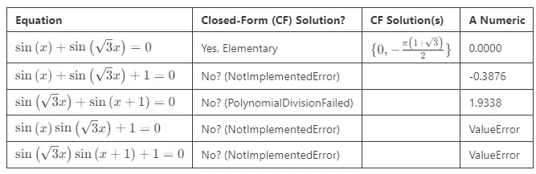

观察：

+   具有两个具有非共振频率的三角函数的方程通常在封闭形式中似乎是不可解的。当没有元素解可用时，SymPy 返回`NotImplementedError`。

+   我们仍然有可能偶然找到一个具有元素解的方程。在上述情况中，SymPy 返回`PolynomialDivisionFailed`，[WolframAlpha 找到了封闭形式解](https://www.wolframalpha.com/input?i=sin%28sqrt%283%29*x%29+%2B+sin%28x%2B1%29%3D+0%2C+solve+for+x)。

+   当方程没有解时，SymPy 会产生`ValueError`，我们可以通过图表确认（见下文）。在这些情况下，我们没有看到复数结果。

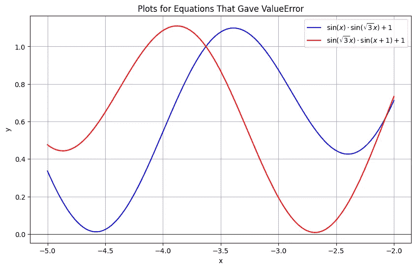

这些方程未能接近零，因此没有解。

我们关于三角方程的结论是，我们通常可以找到基础的封闭形式解。主要的例外似乎是当频率不成比例时——例如，在包含 sin(*x*)和 sin⁡(√3 *x*)的方程中。

我们将要探索的最后一个问题是，当我们将三角函数与指数和对数混合时，会发生什么。

# 三角函数与 x、Exp、Log

我们的最后一组样本只需要简短的讨论。如果我们将一组包含一个三角函数并与*x*、exp(*x*)或 log(*x*)相结合的方程通过 SymPy 进行求解会怎样？

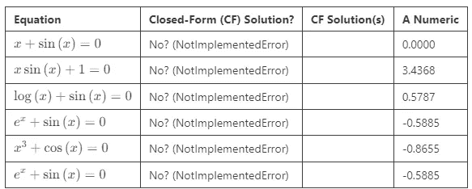

结果是一致的：SymPy 无法为这些组合产生封闭形式的解。然而，SymPy 应该为第一个方程产生*x*=0 的封闭形式解，正如[WolframAlpha 所做](https://www.wolframalpha.com/input?i=x%2Bsin%28x%29%3D0%2C+solve)的那样。

# 结论

所以，这就是结果——一个关于哪些方程往往缺乏封闭形式解的探索。如果你有兴趣实验本文中的示例，可以在我的[GitHub 代码库](https://github.com/CarlKCarlK/unsolvable)找到相关代码。

在我处理这些示例方程时，以下是让我感到惊讶的事情：

+   **开普勒方程非常简单。**我不知道可以如此优雅地建模一个我认为很复杂的几何形状——椭圆。

+   **Lambert 的*W*函数**证明在处理混合项如*x*和 exp⁡(*x*)的方程时是极其宝贵的。我们应该将其视为一个基础函数。

+   **SymPy**是一个出色的免费工具，它处理符号代数和三角方程的能力远超我们许多人手动解决的水平。尽管在某些情况下它可能不如 WolframAlpha，但它非常多功能且易于使用。

+   **将三角函数与其他项混合**常常会阻碍封闭形式解的产生，尤其是当频率不成比例时。

+   当封闭形式的解无法获得时，**绘图和数值方法**发挥了作用，提供了实际结果。

感谢你和我一起踏上这段旅程。我希望你现在更清楚地理解了在何时可以使用方程求解技巧来逆推模型，以及 SymPy 可以提供多少帮助。同时，当方程无法得到封闭形式解时，你现在也能理解为什么以及何时依赖数值方法。

如果你喜欢用 Python 和 SymPy 探索**数学**，你可能也会喜欢用它们来探索**牛顿物理学**。请查看这篇[Towards Data Science 文章](https://medium.com/towards-data-science/perfect-infinite-precision-game-physics-in-python-part-1-698211c08d95)以及相关的流行[PyData 会议演讲](https://www.youtube.com/watch?v=52n2qKgwW_Q)。

*对未来的文章感兴趣吗？请* [*在 Medium 上关注我*](https://medium.com/@carlmkadie)*。我写关于 Rust 和 Python、科学编程、机器学习和统计学的内容。我通常每个月写一篇文章。*
