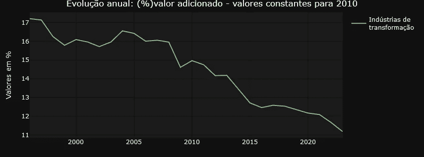

# 通过仪表盘探索巴西的国民账户

> 原文：[`towardsdatascience.com/exploring-brazils-national-accounts-through-a-dashboard-03d27900ce5d?source=collection_archive---------9-----------------------#2024-03-22`](https://towardsdatascience.com/exploring-brazils-national-accounts-through-a-dashboard-03d27900ce5d?source=collection_archive---------9-----------------------#2024-03-22)

## 实施细节和分析可能性

[](https://fernandobarbalho.medium.com/?source=post_page---byline--03d27900ce5d--------------------------------)[](https://towardsdatascience.com/?source=post_page---byline--03d27900ce5d--------------------------------) [Fernando Barbalho](https://fernandobarbalho.medium.com/?source=post_page---byline--03d27900ce5d--------------------------------)

·发布于[Towards Data Science](https://towardsdatascience.com/?source=post_page---byline--03d27900ce5d--------------------------------) ·阅读时间：10 分钟·2024 年 3 月 22 日

--


图片由[Dominik Lückmann](https://unsplash.com/@exdigy?utm_content=creditCopyText&utm_medium=referral&utm_source=unsplash)提供，来源于[Unsplash](https://unsplash.com/photos/blue-and-red-cargo-ship-on-dock-during-daytime-SInhLTQouEk?utm_content=creditCopyText&utm_medium=referral&utm_source=unsplash)

在 2024 年 3 月第一周末，新闻报道称，巴西 2023 年 GDP 同比增长了近 3%，达到了 2.17 万亿美元的总值。这一增长使巴西跃升至全球十大经济体之列，超越了加拿大。分析特别指出，这一增长的很大一部分归因于农业部门，农业增长达到了 15.1%的显著增幅。这一情形不仅吸引了投资者的兴趣，还引起了研究人员、专家和政府分析人员的关注，他们希望了解的不仅是农业部门的表现，还有工业生产、服务业、出口和进口等构成国民账户体系（NAS）的其他重要元素。

NAS 由巴西地理与统计研究所（IBGE）管理，是有关国家收入生成、分配和使用的重要信息来源。尽管该研究所提供了一个在线平台供访问 NAS 数据，包括过滤器和基本图表，但由于缺乏现代数据可视化资源，许多用户在导航和分析时面临困难。虽然提供的图表有助于快速理解趋势，但往往缺乏能够用于详细报告或文章的质量，而且覆盖的信息范围对于某些需求来说可能过于庞大。

鉴于这些限制，专门开发一个针对国家账户的仪表板的提议应运而生，旨在满足那些对 SCN 结构不太熟悉的用户需求。这里提出的仪表板允许简化查询和分析，展示针对自 1996 年以来各季度和各年度 GDP 及其组成部分演变的选定问题的图表。如果你在工作或研究中意识到国家账户数据的重要性，并希望探索如何使用 R 语言构建仪表板，了解实现此解决方案所涉及的主要技术和业务挑战，我邀请你享受以下几段内容，使用这个[链接](https://fabdev.shinyapps.io/painel_contas_nacionais/)尝试仪表板，并探索提供的代码。

**数据来源**

驱动我们仪表板的数据直接来自 IBGE 提供的 API，通过 R 包{sidrar}进行消费。这个 API 提供了与国家账户相关的各种表格数据，并且每季度更新一次。对于我们的分析，我们重点关注其中的两张表：“现行价格”（表格 1846）和“季度体积指数变化率”（表格 5932）。这些数据集为理解国家账户的绝对值以及它们随时间的增长趋势和变化提供了坚实的基础。需要注意的是，通过使用 API，仪表板确保展示的数据始终是最新的。

对于那些对 R 编程语言感兴趣的人，通过分析负责从 API 获取数据的代码，提供了进一步探索的机会。像往常一样，在我的文章中，我分享了相关的代码片段，以丰富你的理解。然而，如果编程不是你的重点，你可以跳过代码块，而不影响你对文章内容的理解。

```py
cnt_vt_precos_correntes<- 
  get_sidra(x = 1846,
            period = lista_trimestres)

cnt_vt_precos_correntes <- janitor::clean_names(cnt_vt_precos_correntes)

cnt_taxa_variacao<-
    get_sidra(x = 5932,
            period = lista_trimestres
            )

cnt_taxa_variacao<- janitor::clean_names(cnt_taxa_variacao)
```

`get_sidra`函数从国家账户系统（SNA）中提取数据。要使用它，程序员只需指定表格的名称（第一次调用使用 1846，第二次使用 5932）和所需的时间段，时间段以 1996 年到最后可用季度的季度向量表示。请参见以下示例。

```py
 lista_trimestres
  [1] "199601" "199602" "199603" "199604" "199701" "199702" "199703" "199704" "199801" "199802" "199803" "199804" "199901"
 [14] "199902" "199903" "199904" "200001" "200002" "200003" "200004" "200101" "200102" "200103" "200104" "200201" "200202"
 [27] "200203" "200204" "200301" "200302" "200303" "200304" "200401" "200402" "200403" "200404" "200501" "200502" "200503"
 [40] "200504" "200601" "200602" "200603" "200604" "200701" "200702" "200703" "200704" "200801" "200802" "200803" "200804"
 [53] "200901" "200902" "200903" "200904" "201001" "201002" "201003" "201004" "201101" "201102" "201103" "201104" "201201"
 [66] "201202" "201203" "201204" "201301" "201302" "201303" "201304" "201401" "201402" "201403" "201404" "201501" "201502"
 [79] "201503" "201504" "201601" "201602" "201603" "201604" "201701" "201702" "201703" "201704" "201801" "201802" "201803"
 [92] "201804" "201901" "201902" "201903" "201904" "202001" "202002" "202003" "202004" "202101" "202102" "202103" "202104"
[105] "202201" "202202" "202203" "202204" "202301" "202302" "202303" "202304" "202401" "202402" "202403" "202404"
```

**技术设计**

R 开发者通常使用 Shiny 来创建交互式仪表盘。这是一个成熟的产品，提供广泛的定制可能性，利用了先进的用户体验（UX）特性。然而，对于那些寻求更高初期生产力的开发者来说，结合使用 Flexdashboard 和 Shiny 是一个可行的替代方案。尽管这种方法可能导致界面较为简单、定制性较低，但它提供了快速实施的选择。为了增强使用 Flexdashboard 开发的应用程序的视觉效果和专业外观，可以选择加入{thematic}库。我们在我们的仪表盘中选择了这种方法，确保为用户提供精致且吸引人的外观。

以下是使用 flexdashboard + shiny + thematic 组合显示产品布局的截图。


具有专业布局的仪表盘。作者提供的图像。

以下是一个代码片段，你可以看到使用户与应用程序组件交互的库组合。

```py
library(flexdashboard)
library(plotly)
library(shiny)
library(purrr)

# Install thematic and un-comment for themed static plots (i.e., ggplot2)
 thematic::thematic_rmd(bg= "#101010", fg="#ffda00", accent = NA )
```

上面显示的选择 Plotly 的原因在于应用程序调用的库列表中。这一决定源于其独特的特点，特别是在用户交互方面。Plotly 提供了流畅的数据可视化体验，其突出特点是允许用户通过移动鼠标探索图表数据。此外，该库还提供了将图形下载为 PNG 格式的便利功能，并且能够标记图表的特定部分进行缩放，进一步增强了应用程序用户的交互体验。


Plotly 及其交互特性。作者提供的图像。

我们应当强调：

+   对于所有图表，都可以选择多个时间序列进行同时可视化。


同时显示的两个时间序列。作者提供的图像。

+   为了使图表对于通过打印文本消费图表的观众更易于理解，可以高亮可能对进一步分析有意义的点。在下面的例子中，我们看到 2020 年疫情的影响，导致 GDP 数值回落至 2016 年的水平。


高亮重要点。作者提供的图像。

+   每个图表的数据可以通过下载按钮轻松下载到用户的环境中。


下载按钮。作者提供的图像。

以下是一些代码，涉及我们在本主题中讨论的内容。

+   使用 input$account_year 和 input$year 对象选择多个时间序列和周期以进行高亮显示。

```py
 # Preparação dos dados
  dados_grafico_corrente_ano <<- cnt_vt_precos_correntes %>%
    filter(setores_e_subsetores %in% input$conta_ano) %>%
    inner_join(dados_pib) %>%
    mutate(data_nominal = gera_meses_trimestre(trimestre_codigo), # Essa função precisa ser definida ou alterada conforme o contexto
           setores_e_subsetores = str_wrap(setores_e_subsetores,20))  %>%
    group_by(ano = format(data_nominal, "%Y"),
             setores_e_subsetores) %>%
    summarize(data_nominal = min(data_nominal),
              valor = sum(valor),
              valor_pib = sum(valor_pib)) %>%
    ungroup() %>%
    mutate(valor_perc = ((valor/valor_pib))*100)

  sel_data <- dados_grafico_corrente_ano %>%
    filter(year(data_nominal) %in% input$ano)
```

+   下载数据。注意 write.table 函数，它将上面代码块中生成的全局对象*dados_grafico_corrente_ano*的内容写入文件。

```py
# Create placeholder for the downloadButton
uiOutput("downloadUI_conta_perc_ano")
# Create the actual downloadButton
output$downloadUI_conta_perc_ano <- renderUI( {
  downloadButton("download_conta_perc_ano","Download", style = "width:100%;")
})
output$download_conta_perc_ano<- downloadHandler(
  filename = function() {
    paste('dados_grafico_perc_ano',  '.csv', sep='')
  },
  content = function(file) {
    #dados_conta_trimestre_corrente <- graph_mapa_regic$data
    write.table(dados_grafico_corrente_ano, file, sep = ";",row.names = FALSE,fileEncoding = "UTF-8",dec=",")
  }
)
```

**商业设计**

该应用程序提供了七种不同类型的图表，允许用户选择最适合分析和解释与其决策相关的信息的表示方式。这种多样性允许灵活的方法，适应不同的需求和可视化偏好。

为了更方便地导航和组织图表，应用程序将它们分为两个明确定义的选项卡。“年度数据”选项卡侧重于提供一个关于时间演变的全景视图，图表展示了账户的年度变化。在这里，用户可以分析 2010 年恒定值下账户的年度演变，当前值下的附加值占比的年度演变，以及 2010 年恒定值下附加值占比的年度演变。


常量值下的年度增长图。作者图像。


当前值下的附加值份额图。作者图像。


常量值下的附加值份额图。作者图像。

另一方面，“变动”选项卡则侧重于提供不同时间段之间相对变化的见解。用户可以详细查看与上一年同季度的季度变化、按季度的季度变化、年度累计率以及四个季度的累计变化。这种详细的时间变化方法允许对数据中的趋势和模式进行更细致的分析。


同期季度变化。作者图像。


季度变化按季度。作者图像。


年度累计率。作者图像。


四个季度的累计变化。作者图像。

**转变经济数据**

一般来说，**“变动”**选项卡上的图表是对使用 API 进行初始查询结果的过滤。变量来自季度体积指数变化率表，并且结果数据集在可视化结构中使用。对于喜欢 R 语言的人来说，它有点像下面的样子……

```py
 dados_grafico_taxa_acum_ano<<-
    cnt_taxa_variacao %>%
    filter(setores_e_subsetores %in% input$conta_var,
           variavel_codigo == "6562") %>%
    mutate(data_nominal = gera_meses_trimestre(trimestre_codigo),
           setores_e_subsetores = str_wrap(setores_e_subsetores,20))
```

请注意，变量 6562 的选择，其中包含四个季度的累计变化数据。*dados_grafico_taxa_acum_ano*对象在 plot_ly 函数中作为图表的参考数据使用。

在“年度数据”标签中显示的图表在显示之前会经历多次转换。特别需要注意的是对 2010 年常量值的计算，这在三个年度数据可视化中的两个中都有使用。这个过程要求更新 2010 年的时间序列数据，以便实际变动反映在所选账户的前后年份。这一要求导致需要开发复杂的函数来计算 2010 年之前的数值，采用与参考年份后使用的逻辑相反的方式，从而确保常量值的一致性。为了更深入了解所采用的程序，建议分析下面展示的代码。

```py
calcula_serie_constante<- function(tabela_taxa, tabela_precos, trimestres_filtro, conta, ano_referencia){

  # Preparação dos dados
  dados_grafico_acumulado_lab <- tabela_taxa %>%
    filter(setores_e_subsetores %in% conta, variavel_codigo == "6563", trimestre_codigo %in% trimestres_filtro) %>%
    mutate(data_nominal = gera_meses_trimestre(trimestre_codigo), setores_e_subsetores = str_wrap(setores_e_subsetores, 20), ano = year(data_nominal)) %>%
    select(ano, setores_e_subsetores, valor) %>%
    rename(variacao = valor)

  tabela_base <- tabela_precos %>%
    filter(setores_e_subsetores %in% conta) %>%
    mutate(data_nominal = gera_meses_trimestre(trimestre_codigo), setores_e_subsetores = str_wrap(setores_e_subsetores, 20), ano = as.numeric(format(data_nominal, "%Y"))) %>%
    summarise(valor = sum(valor), .by = c(setores_e_subsetores, ano)) %>%
    ungroup() %>%
    inner_join(dados_grafico_acumulado_lab, by = c("ano", "setores_e_subsetores"))

  dados_grafico_constante_ano <- unique(tabela_base$setores_e_subsetores) %>%
    map_dfr(function(setor) {
      tabela_anterior <- calcular_valor_referencia(tabela_base, setor, ano_referencia, "anterior")
      tabela_posterior <- calcular_valor_referencia(tabela_base, setor, ano_referencia, "posterior")

      bind_rows(tabela_anterior, tabela_posterior[-1, ]) %>%
        arrange(ano) %>%
        mutate(valor_constante = valor_referencia/10³)})

}

# Função para otimizar a criação de tabelas e cálculo de valor_referencia
calcular_valor_referencia <- function(tabela_base, setor, ano_referencia, direcao) {

  if (direcao=="anterior"){
    tabela_filtrada <- 
      tabela_base %>%
      filter(setores_e_subsetores == setor, 
             ano <= ano_referencia) %>%
      arrange(desc(ano))

  } else{
    tabela_filtrada <- 
      tabela_base %>%
      filter(setores_e_subsetores == setor, 
             ano >= ano_referencia) %>%
      arrange(ano)

  }

  if(nrow(tabela_filtrada) > 1) {

    tabela_filtrada$valor_referencia <- NA
    tabela_filtrada$valor_referencia[1] <- tabela_filtrada$valor[1]

    ajuste <- if_else(direcao == "anterior", -1, 1)

    for(i in 2:nrow(tabela_filtrada)){

      if (ajuste==-1){

        tabela_filtrada$valor_referencia[i] <- tabela_filtrada$valor_referencia[i-1] * (1 + ajuste * (tabela_filtrada$variacao[i-1]/100))

      } else{

        tabela_filtrada$valor_referencia[i] <- tabela_filtrada$valor_referencia[i-1] * (1 + ajuste * (tabela_filtrada$variacao[i]/100))
      }

    }
  }

  return(tabela_filtrada)
} 
```

上述脚本包含两个功能，它们共同操作现行价格和变动表格，以生成 2010 年参考年份前后的常量值。

**一些使用案例。**

文章最后列出三个与仪表板相关的使用案例。这些灵感直接来自推特。

LCA 咨询公司发布的推文讨论了农业和采掘工业在 GDP 扩张中的参与情况。在仪表板中，我们可以轻松地识别这些元素在 GDP 中的体量演变，并查看它们的年度变化。


农业和采掘工业的体量演变。作者的图像。


农业和采掘工业的年累计增长率

这是另一条推文，这次来自部长埃丝特·德维克。

农业商业的 GDP 在之前的推文中已有探讨。这里的新内容是重点讨论家庭消费。这是仪表板中跟踪的另一个账户。见下文。


家庭消费增长。作者的图像。


家庭消费和 GDP 的年累计增长率。作者的图像

最后，值得强调的是下面这条来自里卡多·贝泽拉的推文。

里卡多·贝泽拉展示了监控制造业在 GDP（或增值）中所占份额的重要性。他强调了使用基于现行价格与常量价格的比率时所产生的显著差异。该仪表板准确且忠实地呈现了里卡多绘制的两条曲线，提供了这些变化的详细且清晰的表现。


转型工业在现行价格中的参与。作者的图像。



转型工业在常量值中的参与。作者的图像。

你有自己的使用案例吗？为什么不尝试通过这个[链接](https://fabdev.shinyapps.io/painel_contas_nacionais/)来浏览仪表板，然后告诉我你的体验呢？

**代码与数据**

完整代码可以在[gist](https://gist.github.com/fernandobarbalho/be92c2fc3744a7a9dc9ee16bc001253b)中找到。

本文中使用的数据集被视为公有领域数据，因为这些数据是由联邦政府机构生产的，作为主动透明度在互联网上公开，并且受到巴西信息公开法（FOIA）的管辖。

[IBGE](https://sidra.ibge.gov.br/home/cnt/brasil)：国家账户系统
