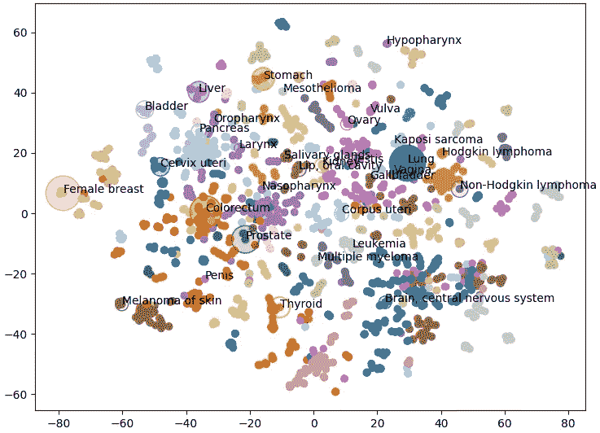
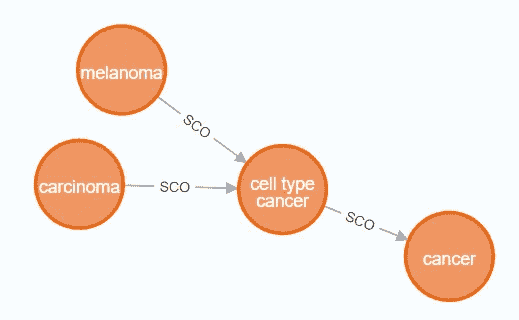
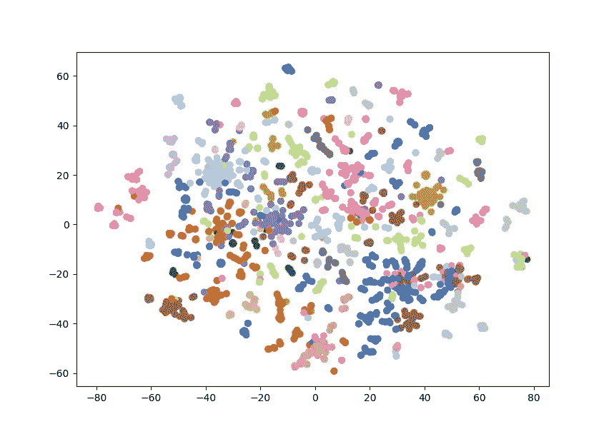
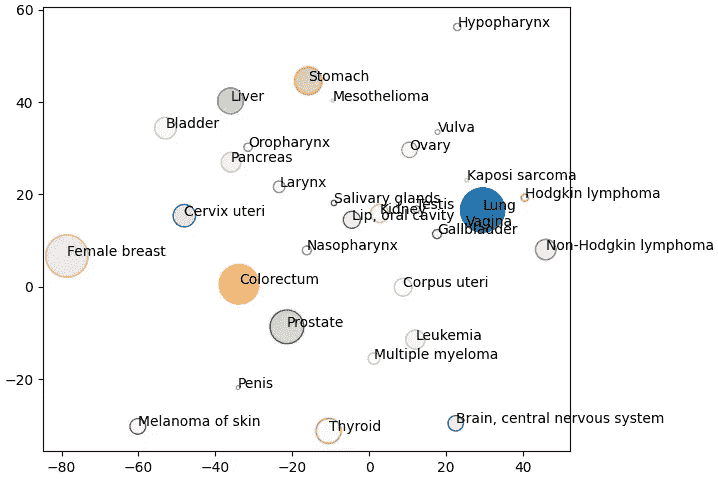

# 探索癌症类型与 neo4j

> 原文：[`towardsdatascience.com/exploring-cancer-types-with-neo4j-43acf161362f?source=collection_archive---------0-----------------------#2024-08-17`](https://towardsdatascience.com/exploring-cancer-types-with-neo4j-43acf161362f?source=collection_archive---------0-----------------------#2024-08-17)

## 如何在知识图谱中识别和可视化聚类

[](https://medium.com/@david.arthur.wells?source=post_page---byline--43acf161362f--------------------------------)[](https://towardsdatascience.com/?source=post_page---byline--43acf161362f--------------------------------) [David Wells](https://medium.com/@david.arthur.wells?source=post_page---byline--43acf161362f--------------------------------)

·发表于[Towards Data Science](https://towardsdatascience.com/?source=post_page---byline--43acf161362f--------------------------------) ·阅读时间：7 分钟·2024 年 8 月 17 日

--

在这篇文章中，我们将通过分析[疾病本体](https://disease-ontology.org/)作为知识图谱，识别和可视化不同的癌症类型聚类。具体来说，我们将在 Docker 容器中设置 neo4j，导入本体，生成图聚类和嵌入，然后使用降维技术绘制这些聚类并提取一些见解。尽管我们以 `disease_ontology` 为例，但相同的步骤也可以用来探索任何本体或图数据库。



癌症类型视为嵌入并按聚类上色，图像由作者提供

# 本体构建

在图数据库中，数据不是以行（如电子表格或关系型数据库）存储，而是以节点及节点之间的关系存储。例如，在下面的图中，我们看到黑色素瘤和癌瘤是细胞类型癌肿的子类别（通过 SCO 关系表示）。通过这种数据，我们可以清晰地看到黑色素瘤和癌瘤是相关的，尽管数据中并没有明确指出这一点。



图数据库示例，图像由作者提供

本体是一个正式化的概念集合及其之间的关系。与自由文本相比，本体更容易被计算机解析，因此也更容易从中提取意义。本体在生物学科中广泛应用，你可以在[`obofoundry.org/`](https://obofoundry.org/)找到你感兴趣的本体。在这里，我们专注于疾病本体，展示了不同类型的疾病是如何相互关联的。

Neo4j 是一个用于管理、查询和分析图形数据库的工具。为了更方便地设置，我们将使用 Docker 容器。

```py
docker run \
 -it - rm \
 - publish=7474:7474 - publish=7687:7687 \
 - env NEO4J_AUTH=neo4j/123456789 \
 - env NEO4J_PLUGINS='["graph-data-science","apoc","n10s"]' \
 neo4j:5.17.0
```

在上述命令中，`-publish`标志设置了端口，以便让 Python 直接查询数据库，并通过浏览器访问它。`NEO4J_PLUGINS`参数指定了要安装的插件。不幸的是，Windows 的 Docker 镜像似乎无法处理安装，因此为了跟随教程，你需要手动安装 neo4j 桌面版。别担心，其他步骤应该仍然适用。

当 neo4j 正在运行时，你可以通过在浏览器中访问 http://localhost:7474/来访问数据库，或者你也可以使用 Python 驱动程序按照下面的方式连接。请注意，我们使用的是上面 docker 命令发布的端口，并且我们使用的用户名和密码也是我们之前定义的。

```py
URI = "bolt://localhost:7687"
AUTH = ("neo4j", "123456789")
driver = GraphDatabase.driver(URI, auth=AUTH)
driver.verify_connectivity()
```

一旦你设置好了 neo4j 数据库，就可以开始获取数据了。neo4j 插件 n10s 专为导入和处理本体论而构建；你可以使用它将数据嵌入到现有本体论中，或者探索本体论本身。通过下面的 cypher 命令，我们首先设置一些配置，以使结果更加清晰，然后我们设置唯一性约束，最后我们实际导入疾病本体论。

```py
CALL n10s.graphconfig.init({ handleVocabUris: "IGNORE" });
CREATE CONSTRAINT n10s_unique_uri FOR (r:Resource) REQUIRE r.uri IS UNIQUE;
CALL n10s.onto.import.fetch(http://purl.obolibrary.org/obo/doid.owl, RDF/XML);
```

要查看如何使用 Python 驱动程序完成此操作，请查看完整代码[`github.com/DAWells/do_onto/blob/main/import_ontology.py`](https://github.com/DAWells/do_onto/blob/main/import_ontology.py)

现在我们已经导入了本体论，你可以通过在网页浏览器中打开 http://localhost:7474/来探索它。这让你可以手动浏览一些本体论内容，但我们更关心的是全局视角，所以让我们做一些分析。具体来说，我们将进行 Louvain 聚类并生成快速随机投影嵌入。

# 聚类和嵌入

Louvain 聚类是一种适用于此类网络的聚类算法。简而言之，它识别出节点集合，其中的节点之间联系比与更广泛的节点集合的联系要更强；这些节点集合被定义为一个簇。当应用于本体论时，这是一个快速识别相关概念集的方法。另一方面，快速随机投影为每个节点生成一个嵌入，即一个数字向量，其中相似的节点具有更相似的向量。使用这些工具，我们可以识别哪些疾病是相似的，并量化这种相似性。

为了生成嵌入和簇，我们必须“投影”我们感兴趣的图谱部分。因为本体通常非常庞大，所以这种子集化是一种加速计算并避免内存错误的简单方法。在这个示例中，我们只对癌症感兴趣，而不关心其他类型的疾病。我们通过下面的 cypher 查询来实现这一点；我们匹配标签为“cancer”的节点，以及通过一个或多个 SCO 或 SCO_RESTRICTION 关系与其相关的任何节点。因为我们想包含癌症类型之间的关系，所以我们有一个第二个 MATCH 查询，它返回连接的癌症节点及其关系。

```py
MATCH (cancer:Class {label:"cancer"})<-[:SCO|SCO_RESTRICTION *1..]-(n:Class)
WITH n
MATCH (n)-[:SCO|SCO_RESTRICTION]->(m:Class)
WITH gds.graph.project(
    "proj", n, m, {}, {undirectedRelationshipTypes: ['*']}
) AS g
RETURN g.graphName AS graph, g.nodeCount AS nodes, g.relationshipCount AS rels
```

一旦我们得到了投影（我们称之为“proj”），我们就可以计算簇和嵌入，并将它们写回原始图谱。最后，通过查询图谱，我们可以获取每种癌症类型的新嵌入和簇，并将它们导出到 CSV 文件。

```py
CALL gds.fastRP.write(
  'proj',
  {embeddingDimension: 128, randomSeed: 42, writeProperty: 'embedding'}
) YIELD nodePropertiesWritten

CALL gds.louvain.write(
  "proj",
  {writeProperty: "louvain"}
) YIELD communityCount

MATCH (cancer:Class {label:"cancer"})<-[:SCO|SCO_RESTRICTION *0..]-(n)
RETURN DISTINCT
  n.label as label,
  n.embedding as embedding,
  n.louvain as louvain
```

# 结果

让我们看看这些簇，看看哪些类型的癌症被归为一组。将导出的数据加载到 Python 中的 pandas 数据框后，我们可以检查单独的簇。

簇 2168 是一组胰腺癌。

```py
nodes[nodes.louvain == 2168]["label"].tolist()
#array(['"islet cell tumor"',
#       '"non-functioning pancreatic endocrine tumor"',
#       '"pancreatic ACTH hormone producing tumor"',
#       '"pancreatic somatostatinoma"',
#       '"pancreatic vasoactive intestinal peptide producing tumor"',
#       '"pancreatic gastrinoma"', '"pancreatic delta cell neoplasm"',
#       '"pancreatic endocrine carcinoma"',
#       '"pancreatic non-functioning delta cell tumor"'], dtype=object)
```

簇 174 是一个较大的癌症群体，但大多是癌瘤。

```py
nodes[nodes.louvain == 174]["label"]
#array(['"head and neck cancer"', '"glottis carcinoma"',
#       '"head and neck carcinoma"', '"squamous cell carcinoma"',
#...
#       '"pancreatic squamous cell carcinoma"',
#       '"pancreatic adenosquamous carcinoma"',
#...
#       '"mixed epithelial/mesenchymal metaplastic breast carcinoma"',
#       '"breast mucoepidermoid carcinoma"'], dtype=object)p
```

这些是合理的分组，基于器官或癌症类型，将对可视化非常有用。另一方面，嵌入仍然是过于高维，无法进行有意义的可视化。幸运的是，TSNE 是一种非常有用的降维方法。在这里，我们使用 TSNE 将嵌入从 128 维降到 2 维，同时仍保持紧密相关的节点彼此靠近。我们可以通过绘制这两个维度的散点图，并按 Louvain 簇着色来验证这是否有效。如果这两种方法一致，我们应该会看到节点按颜色聚集。

```py
from sklearn.manifold import TSNE

nodes = pd.read_csv("export.csv")
nodes['louvain'] = pd.Categorical(nodes.louvain)

embedding = nodes.embedding.apply(lambda x: ast.literal_eval(x))
embedding = embedding.tolist()
embedding = pd.DataFrame(embedding)

tsne = TSNE()
X = tsne.fit_transform(embedding)

fig, axes = plt.subplots()
axes.scatter(
    X[:,0],
    X[:,1],
    c  = cm.tab20(Normalize()(nodes['louvain'].cat.codes))
)
plt.show()
```



TSNE 癌症嵌入的投影，按簇着色，图像来源：作者

这正是我们所看到的，类似类型的癌症被归为一组，并以单一颜色的簇状形式呈现。请注意，某些相同颜色的节点相距较远，这是因为我们需要重新使用一些颜色，因为有 29 个簇而只有 20 种颜色。这为我们提供了知识图谱结构的良好概览，但我们也可以添加自己的数据。

以下我们绘制了癌症类型的频率作为节点大小，死亡率作为透明度（[Bray et al 2024](https://doi.org/10.3322/caac.21834)）。我仅能访问到一些癌症类型的数据，因此只绘制了这些节点。下面我们可以看到，肝癌的总体发病率并不特别高。然而，在其簇（以紫色显示）内，肝癌的发病率明显高于其他癌症，如口咽癌、喉癌和鼻咽癌。



按簇着色的癌症频率和死亡率，图像来源：作者

# 结论

在这里，我们使用疾病本体论将不同类型的癌症分组为若干簇，这为我们提供了比较这些疾病的背景。希望这个小项目能展示如何直观地探索本体论，并将这些信息添加到你自己的数据中。

你可以查看这个项目的完整代码，链接地址是[`github.com/DAWells/do_onto`](https://github.com/DAWells/do_onto)。

# 参考文献

> Bray, F., Laversanne, M., Sung, H., Ferlay, J., Siegel, R. L., Soerjomataram, I., & Jemal, A. (2024). 《2022 年全球癌症统计：GLOBOCAN 对 185 个国家 36 种癌症的发病率和死亡率估算》。CA: 临床癌症杂志，74(3)，229–263。
