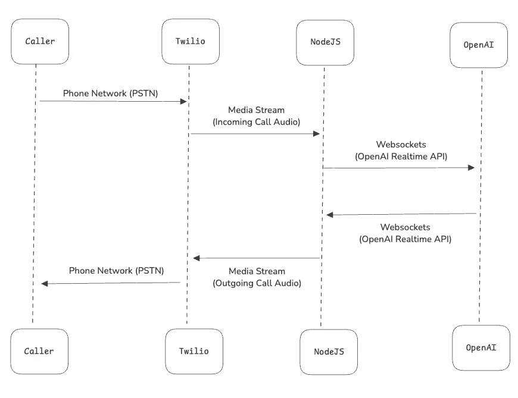

# 探讨新的 OpenAI 实时 API 如何简化语音代理流程

> 原文：[`towardsdatascience.com/exploring-how-the-new-openai-realtime-api-simplifies-voice-agent-flows-7b136ef8483d?source=collection_archive---------7-----------------------#2024-10-03`](https://towardsdatascience.com/exploring-how-the-new-openai-realtime-api-simplifies-voice-agent-flows-7b136ef8483d?source=collection_archive---------7-----------------------#2024-10-03)

## 使用 Twilio 和 OpenAI 实时 API 设置语音代理

[](https://medium.com/@ssmaameri?source=post_page---byline--7b136ef8483d--------------------------------)[](https://towardsdatascience.com/?source=post_page---byline--7b136ef8483d--------------------------------) [Sami Maameri](https://medium.com/@ssmaameri?source=post_page---byline--7b136ef8483d--------------------------------)

·发表于 [Towards Data Science](https://towardsdatascience.com/?source=post_page---byline--7b136ef8483d--------------------------------) ·8 分钟阅读·2024 年 10 月 3 日

--

# 介绍

在 2024 年 10 月 1 日的 OpenAI 开发者日活动上，OpenAI 最大的发布是他们的实时 API 的揭晓：

> “今天，我们发布了实时 API 的公共 Beta 版本，使所有付费开发者能够在他们的应用中构建低延迟、多模态体验。
> 
> 类似于 ChatGPT 的高级语音模式，实时 API 支持使用 [六种预设语音](https://platform.openai.com/docs/guides/text-to-speech)进行自然的语音对语音对话，这些语音已经在 API 中得到支持。”
> 
> （来源：OpenAI 网站）

根据他们的信息，它的主要优势包括低延迟和语音对语音功能。让我们看看在实践中，构建语音 AI 代理时它如何发挥作用。

它还具备中断处理功能，能够检测到你试图插话时停止发送音频，这对于构建语音代理来说无疑是一个非常有用的功能。

# 目录

在本文中，我们将：

+   比较在实时 API 出现之前和现在电话语音代理流程的不同，

+   审查 Twilio 提供的 GitHub 项目，该项目使用新的实时 API 设置语音代理，帮助我们了解实际实现的样子，并了解 websockets 和连接如何为此类应用程序进行设置，

+   快速回顾 OpenAI 使用实时 API 的 React 演示项目，

+   比较这些不同选项的定价。

# 语音代理流程

## 在 OpenAI 实时 API 之前

要使电话语音代理服务正常工作，我们需要一些关键的服务

+   语音转文本（例如 Deepgram），

+   LLM/代理（例如 OpenAI），

+   文本转语音（例如 ElevenLabs）。

这些服务在下面的图示中进行了说明


（来源 [`github.com/twilio-labs/call-gpt`](https://github.com/twilio-labs/call-gpt)，MIT 许可）

这当然意味着与多个服务的集成，并为每个部分发送独立的 API 请求。

新的 OpenAI Realtime API 允许我们将所有这些请求捆绑成一个单一的请求，因此称之为语音到语音。

## 在 OpenAI Realtime API 之后

这是使用新的 OpenAI Realtime API 时，类似的新流程的流程图。



显然，这是一个更简单的流程。发生的情况是，我们将电话中的语音/音频直接传送到 OpenAI Realtime API。不需要语音转文本的中介服务。

在响应端，Realtime API 再次提供一个音频流作为响应，我们可以将其直接发送回 Twilio（即发送给电话响应）。因此，再次无需额外的文本转语音服务，因为这一切都由 OpenAI Realtime API 处理。

# Twilio 和 Realtime API 语音代理的源代码审查

让我们看一些代码示例。Twilio 提供了一个很好的 GitHub 仓库示例，用于设置 Twilio 和 OpenAI Realtime API 流程。你可以在这里找到它：

[](https://github.com/twilio-samples/speech-assistant-openai-realtime-api-node?source=post_page-----7b136ef8483d--------------------------------) [## GitHub - twilio-samples/speech-assistant-openai-realtime-api-node

### 通过在 GitHub 上创建一个账户，参与 twilio-samples/speech-assistant-openai-realtime-api-node 开发。

github.com](https://github.com/twilio-samples/speech-assistant-openai-realtime-api-node?source=post_page-----7b136ef8483d--------------------------------)

下面是与设置相关的代码关键部分的摘录

+   从 Twilio 到我们应用程序的 websockets 连接，这样我们就可以接收来电者的音频，并将音频发送回去，

+   以及我们应用程序与 OpenAI Realtime API 之间的 websockets 连接。

我在下面的源代码中添加了一些注释，以尝试解释发生了什么，特别是关于 Twilio 与我们应用程序之间的 websocket 连接，以及我们应用程序与 OpenAI 之间的 websocket 连接。省略号 (…) 表示已删除的源代码部分，目的是为了简化展示，因为这些部分对于理解流程的核心功能并不关键。

```py
// On receiving a phone call, Twilio forwards the incoming call request to
// a webhook we specify, which is this endpoint here. This allows us to 
// create programatic voice applications, for example using an AI agent
// to handle the phone call
// 
// So, here we are providing an initial response to the call, and creating
// a websocket (called a MediaStream in Twilio, more on that below) to receive
// any future audio that comes into the call
fastify.all('/incoming', async (request, reply) => {
    const twimlResponse = `<?xml version="1.0" encoding="UTF-8"?>
                          <Response>
                              <Say>Please wait while we connect your call to the A. I. voice assistant, powered by Twilio and the Open-A.I. Realtime API</Say>
                              <Pause length="1"/>
                              <Say>O.K. you can start talking!</Say>
                              <Connect>
                                  <Stream url="wss://${request.headers.host}/media-stream" />
                              </Connect>
                          </Response>`;

    reply.type('text/xml').send(twimlResponse);
});

fastify.register(async (fastify) => {

    // Here we are connecting our application to the websocket media stream we
    // setup above. That means all audio that comes though the phone will come
    // to this websocket connection we have setup here
    fastify.get('/media-stream', { websocket: true }, (connection, req) => {
        console.log('Client connected');

        // Now, we are creating websocket connection to the OpenAI Realtime API
        // This is the second leg of the flow diagram above
        const openAiWs = new WebSocket('wss://api.openai.com/v1/realtime?model=gpt-4o-realtime-preview-2024-10-01', {
            headers: {
                Authorization: `Bearer ${OPENAI_API_KEY}`,
                "OpenAI-Beta": "realtime=v1"
            }
        });

        ...

        // Here we are setting up the listener on the OpenAI Realtime API 
        // websockets connection. We are specifying how we would like it to
        // handle any incoming audio streams that have come back from the
        // Realtime API.
        openAiWs.on('message', (data) => {
            try {
                const response = JSON.parse(data);

                ...

        // This response type indicates an LLM responce from the Realtime API
        // So we want to forward this response back to the Twilio Mediat Stream
        // websockets connection, which the caller will hear as a response on
        // on the phone
                if (response.type === 'response.audio.delta' && response.delta) {
                    const audioDelta = {
                        event: 'media',
                        streamSid: streamSid,
                        media: { payload: Buffer.from(response.delta, 'base64').toString('base64') }
                    };
         // This is the actual part we are sending it back to the Twilio
         // MediaStream websockets connection. Notice how we are sending the
         // response back directly. No need for text to speech conversion from
         // the OpenAI response. The OpenAI Realtime API already provides the
         // response as an audio stream (i.e speech to speech)
                    connection.send(JSON.stringify(audioDelta));
                }
            } catch (error) {
                console.error('Error processing OpenAI message:', error, 'Raw message:', data);
            }
        });

        // This parts specifies how we handle incoming messages to the Twilio
        // MediaStream websockets connection i.e how we handle audio that comes
        // into the phone from the caller
        connection.on('message', (message) => {
            try {
                const data = JSON.parse(message);

                switch (data.event) {
        // This case ('media') is that state for when there is audio data 
        // available on the Twilio MediaStream from the caller
                    case 'media':
                        // we first check out OpenAI Realtime API websockets
                        // connection is open 
                        if (openAiWs.readyState === WebSocket.OPEN) {
                            const audioAppend = {
                                type: 'input_audio_buffer.append',
                                audio: data.media.payload
                            };
                        // and then forward the audio stream data to the
                        // Realtime API. Again, notice how we are sending the
                        // audio stream directly, not speech to text converstion
                        // as would have been required previously
                            openAiWs.send(JSON.stringify(audioAppend));
                        }
                        break;

                  ...
                }
            } catch (error) {
                console.error('Error parsing message:', error, 'Message:', message);
            }
        });

...

fastify.listen({ port: PORT }, (err) => {
    if (err) {
        console.error(err);
        process.exit(1);
    }
    console.log(`Server is listening on port ${PORT}`);
});
```

所以，这就是新 OpenAI Realtime API 流程在实际中的应用方式。

关于 Twilio MediaStreams，你可以在 [这里](https://www.twilio.com/docs/voice/media-streams) 阅读更多内容。它们是建立电话与 Twilio 电话号码之间以及与应用程序之间 websockets 连接的一种方式。这允许从电话中将音频流传输到你的应用程序，允许你在电话上构建可编程语音应用程序。

为了让上面的代码运行，你需要设置一个 Twilio 号码，并且需要使用 ngrok。你可以查看我其他的文章，了解如何设置这些内容。

[](https://levelup.gitconnected.com/ai-voice-agent-with-twilio-express-and-openai-96e19c1e8035?source=post_page-----7b136ef8483d--------------------------------) [## 使用 Twilio、Express 和 OpenAI 构建 AI 语音代理

### 让我们通过电话来使用 ChatGPT

[levelup.gitconnected.com](https://levelup.gitconnected.com/ai-voice-agent-with-twilio-express-and-openai-96e19c1e8035?source=post_page-----7b136ef8483d--------------------------------)

由于 OpenAI 实时 API 刚刚发布，可能并非所有人都能访问。我最初也无法访问它。运行应用程序是可以的，但一旦尝试连接 OpenAI 实时 API，就会出现 403 错误。因此，如果你遇到相同的问题，可能也是因为暂时没有权限访问。


# React OpenAI 实时 API 演示

OpenAI 还提供了一个很棒的演示，可以通过 React 应用程序在浏览器中测试他们的实时 API。我自己也测试了一下，对语音代理从实时 API 中获得的响应速度印象深刻。响应是即时的，没有延迟，带来了极好的用户体验。我在测试时绝对感到印象深刻。

这里分享一个源代码的链接，README.md 中有关于如何进行设置的说明。

[](https://github.com/openai/openai-realtime-console?source=post_page-----7b136ef8483d--------------------------------) [## GitHub - openai/openai-realtime-console：用于检查、构建和调试的 React 应用程序…]

### 用于检查、构建和调试实时 API 的 React 应用程序 - openai/openai-realtime-console

[github.com](https://github.com/openai/openai-realtime-console?source=post_page-----7b136ef8483d--------------------------------)

这是运行在本地后的应用程序界面截图。


（来源 [`github.com/openai/openai-realtime-console`](https://github.com/openai/openai-realtime-console)，MIT 许可证）

# 定价

让我们比较一下使用 OpenAI 实时 API 与采用传统方法的成本，传统方法使用 Deepgram 进行语音转文本（STT）和文本转语音（TTS），并使用 OpenAI GPT-4o 作为大型语言模型（LLM）部分。

根据他们网站上的价格进行比较，假设进行 1 分钟的对话，来电者说话一半时间，AI 代理说话另一半时间，使用 Deepgram 和 GPT-4o 的每分钟费用为 $0.0117，而使用 OpenAI 实时 API 的费用为 $0.15/分钟。

这意味着使用 OpenAI 实时 API 的费用将是每分钟价格的 10 倍多一点。


听起来确实更贵了一些，尽管我们应该权衡一下 OpenAI 实时 API 所提供的一些好处，包括

+   减少延迟，对于提供良好的语音体验至关重要，

+   由于部件更少，设置更加简便，

+   提供的对话中断处理功能是开箱即用的。

另外，请注意，价格可能随时间变化，因此你在阅读本文时看到的价格，可能与上述价格有所不同。

# 结论

希望这对你有帮助！你怎么看待新的 OpenAI 实时 API？你认为自己会在即将到来的项目中使用它吗？

既然在这里，你是否对语音代理和语音 AI 相关的其他教程或文章感兴趣？我目前正深入研究这一领域，因此如果有人对某些内容感兴趣，我会很高兴进一步了解。

祝你编程愉快！

*所有图片均由作者提供，除非另有说明*
