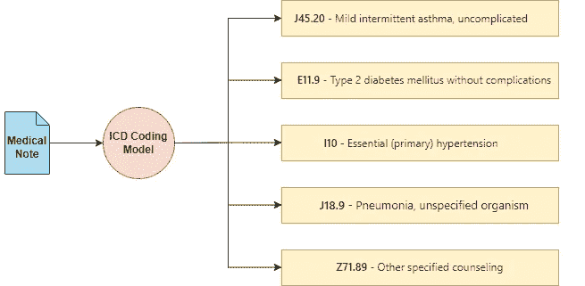
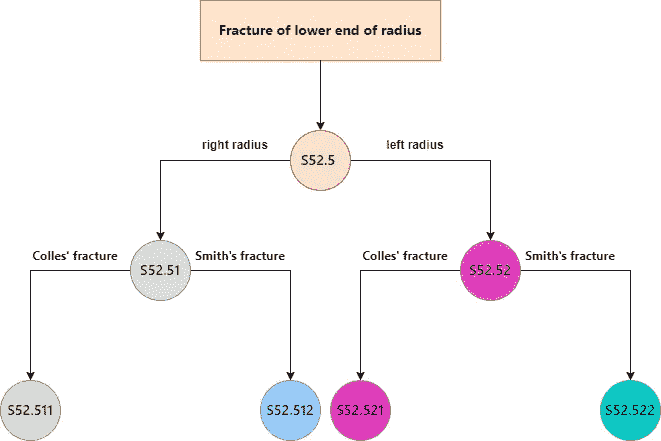
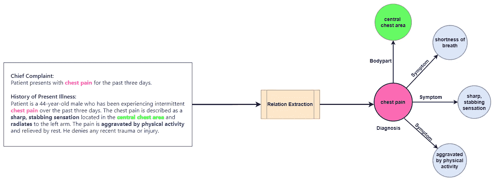
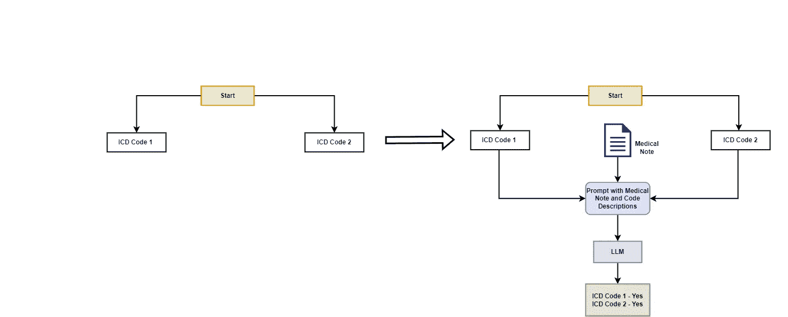
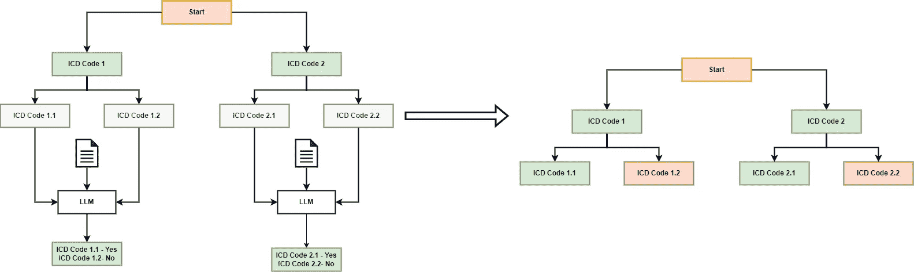
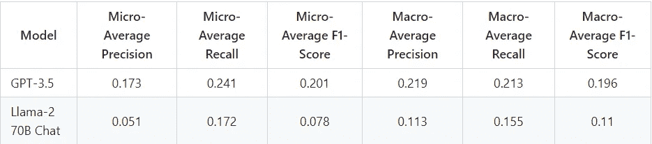

# 探索 LLM 在 ICD 编码中的应用——第一部分

> 原文：[`towardsdatascience.com/exploring-llms-for-icd-coding-part-1-959e48b58b9e?source=collection_archive---------1-----------------------#2024-05-16`](https://towardsdatascience.com/exploring-llms-for-icd-coding-part-1-959e48b58b9e?source=collection_archive---------1-----------------------#2024-05-16)

## 构建基于 LLM 的自动化临床编码系统

[](https://medium.com/@anand.subu10?source=post_page---byline--959e48b58b9e--------------------------------)[](https://towardsdatascience.com/?source=post_page---byline--959e48b58b9e--------------------------------) [Anand Subramanian](https://medium.com/@anand.subu10?source=post_page---byline--959e48b58b9e--------------------------------)

·发表于[数据科学前沿](https://towardsdatascience.com/?source=post_page---byline--959e48b58b9e--------------------------------)·阅读时间 16 分钟·2024 年 5 月 16 日

--

临床编码并不是日常用语，但在大多数国家，它对所有与医疗保健系统互动的人都产生了重要影响。临床编码涉及将患者健康记录中的医疗信息（如诊断和手术）翻译并映射为标准化的数字或字母数字编码。这些编码对计费、医疗分析以及确保患者获得适当护理至关重要。



自动化 ICD 编码的典型工作流程（图由作者提供）

临床编码通常由具备医学专业知识的人工编码员完成。这些编码员需要熟悉复杂且通常具有层级结构的编码术语，这些术语为各种诊断和手术指定了特定的编码。因此，编码员必须对使用的编码术语有深刻的理解和经验。然而，手动编码文档可能会很慢、容易出错，并且受到对大量人力专业知识的依赖，导致瓶颈。

深度学习在临床编码自动化中可以发挥重要作用。通过自动提取和翻译复杂的医疗信息为编码，深度学习系统可以作为“人机协作”系统中的一项有价值的工具。它们可以通过快速处理大量数据来支持编码员，从而潜在地提高速度和准确性。这有助于简化行政操作，减少计费错误，并改善患者护理结果。

在第一部分，我描述了 ICD 编码的概念，阐明了自动化编码系统必须克服的各种挑战。我还分析了大型语言模型（LLMs）如何有效地用于克服这些问题，并通过实现一篇近期论文中的算法来说明如何有效地利用 LLMs 进行 ICD 编码。

# 目录：

1.  **什么是 ICD 编码？**

1.  **自动化 ICD 编码中的挑战是什么****?**

1.  **大型语言模型（LLMs）如何帮助自动化 ICD 编码？**

1.  **探索论文“使用现成的大型语言模型进行自动化临床编码”**

1.  **实施论文中描述的技术**

1.  **结论**

1.  **参考文献**

# 什么是 ICD 编码？

国际疾病分类（ICD）编码是由世界卫生组织[1]开发和维护的临床术语系统。它在大多数国家用于对记录的患者所有诊断、症状和程序进行分类和编码。

医疗记录中记录患者诊断和医疗程序的医疗笔记对于 ICD 编码至关重要。ICD 术语采用层次结构的树状结构，旨在有效地组织大量信息，提供约 75,000 个可用于各种医疗状况和诊断的不同编码。精确编码这些文件至关重要；准确的编码确保适当的计费，并影响医疗分析的质量，直接影响患者护理结果、报销和医疗效率。

# **自动化 ICD 编码中的挑战是什么？**

ICD 编码面临多个挑战，自动化系统必须克服这些挑战才能有效。

## ICD 编码中的标签多样性：

一个重大挑战是标签的输出空间非常广泛。ICD 编码众多，每个编码在细节上可能有所不同——例如，影响右手和左手的病症将有不同的编码。此外，还存在一些稀有编码，这些编码在医疗记录中出现频率较低，深度学习模型由于缺乏足够的示例，很难学习并准确预测这些编码。

## 适应新的 ICD 编码：

传统用于训练的数据集，如 MIMIC-III [2]，虽然非常全面，但通常将 ICD 编码的范围限制在训练语料库中包含的编码。这一限制意味着将 ICD 编码视为从医疗笔记到 ICD 编码的多标签分类问题的深度学习模型，难以处理在模型训练后引入 ICD 系统的新编码。这使得重新训练成为必要且可能具有挑战性的任务。

## 提取和情境化信息：

另一个主要挑战是准确提取和上下文化医疗记录中的信息。ICD 编码本质上是一个信息检索问题，不仅需要识别医疗记录中的诊断，还需要捕捉所有必要的补充信息，以便将这些诊断正确地映射到相应的 ICD 编码。因此，自动化系统必须提取医疗记录中的各种医疗诊断，并适当地上下文化它们，以确保准确地映射到 ICD 编码。



ICD 编码的粗粒度到细粒度的示例——分配给诊断的最终代码取决于最终查询的上下文化程度和精确度。（图片来源：作者）

这里的上下文化是什么意思？在处理医疗记录时，上下文化诊断意味着将其与所有相关细节（例如受影响的身体部位和病情的症状）关联起来，以充分表征诊断。通常，这一任务被称为**关系提取**。



关系提取过程的代表性示例。关系提取可以帮助关联医疗记录中与主要诊断相关的所有信息。（图片来源：作者）

# LLMs 如何帮助自动化 ICD 编码？

在解决自动化 ICD 编码的挑战时，大型语言模型（LLMs）处于解决这些问题的有利位置，尤其是由于它们能够适应新标签并处理复杂的信息提取任务。然而，这里并不是要争论 LLMs 是自动化 ICD 编码的最佳解决方案，或者这些问题只有 LLMs 能解决。相反，通过建立自动化 ICD 编码系统必须克服的一些主要挑战，我分析了如何最好地利用 LLMs 的能力来解决这些问题。

## 适应新和稀有的 ICD 编码：

LLMs 展示了强大的零样本和少样本学习能力，使其能够在提供最少示例和指令的情况下适应新任务。增强生成（RAG）是另一种范式，它使 LLMs 能够访问更多的上下文信息，从而在不进行微调的情况下适应新任务。这对于将 LLMs 适应新的和/或稀有的 ICD 编码特别有用，因为这些编码在训练数据集中可能不会频繁出现，只需要通过一些描述或使用示例即可。

## 上下文化信息：

大型语言模型（LLMs）在临床领域的零样本关系提取方面被发现非常有效[3] [4]。零样本关系提取允许 LLMs 在没有针对特定关系的先验训练情况下识别和分类文本中的关系。这使得在医疗编码中对诊断进行更好的上下文化，从而获得更精确的 ICD 编码。

# 探索论文《使用现成的大型语言模型进行自动化临床编码》：

在探索最近应用 LLM 进行 ICD 编码的相关工作时，我发现了一篇非常有趣的论文，作者利用 LLM 进行 ICD 编码，而无需进行任何特定的微调。作者提出了一种方法，称为**LLM 引导的树搜索**[5]。

## 它是如何工作的？

ICD 术语是一种层次化的树状结构。每个 ICD 代码都存在于这个层次结构中，父级代码涵盖更广泛的疾病，而子级代码则详细描述特定的疾病。遍历 ICD 树可以得到更具体、更细化的诊断代码。

在 LLM 引导的树搜索中，搜索从根节点开始，使用 LLM 来选择要探索的分支，并且会迭代地进行，直到所有路径都被遍历。实际上，这个过程是通过将树中每一层所有代码的描述与医疗记录一起作为提示提供给 LLM，要求其识别与医疗记录相关的代码。LLM 在每个实例中选择的代码将进一步被遍历和探索。此方法能够识别出最相关的 ICD 代码，这些代码随后被分配为临床记录的预测标签。



Tree-Search 算法从 ICD 树的第一层开始。将第一层所有节点的描述和医疗记录一起提供给 LLM，并提示 LLM 识别与给定记录相关的所有代码。LLM 的输出将解析为每个 ICD 代码描述的“是/否”答案集合。（图片由作者提供）

让我们通过一个例子来澄清这个概念。假设有一棵树，包含两个根节点：ICD 代码 1 和 ICD 代码 2。每个节点都有一个描述文本，用于表征该代码。在初始阶段，LLM 会接收医疗记录和代码的描述，并被要求识别与医疗记录相关的代码。



由于 LLM 预测 ICD 代码 1 和 2 与医疗记录相关，算法会遍历每个节点的子节点。每个节点有 2 个子节点，LLM 再次被调用来分别识别每个子节点是否与医疗记录相关。（图片由作者提供）

在这种情况下，LLM 识别出 ICD 代码 1 和 ICD 代码 2 都与医疗记录相关。然后，算法检查每个代码的子节点。每个父代码有两个子节点，代表更具体的 ICD 代码。从 ICD 代码 1 开始，LLM 使用 ICD 代码 1.1 和 ICD 代码 1.2 的描述与医疗记录一起确定相关代码。LLM 认为 ICD 代码 1.1 相关，而 ICD 代码 1.2 不相关。由于 ICD 代码 1.1 没有进一步的子节点，算法检查它是否是一个可分配的代码，并将其分配给文档。接下来，算法评估 ICD 代码 2 的子节点。再次调用 LLM，确定只有 ICD 代码 2.1 相关。这是一个简化的示例；在实际情况中，ICD 树非常庞大且较深，意味着算法将继续遍历每个相关节点的子节点，直到到达树的末端或耗尽有效的遍历。

## **亮点**

1.  该方法不需要对 LLM 进行任何微调；它利用 LLM 在语境中理解医疗记录的能力，并基于提供的描述动态地识别相关的 ICD 代码。

1.  此外，本文显示，LLM 在提供相关信息的提示下，可以有效地适应广泛的输出空间，在宏平均指标上超越 PLM-ICD [6] 在稀有代码方面的表现。

1.  该技术的表现也优于基准方法，即直接要求大型语言模型（LLM）基于其参数知识预测医疗记录的 ICD 代码。这突显了将 LLM 与工具或外部知识集成来解决临床编码任务的潜力。

## 缺点

1.  该算法在树的每一层都会调用 LLM。这导致在遍历树时调用 LLM 的次数非常多，再加上 ICD 树的庞大，这会导致处理单个文档时的高延迟和高成本。

1.  正如作者在论文中提到的那样，为了正确预测相关代码，LLM 必须在所有层级上正确识别其父节点。即使在某一层级上出现错误，LLM 也无法到达最终的相关代码。

1.  由于限制因素无法将数据传输到像 OpenAI GPT 终端这样的外部服务，作者无法使用像 MIMIC-III 这样的数据集来评估他们的方法。相反，他们使用 CodiEsp 数据集 [7,8] 的测试集进行了评估，该数据集包含 250 条医疗记录。该数据集的较小规模表明，该方法在更大的临床数据集上的有效性尚待验证。

# **实施论文中描述的技术**

> 与本文相关的所有代码和资源都可以在[这个链接](https://github.com/anand-subu/automated-clinical-coding-llm)找到，且我的原始[博客相关库](https://github.com/anand-subu/blog_resources)中有该仓库的镜像。我希望强调的是，我的重实现并不完全与论文相同，并且在细节上有所不同，我已经在原始库中记录了这些差异。我尽力根据原论文中的细节复制了用于调用 GPT-3.5 和 Llama-70B 的提示语。至于将数据集从西班牙语翻译成英文，我创建了自己的提示语来执行此操作，因为论文中没有提供相关细节。

让我们实现这个技术，以更好地理解它是如何工作的。如前所述，本文使用了 CodiEsp 测试集进行评估。该数据集包含西班牙语医学笔记及其 ICD 编码。尽管数据集中有英文翻译版，但作者指出，他们使用 GPT-3.5 将西班牙语医学笔记翻译成英文，并声称这种方式比使用预先翻译版本提供了适度的性能提升。我们复制了这个功能并将笔记翻译成英文。

```py
def construct_translation_prompt(medical_note):
    """
    Construct a prompt template for translating spanish medical notes to english.

    Args:
        medical_note (str): The medical case note.

    Returns:
        str: A structured template ready to be used as input for a language model.
    """    
    translation_prompt = """You are an expert Spanish-to-English translator. You are provided with a clinical note written in Spanish.
You must translate the note into English. You must ensure that you properly translate the medical and technical terms from Spanish to English without any mistakes.
Spanish Medical Note:
{medical_note}"""

    return translation_prompt.format(medical_note = medical_note)
```

既然评估语料库已经准备好，让我们实现树搜索算法的核心逻辑。我们在**get_icd_codes**中定义该功能，接受需要处理的医学笔记、模型名称和温度设置。模型名称必须是**“gpt-3.5-turbo-0613”**用于 GPT-3.5，或**“meta-llama/Llama-2–70b-chat-hf”**用于 Llama-2 70B Chat。这个规格确定了树搜索算法在处理过程中将调用的 LLM。

使用相同的代码库评估 GPT-4 是可能的，只需提供适当的模型名称，但由于非常耗时，我们选择跳过这一步。

```py
def get_icd_codes(medical_note, model_name="gpt-3.5-turbo-0613", temperature=0.0):
    """
    Identifies relevant ICD-10 codes for a given medical note by querying a language model.

    This function implements the tree-search algorithm for ICD coding described in https://openreview.net/forum?id=mqnR8rGWkn.

    Args:
        medical_note (str): The medical note for which ICD-10 codes are to be identified.
        model_name (str): The identifier for the language model used in the API (default is 'gpt-3.5-turbo-0613').

    Returns:
        list of str: A list of confirmed ICD-10 codes that are relevant to the medical note.
    """
    assigned_codes = []
    candidate_codes = [x.name for x in CHAPTER_LIST]
    parent_codes = []
    prompt_count = 0

    while prompt_count < 50:
        code_descriptions = {}
        for x in candidate_codes:
            description, code = get_name_and_description(x, model_name)
            code_descriptions[description] = code

        prompt = build_zero_shot_prompt(medical_note, list(code_descriptions.keys()), model_name=model_name)
        lm_response = get_response(prompt, model_name, temperature=temperature, max_tokens=500)
        predicted_codes = parse_outputs(lm_response, code_descriptions, model_name=model_name)

        for code in predicted_codes:
            if cm.is_leaf(code["code"]):
                assigned_codes.append(code["code"])
            else:
                parent_codes.append(code)

        if len(parent_codes) > 0:
            parent_code = parent_codes.pop(0)
            candidate_codes = cm.get_children(parent_code["code"])
        else:
            break

        prompt_count += 1

    return assigned_codes
```

类似于论文中使用的方法，我们使用了[**simple_icd_10_cm**](https://github.com/StefanoTrv/simple_icd_10_CM)库，该库提供了访问 ICD-10 树的功能。这使我们能够遍历树，访问每个编码的描述，并识别有效的编码。首先，我们获取树的第一层节点。

```py
import simple_icd_10_cm as cm

def get_name_and_description(code, model_name):
    """
    Retrieve the name and description of an ICD-10 code.

    Args:
        code (str): The ICD-10 code.

    Returns:
        tuple: A tuple containing the formatted description and the name of the code.
    """
    full_data = cm.get_full_data(code).split("\n")
    return format_code_descriptions(full_data[3], model_name), full_data[1]
```

在循环内部，我们获取与每个节点对应的描述。现在，我们需要根据医学笔记和编码描述为 LLM 构建提示语。我们根据论文中提供的细节，为 GPT-3.5 和 Llama-2 创建提示语。

```py
prompt_template_dict = {"gpt-3.5-turbo-0613" : """[Case note]:
{note}
[Example]:
<example prompt>
Gastro-esophageal reflux disease
Enteropotosis

<response>
Gastro-esophageal reflux disease: Yes, Patient was prescribed omeprazole.
Enteropotosis: No.

[Task]:
Consider each of the following ICD-10 code descriptions and evaluate if there are any related mentions in the case note.
Follow the format in the example precisely.

{code_descriptions}""",

"meta-llama/Llama-2-70b-chat-hf": """[Case note]:
{note}

[Example]:
<code descriptions>
* Gastro-esophageal reflux disease
* Enteroptosis
* Acute Nasopharyngitis [Common Cold]
</code descriptions>

<response>
* Gastro-esophageal reflux disease: Yes, Patient was prescribed omeprazole.
* Enteroptosis: No.
* Acute Nasopharyngitis [Common Cold]: No.
</response>

[Task]:
Follow the format in the example response exactly, including the entire description before your (Yes|No) judgement, followed by a newline. 
Consider each of the following ICD-10 code descriptions and evaluate if there are any related mentions in the Case note.

{code_descriptions}"""
}
```

现在，我们基于医学笔记和编码描述构建提示语。在提示和编码方面，对我们有利的是，我们可以使用相同的**openai**库与 GPT-3.5 和 Llama 2 进行交互，前提是 Llama-2 通过[deepinfra](https://deepinfra.com/)部署，并且 deepinfra 也支持**openai**格式来向 LLM 发送请求。

```py
def construct_prompt_template(case_note, code_descriptions, model_name):
    """
    Construct a prompt template for evaluating ICD-10 code descriptions against a given case note.

    Args:
        case_note (str): The medical case note.
        code_descriptions (str): The ICD-10 code descriptions formatted as a single string.

    Returns:
        str: A structured template ready to be used as input for a language model.
    """
    template = prompt_template_dict[model_name]

    return template.format(note=case_note, code_descriptions=code_descriptions)

def build_zero_shot_prompt(input_note, descriptions, model_name, system_prompt=""):
    """
    Build a zero-shot classification prompt with system and user roles for a language model.

    Args:
        input_note (str): The input note or query.
        descriptions (list of str): List of ICD-10 code descriptions.
        system_prompt (str): Optional initial system prompt or instruction.

    Returns:
        list of dict: A structured list of dictionaries defining the role and content of each message.
    """
    if model_name == "meta-llama/Llama-2-70b-chat-hf":
        code_descriptions = "\n".join(["* " + x for x in descriptions])
    else:
        code_descriptions = "\n".join(descriptions)

    input_prompt = construct_prompt_template(input_note, code_descriptions, model_name)
    return [{"role": "system", "content": system_prompt}, {"role": "user", "content": input_prompt}]
```

构建好提示语后，我们现在调用 LLM 以获取响应：

```py
def get_response(messages, model_name, temperature=0.0, max_tokens=500):
    """
    Obtain responses from a specified model via the chat-completions API.

    Args:
        messages (list of dict): List of messages structured for API input.
        model_name (str): Identifier for the model to query.
        temperature (float): Controls randomness of response, where 0 is deterministic.
        max_tokens (int): Limit on the number of tokens in the response.

    Returns:
        str: The content of the response message from the model.
    """
    response = client.chat.completions.create(
        model=model_name,
        messages=messages,
        temperature=temperature,
        max_tokens=max_tokens
    )
    return response.choices[0].message.content
```

很好，我们已经得到了输出！从响应中，我们现在解析每个代码描述，识别出 LLM 认为需要进一步遍历的节点，以及那些被 LLM 拒绝的节点。我们将输出响应分成新行，并拆分每个响应，以识别 LLM 对每个代码描述的预测。

```py
def remove_noisy_prefix(text):
    # Removing numbers or letters followed by a dot and optional space at the beginning of the string
    cleaned_text = text.replace("* ", "").strip()
    cleaned_text = re.sub(r"^\s*\w+\.\s*", "", cleaned_text)
    return cleaned_text.strip()

def parse_outputs(output, code_description_map, model_name):
    """
    Parse model outputs to confirm ICD-10 codes based on a given description map.

    Args:
        output (str): The model output containing confirmations.
        code_description_map (dict): Mapping of descriptions to ICD-10 codes.

    Returns:
        list of dict: A list of confirmed codes and their descriptions.
    """
    confirmed_codes = []
    split_outputs = [x for x in output.split("\n") if x]
    for item in split_outputs:
        try:                
            code_description, confirmation = item.split(":", 1)
            if model_name == "meta-llama/Llama-2-70b-chat-hf":
                code_description = remove_noisy_prefix(code_description)

            if confirmation.lower().strip().startswith("yes"):
                try:
                    code = code_description_map[code_description]
                    confirmed_codes.append({"code": code, "description": code_description})
                except Exception as e:
                    print(str(e) + " Here")
                    continue
        except:
            continue
    return confirmed_codes
```

现在让我们来看一下循环的其余部分。到目前为止，我们已经构建了提示，获取了 LLM 的响应，并解析了输出以识别 LLM 认为相关的代码。

```py
while prompt_count < 50:
    code_descriptions = {}
    for x in candidate_codes:
        description, code = get_name_and_description(x, model_name)
        code_descriptions[description] = code

    prompt = build_zero_shot_prompt(medical_note, list(code_descriptions.keys()), model_name=model_name)
    lm_response = get_response(prompt, model_name, temperature=temperature, max_tokens=500)
    predicted_codes = parse_outputs(lm_response, code_descriptions, model_name=model_name)

    for code in predicted_codes:
        if cm.is_leaf(code["code"]):
            assigned_codes.append(code["code"])
        else:
            parent_codes.append(code)

    if len(parent_codes) > 0:
        parent_code = parent_codes.pop(0)
        candidate_codes = cm.get_children(parent_code["code"])
    else:
        break

    prompt_count += 1
```

现在我们遍历预测的代码，并检查每个代码是否为**“叶子”**代码，这本质上确保了该代码是一个有效且可分配的 ICD 代码。如果预测的代码有效，我们将其视为 LLM 对该医疗记录的预测。如果无效，我们将其添加到父代码中，并获取子节点以进一步遍历 ICD 树。如果没有更多的父代码可供进一步遍历，我们将跳出循环。

理论上，每个医疗记录的 LLM 调用次数可以非常高，如果算法遍历许多节点，可能会导致延迟增加。作者强制规定每个医疗记录最多 50 次提示/LLM 调用来终止处理，这是我们在实现中也采用的限制。

## 结果

我们现在可以使用 GPT-3.5 和 Llama-2 作为 LLM 来评估树搜索算法的结果。我们根据微平均（micro-average）和宏平均（macro-average）精度、召回率以及 F1 分数来评估算法的表现。



我们的 GPT-3.5 和 Llama-2 70B Chat 实现结果

尽管实现结果大致与论文中报告的分数相符，但仍存在一些值得注意的差异。

1.  在这个实现中，GPT-3.5 的微平均指标略高于报告的数值，而宏平均指标稍微低于报告的值。

1.  类似地，Llama-70B 的微平均指标要么与报告的数值相符，要么略有超出，但宏平均指标低于报告的数值。

如前所述，这个实现与论文中的方法在一些小地方有所不同，这些差异影响了最终的表现。有关本实现与原始论文的差异，敬请参考[相关仓库](https://github.com/anand-subu/automated-clinical-coding-llm)以获得更详细的讨论。

# 结论

理解并实现这种方法在许多方面对我来说都是一次很有启发的经历。它让我对大语言模型（LLMs）在临床编码案例中的优缺点有了更细致的理解。具体来说，显而易见的是，向 LLMs 提供关于代码的动态相关信息可以帮助提高它们的表现。

探索将 LLMs 作为临床编码代理是否能进一步提高性能将是很有趣的。考虑到生物医学和临床文本中外部知识源（如论文或知识图谱）的丰富性，LLM 代理可以潜在地用于分析医疗文档的工作流程，进行更精细的粒度分析。如果需要，它们还可以调用工具，在必要时即时参考外部知识，以最终得出编码结果。

## 局限性

在本文中，尽管我尝试分析 LLMs 如何帮助进行 ICD 编码，但也有一些实际的局限性需要考虑：

1.  大型语言模型（LLMs）在部署时需要大量计算资源。这导致了诸如需要强大 GPU 的考虑，缺乏 GPU 可能会导致应用程序出现高延迟，从而限制其应用。

1.  此外，医疗数据处理通常可能需要严格的数据安全和隐私保护措施。在线 LLM 服务可能并不一定符合医疗数据处理所需的安全和隐私标准。

## 致谢

非常感谢本文的主作者 Joseph，他澄清了我在评估该方法时的疑问！

# 参考文献：

[1] [`www.who.int/standards/classifications/classification-of-diseases`](https://www.who.int/standards/classifications/classification-of-diseases)

[2] Johnson, A. E., Pollard, T. J., Shen, L., Lehman, L. W. H., Feng, M., Ghassemi, M., … & Mark, R. G. (2016). MIMIC-III，一个可自由访问的重症监护数据库。Sci. *Data*，*3*(1)，1。

[3] Agrawal, M., Hegselmann, S., Lang, H., Kim, Y., & Sontag, D. (2022). 大型语言模型是少量样本的临床信息提取器。*arXiv 预印本 arXiv:2205.12689*。

[4] Zhou, H., Li, M., Xiao, Y., Yang, H., & Zhang, R. (2023). LLM 指令-示例自适应提示（LEAP）框架用于临床关系提取。*medRxiv：健康科学预印本服务器*，2023.12.15.23300059。 [`doi.org/10.1101/2023.12.15.23300059`](https://doi.org/10.1101/2023.12.15.23300059)

[5] Boyle, J. S., Kascenas, A., Lok, P., Liakata, M., & O’Neil, A. Q. (2023 年 10 月). 使用现成的大型语言模型进行自动化临床编码。发表于*深度生成模型在健康领域工作坊 NeurIPS 2023*。

[6] Huang, C. W., Tsai, S. C., & Chen, Y. N. (2022). PLM-ICD：使用预训练语言模型自动化 ICD 编码。*arXiv 预印本 arXiv:2207.05289*。

[7] Miranda-Escalada, A., Gonzalez-Agirre, A., Armengol-Estapé, J., & Krallinger, M. (2020). 自动化临床编码概述：注释、指南以及 CodiEsp 赛道上针对非英语临床案例的解决方案，发表于 CLEF eHealth 2020。*CLEF（工作笔记）*，*2020*。

[8] Miranda-Escalada, A., Gonzalez-Agirre, A., & Krallinger, M. (2020). CodiEsp 语料库：使用 ICD10（CIE10）编码的西班牙临床病例金标准 — eHealth CLEF2020 (1.4) [数据集]。Zenodo。[`doi.org/10.5281/zenodo.3837305`](https://doi.org/10.5281/zenodo.3837305) (CC BY 4.0)
