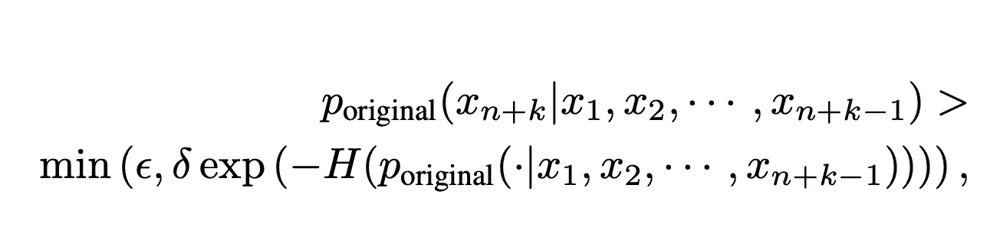

# 探索 Medusa 与多 token 预测

> 原文：[`towardsdatascience.com/exploring-medusa-and-multi-token-prediction-de7f8312e4a7?source=collection_archive---------5-----------------------#2024-07-10`](https://towardsdatascience.com/exploring-medusa-and-multi-token-prediction-de7f8312e4a7?source=collection_archive---------5-----------------------#2024-07-10)

## 本文将详细介绍“MEDUSA：一种简单的 LLM 推理加速框架，具有多个解码头”这篇论文。

 [Matthew Gunton](https://medium.com/@mgunton7?source=post_page---byline--de7f8312e4a7--------------------------------)

·发布于[Towards Data Science](https://towardsdatascience.com/?source=post_page---byline--de7f8312e4a7--------------------------------) ·阅读时长 11 分钟·2024 年 7 月 10 日

--

图片来源：作者 — SDXL

互联网是一个竞争异常激烈的地方。研究表明，如果网页加载时间超过 5 秒，用户就会离开网页[2][3]。这对大多数大型语言模型（LLM）来说是一个挑战，因为它们无疑是目前最慢的程序之一。虽然定制硬件可以显著加速 LLM，但运行在这种硬件上目前仍然非常昂贵。如果我们能找到充分利用标准硬件的方法，将能显著提高 LLM 的客户体验。

[“MEDUSA：一种简单的 LLM 推理加速框架，具有多个解码头”](https://arxiv.org/pdf/2401.10774) 论文的作者提出了一种架构变更，当在现有硬件上运行时，可以实现 2 倍到 3 倍的加速。

让我们深入探讨吧！

# 推测解码

推测解码被引入作为加速 LLM 推理的一种方法。你看，LLM 是自回归的，这意味着我们使用刚刚预测出的输出 token，来帮助预测下一个我们想要的 token。通常我们是一次预测一个 token（或者每次进行一次神经网络前向传播时预测一个 token）。然而，由于下一个 token 的注意力模式与前一个 token 的注意力模式非常相似，我们重复了大部分相同的计算，实际上并没有获得太多新的信息。

推测解码意味着，和传统的每次前向推理一个 token 不同，在进行一次前向推理后，我们尝试尽可能多地找到多个 token。一般来说，这个过程有三个步骤：

(1) 生成候选项

(2) 处理候选项

(3) 接受某些候选项

美杜莎是一种推测性解码，因此其步骤直接映射到这些步骤。美杜莎将解码头附加到模型的最终层，这是它实现(1)的方式。树形注意力是它如何处理候选项的方式（2）。最后，美杜莎使用拒绝采样或典型的接受方案来完成(3)。让我们详细了解每一步。

# 解码头与美杜莎

解码头接收模型正向传播所产生的隐藏状态的内部表示，然后生成对应于词汇表中不同标记的概率。本质上，它是在将模型学到的内容转化为概率，从而决定下一个标记是什么。

图 1 [来自论文](https://arxiv.org/pdf/2401.10774)

美杜莎通过将多个解码头附加到模型最后一个隐藏层来调整典型的 Transformer 架构。这样，它可以在一次正向传播中预测多个标记。每增加一个解码头，就可以预测一个额外的标记。因此，如果你有 3 个美杜莎解码头，你将从正向传播中预测第一个标记，然后再用美杜莎解码头预测接下来的 3 个标记。在论文中，作者建议使用 5 个解码头，因为他们发现这在加速和质量之间提供了最佳平衡。

为了实现这一点，论文的作者提出了下面的美杜莎解码头：

第*k*个解码头的定义 [来自论文](https://arxiv.org/pdf/2401.10774)

该方程给出了来自*k*个解码头的标记*t*的概率。我们首先使用通过训练美杜莎解码头所得到的权重*W1*，并将其与标记*t*的内部状态相乘。我们使用`SiLU`激活函数仅传递选择性信息（`SiLU = x * sigmoid(x)`）。我们将内部状态第二次添加为跳跃连接的一部分，这使得模型能够在`SiLU`的线性激活过程中不丢失信息，从而提高性能。然后，我们将和与训练得到的第二组权重*W2*相乘，并将该乘积通过`softmax`得到概率。

# 树形注意力

第一个美杜莎解码头基于正向传播给出模型应考虑的概率，但后续的美杜莎解码头需要根据前面解码头选择的内容来确定应该选择哪个标记。

自然地，早期美杜莎解码头提出的选项越多（超参数*sk*），未来的解码头需要考虑的选项也越多。例如，当我们仅考虑来自解码头 1 的前两个候选项（s1=2）和来自解码头 2 的前三个候选项（s2=3）时，我们最终需要计算 6 种不同的情况。

由于这一扩展，我们希望尽可能并行地生成并验证这些候选项。

图 2 [来自论文](https://arxiv.org/pdf/2401.10774)

上面的矩阵展示了我们如何通过树注意力在同一个批次中运行所有这些计算。与典型的因果自注意力不同，只有来自同一延续的标记才被认为与注意力模式相关。正如矩阵所示，利用这有限的空间，我们可以将所有候选项都放入一个批次，并同时对它们运行注意力。

这里的挑战是，每个预测只需要考虑紧跟其后的候选标记。换句话说，如果我们从头 1 选择了“它”，而且我们正在评估下一个应该出现的标记，我们就不希望“我”的注意力模式影响到接下来的标记。

作者通过使用掩码来避免将与当前计算无关的标记数据传递到注意力计算中，从而避免了这种干扰。通过使用这个掩码，他们在计算注意力模式时可以节省内存，并将这些信息用于解码头，生成后续的标记候选项。

虽然上面的矩阵展示了我们将每个预测视为相同，但如果我们为每个预测提供了概率，我们可以根据它们成为最佳选择的可能性来区分对待。这下面的树状图直观地展示了这一点。

图 6 [来自论文](https://arxiv.org/pdf/2401.10774)

在上面，有 4 个美杜莎头部，每个头部给出多个候选者。然而，并不是每个预测都会被计算。我们根据预测正确的概率在树上添加节点。在这里，树的权重偏向左侧，显示出预测的概率越高，显示的可能性越多。简而言之，我们在这里所做的只是将那些我们认为有合理可能性成为最佳选择的预测加载到树的注意力中。

使用概率来决定继续进行哪些计算是一种思维方式，我们将在接下来的候选接受标准中再次看到这种方法。

# 典型的接受方案与拒绝采样

现在我们进入最后阶段，决定使用哪些预测（如果有的话）。正如我们一开始所说，模型是自回归的，所以如果我们从前向传递中预测下一个 5 个标记，我们可以简单地将这 5 个标记输入模型进行下一次迭代，从而享受推理速度的提升。然而，我们只有在预测的质量足够高时才会这么做。我们怎么判断这一点呢？

一种方法是拒绝采样（Rejection Sampling），其中我们有一个独立的模型来判断下一个 token 是否足够好（这一方法在 Meta 的 Ghost Attention 微调中使用过，在此了解更多）。自然，这种方法完全依赖于你其他模型的质量。如果其他模型足够好，那么这种方法效果非常好！不过需要注意的是，为了保持低延迟，你需要确保这个其他模型运行非常快速，这与保持高质量之间的平衡是一个难题。

由于这一困难，作者提出了典型的接受机制来做出判断。由于所有的预测都是概率，我们可以使用这些概率来设定一个阈值，超过该阈值的 token 将被接受。下面的方程展示了我们如何做到这一点：

显示典型接受机制的方程 [来自论文](https://arxiv.org/pdf/2401.10774)

这里的关键是，我们将使用原始模型在这些 token 上生成的概率来判断预测是否有效。我们有从 *X1* 到 *Xn* 的 token 作为上下文，让模型为 *Xn+k* 的 token 计算概率。*p* 代表我们原始模型的概率分布，而 ϵ 和 δ 是设定的阈值，用于判断何时概率足够高，可以纳入模型的响应。整体来看，高概率的 token 会通过，但低概率的 token 也会通过，前提是它们来自一个大多数概率较低的概率分布。

此外，这个函数在我们调整温度时会导致重要的行为变化。通常，用户通过提高温度来让 LLM 给出更具创意的回答。因此，当温度设置为零时，典型的接受机制确保只有从前向传播中预测出的第一个 token 被通过，从而产生最一致的结果。然而，随着温度的提高，LLM 的概率分布会发生变化，产生更多的预测，这些预测可能会达到被接受的阈值。这不仅导致结果更快，有时也更加富有创意。

# 自蒸馏

作者提议，在创建 Medusa 模型时，我们不从头开始训练，而是使用高质量的基础模型（我们称之为模型的主干部分），然后在其上添加 Medusa 的头部。微调后，它们能够理解这些新头部，并且速度会提高，同时不会带来显著的性能损失。

然而，微调需要高质量的数据。作者很友好地解释了他们是如何创建用于训练 Medusa 所需的数据语料库的。

首先，他们使用了 [ShareGPT 数据集](https://sharegpt.com/) 来寻找人们期望与其大型语言模型（LLM）进行的高质量交互。他们从数据集中提取了所有提示，然后通过主干模型运行这些提示，以获取真实的基础数据来进行微调。

虽然这种方法在微调 Medusa 头部（我们将在下文详细介绍 Medusa-1）时效果很好，但在微调整个新模型时效果不佳。

这种退化意味着地面真值信息不足以重新训练模型并保持高性能。相反，他们重新编写了损失函数，使其使用概率分布作为地面真值。这要求他们像下面这样重新制定损失函数。

新模型的损失方程 [来自论文](https://arxiv.org/pdf/2401.10774)

简单来说，我们使用 Kullback–Leibler 散度（KL）来衡量一个标记的原始概率分布与新的概率分布之间的差异（想了解更多关于 KL 的信息，可以阅读 Aparna Dhinakaran 关于该主题的精彩文章）。

然而，这种形式化要求我们同时保持原始模型和新模型的概率分布——这既占用存储空间又消耗内存。为了减少我们的消耗，作者建议使用 LoRA 进行微调，因为它自然地保持了原始权重和额外的权重(想了解更多关于 LoRA 的信息，可以查看我关于该主题的博客文章)。

# 训练 Medusa

现在我们有了数据，可以开始微调了！

正如我们所看到的，Medusa 需要向模型中添加额外的参数以使其生效，而这些参数是需要我们训练的。为了减少所需的计算量（从而减少训练成本），作者提出了两种 Medusa 微调方法：Medusa-1 和 Medusa-2。

# Medusa-1

Medusa-1 涉及冻结模型中除了 Medusa 头部以外的所有权重。通过仅将梯度传递通过 Medusa 头部，我们不必担心降低原始模型的性能（它保持不变），并且可以提高 Medusa 头部的性能。下面的损失函数展示了他们如何将正确的地面真值标记与正确的 Medusa 头部匹配。

方程 1 [来自论文](https://arxiv.org/pdf/2401.10774)

Medusa-1 专注于仅调整额外的 Medusa 权重，这意味着它比 Medusa-2 更具成本效益（我们稍后将详细讨论）。对于对训练成本敏感的人，作者建议使用量化的骨干模型进一步减少内存需求，并结合使用量化低秩适应（QLoRA）微调方法进一步降低成本。

# Medusa-2

尽管 Medusa-1 更具成本效益，但最佳性能仍然来自于更新模型中的所有权重，以考虑我们添加的新 Medusa 头部。有趣的是，这并不像简单地进行 LoRA 微调那样直接，因为梯度需要传递到所有权重（而不仅仅是 Medusa 权重）。

事实上，作者首先运行了 Medusa-1，以使 Medusa 权重达到合理的性能。然后，他们为 Medusa 权重和骨干模型权重选择了不同的学习率。从逻辑上讲，之所以这么做，是因为骨干模型的权重可能已经接近所需的位置，而 Medusa 的权重应该发生更多变化。最后，他们为骨干模型添加了损失函数（表示为*Llm*），同时 Medusa-1 的损失函数按*λ0*值进行缩放。引入这个 lambda 值是为了平衡损失，以避免仅因为 Medusa 头部的缘故而计算出过大的损失值。

公式 2 [来自论文](https://arxiv.org/pdf/2401.10774)

# 结语

图 3 [来自论文](https://arxiv.org/pdf/2401.10774)

使用 Medusa 能显著提升速度。从上图可以看出，作者为 Vicuna（一款流行的开源 LLM）获得了两到三倍的加速。

速度在互联网上以及设备上都至关重要。正如我们所看到的，越来越多的公司推动创建本地 LLM，像 Medusa 这样的技术似乎对于在有限硬件上获得优异的速度至关重要。看到像 Phi-3 这样的小型模型会加速多少将非常有趣（在发布时，Phi-3 在 A16 Bionic iPhone 芯片上运行速度为每秒 12 个 token — 更多信息请见我的博客文章）。对于开发者来说，这可能为在本地运行各种开源模型打开了大门——即使这些模型最初并未设计为快速推理模型，例如 Phi-3。

此外，进行实验来研究 Medusa 头部在前向传播中的注意力模式对性能提升的影响将是很有趣的。目前它们的上下文非常少，但仍然表现良好。如果有更多的上下文，或许可以增加 Medusa 头部的数量，从而实现更快的速度提升。

现在是构建的激动人心时刻。

[1] Cai, T., 等, [“MEDUSA: 简单的 LLM 推理加速框架，带有多个解码头”](https://arxiv.org/pdf/2401.10774) (2024), arXiv

[2] Clabaugh, J., [“你会等待多长时间一个网页加载完？”](https://wtop.com/business-finance/2022/02/how-long-do-you-wait-for-a-web-page-to-load/) (2022), wtop

[3] Das, S., [“2023 年，一个网站应该多久加载完成？”](https://www.browserstack.com/guide/how-fast-should-a-website-load) (2023), BrowserStack
