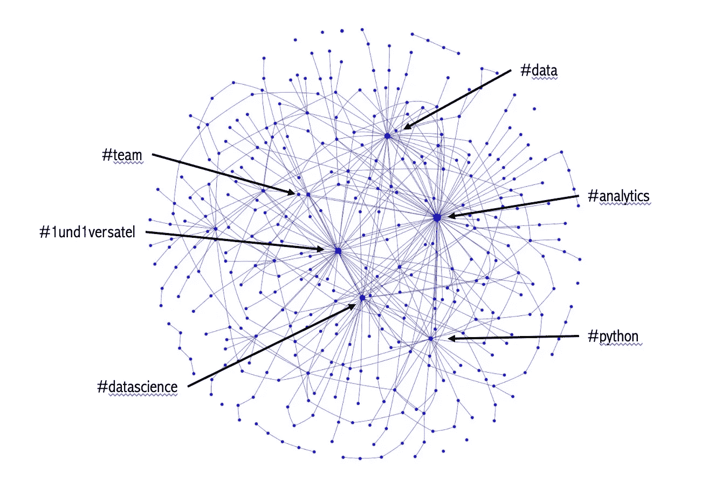

# 通过数据分析探索我的 LinkedIn 之旅

> 原文：[`towardsdatascience.com/exploring-my-linkedin-journey-through-data-analysis-c03f614000cd?source=collection_archive---------4-----------------------#2024-03-02`](https://towardsdatascience.com/exploring-my-linkedin-journey-through-data-analysis-c03f614000cd?source=collection_archive---------4-----------------------#2024-03-02)

## 揭示我的帖子与互动模式 — **一个与数据相关的一年旅程**

 [Stephan Hausberg](https://medium.com/@stephanhausberg?source=post_page---byline--c03f614000cd--------------------------------)

·发表于[Towards Data Science](https://towardsdatascience.com/?source=post_page---byline--c03f614000cd--------------------------------) ·13 分钟阅读·2024 年 3 月 2 日

--

标签网络图可视化 — 图片由作者提供

## 介绍

今天领先的职业社交平台是 LinkedIn。我几年前开始在 LinkedIn 上分享关于我的工作和职位的信息。然而，在过去的一年里，我决定更加专注于创作与我在数据与分析领域的新工作经验相关的内容。具体来说，我一直在发布并分享关于领导力、团队发展和地理空间分析的故事，包括数据可视化和图论的内容。

从 LinkedIn (LI) 中，你可以提取多种统计数据，如曝光量、互动数和每日粉丝增长。此外，还有一个 LI API，可以用来获取更详细的统计数据。在过去的一年里，我收集了我自己 LinkedIn 帖子的相关数据，目的是展示如何在这样的数据集上应用数据分析。在本文中，我将分享我通过追踪一年的 LinkedIn 活动所学到的知识。

在第一部分，我将讨论软性因素，例如受众、度量标准、数据收集、工具和标准。接下来，我将提供更为详细的描述性分析，并结合若干数据导向的结果。一个帖子在几周内的表现如何…
