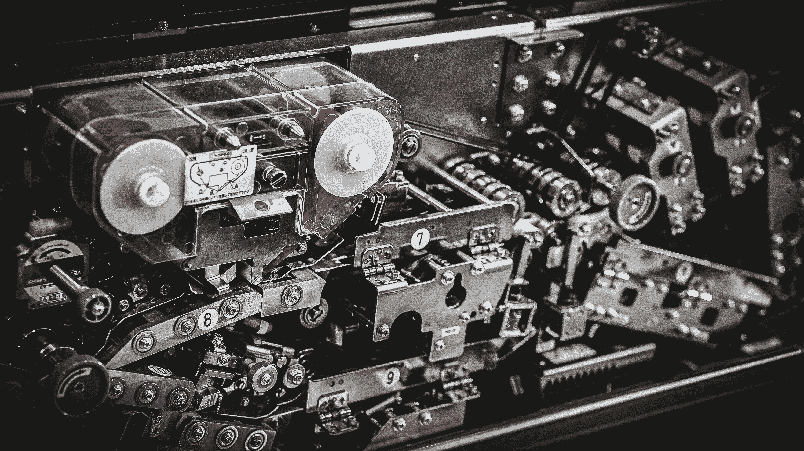
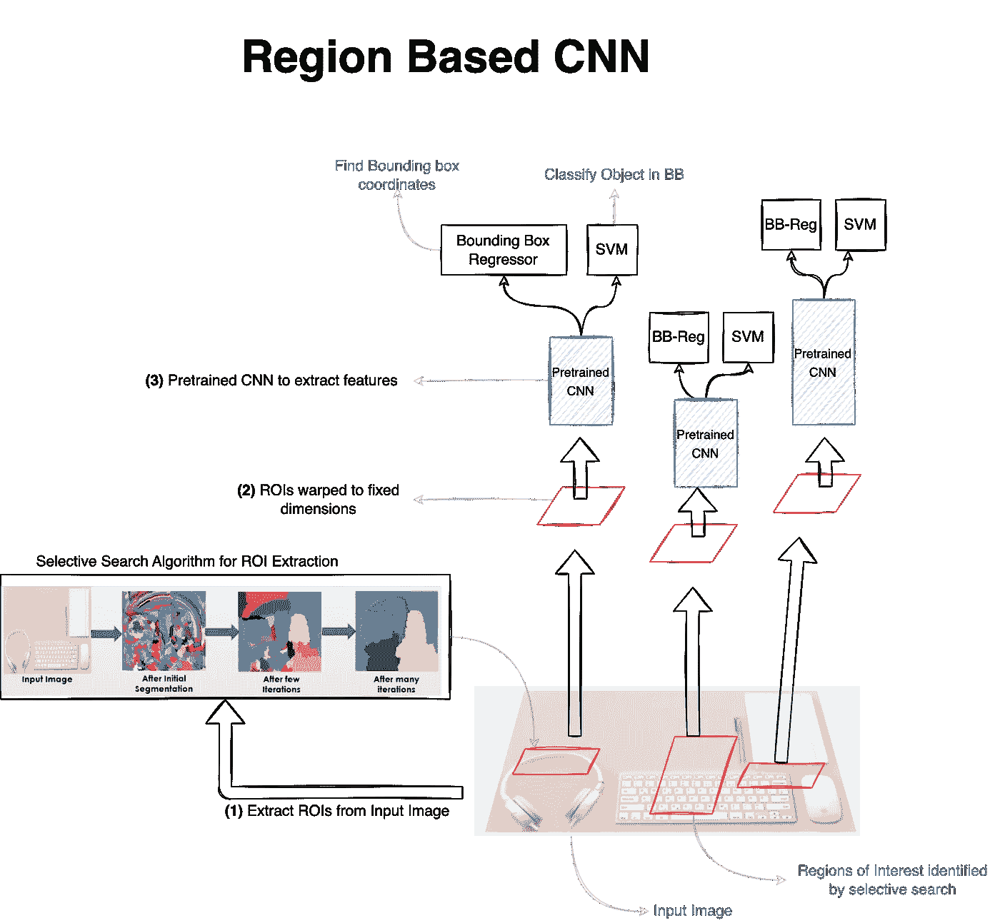
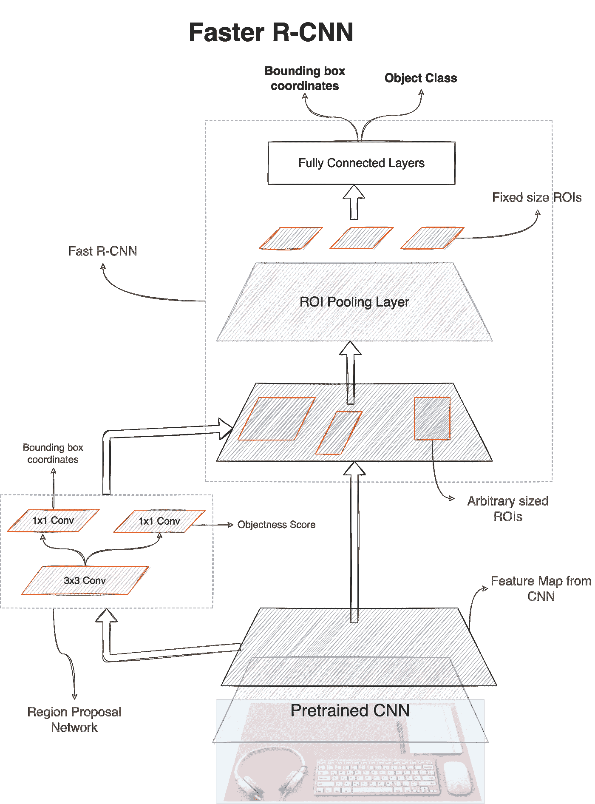

# 探索使用 R-CNN 模型进行目标检测——全面的初学者指南（第二部分）

> 原文：[`towardsdatascience.com/exploring-object-detection-with-r-cnn-models-a-comprehensive-beginners-guide-part-2-685bc89775e2?source=collection_archive---------5-----------------------#2024-02-17`](https://towardsdatascience.com/exploring-object-detection-with-r-cnn-models-a-comprehensive-beginners-guide-part-2-685bc89775e2?source=collection_archive---------5-----------------------#2024-02-17)

## 目标检测模型

 [Raghav Bali](https://medium.com/@Rghv_Bali?source=post_page---byline--685bc89775e2--------------------------------)

·发表于[Towards Data Science](https://towardsdatascience.com/?source=post_page---byline--685bc89775e2--------------------------------) ·阅读时间：7 分钟·2024 年 2 月 17 日

--

摄影： [liam siegel](https://unsplash.com/@datalore?utm_source=medium&utm_medium=referral) 来自[Unsplash](https://unsplash.com/?utm_source=medium&utm_medium=referral)

## 目标检测模型

目标检测是一个复杂的过程，帮助在给定图像中进行目标的定位和分类。在第一部分中，我们理解了目标检测的基本概念和一般框架。在本文中，我们将简要介绍一些重要的目标检测模型，重点理解它们的关键贡献。

一般的目标检测框架突出了目标检测过程中需要执行的一些中间步骤。在这个思维框架的基础上，研究人员提出了许多创新的架构来解决目标检测任务。将这些模型进行分类的一种方式是根据它们处理任务的方式。利用多个模型和/或步骤来解决此任务的目标检测模型被称为多阶段目标检测器。基于区域的 CNN（RCNN）模型家族是**多阶段目标检测器**的典型例子。随后，许多改进导致了使用单一模型本身来解决此任务的模型架构。这些模型被称为**单阶段目标检测器**。我们将在后续的文章中讨论单阶段模型。现在，让我们来看看这些多阶段目标检测器的一些内部工作原理。

## 基于区域的卷积神经网络

基于区域的卷积神经网络（R-CNN）最初由 Girshick 等人于 2013 年在他们的论文 “[Rich feature hierarchies for accurate object detection and semantic segmentation](https://arxiv.org/abs/1311.2524)” 中提出。R-CNN 是一种多阶段物体检测模型，成为后续更快、更复杂的变种的起点。在理解通过 **Fast R-CNN** 和 **Faster R-CNN** 模型取得的改进之前，让我们先从这个基础思想开始。

R-CNN 模型由四个主要组成部分构成：

+   **区域提议**：提取感兴趣区域是该流程中的第一步也是最重要的一步。R-CNN 模型使用名为选择性搜索（Selective Search）的算法进行区域提议。选择性搜索是由 [Uijlings 等人](http://www.huppelen.nl/publications/selectiveSearchDraft.pdf) 于 2012 年提出的一种贪心搜索算法。简单来说，选择性搜索利用自底向上的多尺度迭代方法来识别 ROI。在每次迭代中，算法将相似的区域进行分组，直到整张图像被归为一个区域。区域之间的相似性是基于颜色、纹理、亮度等计算的。选择性搜索会生成大量的假阳性（背景）ROI，但具有较高的召回率。ROI 列表将传递到下一步进行处理。

+   **特征提取**：R-CNN 网络使用预训练的 CNN（如 VGG 或 ResNet）从前一步中识别的每个 ROI 中提取特征。在将区域/裁剪传递到预训练网络作为输入之前，这些区域会被重新调整或扭曲为所需的尺寸（每个预训练网络仅要求特定尺寸的输入）。预训练网络在没有最终分类层的情况下使用。此阶段的输出是一长串张量，每个张量对应前一阶段的一个 ROI。

+   **分类头**：原始的 R-CNN 论文使用支持向量机（SVM）作为分类器来识别 ROI 中物体的类别。SVM 是一种传统的监督学习算法，广泛用于分类任务。此步骤的输出是每个 ROI 的分类标签。

+   **回归头**：此模块处理物体检测任务中的定位部分。如前一节所述，边界框可以通过 4 个坐标唯一确定（左上角（x，y）坐标以及框的宽度和高度）。回归器为每个 ROI 输出这 4 个值。

该流程在图 1 中进行了视觉展示，供参考。如图所示，网络需要使用预训练网络对每个 ROI 进行多次独立的前向传播。这是 R-CNN 模型在训练和推理过程中变慢的主要原因之一。论文的作者提到，训练该网络需要超过 80 小时，并且需要大量的磁盘空间。第二个瓶颈是选择性搜索算法本身。

图 1：R-CNN 模型的组成部分。区域提议组件基于选择性搜索，随后通过预训练的网络（如 VGG）进行特征提取。分类头部使用支持向量机（SVM）和一个单独的回归头部。来源：作者

R-CNN 模型是一个很好的例子，展示了如何将不同的思想作为构建块来解决复杂的问题。虽然我们将在实践中详细演示如何在迁移学习的背景下进行目标检测，但在其原始设置中，R-CNN 已经利用了迁移学习。

R-CNN 模型虽然较慢，但为后来的目标检测模型提供了良好的基础。计算上昂贵且缓慢的特征提取步骤在**Fast R-CNN**实现中得到了主要解决。[Fast R-CNN](https://arxiv.org/abs/1504.08083)由 Ross Grishick 于 2015 年提出。该实现不仅在训练和推理速度上更快，还在[PASCAL VOC 2012](http://host.robots.ox.ac.uk/pascal/VOC/voc2012/)数据集上提高了 mAP。

**Fast R-CNN**论文的主要贡献可以总结如下：

+   **区域提议**：对于基础的 R-CNN 模型，我们讨论了如何将选择性搜索算法应用于输入图像，生成数千个 ROI，并通过预训练网络提取特征。Fast R-CNN 改变了这一过程，以获得更大的影响。它不再使用预训练网络对特征提取步骤进行数千次处理，而是仅执行一次。换句话说，我们首先通过预训练网络处理整个输入图像，仅进行一次。然后，将输出特征作为输入，供选择性搜索算法识别 ROI。这一组件顺序的改变在很大程度上减少了计算需求和性能瓶颈。

+   **ROI 池化层**：在前一步中识别出的 ROI 可以是任意大小（由选择性搜索算法确定）。但是，ROI 提取后的全连接层只能接受固定大小的特征图作为输入。因此，ROI 池化层是一个固定大小的滤波器（论文中提到大小为 7x7），它帮助将这些任意大小的 ROI 转化为固定大小的输出向量。该层的工作方式是首先将 ROI 划分为大小相等的区域，然后在每个区域中找到最大值（类似于最大池化操作）。输出是来自每个等大小区域的最大值。ROI 池化层显著加快了推理和训练时间。

+   **多任务损失**：与 R-CNN 实现中的两个不同组件（SVM 和边界框回归器）不同，Faster R-CNN 使用了一个多头网络。这种设置使得网络可以通过多任务损失函数同时训练两个任务。多任务损失是分类损失和回归损失的加权和，分别用于物体分类和边界框回归任务。损失函数表示为：

> Lₘₜ = Lₒ + 𝛾Lᵣ

其中，𝛾 ≥ 1 如果 ROI 包含物体（物体得分），否则为 0。分类损失是一个简单的负对数损失，而原始实现中使用的回归损失是平滑 L1 损失。

原始论文详细描述了多项实验，突出基于不同超参数组合和在预训练网络中微调的层次的性能提升。原始实现使用了预训练的 VGG-16 作为特征提取网络。从 Fast R-CNN 的原始实现以来，出现了多个更快且改进的实现，如 MobileNet、ResNet 等。这些网络也可以替换 VGG-16，进一步提升性能。

**Faster R-CNN**是这一系列多阶段物体检测器中的最终成员。这是迄今为止最复杂且最快的变体。虽然 Fast R-CNN 显著改善了训练和推理时间，但由于选择性搜索算法，它仍然受到了一定的惩罚。2016 年，Ren 等人在其论文《[Faster R-CNN: Towards Real-Time Object Detection with Region Proposal Networks](https://papers.nips.cc/paper/2015/file/14bfa6bb14875e45bba028a21ed38046-Paper.pdf)》中提出的 Faster R-CNN 模型主要解决了区域提议的问题。该网络在 Fast R-CNN 的基础上引入了一个新的组件，称为**区域提议网络（RPN）**。整体 Faster R-CNN 网络如图 2 所示，供参考。

图 2：Faster R-CNN 由两个主要组件组成：1) 区域提议网络（RPN）用于识别 ROI，2) 类似 Fast R-CNN 的多头网络，包含 ROI 池化层。来源：作者

RPN 是一个完全卷积网络（FCN），用于生成 ROI。如图 3.12 所示，RPN 仅由两层组成。第一层是一个 3x3 的卷积层，具有 512 个过滤器，后面是两个并行的 1x1 卷积层（分别用于分类和回归）。3x3 的卷积过滤器应用于预训练网络的特征图输出（其输入为原始图像）。请注意，RPN 中的分类层是一个二分类层，用于确定物体性得分（而不是物体类别）。边界框回归是通过在锚框上使用 1x1 的卷积过滤器来进行的。论文中提议的设置在每个窗口使用 9 个锚框，因此 RPN 生成 18 个物体性得分（2xK）和 36 个位置坐标（4xK），其中 K=9 是锚框的数量。使用 RPN（而不是选择性搜索）可以将训练和推理时间提高数量级。

Faster R-CNN 网络是一个端到端的目标检测网络。与基础的 R-CNN 和 Fast R-CNN 模型不同，后者使用了多个独立组件进行训练，而 Faster R-CNN 可以作为一个整体进行训练。

这就是我们关于 R-CNN 家族目标检测器的讨论总结。我们讨论了关键的贡献，以更好地理解这些网络是如何工作的。
