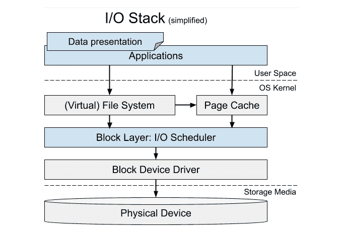
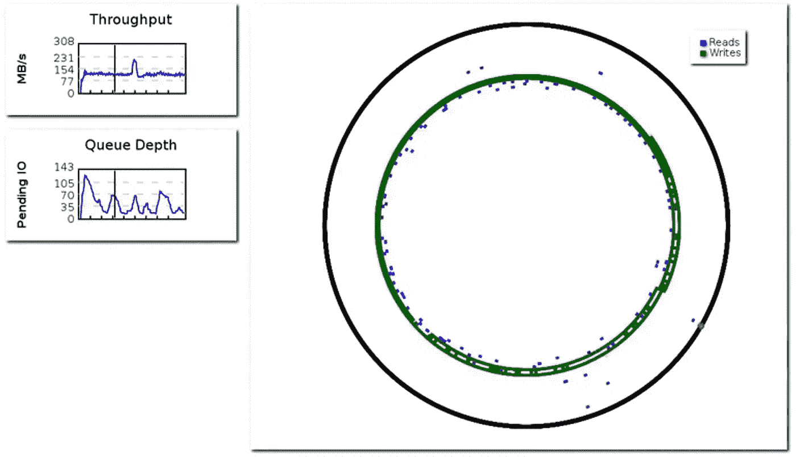

# 探索公共存储轨迹

> 原文：[`towardsdatascience.com/exploring-public-storage-traces-16ef7ac9e038?source=collection_archive---------6-----------------------#2024-01-26`](https://towardsdatascience.com/exploring-public-storage-traces-16ef7ac9e038?source=collection_archive---------6-----------------------#2024-01-26)

## 它们是什么？它们在哪里？它们适合你吗？

[](https://medium.com/@raluca.diaconu?source=post_page---byline--16ef7ac9e038--------------------------------)[](https://towardsdatascience.com/?source=post_page---byline--16ef7ac9e038--------------------------------) [Raluca Diaconu](https://medium.com/@raluca.diaconu?source=post_page---byline--16ef7ac9e038--------------------------------)

·发表于 [Towards Data Science](https://towardsdatascience.com/?source=post_page---byline--16ef7ac9e038--------------------------------) ·15 分钟阅读·2024 年 1 月 26 日

--


图片由 [Hongwei FAN](https://unsplash.com/@yokonoito0512?utm_source=medium&utm_medium=referral) 提供，来源于 [Unsplash](https://unsplash.com/?utm_source=medium&utm_medium=referral)

输入和输出（I/O）操作指的是计算机主内存与各种外部设备之间的数据传输。存储外设如硬盘（HDD）和固态硬盘（SSD）在延迟、吞吐量和速率方面具有特定的性能特征，这些特征可能会影响它们所驱动的计算机系统的性能。推而广之，[分布式和基于云的数据存储的性能和设计取决于介质的性能](https://static.googleusercontent.com/media/research.google.com/en//pubs/archive/44830.pdf)。本文旨在架起数据科学与存储系统之间的桥梁：1/ 我将分享一些来自不同来源和不同规模的数据集，希望这些数据集能为数据科学家带来新意；2/ 我将探讨分布式系统中高级分析的潜力。

# 介绍

存储访问轨迹是“[优化云工作负载的宝贵信息源](https://www.ibm.com/blog/object-storage-traces/)”。它们对于容量规划、数据放置、系统设计和评估至关重要，尤其适用于现代应用程序。在学术研究中，特别需要多样且更新的数据集来研究新颖且不直观的访问模式，这有助于设计新的硬件架构、新的缓存算法或硬件仿真。

存储追踪数据很难找到。[SNIA 网站](http://iotta.snia.org)是最著名的“存储相关 I/O 追踪文件、相关工具及其他相关信息的仓库”，但许多追踪数据并不符合它们的许可或上传格式。寻找追踪数据变成了一项繁琐的过程，需要扫描学术文献或尝试自己生成数据。

[流行的追踪数据](http://iotta.snia.org/traces/block-io/388)较容易找到，但通常是过时和过度使用的。由于应用工作负载和硬件能力的变化，10 年以上的追踪数据不应再用于现代的研究和开发。此外，过度使用特定的追踪数据可能会偏离对真实工作负载的理解，因此建议在可能的情况下使用来自多个独立来源的追踪数据。

本文是我最近找到并使用的公共追踪数据的有组织集合。在第一部分，我按它们在 I/O 堆栈中所代表的抽象级别对它们进行了分类。在第二部分，我列出了并讨论了一些相关的数据集。最后一部分是对所有内容的总结，并提供了我个人对存储追踪数据集中的空白部分的看法。

# 追踪数据类型

我根据数据表示和访问模型将追踪数据分为三种类型。让我解释一下。用户在应用层看到的数据以文件或对象的形式存储，可以通过如*打开*或*追加*等多种抽象操作来访问。接近介质的地方，数据存储在一个连续的内存地址空间中，并作为固定大小的块进行访问，这些块只能*读取*或*写入*。在更高的抽象级别，在应用层内，我们也可能有一个数据表示层，它可以记录对*数据表示单元*的访问，这些单元可能是组成表格和数据库的行，或组成新闻源的文章和段落。访问可能是*创建表*或*发布文章*。

虽然追踪数据可以从 I/O 堆栈的任何位置获取，并且包含来自多个层次的信息，但我选择根据下面显示的[Linux I/O 堆栈](https://www.thomas-krenn.com/en/wiki/Linux_Storage_Stack_Diagram)来构建以下分类。



I/O 堆栈图（改编自 [[1]](https://www.mimuw.edu.pl/~lichota/09-10/Optymalizacja-open-source/Materialy/10%20-%20Dysk/gelato_ICE06apr_blktrace_brunelle_hp.pdf)、[[2]](https://www.thomas-krenn.com/en/wiki/Linux_Storage_Stack_Diagram) 和 [[3]](https://www.researchgate.net/publication/317952281_Host_managed_contention_avoidance_storage_solutions_for_Big_Data)）

## **块存储追踪**

这些追踪数据代表了块层的操作。在 Linux 中，这些数据通常通过[blktrace](https://linux.die.net/man/8/blktrace)（并通过[blkparse](https://linux.die.net/man/1/blkparse)渲染为可读格式）、[iostat](https://www.man7.org/linux/man-pages/man1/iostat.1.html)或[dtrace](https://dtrace.org/about/)进行收集。追踪数据包含有关操作、设备、CPU、进程和存储位置的信息。列出的第一个追踪示例是 blktrace 的输出。

追踪程序生成的典型信息可能对于分析和发布目的来说过于详细，因此通常会进行简化。典型的公共追踪数据包含*操作*、*偏移量*、*大小*，有时还包括*时间信息*。在此层级，*操作*仅限于读写操作。每个操作访问从*偏移量*开始的地址，并应用于指定大小的连续内存（按块数计算，4KiB NTFS）。例如，读取操作的追踪条目包含读取开始的地址（偏移量）和读取的块数（大小）。时间信息可能包括请求发起的时间（*开始时间*）、完成时间（*结束时间*）、处理过程中的延迟（*延迟*）和请求等待的时间（*排队时间*）。

可用的追踪数据具有不同的特性，大小差异巨大，并且是各种工作负载的输出。选择合适的追踪数据将取决于你寻找的内容。例如，追踪重放只需要操作的顺序和大小；而性能分析则需要时间信息。



使用 iowatcher 进行磁盘访问可视化（[来源](https://www.heise.de/hintergrund/Kernel-Log-Nvidia-aktualisiert-Grafiktreiber-1677800.html?seite=2)）

## **对象存储追踪数据**

在应用层，数据位于文件和对象中，可以创建、打开、附加或关闭，然后通过树状结构进行发现。从用户的角度来看，存储介质是解耦的，隐藏了碎片化问题，并且允许随机字节访问。

尽管文件和对象追踪数据之间存在微妙的差异，我会将它们归为一类。文件遵循文件系统的命名约定，通常是结构化的（通常是分层的）。文件的扩展名通常会暗示文件的内容类型和用途。另一方面，对象用于处理大量不同数据的大规模存储系统。在对象存储系统中，结构不是固有的，而是由用户通过特定的元数据文件以及他们的工作负载外部定义的。

由于对象追踪是在应用程序空间内生成的，通常是应用程序日志机制的结果，因此在格式和内容方面更加多样化。记录的信息可能更具体，例如，*操作*还可以是*删除*、*复制*或*追加*。对象通常具有可变的*大小*，即使是同一个对象的大小，经过追加和覆盖后也可能随时间发生变化。*对象标识符*可以是一个大小可变的字符串，可能会编码额外的信息，例如指示内容类型的扩展名。其他*元信息*可能来自访问的范围，例如，它可以告诉我们是访问了图像、Parquet 或 CSV 文件的头部、尾部还是主体。

对象存储追踪更适合用于理解用户访问模式。在块访问方面，视频流和对整个文件的顺序读取生成相同的模式：在规律的时间间隔内执行多个顺序 IO。但如果我们要重放这些追踪数据，应该对这些追踪项做不同的处理。访问视频流的块需要保持相同的时间间隔，而不管每个块的延迟；而读取整个文件应该尽快完成。

## **访问追踪**

针对每个应用，数据可能会进一步抽象化。数据单元可以是类的实例、数据库中的记录或文件中的范围。单次数据访问如果涉及缓存，甚至可能不会生成文件打开或磁盘 IO。我选择包含这些追踪数据，因为它们可能被用来理解和优化存储访问，特别是云存储。例如，Twitter Memcache 的访问追踪数据有助于理解流行度分布，因此可能对数据格式化和放置决策有帮助。通常这些并不是存储追踪本身，但在缓存模拟、IO 减少或数据布局（索引）等上下文中，它们可以非常有用。

这些追踪数据的格式可以更加多样化，因为引入了新的抽象层，例如，通过 Memcached 中的推文标识符。

# 追踪示例

让我们来看一下上述每个类别中的一些追踪数据。该列表详细列出了部分较新的追踪数据——不超过 10 年——但绝不是详尽无遗的。

## **块追踪**

**YCSB RocksDB SSD 2020**

这些是收集自一台 28 核、128 GB 主机上的 SSD 追踪数据，该主机配有*两块 512 GB NVMe SSD 硬盘*，并运行 Ubuntu 操作系统。该数据集是通过运行[YCSB-0.15.0 基准测试](https://en.wikipedia.org/wiki/YCSB)和[RocksDB](https://rocksdb.org/docs/support/faq.html)生成的。

第一块 SSD 存储所有的 blktrace 输出，而第二块则托管 YCSB 和 RocksDB。YCSB 工作负载 A 由 50%的读取和 50%的更新组成，涉及 250M 条记录的 10 亿次操作。运行时为 9.7 小时，生成了超过 3.52 亿个文件系统级的块 I/O 请求，总共写入了 6.8 TB 数据，读取吞吐量为 90 MBps，写入吞吐量为 196 MBps。

与列表中的所有其他数据集相比，这个数据集较小，工作负载有限，但由于其可管理的大小，是一个很好的起点。另一个优点是可复现性：它使用开源追踪工具和基于相对便宜硬件设置的基准测试平台。

**格式：** 这些是通过`blktrace`捕获的 SSD 痕迹，在使用`blkparse`解析后具有典型格式：[设备主编号,设备次编号] [CPU 核心 ID] [记录 ID] [时间戳（以纳秒为单位）] [进程 ID] [追踪操作] [操作类型] [扇区号 + I/O 大小] [进程名称]

```py
259,2    0        1     0.000000000  4020  Q   R 282624 + 8 [java]
259,2    0        2     0.000001581  4020  G   R 282624 + 8 [java]
259,2    0        3     0.000003650  4020  U   N [java] 1
259,2    0        4     0.000003858  4020  I  RS 282624 + 8 [java]
259,2    0        5     0.000005462  4020  D  RS 282624 + 8 [java]
259,2    0        6     0.013163464     0  C  RS 282624 + 8 [0]
259,2    0        7     0.013359202  4020  Q   R 286720 + 128 [java]
```

**获取方式：** [`iotta.snia.org/traces/block-io/28568`](http://iotta.snia.org/traces/block-io/28568)

**许可证：** [SNIA 追踪数据文件下载许可证](http://iotta.snia.org/repository/download_license)

**阿里巴巴区块痕迹 2020**

数据集由“从 1000 个卷中收集的块级 I/O 请求组成，每个卷的原始容量从 40 GiB 到 5 TiB 不等。工作负载涵盖了多种类型的云应用。每个收集的 I/O 请求指定了卷号、请求类型、请求偏移、请求大小和时间戳。”

**限制**（来自[学术论文](http://www.cse.cuhk.edu.hk/~pclee/www/pubs/iiswc20.pdf)）

+   这些痕迹未记录 I/O 请求的响应时间，因此不适合进行 I/O 请求的延迟分析。

+   没有提及运行在其上的特定应用，因此无法提取应用工作负载及其 I/O 模式。

+   这些痕迹捕获了对虚拟设备的访问，因此不能代表物理块存储设备的性能和可靠性（例如，数据放置和故障统计）。

这个数据集的缺点是其大小。解压后生成一个 751GB 的文件，难以存储和管理。

**格式：** `device_id,opcode,offset,length,timestamp`

+   `device_id`虚拟磁盘的 ID，`uint32`

+   `opcode`‘R’或‘W’，表示该操作是读取或写入

+   `offset`此操作的偏移量，单位为字节，`uint64`

+   `length`此操作的长度，单位为字节，`uint32`

+   `timestamp`服务器接收到的此操作的时间戳，单位为微秒，`uint64`

```py
419,W,8792731648,16384,1577808144360767
725,R,59110326272,360448,1577808144360813
12,R,350868463616,8192,1577808144360852
725,R,59110686720,466944,1577808144360891
736,R,72323657728,516096,1577808144360996
12,R,348404277248,8192,1577808144361031
```

此外，还有一个额外的文件，包含每个虚拟设备的 ID `device_id`及其总容量。

**获取方式：** [`github.com/alibaba/block-traces`](https://github.com/alibaba/block-traces)

**许可证：** [CC-4.0](https://creativecommons.org/licenses/by/4.0/)。

**腾讯区块存储 2018**

该数据集包含“来自一个生产云块存储系统（CBS）仓库（也称为故障域）的 216 个 I/O 痕迹。这些痕迹是来自 5584 个云虚拟卷（CVV）的 I/O 请求，时间跨度为十天（从 2018 年 10 月 1 日到 10 月 10 日）。来自这些 CVV 的 I/O 请求被映射并重定向到由 40 个存储节点（即磁盘）组成的存储集群。”

限制：

+   时间戳的单位是秒，这对于确定操作的顺序来说粒度过小。因此，许多请求看起来像是同时发出的。因此，此跟踪不适用于排队分析。

+   没有关于每个操作持续时间的延迟信息，因此该跟踪不适用于延迟性能或排队分析。

+   没有关于每个卷的额外信息，例如总大小。

**格式:** `Timestamp,Offset,Size,IOType,VolumeID`

+   `Timestamp`是 I/O 请求发出的 Unix 时间戳，单位为秒。

+   `Offset`是逻辑虚拟卷起始位置的 I/O 偏移量，以扇区为单位。1 个扇区 = 512 字节

+   `Size`是 I/O 请求的传输大小，以扇区为单位。

+   `IOType`表示“读取(0)”或“写入(1)”。

+   `VolumeID`是 CVV 的 ID 号。

```py
1538323200,12910952,128,0,1063
1538323200,6338688,8,1,1627
1538323200,1904106400,384,0,1360
1538323200,342884064,256,0,1360
1538323200,15114104,8,0,3607
1538323200,140441472,32,0,1360
1538323200,15361816,520,1,1371
1538323200,23803384,8,0,2363
1538323200,5331600,4,1,3171
```

**在哪里找到它:** [`iotta.snia.org/traces/parallel/27917`](http://iotta.snia.org/traces/parallel/27917)

**许可协议:** [NIA Trace Data Files Download License](http://iotta.snia.org/repository/download_license)

**K5cloud 跟踪 2018**

该数据集包含来自富士通 K5 云服务的虚拟云存储跟踪数据。数据收集历时一周，但并非连续收集，因为“某一天的 I/O 访问日志通常会消耗捕获系统的存储容量。”该数据集包含来自 3088 个虚拟存储节点的 240 亿条记录。

数据通过 TCP/IP 网络在运行在虚拟化平台上的服务器和位于日本 K5 数据中心的存储系统之间捕获。数据按每个虚拟存储卷 ID 分为三个数据集。每个数据集中的每个虚拟存储卷 ID 是唯一的，而不同数据集之间的虚拟存储卷 ID 并非唯一。

限制：

+   没有延迟信息，因此无法用于性能分析。

+   总节点大小缺失，但可以通过跟踪中访问的最大偏移量来近似估算。

+   一些应用程序可能需要完整的数据集，而由于数据缺失，本数据集不适合此类需求。

I/O 访问日志中的字段包括：`ID,Timestamp,Type,Offset,Length`

+   `ID`是虚拟存储卷 ID。

+   `Timestamp`是从所有 I/O 访问日志的第一个 I/O 请求开始以来的时间，单位为秒，但粒度为微秒。

+   `Type`表示读取（R）或写入（W）。

+   `Offset`是虚拟存储起始位置的 I/O 访问偏移量，以字节为单位。

+   `Length`是 I/O 请求的传输大小，以字节为单位。

```py
1157,3.828359000,W,7155568640,4096
1157,3.833921000,W,7132311552,8192
1157,3.841602000,W,15264690176,28672
1157,3.842341000,W,28121042944,4096
1157,3.857702000,W,15264718848,4096
1157,9.752752000,W,7155568640,4096
```

**在哪里找到它:** [`iotta.snia.org/traces/parallel/27917`](http://iotta.snia.org/traces/parallel/26663)

**许可协议:** [CC-4.0](https://creativecommons.org/licenses/by/4.0/)。

## **对象跟踪**

**服务器端 I/O 请求到达跟踪 2019**

该存储库包含两个 I/O 块跟踪数据集，附加了文件标识符：1/ 并行文件系统（PFS）和 2/ I/O 节点。

注：

+   访问模式源自于在 [MPI-IO 测试基准](https://www.intel.com/content/www/us/en/developer/articles/technical/intel-mpi-benchmarks.html)上运行的测试，该基准在 [Grid5000](https://www.grid5000.fr/w/Grid5000:Home) 上执行，后者是一个大规模的并行和高性能计算（HPC）测试平台。这些追踪数据并不代表一般用户或云端工作负载，而是特定于 HPC 和并行计算的。

+   PFS 场景的配置使用 [Orange FS](https://orangefs.org/) 作为文件系统，I/O 节点则使用 I/O 转发可扩展性层 ([IOFSL](https://www.anl.gov/mcs/iofsl-io-forwarding-scalability-layer))。在这两种情况下，调度器都被设置为 AGIOS I/O 调度库。此配置可能对于本文所针对的大多数用例来说过于具体，旨在反映一些提出的解决方案。

+   PFS 的硬件配置由我们服务器节点组成，每个节点配备 600 GB 硬盘和 64 个客户端节点。对于 I/O 节点，它包括四个具有类似磁盘配置的服务器节点组成的集群，以及一个不同集群中的 32 个客户端节点。

**格式：** 两个数据集的格式略有不同，这是由于不同文件系统的产物。对于 I/O 节点，它由多个文件组成，每个文件包含制表符分隔的值 `Timestamp FileHandle RequestType Offset Size`。一个特点是，读取和写入操作被分别存储在命名不同的文件中。

+   `Timestamp` 是表示内部时间戳的纳秒数。

+   `FileHandle` 是 64 位大小的十六进制文件句柄。

+   `RequestType` 是请求类型，反转表示，“W”表示读取，“R”表示写入。

+   `Offset` 是一个表示请求偏移量的字节数。

+   `Size` 是请求的字节大小。

```py
265277355663    00000000fbffffffffffff0f729db77200000000000000000000000000000000        W       2952790016      32768
265277587575    00000000fbffffffffffff0f729db77200000000000000000000000000000000        W       1946157056      32768
265277671107    00000000fbffffffffffff0f729db77200000000000000000000000000000000        W       973078528       32768
265277913090    00000000fbffffffffffff0f729db77200000000000000000000000000000000        W       4026531840      32768
265277985008    00000000fbffffffffffff0f729db77200000000000000000000000000000000        W       805306368       32768
```

PFS 场景中有两个并发应用程序，“app1”和“app2”，其追踪数据位于一个相应命名的文件夹内。每一行条目的格式如下：[<Timestamp>] REQ SCHED SCHEDULING, handle:<FileHandle>, queue_element: <QueueElement>, type: <RequestType>, offset: <Offset>, len: <Size>。与上述不同的是：

+   `RequestType` 为 0 表示读取，1 表示写入。

+   `QueueElement` 从未使用过，我认为它是追踪工具的产物。

```py
[D 01:11:03.153625] REQ SCHED SCHEDULING, handle: 5764607523034233445, queue_element: 0x12986c0, type: 1, offset: 369098752, len: 1048576 
[D 01:11:03.153638] REQ SCHED SCHEDULING, handle: 5764607523034233445, queue_element: 0x1298e30, type: 1, offset: 268435456, len: 1048576 
[D 01:11:03.153651] REQ SCHED SCHEDULING, handle: 5764607523034233445, queue_element: 0x1188b80, type: 1, offset: 0, len: 1048576 
[D 01:11:03.153664] REQ SCHED SCHEDULING, handle: 5764607523034233445, queue_element: 0xf26340, type: 1, offset: 603979776, len: 1048576 
[D 01:11:03.153676] REQ SCHED SCHEDULING, handle: 5764607523034233445, queue_element: 0x102d6e0, type: 1, offset: 637534208, len: 1048576 
```

**在哪里可以找到：** [`zenodo.org/records/3340631#.XUNa-uhKg2x`](https://zenodo.org/records/3340631#.XUNa-uhKg2x)

**许可协议：** [CC-4.0](https://creativecommons.org/licenses/by/4.0/)。

**IBM Cloud Object Store 2019**

这些是来自 IBM Cloud Object Storage 服务的匿名化追踪数据，主要用于研究数据流向对象存储的情况。

该数据集由 98 个追踪组成，包含约 16 亿个请求，涉及 342 百万个独特的对象。追踪本身约为 88GB。每个追踪包含在 2019 年某一周内针对 IBM Cloud Object Storage 中的单个桶发出的 REST 操作。每个追踪包含从 22,000 到 187,000,000 个对象请求。所有追踪数据均在 2019 年同一周内收集。追踪数据包含了一个服务租户在一周内发出的所有数据访问请求。对象名称已进行匿名化处理。

工作负载的一些特征已在[本文](https://www.usenix.org/system/files/hotstorage20_paper_eytan.pdf)中发布，尽管使用的数据集更大：

+   作者“能够识别一些工作负载为 SQL 查询、深度学习工作负载、自然语言处理（NLP）、Apache Spark 数据分析以及文档和媒体服务器。但许多工作负载的类型仍然未知。”

+   “追踪中的大多数对象（85%）都较小。”

    小于 1MB，但这些对象仅占总存储容量的 3%。

    “存储容量的 3%。”这使得该数据适合进行缓存分析。

**格式**：`<请求时间戳> <请求类型> <对象 ID> <可选：对象大小> <可选：起始偏移> <可选：结束偏移>` 时间戳是从开始收集追踪数据的时刻起的毫秒数。

```py
1219008 REST.PUT.OBJECT 8d4fcda3d675bac9 1056
1221974 REST.HEAD.OBJECT 39d177fb735ac5df 528
1232437 REST.HEAD.OBJECT 3b8255e0609a700d 1456
1232488 REST.GET.OBJECT 95d363d3fbdc0b03 1168 0 1167
1234545 REST.GET.OBJECT bfc07f9981aa6a5a 528 0 527
1256364 REST.HEAD.OBJECT c27efddbeef2b638 12752
1256491 REST.HEAD.OBJECT 13943e909692962f 9760
```

**获取地址**：[`iotta.snia.org/traces/key-value/36305`](http://iotta.snia.org/traces/key-value/36305)

**许可证**：[SNIA 追踪数据文件下载许可证](http://iotta.snia.org/repository/download_license)

## **访问追踪**

**维基分析数据集 2019**

维基数据集包含了 1/ Wikimedia 的上传（图片）Web 请求数据和 2/ Wikipedia 的一个 CDN 缓存服务器的文本（HTML 页面浏览）Web 请求数据。最新的数据集来自 2019 年，包含 21 个上传数据文件和 21 个文本数据文件。

**格式**：每个上传数据文件，标记为`cache-u`，包含连续 24 小时的数据。这些文件的大小大约为 1.5GB，每个文件解压后的数据大约为 4GB。

该数据集来源于单一类型的工作负载，这可能限制其适用性，但由于其数据量大且完整，因此成为一个很好的测试平台。

每个解压后的上传数据文件具有以下格式：`relative_unix hashed_path_query image_type response_size time_firstbyte`

+   `relative_unix`: 自数据集开始时间戳以来的秒数，类型为整数

+   `hashed_path_query`: 请求路径和查询的加盐哈希值，类型为大整数

+   `image_type`: 响应的 Content-Type 头中的图片类型，类型为字符串

+   `response_size`: 响应大小（字节数），类型为整数

+   `time_firstbyte`: 第一个字节的时间，单位为秒，类型为双精度浮点数

```py
0 833946053 jpeg 9665 1.85E-4
0 -1679404160 png 17635 2.09E-4
0 -374822678 png 3333 2.18E-4
0 -1125242883 jpeg 4733 1.57E-4
```

每个文本数据文件，标记为`cache-t`，包含连续 24 小时的数据。这些文件的大小大约为 100MB，每个文件解压后的数据大约为 300MB。

每个解压上传的数据文件具有以下格式：`relative_unix hashed_host_path_query response_size time_firstbyte`

```py
4619 540675535 57724 1.92E-4
4619 1389231206 31730 2.29E-4
4619 -176296145 20286 1.85E-4
4619 74293765 14154 2.92E-4
```

**在哪里可以找到**：[`wikitech.wikimedia.org/wiki/Analytics/Data_Lake/Traffic/Caching`](https://wikitech.wikimedia.org/wiki/Analytics/Data_Lake/Traffic/Caching)

**许可证**：[CC-4.0](https://creativecommons.org/licenses/by/4.0/)。

## Memcached 2020

该数据集包含来自 Twitter 内存缓存的为期一周的追踪数据（[Twemcache](https://github.com/twitter/twemcache) / [Pelikan](https://github.com/twitter/pelikan)）集群。数据来自 2020 年 3 月的 54 个最大集群，来自 Twitter 生产环境的匿名化缓存请求追踪记录。

**格式**：每个追踪文件是一个 CSV 文件，格式为：`timestamp,anonymized key,key size,value size,client id,operation,TTL`

+   `时间戳`：缓存接收请求的时间，单位为秒

+   `匿名化密钥`：经过匿名化处理的原始密钥，其中命名空间得以保留；例如，如果匿名化后的密钥是`nz:u:eeW511W3dcH3de3d15ec`，那么前两个字段`nz`和`u`是命名空间，注意命名空间不一定以`:`分隔，不同的工作负载使用不同的分隔符，并且命名空间的数量不同。

+   `键大小`：键的大小，单位为字节

+   `值大小`：值的大小，单位为字节

+   `客户端 ID`：发送请求的匿名化客户端（前端服务）

+   `操作`：操作类型，包括 get/gets/set/add/replace/cas/append/prepend/delete/incr/decr

+   `TTL`：客户端设置的对象生存时间（TTL），如果请求不是写入请求，则为 0。

```py
0,q:q:1:8WTfjZU14ee,17,213,4,get,0
0,yDqF:3q:1AJrrJ1nnCJKKrnGx1A,27,27,5,get,0
0,q:q:1:8WTw2gCuJe8,17,720,6,get,0
0,yDqF:vS:1AJr9JnArxCJGxn919K,27,27,7,get,0
0,yDqF:vS:1AJrrKG1CAnr1C19KxC,27,27,8,get,0
```

**许可证**：[CC-4.0](https://creativecommons.org/licenses/by/4.0/)。

# 结论

如果你还在这里，并且没有进入上面链接的某个追踪记录，可能是因为你还没有找到你要寻找的内容。当前存储追踪记录仍然存在一些空白：

+   **多租户云存储**：大型云存储提供商存储了一些最丰富的数据集。它们的工作负载反映了大规模系统的架构，并且是各种应用程序的结果。存储提供商在共享这些数据时也非常谨慎。共享数据给公众的财务激励很小或根本没有，同时也担心[意外客户数据泄露](https://arxiv.org/abs/cs/0610105)。

+   **完整栈**：栈中的每一层都提供了对访问模式的不同视角，单独看任何一层都不足以理解存储系统中的因果关系。优化一个系统以适应现代工作负载需要全面的视角，涉及数据访问的各个方面，而这些信息并未公开。

+   **分布式追踪**。如今，大多数数据是远程访问的，并且管理在大规模的分布式系统中。许多组件和层次（如索引或缓存）会改变访问模式。在这样的环境下，端到端的追踪意味着在复杂架构中的多个组件之间追踪一个请求。这些数据对于设计大规模系统来说非常有价值，但与此同时，它们可能过于特定于被检查的系统，这又限制了发布数据的动力。

+   **数据质量**。上面的痕迹由于所代表的细节级别存在一定的局限性。如我们所见，有些数据缺失，有些时间戳的粒度较大，其他的则过于庞大，不方便使用。数据清理是一个繁琐的过程，限制了目前数据集的发布。
