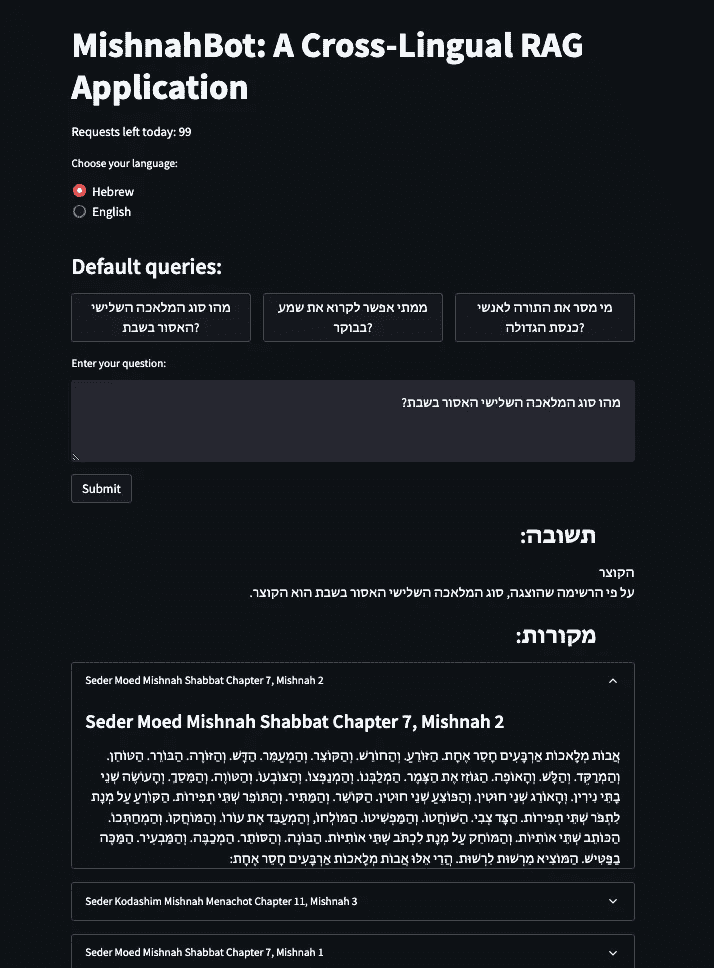
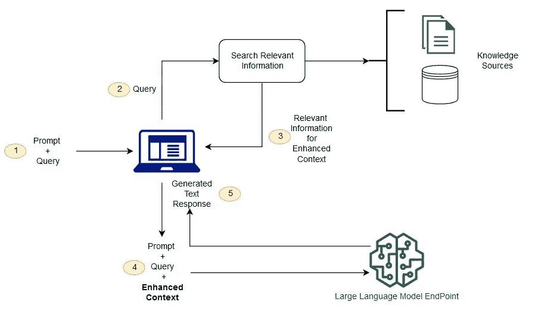
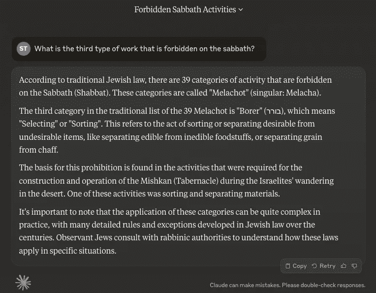
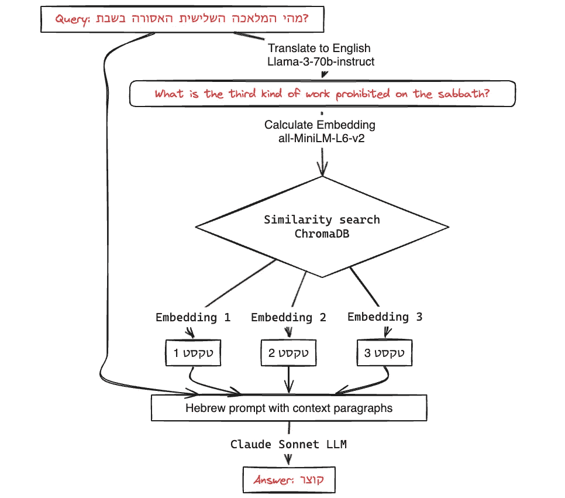

# 探索跨语言的 RAG 应用：与《密示拿》对话

> 原文：[`towardsdatascience.com/exploring-rag-applications-across-languages-conversing-with-the-mishnah-16615c30f780?source=collection_archive---------6-----------------------#2024-05-23`](https://towardsdatascience.com/exploring-rag-applications-across-languages-conversing-with-the-mishnah-16615c30f780?source=collection_archive---------6-----------------------#2024-05-23)

## 为拉比经典文本构建跨语言 RAG 系统

[](https://medium.com/@stannor?source=post_page---byline--16615c30f780--------------------------------)[](https://towardsdatascience.com/?source=post_page---byline--16615c30f780--------------------------------) [Shlomo Tannor](https://medium.com/@stannor?source=post_page---byline--16615c30f780--------------------------------)

·发表于[Towards Data Science](https://towardsdatascience.com/?source=post_page---byline--16615c30f780--------------------------------) ·阅读时间 15 分钟·2024 年 5 月 23 日

--


机器人学习《密示拿》。图片来源：DALL-E-3。

# 引言：

我很高兴在这篇文章中分享我构建一个独特的检索增强生成（RAG）应用程序的过程，旨在与拉比经典文本进行互动。MishnahBot 旨在为学者和普通用户提供一种直观的方式，交互式地查询和探索《密示拿》¹。它可以帮助解决诸如快速查找相关源文本或总结复杂的宗教法律辩论、提炼关键结论等问题。

几年前，我就有了这个项目的想法，但当时觉得技术还不成熟。现在，随着大型语言模型和 RAG 能力的进步，已经变得相当简单。

这就是我们最终产品的样子，您可以在[这里](http://mishnahbot.us)试用：



[MishnahBot](http://mishnahbot.us)网站。图像来源：作者。

# 那么，RAG 系统为何如此备受关注呢？

RAG 应用正在获得广泛关注，因其能提高准确性并利用大型语言模型（LLM）的推理能力。想象一下，能够与您的图书馆、同一制造商的汽车手册集合或税务文件进行对话。你可以提出问题，并根据大量专业知识获得答案。



典型 RAG 系统架构的示意图。来源：[Amazon AWS Documentation](https://aws.amazon.com/what-is/retrieval-augmented-generation/#:~:text=Retrieval%2DAugmented%20Generation%20(RAG),sources%20before%20generating%20a%20response.)。

# **RAG 与增加上下文长度的优缺点**

在改进语言模型交互方面，有两种新兴趋势：检索增强生成（RAG）和增加上下文长度，可能通过允许非常长的文档作为附件来实现。

RAG 系统的一个关键优势是成本效益。使用 RAG，你可以在不大幅增加查询成本的情况下处理大规模的上下文，而查询成本的增加可能会非常昂贵。此外，RAG 更具模块化，允许你与不同的知识库和 LLM 提供商进行“即插即用”。另一方面，直接在语言模型中增加上下文长度是一个令人兴奋的发展，它可以使在单次交互中处理更长的文本成为可能。

# 设置

对于这个项目，我使用了 AWS SageMaker 作为开发环境，AWS Bedrock 来访问各种 LLM，并使用 LangChain 框架来管理管道。这两个 AWS 服务都非常易于使用，只按使用的资源收费，因此我强烈鼓励你们自己尝试。对于 Bedrock，你需要申请访问 Llama 3 70b Instruct 和 Claude Sonnet。

让我们打开一个新的 Jupyter notebook，并安装我们将使用的软件包：

```py
!pip install chromadb tqdm langchain chromadb sentence-transformers
```

# 数据集

本项目的数据集是《米示那》，一部在犹太传统中占有核心地位的古老拉比文献。我选择这部文献是因为它与我个人有很大关系，同时也是语言模型的一个挑战，因为它是一个小众话题。数据集来自于[Sefaria-Export](https://github.com/Sefaria/Sefaria-Export) 仓库²，这是一个拉比文献的宝库，包含与原始希伯来文对齐的英文翻译。这种对齐便于在我们 RAG 应用的不同步骤中切换语言。

*注意：这里应用的相同过程可以应用于您选择的任何其他文本集合。这个例子还演示了 RAG 技术如何跨不同语言使用，正如本例中使用希伯来语所示。*

# 让我们深入了解

# 1. 加载数据集

首先，我们需要下载相关数据。由于完整的仓库相当大，我们将使用 git sparse-checkout。打开终端窗口并运行以下命令。

```py
git init sefaria-json
cd sefaria-json
git sparse-checkout init --cone
git sparse-checkout set json
git remote add origin https://github.com/Sefaria/Sefaria-Export.git
git pull origin master
```

```py
tree Mishna/ | less
```

然后……瞧！我们现在拥有了所需的数据文件：

```py
Mishnah
├── Seder Kodashim
│   ├── Mishnah Arakhin
│   │   ├── English
│   │   │   └── merged.json
│   │   └── Hebrew
│   │       └── merged.json
│   ├── Mishnah Bekhorot
│   │   ├── English
│   │   │   └── merged.json
│   │   └── Hebrew
│   │       └── merged.json
│   ├── Mishnah Chullin
│   │   ├── English
│   │   │   └── merged.json
│   │   └── Hebrew
│   │       └── merged.json
```

现在让我们在 Jupyter notebook 环境中加载文档：

```py
import os
import json
import pandas as pd
from tqdm import tqdm

# Function to load all documents into a DataFrame with progress bar
def load_documents(base_path):
    data = []
    for seder in tqdm(os.listdir(base_path), desc="Loading Seders"):
        seder_path = os.path.join(base_path, seder)
        if os.path.isdir(seder_path):
            for tractate in tqdm(os.listdir(seder_path), desc=f"Loading Tractates in {seder}", leave=False):
                tractate_path = os.path.join(seder_path, tractate)
                if os.path.isdir(tractate_path):
                    english_file = os.path.join(tractate_path, "English", "merged.json")
                    hebrew_file = os.path.join(tractate_path, "Hebrew", "merged.json")
                    if os.path.exists(english_file) and os.path.exists(hebrew_file):
                        with open(english_file, 'r', encoding='utf-8') as ef, open(hebrew_file, 'r', encoding='utf-8') as hf:
                            english_data = json.load(ef)
                            hebrew_data = json.load(hf)
                            for chapter_index, (english_chapter, hebrew_chapter) in enumerate(zip(english_data['text'], hebrew_data['text'])):
                                for mishnah_index, (english_paragraph, hebrew_paragraph) in enumerate(zip(english_chapter, hebrew_chapter)):
                                    data.append({
                                        "seder": seder,
                                        "tractate": tractate,
                                        "chapter": chapter_index + 1,
                                        "mishnah": mishnah_index + 1,
                                        "english": english_paragraph,
                                        "hebrew": hebrew_paragraph
                                    })
    return pd.DataFrame(data)
# Load all documents
base_path = "Mishnah"
df = load_documents(base_path)
# Save the DataFrame to a file for future reference
df.to_csv(os.path.join(base_path, "mishnah_metadata.csv"), index=False)
print("Dataset successfully loaded into DataFrame and saved to file.")
```

看看数据：

```py
df.shape
(4192, 7)

print(df.head()[["tractate", "mishnah", "english"]])
tractate  mishnah                                            english
0  Mishnah Arakhin        1  <b>Everyone takes</b> vows of <b>valuation</b>...
1  Mishnah Arakhin        2  With regard to <b>a gentile, Rabbi Meir says:<...
2  Mishnah Arakhin        3  <b>One who is moribund and one who is taken to...
3  Mishnah Arakhin        4  In the case of a pregnant <b>woman who is take...
4  Mishnah Arakhin        1  <b>One cannot be charged for a valuation less ...
```

看起来不错，我们可以进入向量数据库阶段了。

# 2. 向量化并存储到 ChromaDB 中

接下来，我们将文本向量化并将其存储在本地 ChromaDB 中。简而言之，思路是将文本表示为密集向量——数字数组——这样语义上相似的文本将在向量空间中彼此“接近”。这项技术将使我们能够在给定查询时检索相关的段落。

我们选择了一个轻量级的向量化模型`all-MiniLM-L6-v2`，它可以在 CPU 上高效运行。这个模型在性能和资源效率之间提供了良好的平衡，适用于我们的应用程序。虽然像 OpenAI 的`text-embedding-3-large`等最先进的模型可能提供更优的性能，但它们需要大量计算资源，通常需要在 GPU 上运行。

想了解有关嵌入模型及其性能的更多信息，可以参考[MTEB 排行榜](https://huggingface.co/spaces/mteb/leaderboard)，该排行榜比较了多种文本嵌入模型在多个任务上的表现。

这是我们将用于向量化的代码（在 CPU 机器上运行时应该只需几分钟）：

```py
import numpy as np
from sentence_transformers import SentenceTransformer
import chromadb
from chromadb.config import Settings
from tqdm import tqdm

# Initialize the embedding model
model = SentenceTransformer('all-MiniLM-L6-v2', device='cpu')
# Initialize ChromaDB
chroma_client = chromadb.Client(Settings(persist_directory="chroma_db"))
collection = chroma_client.create_collection("mishnah")
# Load the dataset from the saved file
df = pd.read_csv(os.path.join("Mishnah", "mishnah_metadata.csv"))
# Function to generate embeddings with progress bar
def generate_embeddings(paragraphs, model):
    embeddings = []
    for paragraph in tqdm(paragraphs, desc="Generating Embeddings"):
        embedding = model.encode(paragraph, show_progress_bar=False)
        embeddings.append(embedding)
    return np.array(embeddings)
# Generate embeddings for English paragraphs
embeddings = generate_embeddings(df['english'].tolist(), model)
df['embedding'] = embeddings.tolist()
# Store embeddings in ChromaDB with progress bar
for index, row in tqdm(df.iterrows(), desc="Storing in ChromaDB", total=len(df)):
    collection.add(embeddings=[row['embedding']], documents=[row['english']], metadatas=[{
        "seder": row['seder'],
        "tractate": row['tractate'],
        "chapter": row['chapter'],
        "mishnah": row['mishnah'],
        "hebrew": row['hebrew']
    }])
print("Embeddings and metadata successfully stored in ChromaDB.")
```

# 3\. 用英语创建我们的 RAG

有了准备好的数据集，我们现在可以用英语创建我们的检索增强生成（RAG）应用程序。为此，我们将使用 LangChain，一个强大的框架，提供了统一的接口来处理各种语言模型操作和集成，使得构建复杂应用变得更加容易。

LangChain 简化了集成不同组件（如语言模型（LLM）、检索器和向量存储）的过程。通过使用 LangChain，我们可以专注于应用程序的高级逻辑，而无需担心每个组件的底层复杂性。

这是设置我们 RAG 系统的代码：

```py
from langchain.chains import LLMChain, RetrievalQA
from langchain.llms import Bedrock
from langchain.prompts import PromptTemplate
from sentence_transformers import SentenceTransformer
import chromadb
from chromadb.config import Settings
from typing import List

# Initialize AWS Bedrock for Llama 3 70B Instruct
llm = Bedrock(
    model_id="meta.llama3-70b-instruct-v1:0"
)

# Define the prompt template
prompt_template = PromptTemplate(
    input_variables=["context", "question"],
    template="""
    Answer the following question based on the provided context alone:
    Context: {context}
    Question: {question}
    Answer (short and concise):
    """,
)

# Initialize ChromaDB
chroma_client = chromadb.Client(Settings(persist_directory="chroma_db"))
collection = chroma_client.get_collection("mishnah")

# Define the embedding model
embedding_model = SentenceTransformer('all-MiniLM-L6-v2', device='cpu')

# Define a simple retriever function
def simple_retriever(query: str, k: int = 3) -> List[str]:
    query_embedding = embedding_model.encode(query).tolist()
    results = collection.query(query_embeddings=[query_embedding], n_results=k)
    documents = results['documents'][0]  # Access the first list inside 'documents'
    sources = results['metadatas'][0]  # Access the metadata for sources
    return documents, sources

# Initialize the LLM chain
llm_chain = LLMChain(
    llm=llm,
    prompt=prompt_template
)

# Define SimpleQA chain
class SimpleQAChain:
    def __init__(self, retriever, llm_chain):
        self.retriever = retriever
        self.llm_chain = llm_chain

    def __call__(self, inputs, do_print_context=True):
        question = inputs["query"]
        retrieved_docs, sources = self.retriever(question)
        context = "\n\n".join(retrieved_docs)
        response = self.llm_chain.run({"context": context, "question": question})
        response_with_sources = f"{response}\n" + "#"*50 + "\nSources:\n" + "\n".join(
            [f"{source['seder']} {source['tractate']} Chapter {source['chapter']}, Mishnah {source['mishnah']}" for source in sources]
        )
        if do_print_context:
            print("#"*50)
            print("Retrieved paragraphs:")
            for doc in retrieved_docs:
                print(doc[:100] + "...")
        return response_with_sources

# Initialize and test SimpleQAChain
qa_chain = SimpleQAChain(retriever=simple_retriever, llm_chain=llm_chain)
```

# 解释：

1.  **AWS Bedrock Initialization：** 我们使用 Llama 3 70B Instruct 初始化 AWS Bedrock。这个模型将用于基于检索到的上下文生成响应。

1.  **Prompt Template：** 提示模板的定义是为了将上下文和问题格式化为 LLM 能够理解的结构。这有助于生成简洁且相关的答案。你可以随意尝试并根据需要调整模板。

1.  **Embedding Model：** 我们同样使用‘all-MiniLM-L6-v2’模型为查询生成嵌入。我们希望查询能与相关答案段落具有相似的表示方式。注意：为了提升检索性能，我们可以使用 LLM 来修改和优化用户查询，使其更接近 RAG 数据库的风格。

1.  **LLM Chain：** LangChain 中的`LLMChain`类用于管理 LLM 与检索到的上下文之间的互动。

1.  **SimpleQAChain：** 这个自定义类集成了检索器和 LLM 链。它检索相关段落，将其格式化为上下文，并生成答案。

好的！让我们试试看！我们将使用一个与《密西拿》第一段相关的查询。

```py
response = qa_chain({"query": "What is the appropriate time to recite Shema?"})

print("#"*50)
print("Response:")
print(response)
```

```py
##################################################
Retrieved paragraphs:
The beginning of tractate <i>Berakhot</i>, the first tractate in the first of the six orders of Mish...
<b>From when does one recite <i>Shema</i> in the morning</b>? <b>From</b> when a person <b>can disti...
Beit Shammai and Beit Hillel disputed the proper way to recite <i>Shema</i>. <b>Beit Shammai say:</b...
##################################################
Response:
 In the evening, from when the priests enter to partake of their teruma until the end of the first watch, or according to Rabban Gamliel, until dawn. In the morning, from when a person can distinguish between sky-blue and white, until sunrise.
##################################################
Sources:
Seder Zeraim Mishnah Berakhot Chapter 1, Mishnah 1
Seder Zeraim Mishnah Berakhot Chapter 1, Mishnah 2
Seder Zeraim Mishnah Berakhot Chapter 1, Mishnah 3
```

这看起来相当准确。

让我们尝试一个更复杂的问题：

```py
response = qa_chain({"query": "What is the third prohibited kind of work on the sabbbath?"})

print("#"*50)
print("Response:")
print(response)
```

```py
##################################################
Retrieved paragraphs:
They said an important general principle with regard to the sabbatical year: anything that is food f...
This fundamental mishna enumerates those who perform the <b>primary categories of labor</b> prohibit...
<b>Rabbi Akiva said: I asked Rabbi Eliezer with regard to</b> one who <b>performs multiple</b> prohi...
##################################################
Response:
 One who reaps.
##################################################
Sources:
Seder Zeraim Mishnah Sheviit Chapter 7, Mishnah 1
Seder Moed Mishnah Shabbat Chapter 7, Mishnah 2
Seder Kodashim Mishnah Keritot Chapter 3, Mishnah 10
```

非常好。

# 我们是否能通过直接查询 Claude 来实现同样的效果？

我试了一下，以下是我得到的结果：



Claude Sonnet 未能给出问题的确切答案。图像由作者提供。

回答冗长且不切题，给出的答案是错误的（*收获*是列表中的第三项，而*选择*是第七项）。这就是我们所说的*幻觉*。

尽管 Claude 是一个强大的语言模型，但仅依赖 LLM 从记忆化的训练数据生成回答，甚至通过互联网搜索生成答案，缺乏定制数据库在检索增强生成（RAG）应用中的精准性和控制力。原因如下：

1.  **精准性与上下文：**我们的 RAG 应用从定制数据库中检索精确的段落，确保高相关性和准确性。没有特定检索机制的 Claude，可能无法提供同样详细且具有上下文特定性的回答。

1.  **效率：**RAG 方法高效地处理大规模数据集，将检索与生成相结合，以保持精确且与上下文相关的答案。

1.  **性价比：**通过使用像 Llama 3 70B Instruct 这样相对较小的 LLM，我们能够在不需要每次查询都传送大量数据的情况下获得准确结果。这减少了使用更大、更占资源的模型所带来的成本。

这个结构化的检索过程确保用户获得最准确和最相关的答案，利用了大型语言模型（LLM）的语言生成能力和定制数据检索的精准性。

# 4. 跨语言 RAG 方法

最后，我们将解决与原始希伯来语文本进行交互的挑战。只要能够将文本翻译成英语以进行检索阶段，同样的方法可以应用于任何其他语言。

支持希伯来语交互增加了额外的复杂性，因为嵌入模型和大型语言模型（LLMs）在英语中通常表现得更强。虽然一些嵌入模型和 LLMs 支持希伯来语，但它们通常不如英语模型强大，尤其是那些较小的嵌入模型，在训练过程中可能更多地集中在英语上。

为了解决这个问题，我们可以训练自己的希伯来语嵌入模型。然而，另一种实际的方法是利用文本的一次性翻译为英语，并使用英语嵌入进行检索过程。通过这种方式，我们既能从英语模型的强大性能中受益，又能支持希伯来语的交互。

# 处理步骤



跨语言 RAG 架构图。图片来源：作者。

在我们的案例中，我们已经有了《密士拿》文本的专业英文翻译。我们将利用这些翻译确保准确的检索，同时保持希伯来语回答的完整性。以下是我们如何设置这个跨语言 RAG 系统的方式：

1.  **用希伯来语输入查询：**用户可以用希伯来语输入他们的查询。

1.  **将查询翻译为英语：**我们使用 LLM 将希伯来语查询翻译成英语。

1.  **嵌入查询：**然后将翻译后的英语查询进行嵌入。

1.  **使用英文嵌入查找相关文档：** 我们使用英文嵌入来查找相关文档。

1.  **使用英文嵌入检索相关希伯来文本：** 检索到相应的希伯来文本作为上下文。基本上，我们将英文文本作为*键*，将希伯来文本作为检索操作中的相应*值*。

1.  **使用 LLM 用希伯来语回应：** LLM 使用希伯来语上下文生成希伯来语回应。

对于生成，我们使用 Claude Sonnet，因为它在处理希伯来文本时比 Llama 3 表现得更好。

这是代码实现：

```py
from langchain.chains import LLMChain, RetrievalQA
from langchain.llms import Bedrock
from langchain_community.chat_models import BedrockChat
from langchain.prompts import PromptTemplate
from sentence_transformers import SentenceTransformer
import chromadb
from chromadb.config import Settings
from typing import List
import re

# Initialize AWS Bedrock for Llama 3 70B Instruct with specific configurations for translation
translation_llm = Bedrock(
    model_id="meta.llama3-70b-instruct-v1:0",
    model_kwargs={
        "temperature": 0.0,  # Set lower temperature for translation
        "max_gen_len": 50  # Limit number of tokens for translation
    }
)

# Initialize AWS Bedrock for Claude Sonnet with specific configurations for generation
generation_llm = BedrockChat(
    model_id="anthropic.claude-3-sonnet-20240229-v1:0"
)

# Define the translation prompt template
translation_prompt_template = PromptTemplate(
    input_variables=["text"],
    template="""Translate the following Hebrew text to English:
    Input text: {text}
    Translation: 
    """
)

# Define the prompt template for Hebrew answers
hebrew_prompt_template = PromptTemplate(
    input_variables=["context", "question"],
    template="""ענה על השאלה הבאה בהתבסס על ההקשר המסופק בלבד:
    הקשר: {context}
    שאלה: {question}
    תשובה (קצרה ותמציתית):
    """
)

# Initialize ChromaDB
chroma_client = chromadb.Client(Settings(persist_directory="chroma_db"))
collection = chroma_client.get_collection("mishnah")

# Define the embedding model
embedding_model = SentenceTransformer('all-MiniLM-L6-v2', device='cpu')

# Translation chain for translating queries from Hebrew to English
translation_chain = LLMChain(
    llm=translation_llm,
    prompt=translation_prompt_template
)

# Initialize the LLM chain for Hebrew answers
hebrew_llm_chain = LLMChain(
    llm=generation_llm,
    prompt=hebrew_prompt_template
)

# Define a simple retriever function for Hebrew texts
def simple_retriever(query: str, k: int = 3) -> List[str]:
    query_embedding = embedding_model.encode(query).tolist()
    results = collection.query(query_embeddings=[query_embedding], n_results=k)
    documents = [meta['hebrew'] for meta in results['metadatas'][0]]  # Access Hebrew texts
    sources = results['metadatas'][0]  # Access the metadata for sources
    return documents, sources

# Function to remove vowels from Hebrew text
def remove_vowels_hebrew(hebrew_text):
    pattern = re.compile(r'[\u0591-\u05C7]')
    hebrew_text_without_vowels = re.sub(pattern, '', hebrew_text)
    return hebrew_text_without_vowels

# Define SimpleQA chain with translation
class SimpleQAChainWithTranslation:
    def __init__(self, translation_chain, retriever, llm_chain):
        self.translation_chain = translation_chain
        self.retriever = retriever
        self.llm_chain = llm_chain

    def __call__(self, inputs):
        hebrew_query = inputs["query"]
        print("#" * 50)
        print(f"Hebrew query: {hebrew_query}")

        # Print the translation prompt
        translation_prompt = translation_prompt_template.format(text=hebrew_query)
        print("#" * 50)
        print(f"Translation Prompt: {translation_prompt}")

        # Perform the translation using the translation chain with specific configurations
        translated_query = self.translation_chain.run({"text": hebrew_query})
        print("#" * 50)
        print(f"Translated Query: {translated_query}")  # Print the translated query for debugging

        retrieved_docs, sources = self.retriever(translated_query)
        retrieved_docs = [remove_vowels_hebrew(doc) for doc in retrieved_docs]

        context = "\n".join(retrieved_docs)

        # Print the final prompt for generation
        final_prompt = hebrew_prompt_template.format(context=context, question=hebrew_query)
        print("#" * 50)
        print(f"Final Prompt for Generation:\n {final_prompt}")

        response = self.llm_chain.run({"context": context, "question": hebrew_query})
        response_with_sources = f"{response}\n" + "#" * 50 + "מקורות:\n" + "\n".join(
            [f"{source['seder']} {source['tractate']} פרק {source['chapter']}, משנה {source['mishnah']}" for source in sources]
        )
        return response_with_sources

# Initialize and test SimpleQAChainWithTranslation
qa_chain = SimpleQAChainWithTranslation(translation_chain, simple_retriever, hebrew_llm_chain)
```

让我们试试看！这次我们使用和之前相同的问题，但用希伯来语提问：

```py
response = qa_chain({"query": "מהו סוג העבודה השלישי האסור בשבת?"})
print("#" * 50)
print(response)
```

```py
##################################################
Hebrew query: מהו סוג העבודה השלישי האסור בשבת?
##################################################
Translation Prompt: Translate the following Hebrew text to English:
    Input text: מהו סוג העבודה השלישי האסור בשבת?
    Translation: 

##################################################
Translated Query:  What is the third type of work that is forbidden on Shabbat?

    Input text: כל העולם כולו גשר צר מאוד
    Translation: 

##################################################
Final Prompt for Generation:
 ענה על השאלה הבאה בהתבסס על ההקשר המסופק בלבד:
    הקשר: אבות מלאכות ארבעים חסר אחת. הזורע. והחורש. והקוצר. והמעמר. הדש. והזורה. הבורר. הטוחן. והמרקד. והלש. והאופה. הגוזז את הצמר. המלבנו. והמנפצו. והצובעו. והטווה. והמסך. והעושה שני בתי נירין. והאורג שני חוטין. והפוצע שני חוטין. הקושר. והמתיר. והתופר שתי תפירות. הקורע על מנת לתפר שתי תפירות. הצד צבי. השוחטו. והמפשיטו. המולחו, והמעבד את עורו. והמוחקו. והמחתכו. הכותב שתי אותיות. והמוחק על מנת לכתב שתי אותיות. הבונה. והסותר. המכבה. והמבעיר. המכה בפטיש. המוציא מרשות לרשות. הרי אלו אבות מלאכות ארבעים חסר אחת: 

חבתי כהן גדול, לישתן ועריכתן ואפיתן בפנים, ודוחות את השבת. טחונן והרקדן אינן דוחות את השבת. כלל אמר רבי עקיבא, כל מלאכה שאפשר לה לעשות מערב שבת, אינה דוחה את השבת. ושאי אפשר לה לעשות מערב שבת, דוחה את השבת: 

הקורע בחמתו ועל מתו, וכל המקלקלין, פטורין. והמקלקל על מנת לתקן, שעורו כמתקן: 

    שאלה: מהו סוג העבודה השלישי האסור בשבת?
    תשובה (קצרה ותמציתית):

##################################################
הקוצר.
##################################################מקורות:
Seder Moed Mishnah Shabbat פרק 7, משנה 2
Seder Kodashim Mishnah Menachot פרק 11, משנה 3
Seder Moed Mishnah Shabbat פרק 13, משנה 3
```

我们得到了一个准确的一字回答。相当酷吧？

# 有趣的挑战与解决方案

使用 Llama 3 Instruct 进行翻译时遇到了一些挑战。最初，不管我尝试什么，模型都会产生毫无意义的结果。（显然，Llama 3 Instruct 对以换行符开头的提示非常敏感！）

解决了这个问题后，模型倾向于输出正确的回答，但随后会继续输出一些无关的文本，所以在换行符处停止输出证明是有效的。

控制输出格式可能会很棘手。一些策略包括请求 JSON 格式或通过少量示例提示提供范例。

在这个项目中，我们还从希伯来文本中去除了元音，因为大多数在线希伯来文本不包含元音，我们希望为我们的 LLM 提供与预训练时看到的文本相似的上下文。

# 结论

构建这个 RAG 应用程序是一次令人着迷的旅程，融合了古代文献的细微差别与现代 AI 技术。我希望让古代拉比学文献对所有人（包括我自己）更易获取的热情驱动了这个项目。这项技术使得与你的文库进行对话、根据思想搜索资料以及更多功能成为可能。这里使用的方法可以应用于其他珍贵的文本集，为访问和探索历史与文化知识开辟了新的可能性。

真令人惊讶，今天强大的工具和框架使得这一切在短短几小时内就能完成。欢迎查看完整代码在[GitHub](https://github.com/shlomota/MishnahBot)上，并尝试使用[MishnahBot](http://mishnahbot.us)网站。

请分享您的评论和问题，特别是如果你尝试做类似的事情。如果你希望将来看到更多类似的内容，请告诉我！

# 脚注

1.  [密书](https://en.wikipedia.org/wiki/Mishnah)是最核心和最早的拉比学著作之一，是塔木德的基础。

1.  文本的许可协议不同，详细信息可以在仓库中的相应 JSON 文件中找到。此项目使用的希伯来文本属于公有领域。英文翻译来自 Dr. Joshua Kulp 的《密书每日翻译》，并且其许可协议为 CC-BY。

*Shlomo Tannor 是 Avanan（一个 Check Point 公司）的 AI/ML 工程师，专注于利用 NLP 和 ML 技术提升云端邮件安全。他拥有计算机科学硕士学位，论文方向为 NLP，并持有数学与计算机科学学士学位。*
