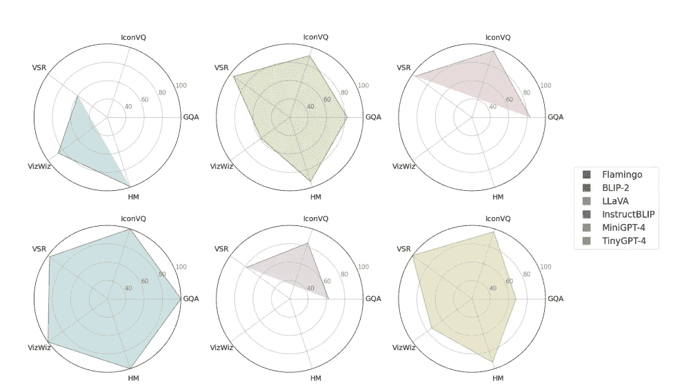
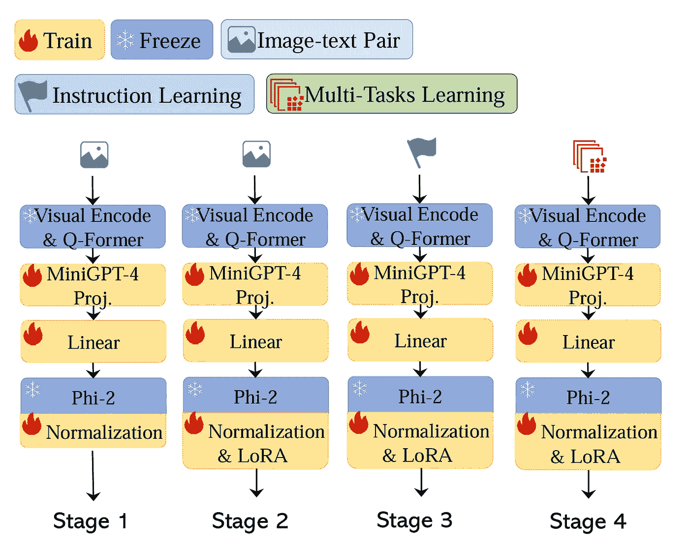
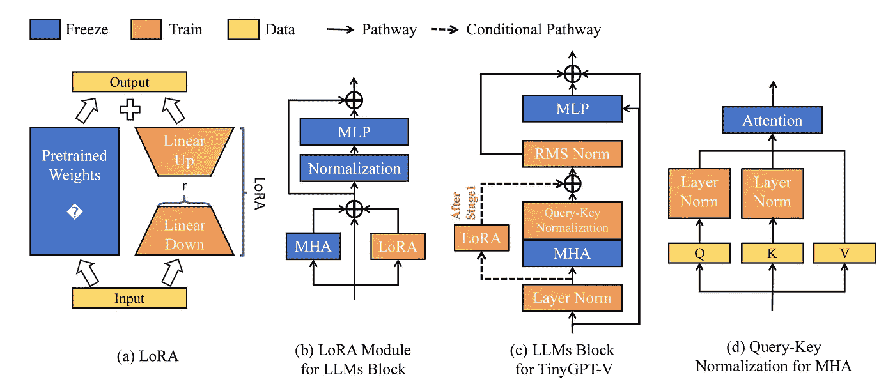

# 探索“小型”视觉-语言模型与 TinyGPT-V

> 原文：[`towardsdatascience.com/exploring-small-vision-language-models-with-tinygpt-v-499d37a1456d?source=collection_archive---------6-----------------------#2024-01-12`](https://towardsdatascience.com/exploring-small-vision-language-models-with-tinygpt-v-499d37a1456d?source=collection_archive---------6-----------------------#2024-01-12)

## TinyGPT-V 是一个可以在单个 GPU 上运行的“轻量”视觉-语言模型

 [Scott Campit, Ph.D.](https://medium.com/@scottcampit?source=post_page---byline--499d37a1456d--------------------------------)

·发表于[Towards Data Science](https://towardsdatascience.com/?source=post_page---byline--499d37a1456d--------------------------------) ·8 分钟阅读·2024 年 1 月 12 日

--

# 摘要

AI 技术正日益融入我们的日常生活。AI 的一种应用是多模态的，例如将语言与视觉模型结合起来。这些视觉-语言模型可以应用于视频字幕生成、语义搜索以及许多其他问题。

本周，我将重点介绍一个名为 TinyGPT-V 的最新视觉-语言模型（[Arxiv](https://arxiv.org/abs/2312.16862) | [GitHub](https://github.com/DLYuanGod/TinyGPT-V)）。这个多模态语言模型之所以有趣，是因为它对一个大规模语言模型来说非常“小”，并且只需要 8GB 的 GPU 或 CPU 就可以在单个 GPU 上进行推理。这对于在实际应用中最大化 AI 模型的速度、效率和成本具有重要意义。

我想指出的是，我既不是该模型的作者，也与模型的作者没有任何关系。然而，作为一名研究人员和实践者，我认为这是一个在 AI 领域中非常有趣的发展，值得深入探讨，特别是因为更高效的模型将解锁更多的应用场景。让我们一探究竟！

# 问题：视觉-语言模型有用但资源消耗大

图片由[Jp Valery](https://unsplash.com/@jpvalery?utm_source=medium&utm_medium=referral)提供，来源于[Unsplash](https://unsplash.com/?utm_source=medium&utm_medium=referral)

多模态模型，例如[视觉语言模型](https://huggingface.co/blog/vision_language_pretraining)，在与人类对齐的响应中达到了创纪录的性能。随着这些模型的持续改进，我们可能会看到公司开始在现实世界的场景和应用中应用这些技术。

然而，许多人工智能模型，尤其是多模态模型，在模型训练和推理过程中都需要大量的计算资源。时间、硬件资源和资本的这些物理限制，成为了研究人员和从业者的瓶颈。

此外，这些限制目前阻碍了多模态模型在某些应用接口中的部署，例如边缘设备。需要在量化（更小）和高性能模型的研究与开发上做出努力，以解决这些挑战。

# TinyGPT-V: “小型”视觉语言模型

摄影作品来自[Céline Haeberly](https://unsplash.com/@celinehaeberly?utm_source=medium&utm_medium=referral)，来自[Unsplash](https://unsplash.com/?utm_source=medium&utm_medium=referral)

TinyGPT-V 是一个拥有 28 亿参数的视觉语言模型，可以在 24GB 的 GPU 上进行训练，并在推理时使用 8GB 的 GPU 或 CPU。这是一个重要的进展，因为其他先进的“较小”视觉语言模型，例如[LLaVA1.5](https://huggingface.co/liuhaotian/llava-v1.5-13b)，仍然相对“庞大”（7B 和 13B 参数）。

与其他更大规模的视觉语言模型进行基准测试时，TinyGPT-V 在多个任务上达到了相似的性能。总的来说，这项工作有助于推动将 AI 模型变得更高效，通过减少其计算需求同时保持性能。平衡这两个目标将使视觉语言模型能够直接在设备上提供，从而带来更好的用户体验，包括减少延迟和增强鲁棒性。

# TinyGPT-V 架构中的相关工作和邻近技术

## 非常大的基础视觉语言模型（VLMs）

视觉语言模型（VLMs）学习图像/视频和文本之间的关系，可以应用于许多常见任务，如在照片中搜索对象（语义搜索）、在视频上提问并获得答案（VQA）等任务。**LLaVA1.5**和[**MiniGPT-4**](https://minigpt-4.github.io/)是截至 2024 年 1 月的两种最先进的多模态大型语言模型，相对比类似的 VL 基础模型较小。然而，这些 VLM 模型仍然需要大量的 GPU 资源和训练时间。例如，作者描述了 LLaVA-v1.5 13B 参数模型的训练资源，该模型使用了八个 A100 GPU（每个 80GB RAM），并进行 25.5 小时的训练。这对于希望在实际应用中研究、开发和应用这些模型的个人和机构来说，构成了一道障碍。

TinyGPT-V 是最新的 VLM 之一，旨在解决这一问题。它使用两个独立的基础模型来处理视觉和语言组件：[**EVA**](https://arxiv.org/abs/2211.07636)编码器作为视觉组件，而[**Phi-2**](https://www.microsoft.com/en-us/research/blog/phi-2-the-surprising-power-of-small-language-models/)则作为语言模型。简而言之，EVA 是一个拥有 10 亿参数的视觉变换器模型，预训练用于重建掩码图像-文本特征。Phi-2 是一个 27 亿参数的语言模型，训练于精心挑选的合成数据集和网页数据集上。作者将这两个模型合并并量化，使得总参数量为 28 亿。

下图展示了 TinyGPT-V 在不同视觉语言任务中的表现与其他 VLM 的对比。值得注意的是，TinyGPT-V 的表现与[**BLIP-2**](https://arxiv.org/abs/2301.12597)相似，这可能是由于其使用了从 BLIP-2 中提取的预训练 Q-Former 模块。此外，尽管[**InstructBLIP**](https://arxiv.org/abs/2305.06500)在表现上超过了 TinyGPT-V，但需要注意的是，最小的 InstructBLIP 模型使用了 4B 参数。根据应用场景，实践者可能会认为这种权衡是值得的，且需要进一步分析来解释这种差异。

以下是该模型训练时所用的数据集：

+   [**GQA**](https://cs.stanford.edu/people/dorarad/gqa/about.html)：现实世界的视觉推理和组合问答

+   [**VSR**](https://paperswithcode.com/dataset/vsr)：带有空间关系的英文文本-图像对

+   [**IconQA**](https://iconqa.github.io/)：通过图标图像进行视觉理解和推理

+   [**VizWiz**](https://www.vizwiz.com/)：由视障人士用智能手机拍摄的照片派生的视觉查询，并补充了 10 个答案。

+   [**HM**](https://hatefulmemeschallenge.com/)：一个多模态数据集，旨在检测表情包中的仇恨内容。

TinyGPT-V 在类似的最新“更小”视觉语言模型中的基准表现（改编自[Yuan et al., 2023](https://arxiv.org/abs/2312.16862)的图 1）。请注意，我们应当假设作者将他们的模型称为“TinyGPT-4”。它的表现与 BLIP-2 相当，后者大约有 31 亿参数。InstructBLIP 在不同任务中的表现更好，但显著地大约有 40 亿参数。这比 TinyGPT-V 要大得多，TinyGPT-V 的参数量约为 21 亿。

## 视觉和语言特征的跨模态对齐

VLM 训练包含几个目标函数，旨在优化：a) 扩展 VLM 的应用，b) 提高 VLM 的整体性能，c) 减少灾难性遗忘的风险。除了不同的目标函数，还有几种模型架构或方法来学习和融合视觉与语言特征的联合表示。我们将讨论训练 TinyGPT-V 时的相关层，这些层如下所示。

TinyGPT-V 训练方案，改编自图 2（[Yuan et al., 2023](https://arxiv.org/abs/2312.16862)）。第一阶段是热身预训练阶段。第二阶段是训练 LoRA 模块的预训练阶段。第三阶段的训练目标是对模型进行指令调优。最后，第四阶段的训练目标是针对各种多模态任务微调模型。

BLIP-2 论文中描述的**Q-Former**被用来从对齐的图像-文本数据中学习联合表示。Q-Former 方法通过优化三个目标来学习视觉-语言表示：

1.  *图像-文本匹配：* 学习图像和文本表示之间的精细对齐

1.  *图像-文本对比学习：* 对齐图像和文本表示，以最大化获得的互信息

1.  *图像驱动的文本生成：* 训练模型根据输入图像生成文本

在 Q-former 层之后，他们采用了 MiniGPT-4（Vicuna 7B）中预训练的线性投影层，以加速学习。然后他们应用了一个线性投影层，将这些特征嵌入到 Phi-2 语言模型中。

## 归一化

从不同模态训练较小的大规模语言模型面临显著挑战。在训练过程中，他们发现模型输出容易出现 NaN 或 INF 值。大部分问题归因于消失梯度问题，因为模型的可训练参数数量有限。为了解决这些问题，他们在 Phi-2 模型中应用了多种归一化程序，以确保数据能够以适当的形式进行模型训练。

Phi-2 模型中应用了三种归一化技术，这些技术在其原始实现的基础上进行了微小调整。他们更新了**LayerNorm**机制，该机制在每个隐藏层中应用，通过包括一个小的数值以确保数值稳定性。进一步，他们在每个多头注意力层后实现了**RMSNorm**作为后归一化程序。最后，他们引入了**Query-Key Normalization**程序，这一程序被认为在低资源学习场景中非常重要。

## 参数高效微调

微调模型对于在下游任务或预训练未覆盖的领域中获得更好的表现至关重要。这是一个关键步骤，相比于开箱即用的基础模型，它能提供巨大的性能提升。

微调模型的一种直观方式是根据新任务或领域更新所有预训练参数。然而，这种微调大语言模型的方法存在问题，因为它需要为每个任务准备一个完整的微调模型副本。**参数高效微调（PEFT）**是 AI 领域中的一个活跃研究方向，通过更新较少的任务特定参数，同时冻结大部分基础模型参数来实现微调。

**低秩适配**（[**LoRA**](https://github.com/microsoft/LoRA)）是用于微调 TinyGPT-V 的特定 PEFT 方法。从高层次看，LoRA 冻结了预训练模型权重，并将可训练的秩分解矩阵注入到每个变换器层中，从而减少了下游任务中可训练参数的数量。下面展示了 LoRA 模块如何应用于 TinyGPT-V 模型。

改编自图 3（[袁等，2023](https://arxiv.org/abs/2312.16862)）。低秩适配（LoRA）被应用于微调 TinyGPT-V。面板 c)展示了 LoRA 在 TinyGPT-V 中的实现方法。面板 d)展示了前一部分中描述的查询-键归一化方法。

# 结论与思考

摄影师：[Mourizal Zativa](https://unsplash.com/@mourimoto?utm_source=medium&utm_medium=referral) 来自[Unsplash](https://unsplash.com/?utm_source=medium&utm_medium=referral)

TinyGPT-V 为使多模态大语言模型更高效的研究贡献了力量。多个领域的创新，例如 PEFT、量化方法和模型架构，将是将模型做得尽可能小而不牺牲过多性能的关键。正如在预印本中所观察到的，TinyGPT-V 达到了与其他较小 VLM 相似的性能。它与 BLIP-2 的表现相匹配（最小模型为 3.1B 参数），虽然在类似基准上其表现不及 InstructBLIP，但它的模型大小更小（TinyGPT-V 为 2.8B 参数，而 InstructBLIP 为 4B）。

对于未来的方向，肯定有一些方面可以进一步探索，以提高 TinyGPT 的性能。例如，可以尝试应用其他 PEFT 方法进行微调。从预印本来看，目前尚不清楚这些模型架构决策是否完全基于经验性能，还是为了实现的便利性做出的选择。需要进一步研究这一点。

最终，在撰写本文时，预训练模型和针对指令学习微调的模型已可用，而多任务模型目前仅为 GitHub 上的测试版本。随着开发者和用户使用该模型，进一步的改进可能揭示 TinyGPT-V 的其他优点和不足之处。但总的来说，我认为这是一项有价值的研究，有助于设计更高效的 VLM。

我希望你觉得这份关于 TinyGPT-V 的分析对你的应用有帮助！如果你想更多地聊聊 AI，或者如果你在湾区并且想喝杯咖啡，欢迎通过[LinkedIn](https://www.linkedin.com/in/scottcampit/)联系我。否则，你也可以通过[torchstack.ai](https://www.torchstack.ai/)找到我，我们在这里为客户和企业提供定制化的 AI 解决方案。
