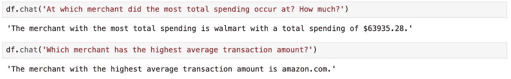

# 探索使用 PandasAI 进行自然语言数据处理的强大功能

> 原文：[`towardsdatascience.com/exploring-the-power-of-natural-language-data-manipulation-with-pandasai-3e088329b390?source=collection_archive---------5-----------------------#2024-04-15`](https://towardsdatascience.com/exploring-the-power-of-natural-language-data-manipulation-with-pandasai-3e088329b390?source=collection_archive---------5-----------------------#2024-04-15)

## 生成式 AI 如何增强 Pandas 的功能

 [Mia Dwyer](https://medium.com/@mia_dwyer?source=post_page---byline--3e088329b390--------------------------------)

·发表于[Towards Data Science](https://towardsdatascience.com/?source=post_page---byline--3e088329b390--------------------------------) ·阅读时间 5 分钟·2024 年 4 月 15 日

--

我最近发现了一个非常有趣的新工具，它结合了我对数据科学和生成式 AI 的兴趣，允许你在 Jupyter 笔记本中直接使用自然语言与数据进行“对话”，借助 ChatGPT。

进入[PandasAI](https://docs.pandas-ai.com/en/latest/) 🐼✨一个免费的开源 Python 库。*

该图像由我使用 DALL-E 创建

# 什么是 Pandas AI？

Datacamp 将[PandasAI](https://docs.pandas-ai.com/en/latest/)描述为“一款利用生成式 AI 模型增强 Pandas 功能的 Python 库。它旨在补充 Pandas 库，这是一个广泛使用的数据分析和处理工具。”[[1](https://www.datacamp.com/blog/an-introduction-to-pandas-ai)]

以下是如何利用 PandasAI 强大功能的示例，即使对 Python 和 Pandas 了解有限：

该图像由作者在 Jupyter Lab 中创建，使用 pandasai 与交易数据集进行“对话”。

# 如何进行设置

这一部分确实需要注册 OpenAI 开发者账号，但不用担心！OpenAI 使这个步骤变得非常简单，主要只需要生成一个令牌，并将其包含在你的笔记本中。
