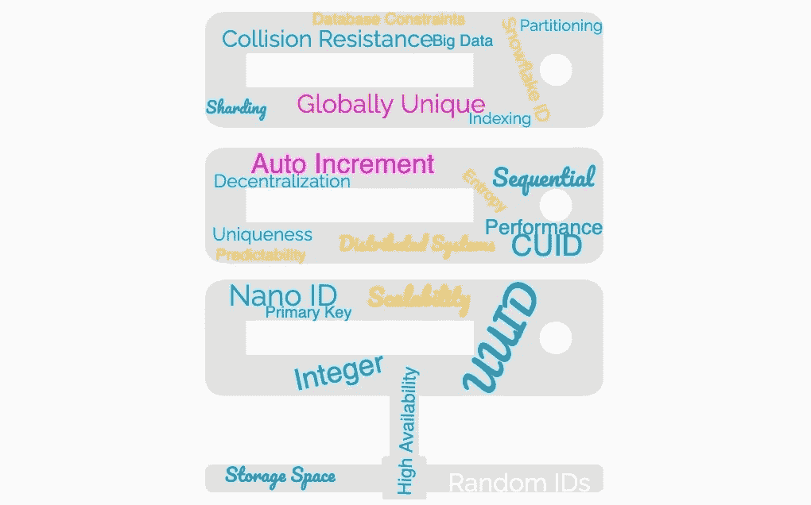

# 探索合适的选择：为你的数据库选择主键

> 原文：[`towardsdatascience.com/exploring-the-right-fit-choosing-primary-keys-for-your-database-64f5754f1515?source=collection_archive---------3-----------------------#2024-07-16`](https://towardsdatascience.com/exploring-the-right-fit-choosing-primary-keys-for-your-database-64f5754f1515?source=collection_archive---------3-----------------------#2024-07-16)

## 在实际场景中导航主键选择权衡的一个实际例子

 [Laurin Heilmeyer](https://blog.heilmela.eu/?source=post_page---byline--64f5754f1515--------------------------------)

·发布于[Towards Data Science](https://towardsdatascience.com/?source=post_page---byline--64f5754f1515--------------------------------) ·阅读时间 21 分钟·2024 年 7 月 16 日

--

导航主键选择的广阔领域（图片由作者提供）

最近，我有机会设计并集成一个简单的聊天系统。在草拟架构时，我花了相当多的时间思考主键选择的问题。这个话题似乎反复出现，阅读其他文章后，我意识到这个问题比我之前想象的更深刻。尽管我对数据设计及其各种陷阱并不完全陌生，但我从未充分认识到主键选择对系统性能和可扩展性的深远影响。在本文中，我想分享我做出选择的思路及背后的理由。

需要注意的是，我正在使用 Postgres 数据库。虽然我相信本文的大部分内容可以应用于其他数据库，但我会偶尔忽略这一关键细节，在更高层次上讨论相关论点。然而，请记住，一些论点可能不适用于 Postgres 之外的其他数据库。

我的工作重点是将一个新功能集成到现有的成熟系统中，这意味着参与实体已经有了相当多的上下文。以下的图示和假设提供了一个简化的心智模型快照……
