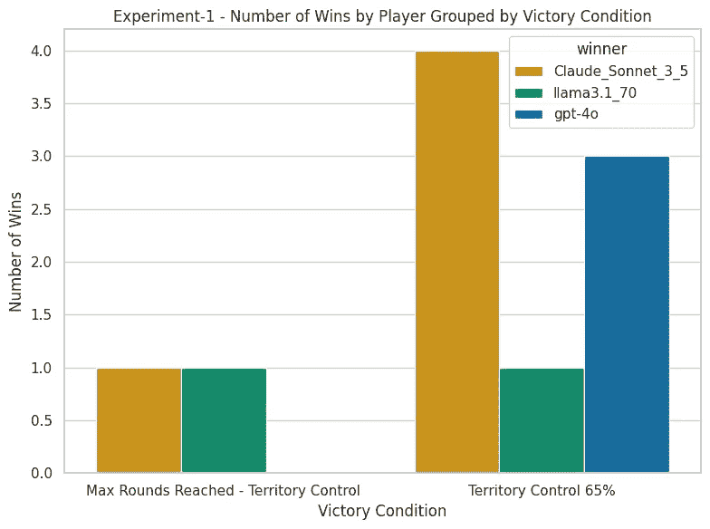
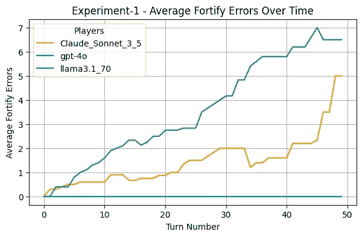

# 探索大语言模型在风险博弈环境中的战略能力

> 原文：[`towardsdatascience.com/exploring-the-strategic-capabilities-of-llms-in-a-risk-game-setting-43c868d83c3b?source=collection_archive---------1-----------------------#2024-08-27`](https://towardsdatascience.com/exploring-the-strategic-capabilities-of-llms-in-a-risk-game-setting-43c868d83c3b?source=collection_archive---------1-----------------------#2024-08-27)

## [战略人工智能](https://medium.com/@hc.ekne/list/strategic-ai-72a460668137)

## 在一个模拟的《风险》环境中，Anthropic、OpenAI 和 Meta 的巨大语言模型展示了截然不同的战略行为，其中 Claude Sonnet 3.5 稍微领先。

[](https://medium.com/@hc.ekne?source=post_page---byline--43c868d83c3b--------------------------------)[](https://towardsdatascience.com/?source=post_page---byline--43c868d83c3b--------------------------------) [汉斯·克里斯蒂安·埃克内](https://medium.com/@hc.ekne?source=post_page---byline--43c868d83c3b--------------------------------)

·发表于[Towards Data Science](https://towardsdatascience.com/?source=post_page---byline--43c868d83c3b--------------------------------) ·阅读时间 32 分钟·2024 年 8 月 27 日

--


由作者使用 DALL-E 生成的图像

# 引言

近年来，大型语言模型（LLMs）已迅速成为我们日常生活的一部分。自从 OpenAI 用 GPT-3 震撼了我们的思维以来，我们见证了模型能力的深刻提升。它们在众多不同的测试中表现出色，从语言理解到推理和解决问题的任务，涵盖了方方面面。

我认为特别引人注目——也许是尚未充分探索——的一个话题是大语言模型（LLMs）进行战略推理的能力。也就是说，如果你将它们置于一个决策结果不仅取决于它们自身行为，还取决于其他同样根据自身目标做出决策的个体的行为的情境中，它们将如何行动。随着我们将这些模型更加紧密地融入到我们的产品和服务中，特别是考虑到与强大人工智能相关的潜在风险，LLMs 的战略思考和行动能力变得越来越重要。

十年前，哲学家兼作家尼克·博斯特罗姆通过其影响力巨大的著作《超级智能》将 AI 风险推到了聚光灯下。他启动了一场关于人工智能的全球讨论，将人工智能作为存在性风险引入了大众辩论。尽管 LLMs 距离博斯特罗姆所说的超级智能还远，但随着我们将它们更加紧密地融入到日常生活中，关注它们的战略能力仍然至关重要。

当我还是个孩子的时候，我非常喜欢玩桌面游戏，而《Risk》是我最喜欢的游戏之一。该游戏需要极高的战略性，如果你没有深思熟虑地进行决策，你很可能会被对手摧毁。《Risk》是评估战略行为的一个很好的代理，因为做出战略决策通常涉及权衡潜在收益与不确定结果，尽管在小规模军队的情况下，运气显然起着很大的作用，但在足够的时间和更大规模的军队下，运气因素会变得不那么突出，最熟练的玩家会脱颖而出。那么，哪里更适合测试 LLM 的战略行为呢？当然是《Risk》！

在本文中，我探讨了与 LLM 和策略相关的两个主要话题。首先，哪些顶级 LLM 模型是最具战略性的《Risk》玩家，最佳模型在其行动中的战略性有多强？其次，随着模型迭代的发展，这些模型的战略能力如何变化？

为了回答这些问题，我构建了一个虚拟的《Risk》游戏引擎，让 LLM 们进行对战。本文的第一部分将探讨游戏实现的一些细节，之后我们将分析实验结果。接着，我们讨论 LLM 如何处理游戏，它们的战略能力与不足，最后我们将以对这些结果的意义的讨论以及对未来模型代际的期望作为结尾。

# 设置舞台


由作者使用 DALL-E 生成的图像

## **为什么选择《Risk》？**

我自己玩《Risk》的经历显然在选择这个游戏作为 LLM 测试平台时起了作用。这个游戏要求玩家理解自己的领土是如何相互关联的，平衡进攻与防守，同时还要规划长期战略。游戏中还通过掷骰子和不可预测的对手行为引入了不确定性，挑战 AI 模型管理风险并适应变化的条件。

《Risk》模拟了现实世界中的战略挑战，如资源分配、适应能力以及在面临即时障碍时追求长期目标，这使得它成为评估 AI 战略能力的宝贵代理。通过将 LLM 放入这样的环境中，我们可以观察它们与人类玩家相比，如何应对这些复杂性。

## **建模环境**

为了进行实验，我创建了一个名为`risk_game`的小型 Python 包。（有关如何在您自己的机器上运行该包的说明，请参见附录。）该包是一个《Risk》游戏引擎，允许模拟由大型语言模型（LLM）进行的游戏。（非技术读者可以跳过这一部分，继续阅读“游戏流程”部分。）

为了更容易地在概念上追踪各个部分的运作，我在包的开发中采用了面向对象的方法，开发了几个关键的类来运行模拟。这包括一个游戏主持人类，用来控制游戏流程，一个玩家类，用来控制发送给 LLM 的提示信息，以及一个游戏状态类，用来控制游戏的状态，包括哪个玩家控制哪个领土，以及他们在任何时刻拥有多少部队。

我尝试使其成为一个灵活且可扩展的 AI 驱动策略模拟解决方案，并且该包有可能被修改以研究 LLM 在其他环境中的战略行为。以下是该包结构的完整概述：

```py
risk_game/
│
├── llm_clients/
│   ├── __init__.py
│   ├── anthropic_client.py
│   ├── bedrock_client.py
│   ├── groq_client.py
│   ├── llm_base.py
│   ├── llm_client.py
│   └── openai_client.py
│
├── utils/
│   ├── __init__.py
│   ├── decorators.py
│   └── game_admin.py
│
├── card_deck.py
├── experiments.py
├── game_config.py
├── game_constants.py
├── game_master.py
├── game_state.py
├── main.py
├── player_agent.py
├── rules.py
│
├── scripts/
│   ├── example_run.py
│
└── tests/
```

为了运行一个实验，我会首先实例化一个`GameConfig`对象。这个配置对象包含了所有相关的游戏配置设置，比如是否启用了渐进式卡片，是否启用了首都模式，以及赢得游戏所需控制的领土百分比等其他多个游戏设置。然后我会用它创建一个`Experiment`类的实例，并调用`run_experiment`方法。

更深入地了解背后的实现，我们可以看到`Experiment`类是如何设置的。

```py
from risk_game.llm_clients import llm_client
import risk_game.game_master as gm
from risk_game.rules import Rules
from typing import List
from risk_game.game_config import GameConfig 

class Experiment:
    def __init__(self, config: GameConfig, agent_mix: int= 1, num_games=10
      ) -> None:
        """
        Initialize the experiment with default options.

        Args:
        - num_games (int): The number of games to run in the experiment.
        - agent_mix (int): The type of agent mix to use in the experiment.
        - config (GameConfig): The configuration for the game.

        """
        self.config = config    
        self.num_games = num_games
        self.agent_mix = agent_mix

    def __repr__(self) -> str:

        if self.config.key_areas:
            key_areas = ', '.join(self.config.key_areas)
        else:
            key_areas = 'None'

        return (f"Experiment Configuration:\n"
                f"Agent Mix: {self.agent_mix}\n"
                f"Number of Games: {self.num_games}\n"
                f"Progressive: {self.config.progressive}\n"
                f"Capitals: {self.config.capitals}\n"
                f"Territory Control Percentage: +"
                f"{self.config.territory_control_percentage:.2f}\n"
                f"Required Continents: {self.config.required_continents}\n"
                f"Key Areas: {key_areas}\n"
                f"Max Rounds: {self.config.max_rounds}\n")

    def initialize_game(self)-> gm.GameMaster:
        """
        Initializes a single game with default rules and players.

        Returns:
        - game: An instance of the initialized GameMaster class.
        """
        # Initialize the rules
        rules = Rules(self.config)
        game = gm.GameMaster(rules)

        if self.agent_mix == 1:
            # Add strong AI players
            game.add_player(name="llama3.1_70", 
                        llm_client=llm_client.create_llm_client("Groq", 1))
            game.add_player(name="Claude_Sonnet_3_5", 
                        llm_client=llm_client.create_llm_client("Anthropic", 1))
            game.add_player(name="gpt-4o", 
                        llm_client=llm_client.create_llm_client("OpenAI", 1))

        elif self.agent_mix == 3:
            # Add mix of strong and weaker AI players from Open AI
            game.add_player(name="Strong(gpt-4o)", 
                        llm_client=llm_client.create_llm_client("OpenAI", 1))
            game.add_player(name="Medium(gpt-4o-mini)", 
                        llm_client=llm_client.create_llm_client("OpenAI", 2))
            game.add_player(name="Weak(gpt-3.5-turbo)", 
                        llm_client=llm_client.create_llm_client("OpenAI", 3))

        elif self.agent_mix == 5:
            # Add mix extra strong AI players
            game.add_player(name="Big_llama3.1_400", 
                        llm_client=llm_client.create_llm_client("Bedrock", 1))
            game.add_player(name="Claude_Sonnet_3_5", 
                        llm_client=llm_client.create_llm_client("Anthropic", 1))
            game.add_player(name="gpt-4o", 
                        llm_client=llm_client.create_llm_client("OpenAI", 1))

        return game

    def run_experiment(self)-> None:
        """
        Runs the experiment by playing multiple games and saving results.
        """
        for i in range(1, self.num_games + 1):
            print(f"Starting game {i}...")
            game = self.initialize_game()
            game.play_game(include_initial_troop_placement=True)
```

从上面的代码中我们看到，`run_experiment()`方法将运行在`Experiment`对象初始化时指定的游戏数量。首先发生的事情是初始化一个游戏，接着我们需要做的第一件事是创建规则并用`GameMaster`类实例化一个游戏。随后，选定的 LLM 玩家代理会被添加到游戏中。这就完成了游戏开始前的必要设置，我们使用游戏的`play_game()`方法来开始游戏。

为了避免过于技术化，我暂时跳过大部分代码细节，转而将感兴趣的读者引导到下面的 GitHub 仓库。查看`README`以开始使用：

[](https://github.com/hcekne/risk-game.git?source=post_page-----43c868d83c3b--------------------------------) [## GitHub — hcekne/risk-game

### 通过在 GitHub 上创建账户来参与 hcekne/risk-game 的开发。

[github.com](https://github.com/hcekne/risk-game.git?source=post_page-----43c868d83c3b--------------------------------)

## 游戏流程

一旦游戏开始，LLM 玩家代理将被提示进行初始部队部署。代理们轮流在他们的领土上放置部队，直到所有初始部队都被部署完。

初始部队部署后，第一位玩家开始他们的回合。在《风险》游戏中，一回合包括以下三个阶段：

+   **阶段 1：卡片交易和部队部署。** 如果玩家代理在其回合中赢得了一次攻击，它会获得一张卡片。当它有三张卡片时，如果有正确的步兵、骑兵、炮兵或万能卡的组合，就可以将这些卡片兑换为部队。玩家还会根据其控制的领土数量和是否控制任何大洲来获得额外的部队。

+   **阶段 2：攻击。** 在这个阶段，玩家代理可以攻击其他玩家并占领他们的领土。攻击是一个好主意，因为这可以让玩家在这一回合获得一张卡片，并且还能获得更多的领土。玩家代理在一个回合中可以随意攻击多次。

+   **阶段 3：加固。** 最后一个阶段是加固阶段，此时玩家可以将部队从一个领土移至另一个领土。不过，这些领土必须通过玩家控制的其他领土相连。玩家只允许进行一次这样的加固移动。完成后，回合结束，下一位玩家开始其回合。

在每一回合开始时，LLM 代理会收到动态生成的提示，用以制定其策略。这个策略设定提示为代理提供了当前的游戏规则、棋盘状态以及可能的攻击路线。代理对这一提示的回应将在整个回合中指导其决策，确保其行动与整体战略计划保持一致。

策略提示的请求如下：

```py
prompt = """
  We are playing Risk and you are about to start your turn, but first 
  you need to define your strategy for this turn.
  You, are {self.name}, and these are the current rules we are 
  playing with:

  {rules}

  {current_game_state}

  {formatted_attack_vectors}

  Your task is to formulate an overall strategy for your turn, 
  considering the territories you control, the other players, and the 
  potential for continent bonuses. 

  Since the victory conditions only requires you to control 
  {game_state.territories_required_to_win} territories, and you already 
  control {number_of_territories} territories, 
  you only need to win an extra {extra_territories_required_to_win}
  to win the game outright. Can you do that this turn?? If so lay 
  your strategy out accordingly.

  **Objective:**

  Your goal is to win the game by one of the victory conditions given
  in the rules. Focus on decisive attacks that reduce 
  your opponents' ability to fight back. When possible, eliminate 
  opponents to gain their cards, which will allow you to trade them 
  in for more troops and accelerate your conquest.

  **Strategic Considerations:**

  1\. **Attack Strategy:**
  - Identify the most advantageous territories to attack.
  - Prioritize attacks that will help you secure continent bonuses or 
  weaken your strongest opponents.
  - Look for opportunities to eliminate other players. If an opponent 
  has few territories left, eliminating them could allow you to gain 
  their cards, which can be especially powerful if you’re playing with 
  progressive card bonuses.
  - Weigh the risks of attacking versus the potential rewards.

  2\. **Defense Strategy:**
  - Identify your most vulnerable territories and consider fortifying 
  them.
  - Consider the potential moves of your opponents and plan your defense 
  accordingly.

  Multi-Turn Planning: Think about how you can win the game within 
  the next 2-3 turns. What moves will set you up for a decisive victory?
  Don't just focus on this turn; consider how your actions this turn 
  will help you dominate in the next few turns.

  **Instructions:**

  - **Limit your response to a maximum of 300 words.**
  - **Be concise and direct. Avoid unnecessary elaboration.**
  - **Provide your strategy in two bullet points, each with a 
  maximum of four sentences.**

  **Output Format:**

  Provide a high-level strategy for your turn, including:
  1\. **Attack Strategy:** Which territories will you target, and why? 
  How many troops will you commit to each attack? If you plan to 
  eliminate an opponent, explain how you will accomplish this.
  2\. **Defense Strategy:** Which territories will you fortify, and 
  how will you allocate your remaining troops?

  Example Strategy:
  - **Attack Strategy:** Attack {Territory B} from {Territory C} with 
  10 troops to weaken Player 1 and prevent them from securing the 
  continent bonus for {Continent Y}. Eliminate Player 2 by attacking 
  their last remaining territory, {Territory D}, to gain their cards.
  - **Defense Strategy:** Fortify {Territory E} with 3 troops to 
  protect against a potential counter-attack from Player 3.

  Remember, your goal is to make the best strategic decisions that
      will maximize your chances of winning the game. Consider the 
      potential moves of your opponents and how you can position 
      yourself to counter them effectively.

  What is your strategy for this turn?
        """
```

如上所示，动态生成的多个元素帮助玩家代理更好地理解游戏背景，并做出更有信息支持的战略决策。

这些动态生成的元素包括：

+   **规则：** 游戏的规则，例如是否启用了首都模式，获胜所需占领的领土百分比等。

+   **当前游戏状态：** 这一信息展示给代理，包括不同的大洲以及

+   **格式化的攻击路线：** 这是一个可能的领土集合，代理可以从这些领土发动攻击，攻击的目标以及代理可以动用的最大兵力。

+   **获胜所需额外领土：** 这是代理需要占领的剩余领土数，才能赢得游戏。例如，如果赢得游戏所需的总领土数是 28，而代理当前占领了 25 个领土，那么这个数字就是 3，可能会促使代理为这一回合制定更具攻击性的策略。

在回合中的每个具体行动——无论是部署部队、攻击还是加固——代理都会根据当前的游戏情况收到量身定制的提示。幸运的是，风险游戏的玩法可以简化，因为它符合马尔科夫性质，即最优的行动只依赖于当前的游戏状态，而不依赖于历史的行动。这使得提示能够简化，专注于当前的条件。

# 实验设置


为了探索 LLMs 的战略能力，我设计了两个主要实验。这些实验的目的是回答两个关键问题：

1.  *哪个是表现最好的 LLM，它在行动中有多具战略性？*

1.  *LLMs 的战略能力是否在模型迭代中有所进步？*

这两个问题可以通过运行两个不同的实验来回答，每个实验使用略微不同的 AI 代理组合。

## **实验-1：评估顶级模型**

对于第一个问题，我设计了一个实验，使用以下顶级 LLM 模型作为玩家：

+   OpenAI 的 GPT-4o 通过 OpenAI API 端点运行

+   Anthropic 的 claude-3–5-sonnet-20240620 通过 Anthropic API 端点运行

+   Meta 的 llama-3.1–70b-versatile 通过 Groq API 端点运行

我显然想尝试 Meta 的 meta.llama3–1–405b-instruct-v1:0，并配置它通过 AWS Bedrock 运行，然而响应时间极慢，导致模拟游戏耗时过长。这就是为什么我们在 Groq 上运行 Meta 的 70b 模型的原因。它比 AWS Bedrock 要快得多。（如果有人知道如何加速 AWS 上的 llama3.1 405b，请告诉我！）

我们的零假设和备择假设如下：

> **实验-1, H0：** 模型之间没有性能差异；每个模型有相等的获胜概率。
> 
> **实验-1, H1​**：至少有一个模型的表现优于（或劣于）其他模型，表明这些模型的性能不相等。

## **实验-2：分析模型代**

第二个实验的目的是评估 OpenAI 模型在不同迭代中战略能力的进展。为此，我选择了三个模型：

+   GPT-4o

+   GPT-4o-mini

+   GPT-3.5-turbo-0125

**实验-2**让我们能够观察模型的战略能力如何在不同模型代之间发展，也使我们能够分析同一模型代中不同规模模型之间的差异（GPT-4o 与 GPT-4o-mini）。我选择了 OpenAI 的解决方案，因为它们没有其他提供商那样严格的速率限制。

同样，对于**实验-1**，对于这个实验我们也可以制定零假设和备择假设：

> **实验-2, H0：** 模型之间没有性能差异；每个模型有相等的获胜概率。
> 
> **实验-2, H1A​**：GPT-4o 优于 GPT-4o-mini
> 
> **实验-2, H1B：** GPT-4o 和 GPT-4o-mini 优于 GPT-3.5-turbo

## 游戏设置、胜利条件和卡片奖励

这两个实验都包含 10 局游戏，每局都有相同的胜利条件。风险游戏中有多种不同的胜利条件，玩家可以达成共识的典型胜利条件是：

1.  胜利者所需控制的领土数量。“世界统治”是其中的一个子集，指的是一个玩家需要控制所有领土。其他典型的领土条件是控制 70%的领土。

1.  胜利者所需控制的大陆数量

1.  胜利者所需控制/拥有的关键区域

1.  预设时间/回合数：在 x 小时或 x 回合后，控制最多领土的玩家获胜。

最终，我选择了一个更为务实的方案，结合了易于实现的胜利条件和进阶卡片。实验中的游戏胜利条件最终选择为：

1.  第一个达到 65%领土控制或

1.  在经过 17 轮游戏（使得整个游戏在最多 51 回合内由三位玩家完成）后，拥有最多领土的代理人获胜。

对于不熟悉《风险》游戏的玩家，进阶卡片意味着随着游戏的进行，交换的卡片的价值会逐步增加，而固定卡片则是整个游戏过程中交换的卡片的部队值保持不变（不同组合的卡片分别为 4、6、8、10）。进阶卡片通常被认为是一种更快的游戏模式。

# 结果——谁征服了世界？


由作者使用 DALL-E 生成的图像

## 实验-1：顶级模型

结果实际上非常令人吃惊——对于这两个实验来说，第一实验中，以下是三位代理人之间的胜利分布。Anthropic 的 Claude 获得了 5 次胜利，排名第二的是 OpenAI 的 GPT-4o，获得了 3 次胜利，最后是 Meta 的 llama3.1，获得了 2 次胜利。



图 3．实验-1 按玩家胜利分组的图表，按胜利条件分组 / 图片来源：作者

由于 OpenAI 在 GPT-3 的长期历史和早期成功，我本以为 OpenAI 的模型会是胜者，但最终领先的是 Anthropic 的 Claude。根据[基准测试](https://www.anthropic.com/news/claude-3-5-sonnet)的表现来看，Claude 领先也并不令人意外。

## 领土控制与游戏流程

如果我们深入分析整个游戏流程，并评估游戏中领土的分布，我们会发现以下情况：


图 5．实验-1 每回合的领土控制情况 / 图片来源：作者

当我们检查整个游戏中领土的分布时，一个更清晰的画面浮现出来。平均而言，Claude 在大多数游戏中能够在中途获得领土控制的领先，并保持这种优势直到游戏结束。有趣的是，游戏中仅有一次玩家被完全淘汰——发生在第 8 局，Llama 3.1 在第 27 回合左右被淘汰。

> 在我们的分析中，“回合”指的是每个玩家在其回合内进行的一整套操作。由于有三位代理人参与，每一轮游戏通常包含三回合，每个玩家一回合。随着玩家被淘汰，每轮的回合数自然减少。

通过观察军队力量和领土控制的演变，我们发现以下几点：


图 6\. 实验-1 游戏过程中部队力量的变化 / 图片由作者提供

各模型的部队力量似乎大致相同，因此这显然不是 Claude 能够取得最多胜利的原因。

## 统计分析：Claude 真的是最强的吗？

在本次实验中，我的目标是确定是否有任何一个模型在获胜次数上显著优于其他模型。鉴于研究的重点是跨多个类别（这三种模型）中的获胜频率，卡方拟合优度检验是一个很好的统计工具。

该检验通常用于比较观察到的频率与原假设下的预期频率。在本例中，原假设是所有模型的获胜概率相同。通过应用卡方检验，我可以评估各模型的获胜分布是否与预期分布存在显著偏差，从而帮助确定是否有模型的表现显著更好。

```py
from scipy.stats import chisquare

# Observed wins for the three models
observed = [5, 3, 2]

# Expected wins under the null hypothesis (equal probability)
expected = [10 / 3] * 3

# Perform the chi-square goodness-of-fit test
chi2_statistic, p_value = chisquare(f_obs=observed, f_exp=expected)

chi2_statistic, p_value

(1.4, 0.4965853037914095)
```

基于三种模型的观察到的获胜次数（Claude 获胜 5 次，GPT-4o 获胜 3 次，Llama3.1 获胜 2 次），进行了卡方拟合优度检验。根据原假设：

> **实验-1, H0 :** 各模型之间没有性能差异；每个模型的获胜概率相同。

每个模型预计将在 10 次试验中获胜约 3.33 次。卡方检验的统计量为 1.4，对应的 p 值为 0.497。由于这个 p 值远大于常规的显著性水平 0.05，我们不能用任何统计学上的严谨性来断言 Claude 比其他模型更优秀。

> 我们可以这样解读 p 值：在原假设下，即假设每个模型获胜的概率相同，观察到像(5,3,2)这样的极端结果的概率是 49.7%。因此，这实际上是一个相当可能发生的情况。

为了得出明确的结论，我们需要进行更多实验并增加样本量。不幸的是，速率限制——特别是在 Groq 上托管的 Llama 3.1——使得这变得不切实际。我邀请有兴趣的读者自行跟进并进行测试。有关如何在自己的计算机上运行实验，请参阅附录。

## 实验-2：模型生成

实验-2 的结果同样令人惊讶。与预期相反，GPT-4o-mini 的表现超越了 GPT-4o 和 GPT-3.5-turbo。GPT-4o-mini 赢得了 7 场比赛，而 GPT-4o 赢得了 3 场，GPT-3.5-turbo 则未能获胜。


图 8\. 玩家获胜次数与胜利条件 / 图片由作者提供

GPT-4o-mini 实际上获得了整体胜利。这一胜利相当显著，GPT-4o 取得了 3 次胜利，而 GPT-3.5-turbo 则未能获胜，GPT-4o-mini 赢得了 7 局。尽管 GPT-4o 平均上拥有更多部队，但 GPT-4o-mini 还是赢得了大部分游戏。

## 领土控制与部队力量

再次深入分析，查看各个游戏的表现，我们得出以下结论：


图 9. 实验 2，每回合的平均领土控制，所有游戏 / 图像由作者提供

上述图表显示了每回合的领土控制情况，平均来看，以及所有游戏的情况。这些图表确认了我们在整体胜利统计中看到的情况，即 GPT-4o-mini 在游戏结束时，平均上在领土控制上处于领先地位。GPT-4o-mini 在关键时刻，也就是接近游戏结束时，超越了其“大哥”GPT-4o！

转过头来，检查部队力量，我们看到了一幅稍微不同的图景：


图 10. 实验 2，每回合的平均总部队力量，所有游戏 / 图像由作者提供

上图显示，平均而言，被假定为最强玩家的 GPT-4o 在大多数游戏中都能够维持最高的部队力量。令人惊讶的是，它未能将这一部队力量转化为优势！此外，部队力量与模型大小及模型代际之间有明显的趋势。

为了获得更多见解，我们还可以更详细地评估一些游戏，并查看每回合控制领土的热力图。


图 11. 实验 2，领土控制热力图，第 2 局 / 图像由作者提供


图 12. 实验 2，领土控制热力图，第 7 局 / 图像由作者提供

从热力图中可以看到，各模型之间是如何你来我往、争夺领土的。这里我们选取了两局游戏，这两局游戏在实验中的 10 局中似乎具有较高的代表性。

关于具体的领土所有权，我们频繁看到的趋势是，GPT-4o 倾向于控制北美，而 GPT-4o-mini 则常常争夺亚洲。

## 统计分析：代际差异

根据上述结果，我们再一次回顾最初的假设：

> **实验 2，H0：** 各模型在性能上没有差异；每个模型的胜率相等。
> 
> **实验 2，H1A​**：GPT-4o 优于 GPT-4o-mini
> 
> **实验 2，H1B：** GPT-4o 和 GPT-4o-mini 优于 GPT-3.5-turbo

让我们从简单的假设开始，**H1B**，即 GPT-4o 和 GPT-4o-mini 优于 GPT-3.5-turbo。这一点很容易看出，我们可以再次进行卡方检验，假设每个模型的胜率相等。

```py
from scipy.stats import chisquare

# Observed wins for the three models
observed = [7, 3, 0]

# total observations
total_observations = sum(observed)

# Expected wins under the null hypothesis (equal probability)
expected_probabilites = [1/3] * 3

expeceted_wins = [total_observations * p for p in expected_probabilities]

# Perform the chi-square goodness-of-fit test
chi2_statistic, p_value = chisquare(f_obs=observed, f_exp=expected_wins)

chi2_statistic, p_value

(7.4, 0.0247235265)
```

这表明，如果每个模型的获胜概率都是 33.3%，那么观察到的胜利分布不太可能发生。事实上，像这样的极端情况只有在 2.5%的情况下才可能出现。

为了评估我们的**H1A**假设，我们首先应该更新我们的零假设，调整获胜的概率不均等。例如，我们现在可以假设：

+   GPT-4o-mini: 更高的获胜概率

+   GPT-4o: 更高的获胜概率

+   GPT-3.5-turbo: 更低的获胜概率

根据这些数字，并结合我们刚刚观察到的结果，假设 GPT-4o-mini 的情况如下：

+   GPT-40-mini: 每局游戏 45%的获胜概率

+   GPT-4o: 每局游戏 45%的获胜概率

+   GPT-3.5-turbo: 每局游戏 10%的获胜概率

然后，对于 10 局游戏，预期的获胜次数是：

+   GPT-4o-mini: 0.45 × 10 = 4.5

+   GPT-4o: 0.45 × 10 = 4.5

+   GPT-3.5-turbo: 0.1 × 10 = 10 → 0.1 × 10 = 1

此外，鉴于 GPT-4o-mini 在 10 局游戏中赢了 7 局，我们也修正了我们的备择假设：

> **实验-2 修正假设 H1AR**: GPT-4o-mini 优于 GPT-4o。

使用 Python 计算卡方检验，我们得到：

```py
from scipy.stats import chisquare

# Observed wins for the three models
observed = [7, 3, 0]

# Expected wins under the null hypothesis (equal probability)
expected_wins = [0.45 * 10, 0.45 * 10, 0.1 * 10] 

# Perform the chi-square goodness-of-fit test
chi2_statistic, p_value = chisquare(f_obs=observed, 
  f_exp=expected_wins)

chi2_statistic, p_value

(2.8888888888888890, .23587708298570023)
```

根据我们更新后的概率，从上面的代码中可以看到，得到像我们观察到的那样极端的结果（7,3,0）在我们的新更新的预期概率下实际上并不是非常不可能。解释 p 值告诉我们，至少像我们观察到的这样极端的结果，在 23%的情况下是可以预期的。因此，我们不能得出统计学上有显著性差异的结论，因此我们拒绝修正后的备择假设，**H1AR**。

## **关键结论**

尽管目前只有有限的证据表明 Claude 是更具战略性的模型，但我们可以相对有信心地说，不同模型世代之间的性能存在差异。GPT-3.5-turbo 显著不如其更新版本具有战略性。显然，这个结论是反向成立的，这意味着我们看到随着模型世代的进步，其战略能力不断增强，这很可能会深刻影响这些模型未来的使用方式。

# 分析 LLM 的战略行为


图片由作者使用 DALL-E 生成

我在进行一些初步测试后，注意到的第一件事是，LLM（大语言模型）与人类玩游戏的方式差异很大。LLM 的游戏回合数似乎比人类游戏更多，即使在我提示它们更具攻击性并尝试攻击较弱的对手后也是如此。

尽管许多关于玩家策略的观察可以仅通过查看领土控制和军队力量的图表来进行，但一些更为细致的观察，直到我逐步观看 LLMs 逐回合游戏时才变得更加明显。这在文章格式中有些难以复现，但实验中的所有数据都存储在 Github 仓库中的.csv 文件中，并加载到用于分析的 Jupyter 笔记本中的 pandas 数据框中。感兴趣的读者可以在该仓库中找到它们：`/game_analysis/experiment1_analysis_notebook.ipynb`。数据框`experiment1_game_data_df`包含了实验 1 的所有相关游戏数据。通过逐回合查看领土所有权和军队控制，可以得出更多关于游戏风格的细节。

## 独特的制胜游戏风格

看似区分 Anthropic 模型的特点在于它能够通过一次行动占领大量领土。这在某些领土控制图中可以看到，当你查看单个游戏时就会明白。不过，尽管 Claude 获得了最多的胜利，但它的策略性到底有多强？根据我在实验中观察到的情况，似乎大型语言模型（LLMs）在策略上仍然相当不成熟。下面我们将讨论一些通过游戏观察到的典型行为。

## 薄弱的防御策略

所有模型普遍存在的一个问题是未能充分巩固边境防御。经常出现的情况是，代理们把大量军队集中在内部领土中，而没有守护好边界。这使得邻国可以更容易地攻击它们的领土并窃取大陆加成。此外，这也让玩家代理们更难进行大规模的领土扩张，因为它们的强大军力常常被其他它们控制的领土所包围。

## 未能识别制胜之策

另一个显著的不足是模型未能识别制胜之策。它们似乎没有意识到，如果正确出招，就能在一回合内获胜。较强的模型表现得不那么明显，但问题仍然存在。

例如，在我们进行的所有模拟游戏中，获胜所需的领土控制率是 65%。这意味着你只需要占领 28 个领土。在实验 2 的第 2 场游戏中，OpenAI 的 GPT-4o 在格林兰拥有 24 个领土和 19 个军队。它本可以轻松占领欧洲，那里的几个领土只有 1 个军队，但它未能看到这一行动。即便是一个相对缺乏经验的人类玩家也很可能会认出这一动作。

## 未能消除其他玩家

这些模型经常在敌人只剩下少量部队时，仍然未能消灭对手，即便这么做在战略上是有利的。更具体来说，它们未能消除只剩下少数部队且拥有两张以上卡片的玩家。对于大多数人类玩家来说，这被认为是一个简单的操作，尤其是在使用进阶卡片的情况下。卡片奖励迅速增加，如果一个对手只剩下 10 个部队，但拥有 3 张或更多的卡片，拿下他来换卡几乎总是正确的选择。

## GPT-4o 喜欢北美

我看到 GPT-4o 采取的一个非常典型的策略是尽早控制北美。因为北美有强大的大陆加成，并且只需要在三个地方防守，这意味着它是一个战略上非常好的起点。我怀疑 GPT-4o 这么做的原因是它在训练数据中读到北美是一个战略上很好的位置。

## 顶级模型完成更多游戏

总的来说，顶级模型在完成更多游戏并实现胜利条件方面表现出了趋势，相比之下较弱的模型则不如。顶级模型所玩的游戏中，只有 2 场比赛达到了最大游戏时间限制，而较弱模型则有 6 场达到了这一限制。

## **预训练知识的局限性**

经典《风险》游戏的一个局限性是，大型语言模型已经读过关于玩《风险》的策略，并且顶级模型只是最擅长执行这些策略的模型。我认为，快速尝试控制北美的倾向突显了这一点。如果我们改为使用随机生成的地图，这一局限性可能会得到缓解。这将增加难度，并为模型提供更高的挑战。然而，鉴于它们在当前地图上的表现，我认为目前的模型代际并不需要提高难度。

## 一般观察

即使是最强大的大型语言模型（LLM），也仍然远未掌握战略游戏的玩法。这些模型没有展示出能够挑战普通人类玩家的行为。我认为我们至少需要等上一代或两代模型，才能开始看到战略行为的显著提升。

也就是说，动态调整提示以应对特定情境——例如消除弱小对手以获取卡片奖励——可能会改善模型的表现。通过不同且更精细的提示，模型或许能够发挥更强的对抗能力。然而，要实现这一点，您需要手动编程出一系列通常会发生的情境，并为每种情境提供专门的提示。

考虑一个具体的例子，看看这一点如何发挥作用：B 玩家很弱，只有 4 个领土和 10 个部队，但 B 玩家有 3 张《风险》卡，而你正在玩进阶卡，并且目前交易卡片的奖励是 20 个部队。

出于这个实验的考虑，我不想让提示过于专业化，因为目标不是优化在《风险》游戏中的代理行为，而是测试它们在给定游戏状态下自行做到这一点的能力。

# 这些结果对未来人工智能与战略的意义


由作者使用 DALL-E 生成的图像

这些实验的结果突出了未来人工智能及其战略应用的一些关键考虑因素。虽然 LLM 在语言理解和问题解决方面已经取得了显著进展，但它们在推理和战略行动方面的能力仍处于初步阶段。

## **战略意识与人工智能进化**

如模拟中所示，目前一代的大型语言模型（LLM）在基本的战略概念上存在困难，比如防御和识别制胜之招。这表明，尽管人工智能模型在许多领域有所进展，但进行高级战略思维所需的复杂性仍然没有得到充分发展。

然而，正如我们在实验-2 中清楚地看到的那样，战略思维有了改善的趋势，如果这一趋势继续发展，未来几代的模型可能不会太久就变得更加高效。有些人声称 LLM 已经达到了瓶颈，但我会非常谨慎地作出这种假设。

## **现实世界应用的意义**

具有战略意识和能力的人工智能代理的现实世界应用显然是巨大的，无法低估。这些代理可以应用于从商业战略到军事规划、复杂人际互动等各个领域。能够预测和反应他人行为的战略性 AI 可能极具价值——当然也非常危险。以下我们提出三种可能的应用场景。

如果我们首先考虑一个更积极的应用场景，我们可以想象每个人都有一个有帮助的战略代理，指导他们度过日常生活，帮助做出重要决策。这个代理可以在从财务规划、日常任务安排到优化社交互动和涉及其他人行为的行动方面提供帮助。它可以代表你行事，并以目标为导向，优化你的利益和福祉。

显然，也有很多潜在的应用领域。想想看：具备战略能力的自主战斗无人机。这并非完全牵强，尤其是考虑到较小模型与它们的大型兄弟模型（例如 GPT-4o 与 GPT-4o-mini）相比的相对优势。较小的模型更容易部署到像无人机这样的边缘设备上，而我们看到[流行的](https://www.atlanticcouncil.org/blogs/ukrainealert/fpv-drones-in-ukraine-are-changing-modern-warfare/)无人机在俄乌战争中的应用，若从第一人称视角（FPV）无人机发展到无人 AI 驱动无人机，或许是可行的。如果无人机操作员失去与无人机的联系，甚至可以作为备份选项。

详细的社会互动模拟是另一种使用具有战略意识的智能体的方式。我们可以举例来说，创建模拟来建模特定的经济或其他社会现象，将经典的基于智能体的方法与 LLM 结合起来。基于智能体的建模（ABM）作为理解复杂适应性系统的研究领域和工具箱已经存在了几十年——我在 2012 年硕士论文中就曾使用过——但如果将其与更智能和具有战略思维的智能体结合，这可能会改变游戏规则。

## **动态提示的重要性**

详细的动态提示可能是未来一段时间内与 LLM 互动和使用的最佳方式——也许对未来几个模型版本（如 GPT-5、Claude 4 等）也是如此。通过提供更多动态的情景特定提示，让 LLM 智能体执行特定的计划，我们可能会看到下一代模型展现出更复杂的战略行为。

这种“手把手指导”的方式需要人类程序员投入更多的工作——而不仅仅是直接提示智能体——但它可能是一个至关重要的过渡阶段，直到这些模型变得更能独立进行战略思考。

当然可以有人辩称，如果我们提供过于详细和具体的提示，我们实际上是在违背这些模型的通用性特征，这时我们或许可以引入不同类型的优化算法。然而，我认为有很多问题可以将 LLM（大语言模型）更开放式的问题解决能力与某种形式的动态提示结合起来。

## **对新基准的需求**

随着 LLM 的不断进步，我们也需要开发新的基准来研究它们。传统的基准和测试非常适合研究在孤立环境中的问题解决，但未来我们可能需要引入更具战略性的测试，帮助我们理解智能体在需要考虑他们的行动如何随着时间推移影响他人的情况下的表现。像《风险》这样的游戏提供了一个合理的起点，因为它们具有战略性特点和不确定性元素。

## **未来的考虑**

展望未来，随着人工智能模型的不断发展，密切监测其战略能力将变得至关重要。我们需要确保这些模型在变得更强大的同时，与人类的价值观和伦理考量保持一致。与战略人工智能相关的风险——例如在高风险环境中可能出现的意外后果——必须得到仔细管理。

由于像 GPT-4o-mini 这样的较小模型在战略任务中展现出了竞争力，因此将高度有能力的人工智能部署到边缘设备上，如无人机或自主系统，具有潜力。这为需要在动态环境中进行实时决策的去中心化人工智能应用开辟了新的可能性。

# 结论

我认为可以肯定地说，虽然大语言模型的战略能力随着每一代的更新有所提升，但它们距离能够与一名中等水平的人工玩家竞争还需要很长一段路要走。像 Claude 和 GPT-4o 这样的模型开始显示出一定程度的战略思维，但它们在诸如加固和识别胜利步骤等方面的不足，突显了人工智能在复杂的多智能体环境中的局限性。尽管如此，随着新模型性能的不断提升，人工智能战略的未来发展依然充满希望。

随着我们继续将人工智能融入生活的更多方面，从商业到军事战略，理解和完善这些系统的战略能力将变得越来越重要。虽然我们还没有达到那个程度，但人工智能在动态环境中处理复杂决策过程的潜力是令人难以置信的。看到大语言模型的能力随时间发展，尤其是我们展示的跨模型代际的进步，是否能延续到 GPT-5、GPT-6、Claude 4、Claude 5 等模型，将是非常有趣的。我认为我们正迎接一次激动人心的旅程！

如果你有兴趣开发自己的人工智能驱动工具，随时与我联系！我总是乐于探索合作的机会！

# 附录

在这里，我的目标是提供一些额外的细节，虽然这些细节对于技术导向的读者来说非常有趣，但对于文章的整体流程可能并非必需。我们首先讨论的是速率限制问题。然后，我们会描述关于错误、代理所用的累计轮次时间以及来自大语言模型（LLM）响应的解析的更详细分析。此外，我还向读者简要介绍如何通过克隆 Github 仓库并开始使用 docker 设置来测试代码库。

## 速率限制问题

每次决策时都有许多行动需要考虑，这导致了程序与大语言模型提供商之间频繁的交互。一个在进行更长时间实验时稍显问题的是速率限制。

速率限制是 LLM 提供商为了防止垃圾信息和其他可能扰乱行为而设立的限制，因此即使账户中有资金，提供商仍然限制你可以查询的令牌数量。例如，Anthropic 对其最佳模型设定了每天 1M 令牌的速率限制。


Anthropic 模型的速率限制，来自 Anthropic 控制台

当你达到速率限制时，你的 LLM 查询将会得到以下回复

```py
Rate Limit Error: Rate limit reached for model `llama-3.1-70b-versatile` 
in organization `org_01j440c04tfr3aas7qctr0ejtk` 
on : Limit 1000000, Used 999496, Requested 1573\. 
Please try again in 1m32.2828s. 
Visit https://console.groq.com/docs/rate-limits for more information.
```

对于许多应用领域来说，这可能不是问题，但模拟每回合会查询每个提供商多次（用于战略评估、卡片选择、部队部署、多次攻击和防御），因此这会迅速累积，尤其是在游戏持续多回合的情况下。我最初计划做 10 个实验，胜利条件设定为世界统治（即获胜者需控制游戏中所有 42 个领土），但由于 LLM 在游戏中的表现，这在我的时间框架内是不可行的。胜利条件必须做出调整，以便在早期阶段就能决定胜者。

## 错误追踪

在实验中，一些 LLM 在被提示进行操作时也遇到了大量错误，这些错误可能包括尝试在自己不控制的领土上部署部队，或加强不相连领土的防御。我实现了几个变量来追踪这些错误。较弱的模型中这种情况更为常见，正如下面的图表所示：



实验-1 攻击与防御错误 / 图片来源：作者


实验-2 攻击与防御错误 / 图片来源：作者

## 累积回合时间

在实验中，我追踪的最后一项数据是每个 LLM 在其操作上花费的时间。正如预期的那样，越大、越复杂的模型花费的时间越多。


按玩家划分的累积回合时间 / 图片来源：作者

很明显，Claude 似乎真的花了更多时间。对于实验-1，GPT-4 的表现比在 Groq 上运行的 Llama3.1 70b 要好，但这很可能是因为在返回答案时出现了更多的内部服务器响应错误等问题，导致回合时间增加。就纯推理而言，当提供正确答案时，Groq 的速度略快于 OpenAI。

## 趋向减少错误和更加稳健的输出

正如我们从改进后的模型生成中看到的那样，新的大语言模型（LLMs）生成的错误输出明显少于旧模型。这一点非常重要，因为我们在继续使用这些模型构建数据产品并将其集成到管道中时，可能仍然需要进行一些后处理错误处理，但比以前少了。

## 解析响应

与 LLMs 交互的一个关键问题是解析它们产生的输出。OpenAI 最近[披露](https://openai.com/index/introducing-structured-outputs-in-the-api/)，GPT-4o*“现在可以可靠地遵守开发者提供的 JSON 模式。”* 这当然是个好消息，但许多其他模型，比如 llama 3.1 70B，仍然难以持续返回正确格式的 JSON 输出。

解决解析问题的方法是将输出打包成特殊的文本字符串，例如`||| output 1 |||`，`+++ output 2 +++`，然后使用正则表达式解析这些输出字符串。我只需提示 LLM 使用特殊的文本字符串格式化输出，并提供正确格式化输出的示例。我猜测，由于 LLM 本质上是基于序列的，这种格式化比要求它返回复杂的 JSON 对象更容易实现。具体示例如下：

```py
'''Your response should be in the following format:
    Move:|||Territory, Number of troops|||
    Reasoning:+++Reasoning for move+++p

For example:
    Move:|||Brazil, 1|||
    Reasoning:+++Brazil is a key territory in South America.+++''' 
```

## 尝试运行代码并进行自己的实验

我为 risk_game 引擎开发了这个包，以及容器内的模块和 Jupyter 笔记本，所有内容都是自包含的。因此，对于任何有兴趣尝试模拟器并运行自己实验的人，所有代码都可用，应该非常容易从 GitHub 仓库运行。

[](https://github.com/hcekne/risk-game.git?source=post_page-----43c868d83c3b--------------------------------) [## GitHub — hcekne/risk-game

### 通过在 GitHub 上创建一个帐户，参与 hcekne/risk-game 的开发。

[github.com](https://github.com/hcekne/risk-game.git?source=post_page-----43c868d83c3b--------------------------------)

克隆仓库并按照`README.md`文件中的说明操作。这应该非常直接。你唯一需要更改的地方是`.env_example`文件。你需要为相关的 LLM 提供商输入你自己的 API 密钥，并将文件名更改为`.env`。

然后运行`start_container.sh`脚本。这只是一个 bash 脚本，用于初始化一些环境变量并运行一个 docker compose .yml 文件。该文件配置了 docker 容器的适当设置，所有内容应该会自动启动。（我们将这些环境变量传入 docker 容器的原因是，在容器内开发时，你可能会遇到关于容器内创建的文件的文件权限问题。如果我们将容器用户改为你的用户，那么容器创建的文件将与运行容器的机器上的用户拥有相同的所有权，从而解决此问题。）

*如果你喜欢阅读这篇文章，并希望访问更多我的内容，请随时通过 LinkedIn 与我联系，链接是* [*https://www.linkedin.com/in/hans-christian-ekne-1760a259/*](https://www.linkedin.com/in/hans-christian-ekne-1760a259/) *，或者访问我的网站* [*https://www.ekneconsulting.com/*](https://www.ekneconsulting.com/) *，了解我提供的一些服务。不要犹豫，通过电子邮件 hce@ekneconsulting.com 与我联系*
