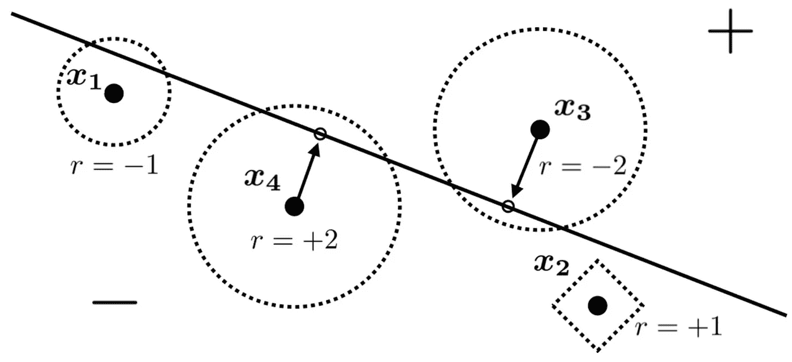
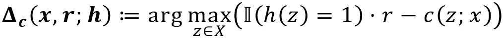
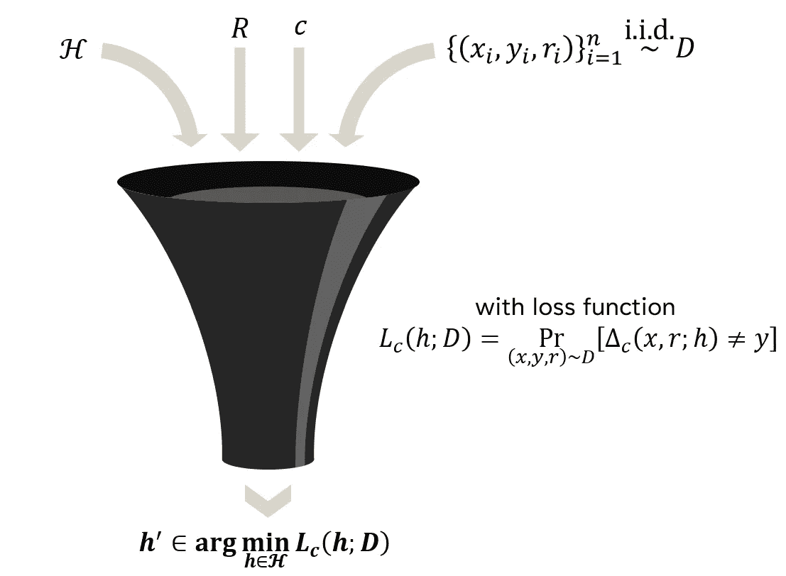

# 将 PAC 学习扩展到战略分类设置

> 原文：[`towardsdatascience.com/extending-pac-learning-to-a-strategic-classification-setting-6c374935dde2?source=collection_archive---------3-----------------------#2024-04-04`](https://towardsdatascience.com/extending-pac-learning-to-a-strategic-classification-setting-6c374935dde2?source=collection_archive---------3-----------------------#2024-04-04)

## 博弈论与机器学习基本概念交汇点的案例研究

 [Jonathan Yahav](https://jhyahav.medium.com/?source=post_page---byline--6c374935dde2--------------------------------)

·发布于[Towards Data Science](https://towardsdatascience.com/?source=post_page---byline--6c374935dde2--------------------------------) ·10 分钟阅读·2024 年 4 月 4 日

--

上学期，我参加了一个关于*激励与学习*的研讨会。我们在课程中讨论的论文涉及博弈论与机器学习领域的交集。之前我对正式的博弈论几乎没有了解，但我觉得通过机器学习与博弈论的交集来深入了解它是非常有趣的。在本文的结尾，我希望你也能产生这样的想法！

我们小组选择的论文是[***PAC-Learning for Strategic Classification***](https://arxiv.org/abs/2012.03310)(Sundaram, Vullikanti, Xu, & Yao, 2021)。它将基本的机器学习概念——[PAC 学习](https://en.wikipedia.org/wiki/Probably_approximately_correct_learning)——扩展到**战略**[二分类](https://en.wikipedia.org/wiki/Binary_classification)设置中。“战略”一词在这里意味着我们想要分类的数据点不仅仅是数据点，而是**代表具有自己个人偏好的理性主体**。

**这将是我从论文中总结的三部分系列文章。** **在本文中，我将阐述理解战略分类模型和设置所需的直观和形式化基础。** 在下一篇中，我将讨论战略 VC 维度的概念，作为[VC 维度](https://en.wikipedia.org/wiki/Vapnik%E2%80%93Chervonenkis_dimension)的一个泛化。最后一篇文章将详细讲解我最喜欢的论文证明，它将把前两篇中介绍的定义和思路串联起来。

理解二分类的概念以及在机器学习中使用的基本符号应该是理解本系列文章的全部所需。**最终的目标是以一种尽可能接近读者的方式呈现这些概念，无论你的背景如何。**

## 为什么战略分类有用：动机

**二分类是机器学习的基石。** 它是我在参加机器学习入门课程时学到的第一个主题；当时我们探讨的现实世界例子是将电子邮件分类为*垃圾邮件*或*非垃圾邮件*。其他常见的例子包括疾病诊断和简历筛选。

基本的二分类设定直观且容易应用于我们的日常生活，并且它可以作为一个有用的示范，展示**我们如何利用机器学习来解决*人类*问题**。但是，我们多久停下来考虑这样一个事实：**人们通常对此类问题的分类结果有既得利益？** 垃圾邮件发送者希望他们的邮件能够通过垃圾邮件过滤器，而不是每个人都希望他们的 COVID 测试呈阳性，求职者可能会愿意稍微歪曲事实以获得面试机会。**数据点不仅仅是数据点——它们是分类过程中的活跃参与者，常常试图通过操作系统来获得自己的利益。**

鉴于此，经典的二分类设定显得有些过于简化。然而，重新审视二分类并抛弃隐含假设——我们希望分类的对象不受外部利益的影响——似乎是不可行的。**影响分类过程的偏好表现形式多种多样——我们怎么可能把所有这些都考虑进去呢？**

**事实证明，在某些假设下，我们是可以做到的。** 通过巧妙地推广经典的二分类模型，论文的作者展示了设计计算上可处理、抗操控的分类算法的可行性。

## 从数据点到理性代理人：偏好类别

首先，如果我们想尽可能现实地反映问题，就必须恰当地考虑现实世界中理性代理人可能表现出的各种偏好形式。论文提到了五种逐渐通用的偏好类别（我将其称为*偏好类别*）。我为它们取的名字是我自己的，但基于论文中使用的术语。

1.  **公正：** 没有偏好，就像经典二分类中的情形一样。

1.  **同质性：** 所有相关代理人的偏好一致。例如，在愿意填写申请退税所需的表格的人群中，我们可以合理地预期每个人都有相同的动机来拿回他们的钱（即被积极分类）。

1.  **对抗性：** 动机相等的代理试图诱导与其真实标签相反的分类。可以将其与扑克牌中的虚张声势进行类比——一个手牌较弱的玩家（被负向分类）希望对手认为自己有一手强牌（被正向分类），反之亦然。对于“动机相等”的部分，可以想象所有玩家投注相同的金额。

1.  **广义对抗性：** 动机不相等的代理试图诱导与其真实标签相反的分类。这与普通的 *对抗性* 情况并无太大区别。不过，应该容易理解，若一个玩家赌注为 100 美元，他将比一个赌注为 1 美元的玩家更愿意采取更极端的手段来欺骗对手。

1.  **一般战略：** *“*任何事情都可以。”* 这个偏好类别旨在涵盖任何可以想象的偏好集。之前提到的四个偏好类别都是这个类别的严格子集。显然，这个类别是本文的主要关注点，文章中大多数展示的结果适用于它。作者提供了一个精彩的例子，关于大学申请，“*学生们对大学有异质化的偏好 […] 在录取过程中可能会操控他们的申请材料。*”

如何修改经典分类设置以考虑如此丰富的代理偏好？答案出奇简单。我们不再将范围限制于 (*x*, *y*) ∈ *X* × { -1, 1 }，**而是考虑形如 (*x*, *y*, *r*) ∈ *X* × { -1, 1 } × *R* 的数据点。** 一个点的 *r* 值表示它的偏好，我们可以将其分解为两个同等重要的组件：

+   **符号** *r* 表示**数据点是想被正向分类还是负向分类**（*r* > 0 或 *r* < 0）。

+   **绝对值** *r* 指定了**数据点的偏好强度**。例如，一个 *r* = 10 的数据点会比 *r* = 1 的数据点更强烈地倾向于操控其特征向量 *x*，以确保它最终被正向分类。

**我们操作的偏好类别由集合 *R* 决定。** 我们可以正式地根据 *R* 定义上述每个偏好类别，并查看这些正式定义如何与它们的直观描述和示例一致：

1.  **公正的：** *R* = { 0 }。*(这清楚地表明战略设置只是经典设置的一种推广。)*

1.  **同质的：** *R* = { 1 }。

1.  **对抗性：** *R* = { -1, 1 }，并且有一个附加要求，即所有数据点都倾向于被分类为与其真实标签相反的类别。

1.  **广义对抗性：** *R* ⊆ ℝ（且所有数据点都倾向于被分类为与其真实标签相反的类别。）

1.  **一般战略：** *R* ⊆ ℝ。

## 给予偏好大小意义：成本函数

然而，很明显，仅仅*R*本身不足以构建一个完整的通用战略框架。如果不将数据点的偏好与**数据点在操作其特征向量时所承担的代价**联系起来，那么数据点偏好具有某种大小的概念就毫无意义。否则，任何具有正* r *的 data point，无论其多么微小，都没有理由不对其特征向量进行**无限制地**操作。这就是**代价函数**概念发挥作用的地方。

设*c*: *X* × *X* → ℝ⁺。为简便起见，我们假设（正如论文作者所做的那样）*c*是由[半范数](https://en.wikipedia.org/wiki/Seminorm)引起的。我们可以说，一个**测试数据点**（*x*, *y*, *r*）可能将其特征向量*x*转换为*z* ∈ *X*，其**代价**为*c*(*z*; *x*)。在这个背景下，需要注意的是，论文假设训练数据是未经操作的。

我们可以将代价函数分为两类，前者是后者的一个子集。**实例不变的代价函数**在所有数据点上都是相同的。更正式地说：

> *∃ℓ:* X *×* X *→ ℝ⁺ 。∀(*x*,* y*,* r*) ∈* X *× { -1, 1 } ×* R *。∀*z *∈* X *。c*(*z*;* x*) = ℓ(*z *-* x*)*

即，存在一个函数ℓ，使得对于所有数据点和所有潜在的被操作特征向量，*c*(*z ; x*)只是取值为ℓ(*z* - *x*)。

一个**逐实例的代价函数**可能在数据点之间有所不同。形式化地说：

> *∀(*x*,* y*,* r*) ∈* X *× { -1, 1 } ×* R 。*∃ℓ*ₓ*:* X *×* X *→ ℝ⁺* 。∀*z *∈* X 。c*(*z*;* x*) = ℓ*ₓ*(*z - x*)*

即，**每个数据点可以有其自己的函数，** ℓ*ₓ*，并且*c*(*z; x*)对于每个单独的数据点取值为ℓ*ₓ*(*z - x*)。

正如我们将在本系列的最后一篇文章中看到的那样，尽管这两种类型的代价函数之间的区别看起来微妙，**逐实例的代价函数具有显著更强的表现力，并且更难学习。**

## 偏好类和代价函数的应用：一个例子

让我们看一下论文中给出的一个例子，帮助我们深入理解到目前为止所涵盖的设置方面。

图像由 *R. Sundaram, A. Vullikanti, H. Xu, F. Yao* 提供，来自 [**PAC-Learning for Strategic Classification**](https://arxiv.org/abs/2012.03310)（使用 [*CC-BY 4.0 许可证*](https://creativecommons.org/licenses/by/4.0/)）。

在这个例子中，我们有一个由线性二分类器引起的决策边界，以及四个具有个别偏好的数据点。在这种情况下，*General strategic*是唯一适用的偏好类别。

每个*xᵢ*周围的虚线边界展示了被操作的特征向量*z*，对于它来说，移动到该点的代价正好是 1。由于我们假设代价函数是由半范数引起的，边界内的每个点移动到相应的数据点的代价都小于 1。我们可以很容易看出，在这个例子中，代价函数在不同数据点之间有所不同，这意味着它是逐实例的。

如我们所见，**最左边的数据点 (*x*₁, -1, -1) 没有动机跨越决策边界**，因为它位于决策边界的负侧，并且具有负的偏好。然而，(*x*₄, -1, 2) 却希望被正向分类，且由于**操纵 *x*₄** 以跨越边界的**奖励（2）**大于**操作成本**（小于 1），**因此进行操作是合理的。** (*x*₃, 1, -2) 对称于 (*x*₄, -1, 2)，同样决定操控其特征以实现期望的分类结果。最后，**(*x*₂, -1, 1)**，其成本函数基于 [曼哈顿距离](https://en.wikipedia.org/wiki/Taxicab_geometry)，**选择保持原状，尽管它希望被正向分类。** 这是因为**操纵 *x*₂ 跨越决策边界的成本会大于 1，**超出该数据点通过此操作可能获得的奖励。

假设我们数据点代表的代理是理性的，**我们可以非常容易地判断一个数据点何时应该操控其特征向量**（收益大于成本）和何时不应该（成本大于收益）。**下一步是将我们的直观理解转化为更正式的形式。**

## 平衡成本与收益：定义 *数据点最佳响应*

这引导我们定义***数据点最佳响应*：**

那么我们要寻找哪个特征向量 *z* ∈ *X* 来最大化...到底是什么？**让我们将我们要最大化的表达式分解成更易管理的部分。**

+   ***h*:** 一个给定的二分类器 (*h*: *X* → { -1, 1 })。

+   ***c*(*z*; *x*):** 如上所述，这表示**修改特征向量 *x* 为 *z* 的成本。**

+   **𝕀(*h*(*z*) = 1):** 这里，𝕀(*p*) 是指示函数，当谓词 *p* 得到满足时返回 1，否则返回 0。谓词 *h*(*z*) = 1 表示如果向量 *z* 被 *h* 正向分类时成立。将这些组合在一起，我们发现，𝕀(*h*(*z*) = 1) 对于任何正向分类的 *z* 都会返回 1。如果 *r* 为正，那就好。如果为负，那就不好。

**底线是我们想找到特征向量 *z*，使得** 𝕀(*h*(*z*) = 1) ⋅ *r*，我们可以称之为*实际奖励*，尽可能超过将原始 *x* 转变为 *z* 的成本。** 用博弈论的术语来说，**数据点最佳响应最大化其对应代理在所考虑的二分类背景下的*效用*。**

## 综合起来：战略分类问题的正式定义

最后，我们已经铺垫好了所有必要的基础，来正式定义**战略分类问题。**

一个展示战略分类问题正式定义的图表。图像由作者提供。

给定一个假设类*H*，一个偏好类*R*，一个成本函数*c*，以及从分布*D*中抽取的*n*个数据点，我们希望找到一个二元分类器*h*'，使其最小化上图所定义的损失。注意，损失只是经典零一损失的修改，使用数据点的最佳响应替代*h*(*x*)。

## 结论

从经典的二元分类设置开始，我们引入了***偏好类***的概念。接下来，我们看到了如何使用每个数据点的***r*值**来形式化这一概念。然后我们看到如何通过***成本函数***来补充数据点的偏好。之后，我们通过一个例子来分解这一概念，并基于之前探讨的思路定义了***数据点最佳响应***的关键概念。最后，我们使用数据点最佳响应来定义用于战略分类问题定义的***修改版零一损失*。**

**下次加入我，看看我如何定义和解释战略 VC 维度，这是我们这次讨论后自然的下一步。**

 ## 定量分析战略分类问题的复杂性和可学习性

### 通过将 VC 维度的概念推广到战略环境，我们可以帮助我们理解一个问题是否…

towardsdatascience.com

## 参考文献

[1] R. Sundaram, A. Vullikanti, H. Xu, F. Yao. [PAC 学习与战略分类](https://arxiv.org/abs/2012.03310) (2021)，国际机器学习大会。
