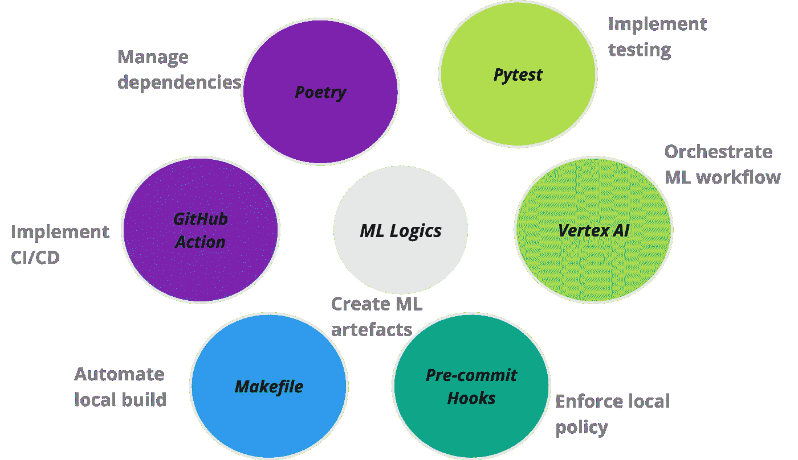
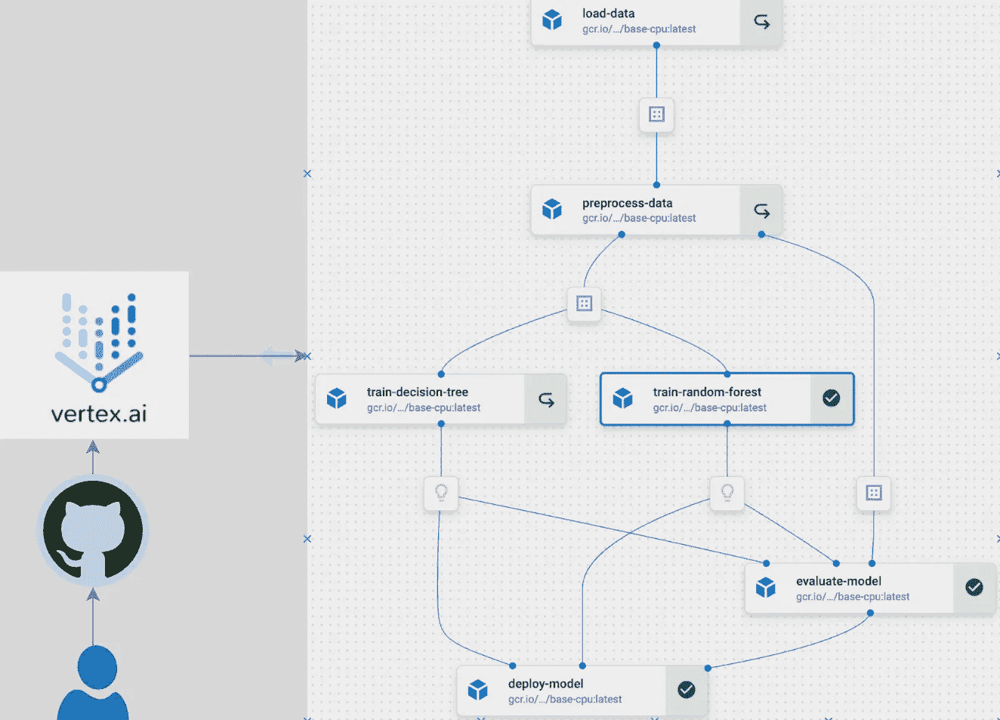
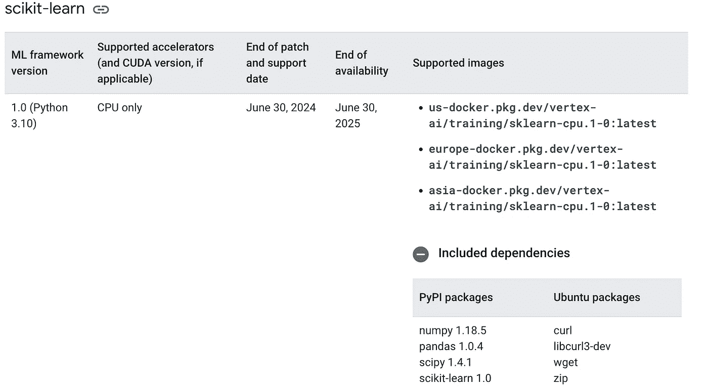
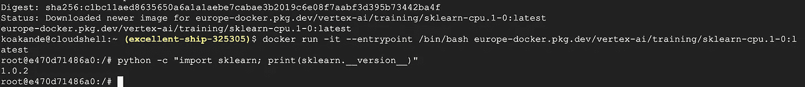

# 可扩展和可定制的 Vertex AI MLOps 平台

> 原文：[`towardsdatascience.com/extensible-and-customisable-vertex-ai-mlops-platform-a2c146d13186?source=collection_archive---------6-----------------------#2024-02-29`](https://towardsdatascience.com/extensible-and-customisable-vertex-ai-mlops-platform-a2c146d13186?source=collection_archive---------6-----------------------#2024-02-29)

## MLOps 平台

## 在 Vertex AI 上构建可扩展的 Kubeflow ML 管道，并“越狱”Google 预构建容器

[](https://koakande.medium.com/?source=post_page---byline--a2c146d13186--------------------------------)[](https://towardsdatascience.com/?source=post_page---byline--a2c146d13186--------------------------------) [Kabeer Akande](https://koakande.medium.com/?source=post_page---byline--a2c146d13186--------------------------------)

·发表于 [Towards Data Science](https://towardsdatascience.com/?source=post_page---byline--a2c146d13186--------------------------------) ·18 分钟阅读·2024 年 2 月 29 日

--



支持 MLOps 平台的工具及相应操作

当我去年决定写一篇关于在 Vertex AI 上构建可扩展管道的文章时，我考虑了不同的格式。最终，我决定构建一个功能完善的 MLOps 平台，由于时间限制，尽量精简，并将平台开源，供社区逐步开发。但时间证明是一个制约因素，我一直在拖延。在一些周末，当我终于决定整理材料时，我发现了许多问题，现在我已将这些问题记录下来，作为指南，帮助其他可能走相同道路的人。

这就是促使 [mlops-platform](https://github.com/kbakande/mlops-platform) 项目的发展的原因，该项目旨在展示如何利用 Kubeflow 管道在 VertexAI 上构建可扩展且具备操作能力的机器学习模型的简化、端到端流程。该平台的主要特点可以归纳为四个方面：首先，它封装了一个模块化且灵活的管道架构，能够支持机器学习生命周期的各个阶段，从数据加载和预处理到模型训练、评估、部署和推理。其次，它利用 Google Cloud 的 Vertex AI 服务实现无缝集成，确保最佳的性能、可扩展性和资源效率。第三，它构建了一系列常用操作，用于自动化机器学习工作流。最后，它记录了在构建此类规模项目时常见的挑战及其相应的解决方案。

我构建了这个*mlops 平台*，有两个主要目的：

1.  作为一个教育平台，社区成员可以在这里了解 MLOps 平台的基本组成部分，包括使该平台得以运行的各种操作。

1.  作为没有或几乎没有工程支持的团队的构建模块，使他们在开发数据科学和 ML 工程项目时能够自助服务

我希望这个平台能够通过社区的贡献继续成长。

尽管 Google 有一个包含大量使用 Vertex AI 流水线示例的[GitHub 仓库](https://github.com/GoogleCloudPlatform/vertex-ai-samples/tree/main)，但这个仓库难以浏览。而且，通常你需要在应用程序周围加上多个操作封装器来进行组织，因为会有多个团队使用该平台。而且在开发过程中，常常会出现一些问题没有得到足够的解决，导致开发者感到沮丧。尤其是在追赶生产周期时，Google 的支持可能不足。根据我的个人经验，即使我的公司有增强的支持，我也曾向 Google Vertex 工程团队提出一个问题，结果拖延了四个多月。此外，由于技术更新的速度非常快，论坛上的帖子可能无法得到期望的解决方案，因为只有少数人可能遇到过该问题。因此，拥有一个可用的端到端平台，并且能够获得社区支持是非常宝贵的。

顺便问一下，你听说过“痛点驱动开发”（PDD）吗？它类似于测试驱动开发或行为驱动开发。在 PDD 中，开发是由痛点驱动的。这意味着当团队感到受到影响并且能够合理化折衷时，就会对代码库进行更改。它遵循这样的原则：*如果它没有坏，别修*。不用担心，这篇文章将帮助你解决一些在使用 Google Vertex AI 时（特别是预构建容器）遇到的痛点，尤其是在构建可扩展的 ML 流水线时带来的困惑。不过，更准确地说，遵循 PDD 原则，我有意将它做成一个包含一些痛点的工作平台。我已详细列出了这些痛点，希望有兴趣的社区成员能够加入我，共同逐步整合解决方案。废话不多说，接下来我们切入正题！

Google Vertex AI 流程提供了一个框架，通过使用 Kubeflow 或 Tensorflow Extended 框架设计的流程来运行 ML 工作流。通过这种方式，Vertex AI 充当一个**编排平台**，允许将多个 ML 任务组合起来，并在 GCP 基础设施上自动执行它们。这是一个重要的区分点，因为我们并不是使用 Vertex AI 编写流程，而是它作为编排流程的平台。底层的 Kubeflow 或 Tensorflow Extended 流程遵循用于现代架构中编排任务的常见框架。该框架将逻辑与计算环境分开。在 ML 工作流的情况下，逻辑是 ML 代码，而计算环境是容器。两者合起来称为**组件**。当多个组件被组合在一起时，它们被称为流程。在这些编排平台中，类似的机制被用来在组件之间传递数据。关于流程的深入学习最好参考[Kubeflow](https://www.kubeflow.org/docs/components/pipelines/v2/)的文档以及我在参考文献部分链接的几篇博客文章。

我之前提到过调度平台的整体架构。像 Vertex AI 这样将逻辑与计算分离的类似架构的其他工具有 Airflow（任务和执行器）、GitHub actions（工作和运行器）、CircleCI（工作和执行器）等。我有一篇文章在准备中，内容是关于如何深入理解这种现代工作流架构中集成的关注点分离原则，可以在日常使用这些工具和故障排除中带来显著帮助。尽管 Vertex AI 是编排 ML 流程的代名词，但理论上，任何逻辑，如 Python 脚本、数据流程或任何容器化应用，都可以在该平台上运行。Composer，作为一个托管的 Apache Airflow 环境，是在 Vertex AI 之前 GCP 上的主要编排平台。这两个平台各有[优缺点](https://datatonic.com/insights/kubeflow-pipelines-cloud-composer-data-orchestration/)，在决定使用其中一个时需要加以考虑。

我将避免在这篇文章中大量展示代码，因为这些代码可以从平台的[代码库](https://github.com/kbakande/mlops-platform)轻松获取。不过，我会简要介绍 mlops 平台架构中的重要部分。请参考代码库以便跟进。



MLOps 平台

**组件**

平台的架构围绕一组定义良好的组件，这些组件位于 *components* 目录中。这些组件包括数据加载、预处理、模型训练、评估和部署，提供了一种模块化结构，便于定制和扩展。让我们看看其中一个组件，[preprocess_data.py](https://github.com/kbakande/mlops-platform/blob/main/components/preprocess_data.py)，以了解组件的一般结构。

```py
 from config.config import base_image
from kfp.v2 import dsl
from kfp.v2.dsl import Dataset, Input, Output

@dsl.component(base_image=base_image) 
def preprocess_data(
    input_dataset: Input[Dataset], 
    train_dataset: Output[Dataset],
    test_dataset: Output[Dataset],
    train_ratio: float = 0.7,  
):
    """
    Preprocess data by partitioning it into training and testing sets.
    """

    import pandas as pd
    from sklearn.model_selection import train_test_split

    df = pd.read_csv(input_dataset.path)
    df = df.dropna()

    if set(df.iloc[:, -1].unique()) == {'Yes', 'No'}:
        df.iloc[:, -1] = df.iloc[:, -1].map({'Yes': 1, 'No': 0})

    train_data, test_data = train_test_split(df, train_size=train_ratio, random_state=42)

    train_data.to_csv(train_dataset.path, index=False)
    test_data.to_csv(test_dataset.path, index=False)
```

仔细查看上面的脚本，你会发现一个熟悉的数据科学工作流。这个脚本所做的只是读取一些数据，将它们拆分以进行模型开发，然后将拆分后的数据写入某个路径，以便下游任务可以轻松访问。然而，由于这个函数将在 Vertex AI 上运行，它被一个 Kubeflow 流水线装饰器 *@dsl.component(base_image=base_image)*，这标记该函数为一个 Kubeflow 流水线组件，在 `base_image` 容器中运行。稍后我会谈到 `base_image`。这就是在 Vertex AI 上的容器中运行函数所需的所有内容。一旦我们以类似的方式构建了其他所有函数，并将它们装饰为 Kubeflow 流水线组件，`mlpipeline.py` 函数将导入每个组件以构建流水线。

```py
#mlpipeline.py

from kfp.v2 import dsl, compiler
from kfp.v2.dsl import pipeline
from components.load_data import load_data
from components.preprocess_data import preprocess_data
from components.train_random_forest import train_random_forest
from components.train_decision_tree import train_decision_tree
from components.evaluate_model import evaluate_model
from components.deploy_model import deploy_model
from config.config import gcs_url, train_ratio, project_id, region, serving_image, service_account, pipeline_root
from google.cloud import aiplatform

@pipeline(
    name="ml-platform-pipeline",
    description="A pipeline that performs data loading, preprocessing, model training, evaluation, and deployment",
    pipeline_root= pipeline_root
)
def mlplatform_pipeline(
    gcs_url: str = gcs_url,
    train_ratio: float = train_ratio,
    ):
    load_data_op = load_data(gcs_url=gcs_url)
    preprocess_data_op = preprocess_data(input_dataset=load_data_op.output, 
                                         train_ratio=train_ratio
                                         )

    train_rf_op = train_random_forest(train_dataset=preprocess_data_op.outputs['train_dataset'])
    train_dt_op = train_decision_tree(train_dataset=preprocess_data_op.outputs['train_dataset'])

    evaluate_op = evaluate_model(
        test_dataset=preprocess_data_op.outputs['test_dataset'],
        dt_model=train_dt_op.output,
        rf_model=train_rf_op.output
    )

    deploy_model_op = deploy_model(
        optimal_model_name=evaluate_op.outputs['optimal_model'],
        project=project_id,
        region=region,
        serving_image=serving_image,
        rf_model=train_rf_op.output,
        dt_model=train_dt_op.output
    )

if __name__ == "__main__":
    pipeline_filename = "mlplatform_pipeline.json"
    compiler.Compiler().compile(
        pipeline_func=mlplatform_pipeline,
        package_path=pipeline_filename
    )

    aiplatform.init(project=project_id, location=region)
    _ = aiplatform.PipelineJob(
        display_name="ml-platform-pipeline",
        template_path=pipeline_filename,
        parameter_values={
            "gcs_url": gcs_url,
            "train_ratio": train_ratio
        },
        enable_caching=True
    ).submit(service_account=service_account)
```

`@pipeline` 装饰器使得函数 `mlplatform_pipeline` 可以作为流水线运行。然后，流水线将被编译成指定的流水线文件名。在这里，我指定了 `JSON` 配置扩展名用于编译后的文件，但我认为 Google 正在转向使用 `YAML`。编译后的文件随后会被 `aiplatform` 拿到，并提交给 Vertex AI 平台执行。

在开始使用 Kubeflow 流水线时，唯一让我感到困惑的就是[参数和工件](https://www.kubeflow.org/docs/components/pipelines/v2/data-types/)的设置，因此请查看一下，帮助你快速上手。

**配置**

*config* 目录中的配置文件便于在流水线的不同阶段调整参数和设置。除了配置文件，我还包含了一个 `dot.env` 文件，其中有关于变量的注释，旨在指导如何加载到 `config` 文件中的变量。

**笔记本**

我通常在笔记本中开始我的工作流和探索，因为它便于交互。因此，我包含了 *notebooks* 目录作为实验不同组件逻辑的一种方式。

**测试**

测试在确保机器学习工作流和管道的稳健性和可靠性方面起着非常重要的作用。全面的测试建立了一个系统化的方法来评估每个组件的功能，并确保它们按预期运行。这减少了在执行阶段出现错误和故障的情况。我已经包括了一个`test_mlpipeline.py`脚本，主要作为测试过程的指南。它使用[pytest](https://pytest.org/en/7.4.x/getting-started.html)来说明测试概念，并提供了一个构建框架。

**项目依赖**

在开发企业级应用时，管理[依赖](https://www.linkedin.com/posts/maria-vechtomova_python-softwaredevelopment-activity-7157288974921662464-q7kR?utm_source=share&utm_medium=member_desktop)可能是一个噩梦。考虑到机器学习工作流中需要的各种包，以及为了使其能够运行所需的各种软件应用程序，管理这些依赖关系可能变成一项艰巨的任务。一个正在逐渐获得关注的包是[Poetry](https://python-poetry.org/docs/)。它是一个用于 Python 中的依赖管理和打包的工具。Poetry 生成的关键文件是`pyproject.toml`和`poetry.lock`。`pyproject.toml`文件是一个配置文件，用于存储项目元数据和依赖关系，而`poetry.lock`文件则锁定依赖项的确切版本，确保在不同环境中的构建具有一致性和可重现性。这两个文件共同增强了依赖关系解析。我已经演示了如何使用这两个文件替代容器中的`requirement.txt`，并使用它们生成此项目的训练容器镜像。

**Makefile**

Makefile 是一个构建自动化工具，通过一组预定义的规则促进项目任务的编译和执行。开发人员通常使用 Makefile 来简化工作流程，自动化重复任务，并确保一致和可重现的构建。*mlops-platform*中的 Makefile 具有预定义的命令，可以无缝运行整个管道并确保组件的可靠性。例如，指定为默认目标的`all`目标有效地编排了 ML 管道（`run_pipeline`）和测试（`run_tests`）的执行。此外，Makefile 还提供了一个`clean`目标，用于清理临时文件，而`help`目标则提供了一个可用命令的快速参考。

## **文档**

项目的文档记录在*README.md*文件中，提供了项目的全面指南。它包括有关安装、使用以及设置 Google Cloud Platform 服务的详细说明。

**CI/CD 编排**

GitHub Actions 工作流定义在 *.github/workflows* 目录中，对于自动化测试、构建和将机器学习管道部署到 Vertex AI 的过程至关重要。该 CI/CD 方法确保对代码库的每次更改都能被持续验证和部署，从而提高项目的可靠性并减少错误发生的可能性。工作流会在每次推送到主分支时触发，或者可以手动执行，提供无缝且可靠的集成过程。

**推理管道**

实现推理或预测管道的方法有多种。我在这里采用了传统的方式，通过加载预测特征和上传的模型，从模型中获取预测结果并将预测结果写入 BigQuery 表。值得注意的是，尽管有很多关于预测容器的讨论，但如果仅需要批量预测，实际上并不需要预测容器。我们完全可以使用训练容器来进行批量预测，正如平台中所演示的那样。然而，在线预测时需要使用预测容器。我还包括了本地测试批量预测管道的方式，且这一方法可以推广到测试其他组件或任何脚本。可以通过导航到 *batch_prediction/batch_prediction_test* 目录，替换占位符变量并运行以下命令来进行本地测试：

```py
# First build the image using Docker
docker build -f Dockerfile.batch -t batch_predict .

# The run batch prediction pipeline locally using the built image from above
docker run -it \
     -v {/local/path/to/service_acount-key.json}:/secrets/google/key.json \
     -e GOOGLE_APPLICATION_CREDENTIALS=/secrets/google/key.json \
     batch_predict \
     --model_gcs_path={gs://path/to/gcs/bucket/model.joblib} \
     --input_data_gcs_path={gs://path/to/gcs/bucket/prediction_data.csv} \
     --table_ref={project_id.dataset.table_name} \
     --project={project_id}
```

服务账户需要在 GCP 上具有[适当的访问权限](https://stackoverflow.com/questions/46287267/how-can-i-get-the-file-service-account-json-for-google-translate-api)，才能执行上述任务，应该具有从 GCP 存储桶读取和向 BigQuery 表写入的权限。

# 挑战与解决方案：`越狱` Google Vertex AI 预构建容器

在构建此项目过程中遇到的一些挑战来源于使用容器镜像以及 Google 预构建容器中的相关软件包版本。我推测 Google 创建预构建容器的主要目标是减轻数据科学家的主要工程任务，让他们能主要集中于机器学习逻辑。然而，为了确保实现这一目标，还需要做更多的工作，因为预构建容器存在版本不匹配的问题，这需要进行大量的调试工作。我已经详细列出了一些挑战以及可能的解决方案。

1.  **多架构镜像构建**: 虽然使用 macOS 有其优势，但在 macOS 上构建容器镜像并将其部署到云平台上可能并非其中之一。主要的挑战是，大多数云平台支持在 *amd64* 架构上运行 Linux，而最新的 macOS 系统运行在 *arm64* 架构上。因此，在 macOS 上编译的二进制文件通常与 Linux 不兼容。这意味着，在 macOS 上成功编译的镜像在大多数云平台上运行时可能会失败。而且，由于错误日志消息通常是含糊的且没有帮助，这使得调试变得非常困难。**需要注意的是，这个问题存在于大多数现代云平台中，并非 GCP 独有**。因此，存在多种解决方法来克服这一挑战。

+   **使用 BuildX**: [Buildx](https://www.docker.com/blog/multi-arch-build-and-images-the-simple-way/) 是一个 Docker CLI 插件，允许构建一个多架构容器镜像，可以在多个平台上运行。确保已安装 Docker 桌面版，因为它是本地构建镜像所必需的。或者，可以通过 Google Cloud Shell 来构建镜像。以下脚本将在 macOS 上构建一个兼容的容器镜像，并将其推送到 GCP artifact registry。

```py
# start Docker Desktop (can also open manually)
open -a Docker

# authentucate to GCP if desired to push the image to GCP artifact repo
gcloud auth login
gcloud auth configure-docker "{region}-docker.pkg.dev" --quiet

# create and use a buildx builder instance (only needed once)
docker buildx create --name mybuilder --use
docker buildx inspect --bootstrap

# build and push a multi-architecture Docker image with buildx
docker buildx build --platform linux/amd64,linux/arm64 -t "{region}-docker.pkg.dev/{project_id}/{artifact_repo}/{image-name}:latest" -f Dockerfile --push .
```

容器的名称遵循 Google 特定的命名格式，详见 [容器](https://cloud.google.com/artifact-registry/docs/docker/names)。

+   **设置 Docker 环境** [**变量**](https://stackoverflow.com/questions/65612411/forcing-docker-to-use-linux-amd64-platform-by-default-on-macos): 在 macOS 系统配置文件中永久设置 *DOCKER_DEFAULT_PLATFORM*，以确保 Docker 始终构建与 Linux *amd64* 兼容的镜像。

```py
# open Zsh config file (I use visual code but it could be other editor like nano)
code ~/.zshrc

# insert at the end of file
export DOCKER_DEFAULT_PLATFORM=linux/amd64

# save and close file then apply changes
source ~/.zshrc
```

2\. **预构建容器镜像中的版本冲突：** Google 为[预测](https://cloud.google.com/vertex-ai/docs/predictions/pre-built-containers)和[训练](https://cloud.google.com/vertex-ai/docs/training/pre-built-containers)任务维护了一系列预构建镜像。这些容器镜像为常见的机器学习框架提供了不同版本。然而，我发现文档中列出的版本有时与实际版本不符，这在使用这些容器镜像时是一个主要的失败点。鉴于社区在标准化版本和依赖关系方面的努力，以及容器技术主要是为了解决应用程序可靠执行的问题，我认为 Google 应该致力于解决预构建容器镜像中的版本冲突。不要误会，版本不匹配的斗争可能让人沮丧，这也是为什么我鼓励在使用这些镜像之前进行“越狱”。在编写这个教程时，我决定使用`europe-docker.pkg.dev/vertex-ai/training/sklearn-gpu.1-0:latest`和`europe-docker.pkg.dev/vertex-ai/prediction/sklearn-cpu.1-0:latest`。从命名约定来看，两个镜像应该是兼容的，并且都应该包含`sklearn==1.0`。事实上，网站上确认了这一点，如下图所示，容器镜像的 artifact registry 也显示了这一点。



来自训练预构建镜像的截图，[页面](https://cloud.google.com/vertex-ai/docs/training/pre-built-containers)

然而，现实却不同。当我将构建的模型部署到端点时，遇到了版本不匹配的错误。错误消息的一部分如下所示。

*尝试从版本 1.0.2 中反序列化估算器 OneHotEncoder，而使用的是版本 1.0*

惊讶！惊讶！惊讶！基本上，日志所说的是你已经用版本*1.0.2*进行了序列化，但尝试用版本*1.0*进行反序列化。为了推进，我决定进行一些“越狱”，并查看预构建容器镜像的内部。这是一个非常基础的过程，但却引发了许多问题。

1.  从终端或 Google [Cloud Shell](https://console.cloud.google.com/home/dashboard?cloudshell=true)

1.  从 Google Artifact Registry 拉取相应的镜像

```py
docker pull europe-docker.pkg.dev/vertex-ai/training/sklearn-cpu.1-0:latest
```

3\. 运行镜像，覆盖其入口命令，并进入其 bash shell 终端

```py
docker run -it --entrypoint /bin/bash europe-docker.pkg.dev/vertex-ai/training/sklearn-cpu.1-0:latest
```

4\. 检查 *sklearn* 版本

```py
python -c "import sklearn; print(sklearn.__version__)"
```

截至本文撰写时，输出如下截图所示：



对于 `europe-docker.pkg.dev/vertex-ai/prediction/sklearn-cpu.1-3:latest` 执行类似的操作时，sklearn 版本是 `1.3.2`，而 `1.2` 版本则是 `1.2.2`。更让人困惑的是，`pandas` 在版本 `1–2` 和 `1-3` 中都缺失了，这让人质疑预构建容器是否得到了积极维护。当然，问题不在于小更新，而在于相应的预测镜像没有类似的更新，这导致了上述的版本不匹配错误。

当我联系 Google 支持报告不匹配问题时，Vertex AI 工程团队提到了替代方案，如自定义预测例程（Custom prediction routines, CPR）和 SklearnPredictor。并且我被指引查看了具有类似问题和缺失 `pandas` 的较新镜像版本！

接下来，如果你感觉像个勇敢的心（Braveheart），并且想深入探索，可以通过在容器内运行 `ls` 命令，查看 Google 启动预构建容器时运行的所有其他文件，查看文件和文件夹。

# 构建基础镜像

所以在发现问题后，如何才能仍然利用预构建容器呢？我所做的是从容器中提取所有**相关**的包。

```py
pip freeze > requirement.txt
cat requirement.txt
```

上述命令将提取所有已安装的包，并将其打印到容器终端。然后，可以复制这些包并在创建自定义容器镜像时使用，确保训练和预测容器中的 ML 框架版本匹配。如果你更喜欢将文件内容复制到本地目录，可以使用以下命令：

```py
# If on local terminal, copy requirements.txt into current directory
docker cp {running-container}:/requirements.txt .
```

预构建容器中的某些包对于单个项目可能不需要，因此最好选择与工作流程匹配的包。最重要的是锁定 ML 框架版本，无论是 *sklearn* 还是 *xgboost*，确保训练和预测的版本匹配。

我基本上锁定了 sklearn 版本，以匹配预构建预测镜像的版本。在这种情况下，它是版本 `1.0`，其余的包保持不变。

然后，构建自定义训练镜像时，使用以下命令：

```py
# commands to build the docker
#first authenticate to gcloud

# gcloud auth login
gcloud auth configure-docker

# Build the image using Docker
docker build -f docker/Dockerfile.poetry -t {region}-docker.pkg.dev/{gcp-project-id}/{gcp-artifact-repo}/{image-name}:latest .
```

上述内容的意思是：

+   docker: 嘿，Docker！

+   build: 为我构建一个镜像

+   -f: 使用以下文件

+   -t: 将其标记（或命名）为以下内容

+   . : 如果需要，使用当前目录中的文件（此处为当前目录）

然后，可以通过以下方式将构建的镜像推送到工件注册表：

```py
# Push to artifact registry
docker push {region}-docker.pkg.dev/{gcp-project-id}/{gcp-artifact-repo}/{image-name}:latest
```

# 视野

这个项目需要添加许多扩展，我将邀请有意的贡献者积极参与。以下是我一些详细的想法，但也欢迎提出其他改进建议。通过 PR 欢迎贡献。我希望这个仓库能够得到那些想学习端到端 MLOps 的人的积极开发，并且作为小团队构建基础的基石。

+   **监控管道：** 可观察性是 MLOps 平台的核心功能。它使团队能够主动监控平台的状态和行为，并在出现异常时采取适当的行动。`mlops-platform`缺少一个监控管道，这将是一个不错的补充。我计划写一篇关于自定义监控管道实现的文章，但与此同时，Vertex AI 有一个可以集成的[监控管道](https://cloud.google.com/vertex-ai/docs/model-monitoring/overview)。

+   **推理管道：** Vertex AI 有一个[批量预测](https://cloud.google.com/vertex-ai/docs/predictions/get-batch-predictions)方法，可以进行集成。可以提出一个论点，当前在 mlops 平台上的自定义批量预测是否具备可扩展性。主要问题是预测特征被加载到预测环境中，可能会在非常大的数据集上遇到内存问题。我之前没有遇到过这个问题，但可以预见到它的发生。在 Google 将 aiplatform 更名为 Vertex AI 之前，我一直将模型部署到 aiplatform，以便利用其模型版本管理，但会在 Composer 中运行批量预测管道。我更喜欢这种方法，因为它在预处理和后处理方面提供了灵活性。此外，Google 的批量预测方法在[调试](https://datatonic.com/insights/vertex-ai-improving-debugging-batch-prediction/)时比较繁琐和棘手。当出现问题时，调试过程比较困难。不过，我认为随着时间的推移，它会有所改进，因此会成为平台的一个不错的补充。

+   **重构：** 尽管我在实现中将计算和逻辑代码耦合在同一文件中，但我认为如果将它们分开会更清晰。解耦这两者将提高代码的模块化，并增强代码的可重用性。此外，应为不同的管道文件创建一个管道目录，并可能集成监控管道。

+   **完全自定义：** 容器应完全自定义，以便进行精细控制和灵活性。这意味着训练和预测容器都需要进行自定义构建。

+   **测试：** 我已经集成了一个测试框架，它在平台内成功运行，但它不是一个功能性测试逻辑。它确实提供了一个框架，用于构建覆盖数据质量、组件和管道功能测试的适当测试。

+   **容器化集成：** 容器基础镜像的创建目前是手动进行的，但应该集成到 makefile 和 GitHub action 工作流中。

+   **文档：** 文档需要更新，以反映新增的功能，并确保不同技能的人可以轻松浏览平台。目前请更新 READ.me 文件，但该项目长期应使用[Sphinx](https://www.sphinx-doc.org/en/master/)。

+   **预提交钩子**：这是一个可以很好利用的重要自动化工具。预提交钩子是配置脚本，在执行提交之前运行，帮助强制执行代码风格和策略。例如，平台中的钩子强制执行代码风格检查，防止提交大文件以及提交到主分支。然而，我的主要想法是使用它来动态更新来自`.env`文件的 GitHub 秘密。当前实现中，GitHub 秘密是静态类型的，因此当某些变量发生变化时，它们不会自动传播到 GitHub 秘密。当添加新变量时，也需要手动将其传播到 GitHub。可以使用预提交钩子来解决这个问题，指示其自动将本地`.env`文件中的更改传播到 GitHub 秘密。

+   **基础设施配置**：Artifact Registry、GCP Bucket、BigQuery 表和服务账户目前都需要手动配置，但它们的创建应该通过[Terraform](https://cloud.google.com/docs/terraform)进行自动化。

+   **调度程序**：如果这是一个批量预测或持续训练管道，我们希望将其安排在特定的时间和频率运行。Vertex AI 提供了多种选项来[配置](https://cloud.google.com/vertex-ai/docs/pipelines/schedule-pipeline-run#aiplatform_create_pipeline_schedule_sample-python_vertex_ai_sdk)调度。事实上，没有这个功能，一个编排平台就不完整。

+   **附加模型**：目前平台内有两个模型（随机森林和决策树），但应该可以直接添加其他框架，例如 xgboost 和 light GBM，用于建模表格数据。

+   **安全性**：GitHub 操作使用服务账户来进行 GCP 服务的身份验证，但理想情况下应该使用[工作流身份联合](https://cloud.google.com/iam/docs/workload-identity-federation)。

+   **分发**：该平台在当前状态下适用于教育目的以及可能的个人项目。然而，对于更大的团队，它需要进行适配。考虑到由具有不同技能和面临不同挑战的个体组成的团队。在这方面，平台界面可以通过使用[click](https://click.palletsprojects.com/en/8.1.x/)进行改进，具体细节见[这篇](https://medium.com/@vmo2techteam/the-journey-to-streamlining-our-ml-platform-interface-using-our-cli-tool-fd4735474cd5)文章。之后，可以将其打包并[分发](https://packaging.python.org/en/latest/tutorials/packaging-projects/)以确保简便的安装。同时，分发使我们能够对包进行更改并集中更新，以便根据需要传播。可以使用 Poetry 进行打包和分发，因此，使用它进行依赖管理为我们奠定了良好的基础。

# **总结**

MLOps 平台提供了一个模块化和可扩展的管道架构，用于实现不同的机器学习生命周期阶段。它包含各种操作，使得该平台能够无缝运行。最重要的是，它为潜在的贡献者提供了学习机会，并应作为团队在其机器学习任务中构建的良好基础。

# 结论

好了，就是这些！如果你能看到这里，恭喜你，做得很好。我希望你能从这篇文章中获益。欢迎留下评论和反馈，也请与我在[LinkedIn](https://www.linkedin.com/in/koakande/)上联系。如果你觉得这篇文章有价值，不要忘了点赞并为[MLOps 平台](https://github.com/kbakande/MLOPS-Platform)仓库加个星。

**参考文献**

MLOps 仓库: [`github.com/kbakande/mlops-platform`](https://github.com/kbakande/mlops-platform)

[`medium.com/google-cloud/machine-learning-pipeline-development-on-google-cloud-5cba36819058`](https://medium.com/google-cloud/machine-learning-pipeline-development-on-google-cloud-5cba36819058)

[`medium.com/@piyushpandey282/model-serving-at-scale-with-vertex-ai-custom-container-deployment-with-pre-and-post-processing-12ac62f4ce76`](https://medium.com/@piyushpandey282/model-serving-at-scale-with-vertex-ai-custom-container-deployment-with-pre-and-post-processing-12ac62f4ce76)

[`medium.com/mlearning-ai/serverless-prediction-at-scale-part-2-custom-container-deployment-on-vertex-ai-103a43d0a290`](https://medium.com/mlearning-ai/serverless-prediction-at-scale-part-2-custom-container-deployment-on-vertex-ai-103a43d0a290)

[`datatonic.com/insights/vertex-ai-improving-debugging-batch-prediction/`](https://datatonic.com/insights/vertex-ai-improving-debugging-batch-prediction/)

[`econ-project-templates.readthedocs.io/en/v0.5.2/pre-commit.html`](https://econ-project-templates.readthedocs.io/en/v0.5.2/pre-commit.html)
