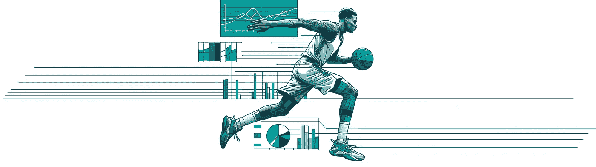
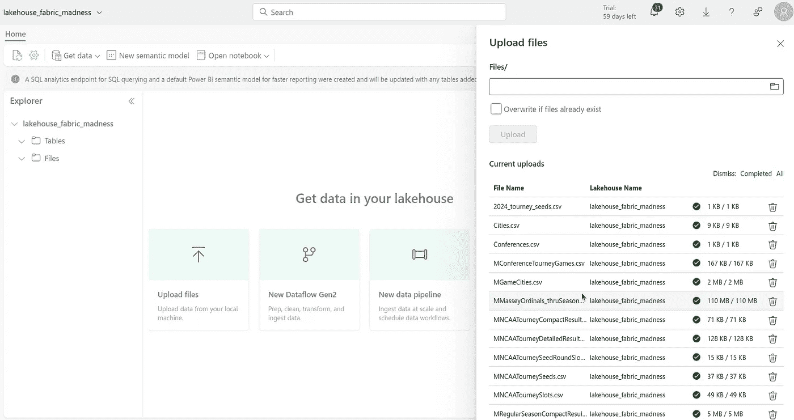
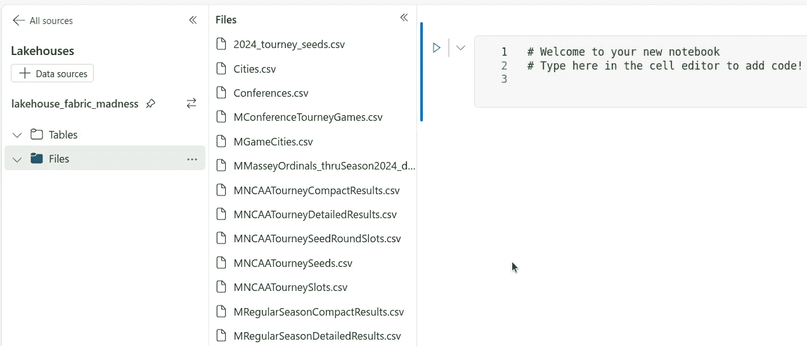
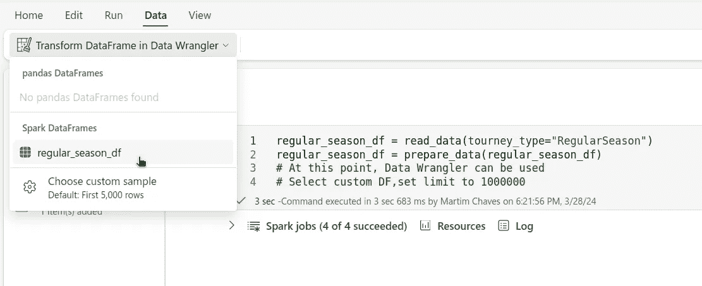
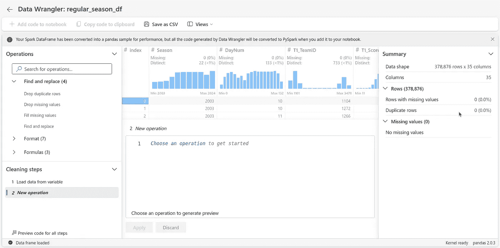
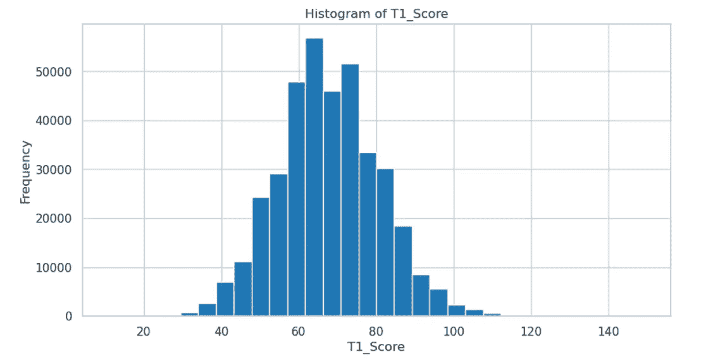
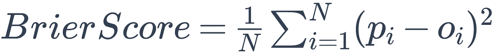
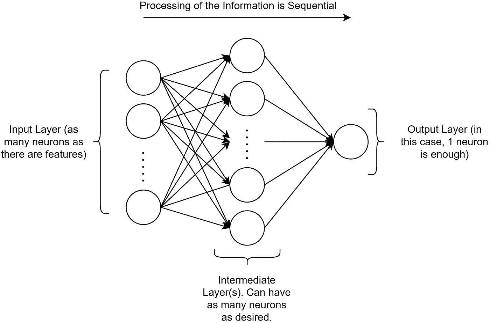
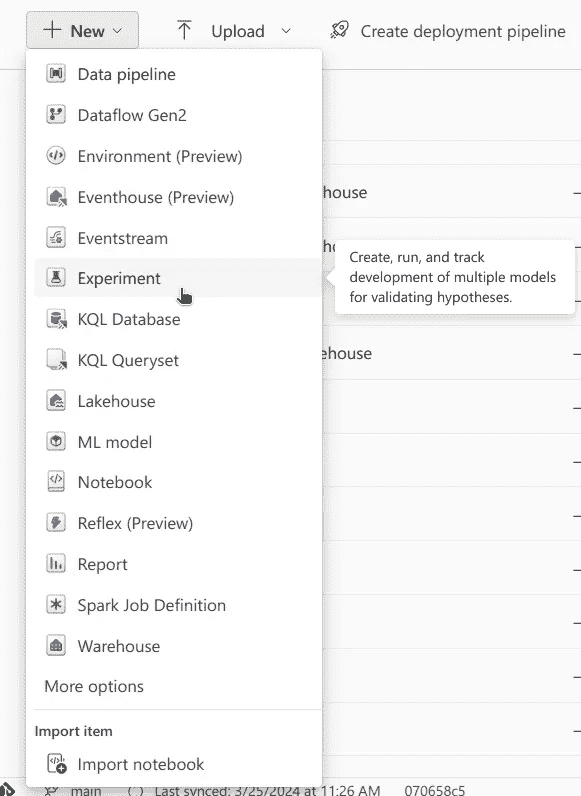
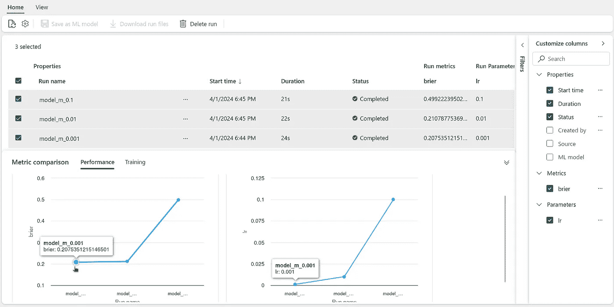

# Fabric Madness

> 原文：[`towardsdatascience.com/fabric-madness-96b84dc5f241?source=collection_archive---------6-----------------------#2024-04-01`](https://towardsdatascience.com/fabric-madness-96b84dc5f241?source=collection_archive---------6-----------------------#2024-04-01)

## 使用 Microsoft Fabric 预测篮球比赛

 [Roger Noble](https://medium.com/@roger_noble?source=post_page---byline--96b84dc5f241--------------------------------)

·发表于[Towards Data Science](https://towardsdatascience.com/?source=post_page---byline--96b84dc5f241--------------------------------) ·10 分钟阅读·2024 年 4 月 1 日

--

图片由作者和 ChatGPT 提供。“设计一个插图，专注于一名篮球运动员在比赛中的动作，设计融合了体育和数据分析主题，采用图画小说风格”提示。ChatGPT, 4, OpenAI, 2024 年 3 月 28 日。[`chat.openai.com.`](https://chat.openai.com./)

*特别感谢* [*Martim Chaves*](https://medium.com/u/1c5c115c8045?source=post_page---user_mention--96b84dc5f241--------------------------------) *共同撰写了这篇文章并开发了示例脚本。*

在撰写本文时，美国正值篮球赛季，男子和女子大学篮球锦标赛引起了极大的关注。比赛采用单场淘汰制，经过几轮淘汰，最终将产生冠军。这个比赛不仅展示了即将崭露头角的篮球人才，更重要的是，它为像我们这样的数据爱好者提供了一个肥沃的土壤，让我们分析趋势并预测结果。

体育运动的一大优点是有大量的数据可以获取，我们在[Noble Dynamic](https://nobledynamic.com/)希望尝试一下这个领域🤓。

在这个名为*Fabric Madness*的系列文章中，我们将深入探讨一些[Microsoft Fabric](https://www.microsoft.com/en-us/microsoft-fabric)的最有趣功能，展示如何进行端到端的机器学习模型训练和应用。

在这篇第一篇博文中，我们将讨论：

+   使用[Data Wrangler](https://learn.microsoft.com/en-us/fabric/data-science/data-wrangler)查看数据的初步分析。

+   探索性数据分析（EDA）和特征工程

+   通过实验跟踪不同机器学习（ML）模型的表现

+   使用 ML 模型功能选择最佳表现的模型

# 数据

使用的数据来自正在进行的 Kaggle 比赛，详细信息可以在[此处](https://www.kaggle.com/competitions/march-machine-learning-mania-2024/overview)找到，并且该数据已获得[CC BY 4.0](http://creativecommons.org/licenses/by/4.0/)许可[1]

在所有可用的有趣数据中，我们这次案例研究的重点是逐场比赛统计数据。这些数据涵盖了常规赛和锦标赛，一直到 2003 年。对于每场比赛，除了日期、参赛队伍和得分外，还提供了其他相关特征，例如每个队伍的投篮命中数和个人犯规次数。

## 加载数据

第一步是创建一个 Fabric **工作空间**。工作空间是 Fabric 平台的基本构建模块之一，用于将相关项组织在一起，并进行协作。

下载所有可用的 CSV 文件后，创建了一个**Lakehouse**。简而言之，Lakehouse 是表格型*数据库*（结构化）与文件型*数据湖*（非结构化）的结合。Lakehouse 的一个主要优势是，数据可以供工作空间中的每个工具使用。

文件上传是通过用户界面完成的：

图 1 — 上传文件。图片来源：[Martim Chaves](https://medium.com/u/1c5c115c8045?source=post_page---user_mention--96b84dc5f241--------------------------------)

现在我们已经有了包含 CSV 文件的 Lakehouse，是时候深入探索并初步查看数据了。为此，我们使用用户界面创建了一个笔记本，并附加了之前创建的 Lakehouse。

图 2 — 向笔记本添加 Lakehouse。图片来源：[Martim Chaves](https://medium.com/u/1c5c115c8045?source=post_page---user_mention--96b84dc5f241--------------------------------)

## 初步查看

经过快速的数据整理后，发现，正如预期的那样，来自 Kaggle 的数据质量非常好，没有重复项或缺失值。

对于这个任务，我们使用了 [Data Wrangler](https://learn.microsoft.com/en-us/fabric/data-science/data-wrangler)，这是一个内置于 Microsoft Fabric 笔记本的工具。创建初始 DataFrame（支持 Spark 或 Pandas）后，Data Wrangler 可以开始使用，并且可以连接到笔记本中的任何 DataFrame。它的优点是，能够方便地分析加载的 DataFrame。

在笔记本中，将文件读取到 PySpark DataFrame 后，在“数据”部分，选择了“在 Data Wrangler 中转换 DataFrame”，从那里可以探索多个 DataFrame。可以选择特定的 DataFrame，并进行仔细检查。

图 3 — 打开 Data Wrangler。图片来源：[Martim Chaves](https://medium.com/u/1c5c115c8045?source=post_page---user_mention--96b84dc5f241--------------------------------)

图 4 — 使用数据处理工具分析数据框。图片来自[Martim Chaves](https://medium.com/u/1c5c115c8045?source=post_page---user_mention--96b84dc5f241--------------------------------)

在中间，我们可以访问已加载数据框的所有行。右侧是一个**摘要**标签页，显示确实没有重复值或缺失值。点击某一列后，将显示该列的汇总统计信息。

在左侧的**操作**标签页中，有多个预设的操作可以应用到数据框（DataFrame）。这些操作涵盖了许多最常见的数据处理任务，如过滤、排序和分组，是快速生成这些任务的模板代码的一种方式。

在我们的案例中，数据已经很完美，所以我们进入了 EDA 阶段。

## 探索性数据分析

随后进行了一次简短的探索性数据分析（EDA），目的是对数据有一个大致的了解。绘制了图表，以了解数据的分布情况，并查看是否存在由于非常长的尾部等原因可能会导致问题的统计数据。

图 5 — 投篮命中数的直方图。图片来自[Martim Chaves](https://medium.com/u/1c5c115c8045?source=post_page---user_mention--96b84dc5f241--------------------------------)

一眼看去，发现来自常规赛的数据呈正态分布，适合用于特征创建。鉴于优秀的特征在构建稳健预测系统中的重要性，下一步的合理操作是进行特征工程，从数据中提取相关信息。

目标是创建一个数据集，其中每个样本的输入是一个包含两队信息的比赛特征集。例如，两个队伍在常规赛中的场均投篮命中数。每个样本的目标输出是 1（如果队伍 1 赢得比赛），或者 0（如果队伍 2 赢得比赛，方法是通过减去得分来确定）。以下是数据集的表示：

## 特征工程

我们决定探索的第一个特征是胜率。它不仅是一个有趣的特征，而且还可以提供一个基准分数。这个初步方法使用了一个简单的规则：胜率较高的队伍将被预测为获胜者。这个方法提供了一个基本的基准，可以用来与更复杂的预测系统的表现进行比较。

为了评估不同模型在预测准确性方面的表现，我们采用了布赖尔评分（Brier score）。布赖尔评分是每个样本的预测概率（p）与实际结果（o）之间差异的平方的平均值，可以通过以下公式描述：

作者提供的图片

预测的概率将在 0 和 1 之间变化，而实际结果则为 0 或 1。因此，Brier 分数始终会介于 0 和 1 之间。我们希望预测的概率尽可能接近实际结果，Brier 分数越低越好，0 为完美分数，1 为最差分数。

基线采用了之前提到的数据集结构。数据集中的每个样本是一个比赛，包含了队伍 1 和队伍 2 常规赛的胜率。如果队伍 1 获胜，则实际结果为 1；如果队伍 2 获胜，则实际结果为 0。为了模拟概率，预测值是队伍 1 胜率与队伍 2 胜率之间的标准化差值。胜率差值的最大值时，预测值为 1；最小值时，预测值为 0。

计算胜率后，用它来预测结果，我们得到了一个 Brier 分数为**0.23**。考虑到随机猜测的 Brier 分数为**0.25**，显然仅凭这一特征效果并不好 😬。

从一个简单的基线开始，清晰地揭示了更复杂的模式在起作用。我们接着开发了另外 42 个特征，为使用更复杂的算法和机器学习模型做准备，这些模型可能有更好的效果。

然后是时候创建机器学习模型了！

# 模型与机器学习实验

对于模型，我们选择了简单的神经网络（NN）。为了确定哪种复杂度最合适，我们创建了三个不同的神经网络，层数和超参数逐步增加。以下是一个小型神经网络的示例，曾经使用过的：

图 6 — 神经网络图示。图片由[Martim Chaves](https://medium.com/u/1c5c115c8045?source=post_page---user_mention--96b84dc5f241--------------------------------)使用[draw.io](https://app.diagrams.net/)制作

如果你熟悉神经网络（NN），可以直接跳到[实验](https://nobledynamic.com/posts/fabric-madness-1/#what-is-an-experiment)部分！如果你不熟悉神经网络，可以将其理解为一组层，每一层作为一个过滤器，用来提取相关信息。数据以逐层的方式通过这些层，每一层都有输入和输出。数据在网络中单向流动，从第一层（模型的输入）到最后一层（模型的输出），没有回路，因此称为**顺序**（Sequential）函数。

每一层由多个神经元组成，可以将其描述为节点。模型的输入层，即第一层，将包含与可用特征数量相同的神经元，每个神经元将保存一个特征的值。模型的输出层，即最后一层，在处理我们这个二分类问题时，只有 1 个神经元。这个神经元保存的值应为 1，如果模型处理的是“队伍 1 获胜”的情况，或者为 0，如果是“队伍 2 获胜”。中间层有一个*特定的*神经元数量。在代码片段中的示例中，选择了 64 个神经元。

在**密集**层中，如这里所示，层中的每个神经元都与前一层中的每个神经元相连接。基本上，每个神经元**处理**来自前一层神经元提供的信息。

处理前一层信息需要**激活函数**。激活函数有很多类型——**ReLU**，即修正线性单元，就是其中之一。它仅允许正值通过，并将负值设置为零，因此对于许多类型的数据都非常有效。

请注意，最终的激活函数是**sigmoid**函数——它将输出转换为 0 到 1 之间的数字。这对于二分类任务至关重要，因为你需要模型将输出表示为一个概率。

除了这些小型模型之外，还创建了中型和大型模型，拥有越来越多的层和参数。模型的大小影响其捕捉数据中复杂模式的能力，通常较大的模型在这方面更为有效。然而，较大的模型也需要更多的数据才能有效学习——如果数据不足，可能会出现问题。找到合适的模型大小有时只能通过实验来实现，通过训练不同的模型并比较它们的表现，来确定最有效的配置。

下一步是运行实验⚗️！

## 什么是实验？

在 Fabric 中，实验可以看作是一组相关的运行，其中运行是代码片段的执行。在这种情况下，运行即是模型的训练。对于每一次运行，模型将使用不同的超参数集合进行训练。超参数集合及最终的模型评分会被记录下来，并且这些信息对每次运行都是可用的。一旦足够多的运行完成，就可以比较最终的模型评分，从而选择每个模型的最佳版本。

在 Fabric 中创建实验可以通过 UI 或直接从 Notebook 进行。实验本质上是[MLFlow Experiments](https://mlflow.org/)的包装器。使用 Fabric 中的实验有一个很棒的优点，那就是结果可以与他人共享。这使得团队协作成为可能，其他人可以参与实验，不论是编写代码运行实验，还是分析结果。

## 创建实验

使用 UI 创建实验，只需从**+ 新建**按钮中选择“实验”，并选择一个名称。

图 7 — 使用 UI 创建实验。图片由[Martim Chaves](https://medium.com/u/1c5c115c8045?source=post_page---user_mention--96b84dc5f241--------------------------------)提供

在训练每个模型时，超参数与实验一起记录，以及最终得分。完成后，我们可以在 UI 中查看结果，并比较不同的实验，看看哪个模型表现最佳。

图 8 — 比较不同的实验结果。图片由[Martim Chaves](https://medium.com/u/1c5c115c8045?source=post_page---user_mention--96b84dc5f241--------------------------------)提供

之后，我们可以选择最佳模型并用它进行最终预测。在比较三种模型时，最佳的 Brier 得分为**0.20**，略有提高🎉！

# 结论

在加载并分析今年美国主要大学篮球锦标赛的数据，并创建了一个包含相关特征的数据集后，我们使用简单的神经网络预测了比赛的结果。实验用于比较不同模型的表现。最后，选择了表现最好的模型进行最终预测。

在下一篇文章中，我们将详细介绍如何使用 pyspark 创建特征。敬请期待更多内容！👋

**本文的完整源代码可以在** [**这里**](https://dev.azure.com/nobledynamic/_git/FabricMadness)**找到。**

*最初发表于* [*https://nobledynamic.com*](https://nobledynamic.com/posts/fabric-madness-1/) *于 2024 年 4 月 1 日。*

## 参考文献

[1] Jeff Sonas, Ryan Holbrook, Addison Howard, Anju Kandru. (2024). March Machine Learning Mania 2024\. Kaggle. [`kaggle.com/competitions/march-machine-learning-mania-2024`](https://kaggle.com/competitions/march-machine-learning-mania-2024)
