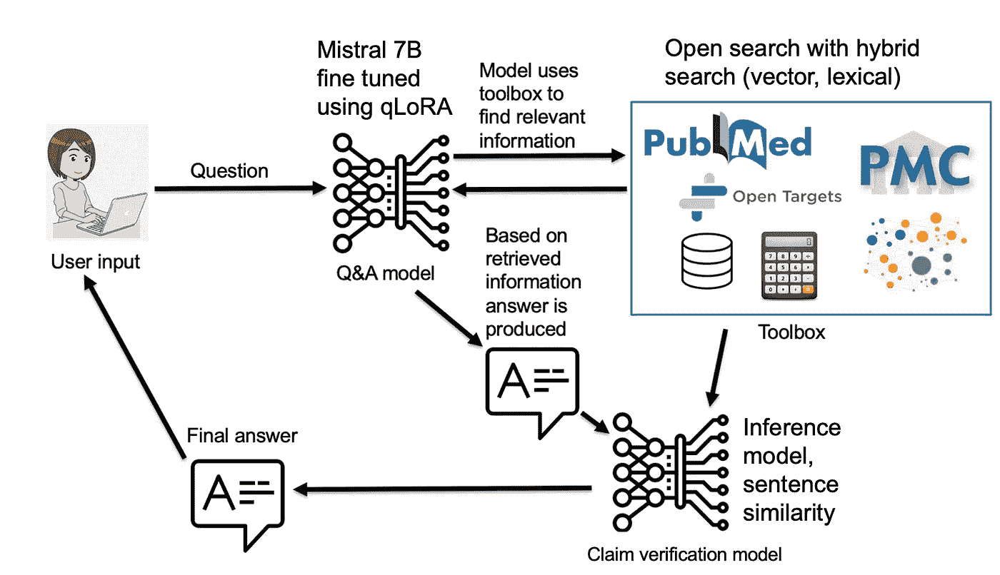

# 事实核查与声明验证

> 原文：[`towardsdatascience.com/fact-checking-vs-claim-verification-why-hallucination-detection-task-is-wrongly-named-8b2cd1ecb89a?source=collection_archive---------5-----------------------#2024-04-03`](https://towardsdatascience.com/fact-checking-vs-claim-verification-why-hallucination-detection-task-is-wrongly-named-8b2cd1ecb89a?source=collection_archive---------5-----------------------#2024-04-03)

## 为什么幻觉检测任务被错误命名

 [Nikola Milosevic (Data Warrior)](https://datawarrior.medium.com/?source=post_page---byline--8b2cd1ecb89a--------------------------------)

·发表于[Towards Data Science](https://towardsdatascience.com/?source=post_page---byline--8b2cd1ecb89a--------------------------------) ·阅读时间：7 分钟·2024 年 4 月 3 日

--

在过去的一年里，我一直在从事两个与大型语言模型的幻觉检测和验证它们产生的声明相关的项目。与任何研究一样，尤其是涉及声明验证的研究，它促使我进行了一些文献回顾，在此过程中，我了解到许多作者将验证某些声明是否基于来自权威来源（例如，之前的科学出版物、百科全书文章等）证据的任务，通常称为事实核查（例如，诸如此类的出版物包括[Google Deep Mind](https://arxiv.org/abs/2403.18802)、[宾夕法尼亚大学、华盛顿大学](https://arxiv.org/pdf/2309.07852.pdf)、[艾伦人工智能研究所](https://arxiv.org/pdf/2004.14974.pdf)、[OpenAI](https://arxiv.org/pdf/2303.08774.pdf)等）。即便是像 SciFact 这样的数据集，也在名称中带有“事实性”。

我认为，将大型语言模型中的某种度量称为事实性（factuality）源于谷歌的[LaMDA](https://arxiv.org/pdf/2201.08239.pdf)论文，这篇论文发布于 2022 年 2 月，据我所知，它是首次在 LLM 中提到这种度量。在此之前，偶尔会找到事实核查的实例，例如在 2020 年的一篇[SciFact](https://arxiv.org/pdf/2004.14974.pdf)论文中，但 LaMDA 是首次与 LLM 相关的提法。在 LaMDA 论文中，这种度量被称为事实基础（factual grounding），比后来的简化版本，如“事实性”（factuality）或“忠实度”（faithfulness）要更好。在本文中，我想讨论为什么这个度量的名称应该是“声明验证”（claim verification），以及为什么我认为像忠实度、事实性和事实核查这样的名称在实际和哲学角度上都是错误的。

机器人检查文本（图像由 ideogram.ai 生成）

让我们来探讨任务的基础是什么。给定一个由大型语言模型生成的声明，我们正在检查它是否基于某个来源的证据。这一来源可以是文献中的一篇文章，但也可以是一些不那么正式的来源，例如百科全书、互联网或任何其他类型的检索信息源。通常，这个任务回溯到自然语言蕴涵或自然语言推理，我们需要判断声明是否可以从证据文本中推导出来。然而，也有其他方法，使用文本相似性或其他大型语言模型与各种提示。这个任务始终是检查生成的声明是否基于我们今天对世界的证据或知识。这个任务可以类比为生成文章或论文的文献综述部分，并验证引用的文章是否支持作者的声明。当然，我们这里讨论的是自动化这个任务。

那么，称这个任务为事实核查或衡量模型的事实性有什么问题呢？

从哲学的角度来看，我们很难知道什么是真正的事实。尽管科学家们都怀着最好的意图，追求真理，但他们在出版物中常常写下的内容可能并非事实，而且这些内容也很容易通过同行评审。我在这里要强调的是，人们在科学出版中尽力做到尽可能事实准确。然而，这往往是失败的。由于各种因素，比如文化偏见、政治议程或缺乏可靠的证据，出版物中可能包含扭曲、夸大或误解的信息。常常，科学只是通过产生新的证据和信息，慢慢而自然地向事实靠近。

历史上发生了许多事件，在这些事件中，某一领域的普遍共识被建立起来，却又被从根基上动摇。例如，哥白尼：在哥白尼之前，大多数人相信地球是宇宙的中心，太阳、月亮和行星都围绕着它旋转。这是地心说模型，它得到了天主教会教义和古希腊哲学家亚里士多德的支持。然而，哥白尼，一位波兰天文学家和数学家，提出了一个激进的替代方案：日心说模型，认为地球和其他行星围绕太阳运转。他基于数学计算和天体运动的观察提出了这一理论。1543 年，他在临终前不久出版了他的著作《天体的运动论》。尽管他的理论遭到了宗教当局和一些同时代人的强烈反对和批评，但它逐渐得到了其他科学家的认可和影响，例如伽利略、开普勒和牛顿。日心说为现代天文学和物理学的发展铺平了道路，并改变了人们对地球在宇宙中位置的认知。

与达尔文类似的事情也发生过。在达尔文之前，大多数人相信所有生物物种是由上帝创造的，并且自诞生以来未曾改变。这是创世论观点，基于圣经中的《创世纪》记载以及英国自然学家约翰·雷的自然神学。然而，达尔文，一位英国自然学家和地质学家，提出了一个激进的替代方案：自然选择进化论，认为生物物种来自共同的祖先，并且由于环境压力和“适者生存”而随时间发生变化。还有一些其他例子，比如爱因斯坦的相对论、引力、坎恩的科学革命理论等，均属于此类。

历史上的这些事件被称为范式转变，在这些事件中，某些领域的基础范式发生了显著的变化。范式转变可能相对少见，然而，我们也有许多常见的信念和神话，很多人深信不疑，例如中国的长城可以从太空看到、拿破仑个子矮小、哥伦布发现了美洲等，这些观点即使在关于相关主题的科学文章或书籍中也能找到，尽管它们并不真实。人们不断引用和参考包含这些信息的著作，它们仍在传播。因此，检查参考文献中的证据是否支持某个主张，并不能完全代表事实的真实性。

提供我们所拥有的证据参考是支持某个主张的最佳方法。检查支持证据通常还需要审查参考文献是否具有信誉、是否经过同行评审、是否发表在权威期刊上、出版年份等。尽管进行了这些检查，信息仍然可能受到范式转变或新产生的假设及其证据的影响，因此可能是不完整和过时的。但这是我们最好的工具，我们应当继续使用它。所提供的示例说明，验证来源并不总是事实核查，而是一种基于当时和地点最佳可得证据与最合理论据来接近和评估主张的方法。然而，验证来源并不意味着所有主张都是同等有效的，也不意味着真理是相对或主观的。验证来源是一种寻求和逼近真理的方式，而非否定或相对化真理。验证来源承认真理是复杂的、多面的和暂时性的，但也承认真理是现实的、有意义的且可以获得的。

因此，与其使用“事实核查”这一术语（它暗示了一个二元且明确的真或假的判断），我们应当使用“主张验证”这一术语，它反映了对支持或不支持、可信或可疑、一致或矛盾的更为细致和暂时的评估。主张验证不是最终的判决，而是一种持续的探索，邀请我们在面对新证据、新来源和新视角时，质疑、挑战和修正我们的信念和假设。

通过使用增强检索生成（RAG）方法生成尽可能少的幻觉回答，这将显著减少幻觉的数量，并通过主张验证模型标记任何剩余的幻觉。该方法已发表在[Košprdić, M., Ljajić, A., Bašaragin, B., Medvecki, D., & Milošević, N. “Verif. ai: Towards an Open-Source Scientific Generative Question-Answering System with Referenced and Verifiable Answers.” The Sixteenth International Conference on Evolving Internet INTERNET 2024 (2024).](https://arxiv.org/pdf/2402.18589.pdf)

在我看来，任务的正确术语是“声明验证”，因为这正是我们所做的，我们在验证某个声明是否基于参考文章、文档或来源的证据。有研究论文已经发布，并命名这一任务为声明验证（[例如，查看这篇论文](https://arxiv.org/abs/2402.18589)）。因此，我希望呼吁从事这一领域的作者避免将他们的度量称为事实性或事实核查，而是称之为可验证性、声明验证等。我可以假设，从营销角度看，事实核查听起来更好，但它是一个不合适的名称，没有给予科学追求事实和真理的适当处理和认可，这一过程要复杂得多。

从实际角度来看，这个名字存在很大的风险。在我们“绝对信任”某个来源是“绝对事实”的情况下，我们失去了进一步批判性审视这一说法的能力。没有人会有勇气或能力这样做。科学和批判性思维的核心在于，我们在追求真理的过程中审视一切。此外，如果当前形式的人工智能只基于现有知识和共识来衡量事实性并检查事实，我们就陷入了停滞不前的风险，特别是对于未来范式转变的排斥。

然而，这个风险不仅存在于科学领域。关于什么是事实以及从整个教育体系中排除批判性思维的相同论点，是威权政权的一个共同特征。如果我们对被呈现为事实的内容缺乏批判性评估，我们可能会成为未来威权主义者的牺牲品，他们会利用这一点，将自己的偏见融入被认为是“事实”的内容中。因此，让我们小心我们所称为事实的东西，因为在大多数情况下，它只是一个声明。一个声明可能根据我们当前对世界和宇宙的理解而真实，也可能不真实。此外，声明是否正确，可能会随着新证据和新信息的发现而改变。我认为，人工智能系统，尤其是知识表示领域的一大挑战将是：如何表示当前我们对宇宙的理解，并使其随着时间的推移保持更新。

除非另有说明，所有图片均为作者提供。
