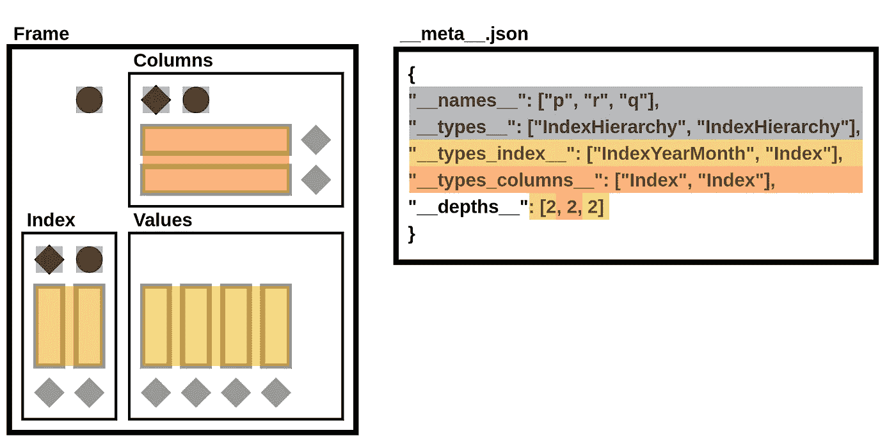

# 更快的 DataFrame 序列化

> 原文：[`towardsdatascience.com/faster-dataframe-serialization-75205b6b7c69?source=collection_archive---------3-----------------------#2024-02-03`](https://towardsdatascience.com/faster-dataframe-serialization-75205b6b7c69?source=collection_archive---------3-----------------------#2024-02-03)

## 使用 StaticFrame NPZ 格式读取和写入 DataFrame，速度比 Parquet 快多达十倍

[](https://medium.com/@flexatone?source=post_page---byline--75205b6b7c69--------------------------------)[](https://towardsdatascience.com/?source=post_page---byline--75205b6b7c69--------------------------------) [Christopher Ariza](https://medium.com/@flexatone?source=post_page---byline--75205b6b7c69--------------------------------)

·发表于[Towards Data Science](https://towardsdatascience.com/?source=post_page---byline--75205b6b7c69--------------------------------) ·9 分钟阅读·2024 年 2 月 3 日

--


作者提供的照片

Apache Parquet 格式提供了一种高效的列式数据表的二进制表示，如在 Apache Hadoop 和 Spark、AWS Athena 和 Glue 以及 Pandas DataFrame 序列化中的广泛使用所见。尽管 Parquet 提供了广泛的互操作性，并且其性能优于文本格式（如 CSV 或 JSON），但它的速度比 NPZ 慢多达十倍，后者是[StaticFrame](https://github.com/static-frame/static-frame)中引入的另一种 DataFrame 序列化格式。

StaticFrame（我参与编写的开源 DataFrame 库）基于 NumPy NPY 和 NPZ 格式对 DataFrame 进行编码。NPY 格式（数组数据的二进制编码）和 NPZ 格式（NPY 文件的压缩包）在 2007 年的[NumPy 增强提案](https://numpy.org/neps/nep-0001-npy-format.html)中有定义。通过扩展 NPZ 格式并使用专门的 JSON 元数据，StaticFrame 提供了一个完整的 DataFrame 序列化格式，支持所有 NumPy 数据类型。

本文扩展了在[PyCon USA 2022](https://youtu.be/HLH5AwF-jx4?si=9NSpPuf-jVoxotzg)首次展示的工作，加入了更多的性能优化和更广泛的基准测试。

# 序列化 DataFrame 的挑战

DataFrame 不仅仅是具有字符串列标签的列式数据集合，如关系型数据库中的数据那样。除了列式数据，DataFrame 还包含带标签的行和列，并且这些行和列标签可以是任何类型（或者具有层次标签时，可以是多种类型）。此外，常常会将元数据与 `name` 属性一起存储，可能存储在 DataFrame 上或轴标签上。

由于 Parquet 最初是为了存储列式数据集而设计的，因此它不能直接支持完整的 DataFrame 特性。Pandas 通过在 Parquet 文件中添加 JSON 元数据提供了这些附加信息。

此外，Parquet 支持的类型选择非常有限；NumPy 数据类型的完整范围并不直接支持。例如，Parquet 原生不支持无符号整数或任何日期类型。

虽然 Python 的 pickle 能够高效地序列化 DataFrame 和 NumPy 数组，但它们仅适用于来自可信来源的短期缓存。尽管 pickle 快速，但由于代码变更，它们可能会失效，而且从不可信来源加载时不安全。

Parquet 的另一个替代品来源于 Arrow 项目，是[Feather](https://arrow.apache.org/docs/python/feather.html)。尽管 Feather 支持所有 Arrow 类型，并且在读取 DataFrame 时比 Parquet 更快，但其速度仍然比 NPZ 慢至少两倍。

Parquet 和 Feather 支持压缩以减小文件大小。Parquet 默认使用“snappy”压缩，而 Feather 默认使用“lz4”。由于 NPZ 格式优先考虑性能，因此尚不支持压缩。如下面所示，NPZ 在性能上显著优于压缩和未压缩的 Parquet 文件。

# DataFrame 序列化性能比较

许多出版物通过仅测试一两个数据集来提供 DataFrame 基准测试。例如，[McKinney 和 Richardson](https://ursalabs.org/blog/2020-feather-v2)（2020）就以 Fannie Mae 贷款表现数据和纽约市黄出租车出行数据为例，概括其性能。这些特有的数据集不足以充分代表性能，因为 DataFrame 的形状和列类型异质性的程度会显著影响性能。

为了避免这种不足，我使用九个合成数据集进行性能比较。这些数据集在两个维度上有所变化：形状（高、方形和宽）和列异质性（列式、混合型和均匀型）。形状变化改变了元素在高（例如：10,000 行和 100 列）、方形（例如：1,000 行和列）和宽（例如：100 行和 10,000 列）几何体之间的分布。列异质性变化改变了列之间类型的多样性，列式（没有相邻列具有相同类型）、混合型（部分相邻列具有相同类型）和均匀型（所有列具有相同类型）。

`[frame-fixtures](https://github.com/static-frame/frame-fixtures)`库定义了一种领域特定语言，用于创建可预测的、随机生成的 DataFrame 以供测试；这九个数据集是通过此工具生成的。

为了展示一些静态框架（StaticFrame）和 Pandas 接口的评估，以下 IPython 会话使用`%time`执行基本性能测试。如下面所示，方形、均匀类型的 DataFrame 可以通过 NPZ 格式读写，速度是未压缩 Parquet 的许多倍。

```py
>>> import numpy as np
>>> import static_frame as sf
>>> import pandas as pd

>>> # an square, uniform float array
>>> array = np.random.random_sample((10_000, 10_000))

>>> # write peformance
>>> f1 = sf.Frame(array)
>>> %time f1.to_npz('/tmp/frame.npz')
CPU times: user 710 ms, sys: 396 ms, total: 1.11 s
Wall time: 1.11 s

>>> df1 = pd.DataFrame(array)
>>> %time df1.to_parquet('/tmp/df.parquet', compression=None)
CPU times: user 6.82 s, sys: 900 ms, total: 7.72 s
Wall time: 7.74 s

>>> # read performance
>>> %time f2 = f1.from_npz('/tmp/frame.npz')
CPU times: user 2.77 ms, sys: 163 ms, total: 166 ms
Wall time: 165 ms

>>> %time df2 = pd.read_parquet('/tmp/df.parquet')
CPU times: user 2.55 s, sys: 1.2 s, total: 3.75 s
Wall time: 866 ms
```

以下提供的性能测试通过使用`frame-fixtures`对形状和类型异质性进行系统性变化，并对十次迭代结果进行平均，从而扩展了这一基本方法。虽然硬件配置会影响性能，但在不同机器和操作系统之间，相对特征保持一致。对于所有接口，使用默认参数，除非需要禁用压缩。用于执行这些测试的代码可在[GitHub](https://github.com/static-frame/static-frame/blob/master/doc/source/articles/serialize.py)上找到。

## 读取性能

由于数据通常被读取的频率高于写入，因此读取性能是优先考虑的。如图所示，对于所有包含百万级（1e+06）元素的九个 DataFrame，NPZ 在每个测试条件下的表现均显著优于 Parquet 和 Feather。NPZ 的读取性能比压缩后的 Parquet 快十倍以上。例如，在 Uniform Tall 测试条件下，压缩 Parquet 的读取时间为 21 毫秒，而 NPZ 为 1.5 毫秒。

下图显示了处理时间，其中较低的柱状图表示较快的性能。


这一令人印象深刻的 NPZ 性能在扩展时依然得以保持。当数据量增加到 1 亿（1e+08）元素时，NPZ 的表现仍然至少是 Parquet 和 Feather 的两倍，无论是否使用压缩。


## 写入性能

在将 DataFrame 写入磁盘时，NPZ 在所有场景下都优于 Parquet（无论是否压缩）。例如，在 Uniform Square 测试条件下，压缩后的 Parquet 写入时间为 200 毫秒，而 NPZ 为 18.3 毫秒。NPZ 的写入性能通常与未压缩的 Feather 相当：在某些场景下 NPZ 更快，而在其他场景下 Feather 更快。


与读取性能相似，NPZ 写入性能在规模扩展时也得以保持。当数据量增加到 1 亿（1e+08）元素时，NPZ 的性能仍然是 Parquet 的至少两倍，无论是否使用压缩。


## 特殊性能

作为额外参考，我们还将基准测试相同的 NYC 黄出租车行程数据（来自 2010 年 1 月），该数据集用于[McKinney 和 Richardson](https://ursalabs.org/blog/2020-feather-v2)（2020）。该数据集包含近 3 亿（3e+08）个元素，存储在一个包含 14,863,778 行和 19 列的高大异质类型 DataFrame 中。

NPZ 读取性能比 Parquet 和 Feather 快约四倍（无论是否压缩）。尽管 NPZ 的写入性能比 Parquet 快，但 Feather 写入在这里是最快的。


## 文件大小

如下所示，对于 100 万（1e+06）元素和 1 亿（1e+08）元素的数据框架，未压缩的 NPZ 文件在磁盘上的大小通常与未压缩的 Feather 文件相等，并且始终小于未压缩的 Parquet 文件（有时也小于压缩的 Parquet 文件）。由于压缩对 Parquet 和 Feather 文件的大小减小效果有限，未压缩 NPZ 在速度上的优势可能会轻易超过其较大文件大小的成本。


# 序列化数据框架

StaticFrame 将数据存储为 1D 和 2D NumPy 数组的集合。数组表示列值，以及可变深度的索引和列标签。除了 NumPy 数组外，还需要关于组件类型（即用于索引和列的 Python 类）以及组件`name`属性的信息，以完整地重建一个`Frame`。完全序列化一个数据框架需要将这些组件写入并从文件中读取。

数据框架（DataFrame）的组件可以通过以下图示表示，该图示隔离了数组、数组类型、组件类型和组件名称。此图示将用于演示 NPZ 如何编码一个数据框架。


该图示的组件映射到 Python 中`Frame`字符串表示的组件。例如，给定一个包含整数和布尔值的`Frame`，且索引和列上都有层次标签（可以通过 StaticFrame 的`WWW`接口从 GitHub 下载），StaticFrame 提供以下字符串表示：

```py
>>> frame = sf.Frame.from_npz(sf.WWW.from_file('https://github.com/static-frame/static-frame/raw/master/doc/source/articles/serialize/frame.npz', encoding=None))
>>> frame
<Frame: p>
<IndexHierarchy: q>       data    data    data    valid  <<U5>
                          A       B       C       *      <<U1>
<IndexHierarchy: r>
2012-03             x     5       4       7       False
2012-03             y     9       1       8       True
2012-04             x     3       6       2       True
<datetime64[M]>     <<U1> <int64> <int64> <int64> <bool>
```

字符串表示的组件可以通过颜色映射到数据框架图示：


## 编码一个 NPY 数组

一个 NPY 文件将 NumPy 数组存储为二进制文件，包含六个组件：（1）一个“魔术”前缀，（2）一个版本号，（3）一个头部长度，（4）头部（头部是 Python 字典的字符串表示），以及（5）填充和（6）原始数组字节数据。以下显示的是存储在名为“__blocks_1__.npy”文件中的三元素二进制数组的这些组件。


给定一个名为“frame.npz”的 NPZ 文件，我们可以通过使用标准库的`ZipFile`从 NPZ 中读取 NPY 文件来提取二进制数据。

```py
>>> from zipfile import ZipFile
>>> with ZipFile('/tmp/frame.npz') as zf: print(zf.open('__blocks_1__.npy').read())
b'\x93NUMPY\x01\x006\x00{"descr":"|b1","fortran_order":True,"shape":(3,)}    \n\x00\x01\x01
```

由于 NPY 在 NumPy 中得到了很好的支持，可以使用`np.load()`函数将此文件转换为 NumPy 数组。这意味着，StaticFrame NPZ 中的底层数组数据可以通过其他读取器轻松提取。

```py
>>> with ZipFile('/tmp/frame.npz') as zf: print(repr(np.load(zf.open('__blocks_1__.npy'))))
array([False,  True,  True])
```

由于 NPY 文件可以编码任何数组，因此可以从连续字节数据中加载大型二维数组，在 StaticFrame 中，当多个连续列由单个数组表示时，提供了卓越的性能。

## 构建 NPZ 文件

StaticFrame NPZ 是一个标准的未压缩 ZIP 文件，其中包含 NPY 文件中的数组数据，以及包含组件类型和名称的 JSON 文件中的元数据。

给定上面`Frame`的 NPZ 文件，我们可以使用`ZipFile`列出其内容。该压缩包包含六个 NPY 文件和一个 JSON 文件。

```py
>>> with ZipFile('/tmp/frame.npz') as zf: print(zf.namelist())
['__values_index_0__.npy', '__values_index_1__.npy', '__values_columns_0__.npy', '__values_columns_1__.npy', '__blocks_0__.npy', '__blocks_1__.npy', '__meta__.json']
```

下图将这些文件映射到 DataFrame 图的组件。


StaticFrame 扩展了 NPZ 格式，包含一个 JSON 文件作为元数据。该文件定义了名称属性、组件类型和深度计数。

```py
>>> with ZipFile('/tmp/frame.npz') as zf: print(zf.open('__meta__.json').read())
b'{"__names__": ["p", "r", "q"], "__types__": ["IndexHierarchy", "IndexHierarchy"], "__types_index__": ["IndexYearMonth", "Index"], "__types_columns__": ["Index", "Index"], "__depths__": [2, 2, 2]}'
```

在下图中，`__meta__.json`文件的组件被映射到 DataFrame 图的组件。



作为一个简单的 ZIP 文件，提取 StaticFrame NPZ 内容的工具非常普遍。另一方面，由于 ZIP 格式的历史和广泛特性，它会带来性能开销。StaticFrame 实现了一个为 NPZ 使用优化的自定义 ZIP 读取器，这有助于 NPZ 的出色读取性能。

# 结论

DataFrame 序列化的性能对许多应用至关重要。虽然 Parquet 得到了广泛支持，但它的通用性牺牲了类型特异性和性能。StaticFrame NPZ 可以比 Parquet 快最多十倍地读取和写入 DataFrame，无论是否压缩，文件大小相似（或仅略大）。虽然 Feather 是一个有吸引力的替代方案，但 NPZ 的读取性能通常是 Feather 的两倍。如果数据 I/O 成为瓶颈（而这通常是），StaticFrame NPZ 提供了解决方案。
