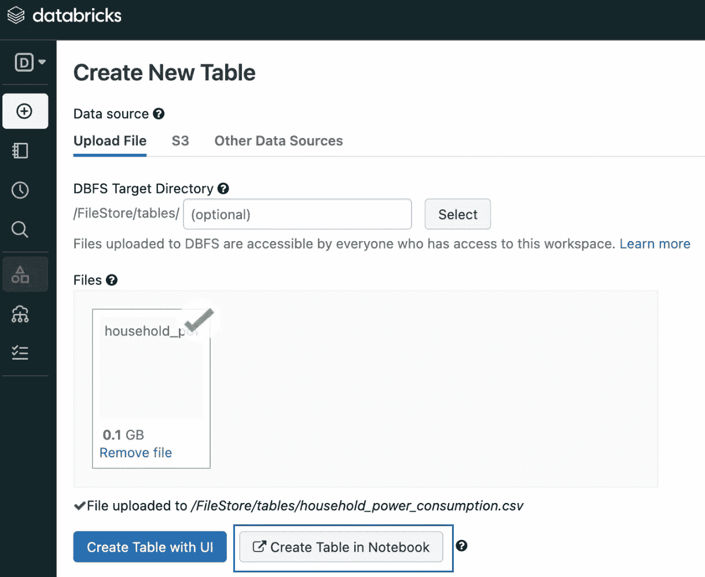
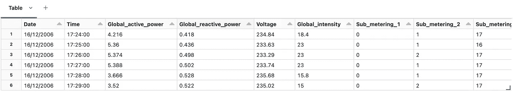
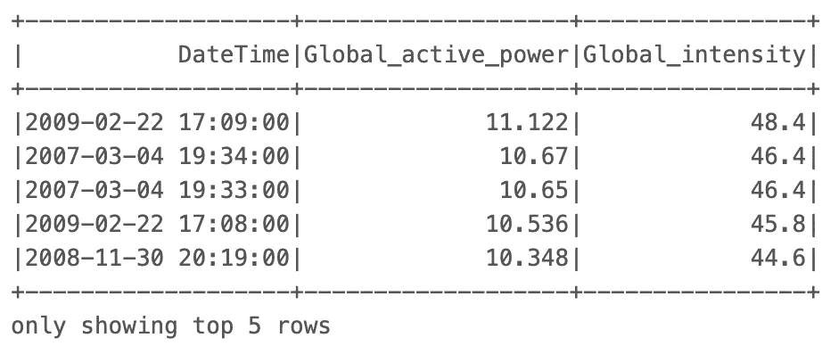
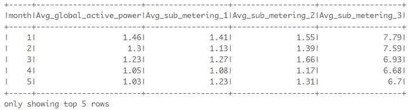
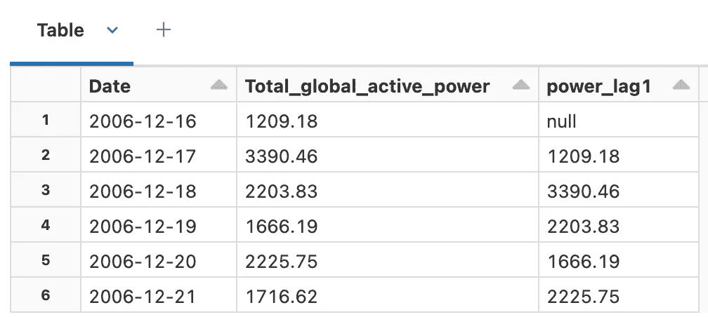
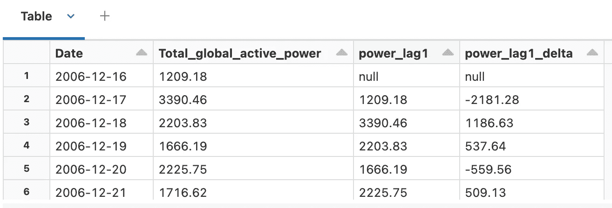
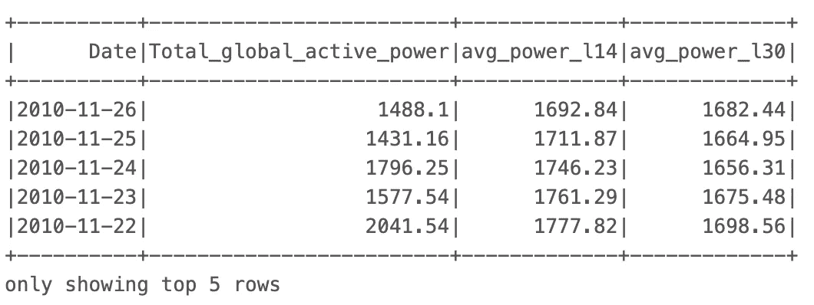
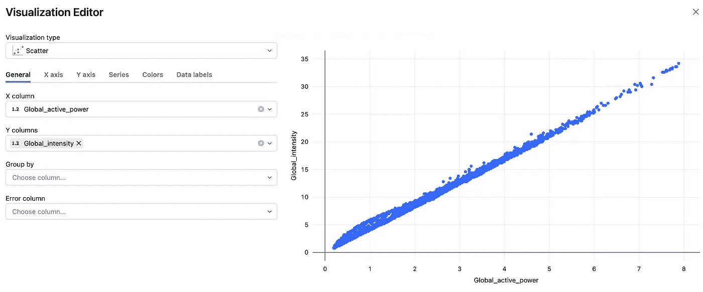
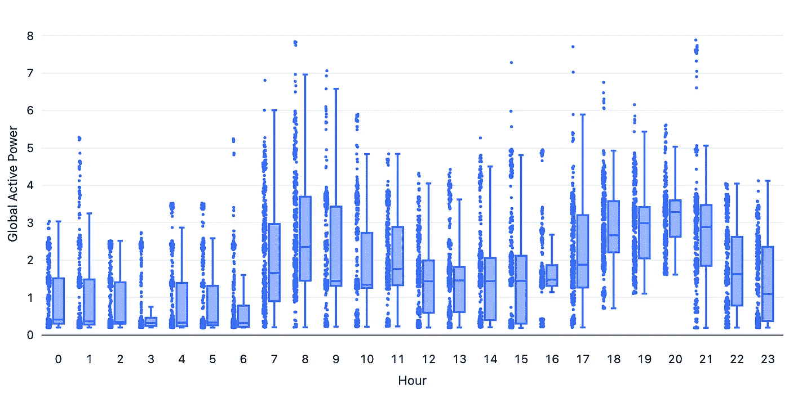
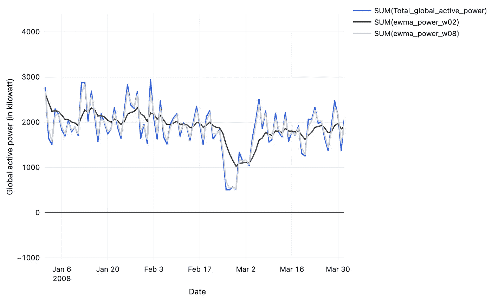

# 使用 PySpark 在 Databricks 上进行时间序列特征工程

> 原文：[`towardsdatascience.com/feature-engineering-for-time-series-using-pyspark-on-databricks-02b97d62a287?source=collection_archive---------3-----------------------#2024-05-15`](https://towardsdatascience.com/feature-engineering-for-time-series-using-pyspark-on-databricks-02b97d62a287?source=collection_archive---------3-----------------------#2024-05-15)

## 探索 PySpark 在时间序列数据中的潜力：获取、提取和可视化数据，并附有实际实施代码

[](https://medium.com/@johnleungTJ?source=post_page---byline--02b97d62a287--------------------------------)[](https://towardsdatascience.com/?source=post_page---byline--02b97d62a287--------------------------------) [John Leung](https://medium.com/@johnleungTJ?source=post_page---byline--02b97d62a287--------------------------------)

·发表于[Towards Data Science](https://towardsdatascience.com/?source=post_page---byline--02b97d62a287--------------------------------) ·阅读时长：9 分钟·2024 年 5 月 15 日

--

随着对大规模数据集进行高速查询和分析需求的增加，[Apache Spark](https://spark.apache.org/)已经成为近年来最流行的分析引擎之一。由于其主-从架构，它在分布式数据处理方面非常强大。这包括一个与集群管理器（主节点）协调的驱动程序，并控制将较小任务分配给工作节点的执行。此外，作为一个内存数据处理引擎，Spark 主要使用 RAM 来存储和处理数据，而不是依赖磁盘存储。这些协同作用加速了整体任务的执行。


照片由[Dawid Zawiła](https://unsplash.com/@davealmine?utm_source=medium&utm_medium=referral)提供，来自[Unsplash](https://unsplash.com/?utm_source=medium&utm_medium=referral)

## Apache Spark：从低级到高级

在低级别上，它的架构基于两个主要抽象：

+   弹性分布式数据集（[RDD](https://spark.apache.org/docs/latest/rdd-programming-guide.html)）— 一种低级数据抽象，其中每个数据集可以被划分为逻辑部分，并在集群工作节点上执行，从而有助于并行编程。

+   有向无环图（[DAG](https://sparkbyexamples.com/spark/what-is-dag-in-spark/)) — 一种有助于优化和调度任务依赖关系及执行顺序的表示方法。

在更高层次上，我们可以使用 Scala、Python 或 R 语言利用丰富的高级工具集。工具示例包括用于 SQL 和 DataFrame 的[Spark SQL](https://spark.apache.org/sql/)、用于 Pandas 工作负载的[Spark 上的 Pandas API](https://spark.apache.org/docs/latest/api/python/user_guide/pandas_on_spark/index.html)，以及用于流处理的[结构化流式处理](https://spark.apache.org/docs/latest/structured-streaming-programming-guide.html)。

然而，在享受这些功能之前，我们可能需要花费大量精力来自行管理一个 Spark 集群，包括基础设施的设置和一堆复杂的工具，这可能会让人头疼。

## PySpark 在 Databricks 上的应用

为了应对这些挑战，[PySpark](https://spark.apache.org/docs/latest/api/python/index.html)在[Databricks](https://docs.databricks.com/en/introduction/index.html)上最近成为了行业中一种高级解决方案。PySpark 是 Spark 的 Python API，而 Databricks 是一个基于 Spark 构建的完整软件平台。它包括笔记本、基础设施编排（自动配置和扩展）、流程编排（作业提交和调度）、托管集群，甚至源代码控制。

在 Databricks 中使用 PySpark API，我们将展示并执行一个时间序列数据的特征工程项目。在这个实践过程中，我们将模拟 Pandas 库在数据处理中的常规行为，同时享受可扩展性和并行处理的额外优势。

*注意：如果你想进一步了解如何在 Azure 中使用 PySpark API 动态编排这个 Databricks 笔记本，你可以点击* [*这里*](https://medium.com/towards-data-science/orchestrating-a-dynamic-time-series-pipeline-with-azure-data-factory-and-databricks-810819608231)*。*


图片由[Alexandru Boicu](https://unsplash.com/@boiq?utm_source=medium&utm_medium=referral)提供，来源于[Unsplash](https://unsplash.com/?utm_source=medium&utm_medium=referral)

假设你手头有一份家庭电力消耗数据，数据是从 2006 年 12 月到 2010 年 11 月按一分钟的频率采样的。我们的目标是处理并操作数据，提取特征，并生成可视化结果。

这个[数据集](https://www.kaggle.com/datasets/uciml/electric-power-consumption-data-set/data) [根据许可证[数据库：开放数据库，内容：数据库内容](https://opendatacommons.org/licenses/dbcl/1-0/)]，来自 Kaggle，包含多个字段，例如日期、时间、全局功率（有功和无功）、电压、全局电流和子计量（1、2 和 3）。我们现在可以开始分析。

## 初始设置

首先，我们需要为[Databricks Community Edition](https://www.databricks.com/product/faq/community-edition)创建一个用户账户，该版本提供了适合我们概念验证目的的 Databricks 环境。之后，我们可以将输入数据文件上传到 FileStore，这是 Databricks 的专用路径。点击“在笔记本中创建表”后，您将获得一个代码模板以启动数据导入。


初始设置 (1/2) — 创建用户账户（图源：作者）



初始设置 (2/2) — 创建新表（图源：作者）

## 创建一个特征工程项目

**#1 导入数据**

+   静态数据

我们使用方法`spark.read()`读取数据源并返回一个数据框，这是一个关系表。它支持多种数据源，如 CSV、JSON、Parquet 等。在此示例中，我们以 CSV 格式读取电力消耗数据，并定义了模式，其中第一行作为表头，分隔符为“;”。

```py
# File location and type
file_location = "/FileStore/tables/household_power_consumption.csv"
file_type = "csv"

# CSV options
schema = "Date STRING, Time STRING, Global_active_power DOUBLE, Global_reactive_power DOUBLE, Voltage DOUBLE, Global_intensity DOUBLE, Sub_metering_1 DOUBLE, Sub_metering_2 DOUBLE, Sub_metering_3 DOUBLE"
first_row_as_header = "true"
delimiter = ";"

# Read CSV files
org_df = spark.read.format(file_type) \
.schema(schema) \
.option("header", first_row_as_header) \
.option("delimiter", delimiter) \
.load(file_location)

display(org_df)
```

数据框输出的前几行：



数据框输出（图源：作者）

+   流数据

在数据持续生成的场景中，我们使用流处理技术来逐步读取数据。为了演示 Spark 的行为，我将原始数据集划分为 10 个子集，并预先存储在路径“/FileStore/tables/stream/”下。然后我们使用另一个方法`spark.readStream()`来处理流数据。

```py
sourceStream=spark.readStream.format("csv") \
.option("header",True) \
.schema(schema) \
.option("mode","dropMalformed") \
.option("maxFilesPerTrigger",1) \
.option("ignoreLeadingWhiteSpace",True) \
.load("dbfs:/FileStore/tables/stream") \
```

值得一提的是，`mode`设置为“dropMalformed”意味着我们会丢弃损坏的记录，无论损坏是由于结构不一致还是其他使其无法使用的因素。此外，我们选择每次触发事件时仅处理一个文件。

通过开始接收数据并每十秒检查一次记录数，我们可以观察到流数据的持续到达。

```py
import time

# Stream the content of the DataFrame
query = sourceStream.writeStream \
.queryName("count") \
.format("memory") \
.outputMode("append") \
.start()

# Display the count of rows
for _ in range(10):
  spark.sql("SELECT COUNT(*) AS no_of_rows FROM count").show()
  time.sleep(10)
```

**#2 操作和探索数据**

+   数据转换

由于缺失值的行数相对较少，我们选择删除这些行。此外，我们提取与时间相关的特征，以便稍后可以在更高维度中观察到潜在的模式。

```py
from pyspark.sql.functions import col, concat_ws, to_date

# Drop rows with missing values
df = org_df.na.drop()

# Convert columns "Date" and "Time" into new column "DateTime"
df = df.withColumn("Date", to_date(col("Date"),"d/M/y"))
df = df.withColumn("Date", df["Date"].cast("date"))
df = df.select(concat_ws(" ", to_date(col("Date"),"d/M/y"), col("Time")).alias("DateTime"), "*")
df = df.withColumn("DateTime", df["DateTime"].cast("timestamp"))

# Add time-related features
df = df.withColumn("year", year("DateTime"))
df = df.withColumn("month", month("DateTime"))
df = df.withColumn("week_num", weekofyear("DateTime"))
df = df.withColumn("hour", hour("DateTime"))
```

+   数据探索

我们可以通过各种基本的[PySpark 方法](https://spark.apache.org/docs/3.1.1/api/python/reference/api/pyspark.sql.DataFrame.html)来探索数据。

(1) 选择

“‘select”方法允许我们按列创建数据框的子集。在这个例子中，我们按全球有功功率的降序选择列。

```py
df.select(“DateTime”, “Global_active_power”, “Global_intensity”).sort(“Global_active_power”, ascending=False).show(5)
```



“select”方法的输出（图源：作者）

(2) 过滤

这根据列值过滤数据点。在这个例子中，我们通过两个列进行过滤：“year”和“Global_intensity”。

```py
df.filter(
    (col("year") == 2009) &
    (col("Global_intensity") > 40)
).count()

# Output: 10
```

(3) groupby

我们还可以执行一些聚合操作。在我们的数据集中，我们计算了不同月份的全球有功功率和子计量的平均值。

```py
df.groupby("month").agg(
     round(mean("Global_active_power"), 2).alias("Avg_global_active_power"),
     round(mean("Sub_metering_1"), 2).alias("Avg_sub_metering_1"),
     round(mean("Sub_metering_2"), 2).alias("Avg_sub_metering_2"),
     round(mean("Sub_metering_3"), 2).alias("Avg_sub_metering_3"),
).sort(["month"]).show(5)
```



“groupby”方法的输出（图像来自作者）

**#3 使用窗口函数提取特征**

除了上述基本的 PySpark 方法和函数外，我们还可以利用 [窗口函数](https://spark.apache.org/docs/latest/api/python/reference/pyspark.sql/api/pyspark.sql.Window.html) 来生成额外的特征，以捕捉时间序列数据中的时间依赖性和关系。假设我们有一个经过转换的数据集（“df2”），该数据集中的全球有功功率按天聚合，来自每分钟的速率样本。让我们探索如何获取这些特征。

(1) 滞后特征

这些表示前几天的度量值，有助于我们的模型从历史数据中学习并识别趋势。

```py
from pyspark.sql.window import Window
from pyspark.sql.functions import lag, round

# Create a Window specification based on the 'Date' column
windowSpec = Window.orderBy("Date")

# Calculate the lagged value of 'Total_global_active_power'
df2 = df2.withColumn("power_lag1", round(lag(col("Total_global_active_power"), 1).over(windowSpec), 2))

display(df2)
```



输出 — 滞后特征（图像来自作者）

(2) Delta 特征

这是通过计算原始数据字段与滞后特征之间的差异，进一步捕捉短期变化或波动。

```py
# Calculate the difference between columns
df2 = df2.withColumn("power_lag1_delta", round(col("power_lag1") - col("Total_global_active_power"), 2))

display(df2)
```



输出 — Delta 特征（图像来自作者）

(3) 窗口平均特征

这些特征计算目标数据字段在滑动窗口中的平均值，使我们能够捕捉平滑的模式和相对长期的趋势。在这里，我选择了窗口大小为 14（2 周）和 30（大约 1 个月）。

```py
# Add window average fields to the DataFrame for the specified window sizes
def add_window_avg_features(df, window_sizes):
    for window_size in window_sizes:
        window_col_name = f"avg_power_l{window_size}"
        windowSpec = Window.orderBy("Date").rowsBetween(-window_size, 0)
        df = df.withColumn(window_col_name, round(avg(col("Total_global_active_power")).over(windowSpec), 2))
    return df

window_sizes = [14, 30]
df2 = add_window_avg_features(df2, window_sizes)

df2.select("Date", "Total_global_active_power", "avg_power_l14", "avg_power_l30").sort("Date", ascending=False).show(5)
```



输出 — 窗口平均特征（图像来自作者）

(4) 指数加权移动平均（EWMA）特征

EWMA 特征是通过赋予最近数据更多权重而修正后的窗口平均特征，过去的数据权重较小。权重（alpha）值越大，EWMA 特征与原始时间序列的匹配度越高。在这里，我选择了两个不同的权重值：0.2 和 0.8。

```py
import pyspark.pandas as ps

#  Add EWMA features to the DataFrame for the specified alpha values
def add_ewma_features(df, alphas):
    for alpha in alphas:
        ewma_col_name = f"ewma_power_w{str(alpha).replace('.', '')}"
        windowSpec = Window.orderBy("Date")
        df[ewma_col_name] = df.Total_global_active_power.ewm(alpha=alpha).mean().round(2)
    return df

alphas = [0.2, 0.8]
# Convert into a pandas-on-Spark DataFrame, to use EWM function
df2_pd = df2.pandas_api()
df2_pd = add_ewma_features(df2_pd, alphas)
# Convert back to a Spark DataFrame
df2 = df2_pd.to_spark()

df2.select("Date", "Total_global_active_power", "ewma_power_w02", "ewma_power_w08").sort("Date", ascending=False).show(5)
```


输出 — EWMA 特征（图像来自作者）

**#4 在 Notebook 中生成可视化**

在使用各种 PySpark 函数和方法提取与时间相关的数据和特征后，我们可以利用 Databricks 提供的内建支持来高效地创建可视化。这是通过拖放数据字段并在可视化编辑器中配置可视化设置来实现的。以下是一些示例。

+   散点图：全球有功功率与全球强度之间的关系

*解释：这两个字段之间有高度的正相关。*



散点图，使用可视化编辑器（图像来自作者）

+   箱形图：全球有功功率在各个小时的分布

*解释：全球有功功率在 7:00 到 21:00 之间有较大的波动。*



箱形图（图像来自作者）

+   折线图：2008 年 1 月到 2008 年 3 月，全球有功功率的变化，EWMA（alpha = 0.2）和 EWMA（alpha = 0.8）

*解释：使用 alpha 为 0.8 的 EWMA 比使用 alpha 为 0.2 的 EWMA 更接近原始时间序列。*



折线图（图片来自作者）

此外，我们可以生成默认数据概况，显示诸如计数、缺失值百分比和数据分布等汇总统计信息。这确保了整个特征工程过程中的数据质量。上述可视化也可以通过 Databricks SQL 查询输出生成。

## 总结

在我们的实践探索中，我们使用 PySpark 进行时间序列数据的特征工程，使用的是 Databricks 平台：

+   通过分别使用` spark.read()`和`spark.readStream()`方法来处理静态和流式数据。

+   通过使用`pyspark.sql.functions`中的一系列基本 PySpark 函数和 DataFrame 方法来操作和探索数据。

+   通过计算数据组之间的关系，使用`pyspark.sql.Window`提取趋势相关特征。

+   可视化，使用 Databricks Notebook 中的内置功能。

在处理大规模数据集时，PySpark 通常比 Pandas 更受青睐，因为它具有可扩展性和性能优势。PySpark 支持懒评估，这意味着只有在必要时才会执行计算，从而减少了开销。然而，有时 Scala 可能是更好的选择，因为 Spark 本身是用 Scala 编写的，因此可以更紧密地跟进最新特性。而且，使用不可变对象的系统更不容易出错。因此，不同的语言或库各有其优势。最终的选择取决于企业的需求、开发者的学习曲线以及与其他系统的集成。

## 在你离开之前

如果你喜欢这篇文章，欢迎关注我的[Medium 页面](https://medium.com/@johnleungTJ)和[LinkedIn 页面](https://www.linkedin.com/in/john-leung-639800115/)。这样，你可以及时了解与数据科学副项目和机器学习运维（MLOps）演示方法相关的精彩内容。

[](/performing-customer-analytics-with-langchain-and-llms-0af4ea38f7b5?source=post_page-----02b97d62a287--------------------------------) ## 使用 LangChain 和 LLMs 进行客户分析

### 探索 LangChain 在客户分析中的潜力与限制，并附有实际实现…

towardsdatascience.com [](/managing-the-technical-debts-of-machine-learning-systems-5b85d420ab9d?source=post_page-----02b97d62a287--------------------------------) ## 管理机器学习系统的技术债务

### 探索通过实施代码可持续减轻快速交付成本的做法

[towardsdatascience.com
