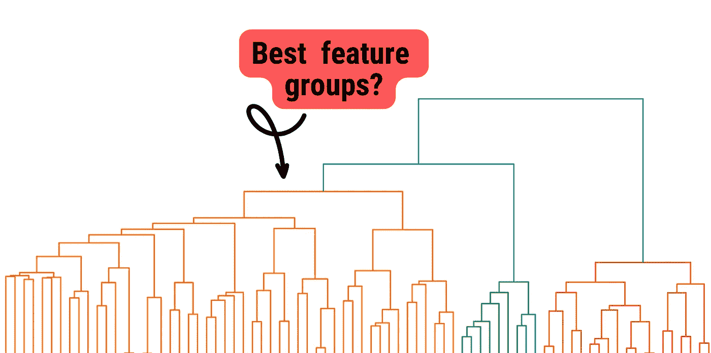

# 使用层次聚类进行可解释模型的特征选择

> 原文：[`towardsdatascience.com/feature-selection-with-hierarchical-clustering-for-interpretable-models-a091802f24e0?source=collection_archive---------0-----------------------#2024-04-01`](https://towardsdatascience.com/feature-selection-with-hierarchical-clustering-for-interpretable-models-a091802f24e0?source=collection_archive---------0-----------------------#2024-04-01)

## 使用这种统计方法创建特征的简短列表（Python 教程）

 [Conor O'Sullivan](https://conorosullyds.medium.com/?source=post_page---byline--a091802f24e0--------------------------------)

·发表于 [Towards Data Science](https://towardsdatascience.com/?source=post_page---byline--a091802f24e0--------------------------------) ·阅读时间：11 分钟·2024 年 4 月 1 日

--

在工业界，你的数据集中可能有成百上千个潜在的模型特征。使用降维方法，如 PCA，可能会留下很难解释的特征。幸运的是，特征聚类可以帮助创建一个特征简短列表，并构建一个可解释的模型。

我们将：

+   使用 Python 应用层次聚类

+   解释该方法背后的理论

+   讨论这种方法在特征选择中相较于其他聚类方法的优势。

我们最后通过使用相关性热图来获得一些关于该方法如何工作的直觉。你也可以在[GitHub](https://github.com/a-data-odyssey/XAI-tutorial)上找到这个项目。

你也可以观看关于这个主题的视频。如果你想了解更多，可以查看我的课程——[使用 Python 的 XAI](https://adataodyssey.com/courses/xai-with-python/)。如果你注册我的[通讯](https://mailchi.mp/aa82a5ce1dc0/signup)，你将获得**免费**访问权限。
