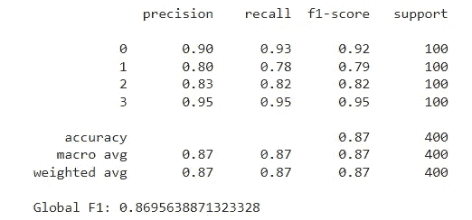
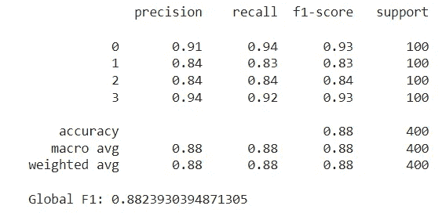
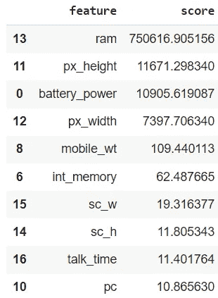
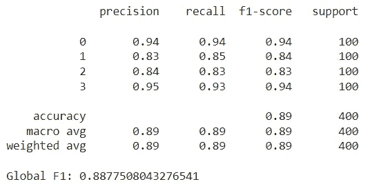
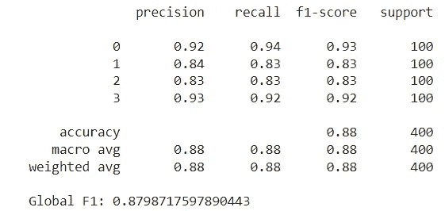
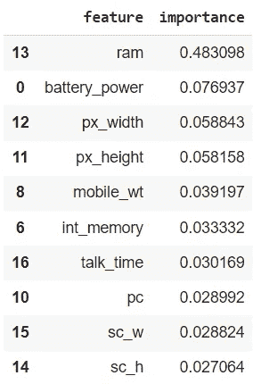
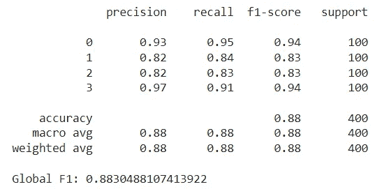

# 使用 Optuna 进行特征选择

> 原文：[`towardsdatascience.com/feature-selection-with-optuna-0ddf3e0f7d8c?source=collection_archive---------3-----------------------#2024-05-09`](https://towardsdatascience.com/feature-selection-with-optuna-0ddf3e0f7d8c?source=collection_archive---------3-----------------------#2024-05-09)

## 一种多功能且有前景的特征选择方法

[](https://medium.com/@nicolupi.2?source=post_page---byline--0ddf3e0f7d8c--------------------------------)[](https://towardsdatascience.com/?source=post_page---byline--0ddf3e0f7d8c--------------------------------) [Nicolas Lupi](https://medium.com/@nicolupi.2?source=post_page---byline--0ddf3e0f7d8c--------------------------------)

·发布于 [Towards Data Science](https://towardsdatascience.com/?source=post_page---byline--0ddf3e0f7d8c--------------------------------) ·阅读时间 13 分钟·2024 年 5 月 9 日

--


图片由 [Edu Grande](https://unsplash.com/@edgr?utm_source=medium&utm_medium=referral) 提供，来自 [Unsplash](https://unsplash.com/?utm_source=medium&utm_medium=referral)

特征选择是许多机器学习流程中的关键步骤。在实际操作中，我们通常会有一系列的变量可以作为模型的预测因子，但其中只有一小部分与我们的目标相关。特征选择的目标是找到这些特征的一个简化集合，主要有以下几种原因：

+   **改进的泛化能力** — 使用较少的特征可以最小化过拟合的风险。

+   **更好的推理能力** — 通过移除冗余的特征（例如，两个高度相关的特征），我们可以保留其中一个特征，并更好地捕捉其影响。

+   **高效的训练** — 特征减少意味着更短的训练时间。

+   **更好的解释性** — 减少特征数量能够产生更简洁的模型，更容易理解。

有许多可用的特征选择技术，每种技术的复杂度不同。在本文中，我想分享一种使用强大开源优化工具 Optuna 以创新方式执行特征选择任务的方法。其主要思想是拥有一个灵活的工具，可以通过高效地测试不同的特征组合（例如，不是逐一尝试它们）来处理各种任务的特征选择。接下来，我们将通过一个动手示例来实现这种方法，并将其与其他常见的特征选择策略进行比较。要实验本文讨论的特征选择技术，您可以按照此[Colab 笔记本](https://colab.research.google.com/drive/193Jwb0xXWh_UkvwIiFgufKEYer-86RNA?usp=sharing)进行操作。

在这个示例中，我们将重点关注基于[Kaggle 的移动价格分类](https://www.kaggle.com/datasets/iabhishekofficial/mobile-price-classification)数据集的分类任务。我们有 20 个特征，包括‘*battery_power*’、‘*clock_speed*’和‘*ram*’，用于预测‘*price_range*’特征，该特征可以属于四个不同的区间：0、1、2 和 3。

我们首先将数据集拆分为训练集和测试集，并在训练集中准备一个 5 折验证集——这将在后续过程中派上用场。

```py
import pandas as pd
from sklearn.model_selection import train_test_split
from sklearn.model_selection import StratifiedKFold

SEED = 32

# Load data
filename = "train.csv" # train.csv from https://www.kaggle.com/datasets/iabhishekofficial/mobile-price-classification

df = pd.read_csv(filename)

# Train - test split
df_train, df_test = train_test_split(df, test_size=0.2, stratify=df.iloc[:,-1], random_state=SEED)
df_train = df_train.reset_index(drop=True)
df_test = df_test.reset_index(drop=True)

# The last column is the target variable
X_train = df_train.iloc[:,0:20]
y_train = df_train.iloc[:,-1]
X_test = df_test.iloc[:,0:20]
y_test = df_test.iloc[:,-1]

# Stratified kfold over the train set for cross validation
skf = StratifiedKFold(n_splits=5, shuffle=True, random_state=SEED)
splits = list(skf.split(X_train, y_train))
```

我们在整个示例中使用的模型是[随机森林分类器](https://scikit-learn.org/stable/modules/generated/sklearn.ensemble.RandomForestClassifier.html)，使用的是 scikit-learn 实现和默认参数。我们首先使用所有特征训练模型以设定基准。我们将衡量的指标是对所有四个价格区间加权的 F1 分数。通过在训练集上拟合模型后，我们在测试集上进行评估，得到大约 0.87 的 F1 分数。

```py
from sklearn.ensemble import RandomForestClassifier
from sklearn.metrics import f1_score, classification_report

model = RandomForestClassifier(random_state=SEED)
model.fit(X_train,y_train)
preds = model.predict(X_test)

print(classification_report(y_test, preds))
print(f"Global F1: {f1_score(y_test, preds, average='weighted')}")
```



图片由作者提供

现在的目标是通过选择一个精简的特征集来改善这些指标。我们将首先概述我们的基于 Optuna 的方法如何工作，然后与其他常见的特征选择策略进行测试和比较。

# Optuna

[Optuna](https://optuna.org/)是一个主要用于超参数调优的优化框架。该框架的一个关键特性是使用贝叶斯优化技术来搜索参数空间。其主要思想是，Optuna 尝试不同的参数组合，并评估每种配置下目标函数的变化。从这些试验中，它构建了一个概率模型，用于估计哪些参数值可能会带来更好的结果。

与网格搜索或随机搜索相比，这种策略效率更高。例如，如果我们有*n*个特征，并尝试每个可能的特征子集，我们将不得不进行 2^*n*次试验。如果有 20 个特征，这将超过一百万次试验。相反，使用 Optuna，我们可以用更少的试验探索搜索空间。

Optuna 提供了多种采样器供选择。对于我们的情况，我们将使用默认的 *TPESampler*，它基于树结构 Parzen 估计器算法（TPE）。这个采样器是最常用的，并且推荐用于搜索分类参数，这正是我们的情况，正如我们下面所看到的那样。根据文档，这个算法“拟合一个高斯混合模型（GMM）*l(x)* 到与最佳目标值关联的参数值集，并将另一个 GMM *g(x)* 拟合到剩余的参数值。它选择最大化 *l(x)/g(x)* 比率的参数值 x。”

如前所述，Optuna 通常用于超参数调优。这通常是通过在相同数据上反复训练模型，使用固定的特征集，并在每次试验中测试由采样器确定的一组新的超参数。最小化给定目标函数的参数集将作为最佳试验返回。

然而，在我们的情况下，我们将使用一个固定的模型和预设的参数，在每个试验中允许 Optuna 选择要尝试的特征。该过程的目的是找到一组最小化损失函数的特征集。在我们的情况下，我们将指导算法最大化 F1 分数（或最小化 F1 的负值）。此外，我们将为每个使用的特征添加一个小的惩罚项，以鼓励使用更小的特征集（如果两个特征集产生相似的结果，我们将更倾向于选择特征较少的那个）。

我们将使用的数据是训练数据集，已经被分成五个折叠。在每个试验中，我们将使用五折中的四折进行训练，剩余的折叠用于验证。然后，我们将平均验证指标，并添加惩罚项来计算试验的损失。

以下是执行特征选择搜索的实现类：

```py
import optuna

class FeatureSelectionOptuna:
    """
    This class implements feature selection using Optuna optimization framework.

    Parameters:

    - model (object): The predictive model to evaluate; this should be any object that implements fit() and predict() methods.
    - loss_fn (function): The loss function to use for evaluating the model performance. This function should take the true labels and the
                          predictions as inputs and return a loss value.
    - features (list of str): A list containing the names of all possible features that can be selected for the model.
    - X (DataFrame): The complete set of feature data (pandas DataFrame) from which subsets will be selected for training the model.
    - y (Series): The target variable associated with the X data (pandas Series).
    - splits (list of tuples): A list of tuples where each tuple contains two elements, the train indices and the validation indices.
    - penalty (float, optional): A factor used to penalize the objective function based on the number of features used.
    """

    def __init__(self,
                 model,
                 loss_fn,
                 features,
                 X,
                 y,
                 splits,
                 penalty=0):

        self.model = model
        self.loss_fn = loss_fn
        self.features = features
        self.X = X
        self.y = y
        self.splits = splits
        self.penalty = penalty

    def __call__(self,
                 trial: optuna.trial.Trial):

        # Select True / False for each feature
        selected_features = [trial.suggest_categorical(name, [True, False]) for name in self.features]

        # List with names of selected features
        selected_feature_names = [name for name, selected in zip(self.features, selected_features) if selected]

        # Optional: adds a penalty for the amount of features used
        n_used = len(selected_feature_names)
        total_penalty = n_used * self.penalty

        loss = 0

        for split in self.splits:
          train_idx = split[0]
          valid_idx = split[1]

          X_train = self.X.iloc[train_idx].copy()
          y_train = self.y.iloc[train_idx].copy()
          X_valid = self.X.iloc[valid_idx].copy()
          y_valid = self.y.iloc[valid_idx].copy()

          X_train_selected = X_train[selected_feature_names].copy()
          X_valid_selected = X_valid[selected_feature_names].copy()

          # Train model, get predictions and accumulate loss
          self.model.fit(X_train_selected, y_train)
          pred = self.model.predict(X_valid_selected)

          loss += self.loss_fn(y_valid, pred)

        # Take the average loss across all splits
        loss /= len(self.splits)

        # Add the penalty to the loss
        loss += total_penalty

        return loss
```

关键部分是我们定义使用哪些特征。我们将每个特征视为一个参数，该参数可以取值为 True 或 False。这些值表示该特征是否应该包含在模型中。我们使用*suggest_categorical*方法，这样 Optuna 就可以为每个特征选择两个可能值中的一个。

现在，我们初始化我们的 Optuna 学习任务，并执行 100 次试验的搜索。注意，我们首先将所有特征用于第一个试验，作为搜索的起点，允许 Optuna 将后续试验与一个完整特征的模型进行比较：

```py
from optuna.samplers import TPESampler

def loss_fn(y_true, y_pred):
  """
  Returns the negative F1 score, to be treated as a loss function.
  """
  res = -f1_score(y_true, y_pred, average='weighted')
  return res

features = list(X_train.columns)

model = RandomForestClassifier(random_state=SEED)

sampler = TPESampler(seed = SEED)
study = optuna.create_study(direction="minimize",sampler=sampler)

# We first try the model using all features
default_features = {ft: True for ft in features}
study.enqueue_trial(default_features)

study.optimize(FeatureSelectionOptuna(
                         model=model,
                         loss_fn=loss_fn,
                         features=features,
                         X=X_train,
                         y=y_train,
                         splits=splits,
                         penalty = 1e-4,
                         ), n_trials=100)
```

完成 100 次试验后，我们从学习任务中提取最佳试验和其中使用的特征。它们如下所示：

[*‘battery_power’, ‘blue’, ‘dual_sim’, ‘fc’, ‘mobile_wt’, ‘px_height’, ‘px_width’, ‘ram’, ‘sc_w’*]

注意，从原始的 20 个特征中，搜索仅保留了其中的 9 个特征，这是一种显著的减少。这些特征产生了大约 -0.9117 的最小验证损失，这意味着它们在所有折叠上的平均 F1 分数大约为 0.9108（在调整了惩罚项之后）。

下一步是使用这些选定的特征在整个训练集上训练模型，并在测试集上进行评估。这样会得到一个大约为 0.882 的 F1 分数：



图片由作者提供

通过选择合适的特征，我们能够将特征集减少一半以上，同时仍然比使用完整特征集时获得更高的 F1 分数。接下来我们将讨论使用 Optuna 进行特征选择的一些优缺点：

**优点**：

+   高效地在特征集之间进行搜索，考虑哪些特征组合最有可能产生良好的结果。

+   适用于多种场景：只要有模型和损失函数，我们就可以将其应用于任何特征选择任务。

+   看得更全面：与逐个评估特征的方法不同，Optuna 会考虑哪些特征相互搭配良好，哪些则不然。

+   在优化过程中动态确定特征的数量。这可以通过惩罚项进行调整。

**缺点**：

+   它不像简单方法那样直观，对于较小和较简单的数据集来说，可能不值得使用。

+   尽管它比其他方法（如穷举搜索）需要的试验次数要少得多，但它通常仍然需要大约 100 到 1000 次试验。根据模型和数据集的不同，这可能是时间消耗大且计算开销高的。

接下来，我们将把我们的方法与其他常见的特征选择策略进行比较。

# 其他方法

## 过滤方法 — 卡方检验

最简单的替代方法之一是使用统计测试分别评估每个特征，并根据其分数保留前* k *个特征。请注意，这种方法不需要任何机器学习模型。例如，对于分类任务，我们可以选择卡方检验，它确定每个特征与目标变量之间是否存在统计学上的显著关联。我们将使用来自 scikit-learn 的[SelectKBest](https://scikit-learn.org/stable/modules/generated/sklearn.feature_selection.SelectKBest.html)类，它将分数函数（卡方检验）应用于每个特征，并返回前* k *个得分最高的变量。与 Optuna 方法不同，特征的数量不是在选择过程中确定的，而是必须事先设定。在这种情况下，我们将其数量设置为十。这些方法属于过滤方法类别。它们通常是最简单且最快的计算方法，因为它们不需要背后有任何模型。

```py
from sklearn.feature_selection import SelectKBest, chi2

skb = SelectKBest(score_func=chi2, k=10)
skb.fit(X_train,y_train)

scores = pd.DataFrame(skb.scores_)
cols = pd.DataFrame(X_train.columns)
featureScores = pd.concat([cols,scores],axis=1)
featureScores.columns = ['feature','score']
featureScores.nlargest(10, 'score')
```



图片由作者提供

在我们的例子中，*ram* 在卡方检验中得分最高，其次是*px_height*和*battery_power*。请注意，这些特征也是我们上面 Optuna 方法所选择的特征，此外还有*px_width*、*mobile_wt*和*sc_w*。然而，也有一些新的特征如*int_memory*和*talk_time*——这些特征在 Optuna 研究中并未被选中。在使用这 10 个特征训练随机森林并在测试集上评估后，我们获得了略高于之前最佳得分的 F1 得分，约为 0.888：



图片来源：作者

**优点**：

+   与模型无关：不需要机器学习模型。

+   实现和运行都既简单又快速。

**缺点**：

+   必须针对每个任务进行调整。例如，一些评分函数仅适用于分类任务，另一些则仅适用于回归任务。

+   贪婪策略：根据使用的替代方法，通常会逐一查看特征，而不考虑哪些已经包含在特征集合中。

+   需要提前设置要选择的特征数量。

## 包装方法 — 前向搜索

包装方法是另一类特征选择策略。这些方法是迭代性的；它们包括用一组特征训练模型、评估其性能，然后决定是否添加或删除特征。我们的 Optuna 策略属于这些方法之一。然而，最常见的例子包括前向选择和后向选择。在前向选择中，我们从没有特征开始，在每一步中，我们贪婪地添加提供最高性能增益的特征，直到满足停止准则（特征数量或性能下降）。相反，后向选择从所有特征开始，并在每一步中迭代地删除最不重要的特征。

接下来，我们尝试使用 scikit-learn 中的[SequentialFeatureSelector](https://scikit-learn.org/stable/modules/generated/sklearn.feature_selection.SequentialFeatureSelector.html)类，执行前向选择，直到找到前 10 个特征。此方法还将利用我们之前执行的 5 折交叉验证，在每一步对验证集的性能进行平均。

```py
from sklearn.feature_selection import SequentialFeatureSelector

model = RandomForestClassifier(random_state=SEED)
sfs = SequentialFeatureSelector(model, n_features_to_select=10, cv=splits)
sfs.fit(X_train, y_train);

selected_features = list(X_train.columns[sfs.get_support()])
print(selected_features)
```

此方法最终选择了以下特征：

[*‘battery_power’, ‘blue’, ‘fc’, ‘mobile_wt’, ‘px_height’, ‘px_width’, ‘ram’, ‘talk_time’, ‘three_g’, ‘touch_screen’*]

再次提到，一些特征与之前的方法相同，另一些则是新的（例如，*three_g* 和 *touch_screen*）。使用这些特征，随机森林在测试集上的 F1 得分较低，略低于 0.88。



图片来源：作者

**优点**：

+   只需几行代码即可轻松实现。

+   它也可以用于确定要使用的特征数量（通过容忍度参数）。

**缺点**：

+   耗时：从零特征开始，每次使用不同的变量训练模型，并保留最佳的特征。接下来的步骤再次尝试所有特征（现在包括之前的特征），并再次选择最佳特征。这个过程会一直重复，直到达到所需的特征数量。

+   贪婪法：一旦一个特征被包含，它就会一直保留。这可能导致次优结果，因为在早期阶段提供最大单独增益的特征，可能在其他特征交互的上下文中并不是最好的选择。

## 特征重要性

最后，我们将探讨另一种简单的特征选择策略，即使用模型学习到的特征重要性（如果有）。某些模型，如随机森林，提供了哪些特征对预测最重要的度量。我们可以利用这些排名来筛选掉那些模型认为重要性最小的特征。在这种情况下，我们在整个训练数据集上训练模型，并保留 10 个最重要的特征：

```py
model = RandomForestClassifier(random_state=SEED)
model.fit(X_train,y_train)

importance = pd.DataFrame({'feature':X_train.columns, 'importance':model.feature_importances_})
importance.nlargest(10, 'importance')
```



图片由作者提供

请注意，*ram*再次被排名为最重要的特征，远远高于第二重要的特征。在使用这 10 个特征进行训练时，我们获得了接近 0.883 的测试 F1 分数，这与我们之前看到的分数相似。同时，注意通过特征重要性选择的特征与通过卡方检验选择的特征相同，尽管它们的排名不同。这种排名差异导致了稍微不同的结果。



图片由作者提供

**优点**：

+   实现简单且快速：只需要对模型进行一次训练，直接使用得出的特征重要性。

+   它可以被改编成递归版本，其中在每一步中，最不重要的特征被移除，然后重新训练模型（见 [递归特征消除](https://scikit-learn.org/stable/modules/generated/sklearn.feature_selection.RFE.html)）。

+   包含在模型中：如果我们使用的模型提供了特征重要性，我们已经有了一个无需额外成本的特征选择方案。

**缺点**：

+   特征重要性可能与我们的最终目标不一致。例如，一个特征单独看可能不重要，但由于与其他特征的交互，它可能变得至关重要。另外，一个重要的特征可能会对整体产生负面影响，影响其他有用预测器的性能。

+   并非所有模型都提供特征重要性估计。

+   需要预先定义选择的特征数量。

# 结束语

总结来说，我们已经看到如何使用一个强大的优化工具 Optuna 来进行特征选择任务。通过高效地探索搜索空间，它能够在相对较少的试验中找到良好的特征子集。不仅如此，它还非常灵活，只要我们定义了模型和损失函数，就可以适应许多不同的场景。

在我们的示例中，我们观察到所有技术都产生了相似的特征集和结果。这主要是因为我们使用的数据集相对简单。在这些情况下，较简单的方法已经能够产生良好的特征选择，因此采用 Optuna 方法并没有太大意义。然而，对于更复杂的数据集，其中包含更多特征并且它们之间存在复杂关系，使用 Optuna 可能是一个不错的选择。因此，总的来说，鉴于其相对简单的实现方式和能够提供良好结果的能力，将 Optuna 用于特征选择是数据科学家工具包中值得加入的一个方法。

感谢阅读！

Colab Notebook: [`colab.research.google.com/drive/193Jwb0xXWh_UkvwIiFgufKEYer-86RNA?usp=sharing`](https://colab.research.google.com/drive/193Jwb0xXWh_UkvwIiFgufKEYer-86RNA?usp=sharing)
