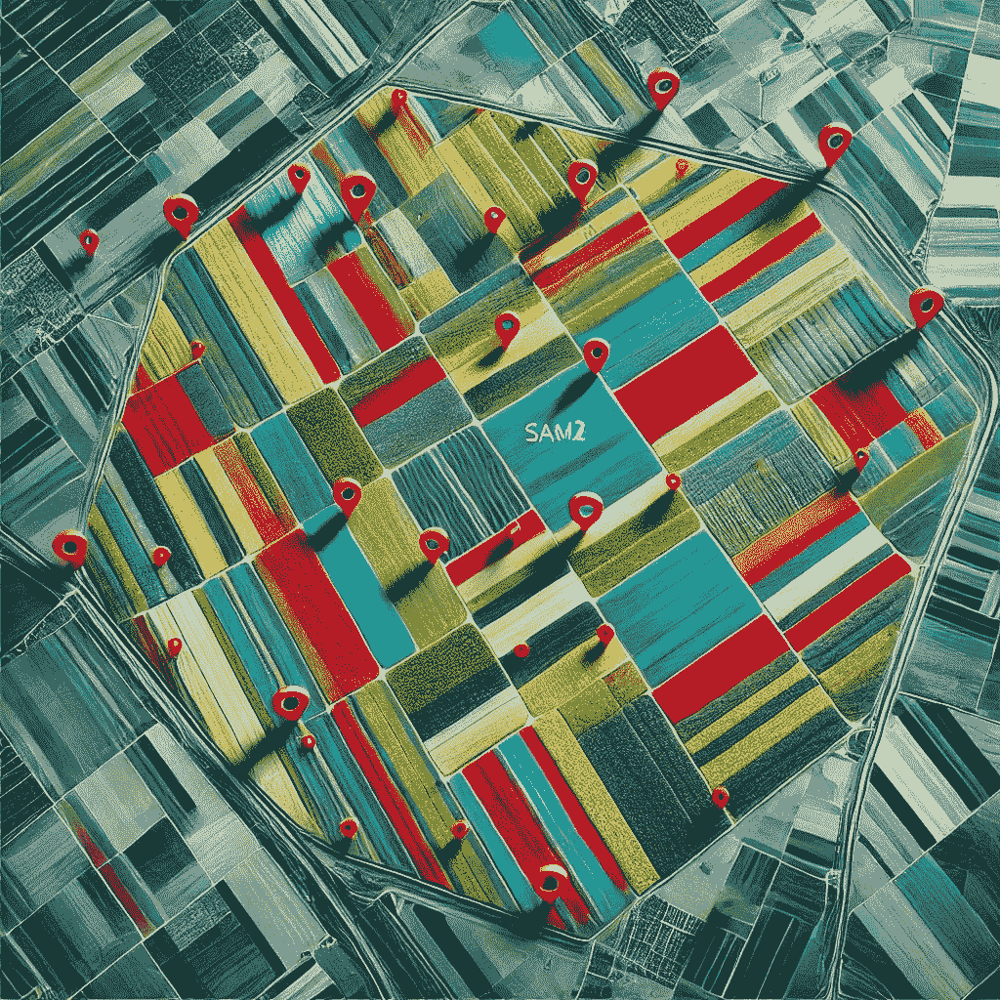

# 使用 SAM2 模型在卫星图像中进行田地边界检测

> 原文：[`towardsdatascience.com/field-boundary-detection-in-satellite-imagery-using-the-sam2-model-b556aa97bf7a?source=collection_archive---------4-----------------------#2024-11-15`](https://towardsdatascience.com/field-boundary-detection-in-satellite-imagery-using-the-sam2-model-b556aa97bf7a?source=collection_archive---------4-----------------------#2024-11-15)

## 使用 Segment Anything 模型版本 2 对卫星图像进行田地边界检测和导出的分步教程

 [Mahyar Aboutalebi, Ph.D. 🎓](https://medium.com/@mahyar.aboutalebi?source=post_page---byline--b556aa97bf7a--------------------------------)

·发表于 [Towards Data Science](https://towardsdatascience.com/?source=post_page---byline--b556aa97bf7a--------------------------------) ·阅读时间 13 分钟 ·2024 年 11 月 15 日

--

# 目录

1.  **🌟 介绍**

1.  **🏷️ Segment Anything 模型**

1.  🚀 **设置 Google Colab**

1.  🛰️ **加载清晰的 Sentinel-2 图像**

1.  🌍 **在 Sentinel-2 图像上应用 SAM2**

1.  **📄 结论**

1.  **📚 参考文献**

## **🌟 介绍**

手动绘制田地边界是最耗时的任务之一，其准确性取决于执行该任务的人的表现。然而，精确的边界检测在许多领域中都有应用。例如，假设你想训练一个机器学习算法来分析卫星图像中的植被指数与农场作物产量之间的关系。你需要的第一个输入是农场的形状文件，通常需要手动绘制。绘制一个形状文件可能只需要几分钟，但如果你需要为 1,000 个农场绘制边界怎么办？这时候，过程就变得非常耗时……
