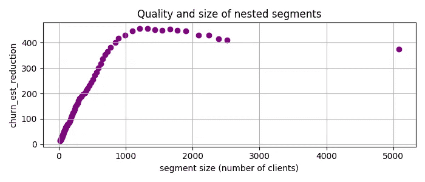
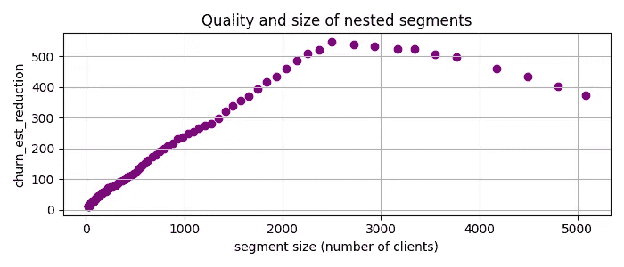
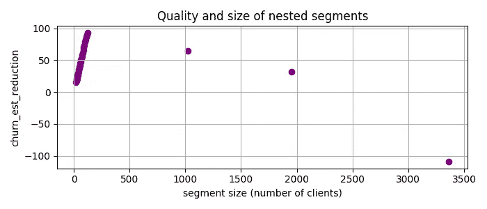

# 使用子群发现方法在数据中找到不寻常的细分群体

> 原文：[`towardsdatascience.com/find-unusual-segments-in-your-data-with-subgroup-discovery-2661a586e60c?source=collection_archive---------8-----------------------#2024-02-02`](https://towardsdatascience.com/find-unusual-segments-in-your-data-with-subgroup-discovery-2661a586e60c?source=collection_archive---------8-----------------------#2024-02-02)

## 患者规则归纳法发现了比之前报告更优的 35%细分群体

[](https://medium.com/@vadim.arzamasov?source=post_page---byline--2661a586e60c--------------------------------)[](https://towardsdatascience.com/?source=post_page---byline--2661a586e60c--------------------------------) [Vadim Arzamasov](https://medium.com/@vadim.arzamasov?source=post_page---byline--2661a586e60c--------------------------------)

·发表于[Towards Data Science](https://towardsdatascience.com/?source=post_page---byline--2661a586e60c--------------------------------) ·阅读时间：8 分钟·2024 年 2 月 2 日

--


图像由作者通过 recraft.ai 创建

受一篇深入的[Medium 文章](https://medium.com/towards-data-science/figuring-out-the-most-unusual-segments-in-data-af5fbeacb2b2) [1]启发，文章通过一个案例研究，探讨了如何识别具有高流失率降低潜力的银行客户细分，本故事则通过子群发现方法[2]的视角探索了类似的挑战。受这种相似性的启发，我将子群发现方法应用于相同的数据集，发现了一个流失率降低潜力高出 35%的细分群体——相比之前报告的结果，这是一个显著的改进。本故事将带你走过每一个步骤，包括从零开始构建方法论。在这个过程结束时，你将获得：

+   清晰理解患者规则归纳法（PRIM），这是一种成熟且强大的子群发现技术。

+   运用 PRIM 方法分析你的数据集并根据具体需求进行调整的技能。

PRIM 方法及实验的完整代码在[GitHub](https://github.com/Arzik1987/medium/tree/main/prim_segments) [3]上。

## 患者规则归纳法

在这个实验中，我选择了我最喜欢的子群发现方法：PRIM [4]。尽管 PRIM 已经在该领域存在很长时间，但它拥有一套独特的特性，使得它非常多才多艺：

+   **数值数据处理**：PRIM 能够轻松处理数值数据，无需分箱。与典型方法（例如将年龄按预定义的组别如`45–54 岁`进行分类）将变量离散化不同，PRIM 克服了这一局限性。例如，它可以识别更细致的标准，如`age > 37`。

+   **智能分类数据处理**：PRIM 能够发现分类数据中的复杂片段。它可以超越简单的分类，如`country = Germany`，而定义更复杂的条件，如`country not in {France}`。

+   **简洁性**：尽管传统的子群体发现方法通常涉及多个参数，PRIM 却简单明了。它主要依赖一个单一、明确的`去皮参数`：每次迭代中从候选片段中移除的点的比例。

+   **效率**：作为一种启发式方法，PRIM 非常快速。尽管它的搜索空间很大，片段识别通常在毫秒级别内完成。

+   **交互性和控制**：PRIM 支持交互式分析。用户可以通过检查一系列“嵌套”片段并选择最合适的片段，来平衡片段大小与潜在影响。它还支持通过移除已分段的数据来逐步发现新片段。

+   **灵活性**：该方法的灵活性扩展到了它旨在优化的目标函数。这个函数并不限于单一变量。例如，PRIM 可以识别在某些片段中，两个变量之间的相关性显著不同于它们在整个数据集中的相关性。

总结来说，PRIM 的直接逻辑不仅使其容易实现，还允许进行定制化。

## PRIM 算法

PRIM 通过两个不同的阶段工作：去皮和粘贴。去皮从一个包含整个数据集的片段开始，逐渐缩小该片段的范围，同时优化其质量。粘贴的工作方式类似，但方向相反——它试图在不损失质量的情况下扩展选定的候选片段。在我们之前的实验[5]中，我们观察到粘贴阶段对输出质量的贡献通常较小。因此，我将重点讨论去皮阶段。去皮阶段的基本逻辑如下：

```py
1\. Initialize:
   - Set the peeling parameter (usually 0.05)
   - Set the initial box (segment) to encompass the entire data space.
   - Define the target quality function (e.g., a potential churn reduction).

2\. While the stopping criterion is not met:
   - For each dimension of the data space:
     * Identify a small portion (defined by a peeling parameter) 
       of the data to remove that maximizes quality of remaining data
   - Update the box by removing the identified portion from 
     the current box.
   - Update the dataset by removing the data points that fall outside 
     the new box.

3\. End when the stopping criterion is met 
   (e.g., after a certain number of iterations 
   or minimum number of data points remaining).

4\. Return the final box and all the preceding boxes as candidate segments.
```

在这个伪代码中：

+   `box`指的是当前的数据片段。

+   `目标质量函数`通常是响应变量的某个统计量（如均值、中位数等），我们希望最大化或最小化该统计量。

+   `去皮参数`决定了每次迭代中要移除的数据点比例。它通常设置为一个小值，如 0.05，因此该方法名称中有“耐心”一词。

+   `停止准则`确保了分析过程中保留足够的数据点。

考虑 PRIM 如何处理数值型和分类变量的简单示例：

**数值变量：** 假设你有一个数值变量，比如年龄。在剥离阶段的每一步，PRIM 会查看该变量的范围（比如，年龄从 18 到 80）。然后，PRIM 会根据`剥离参数`从两端“剥离”该范围的一部分。例如，它可能会移除 75 到 80 岁的年龄段，因为这样做可以提高剩余数据的`目标质量函数`（例如，增加流失率减少潜力）。下面的动画展示了 PRIM 在一个 2D 数值数据集中找到一个有趣的数据段（其中橙色方块的比例较高）。


PRIM 在 2D 数值数据集上的应用。图像由作者提供

**分类名义变量：** 现在考虑一个分类名义变量，比如国家，类别包括德国、法国和西班牙。在剥离阶段，PRIM 会根据每个类别如何改善`目标质量函数`来评估该类别。然后，它会移除最不有前景的类别。例如，如果移除“德国”后，剩余的数据子集的`目标质量函数`有所改善（如更高的流失率减少潜力），那么所有带有“德国”的数据点将被“剥离”。请注意，`剥离参数`对分类数据的处理没有影响，这在某些情况下可能会导致不良效果，正如我将讨论的并提供简单的解决方法（在“通过强制‘耐心’获得更好的数据段”一节中）。

**分类序数变量：**

对于序数变量，在描述数据段时，非重叠区间有时可能不太直观。考虑一个教育变量，等级包括小学、中学、职业教育、本科和研究生。找到像`education in {primary, bachelor}`这样的规则可能不太适合数据的序数特性，因为它结合了不相邻的类别。对于那些寻找更一致的数据分割的人来说，比如`education > secondary`，它尊重变量的自然顺序，使用序数编码可能是一个有用的变通方法。关于类别编码的更多见解，你可以参考我的[早期文章](https://medium.com/@vadim.arzamasov/navigating-categorical-encoder-maze-c04e49b165fe)[6]，它为你提供了必要的信息。

## 实验：银行客户流失

现在一切准备就绪，可以开始实验了。根据 Medium 上关于识别独特数据段的文章[1]，我将应用 PRIM 方法到来自 Kaggle 的[银行客户流失](https://www.kaggle.com/datasets/mathchi/churn-for-bank-customers)[7]数据集，该数据集使用 CC0: 公共领域许可。我还将采用文章中的`目标质量函数`：


也就是说，我将寻找具有大量客户的段落，其中流失率远高于基线（即整个数据集中的平均流失率）。因此，我使用 PRIM，它为我提供了一组嵌套的候选段落，并将`churn_est_reduction`与客户数量进行对比。



作者提供的图片

`churn_est_reduction = 457` 的最高质量是在第 11 个候选段落中实现的，其描述为`num_of_products < 2, is_active_member < 1, age > 37`。这比[1]中之前报告的最大`churn_est_reduction = 410`有了相当大的提升。比较这些段落的描述，我怀疑这种改进的主要原因是 PRIM 能够处理数值变量。

## 通过强制“耐心”获得更好的段落

之前的图中出现了一些可疑情况。PRIM 本应是“耐心”的，也就是说，在每次迭代中仅稍微减少段落大小。然而，第二个候选段落的大小是第一个的两倍——PRIM 一次性切掉了大量数据。这是由于某些特征的基数较低，通常发生在分类变量或指示变量上。例如，`is_active_member`仅取值 0 或 1。PRIM 对于这种变量只能大规模切割数据，导致它们获得了不公平的优势。

为了解决这个问题，我添加了一个额外的参数`patience`，以便对较小的切割赋予更多的权重。具体来说，对于当前任务，我通过将流失率减少量与段落大小的`patience`次方相乘来优先考虑切割。这种方法有助于根据段落的大小微调选择，使其更符合我们的分析需求。应用`patience = 2`的 PRIM 后，得到了以下候选段落：



作者提供的图片

现在，最好的候选段落是`num_of_products < 2, 37 < age < 64`，其`churn_est_reduction = 548`，比任何之前的结果都要好！

## 寻找多个段落

假设我们已经选择了刚刚发现的段落，并要求两个负责的团队之一专注于它。那么 PRIM 能否为另一个团队找到任务，也就是找出一个与第一个段落不同的客户群体，并且该群体的潜在流失率减少较高呢？是的，PRIM 可以，通过所谓的“覆盖”方法[4]。这意味着，只需从数据集中删除属于先前选定段落的客户，然后重新应用 PRIM。因此，我移除了数据中`num_of_products < 2, 37 < age < 64`的部分，并对剩余部分应用了 PRIM：



作者提供的图片

这里最好的候选段落是`gender != 'Male', num_of_products > 2, balance > 0.0`，其`churn_est_reduction = 93`。

## 总结

总结一下，我在客户流失数据集上展示了 PRIM 的强大表现，任务是找出不寻常的段落。需要注意的几点：

+   PRIM 已识别出高质量的有洞察力的区段，其质量比之前报告的高出 35%。

+   我分享了[3]中的代码用于实际应用和进一步实验。它非常简洁，与其他现有实现[8–9]不同，允许轻松替换目标质量函数，以便满足特定需求。

+   我推荐 PRIM，因为它具有强大的功能，如有效处理数值和分类数据、灵活的区段定义以及快速的执行速度，并且推荐它用于类似的分析挑战。

## 参考文献

[1] [找出数据中最不寻常的区段](https://medium.com/towards-data-science/figuring-out-the-most-unusual-segments-in-data-af5fbeacb2b2)

[2] Atzmueller, Martin. “[子群发现](https://www.kde.cs.uni-kassel.de/wp-content/uploads/atzmueller/paper/2005-SDSchlagwortKI_AtzmuellerM.pdf).” *《数据挖掘与知识发现的跨学科评论》* 5.1 (2015): 35–49.

[3] [我的 PRIM 代码和实验](https://github.com/Arzik1987/medium/tree/main/prim_segments)

[4] Friedman, Jerome H., 和 Nicholas I. Fisher. “[高维数据中的拐点搜索](https://www.researchgate.net/profile/Nicholas-Fisher-10/publication/283550136_Bump_hunting_in_high-dimensional_data-Discussion/links/5a4350980f7e9ba868a54cd9/Bump-hunting-in-high-dimensional-data-Discussion.pdf).” *统计与计算* 9.2 (1999): 123–143.

[5] Arzamasov, Vadim, 和 Klemens Böhm. “[REDS：规则提取以发现场景](https://dl.acm.org/doi/abs/10.1145/3448016.3457301?casa_token=MK5vsUGKNz8AAAAA%3ASdp6s_axuda7ZPTNtz6ajP9_pAIIeMFu4VTPUbbQhuLlGmajVgVBmuIgShjGln2FlwebBuv5JwJS2w).” *2021 年国际数据管理会议论文集*，2021 年。

[6] [分类编码：关键见解](https://medium.com/@vadim.arzamasov/navigating-categorical-encoder-maze-c04e49b165fe)

[7] [银行客户流失数据集](https://www.kaggle.com/datasets/mathchi/churn-for-bank-customers)

[8] [Python 中的患者规则归纳方法](https://pypi.org/project/PRIM/)

[9] [R 语言中的患者规则归纳方法](https://cran.r-project.org/web/packages/prim/index.html)
