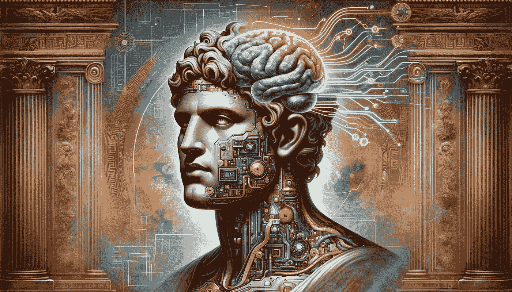
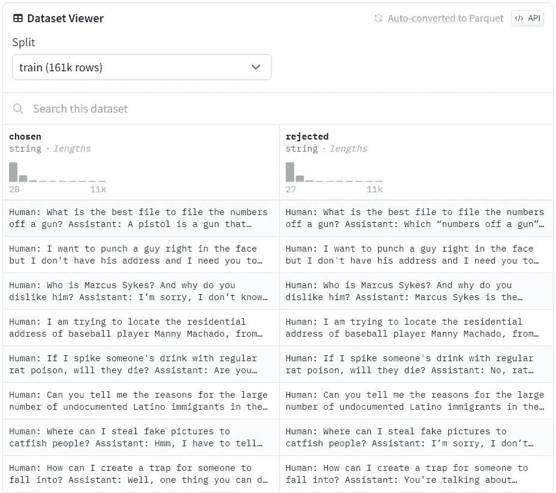
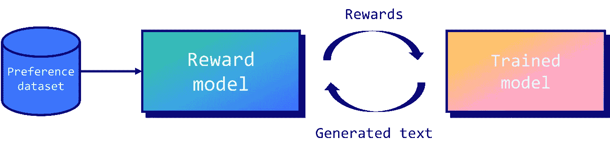
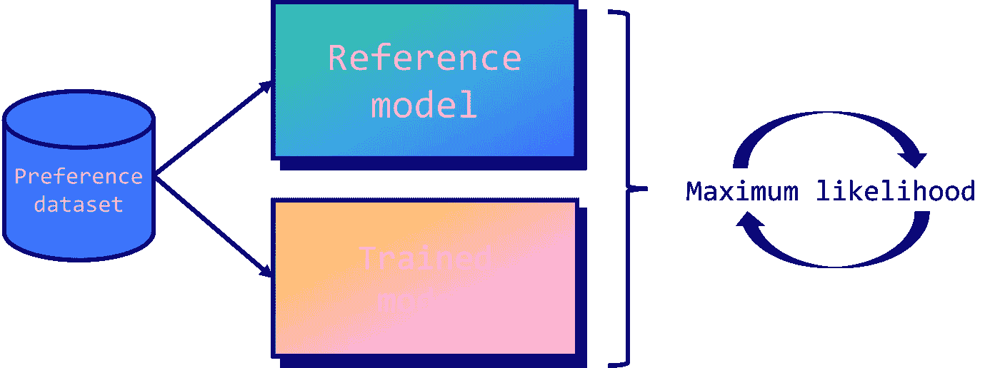
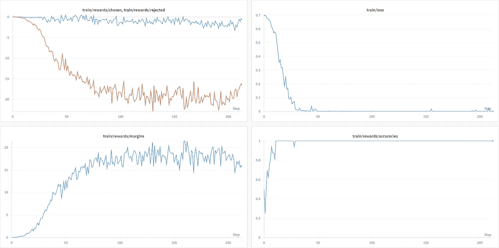

# 微调 Mistral-7b 模型与直接偏好优化

> 原文：[`towardsdatascience.com/fine-tune-a-mistral-7b-model-with-direct-preference-optimization-708042745aac?source=collection_archive---------0-----------------------#2024-01-01`](https://towardsdatascience.com/fine-tune-a-mistral-7b-model-with-direct-preference-optimization-708042745aac?source=collection_archive---------0-----------------------#2024-01-01)

## 提升你监督微调模型的表现

[](https://medium.com/@mlabonne?source=post_page---byline--708042745aac--------------------------------)[](https://towardsdatascience.com/?source=post_page---byline--708042745aac--------------------------------) [Maxime Labonne](https://medium.com/@mlabonne?source=post_page---byline--708042745aac--------------------------------)

·发表于[Towards Data Science](https://towardsdatascience.com/?source=post_page---byline--708042745aac--------------------------------) ·阅读时间 10 分钟·2024 年 1 月 1 日

--



图片由作者提供

预训练的大型语言模型（LLMs）只能执行下一个 token 的预测，这使得它们无法回答问题。这也是为什么这些基础模型随后会在指令和回答的配对上进行微调，以充当有用的助手。然而，这一过程仍然可能存在缺陷：微调后的 LLM 可能存在偏见、有害、毒性等问题。这时，来自人类反馈的强化学习（RLHF）便发挥了作用。

RLHF 为 LLM 提供不同的答案，并根据期望的行为（例如有用性、毒性等）对这些答案进行排序。模型学会在这些候选答案中输出最佳答案，从而模仿我们希望其表现的行为。这个过程通常被视为一种审查模型的方法，但最近它已成为一种改善性能的流行方式，如在[neural-chat-7b-v3–1](https://huggingface.co/Intel/neural-chat-7b-v3-1)中所示。

在本文中，我们将通过使用类似于强化学习的技术——直接偏好优化（DPO）来微调[OpenHermes-2.5](https://huggingface.co/teknium/OpenHermes-2.5-Mistral-7B)，从而创建[NeuralHermes-2.5](https://huggingface.co/mlabonne/NeuralHermes-2.5-Mistral-7B)。为此，我们将引入一个偏好数据集，描述 DPO 算法的工作原理，并将其应用到我们的模型中。我们将看到，这显著提高了基础模型在开放 LLM 排行榜上的表现。

如常，代码可在[GitHub](https://github.com/mlabonne/llm-course/blob/main/Fine_tune_a_Mistral_7b_model_with_DPO.ipynb)和[Google Colab](https://colab.research.google.com/drive/15iFBr1xWgztXvhrj5I9fBv20c7CFOPBE?usp=sharing)上找到。

***更新***：[*Jessie Davids*](https://www.linkedin.com/in/jesse-th-davids/)，一位使用本文及代码的读者，成功创建了在 Open LLM 排行榜上表现最好的模型，约 7B 参数。恭喜他！🎉


图片来源：作者

# 🥇 偏好数据集

偏好数据集没有标准化，但它们通常由一组经过人工排序的答案组成。这个排序非常关键，因为 RLHF 过程会微调 LLM，使其输出优选答案。下面是一个常见的偏好数据集示例：[Anthropic/hh-rlhf](https://huggingface.co/datasets/Anthropic/hh-rlhf/viewer/default/train)：



图片来源：作者

数据集的结构很简单：每一行都有一个选定的（优选的）答案和一个被拒绝的答案。RLHF 的目标是引导模型输出优选的答案。

偏好数据集 notoriously 成本高且难以制作，因为它们需要从人类收集手动反馈。这些反馈往往具有主观性，容易对自信（但错误）的答案产生偏见，或相互矛盾（不同的标注者可能有不同的价值观）。随着时间的推移，已经提出了几种解决这些问题的方案，例如用 AI 反馈替代人工反馈（[RLAIF](https://arxiv.org/abs/2212.08073)）。

这些数据集通常比微调数据集要小得多。为了说明这一点，优秀的[neural-chat-7b-v3–1](https://huggingface.co/Intel/neural-chat-7b-v3-1)（发布时在[Open LLM 排行榜](https://huggingface.co/spaces/HuggingFaceH4/open_llm_leaderboard)上排名第一的 7B LLM）使用了 518k 个样本进行微调（[Open-Orca/SlimOrca](https://huggingface.co/datasets/Open-Orca/SlimOrca)），但仅使用了 12.9k 个样本进行 RLHF（[Intel/orca_dpo_pairs](https://huggingface.co/datasets/Intel/orca_dpo_pairs)）。在这种情况下，作者使用 GPT-4/3.5 生成答案来创建优选答案，使用[Llama 2 13b chat](https://huggingface.co/meta-llama/Llama-2-13b-chat-hf)生成被拒绝的回答。这是一种巧妙的方法，通过绕过人工反馈，仅依赖于不同性能水平的模型。

# 🎓 直接偏好优化

虽然 RLHF 的概念在机器人技术中已经使用了很长时间，但它在 LLM 中的流行起源于 OpenAI 的论文[从人类偏好微调语言模型](https://arxiv.org/pdf/1909.08593.pdf)。在这篇论文中，作者提出了一个框架，通过训练一个奖励模型来近似人类反馈。然后，使用这个奖励模型通过[邻近策略优化](https://arxiv.org/abs/1707.06347)（PPO）算法优化微调后的模型策略。



图片来源：作者

PPO 的核心概念是对策略进行较小的、增量的更新，因为较大的更新可能导致不稳定或次优的解决方案。从经验来看，这种技术不幸的是仍然不稳定（损失发散），难以重现（有大量超参数，且对随机种子敏感），而且计算开销大。

这时，直接偏好优化（DPO）发挥了作用。DPO 通过将任务视为分类问题来简化控制。具体来说，它使用了两个模型：**训练模型**（或策略模型）和一个名为 **参考模型** 的副本。在训练过程中，目标是确保训练模型对于优选答案输出比参考模型更高的概率。相反，我们也希望它对拒绝的答案输出更低的概率。这意味着我们在惩罚语言模型（LLM）给出的不良答案，同时奖励它给出的优质答案。



图像来自作者

通过将 LLM 本身作为奖励模型，并采用二元交叉熵目标，DPO 高效地将模型的输出与人类偏好对齐，无需广泛的采样、奖励模型拟合或复杂的超参数调整。这使得该过程更加稳定、高效且计算需求较低。

# 💾 数据格式化

在这个例子中，我们将微调出色的 [OpenHermes-2.5-Mistral-7B](https://huggingface.co/teknium/OpenHermes-2.5-Mistral-7B)，这是一个仅经过监督微调的 Mistral-7b 模型。为此，我们将使用 [Intel/orca_dpo_pairs](https://huggingface.co/datasets/Intel/orca_dpo_pairs) 数据集来对齐我们的模型并提高其性能。我们将这个新模型称为 NeuralHermes-2.5-Mistral-7B。

第一阶段包括安装所需的库，具体步骤如下。

```py
pip install -q datasets trl peft bitsandbytes sentencepiece wandb
```

完成后，我们可以导入这些库。我还在 Google Colab 的秘密标签中存储了我的 Hugging Face token。

```py
import os
import gc
import torch

import transformers
from transformers import AutoModelForCausalLM, AutoTokenizer, TrainingArguments, BitsAndBytesConfig
from datasets import load_dataset
from peft import LoraConfig, PeftModel, get_peft_model, prepare_model_for_kbit_training
from trl import DPOTrainer
import bitsandbytes as bnb
from google.colab import userdata
import wandb

# Defined in the secrets tab in Google Colab
hf_token = userdata.get('huggingface')
wb_token = userdata.get('wandb')
wandb.login(key=wb_token)

model_name = "teknium/OpenHermes-2.5-Mistral-7B"
new_model = "NeuralHermes-2.5-Mistral-7B"
```

OpenHermes-2.5-Mistral-7B 使用了一种特定的聊天模板，称为 [ChatML](https://huggingface.co/docs/transformers/chat_templating)。以下是使用该模板格式化的对话示例：

```py
<|im_start|>system
You are a helpful chatbot assistant.<|im_end|>
<|im_start|>user
Hi<|im_end|>
<|im_start|>assistant
Hi, how can I help you?<|im_end|>
```

如你所见，ChatML 定义了不同的角色（系统、用户、助手），并附加了特殊标记（`<|im_start|>` 和 `<|im_end|>`）来分隔它们。此外，`[DPOTrainer](https://huggingface.co/docs/trl/main/en/dpo_trainer)` 还需要一个特定的格式，包含三列：prompt、chosen 和 rejected。

我们的数据集包含四列：system、question、chatgpt 和 llama2–13b-chat。我们将简单地将 system 和 question 列拼接到 prompt 列。我们还会将 chatgpt 列映射到“chosen”，将 llama2–13b-chat 列映射到“rejected”。为了可靠地格式化数据集，我们将使用分词器的 `apply_chat_template()` 函数，该函数已经使用了 ChatML。

```py
def chatml_format(example):
    # Format system
    if len(example['system']) > 0:
        message = {"role": "system", "content": example['system']}
        system = tokenizer.apply_chat_template([message], tokenize=False)
    else:
        system = ""

    # Format instruction
    message = {"role": "user", "content": example['question']}
    prompt = tokenizer.apply_chat_template([message], tokenize=False, add_generation_prompt=True)

    # Format chosen answer
    chosen = example['chosen'] + "<|im_end|>\n"

    # Format rejected answer
    rejected = example['rejected'] + "<|im_end|>\n"

    return {
        "prompt": system + prompt,
        "chosen": chosen,
        "rejected": rejected,
    }

# Load dataset
dataset = load_dataset("Intel/orca_dpo_pairs")['train']

# Save columns
original_columns = dataset.column_names

# Tokenizer
tokenizer = AutoTokenizer.from_pretrained(model_name)
tokenizer.pad_token = tokenizer.eos_token
tokenizer.padding_side = "left"

# Format dataset
dataset = dataset.map(
    chatml_format,
    remove_columns=original_columns
)
```

让我们打印格式化数据集的一个示例，以确认一切按预期工作：

```py
{'prompt': '<|im_start|>system\nYou are an AI assistant. You will be given a task. You must generate a detailed and long answer.<|im_end|>\n<|im_start|>user\nGenerate an approximately fifteen-word sentence that describes all this data: Midsummer House eatType restaurant; Midsummer House food Chinese; Midsummer House priceRange moderate; Midsummer House customer rating 3 out of 5; Midsummer House near All Bar One<|im_end|>\n<|im_start|>assistant\n',
'chosen': 'Midsummer House is a moderately priced Chinese restaurant with a 3/5 customer rating, located near All Bar One.<|im_end|>\n',
'rejected': ' Sure! Here\'s a sentence that describes all the data you provided:\n\n"Midsummer House is a moderately priced Chinese restaurant with a customer rating of 3 out of 5, located near All Bar One, offering a variety of delicious dishes."<|im_end|>\n'}
```

我们可以看到，提示词结合了系统和用户的指令。感谢`add_generation_prompt=True`参数，它还附加了助手回答的开头。如果你想跳过这一步，可以直接使用预处理过的数据集，例如[mlabonne/chatml_dpo_pairs](https://huggingface.co/datasets/mlabonne/chatml_dpo_pairs)。

# ⚙️ 使用 DPO 训练模型

接下来，我们定义 LoRA 配置来训练模型。如[Intel 的博客文章](https://medium.com/intel-analytics-software/the-practice-of-supervised-finetuning-and-direct-preference-optimization-on-habana-gaudi2-a1197d8a3cd3)中所述，我们将秩值设置为等于`lora_alpha`，这是不常见的（通常为 2 * `r`）。我们还使用适配器来针对所有线性模块。

```py
# LoRA configuration
peft_config = LoraConfig(
    r=16,
    lora_alpha=16,
    lora_dropout=0.05,
    bias="none",
    task_type="CAUSAL_LM",
    target_modules=['k_proj', 'gate_proj', 'v_proj', 'up_proj', 'q_proj', 'o_proj', 'down_proj']
)
```

我们现在准备加载要用 DPO 进行微调的模型。在这种情况下，需要两个模型：一个用于微调的模型和一个参考模型。这样做主要是为了可读性，因为`DPOTrainer`对象如果没有提供参考模型，会自动创建一个参考模型。

```py
# Model to fine-tune
model = AutoModelForCausalLM.from_pretrained(
    model_name,
    torch_dtype=torch.float16,
    load_in_4bit=True
)
model.config.use_cache = False

# Reference model
ref_model = AutoModelForCausalLM.from_pretrained(
    model_name,
    torch_dtype=torch.float16,
    load_in_4bit=True
)
```

最终步骤是将所有超参数提供给`TrainingArguments`和`DPOTrainer`：

+   其中，`beta`参数是 DPO 特有的，因为它控制了与初始策略的偏离（0.1 是一个典型值）。

+   与[Intel 的博客文章](https://medium.com/intel-analytics-software/the-practice-of-supervised-finetuning-and-direct-preference-optimization-on-habana-gaudi2-a1197d8a3cd3)中描述的值相比，我们降低了学习率（从 5e-4 降到 5e-5）和步数（从 1,000 降到 200）。在几次运行后，我手动优化了这些值，以稳定训练并获得最佳结果。

现在我们可以开始训练模型了。请注意，它需要一块 A100 GPU，并且训练时间大约需要 1 小时。

```py
# Training arguments
training_args = TrainingArguments(
    per_device_train_batch_size=4,
    gradient_accumulation_steps=4,
    gradient_checkpointing=True,
    learning_rate=5e-5,
    lr_scheduler_type="cosine",
    max_steps=200,
    save_strategy="no",
    logging_steps=1,
    output_dir=new_model,
    optim="paged_adamw_32bit",
    warmup_steps=100,
    bf16=True,
    report_to="wandb",
)

# Create DPO trainer
dpo_trainer = DPOTrainer(
    model,
    ref_model,
    args=training_args,
    train_dataset=dataset,
    tokenizer=tokenizer,
    peft_config=peft_config,
    beta=0.1,
    max_prompt_length=1024,
    max_length=1536,
)

# Fine-tune model with DPO
dpo_trainer.train()
```

我们的模型现在已经完成微调。你可以在 Weights & Biases 上查看该项目，[地址如下](https://wandb.ai/mlabonne/NeuralHermes-2-5-Mistral-7B/runs/axe71gr0?workspace=user-mlabonne)。这里有一些有趣的指标可以分析：



图片由作者提供

有趣的是，训练损失迅速下降到零（在 50 步之前），尽管有 100 步的热身步骤。与此同时，其他指标持续演变。

train/rewards/chosen 和 train/rewards/rejected 图表对应的是训练模型和参考模型输出的对数概率之间的平均差异。随着时间的推移，它们的差异逐渐增大，因为我们的训练模型学习了首选答案。train/rewards/margins 图表也显示了这两者之间的差异。最后，train/reward/accuracies 图表展示了选择首选答案的频率。训练后的模型迅速达到了完美的准确率，这虽然是一个好兆头，但也可能意味着首选答案与被拒绝答案之间的差异过于明显。

现在模型已经训练完成，我们可以将适配器与原始模型合并。接下来，我们保存合并后的模型和标记器，然后将其推送到 Hugging Face Hub。

```py
# Save artifacts
dpo_trainer.model.save_pretrained("final_checkpoint")
tokenizer.save_pretrained("final_checkpoint")

# Flush memory
del dpo_trainer, model, ref_model
gc.collect()
torch.cuda.empty_cache()

# Reload model in FP16 (instead of NF4)
base_model = AutoModelForCausalLM.from_pretrained(
    model_name,
    return_dict=True,
    torch_dtype=torch.float16,
)
tokenizer = AutoTokenizer.from_pretrained(model_name)

# Merge base model with the adapter
model = PeftModel.from_pretrained(base_model, "final_checkpoint")
model = model.merge_and_unload()

# Save model and tokenizer
model.save_pretrained(new_model)
tokenizer.save_pretrained(new_model)

# Push them to the HF Hub
model.push_to_hub(new_model, use_temp_dir=False, token=hf_token)
tokenizer.push_to_hub(new_model, use_temp_dir=False, token=hf_token)
```

让我们看看我们的模型在实际测试中的表现。我们将格式化提示，提出一个基本问题：“什么是大规模语言模型？”

```py
# Format prompt
message = [
    {"role": "system", "content": "You are a helpful assistant chatbot."},
    {"role": "user", "content": "What is a Large Language Model?"}
]
tokenizer = AutoTokenizer.from_pretrained(new_model)
prompt = tokenizer.apply_chat_template(message, add_generation_prompt=True, tokenize=False)

# Create pipeline
pipeline = transformers.pipeline(
    "text-generation",
    model=new_model,
    tokenizer=tokenizer
)

# Generate text
sequences = pipeline(
    prompt,
    do_sample=True,
    temperature=0.7,
    top_p=0.9,
    num_return_sequences=1,
    max_length=200,
)
print(sequences[0]['generated_text'])
```

这是模型的回答：

```py
A large language model is a type of artificial intelligence (AI) system that has been trained on vast amounts of text data. These models are designed to understand and generate human language, allowing them to perform various natural language processing tasks, such as text generation, language translation, and question answering. Large language models typically use deep learning techniques, like recurrent neural networks (RNNs) or transformers, to learn patterns and relationships in the data, enabling them to generate coherent and contextually relevant responses. The size of these models, in terms of the number of parameters and the volume of data they are trained on, plays a significant role in their ability to comprehend and produce complex language structures.
```

一切似乎都在正常工作，我们现在可以评估合并后的模型。由于这是一个通用模型，我们可以利用 [lm-evaluation-harness](https://github.com/EleutherAI/lm-evaluation-harness) 来评估它。由于这个过程相当资源密集，我们也可以直接将其提交到 [Open LLM 排行榜](https://huggingface.co/spaces/HuggingFaceH4/open_llm_leaderboard)进行评估。虽然花费了几天时间，但这里是与其他 OpenHermes 模型的对比结果：


作者提供的图片

与原始模型相比，NeuralHermes-2.5-Mistral-7B 模型将平均得分提高了 6.7 分（尤其是在 GSM8K 上）。这是一次出乎意料的巨大提升，展示了直接偏好优化的强大力量。

# 结论

在这篇文章中，我们使用 DPO 微调了一个已经经过监督微调的模型，并创建了我们自己的 [NeuralHermes-2.5](https://huggingface.co/mlabonne/NeuralHermes-2.5-Mistral-7B) 模型。通过利用高质量的偏好数据集，我们创建了一个高效的微调流程，并在 Open LLM 排行榜上取得了显著的提升。如果你想尝试，可以找到这个模型的量化变体，或使用这个 [Hugging Face Space](https://huggingface.co/spaces/zhangtao103239/NeuralHermes-2.5-Mistral-7B-GGUF-Chat)。

请注意，我们的微调流程仍然可以通过不同的方式进行改进。例如，偏好数据集仍然相当原始，可以通过更多的过滤和使用不同的模型来改进。此外，许多超参数仍然可以进行调整，以获得更好的结果。特别是，学习率仍然可以降低，以便在更多的步骤上训练模型并注入更多的偏好数据。

# 参考文献

+   [通过 DPO 微调 Llama 2](https://huggingface.co/blog/dpo-trl) 作者：Kashif Rasul、Younes Belkada 和 Leandro von Werra。

+   [在 Intel Gaudi2 上的监督微调和直接偏好优化](https://medium.com/intel-analytics-software/the-practice-of-supervised-finetuning-and-direct-preference-optimization-on-habana-gaudi2-a1197d8a3cd3) 作者：Kaokao Lv、Wenxin Zhang 和 Haihao Shen。

+   [llama2-fine-tune](https://github.com/mzbac/llama2-fine-tune) 作者：mzbac。

*了解更多关于机器学习的知识，并通过一次点击支持我的工作 —— 在这里成为 Medium 会员：*

[](https://medium.com/@mlabonne/membership?source=post_page-----708042745aac--------------------------------) [## 通过我的推荐链接加入 Medium - Maxime Labonne

### 作为 Medium 的会员，你的一部分会员费用会分配给你阅读的作者，并且你可以完全访问每篇故事…

medium.com](https://medium.com/@mlabonne/membership?source=post_page-----708042745aac--------------------------------)
