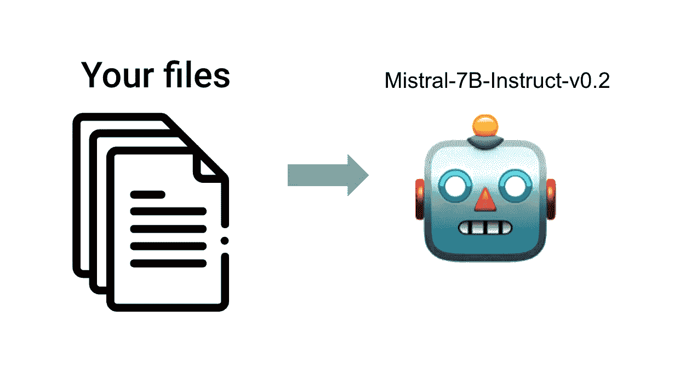
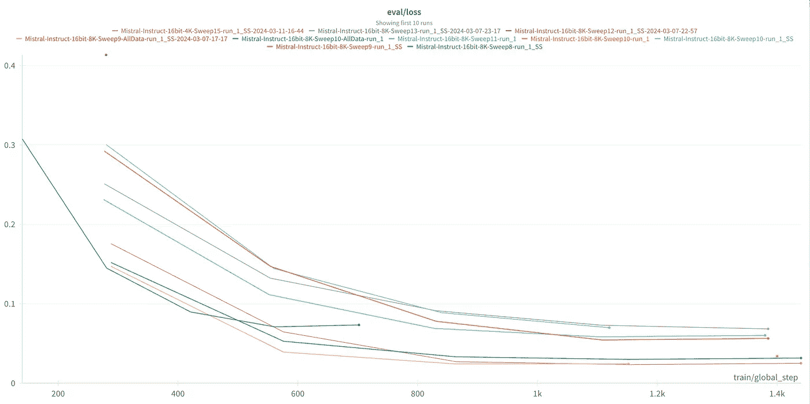
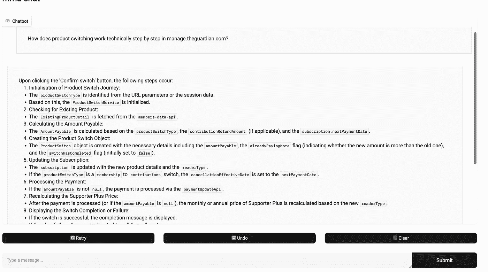
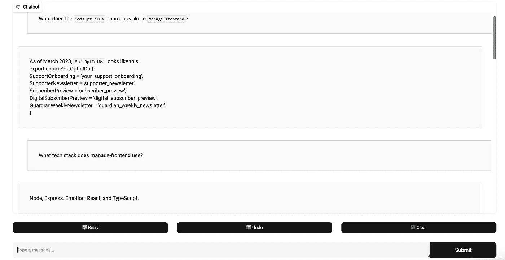
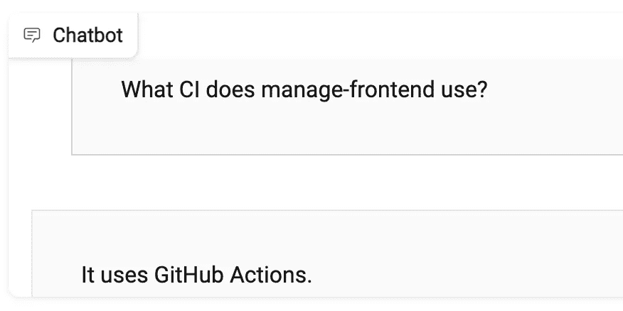
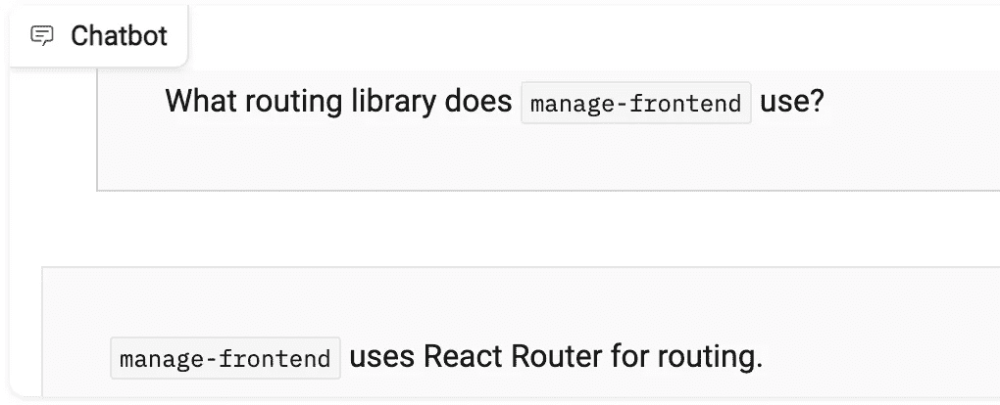
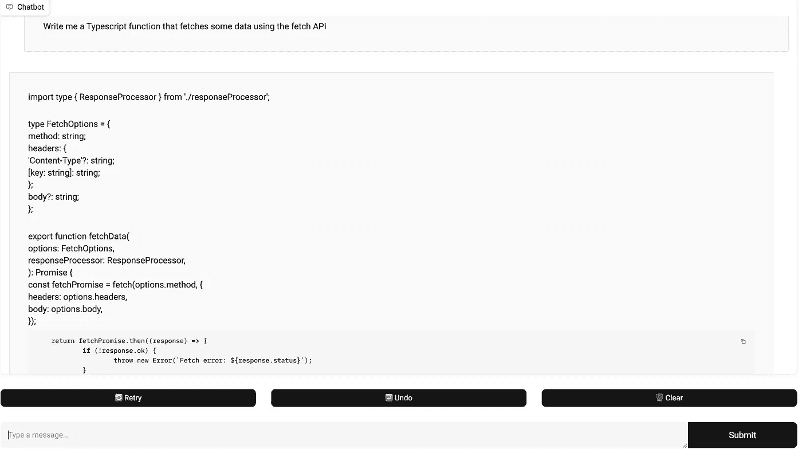
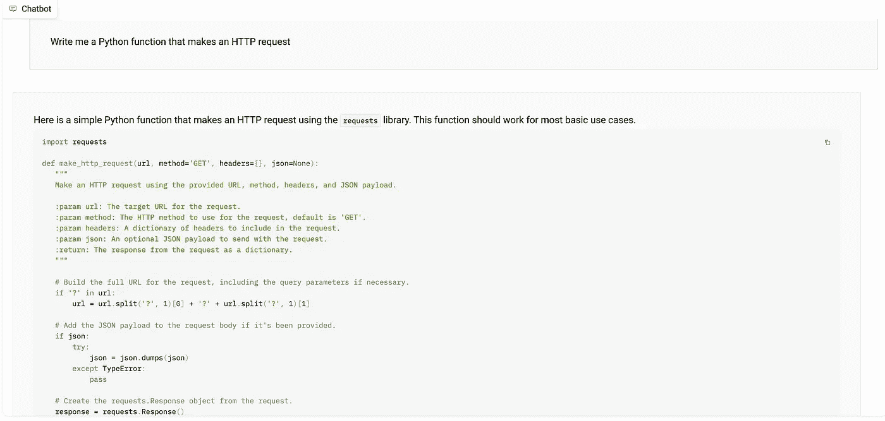
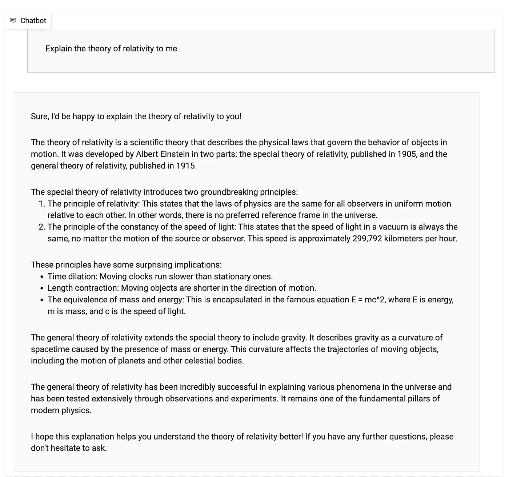

# 对原始文本数据进行微调以训练 Instruct 模型

> 原文：[`towardsdatascience.com/fine-tune-an-instruct-model-over-raw-text-data-6db654e7e2ed?source=collection_archive---------1-----------------------#2024-03-26`](https://towardsdatascience.com/fine-tune-an-instruct-model-over-raw-text-data-6db654e7e2ed?source=collection_archive---------1-----------------------#2024-03-26)

## 用少量的对话数据将现代聊天机器人微调至不到 10 美元

[](https://medium.com/@jon.flynn2?source=post_page---byline--6db654e7e2ed--------------------------------)[](https://towardsdatascience.com/?source=post_page---byline--6db654e7e2ed--------------------------------) [Jon Flynn](https://medium.com/@jon.flynn2?source=post_page---byline--6db654e7e2ed--------------------------------)

·发布于[Towards Data Science](https://towardsdatascience.com/?source=post_page---byline--6db654e7e2ed--------------------------------) ·阅读时长 12 分钟·2024 年 3 月 26 日

--



图片来自作者

# **目的**

使现代聊天机器人能够在你自己的数据上保持其能力仍然是一个复杂的任务。随着 Gemini 1.5 Pro 和 Claude 3 等领先产品将上下文窗口的大小快速扩展到 100 万个 token，产品的进步可谓飞速。然而，像我目前所在的 The Guardian 这样的公司，拥有无数代码库，包含数亿个 token 的数据。

[最近发布的 Devin](https://twitter.com/cognition_labs/status/1767548763134964000)由 Cognition Labs 开发，可能使用了巧妙的 RAG 技术来完成任务，但将所有信息注入上下文窗口可能会带来问题。社区中的共识似乎是，GPT-4 128k 在大约 60K tokens 的范围内仍能保持出色的性能，但这并不多。即便如此，随着 token 数量的增加，保持卓越性能需要更好且更复杂的提示。由于这些限制，看来未来最强大的模型可能会结合良好的提示、RAG 和微调技术。例如，对于代码助手工具，可以通过 RAG 管道检索最新的代码。然后，微调后的模型可以比未微调的模型更有效地分析和推理这些代码，指出其中可能存在的边缘案例和风险。此外，微调后的模型将采用组织的编码规范和最佳实践，从而为员工提供更具洞察力的指导。

我在网上找到关于在较小数据集上微调的高效聊天机器人的资源有限。相反，大多数研究介绍了像[BioMistral](https://arxiv.org/abs/2402.10373)这样的模型，这些模型通过使用大约 30 亿个标记的数据集取得成功，要求有显著的预算和专业知识。

这个实验旨在发现一种更轻量级的方法，在 128K 上下文窗口的限制和在数十亿个标记上微调的模型的复杂性之间找到平衡，可能更接近数千万个标记的范围。对于较小规模的测试，我将对 Mistral 的[7B Instruct v0.2 模型](https://huggingface.co/mistralai/Mistral-7B-Instruct-v0.2)进行微调，数据集来自[《卫报》管理前端仓库](https://github.com/guardian/manage-frontend)（该数据集包含 160 万个标记）。

本文的目标是创建一套可重复的指导方案，用于使用易于获取的硬件进行具有成本效益的模型微调。重点放在易用性上，尽量减少试错过程，并最大化使用原始文本数据，而非标注的对话数据。希望任何软件开发人员，即使没有深度学习工程经验，也能轻松使用[该笔记本](https://colab.research.google.com/drive/11X5ptOe3zbFE2s1AeHu-gynwAbkE-7Zn#scrollTo=eWE0W7YSVTmx)并训练自己的模型。

我将概述所使用的数据，突出最佳的超参数及其结果，然后以技术性解释总结它们的有效性。

# **训练**

## **A100 40GB**

除了一次使用 H100 80GB 的训练过程外，我所有的训练都使用了 Colab 提供的 Nvidia A100 40GB。

## Unsloth

我使用了 Unsloth 库以提高训练速度并减少内存消耗。[这篇博客文章](https://huggingface.co/blog/unsloth-trl)很好地总结了[Unsloth 库](https://github.com/unslothai/unsloth)的工作原理，并展示了训练速度提升和内存节省的基准测试。

## 与现有微调模型的训练方法的不同

现代的微调示例，用于教授模型新的领域特定知识，包括[BioMistral](https://arxiv.org/abs/2402.10373)和[xFinance](https://www.stochastic.ai/blog/xfinance-vs-bloomberg-gpt)。xFinance 继续对 Llama 7B 基础模型进行预训练，即非指令版本。它使用 LoRA。该模型首先在超过 216,626 个文档上进行训练，总计 236 亿个标记。然后，它在 25,000 个金融领域对话数据样本上进一步微调。与标准的聊天机器人训练类似，这种方法首先在原始文本数据上进行训练，缺少指令标记或结构化的对话元素，然后转向专门在对话数据上进行训练。BioMistral 采用类似的方法，但有趣的是，它从 Mistral 7B Instruct v0.2 模型开始微调。

我的方案将原始数据集和注释数据集结合在同一个训练过程中，因为这种方法产生了最佳的结果。只进行了一个训练过程。

## TRL 的 SFTtrainer

我使用了来自 [trl](https://huggingface.co/docs/trl/en/index) 库的 `[SFTtrainer](https://huggingface.co/docs/trl/en/sft_trainer)`。我看到它在 [这个 Unsloth 演示笔记本](https://colab.research.google.com/drive/1ef-tab5bhkvWmBOObepl1WgJvfvSzn5Q?usp=sharing) 中被使用，并且效果不错。这是对 HuggingFace 默认训练器的一个包装。我找不到很多关于 SFTtrainer 如何扩展它的文档，代码暗示了最小的变化。它似乎通过将目标标签设置为与 `input_ids` 相同来为训练准备数据集（[请查看这些代码行](https://github.com/huggingface/trl/blob/main/trl/trainer/utils.py#L477-L480)）。它将目标 `labels` 设置为与 `input_ids` 相同。[这里有一个笔记本示例](https://github.com/brevdev/notebooks/blob/main/mistral-finetune-own-data.ipynb)，它使用默认的 HuggingFace 训练器做相同的事情。实际上，这就是通过交叉熵损失进行下一个 token 预测，使用 HuggingFace 提供的默认训练器，没什么花哨的。训练“原始文本数据”和对话数据之间唯一的区别是，Mistral Instruct 被训练识别的特殊指令符号 “[INST]” 和 “[/INST]” 的添加。请参考 [这个笔记本](https://colab.research.google.com/drive/11X5ptOe3zbFE2s1AeHu-gynwAbkE-7Zn#scrollTo=sDu17ZImsdVK) 中的单元格输出，查看数据集的样子。

# 创建原始数据集

我的原始数据集包括了仓库的 Wiki、12 月份主分支的快照以及最后 100 个拉取请求，包括评论和代码更改。我将数据分块处理，每个样本最多 8192 个 token。

## **抓取 Wiki**

我只是把每一页复制并粘贴到一个文本文件里

## **抓取代码库**

我写了一个 Python 脚本，运行在本地并将所有文件写入以下格式的文本文件：

```py
- File: productSwitchTypes.ts
  Content:
export type ProductSwitchType =
 | 'to-recurring-contribution'
 | 'recurring-contribution-to-supporter-plus';

export interface PreviewResponse {
 amountPayableToday: number;
 supporterPlusPurchaseAmount: number;
 contributionRefundAmount: number;
 nextPaymentDate: string;
 checkChargeAmountBeforeUpdate: boolean;
}

- File: productTypes.ts
  Content:
...
...
...
```

## **抓取 PR 数据**

[Colab 笔记本中的对应单元格](https://colab.research.google.com/drive/11X5ptOe3zbFE2s1AeHu-gynwAbkE-7Zn#scrollTo=kssax8bg5OWS)将为 [这个 PR](https://github.com/octocat/Hello-World/pull/2989) 生成如下输出：

```py
PR #2989: Create devcontainer.json
URL: https://github.com/octocat/Hello-World/pull/2989
Description: None
Created at: 2024-02-26T11:39:03Z
Merged at: None
File: .devcontainer/devcontainer.json, Status: added
Changes: @@ -0,0 +1,5 @@
+{
+  "image": "mcr.microsoft.com/devcontainers/universal:2",
+  "features": {
+  }
+}
```

# 生成对话数据

尽管本文的标题如此，我确实使用了一些标注过的对话数据，但这些数据是合成的并且容易生成。这些数据并不符合精心挑选的数据集质量，但合成数据已经变得越来越普遍（我在某个地方看到它大约占了 HuggingFace 数据集的 50%）。虽然它不会带来惊人的聊天机器人性能，但直觉上它可能有助于缓解灾难性的遗忘和性能下降，同时也是一种简单的数据增强方法。我使用了三种生成合成数据的方法：

1.  对于每个 Wiki 页面，我使用了 GPT-4 Turbo API 根据提供的文本生成了一些问答样本。最终得到了大约 300 对问答。

1.  对于每个 Wiki 页面，我创建了一个特定的指令或问题。例如，在‘[Fastly & Caching](https://github.com/guardian/manage-frontend/wiki/Fastly-&-Caching)’页面，指令可能是‘带我了解 Fastly 在`manage-frontend`中的使用方式’。然后，回答就是该 Wiki 页面的内容。

1.  类似于前一步，我为代码库中的每个文件创建了一个问题。例如：“`manage-frontend`仓库中的`package.json`文件是什么样子的？”然后，我会在每个代码文件前加上用于训练的代码库快照日期，即：“截至 2023 年 12 月，`package.json`文件如下：<package.json 代码在此>”

QA 数据已导出为 JSONL 文件，建议使用以下格式，因为许多分词器[具有名为](https://colab.research.google.com/drive/11X5ptOe3zbFE2s1AeHu-gynwAbkE-7Zn#scrollTo=jSpOjMopIRWk) `[apply_chat_template](https://colab.research.google.com/drive/11X5ptOe3zbFE2s1AeHu-gynwAbkE-7Zn#scrollTo=jSpOjMopIRWk)`的功能，该功能接收每行中`messages`属性内的列表。以下是推荐的格式示例：

```py
{"messages":[{"role":"user","content":"What is the capital of France?"},{"role":"assistant","content":"The capital of France is Paris."}]}
{"messages":[{"role":"user","content":"What is the capital of England?"},{"role":"assistant","content":"The capital of England is London."}]}
```

我正在使用 10%的对话数据作为验证数据集。

# 训练模型

## **超参数搜索**

我使用了手动搜索。我的直觉是，LoRA 的秩（rank）、批量大小（batch size）和学习率（learning rate）会对模型性能产生最大影响。因此，我从这些超参数的广泛范围开始，然后根据初步搜索的性能逐步缩小搜索空间。学习率为 2e-5 似乎是最优的，这似乎是微调 Mistral 时的标准设置。[BioMistral](https://arxiv.org/abs/2402.10373)继续使用 0 热身、余弦调度器和学习率为 2e-5 微调指令模型 v0.2。当我提高秩并降低批量大小时，评估损失（eval loss）有所改善。然而，需要注意的是，仅仅通过降低评估批量大小就可以自然地改善验证损失，因为每次验证的样本较少，因此在训练完成后，手动检查模型总是很重要的！

下图中的所有搜索都使用了秩为 512 或 768 的设置，具有不同的 alpha 值；alpha 值为秩的 1 倍、1.5 倍或 2 倍。批量大小为 1、2 或 4。您可以在[此处](https://colab.research.google.com/drive/11X5ptOe3zbFE2s1AeHu-gynwAbkE-7Zn#scrollTo=IpcbWcAZgaq9)查看我使用的最终超参数。

一旦找到最优的超参数，我就重新进行了训练，包含了所有数据，以最大限度地利用我所拥有的少量数据，这是常见的做法。这些训练通过在搜索名称末尾添加`All-Data`标签来标注。

每次搜索都用了不到 3 小时，只用了 Colab 上的几磅费用。所有的搜索大约花费了我 40 到 50 英镑之间。

*备注:* 我不小心将我的问答验证数据包含在了原始文本数据中（我忘记了自己把它复制粘贴到我的一个文本文件中了 🙃）。然而，在没有这些数据的情况下重新运行几次，确认了选定的超参数仍然稳定，验证损失并没有显著增加，最佳运行的评估损失约为 0.12。这仍然非常低，表明几乎完美的性能，但这并非事实。因此，评估策略需要一些调查和改进。



# 预期

我对这个实验的预期较低。由于类似规模和设置的项目在线资源有限，我认为有明显的技术原因导致这一结果。我原以为会有大量的灾难性遗忘、随机幻觉和显著的性能下降，尽管我认为它也许能回答一些简单的问题，比如“`manage-frontend` 使用了什么技术栈？”。

# **结果**

[这个笔记本](https://colab.research.google.com/drive/1_j_-I_URIdiKshfeFrQoBLfIOpxx7HqR#scrollTo=oNUN3gIobgZ7)包含了一个 Gradio 应用程序，用于实验你的聊天机器人。

结果比预期更好：

以下对关于“产品切换”的问题的回答令人印象深刻，尽管 Wiki 或 PR 描述中没有自然语言的参考。这里大多数变量名和条件判断是正确的：



像以下这样的提问再次没有自然语言参考，实际上需要深入代码才能意识到我们不允许切换到 Paypal，只允许卡片和 DD。它几乎正确地回答了。


当明确要求时，它可以完美地回忆起一些代码：



## 那么在我们的数据集中关于冲突的信息怎么办？

部分 Wiki 内容已经过时（[示例](https://github.com/guardian/manage-frontend/wiki/Client-side-routing)），包括对我们旧的 CI 平台 TeamCity 以及使用 Reach Router 的旧路由解决方案的引用。在询问聊天机器人这些问题时，它的回答是正确的，但需要注意的是，这些问题更加常见，且预训练模型可能更倾向于推荐这些：



## **灾难性遗忘**

灾难性遗忘比预期轻微，但微调模型和基础模型之间仍然有明显的差距：

在询问涉及 JavaScript 和 Typescript 的问题时，这些语言在 `manage-frontend` 中很常见（例如：“写一个做 x 和 y 的 Typescript 函数”），模型可能会将 `manage-frontend` 代码库中使用的一些模式加入到回答中。例如：



给定编写一些 Python 代码的指令，我们不会从 `manage-frontend` 中得到这种知识注入到响应中：



对于非代码相关的问题，存在细微的差异和性能下降。请注意以下响应中的错误：“229,792 公里每 *小时*”，而不是每秒钟。原始模型在 16 位下，使用相同的推理设置并不会犯这个错误。



## **文本生成策略**

请参阅 HuggingFace 的 [文本生成策略文档](https://huggingface.co/docs/transformers/generation_strategies)。

我将 `[do_sample](https://colab.research.google.com/drive/1_j_-I_URIdiKshfeFrQoBLfIOpxx7HqR#scrollTo=LznZr5T_B01O)` 设置为 False，因此模型使用确定性方法在后台进行贪心搜索来生成文本。它根据模型预测的概率选择最可能的下一个单词或最可能的单词序列。因此，诸如 `temperature` 和 `top_p` 之类的参数是无关紧要的，因为模型并不是从下一个单词的概率分布中进行采样。而是直接选择具有最高概率的 token。[这里有一篇](https://medium.com/@jessica_lopez/understanding-greedy-search-and-beam-search-98c1e3cd821d)很好的文章，帮助你更好地了解文本生成中的确定性方法。我发现使用这种方法生成的响应稍微好一些，而使用概率方法并将 `temperature` 和 `top_p` 设置为极端值则导致性能显著下降。

## 为什么这些超参数表现最好？

我不知道这个问题的最终答案，但我会给出我最好的推测：

**批次大小：**

使用较小的批次大小会引入更多的变异性和噪声，从而影响梯度估计。这种噪声让优化器在每次更新时能更好地观察到损失面上的细节，从而更动态地响应单个数据点的特定特征。从宏观角度来看，使用较小的批次大小让模型能专注于并学习每个数据样本的独特特性。这种方法有助于对数据集有更细致和更微妙的理解，因为模型会在训练过程中根据每个样本的特定特征做出调整和响应。对于像本实验中使用的小数据集，这种效果可能会更加显著。

**LoRA Rank：**

由于随着 rank 的提高，结果不断改进，我还尝试了在 H100 80GB 上使用 2048 的高 rank（alpha 也为 2048），但是结果并不如预期。我将在下文中提供在 H100 80GB 上快速且廉价地设置 Unsloth 的方法说明。

使用 768 的秩可能在适应性和保持预训练模型的泛化能力之间找到了合适的平衡。我进行的训练运行中，使用更低秩的模型不仅在新数据上的表现更差，而且还导致了更多的遗忘。较低的秩意味着引入的适应矩阵更加受限，导致在微调过程中更新的参数更少。这可能导致模型更多地专注于新的微调数据，这也许能解释为什么会有更多的遗忘。此外，较高的秩增加了模型学习任务特定细节的能力，因为它为我们提供了更多可训练的参数，从而本质上使得模型更“智能”。因此，过低的秩不足以让模型学习新数据的复杂性，而 2048 的秩则让模型有太多自由去偏离其宝贵的预训练知识。[这里有一个不错的讨论](https://www.reddit.com/r/MachineLearning/comments/13rp5sa/d_does_lora_actually_mitigate_catastrophic/)可以了解更多关于 LoRA 在减轻遗忘方面的影响。

# **结论**

这些结果令人鼓舞，尤其是考虑到训练数据的规模和质量有限。若能获得更好的训练数据，我们可能会看到显著的改进。公司内部的消息工具、工单和问题管理系统以及电子邮件中都有大量的高质量文本数据。此外，开发者也可以投入时间来创建高质量的对话数据。

# **在 H100 80GB 上进行微调**

如果你想尝试更多的计算资源，下面是一些在云端使用比 Colab 更强大显卡快速运行模型的指导：

1.  我使用了 [LambdaLabs](https://lambdalabs.com/) 来完成这一任务。它是我找到的最便宜的选项，而且还提供了一个可以直接在浏览器中使用的 Jupyter Lab 实例链接。大约每小时 $2.79。请注意，这个价格对于它提供的服务来说可能看起来很便宜，但正如我们所知道的，Linux 和 Python 包管理是开发者面临的最困难的任务之一，所以在调试一个出错的设置时，很容易烧掉很多钱。

1.  截至 2024 年 3 月，每个实例所附带的磁盘预装了 CUDA 12.2，这似乎是一个有点奇怪的选择，因为目前还没有支持此版本 CUDA 的稳定 PyTorch 版本。无论如何，你需要 SSH 进入实例并运行以下命令才能让 Unsloth 正常工作：

1.  安装 PyTorch 2.2.0。PyTorch 实际上自带了 CUDA 运行时，这意味着不需要麻烦的版本匹配。运行以下命令，然后重启实例：

```py
pip install --upgrade --force-reinstall --no-cache-dir torch==2.2.0 triton \
  --index-url https://download.pytorch.org/whl/cu121
```

4\. 运行这些命令：

```py
pip install --upgrade pip setuptools wheel
pip install packaging
```

5\. 安装 Unsloth：

```py
pip install "unsloth[cu121-torch220] @ git+https://github.com/unslothai/unsloth.git"
```
