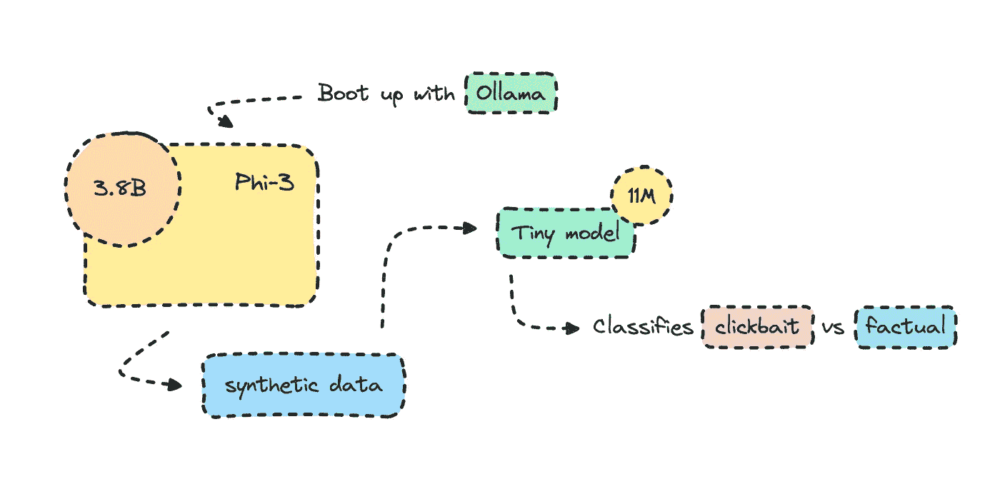
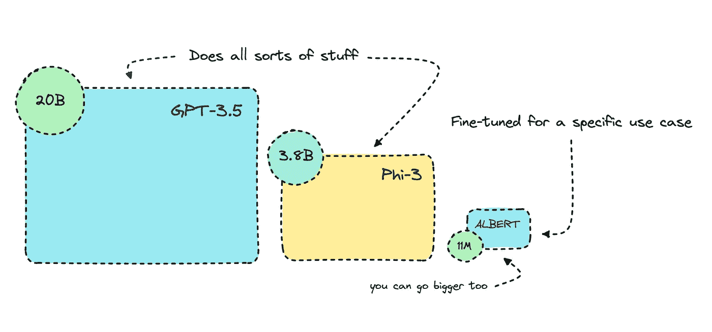

# 微调更小的 Transformer 模型：文本分类

> 原文：[`towardsdatascience.com/fine-tune-smaller-transformer-models-text-classification-77cbbd3bf02b?source=collection_archive---------0-----------------------#2024-05-28`](https://towardsdatascience.com/fine-tune-smaller-transformer-models-text-classification-77cbbd3bf02b?source=collection_archive---------0-----------------------#2024-05-28)

## 使用更小的语言模型

## 使用微软的 Phi-3 生成合成数据

 [Ida Silfverskiöld](https://medium.com/@ilsilfverskiold?source=post_page---byline--77cbbd3bf02b--------------------------------)

·发表于 [Towards Data Science](https://towardsdatascience.com/?source=post_page---byline--77cbbd3bf02b--------------------------------) ·18 分钟阅读·2024 年 5 月 28 日

--

从更大的模型构建更小的模型来执行某个应用场景 | 图片来自作者

*如果你不是会员，但想阅读这篇文章，可以通过这个朋友链接查看* *点击这里。*

文本分类模型并不新鲜，但其构建速度和性能水平已有显著提升。

我将在这里微调的基于 Transformer 的模型，比 GPT-3.5 Turbo 小超过 1000 倍。由于它将专门针对这个应用场景进行训练，因此在此用例上会表现得更好。

这个想法是优化 AI 工作流，使得较小的模型在某些场景下表现更好，特别是在处理冗余任务时，较大的模型则显得有些过于强大。

简化的模型大小演示 | 图片来自作者

我之前曾讨论过 [这篇文章](https://medium.com/gitconnected/fine-tune-smaller-nlp-models-with-hugging-face-for-specific-use-cases-1745813471dc)，其中我为技术类内容构建了一个稍大的 [关键词提取器](https://huggingface.co/ilsilfverskiold/tech-keywords-extractor)，使用的是序列到序列的 Transformer 模型。我还介绍了不同的 [模型](https://github.com/ilsilfverskiold/smaller-models-docs/tree/main/nlp/docs) 以及它们的优势。

在这篇文章中，我将深入探讨使用 Transformer 进行文本分类，特别是编码器模型在此方面的优势。我将训练一个…
