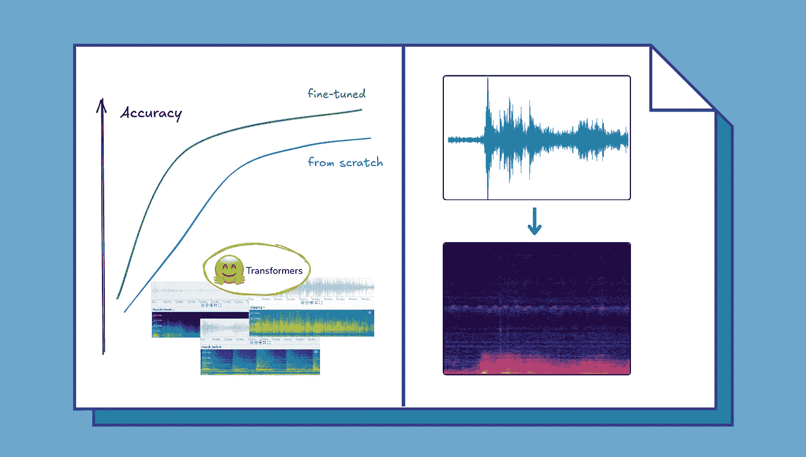
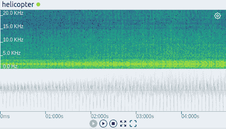
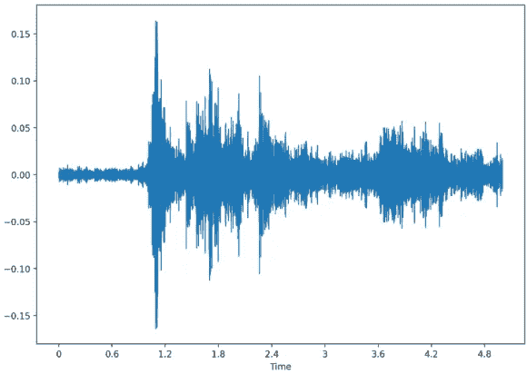
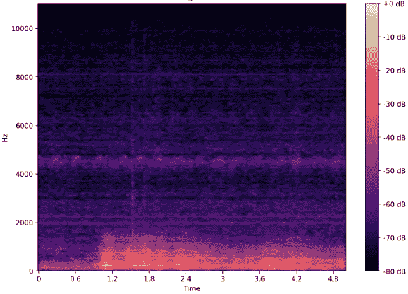
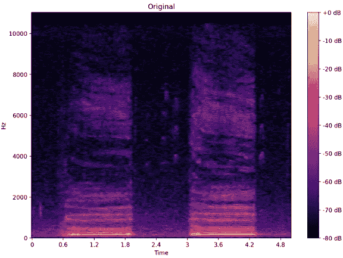
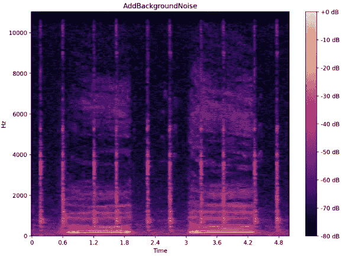
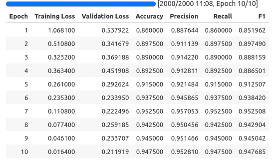
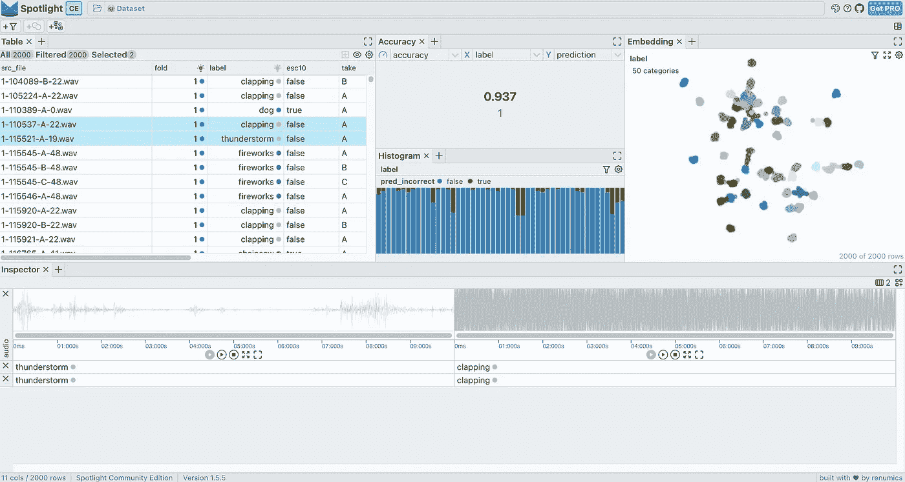

# 使用 Hugging Face Transformers 微调音频光谱图变换器

> 原文：[`towardsdatascience.com/fine-tune-the-audio-spectrogram-transformer-with-transformers-73333c9ef717?source=collection_archive---------4-----------------------#2024-08-21`](https://towardsdatascience.com/fine-tune-the-audio-spectrogram-transformer-with-transformers-73333c9ef717?source=collection_archive---------4-----------------------#2024-08-21)

## 学习如何微调音频光谱图变换器模型，以便进行您自己的数据音频分类

[](https://medium.com/@marius_s?source=post_page---byline--73333c9ef717--------------------------------)[](https://towardsdatascience.com/?source=post_page---byline--73333c9ef717--------------------------------) [Marius Steger](https://medium.com/@marius_s?source=post_page---byline--73333c9ef717--------------------------------)

·发表于 [Towards Data Science](https://towardsdatascience.com/?source=post_page---byline--73333c9ef717--------------------------------) ·13 分钟阅读·2024 年 8 月 21 日

--



微调音频分类模型，而不是从头开始训练，能够更高效地使用数据，从而在下游任务中获得更好的结果 | *图像来自作者*

音频分类是机器学习中音频理解的关键任务之一，并为许多 AI 系统提供了构建基础。它驱动着工业领域的应用，例如[测试数据评估](https://renumics.com/use-cases/test-data)、错误和异常检测，或预测性维护。预训练的变换器模型，如音频光谱图变换器（AST）[1]，为这些应用提供了强大的基础，具有鲁棒性和灵活性。

尽管从头开始训练一个 AST 模型需要大量数据，但使用已经学习了音频特征的预训练模型会更高效。通过使用特定于我们用例的数据微调这些模型，对于使其适用于我们的特定应用程序至关重要。这个过程将模型的能力调整为我们数据集的独特特征，如类别和数据分布，确保结果的相关性。


音频光谱图变换器根据音频样本的光谱图预测类别 | *图像来自作者*

AST 模型与 Hugging Face 🤗 [Transformers](https://huggingface.co/docs/transformers/index)库集成，由于在音频分类任务中易于使用且性能强大，已成为热门选择。本指南将带领我们完成对预训练 AST 模型（“[*MIT/ast-finetuned-audioset-10–10–0.4593*](https://huggingface.co/MIT/ast-finetuned-audioset-10-10-0.4593)*”*）进行微调的整个过程，使用我们自己的数据，在[ESC50 数据集](https://github.com/karolpiczak/ESC-50)[2]上进行演示。利用 Hugging Face 生态系统和 PyTorch 作为后端的工具，我们将涵盖从数据准备和预处理到模型配置和训练的所有内容。

> 我根据过去几年与 AST 模型和 Hugging Face 生态系统的专业经验撰写了这份指南。
> 
> 本教程将指导我们使用 Hugging Face 生态系统的工具对自己的音频分类数据集上的 AST 进行微调。
> 
> 我们将加载数据（1），预处理音频（2），设置音频增强（3），配置和初始化 AST 模型（4），最后，配置和开始训练（5）。

# 微调 AST 的逐步指南

在开始之前，请使用 pip 安装所有必需的软件包：

```py
pip install transformers[torch] datasets[audio] audiomentations
```

## 1\. 以正确格式加载我们的数据

首先，我们将使用 Hugging Face 🤗 [Datasets](https://huggingface.co/docs/datasets/index)库来管理我们的数据。该库将协助我们在训练过程中进行预处理、存储和访问数据，以及在需要时执行波形转换并实时编码为频谱图。

我们的数据应加载到具有以下结构的`Dataset`对象中：

```py
Dataset({
    features: ['audio', 'labels'],
    num_rows: 1234
})
```

> 在接下来的两个部分中，我将演示如何从🤗 Hub 加载准备好的数据集，以及如何从本地音频数据和标签创建一个`*Dataset*`。

**从 Hugging Face Hub 加载数据集：** 如果我们没有本地音频数据集，可以方便地使用`load_dataset`函数从 Hugging Face Hub 加载数据集。

在本指南中，我们将加载 ESC50 音频分类数据集以进行演示：

```py
from datasets import load_dataset

esc50 = load_dataset("ashraq/esc50", split="train")
```



ESC50 数据集中不同类别的频谱图（顶部）和波形图（底部）| *作者创建的图像（使用* [*Spotlight*](https://github.com/Renumics/spotlight)*)*

**加载本地音频文件和标签：** 我们可以使用包含文件路径和标签的字典或 pandas DataFrame 将音频文件和相关标签加载到`Dataset`对象中。如果我们有类名（字符串）到标签索引（整数）的映射，这些信息可以在数据集构建过程中包含。

这是一个实际示例：

```py
from datasets import Dataset, Audio, ClassLabel, Features

# Define class labels
class_labels = ClassLabel(names=["bang", "dog_bark"])
# Define features with audio and label columns
features = Features({
    "audio": Audio(),  # Define the audio feature
    "labels": class_labels  # Assign the class labels
})
# Construct the dataset from a dictionary
dataset = Dataset.from_dict({
    "audio": ["/audio/fold1/7061-6-0-0.wav", "/audio/fold1/7383-3-0-0.wav"],
    "labels": [0, 1],  # Corresponding labels for the audio files
}, features=features)
```

在这个例子中：

+   `Audio`特征类会自动处理音频文件的加载和处理。

+   `ClassLabel`有助于管理分类标签，使在训练和评估过程中更容易处理类别。

> **注意：** 有关如何使用 Hugging Face 加载音频的更多信息，请查看 Datasets 库的[文档](https://huggingface.co/docs/datasets/audio_load)。

**检查数据集：** 一旦数据集成功加载，每个音频样本都可以通过`Audio`特征类进行访问，`Audio`特征类通过仅在需要时将其加载到内存中来优化数据处理。这种高效的管理节省了计算资源，并加速了训练过程。

为了更好地理解数据结构并确保一切正确加载，我们可以检查数据集中单个样本：

```py
print(dataset[0])
```

输出示例：

```py
{'audio': {'path': '/audio/fold1/7061-6-0-0.wav',
  'array': array([0.00000000e+00, 0.00000000e+00, 0.00000000e+00, ...,
         1.52587891e-05, 3.05175781e-05, 0.00000000e+00]),
  'sampling_rate': 44100},
 'labels': 0}
```

该输出显示了音频文件的路径、波形数据数组以及采样率，并附上相应的标签。

> 对于接下来的步骤，您可以使用像我们这样准备好的数据集作为示例，也可以继续使用您自己的数据集。

## 2. 预处理音频数据

如果我们的数据集来自 Hugging Face Hub，我们将`*audio*`和`*labels*`列转换为正确的特征类型：

```py
import numpy as np
from datasets import Audio, ClassLabel

# get target value - class name mappings
df = esc50.select_columns(["target", "category"]).to_pandas()
class_names = df.iloc[np.unique(df["target"], return_index=True)[1]]["category"].to_list()
# cast target and audio column
esc50 = esc50.cast_column("target", ClassLabel(names=class_names))
esc50 = esc50.cast_column("audio", Audio(sampling_rate=16000))
# rename the target feature
esc50 = esc50.rename_column("target", "labels")
num_labels = len(np.unique(esc50["labels"]))
```

在这段代码中：

+   **音频转换：** `Audio`特征类处理音频文件的加载和处理，并将其重新采样到所需的采样率（此处为 16kHz，即`ASTFeatureExtractor`的采样率）。

+   **类别标签转换：** `ClassLabel`特征将整数映射到标签，反之亦然。



一个音频数组作为波形（左）和频谱图（右） | *图片由作者提供*

**为 AST 模型输入做准备：** AST 模型需要频谱图输入，因此我们需要将波形编码为模型可以处理的格式。这是通过使用`ASTFeatureExtractor`来实现的，该提取器是从我们打算在数据集上进行微调的预训练模型的配置中实例化的。

```py
from transformers import ASTFeatureExtractor

# we define which pretrained model we want to use and instantiate a feature extractor
pretrained_model = "MIT/ast-finetuned-audioset-10-10-0.4593"
feature_extractor = ASTFeatureExtractor.from_pretrained(pretrained_model)
# we save model input name and sampling rate for later use
model_input_name = feature_extractor.model_input_names[0]  # key -> 'input_values'
SAMPLING_RATE = feature_extractor.sampling_rate
```

> **注意：** 在特征提取器中设置**均值（mean）**和**标准差（std）**值以进行**归一化（normalization）**是非常重要的，这些值应当设为**我们数据集的值**。我们可以使用以下代码块来计算这些值：

```py
# calculate values for normalization
feature_extractor.do_normalize = False  # we set normalization to False in order to calculate the mean + std of the dataset
mean = []
std = []

# we use the transformation w/o augmentation on the training dataset to calculate the mean + std
dataset["train"].set_transform(preprocess_audio, output_all_columns=False)
for i, (audio_input, labels) in enumerate(dataset["train"]):
    cur_mean = torch.mean(dataset["train"][i][audio_input])
    cur_std = torch.std(dataset["train"][i][audio_input])
    mean.append(cur_mean)
    std.append(cur_std)
feature_extractor.mean = np.mean(mean)
feature_extractor.std = np.mean(std)
feature_extractor.do_normalize = True
```

**应用预处理转换：** 我们创建一个函数来预处理音频数据，将音频数组编码为模型期望的`input_values`格式。这个函数设置为动态应用，即在每个样本从数据集中加载时，它会实时处理数据。

```py
def preprocess_audio(batch):
    wavs = [audio["array"] for audio in batch["input_values"]]
    # inputs are spectrograms as torch.tensors now
    inputs = feature_extractor(wavs, sampling_rate=SAMPLING_RATE, return_tensors="pt")

    output_batch = {model_input_name: inputs.get(model_input_name), "labels": list(batch["labels"])}
    return output_batch

# Apply the transformation to the dataset
dataset = dataset.rename_column("audio", "input_values")  # rename audio column
dataset.set_transform(preprocess_audio, output_all_columns=False)
```

**检查转换后的数据：** 如果我们现在加载一个样本，它将实时转换，编码后的音频将作为`*input_values*`输出：

```py
{'input_values': tensor([[-1.2776, -1.2776, -1.2776,  ..., -1.2776, -1.2776, -1.2776],
         [-1.2776, -1.2776, -1.2776,  ..., -1.2776, -1.2776, -1.2776],
         [-1.2776, -1.2776, -1.2776,  ..., -1.2776, -1.2776, -1.2776],
         ...,
         [ 0.4670,  0.4670,  0.4670,  ...,  0.4670,  0.4670,  0.4670],
         [ 0.4670,  0.4670,  0.4670,  ...,  0.4670,  0.4670,  0.4670],
         [ 0.4670,  0.4670,  0.4670,  ...,  0.4670,  0.4670,  0.4670]]),
 'label': 0}
```

> **注意：** 验证转换过程是否保持数据完整性，并确保频谱图正确生成，以避免模型训练过程中出现任何问题，这是至关重要的。

**拆分数据集：** 作为最后一步数据预处理，我们将数据集拆分为`train`和`test`集，同时利用标签进行分层抽样。这样可以确保两个数据集中的类别分布保持一致。

```py
# split training data
if "test" not in dataset:
    dataset = dataset.train_test_split(test_size=0.2, shuffle=True, seed=0, stratify_by_column="labels")
```

## 3. 添加音频增强

增强在通过引入训练数据的变化性来提高机器学习模型的鲁棒性方面起着至关重要的作用。这模拟了不同的录音条件，并帮助模型更好地对未见过的数据进行泛化。

在开始设置之前，下面是一个视觉对比，展示了音频文件的**原始**频谱图和通过 **AddBackgroundNoise** 转换得到的增强版频谱图。



音频文件的原始频谱图（左）和通过 [Audiomentations](https://github.com/iver56/audiomentations) 库的 AddBackgroundNoise 转换增强后的音频（右）| *图片来源：作者*

> **注意：** 增强是提高训练鲁棒性和减少机器学习模型过拟合的有效工具。
> 
> 然而，必须**仔细考虑每个转换的潜在影响**。例如，添加噪音对于语音数据集可能是合适的，因为它可以模拟现实世界中的背景噪音情况。然而，对于声音分类等任务，这些增强可能会导致类别混淆，从而导致模型性能下降。

**设置音频增强：** 为了创建一组音频增强，我们使用了来自 [Audiomentations](https://iver56.github.io/audiomentations/) 库的 `Compose` 类，它允许我们将多个增强组合在一起。

下面是如何设置它：

```py
from audiomentations import Compose, AddGaussianSNR, GainTransition, Gain, ClippingDistortion, TimeStretch, PitchShift

audio_augmentations = Compose([
    AddGaussianSNR(min_snr_db=10, max_snr_db=20),
    Gain(min_gain_db=-6, max_gain_db=6),
    GainTransition(min_gain_db=-6, max_gain_db=6, min_duration=0.01, max_duration=0.3, duration_unit="fraction"),
    ClippingDistortion(min_percentile_threshold=0, max_percentile_threshold=30, p=0.5),
    TimeStretch(min_rate=0.8, max_rate=1.2),
    PitchShift(min_semitones=-4, max_semitones=4),
], p=0.8, shuffle=True)
```

在这个设置中：

+   `p=0.8` 参数指定 `Compose` 序列中的每个增强在给定音频样本上有 80% 的概率被应用。这个概率方法确保了训练数据的变化性，防止模型过度依赖于任何特定的增强模式，并提高其泛化能力。

+   `shuffle=True` 参数会随机化应用增强的顺序，增加了另一层变化性。

> 若要更好地理解这些增强及其详细配置选项，可以查看 [**Audiomentations 的文档**](https://iver56.github.io/audiomentations/)。此外，还有一个很棒的 [🤗 **空间**](https://phrasenmaeher-audio-transformat-visualize-transformation-5s1n4t.streamlit.app/)，可以在其中实验这些音频转换，听到并看到它们对频谱图的影响。

**将增强集成到训练管道中：** 我们在 `preprocess_audio` 转换中应用这些增强，同时将音频数据编码为频谱图。

新的预处理与增强如下：

```py
def preprocess_audio_with_transforms(batch):
    # we apply augmentations on each waveform
    wavs = [audio_augmentations(audio["array"], sample_rate=SAMPLING_RATE) for audio in batch["input_values"]]
    inputs = feature_extractor(wavs, sampling_rate=SAMPLING_RATE, return_tensors="pt")

    output_batch = {model_input_name: inputs.get(model_input_name), "labels": list(batch["labels"])}
    return output_batch

# Cast the audio column to the appropriate feature type and rename it
dataset = dataset.cast_column("input_values", Audio(sampling_rate=feature_extractor.sampling_rate))
```

此函数将定义的增强应用到每个波形，并使用 `ASTFeatureExtractor` 将增强后的波形编码为模型输入。

**设置训练和验证拆分的转换：** 最后，我们设置这些转换将在训练和评估阶段应用：

```py
# with augmentations on the training set
dataset["train"].set_transform(preprocess_audio_with_transforms, output_all_columns=False)
# w/o augmentations on the test set
dataset["test"].set_transform(preprocess_audio, output_all_columns=False)
```

## 4\. 配置并初始化 AST 进行微调

为了将 AST 模型适应我们的特定音频分类任务，我们需要调整模型的配置。因为我们的数据集与预训练模型的类别数不同，而且这些类别对应不同的分类。我们需要用一个新的分类头替换预训练模型中的分类头，以解决我们的多类问题。

新的分类头的权重将被随机初始化，而模型其余部分的权重将从预训练版本加载。通过这种方式，我们可以从预训练的学习特征中受益，并在我们的数据上进行微调。

这是如何设置和初始化带有新分类头的 AST 模型：

```py
from transformers import ASTConfig, ASTForAudioClassification

# Load configuration from the pretrained model
config = ASTConfig.from_pretrained(pretrained_model)
# Update configuration with the number of labels in our dataset
config.num_labels = num_labels
config.label2id = label2id
config.id2label = {v: k for k, v in label2id.items()}
# Initialize the model with the updated configuration
model = ASTForAudioClassification.from_pretrained(pretrained_model, config=config, ignore_mismatched_sizes=True)
model.init_weights()
```

**预期输出：** 我们将看到一些警告，表明某些权重，特别是分类层中的权重，正在被重新初始化：

```py
Some weights of ASTForAudioClassification were not initialized from the model checkpoint at MIT/ast-finetuned-audioset-10-10-0.4593 and are newly initialized because the shapes did not match:
- classifier.dense.bias: found shape torch.Size([527]) in the checkpoint and torch.Size([2]) in the model instantiated
- classifier.dense.weight: found shape torch.Size([527, 768]) in the checkpoint and torch.Size([2, 768]) in the model instantiated
You should probably TRAIN this model on a down-stream task to be able to use it for predictions and inference.
```

## 5\. 设置评估指标并开始训练

在最后一步，我们将使用 🤗 [Transformers](https://github.com/huggingface/transformers) 库来配置训练过程，并使用 🤗 [Evaluate](https://github.com/huggingface/evaluate) 库来定义评估指标，以评估模型的性能。

**1\. 配置训练参数：** `TrainingArguments` 类有助于设置训练过程中的各种参数，如学习率、批量大小和训练轮数。

```py
from transformers import TrainingArguments

# Configure training run with TrainingArguments class
training_args = TrainingArguments(
    output_dir="./runs/ast_classifier",
    logging_dir="./logs/ast_classifier",
    report_to="tensorboard",
    learning_rate=5e-5,  # Learning rate
    push_to_hub=False,
    num_train_epochs=10,  # Number of epochs
    per_device_train_batch_size=8,  # Batch size per device
    eval_strategy="epoch",  # Evaluation strategy
    save_strategy="epoch",
    eval_steps=1,
    save_steps=1,
    load_best_model_at_end=True,
    metric_for_best_model="accuracy",
    logging_strategy="steps",
    logging_steps=20,
)
```

**2\. 定义评估指标：** 定义如准确率、精确度、召回率和 F1 分数等指标来评估模型的性能。`compute_metrics` 函数将在训练过程中处理这些计算。

```py
import evaluate
import numpy as np

accuracy = evaluate.load("accuracy")
recall = evaluate.load("recall")
precision = evaluate.load("precision")
f1 = evaluate.load("f1")
AVERAGE = "macro" if config.num_labels > 2 else "binary"

def compute_metrics(eval_pred):
    logits = eval_pred.predictions
    predictions = np.argmax(logits, axis=1)
    metrics = accuracy.compute(predictions=predictions, references=eval_pred.label_ids)
    metrics.update(precision.compute(predictions=predictions, references=eval_pred.label_ids, average=AVERAGE))
    metrics.update(recall.compute(predictions=predictions, references=eval_pred.label_ids, average=AVERAGE))
    metrics.update(f1.compute(predictions=predictions, references=eval_pred.label_ids, average=AVERAGE))
    return metrics
```

**3\. 设置 Trainer：** 使用 Hugging Face 的 `Trainer` 类来处理训练过程。该类集成了模型、训练参数、数据集和评估指标。

```py
from transformers import Trainer

# Setup the trainer
trainer = Trainer(
    model=model,
    args=training_args,
    train_dataset=dataset["train"],
    eval_dataset=dataset["test"],
    compute_metrics=compute_metrics,  # Use the metrics function from above
)
```

配置完成后，我们启动训练过程：

```py
trainer.train()
```



应用音频增强的训练日志示例 | *图像由作者提供*

# （非那么可选的）: 评估结果

为了理解模型的表现并找出潜在的改进空间，评估其在训练和测试数据上的预测至关重要。在训练过程中，准确率、精确度、召回率和 F1 分数等指标会记录到 [TensorBoard](https://www.tensorflow.org/tensorboard)，这使我们能够检查模型随时间的进展和性能。

**启动 TensorBoard**：为了可视化这些指标，在终端运行以下命令启动 TensorBoard：

```py
tensorboard --logdir="./logs"
```

这提供了一个图形化的表示，展示了模型的学习曲线和指标随时间的改进，帮助我们及早发现潜在的过拟合或性能不足。

对于**更详细的见解**，我们可以使用 [Renumics](https://renumics.com/) 的开源工具 [**Spotlight**](https://renumics.com/open-source/spotlight) 检查模型的预测。Spotlight 可以让我们探索和可视化预测以及数据，帮助我们识别单个数据点的模式、潜在偏见和错误分类。



在 Spotlight 中加载了带有音频嵌入和模型预测的 ESC50 数据集。在这个 Hugging Face [Space](https://huggingface.co/spaces/renumics/spotlight-esc50-clap) 中尝试一下吧。| *作者提供的图片*

**安装和使用 Spotlight**：

要开始使用 Spotlight，请使用 pip 安装它并加载您的数据集进行探索：

```py
pip install renumics-spotlight
```

并使用一行代码加载 ESC50 数据集进行**交互式探索**：

```py
from renumics import spotlight

spotlight.show(esc50, dtype={"audio": spotlight.Audio})
```

> 本教程侧重于建立微调流程。有关全面的**评估**，包括**使用 Spotlight**，请参考下面提供的其他教程和资源以及本指南末尾的链接（有用链接）。

这里有一些如何使用 Spotlight 进行模型评估的示例：

1.  一篇关于**使用 Transformers 进行实时语音分析**的博文和演示：[博文](https://renumics.com/blog/voice-analytics-with-transformers) & 🤗 [Space](https://huggingface.co/spaces/renumics/emodb-model-comparison)

1.  一篇关于**Fine-tuning image classification models from image search**的博文和简短示例：[博文](https://itnext.io/image-classification-in-2023-8ab7dc552115) & [使用案例](https://renumics.com/next/docs/use-cases/image-fine-tuning)

1.  一篇关于**如何自动查找和删除图像、音频和文本分类数据集中问题的文章**和简短示例：[博文](https://medium.com/@daniel-klitzke/finding-problematic-data-slices-in-unstructured-data-aeec0a3b9a2a) & [使用案例](https://renumics.com/next/docs/use-cases/audio-classification)

# 结论

通过按照本指南中概述的步骤，我们将能够在任何音频分类数据集上微调音频频谱变换器（AST）。这包括设置数据预处理、应用有效的音频增强以及为特定任务配置模型。训练后，我们可以使用定义的指标评估模型的性能，确保它符合我们的要求。一旦模型经过微调和验证，就可以用于推断。

## 关于这个主题的更多内容

这是关于用于工业音频分类用例的音频频谱变换器的**系列教程和博文**中的第二篇。

+   看一看**第一部分**：[*如何在 HuggingFace 生态系统中使用 SSAST 模型权重？*](https://medium.com/itnext/how-to-use-ssast-model-weigths-in-the-huggingface-ecosystem-0f3fdc8d38da)，

+   并查看[这个列表](https://medium.com/@marius_s/list/audio-classification-for-industry-use-cases-cb6d169a7d80)以获取即将发布的文章。

请继续关注本系列的后续文章，我们将探讨实际使用案例中的特定挑战以及如何调整 AST 以应对这些挑战。

## 有用的链接

1.  **下载** **本指南**作为笔记本，从 Renumics 的[**资源页面**](https://renumics.com/open-source/resources)**。**

1.  关于如何使用**Spotlight 进行音频模型评估**的教程：[**博客**](https://renumics.com/blog/voice-analytics-with-transformers) & **🤗** [**空间**](https://huggingface.co/spaces/renumics/emodb-model-comparison)（演示）

1.  关于如何使用 Spotlight **训练声学事件检测** **系统**的教程：[**博客**](https://renumics.com/blog/acoustic-event-detection-annotation)

1.  **官方 🤗 音频课程**: [**介绍**](https://huggingface.co/learn/audio-course/chapter0/introduction) & [**微调**](https://huggingface.co/learn/audio-course/chapter4/fine-tuning)

感谢阅读！我叫 [Marius Steger](https://www.linkedin.com/in/marius-steger/)，是[Renumics](https://renumics.com/)的机器学习工程师——我们开发了[Spotlight](https://github.com/Renumics/spotlight)，一款开源工具，能够将您的数据驱动 AI 工作流提升到一个新的水平。


## 参考文献

[1] Yuan Gong, Yu-An Chung, James Glass: [AST：音频谱图转换器](https://arxiv.org/abs/2104.01778) (2021), arxiv

[2] Piczak, Karol J.: [ESC：环境声音分类数据集](https://dl.acm.org/doi/10.1145/2733373.2806390) (2015), ACM 出版社
